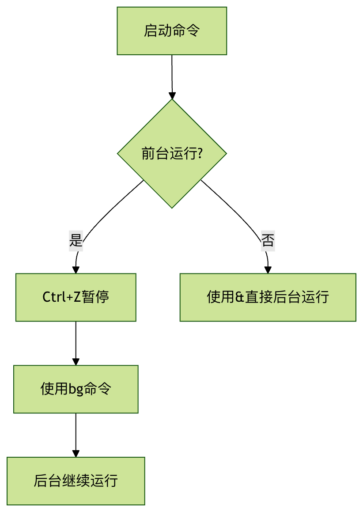

# Linux bg 命令

[ Linux 命令大全](linux-command-manual.html)

`bg` 是 Linux/Unix 系统中用于作业控制（Job Control）的核心命令之一，全称为 "background"。它的主要功能是将当前暂停的作业（job）转移到后台继续运行。

### 基本概念

  * **前台作业** ：正在终端中运行并占用输入输出的进程
  * **后台作业** ：在终端后台运行，不占用输入输出的进程
  * **作业控制** ：管理前台和后台进程的能力


* * *

## 命令语法

```bash
bg [作业号]
```


### 参数说明

参数 | 说明  
---|---  
无参数 | 作用于当前作业（即最近被暂停的作业）  
作业号 | 指定要操作的作业编号（可通过 `jobs` 命令查看）  
  
* * *

## 使用场景

### 1\. 恢复暂停的作业

当你用 `Ctrl+Z` 暂停一个前台作业后，可以使用 `bg` 命令让它继续在后台运行：

## 实例

```bash
$ sleep 100 # 启动一个长时间运行的命令 ^Z # 按下 Ctrl+Z 暂停 [ 1 ] \+ Stopped sleep 100 $ bg # 让它在后台继续运行 [ 1 ] \+ sleep 100 &
```


### 2\. 指定作业号恢复

当有多个暂停的作业时，可以指定作业号：

## 实例

```bash
$ jobs [ 1 ] \- Stopped vim file1.txt [ 2 ] \+ Stopped python script.py $ bg 2 # 让第二个作业在后台继续运行
```


### 3\. 与 fg 命令配合使用

`bg` 和 `fg`（foreground）是一对互补命令：

  * `bg`：将作业放到后台运行
  * `fg`：将作业带回前台运行


* * *

## 实际应用示例

### 场景：开发中的典型工作流

## 实例

```bash
# 1. 启动编辑器 $ vim app.py # 2. 需要临时执行测试（按下 Ctrl+Z 暂停 vim） ^Z [ 1 ] \+ Stopped vim app.py # 3. 运行测试脚本 $ python test.py # 4. 测试完成后，让编辑器回到后台继续工作 $ bg 1 [ 1 ] \+ vim app.py & # 5. 查看后台作业 $ jobs [ 1 ] \+ Running vim app.py &
```


* * *

## 常见问题解答

### Q1: 如何查看当前有哪些作业？

使用 `jobs` 命令：

## 实例

```bash
$ jobs [ 1 ] \- Running sleep 100 & [ 2 ] \+ Stopped vim notes.txt
```


### Q2: bg 和 & 有什么区别？

  * `&`：在命令启动时直接放到后台
  * `bg`：将已经暂停的作业放到后台


### Q3: 关闭终端后，bg 的作业会怎样？

默认情况下，后台作业会随终端关闭而终止。如需保留，可使用：

## 实例

```bash
nohup command & # 或者使用 tmux/screen
```


* * *

## 进阶技巧

### 1\. 结合 disown 使用

让作业与终端解绑，即使关闭终端也不会终止：

## 实例

```bash
$ sleep 1000 ^Z $ bg $ disown % 1
```


### 2\. 使用作业号快捷方式

  * `%n`：作业号 n
  * `%str`：以 str 开头的作业
  * `%?str`：包含 str 的作业


## 实例

```bash
$ bg % sleep # 恢复包含 "sleep" 的作业
```


* * *

## 总结流程图



掌握 `bg` 命令能显著提高你在 Linux 下的工作效率，特别是在需要同时处理多个任务时。结合 `jobs`、`fg` 和 `kill` 等命令，你可以实现强大的作业控制能力。

[ Linux 命令大全](linux-command-manual.html)
