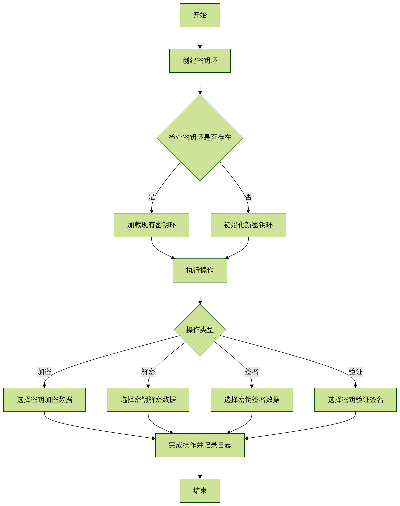

# Linux gpg 命令

[ Linux 命令大全](linux-command-manual.html)

* * *

GPG (GNU Privacy Guard) 是 GNU 项目开发的 OpenPGP 标准实现工具，用于加密、解密数据以及创建和验证数字签名。它是 PGP (Pretty Good Privacy) 的开源替代品，广泛应用于文件加密、电子邮件安全保护和软件包签名验证等场景。

* * *

## 基本语法结构

gpg 命令的基本语法格式如下：

```bash
gpg [选项] [命令] [文件名]
```


### 主要组成部分：

  * **选项** ：控制 GPG 行为的各种参数
  * **命令** ：指定要执行的操作类型
  * **文件名** ：要处理的文件（可选）


* * *

## 常用命令参数

### 密钥管理

参数 | 说明  
---|---  
`--gen-key` | 生成新的密钥对  
`--list-keys` | 列出所有公钥  
`--list-secret-keys` | 列出所有私钥  
`--delete-key` | 删除公钥  
`--delete-secret-key` | 删除私钥  
`--import` | 导入密钥  
`--export` | 导出密钥  
  
### 加密/解密操作

参数 | 说明  
---|---  
`--encrypt` (-e) | 加密文件  
`--decrypt` (-d) | 解密文件  
`--sign` (-s) | 创建签名  
`--verify` | 验证签名  
`--armor` (-a) | 生成 ASCII 格式输出  
  
### 其他常用选项

参数 | 说明  
---|---  
`--recipient` (-r) | 指定接收者密钥  
`--output` (-o) | 指定输出文件  
`--passphrase` | 指定密码短语  
  
* * *

## 实际应用示例

### 1\. 生成密钥对

```bash
gpg --gen-key
```


执行后会交互式询问：

  1. 密钥类型（通常选择默认 RSA 和 RSA）
  2. 密钥长度（推荐 4096 位）
  3. 密钥有效期
  4. 用户标识信息（姓名和邮箱）
  5. 密码短语


### 2\. 加密文件

```bash
gpg --encrypt --recipient alice@example.com --output secret.txt.gpg secret.txt
```


  * `--recipient` 指定接收者的公钥（通过邮箱识别）
  * `--output` 指定加密后的输出文件
  * 最后一个参数是要加密的原始文件


### 3\. 解密文件

```bash
gpg --decrypt --output plain.txt secret.txt.gpg
```


系统会提示输入私钥密码短语

### 4\. 创建和验证签名

创建签名：

```bash
gpg --sign --output document.sig document.txt
```


验证签名：

```bash
gpg --verify document.sig document.txt
```


### 5\. 导出公钥

```bash
gpg --armor --export alice@example.com &gt; alice.pub.asc
```


`--armor` 选项生成 ASCII 格式的公钥文件

* * *

## 密钥管理实践

### 密钥环操作流程



### 密钥信任关系设置

  1. 导入他人的公钥：

```bash
gpg --import bob.pub.asc
```

  2. 验证密钥指纹：

```bash
gpg --fingerprint bob@example.com
```

  3. 签署密钥建立信任：

```bash
gpg --sign-key bob@example.com
```


* * *

## 常见问题解答

### 1\. 如何避免每次解密都要输入密码？

使用 gpg-agent 缓存密码：

```bash
gpg --use-agent --decrypt file.gpg
```


### 2\. 如何撤销丢失的密钥？

  1. 生成撤销证书：

```bash
gpg --gen-revoke your@email.com &gt; revoke.asc
```

  2. 发布撤销证书：

```bash
gpg --import revoke.asc
```


### 3\. 加密大文件的最佳实践？

使用对称加密结合非对称加密：

```bash
gpg --symmetric --cipher-algo AES256 largefile.iso
```


* * *

## 安全注意事项

  1. **私钥保护** ：私钥文件应妥善保管，建议使用强密码短语
  2. **密钥备份** ：定期备份密钥环和撤销证书
  3. **算法选择** ：推荐使用 AES-256 和 RSA-4096 等强加密算法
  4. **密钥过期** ：设置合理的密钥有效期，定期更新
  5. **元数据泄露** ：加密时不保留文件名等元数据，可使用 `--throw-keyids` 选项


通过掌握 gpg 命令，你可以有效保护敏感数据的安全，实现安全的文件传输和身份验证。建议在实际使用前，先在测试环境中熟悉各项操作。

* * *

[ Linux 命令大全](linux-command-manual.html)
