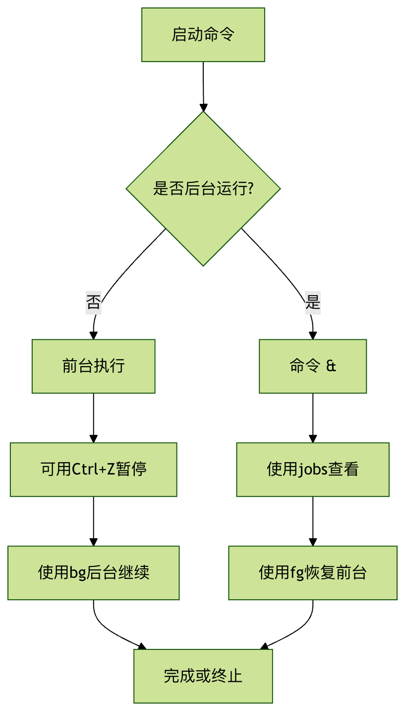

# Linux jobs 命令

[ Linux 命令大全](linux-command-manual.html)

`jobs` 是 Linux/Unix 系统中用于查看和管理当前 shell 会话中后台任务的内置命令。它允许用户：

  * 查看所有后台运行的作业状态
  * 控制作业的前后台切换
  * 管理多个并发任务的执行


当你在终端中运行耗时较长的命令时，`jobs` 命令能帮助你高效地管理这些后台进程。

* * *

## 基本语法

```bash
jobs [选项] [作业标识符]
```


### 常用选项

选项 | 说明  
---|---  
`-l` | 显示作业的 PID（进程ID）  
`-p` | 仅显示作业的进程组ID  
`-n` | 仅显示自上次通知后状态发生变化的作业  
`-r` | 仅显示运行中的作业  
`-s` | 仅显示已停止的作业  
  
* * *

## 核心功能详解

### 1\. 查看后台作业

最简单的用法是直接输入 `jobs` 命令：

## 实例

```bash
$ jobs [ 1 ] \- running sleep 100 & [ 2 ] \+ stopped vim file.txt
```


输出说明：

  * `[1]`：作业编号（Job ID）
  * `-`/`+`：`-`表示前一个作业，`+`表示当前作业
  * `running`/`stopped`：作业状态
  * 最后是启动该作业的命令


### 2\. 显示详细进程信息

使用 `-l` 选项查看作业的进程ID：

## 实例

```bash
$ jobs -l [ 1 ] \- 12345 running sleep 100 & [ 2 ] \+ 12356 stopped vim file.txt
```


### 3\. 过滤特定状态的作业

## 实例

```bash
# 只查看运行中的作业 $ jobs -r # 只查看已停止的作业 $ jobs -s
```


* * *

## 实际应用场景

### 场景1：长时间任务后台运行

## 实例

```bash
# 启动一个耗时任务并放到后台 $ long_running_command & # 查看后台作业 $ jobs [ 1 ] \+ running long_running_command &
```


### 场景2：暂停和恢复作业

## 实例

```bash
# 启动vim $ vim file.txt # 按 Ctrl+Z 暂停vim ^Z [ 1 ] \+ stopped vim file.txt # 查看已停止的作业 $ jobs -s [ 1 ] \+ stopped vim file.txt # 将vim恢复到前台运行 $ fg % 1
```


### 场景3：管理多个后台作业

## 实例

```bash
# 启动三个后台任务 $ sleep 100 & $ sleep 200 & $ sleep 300 & # 查看所有作业 $ jobs -l [ 1 ] 12345 running sleep 100 & [ 2 ] -12356 running sleep 200 & [ 3 ] \+ 12367 running sleep 300 & # 将作业2恢复到前台 $ fg % 2 # 终止作业3 $ kill % 3
```


* * *

## 作业控制命令组合

`jobs` 通常与其他作业控制命令配合使用：

命令 | 说明 | 示例  
---|---|---  
`&` | 将命令放到后台运行 | `command &`  
`Ctrl+Z` | 暂停当前前台作业 | 按键组合  
`fg` | 将作业恢复到前台 | `fg %1`  
`bg` | 在后台继续运行已停止的作业 | `bg %2`  
`kill` | 终止指定作业 | `kill %3`  
  
* * *

## 常见问题解答

### Q1: 为什么关闭终端后后台作业会终止？

A: 默认情况下，后台作业与终端会话关联。使用 `nohup` 或 `disown` 可以使作业在终端关闭后继续运行：

## 实例

```bash
$ nohup long_running_command &
```


### Q2: 如何引用特定的作业？

A: 使用 `%` 加作业编号：

  * `%1`：作业1
  * `%2`：作业2
  * `%+` 或 `%%`：当前作业
  * `%-`：前一个作业


### Q3: jobs 和 ps 命令有什么区别？

A: 

  * `jobs` 只显示当前 shell 会话中的作业
  * `ps` 显示系统所有进程，包括其他用户和终端的进程


* * *

## 最佳实践建议

  1. **为后台作业重定向输出** ：避免输出干扰当前终端

```bash
$ command > output.log 2>&1 &
```

  2. **使用描述性名称** ：方便识别不同作业

```bash
$ (sleep 300; echo "Done") &
```

  3. **定期检查作业状态** ：防止积累大量未完成作业

```bash
$ watch -n 60 jobs
```

  4. **重要作业使用 nohup** ：确保终端断开后继续运行

```bash
$ nohup important_command &
```


* * *

## 总结流程图



[ Linux 命令大全](linux-command-manual.html)
