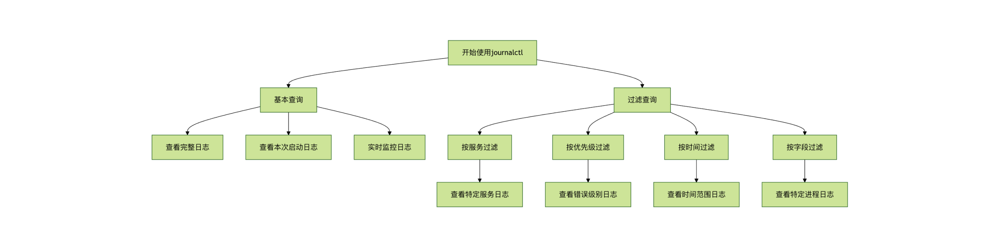

# Linux journalctl 命令

[ Linux 命令大全](linux-command-manual.html)

* * *

## 什么是 journalctl？

journalctl 是 Linux 系统中用于查询和显示 systemd 日志的强大工具。作为 systemd 生态系统的一部分，它提供了集中化的日志管理功能，替代了传统的 syslog 服务。

### 核心特点

  1. **二进制日志存储** ：日志以二进制格式存储，提高检索效率
  2. **结构化日志** ：支持附加元数据和结构化日志字段
  3. **实时监控** ：可以实时跟踪日志变化
  4. **多种过滤方式** ：支持按时间、服务、优先级等多种条件过滤


* * *

## 基本语法

journalctl 的基本命令格式如下：

```bash
journalctl [选项] [匹配条件...]
```


### 常用选项概览

选项 | 说明  
---|---  
`-b` | 显示本次启动的日志  
`-f` | 跟踪日志（类似 tail -f）  
`-k` | 只显示内核消息  
`-u` | 显示指定单元的日志  
`-n` | 显示最近的n条日志  
`--since` | 显示指定时间之后的日志  
`--until` | 显示指定时间之前的日志  
  
* * *

## 常用操作示例

### 1\. 查看完整系统日志

## 实例

```bash
journalctl
```


### 2\. 查看本次启动的日志

## 实例

```bash
journalctl -b
```


### 3\. 实时监控新日志

## 实例

```bash
journalctl -f
```


### 4\. 查看特定服务的日志

## 实例

```bash
journalctl -u nginx.service
```


### 5\. 按时间范围查询

## 实例

```bash
journalctl \--since "2023-01-01 00:00:00" \--until "2023-01-02 12:00:00"
```


### 6\. 查看错误级别的日志

## 实例

```bash
journalctl -p err
```


* * *

## 日志优先级过滤

journalctl 支持按日志优先级过滤，优先级定义如下：

优先级 | 数值 | 说明  
---|---|---  
emerg | 0 | 紧急情况  
alert | 1 | 需要立即处理  
crit | 2 | 严重错误  
err | 3 | 一般错误  
warning | 4 | 警告信息  
notice | 5 | 需要注意的情况  
info | 6 | 一般信息  
debug | 7 | 调试信息  
  
使用示例：

## 实例

```bash
# 显示错误及以上级别的日志 journalctl -p err # 显示警告及以上级别的日志 journalctl -p warning
```


* * *

## 高级用法

### 1\. 显示日志占用的磁盘空间

## 实例

```bash
journalctl \--disk-usage
```


### 2\. 清理旧日志

## 实例

```bash
# 保留最近2天的日志 journalctl \--vacuum-time =2d # 限制日志最大占用500MB journalctl \--vacuum-size =500M
```


### 3\. 以JSON格式输出

## 实例

```bash
journalctl -o json
```


### 4\. 显示完整的字段信息

## 实例

```bash
journalctl -o verbose
```


### 5\. 按特定字段过滤

## 实例

```bash
# 显示特定进程ID的日志 journalctl _PID = 1234 # 显示特定用户的日志 journalctl _UID = 1000
```


* * *

## 实用技巧

### 1\. 组合查询

## 实例

```bash
# 查询nginx服务从昨天开始的错误日志 journalctl -u nginx.service \--since yesterday -p err
```


### 2\. 分页查看

## 实例

```bash
journalctl | less
```


### 3\. 导出日志到文件

## 实例

```bash
journalctl \--since "2023-01-01" > journal.log
```


### 4\. 查看内核环缓冲区消息

## 实例

```bash
journalctl -k
```


### 5\. 查看系统启动过程日志

## 实例

```bash
journalctl -b0 | grep "Starting"
```


* * *

## 常见问题解决

### 问题1：日志显示不完整

**解决方案** ：

## 实例

```bash
# 增加输出行数限制 journalctl \--no-pager
```


### 问题2：如何查看被轮转的旧日志？

**解决方案** ：

## 实例

```bash
# 查看所有日志（包括归档的） journalctl -a
```


### 问题3：如何查看特定时间点的日志？

**解决方案** ：

## 实例

```bash
# 精确到秒的时间查询 journalctl \--since "2023-01-01 12:00:00" \--until "2023-01-01 12:05:00"
```


* * *

## 总结流程图



[ Linux 命令大全](linux-command-manual.html)
