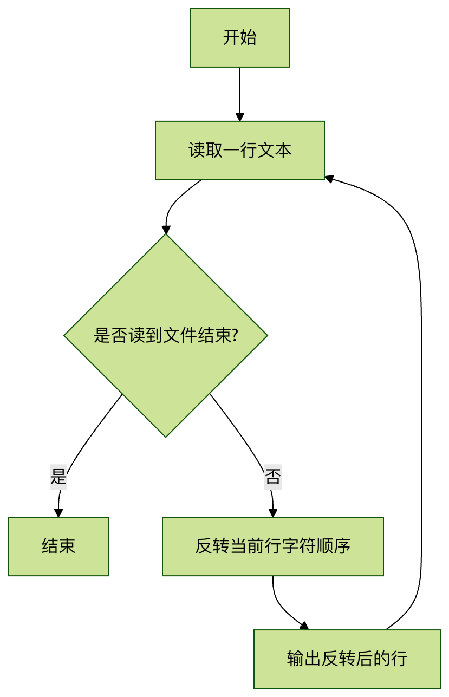

# Linux rev 命令 

[ Linux 命令大全](linux-command-manual.html)

* * *

## 一、rev 命令概述

rev 是 Linux 系统中一个简单但实用的文本处理命令，它的功能是将输入文本的每一行字符顺序反转（reverse）。这个命令名称正是 "reverse" 的缩写。

### 基本功能

  * 反转每行文本的字符顺序
  * 保持行与行之间的顺序不变
  * 处理标准输入或文件内容


### 典型应用场景

  1. 测试文本处理能力
  2. 检查回文（palindrome）
  3. 特殊格式数据处理
  4. 调试和文本分析


* * *

## 二、命令语法与参数

### 基本语法

```bash
rev [选项] [文件...]
```


### 参数说明

rev 命令非常简洁，大多数 Linux 实现中不包含任何选项参数：

参数 | 说明  
---|---  
文件 | 指定要处理的文件（可多个），如果不指定则读取标准输入  
-V/--version | 显示版本信息（某些实现支持）  
-h/--help | 显示帮助信息（某些实现支持）  
  
> 注意：不同 Linux 发行版的 rev 实现可能略有差异，可用 `man rev` 查看具体说明

* * *

## 三、使用示例

### 示例 1：基本用法

反转标准输入的内容：

## 实例

```bash
$ echo "hello world" | rev dlrow olleh
```


### 示例 2：处理文件内容

假设有文件 `example.txt` 内容为：

```bash
Linux Command rev
```


执行反转：

## 实例

```bash
$ rev example.txt xuniL dnammoC ver
```


### 示例 3：多文件处理

## 实例

```bash
$ rev file1.txt file2.txt
```


会依次显示两个文件内容的反转结果

### 示例 4：检查回文

## 实例

```bash
$ echo "madam" | rev | grep -q "madam" && echo "是回文" || echo "不是回文" 是回文
```


* * *

## 四、工作原理

rev 命令的内部处理流程：



关键点：

  1. 按行处理文本，保持行顺序不变
  2. 每行字符顺序完全反转（包括空格和特殊字符）
  3. 不修改原始文件内容


* * *

## 五、注意事项与技巧

### 常见问题

**不可见字符** ：rev 会反转所有字符，包括空格、制表符等

## 实例

```bash
$ echo -e "a \t b" | rev b a
```


**多字节字符** ：某些实现可能无法正确处理 Unicode 字符

## 实例

```bash
$ echo "中文" | rev # 可能显示异常
```


### 实用技巧

结合其他命令创建复杂管道：

## 实例

```bash
$ cat / etc / passwd | rev | cut -d: -f1 | head -5
```


快速反转文件并保存：

## 实例

```bash
$ rev input.txt > output.txt
```


检查对称性：

## 实例

```bash
$ diff -s < ( cat file.txt ) < ( rev file.txt | rev )
```


* * *

## 六、实践练习

### 练习 1：基础操作

  1. 创建一个包含多行文本的文件
  2. 使用 rev 命令反转文件内容
  3. 将结果重定向到新文件


### 练习 2：高级应用

编写一个 shell 脚本，实现以下功能：

  * 接受一个文件作为参数
  * 检查文件中是否存在回文行
  * 输出所有回文行及其行号


参考解决方案：

## 实例

```bash
#!/bin/bash while IFS = read -r line; do reversed =$ ( echo " $line " | rev ) if [ " $line " = " $reversed " ] ; then echo "回文行: $line " fi done < "$1"
```


* * *

## 七、总结

rev 命令虽然简单，但在文本处理中有着独特的价值：

  * 极简设计：单一功能的 Unix 哲学典范
  * 管道友好：完美适应 Linux 命令管道体系
  * 教学价值：帮助理解文本处理的基本概念


掌握 rev 命令可以：

  1. 增强对 Linux 文本处理工具链的理解
  2. 为学习更复杂的文本处理命令（如 sed、awk）打下基础
  3. 解决某些特殊的文本处理需求


建议进一步学习：

  * `tac` 命令（反向输出行顺序）
  * `sed` 命令的文本转换功能
  * `awk` 的字符串处理函数


[ Linux 命令大全](linux-command-manual.html)
