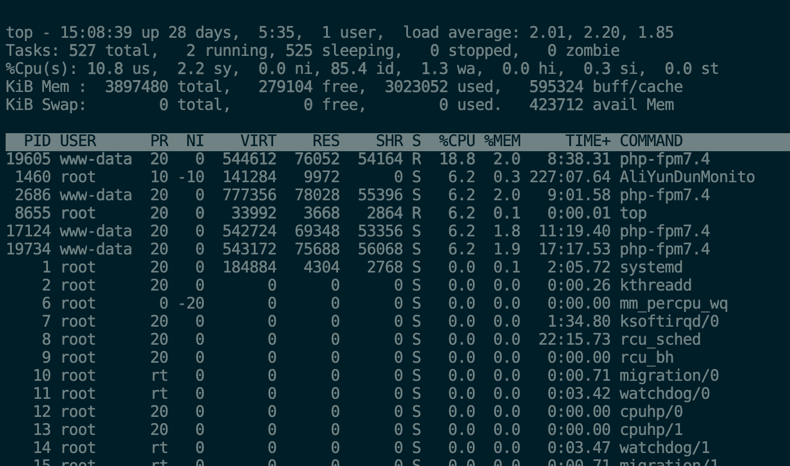

# Linux top 命令

[ Linux 命令大全](linux-command-manual.html)

Linux **top** 是一个在 Linux 和其他类 Unix 系统上常用的实时系统监控工具。它提供了一个动态的、交互式的实时视图，显示系统的整体性能信息以及正在运行的进程的相关信息。

使用权限：所有使用者。

### 语法

```bash
top [-] [d delay] [q] [c] [S] [s] [i] [n] [b]
```


**参数说明** ：

  * `-d <秒数>`：指定 top 命令的刷新时间间隔，单位为秒。
  * `-n <次数>`：指定 top 命令运行的次数后自动退出。
  * `-p <进程ID>`：仅显示指定进程ID的信息。
  * `-u <用户名>`：仅显示指定用户名的进程信息。
  * `-H`：在进程信息中显示线程详细信息。
  * `-i`：不显示闲置（idle）或无用的进程。
  * `-b`：以批处理（batch）模式运行，直接将结果输出到文件。
  * `-c`：显示完整的命令行而不截断。
  * `-S`：累计显示进程的 CPU 使用时间。


### 显示信息

top 命令的一些常用功能和显示信息：



总体系统信息：

  * uptime：系统的运行时间和平均负载。
  * tasks：当前运行的进程和线程数目。
  * CPU：总体 CPU 使用率和各个核心的使用情况。
  * 内存（Memory）：总体内存使用情况、可用内存和缓存。


进程信息：

  * PID：进程的标识符。
  * USER：运行进程的用户名。
  * PR（优先级）：进程的优先级。
  * NI（Nice值）：进程的优先级调整值。
  * VIRT（虚拟内存）：进程使用的虚拟内存大小。
  * RES（常驻内存）：进程实际使用的物理内存大小。
  * SHR（共享内存）：进程共享的内存大小。
  * %CPU：进程占用 CPU 的使用率。
  * %MEM：进程占用内存的使用率。
  * TIME+：进程的累计 CPU 时间。


功能和交互操作：

  * 按键命令：在 top 运行时可以使用一些按键命令进行操作，如按下 "k" 可以终止一个进程，按下 "h" 可以显示帮助信息等。
  * 排序：可以按照 CPU 使用率、内存使用率、进程 ID 等对进程进行排序。
  * 刷新频率：可以设置 top 的刷新频率，以便动态查看系统信息。


### 实例

显示进程信息

```bash
# top
```


显示完整命令

```bash
# top -c
```


以批处理模式显示程序信息

```bash
# top -b
```


以累积模式显示程序信息

```bash
# top -S
```


设置信息更新次数

```bash
top -n 2 //表示更新两次后终止更新显示
```


设置信息更新时间

```bash
# top -d 3 //表示更新周期为3秒
```


显示指定的进程信息

```bash
# top -p 139 //显示进程号为139的进程信息，CPU、内存占用率等
```


显示更新十次后退出

```bash
top -n 10
```


使用者将不能利用交谈式指令来对行程下命令

```bash
top -s
```


[ Linux 命令大全](linux-command-manual.html)
