# Linux apt 命令

apt（Advanced Packaging Tool）是一个在 Debian 和 Ubuntu 中的 Shell 前端软件包管理器。 

apt 命令提供了查找、安装、升级、删除某一个、一组甚至全部软件包的命令，而且命令简洁而又好记。 

apt 命令执行需要超级管理员权限(root)。

### apt 语法

```bash
apt [options] [command] [package ...]
```


  * **options：** 可选，选项包括 -h（帮助），-y（当安装过程提示选择全部为"yes"），-q（不显示安装的过程）等等。 
  * **command：** 要进行的操作。 
  * **package** ：安装的包名。


* * *

## apt 常用命令

  * 列出所有可更新的软件清单命令：`sudo apt update`

  * 升级软件包：`sudo apt upgrade`

列出可更新的软件包及版本信息：`apt list --upgradable`

升级软件包，升级前先删除需要更新软件包：`sudo apt full-upgrade`

  * 安装指定的软件命令：`sudo apt install <package_name>`

安装多个软件包：`sudo apt install <package_1> <package_2> <package_3>`

  * 更新指定的软件命令：`sudo apt update <package_name>`

  * 显示软件包具体信息,例如：版本号，安装大小，依赖关系等等：`sudo apt show <package_name>`

  * 删除软件包命令：`sudo apt remove <package_name>`

  * 清理不再使用的依赖和库文件: `sudo apt autoremove`

  * 移除软件包及配置文件: `sudo apt purge <package_name>`

  * 查找软件包命令： `sudo apt search <keyword>`

  * 列出所有已安装的包：`apt list --installed`

  * 列出所有已安装的包的版本信息：`apt list --all-versions`


### 实例

查看一些可更新的包： 

```bash
sudo apt update
```


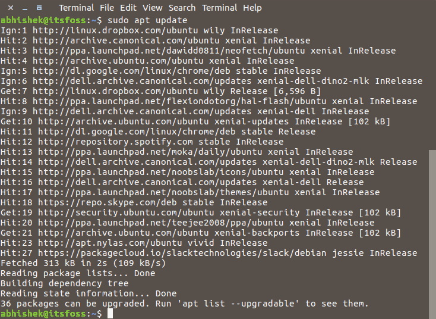

升级安装包：

```bash
sudo apt upgrade
```


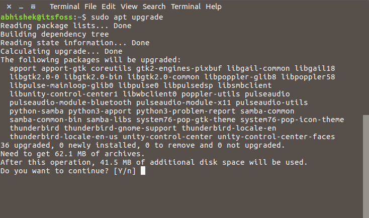

在以上交互式输入字母 **Y** 即可开始升级。

可以将以下两个命令组合起来，一键升级：

```bash
sudo apt update && sudo apt upgrade -y
```


安装 mplayer 包：

```bash
sudo apt install mplayer
```


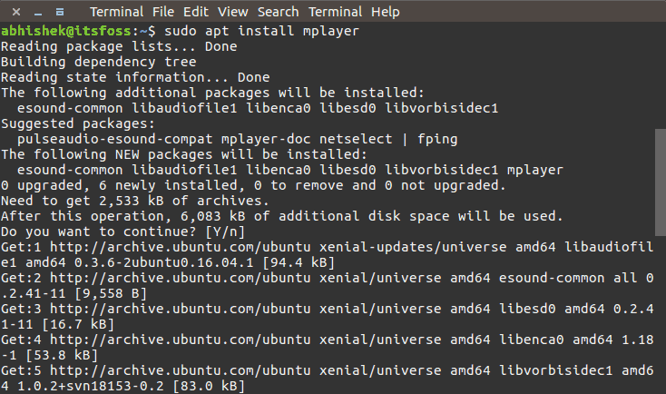

如过不太记得完整的包名，我们可以只输入前半部分的包名，然后按下 `Tab` 键，会列出相关的包名：

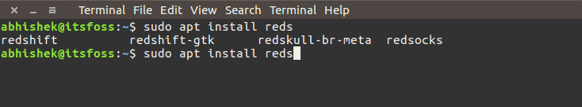

以上实例我们输入来 **reds** ，然后按下 `Tab` 键，输出来四个相关的包。

如果我们想安装一个软件包，但如果软件包已经存在，则不要升级它，可以使用 `–no-upgrade` 选项:

```bash
sudo apt install <package_name> \--no-upgrade
```


安装 mplayer 如果存在则不要升级：

```bash
sudo apt install mplayer --no-upgrade
```


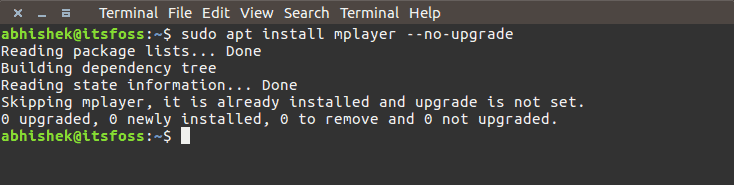

如果只想升级，不要安装可以使用 `--only-upgrade` 参数：

```bash
sudo apt install <package_name> \--only-upgrade
```


只升级 mplayer，如果不存在就不要安装它：

```bash
sudo apt install mplayer --only-upgrade
```


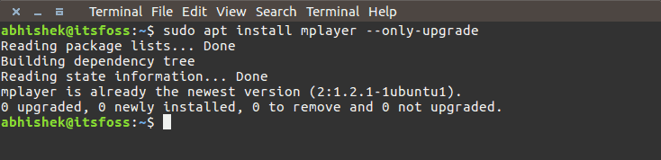

如果需要设置指定版本，语法格式如下：

```bash
sudo apt install <package_name>=<version_number>
```


**package_name** 为包名，**version_number** 为版本号。

移除包可以使用 remove 命令：

```bash
sudo apt remove mplayer
```


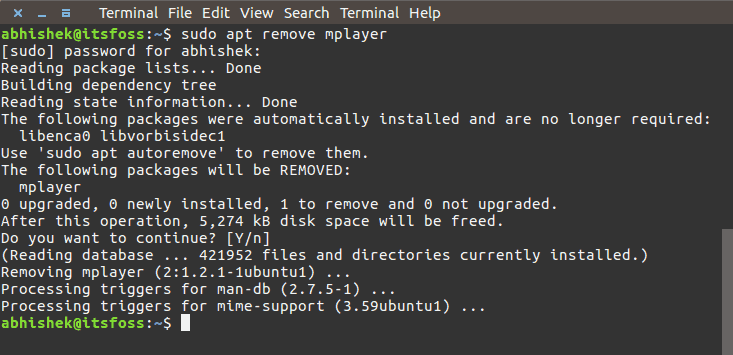

查找名为 libimobile 的相关包：

```bash
apt search libimobile
```


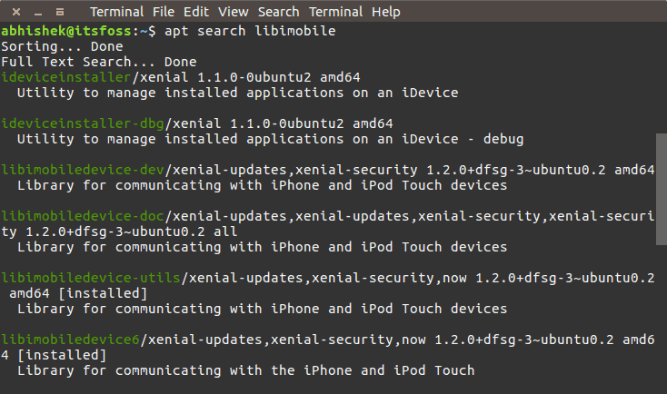

查看 pinta 包的相关信息：

```bash
apt show pinta
```


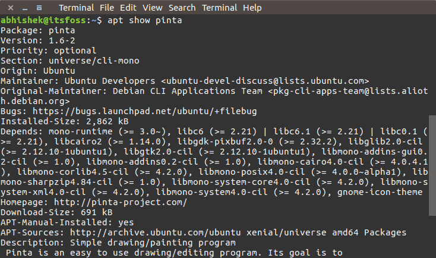

列出可更新的软件包：

```bash
apt list --upgradeable
```


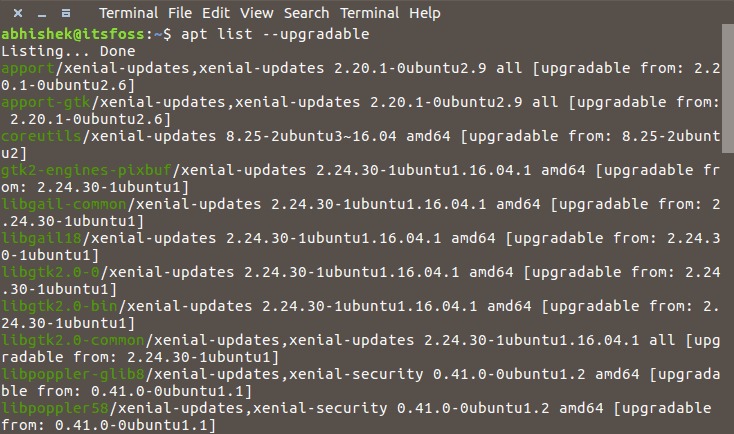

清理不再使用的依赖和库文件：

```bash
sudo apt autoremove
```


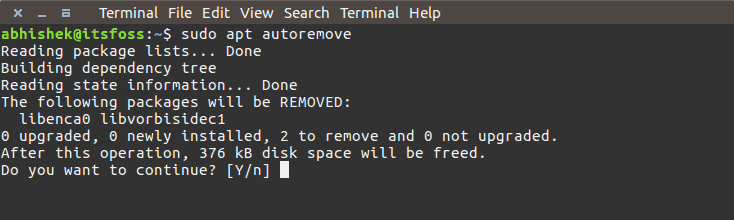

在以上交互式输入字母 **Y** 即可开始清理。
