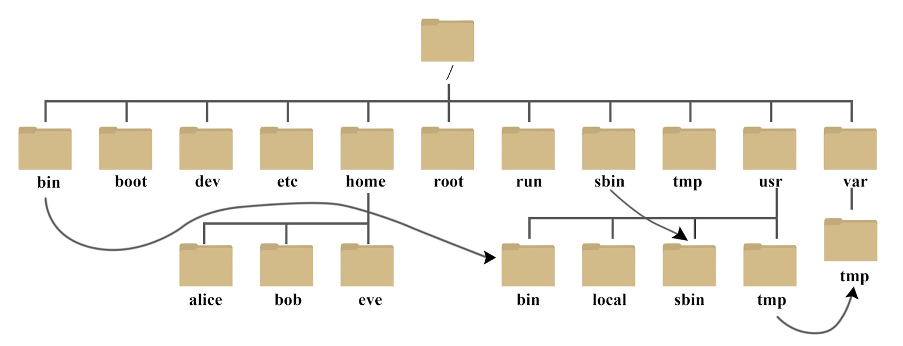
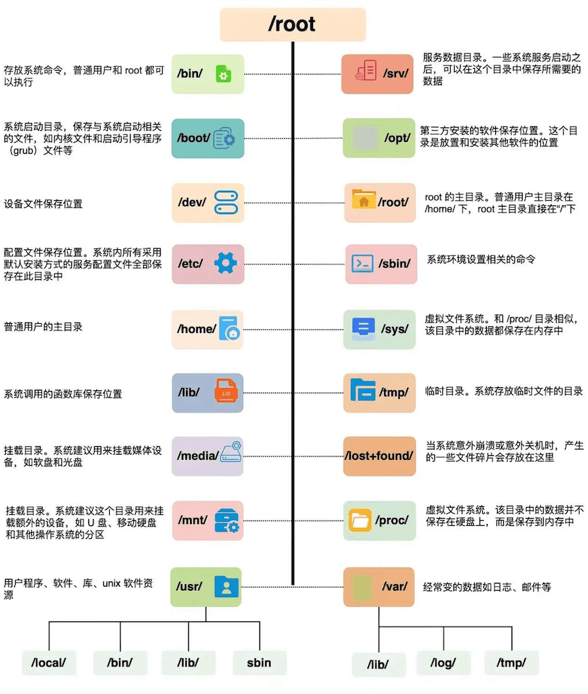

# Linux  系统目录结构

登录系统后，在当前命令窗口下输入命令：

```bash
ls /
```


你会看到如下图所示:


树状目录结构：





以下是对这些目录的解释：

目录 | 作用详解 | 常见文件 / 示例  
---|---|---  
`/` | 根文件系统，所有挂载点与路径的起点。包含系统必须的子目录与入口结构。 | 无具体数据文件，只有子目录结构。  
`/bin` | 系统启动和单用户模式下必须的基础命令，所有用户可执行。 | `ls`, `cp`, `mv`, `rm`, `bash`  
`/sbin` | 系统管理与维护命令，面向 root。 | `fsck`, `reboot`, `shutdown`  
`/usr` | 用户级程序与库的主集合，包含大部分系统软件、文档与工具。 | `/usr/bin`, `/usr/lib`, `/usr/share`  
`/usr/bin` | 常规用户程序的主要放置目录。 | `python3`, `vim`, `git`  
`/usr/sbin` | 管理工具的扩展集合。 | `useradd`, `apache2ctl`  
`/usr/lib` | `/usr` 内程序所依赖的动态库与模块。 | 各类 `.so` 动态库  
`/usr/local` | 本机安装或编译软件的独立区域。 | `/usr/local/bin`, `/usr/local/lib`  
`/lib` 或 `/lib64` | 系统启动核心库、动态链接器所在位置。 | `libc.so.6`, `ld-linux.so`  
`/etc` | 系统级配置中心，统一存放所有服务和系统配置。 | `passwd`, `group`, `fstab`, `ssh/sshd_config`  
`/home` | 普通用户的个人主目录集合。 | `/home/user/.bashrc`, `/home/user/Documents`  
`/root` | root 用户的主目录。 | `/root/.ssh/`  
`/var` | 频繁变化的数据：日志、缓存、数据库运行文件等。 | `/var/log`, `/var/lib`, `/var/cache`  
`/var/log` | 所有系统与服务日志的集中位置。 | `syslog`, `auth.log`, `kern.log`  
`/var/cache` | 应用和包管理器缓存。 | `/var/cache/apt/`  
`/var/lib` | 服务的持久化状态数据。 | `mysql/`, `docker/`  
`/tmp` | 程序运行时的临时文件区，随时可清理。 | 临时文件、socket 路径  
`/boot` | 启动所需文件：内核、initramfs、引导配置。 | `vmlinuz-*`, `initrd.img`, `grub/grub.cfg`  
`/dev` | 设备节点集合，文件即设备。 | `/dev/sda`, `/dev/null`, `/dev/tty0`  
`/proc` | 由内核提供的虚拟文件系统，展示系统与进程的实时信息。 | `/proc/cpuinfo`, `/proc/<pid>/`  
`/sys` | 设备、驱动、内核子系统的状态接口。 | `/sys/class/net/`, `/sys/block/`  
`/mnt` | 手动挂载的临时挂载点。 | `/mnt/usb`  
`/media` | 自动挂载外接设备的默认位置。 | `/media/user/USB_DRIVE`  
`/run` | 运行时数据存放点，重启后清空。 | `*.pid`, 运行状态 socket 文件  
  
在 Linux 中，下列目录属于系统关键区，误删或乱改都会直接破坏系统运行：

**/etc — 系统配置核心**

所有关键配置集中于此。任何错误修改都可能导致服务挂掉，甚至系统无法启动。

**/bin、/sbin、/usr/bin、/usr/sbin — 系统指令区**

系统预置命令的所在位置。

  * **/bin、/usr/bin** ：供普通用户使用的基础指令（如 `ls` 位于 `/bin/ls`）。
  * **/sbin、/usr/sbin** ：系统管理指令，主要由 root 使用。


**/var — 动态数据区**

系统运行时不断写入的数据都落在这里。  
重点是 **/var/log** ，各种服务日志全部存放此处；邮件、缓存、队列等内容也在此目录下维护。

* * *
