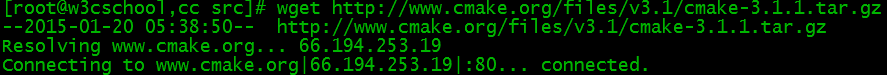
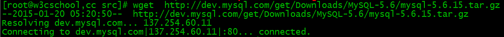
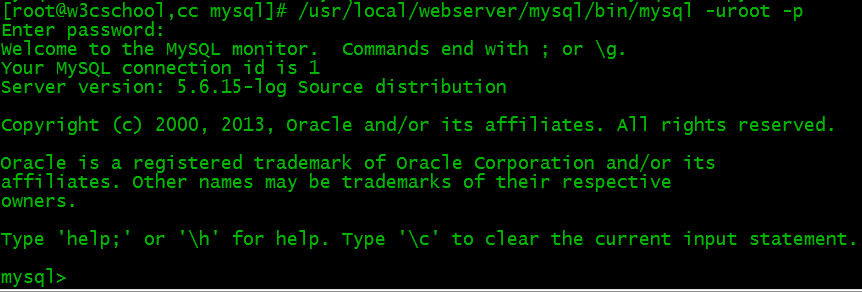

# MySQL 安装配置

MySQL 是最流行的关系型数据库管理系统，由瑞典MySQL AB公司开发，目前属于Oracle公司。

MySQL所使用的SQL语言是用于访问数据库的最常用标准化语言。

MySQL由于其体积小、速度快、总体拥有成本低，尤其是开放源码这一特点，一般中小型网站的开发都选择MySQL作为网站数据库。

* * *

## MySQL 安装

本教程的系统平台：CentOS release 6.6 (Final) 64位。

### 一、安装编译工具及库文件

```bash
yum -y install gcc gcc-c++ make autoconf libtool-ltdl-devel gd-devel freetype-devel libxml2-devel libjpeg-devel libpng-devel openssl-devel curl-devel bison patch unzip libmcrypt-devel libmhash-devel ncurses-devel sudo bzip2 flex libaio-devel
```


### 二、 安装cmake 编译器

cmake 版本：cmake-3.1.1。

1、下载地址：<http://www.cmake.org/files/v3.1/cmake-3.1.1.tar.gz>

```bash $ wget http://www.cmake.org/files/v3.1/cmake-3.1.1.tar.gz ``` 

2、解压安装包

```bash
$ tar zxvf cmake-3.1.1.tar.gz
```


3、进入安装包目录 

```bash
$ cd cmake-3.1.1
```


4、编译安装 

```bash
$ ./bootstrap $ make && make install
```


* * *

### 三、安装 MySQL

MySQL版本：mysql-5.6.15。

1、下载地址： <http://dev.mysql.com/get/Downloads/MySQL-5.6/mysql-5.6.15.tar.gz>

```bash $ wget http://dev.mysql.com/get/Downloads/MySQL-5.6/mysql-5.6.15.tar.gz ``` 

2、解压安装包 

```bash
$ tar zxvf mysql-5.6.15.tar.gz
```


3、进入安装包目录 

```bash
$ cd mysql-5.6.15
```


4、编译安装 

```bash
$ cmake -DCMAKE_INSTALL_PREFIX=/usr/local/webserver/mysql/ -DMYSQL_UNIX_ADDR=/tmp/mysql.sock -DDEFAULT_CHARSET=utf8 -DDEFAULT_COLLATION=utf8_general_ci -DWITH_EXTRA_CHARSETS=all -DWITH_MYISAM_STORAGE_ENGINE=1 -DWITH_INNOBASE_STORAGE_ENGINE=1 -DWITH_MEMORY_STORAGE_ENGINE=1 -DWITH_READLINE=1 -DWITH_INNODB_MEMCACHED=1 -DWITH_DEBUG=OFF -DWITH_ZLIB=bundled -DENABLED_LOCAL_INFILE=1 -DENABLED_PROFILING=ON -DMYSQL_MAINTAINER_MODE=OFF -DMYSQL_DATADIR=/usr/local/webserver/mysql/data -DMYSQL_TCP_PORT=3306 $ make && make install
```


5、查看mysql版本:

```bash $ /usr/local/webserver/mysql/bin/mysql --version ``` 

到此，mysql安装完成。

* * *

##  MySQL 配置

1、创建mysql运行使用的用户mysql： 

```bash
$ /usr/sbin/groupadd mysql $ /usr/sbin/useradd -g mysql mysql
```


2、创建binlog和库的存储路径并赋予mysql用户权限 

```bash
$ mkdir -p /usr/local/webserver/mysql/binlog /www/data_mysql $ chown mysql.mysql /usr/local/webserver/mysql/binlog/ /www/data_mysql/
```


3、创建my.cnf配置文件 

将/etc/my.cnf替换为下面内容 

```bash
$ cat /etc/my.cnf [client] port = 3306 socket = /tmp/mysql.sock [mysqld] replicate-ignore-db = mysql replicate-ignore-db = test replicate-ignore-db = information_schema user = mysql port = 3306 socket = /tmp/mysql.sock basedir = /usr/local/webserver/mysql datadir = /www/data_mysql log-error = /usr/local/webserver/mysql/mysql_error.log pid-file = /usr/local/webserver/mysql/mysql.pid open_files_limit = 65535 back_log = 600 max_connections = 5000 max_connect_errors = 1000 table_open_cache = 1024 external-locking = FALSE max_allowed_packet = 32M sort_buffer_size = 1M join_buffer_size = 1M thread_cache_size = 600 #thread_concurrency = 8 query_cache_size = 128M query_cache_limit = 2M query_cache_min_res_unit = 2k default-storage-engine = MyISAM default-tmp-storage-engine=MYISAM thread_stack = 192K transaction_isolation = READ-COMMITTED tmp_table_size = 128M max_heap_table_size = 128M log-slave-updates log-bin = /usr/local/webserver/mysql/binlog/binlog binlog-do-db=oa_fb binlog-ignore-db=mysql binlog_cache_size = 4M binlog_format = MIXED max_binlog_cache_size = 8M max_binlog_size = 1G relay-log-index = /usr/local/webserver/mysql/relaylog/relaylog relay-log-info-file = /usr/local/webserver/mysql/relaylog/relaylog relay-log = /usr/local/webserver/mysql/relaylog/relaylog expire_logs_days = 10 key_buffer_size = 256M read_buffer_size = 1M read_rnd_buffer_size = 16M bulk_insert_buffer_size = 64M myisam_sort_buffer_size = 128M myisam_max_sort_file_size = 10G myisam_repair_threads = 1 myisam_recover interactive_timeout = 120 wait_timeout = 120 skip-name-resolve #master-connect-retry = 10 slave-skip-errors = 1032,1062,126,1114,1146,1048,1396 #master-host = 192.168.1.2 #master-user = username #master-password = password #master-port = 3306 server-id = 1 loose-innodb-trx=0 loose-innodb-locks=0 loose-innodb-lock-waits=0 loose-innodb-cmp=0 loose-innodb-cmp-per-index=0 loose-innodb-cmp-per-index-reset=0 loose-innodb-cmp-reset=0 loose-innodb-cmpmem=0 loose-innodb-cmpmem-reset=0 loose-innodb-buffer-page=0 loose-innodb-buffer-page-lru=0 loose-innodb-buffer-pool-stats=0 loose-innodb-metrics=0 loose-innodb-ft-default-stopword=0 loose-innodb-ft-inserted=0 loose-innodb-ft-deleted=0 loose-innodb-ft-being-deleted=0 loose-innodb-ft-config=0 loose-innodb-ft-index-cache=0 loose-innodb-ft-index-table=0 loose-innodb-sys-tables=0 loose-innodb-sys-tablestats=0 loose-innodb-sys-indexes=0 loose-innodb-sys-columns=0 loose-innodb-sys-fields=0 loose-innodb-sys-foreign=0 loose-innodb-sys-foreign-cols=0 slow_query_log_file=/usr/local/webserver/mysql/mysql_slow.log long_query_time = 1 [mysqldump] quick max_allowed_packet = 32M
```


4、初始化数据库 

```bash
$/usr/local/webserver/mysql/scripts/mysql_install_db --defaults-file=/etc/my.cnf --user=mysql
```


显示如下信息： 

```bash
Installing MySQL system tables...2015-01-26 20:18:51 0 [Warning] TIMESTAMP with implicit DEFAULT value is deprecated. Please use --explicit_defaults_for_timestamp server option (see documentation for more details). OK Filling help tables...2015-01-26 20:18:57 0 [Warning] TIMESTAMP with implicit DEFAULT value is deprecated. Please use --explicit_defaults_for_timestamp server option (see documentation for more details). OK ...
```


5、创建开机启动脚本 

```bash
$ cd /usr/local/webserver/mysql/ $ cp support-files/mysql.server /etc/rc.d/init.d/mysqld $ chkconfig --add mysqld $ chkconfig --level 35 mysqld on
```


6、启动mysql服务器 

```bash $ service mysqld start ``` 

7、连接 MySQL

```bash $ /usr/local/webserver/mysql/bin/mysql -u root -p ``` 

## 修改MySQL用户密码

```bash
mysqladmin -u用户名 -p旧密码 password 新密码
```


或进入mysql命令行

```bash
SET PASSWORD FOR '用户名'@'主机' = PASSWORD(‘密码');
```


创建新用户并授权:

```bash
grant all privileges on *.* to 用户名@'%' identified by '密码' with grant option;
```


### 其他命令

  * 启动：service mysqld start
  * 停止：service mysqld stop
  * 重启：service mysqld restart
  * 重载配置：service mysqld reload
