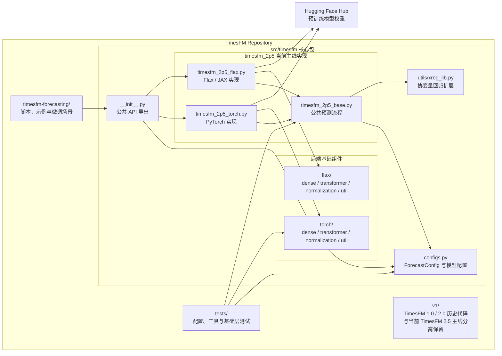
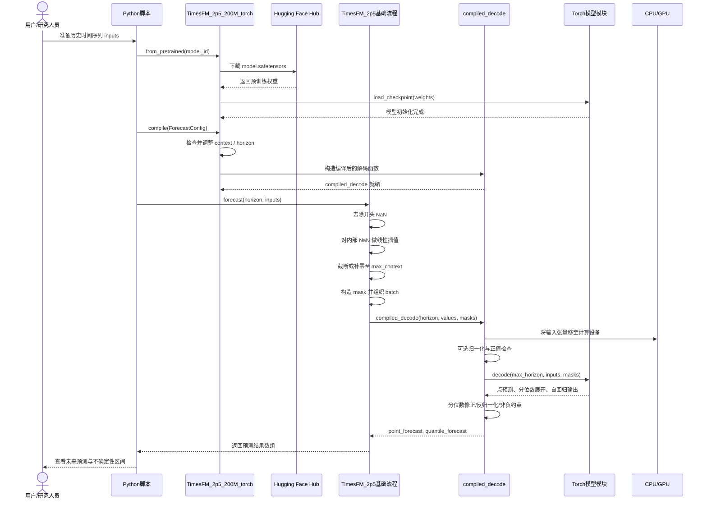
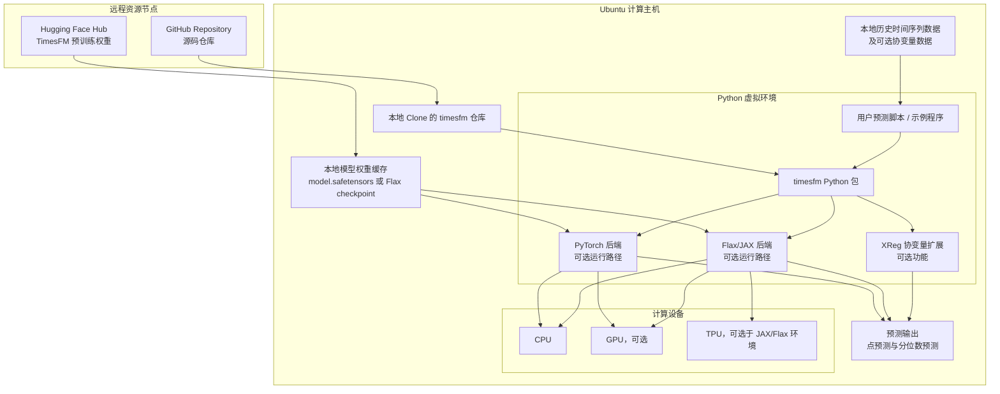
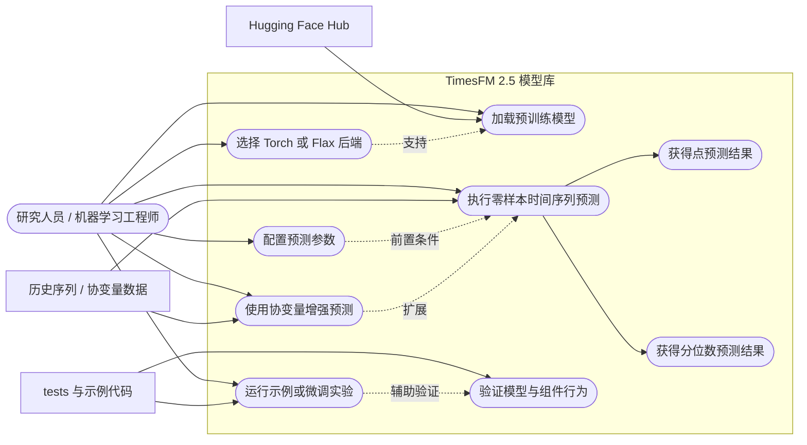

# 软件 需求实验 第10周
## **基本信息**
实验日期：2026 年 5月7 日
姓名：胡江龙
学号：24302016
## 实验内容

  构件图

 序列图

 部署图

  用例图

 # 思考题
## 1. 分析这个仓库项目架构设计的优势和短板
TimesFM 是一个用于时间序列预测的模型库。它的优点是目录划分比较清楚，当前版本的主要代码集中在 `src/timesfm/timesfm_2p5/` 中，旧版本代码单独放在 `v1/` 目录下，这样可以避免不同版本互相混淆。
另外，项目同时提供了 PyTorch 和 Flax 两种实现方式，说明它希望适应不同用户的开发环境。对于研究人员来说，这样能够根据自己熟悉的框架选择使用方式。项目还提供了协变量预测、示例代码和测试代码，说明它不仅关注模型本身，也考虑了实际使用和实验验证。
不过，这种设计也存在一些不足。首先，同时维护 PyTorch 和 Flax 两套实现会增加开发和测试成本，后续如果模型结构发生变化，就需要保证两个版本都能够正确运行。其次，TimesFM 的预测功能比较丰富，包括普通预测、分位数预测和协变量预测等，因此初次阅读代码时会有一定理解难度。最后，该项目依赖预训练模型权重和运行环境，实际使用时还可能受到设备性能和依赖安装问题的影响。
总体来说，TimesFM 的架构比较适合模型研究和预测应用，但其多后端和多功能设计也增加了一定的维护复杂度。
## 2. 使用 LLM 分析架构有什么优势？可能存在哪些潜在问题？
使用 LLM 分析仓库架构的最大优势是效率较高。面对一个不熟悉的项目，直接阅读所有源码比较耗时，而 LLM 可以根据 README、文件树和部分关键代码，先帮助我了解项目的大致功能、主要目录和核心模块。例如，在分析 TimesFM 时，LLM 能够较快地指出该项目属于时间序列预测模型库，并识别出公共模型代码、PyTorch 实现、Flax 实现和协变量扩展等组成部分。
LLM 还可以帮助整理数据流和生成 UML 图的初稿。例如，它可以将一次预测过程概括为：用户输入历史序列，模型完成数据处理和推理，最后返回预测结果。这样可以减少我在绘制类图、构件图和序列图时的整理工作量。
但是，LLM 的分析也可能存在错误。只提供 README 和文件树时，LLM 有时会根据文件名进行推测，而这些推测不一定完全符合源码实现。例如，看到 XReg 模块时，可能会误以为它是完全独立的插件；继续查看代码后，才能确认它实际上是与预测流程结合使用的扩展功能。
另外，LLM 生成的不同 UML 图之间也可能不一致。例如，在构件图中将 XReg 画成项目内部模块，而在序列图中又错误地将它画成外部服务，这样就会产生矛盾。因此，LLM 生成的结果不能直接照搬，还需要结合源码和实际项目结构进行检查和修改。
## 3. 什么样的信息可以帮助 LLM 更好理解架构设计？怎样更好地与 LLM 交互？
我认为，仅提供仓库地址和 README，LLM 只能了解项目的大致功能，不能准确分析内部架构。README 可以说明 TimesFM 是做什么的，文件树可以帮助识别项目由哪些部分组成，但如果要进一步分析类之间的关系、预测流程和扩展方式，还需要提供关键代码文件。
在本次分析中，对 LLM 最有帮助的信息包括：项目 README、核心文件树、配置文件、TimesFM 2.5 的基础实现文件、PyTorch 或 Flax 后端实现文件，以及协变量相关代码。这些信息能够帮助 LLM 从简单的目录分析进一步深入到模块职责、调用关系和数据流分析。
与 LLM 交互时，我认为应该分步骤进行。第一步先提供 README 和文件树，让 LLM 分析项目功能和整体目录结构；第二步再提供关键源码，让它分析模块关系和预测流程；第三步再让它生成 UML 图，并检查不同视图之间是否一致。这样比一次性要求 LLM 输出所有内容更可靠。
另外，在提示词中还应该要求 LLM 区分“能够从代码确认的内容”和“根据目录推测的内容”。对于不确定的地方，应继续查看源码或运行示例进行验证，而不是直接写入报告。通过这种方式，LLM 可以提高分析效率，但最终结论仍然需要由自己检查和判断。