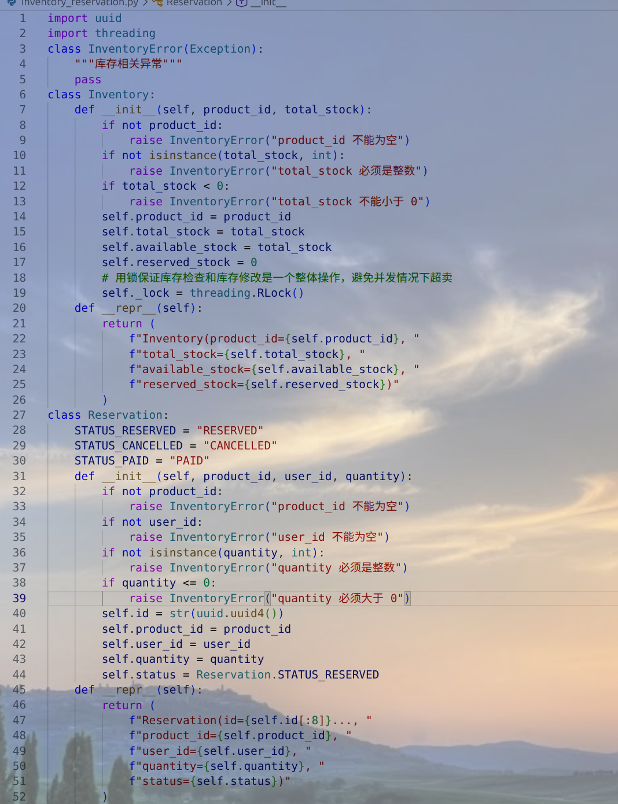
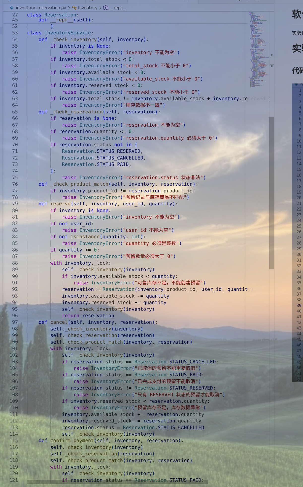
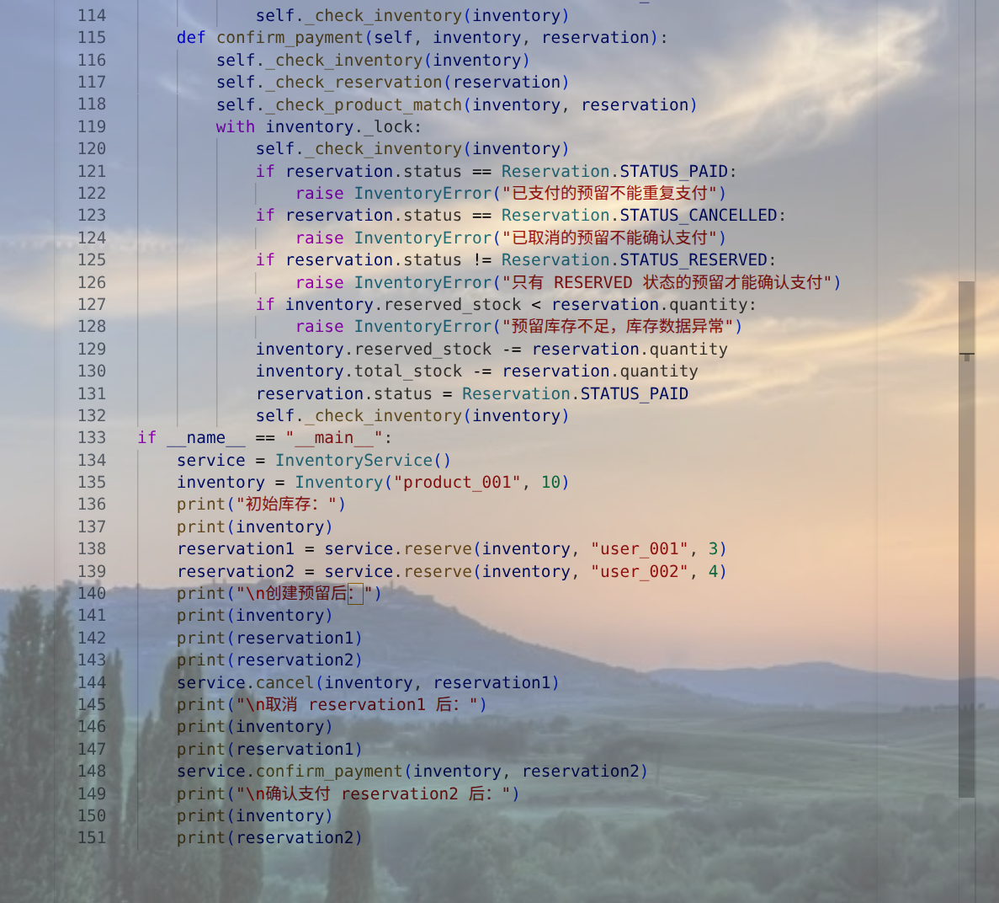
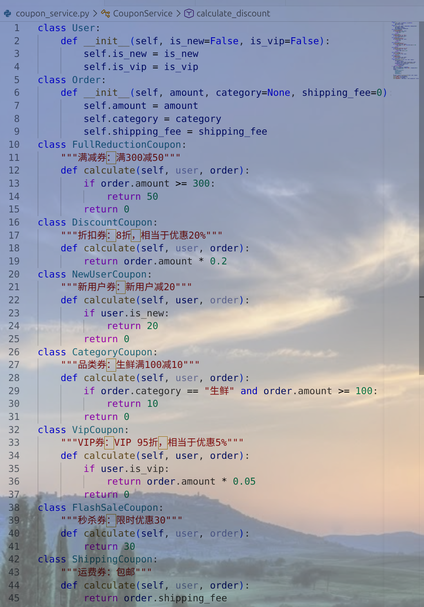
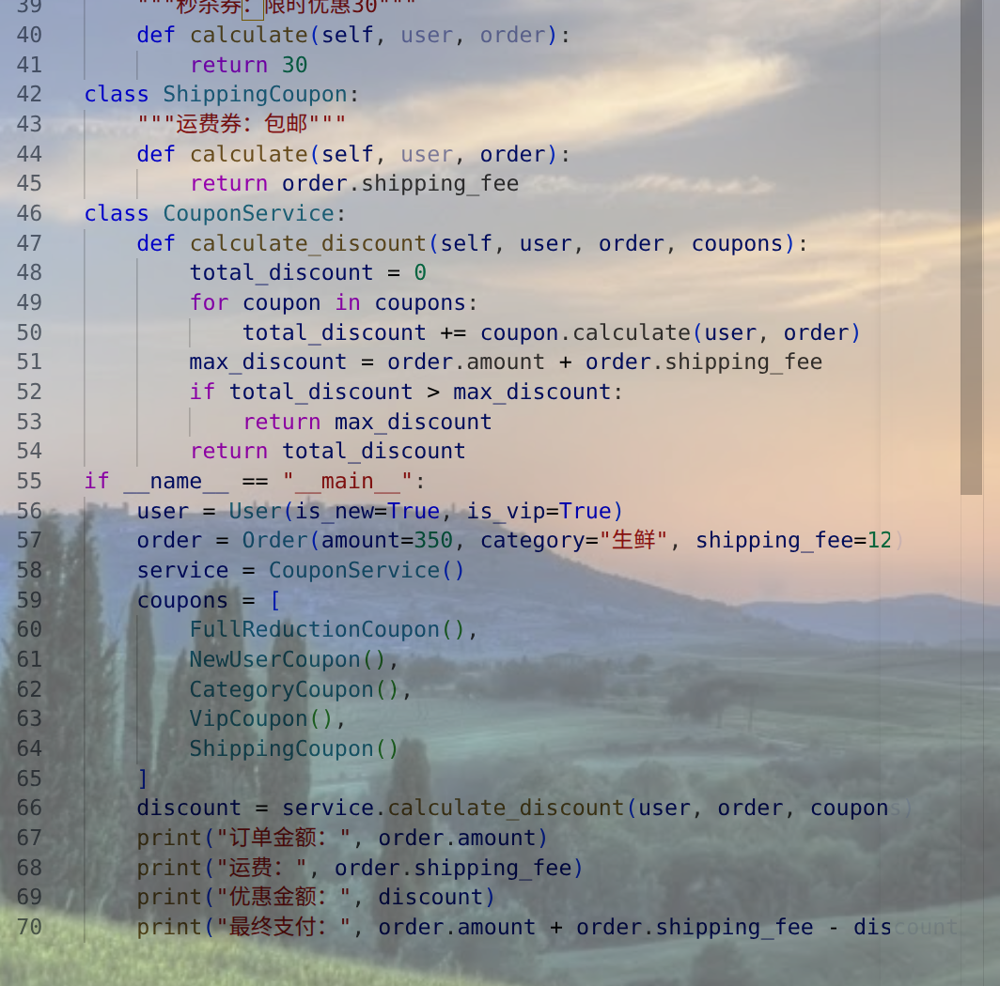
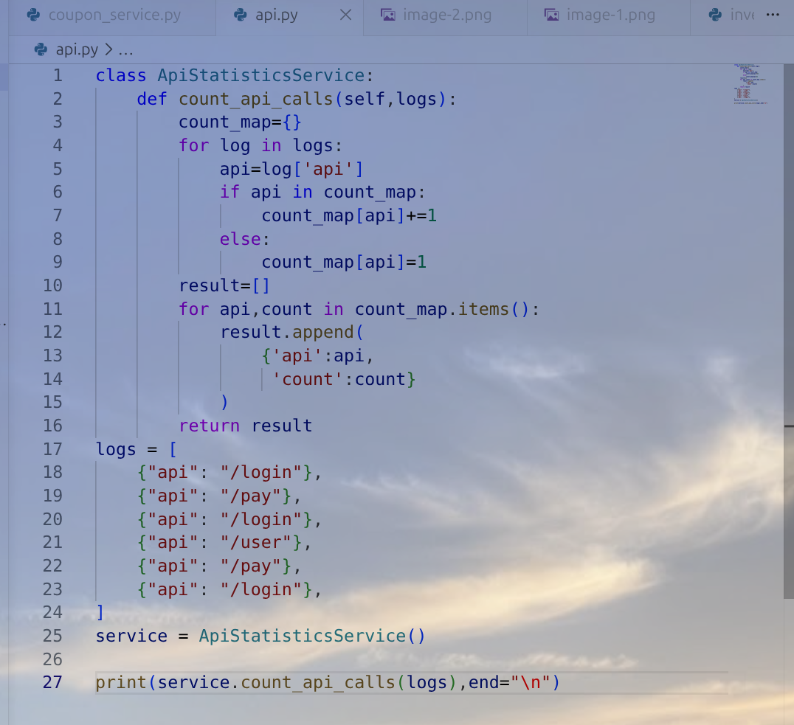

# 软件需求实验-第十三周
实验日期：5.28
姓名：胡江龙
学号：24302016
# 实验内容
## 作业1
首先，在 Reservation 类中增加了三种状态：RESERVED、CANCELLED 和 PAID，分别表示已预留、已取消和已支付。通过状态标记，可以在取消订单和确认支付时判断当前操作是否合法。

在创建库存预留时，程序会先检测预留数量是否合法，要求预留数量必须大于 0。同时，还会判断当前可售库存是否足够，如果可售库存小于申请预留数量，则直接抛出错误，不允许继续预留。只有当数据合法并且库存充足时，才会创建预留记录，然后减少可售库存，增加预留库存。这样可以保证预留后可售库存不会小于 0，从而避免超卖。

在取消订单时，程序会先检测预留记录的状态。如果该订单已经被取消，则不能重复取消；如果该订单已经完成支付，则不能再取消。只有当订单状态为 RESERVED 时，才允许取消。取消成功后，程序会将预留库存恢复到可售库存中，并把订单状态设置为 CANCELLED。

在确认支付时，程序同样会先检测订单状态。如果订单已经支付，则不能重复支付；如果订单已经取消，则不能再确认支付。只有当订单状态为 RESERVED 时，才允许确认支付。支付成功后，程序会减少预留库存和总库存，并将订单状态设置为 PAID。这样可以保证支付后的库存变化符合题目要求。

# 作业2
为了实现鲁棒性，我增强了 InventoryService 类，在其中增加了 _check_inventory()、_check_reservation() 和 _check_product_match() 三种检查方法。其中，_check_inventory() 用来检测库存数据是否合理，例如总库存、可售库存和预留库存不能小于 0，并且总库存应该等于可售库存与预留库存之和。_check_reservation() 用来检测预留记录是否合理，例如预留数量必须大于 0，预留状态必须是合法状态。_check_product_match() 用来检测预留记录和库存对象是否属于同一个商品，防止把一个商品的预留记录错误地用于另一个商品。

此外，我还在库存对象中增加了锁机制，使用 threading.RLock() 保证库存检查和库存修改能够作为一个整体执行。在创建预留、取消订单和确认支付时，都通过锁来保护库存数据，防止多个操作同时修改同一份库存数据，造成数据不一致或超卖问题。

在创建库存预留时，程序会先检测库存对象、用户 ID 和预留数量是否合法，再判断可售库存是否足够。如果数据不合理或库存不足，就会抛出错误。只有在数据合法时，才会创建预留记录并修改库存。

在取消订单时，程序会先检测库存数据、预留记录状态以及商品是否匹配。只有当数据合理并且订单处于 RESERVED 状态时，才会将预留库存恢复到可售库存，并将状态设置为 CANCELLED。

在确认支付时，程序也会先检测库存数据和订单状态。只有当订单处于 RESERVED 状态时，才会减少预留库存和总库存，并将状态设置为 PAID。

## 作业3
我将不同优惠券封装成不同的类，FullReductionCoupon 表示满减券，DiscountCoupon 表示折扣券，NewUserCoupon 表示新用户券，CategoryCoupon 表示品类券，VipCoupon 表示 VIP 券，ShippingCoupon 表示运费券。每个优惠券类都有自己的 calculate() 方法，用来计算对应的优惠金额。

CouponService 不再关心具体是哪种优惠券，只负责遍历优惠券对象列表，并调用每个优惠券对象的 calculate(user, order) 方法。这样不同优惠券可以自由组合，例如满减券、新用户券、VIP券和运费券可以一起使用。

如果以后新增一种优惠券，只需要新增一个优惠券类，并实现 calculate() 方法即可，不需要修改 CouponService 的核心代码。因此，这种设计提高了程序的灵活性和重用性。

## 作业4
## Todo4 高效性修改说明
我将原来的列表查找方式改成了字典统计方式。字典 count_map 使用 API 地址作为 key，访问次数作为 value。每读取一条日志，就直接通过 API 名称在字典中查找和更新访问次数。如果该 API 已经存在，就将次数加 1；如果不存在，就把它加入字典，并将次数设置为 1。
修改后，程序不需要每次都遍历整个统计结果列表，而是可以通过字典快速定位某个 API 的统计结果。因此，统计过程只需要遍历一遍日志数据即可完成。这样可以明显减少重复查找，提高日志统计效率。
最后，为了保持输出格式和原程序一致，再将字典中的统计结果转换成列表形式返回。这样既提高了内部统计效率，又没有改变最终返回结果的结构。 
