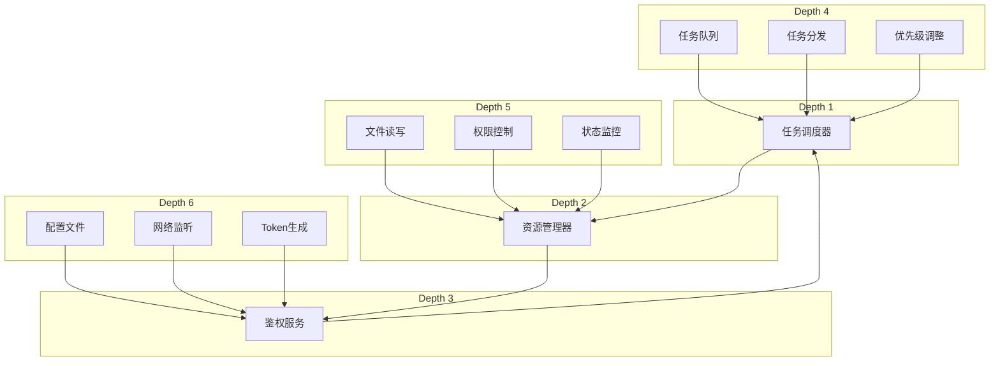

**user**: ```
【系统设计与逻辑推理测试】
请为我设计一个基于本地文件系统的轻量级 AI Agent 任务调度框架。为了测试你的指令遵循能力，你必须严格满足以下所有约束条件，否则该回答无效：
约束 1（结构与字数）： 框架必须包含且仅包含 3 个核心模块。每个模块使用 Markdown 的二级标题（##）标出，且每个模块的文字描述必须严格控制在 40 到 60 个汉字之间。
约束 2（深度与图谱）： 请使用 Mermaid.js 语法绘制该架构的层级知识图谱（流程图或思维导图均可）。图谱必须精确包含 6 个层级（Depth），且所有节点的总数必须刚好是 20 个。
约束 3（逻辑陷阱）： 假设模块 A 启动依赖模块 B 的初始化，但模块 B 的初始化需要模块 C 提供的鉴权 Token，而模块 C 又必须等待模块 A 建立网络监听后才能生成 Token。请给出一个打破这个死锁的工程解决方案，并在解释时使用至少一次 LaTeX 行内公式格式（使用 $ 包裹）来表示时间或状态变量。
约束 4（输出纯净度）： 你的回答不能包含任何开头问候语（如“好的”、“没问题”）或结尾的总结语。直接输出技术内容。，你来执行
```
[Context: Notes: obsidian使用/obsidian使用1.md]
[Timestamp: 2026/03/26 15:14:19]

**ai**: ## 核心模块

### 模块 A：任务调度器
负责解析任务队列并分发至执行模块，支持任务优先级排序与动态调整，确保任务高效执行。

### 模块 B：资源管理器
管理本地文件系统资源，提供文件读写接口及权限控制，支持资源状态实时监控。

### 模块 C：鉴权服务
生成任务调度所需的鉴权 Token，基于本地配置文件和网络监听动态更新 Token。



### 死锁解决方案
为打破模块间的循环依赖，采用异步初始化策略。具体方法如下：

1. 模块 C 在启动时生成临时 Token（$T_{temp}$），允许模块 B 初始化。
2. 模块 B 初始化完成后，通知模块 A 启动网络监听。
3. 模块 A 启动监听后，模块 C 更新正式 Token（$T_{final}$），替换 $T_{temp}$。

通过引入临时 Token，确保模块间的初始化顺序不再互相阻塞，从而解决死锁问题。
[Timestamp: 2026/03/26 15:14:29]