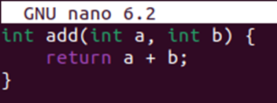
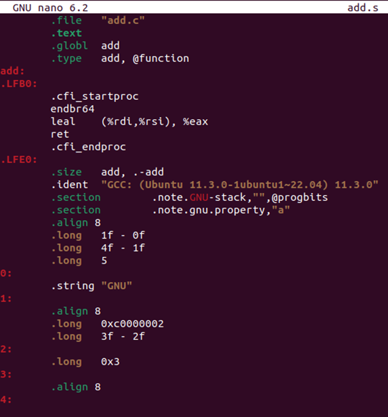

# Linux系统的常用命令 (ai给的)

Linux 系统中有许多常用命令，涵盖了文件操作、系统管理、网络工具等各个方面。以下是一些最常用的命令及其简要说明，按类别分类整理：

---

## 文件/目录操作

1. ls

  - 列出目录内容

  - 常用选项：ls -l（详细信息）、ls -a（显示隐藏文件）

1. cd

  - 切换目录

  - 示例：cd /home、cd ..（返回上级目录）

1. pwd

  - 显示当前工作目录路径

1. cp

  - 复制文件/目录

  - 示例：cp file1.txt file2.txt、cp -r dir1 dir2（递归复制目录）

1. mv

  - 移动或重命名文件/目录

  - 示例：mv old.txt new.txt（重命名）、mv file /tmp（移动文件）

1. rm

  - 删除文件/目录

  - 示例：rm file.txt、rm -r dir（递归删除目录）

1. mkdir

  - 创建目录

  - 示例：mkdir new_dir

1. touch

  - 创建空文件或更新文件时间戳

  - 示例：touch file.txt

1. cat

  - 查看文件内容

  - 示例：cat file.txt

1. more** / ****less**

  - 分页查看文件内容（支持翻页）

1. head** / ****tail**

  - 查看文件头部/尾部内容

  - 示例：tail -f log.txt（实时追踪日志）

---

## 系统信息与管理

1. top** / ****htop**

  - 实时显示系统进程和资源占用（htop 为增强版）

1. ps

  - 查看进程状态

  - 示例：ps aux（显示所有进程）

1. kill

  - 终止进程

  - 示例：kill -9 PID（强制终止进程）

1. df

  - 查看磁盘空间使用情况

  - 示例：df -h（以易读格式显示）

1. du

  - 查看目录/文件占用空间

  - 示例：du -sh /home（统计总大小）

1. free

  - 查看内存使用情况

  - 示例：free -h

1. uname

  - 显示系统信息

  - 示例：uname -a（显示内核版本等）

1. shutdown** / ****reboot**

  - 关机或重启

  - 示例：shutdown now（立即关机）

---

## 网络相关

1. ping

  - 测试网络连通性

  - 示例：ping google.com

1. curl** / ****wget**

  - 下载文件或测试网络请求

  - 示例：curl -O http://example.com/file.zip

1. ifconfig** / ****ip**

  - 查看或配置网络接口（ip 更现代）

  - 示例：ip addr show

1. netstat

  - 显示网络连接、路由表等信息

  - 示例：netstat -tulnp（查看监听端口）

1. ssh

  - 远程登录其他主机

  - 示例：ssh user@192.168.1.100

1. scp

  - 安全复制文件到远程主机

  - 示例：scp file.txt user@host:/path

1. traceroute** / ****mtr**

  - 追踪网络路由路径

---

## 文本处理

1. grep

  - 文本搜索工具

  - 示例：grep "error" log.txt（查找包含 "error" 的行）

1. sed

  - 流编辑器（用于文本替换/处理）

  - 示例：sed 's/old/new/g' file.txt（全局替换）

1. awk

  - 强大的文本分析工具

  - 示例：awk '{print $1}' file.txt（输出第一列）

1. sort

  - 对文本行排序

  - 示例：sort file.txt

1. cut

  - 按列提取文本

  - 示例：cut -d',' -f1 data.csv（以逗号分隔，取第一列）

1. diff

  - 比较文件差异

  - 示例：diff file1.txt file2.txt

---

## 压缩与解压

1. tar

  - 归档文件

  - 示例：

    - 压缩：tar -czvf archive.tar.gz dir/

    - 解压：tar -xzvf archive.tar.gz

1. gzip** / ****gunzip**

  - 压缩/解压 .gz 文件

1. zip** / ****unzip**

  - 处理 .zip 文件

---

## 权限管理

1. chmod

  - 修改文件权限

  - 示例：chmod 755 file.sh、chmod +x script.sh

1. chown

  - 修改文件所有者

  - 示例：chown user:group file.txt

---

## 查找命令

1. find

  - 查找文件

  - 示例：find /home -name "*.txt"

1. locate

  - 快速查找文件（依赖数据库）

  - 示例：locate filename

1. which

  - 显示命令的完整路径

  - 示例：which ls

---

## 软件包管理

- apt update（更新源列表）

- apt install package（安装软件包）

- apt remove package（卸载）

---

## 其他实用命令

1. history

  - 查看命令历史记录

1. alias

  - 创建命令别名

  - 示例：alias ll='ls -alF'

1. man

  - 查看命令手册

  - 示例：man ls

1. echo

  - 输出文本或变量

  - 示例：echo $PATH

1. date

  - 显示或设置系统时间

---

## 学习建议

- 使用 man <command> 查看命令详细手册（如 man grep）。

- 尝试 tldr <command> 获取简化版命令示例（需安装 tldr 工具）。

---

# 汇编语言

## 查看不带main函数的单一C语言函数(x86架构)

使用nano编写add函数：

```bash
nano add.c
```



编译：

```bash
gcc -S -O1 -o add.s add.c
```

注意这里有”-O1” 是编译器优化选项，O1级只为了显示关键信息。使用”-O0” 级可以显示包括栈帧结构的完整代码。

然后查看汇编文件：

```bash
nano add.s
```

 应该可以看到如下图所示：



## 交叉编译

- 默认以上汇编程序是x86_64指令集，和课堂上所学不太一样。因为大多数同学的主机/虚拟机都是x86架构

- 接下来尝试在x86_64架构的系统里编译arm架构的程序，因为要编译不同架构的程序，所以这个过程俗称“交叉编译”

- 首先安装arm64指令集相关的工具包：

```bash
sudo apt-get install crossbuild-essential-arm64 gcc-aarch64-linux-gnu
```

> [!note]

安装工具包时如果报错，可以先运行 sudo apt-get update更新一下包信息，然后再重新运行上面的命令

- 接着，需要把之前的gcc编译器更换为aarch64-linux-gnu-gcc

  - 这里64位arm架构又称为AArch64

- 例如，用arm架构编译hello的命令更换为：

```bash
aarch64-linux-gnu-gcc -o hello.o hello.c
```

> [!note]

需要注意这个环节，后面在编译时，一定要时刻留意用的编译器是gcc还是aarch64-linux-gnu-gcc

## 查看不带main函数的单一C语言函数(arm架构)

与前面相似，只是更换编译器：

```bash
aarch64-linux-gnu-gcc -S -O1 -o add.s add.c
```

使用nano查看add.s文件，内容为：

```assembly language
        .arch armv8-a
        .file   "add.c"
        .text
        .align  2
        .global add
        .type   add, %function
add:
.LFB0:
        .cfi_startproc
        add     w0, w0, w1
        ret
        .cfi_endproc
.LFE0:
        .size   add, .-add
        .ident  "GCC: (Ubuntu 13.3.0-6ubuntu2~24.04) 13.3.0"
        .section        .note.GNU-stack,"",@progbits
```

- 文件里以"."开头的字段都是各种文本类的助记符，像是注释一样，不是真正的程序指令

## 指令长度对比

### 复杂指令集（CISC）

### 变长的指令集

### X86-64架构

- 完整的可执行程序的汇编语言信息可由objdump获得：

```bash
objdump -d ./hello.o
```
