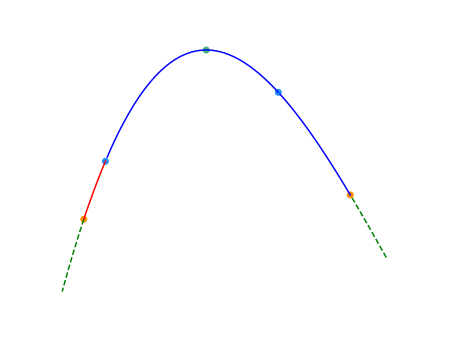
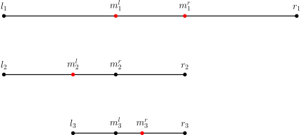

# 二分 - OI Wiki

- Source: https://oi-wiki.org/basic/binary/

# 二分

本页面将简要介绍二分查找，由二分法衍生的三分法以及二分答案．

## 二分法

### 定义

二分查找（英语：binary search），也称折半搜索（英语：half-interval search）、对数搜索（英语：logarithmic search），是用来在一个有序数组中查找某一元素的算法．

### 过程

以在一个升序数组中查找一个数为例．

它每次考察数组当前部分的中间元素，如果中间元素刚好是要找的，就结束搜索过程；如果中间元素小于所查找的值，那么左侧的只会更小，不会有所查找的元素，只需到右侧查找；如果中间元素大于所查找的值同理，只需到左侧查找．

### 性质

#### 时间复杂度

二分查找的最优时间复杂度为 𝑂(1)O(1)．

二分查找的平均时间复杂度和最坏时间复杂度均为 𝑂(log⁡𝑛)O(log⁡n)．因为在二分搜索过程中，算法每次都把查询的区间减半，所以对于一个长度为 𝑛n 的数组，至多会进行 𝑂(log⁡𝑛)O(log⁡n) 次查找．

#### 空间复杂度

迭代版本的二分查找的空间复杂度为 𝑂(1)O(1)．

递归（无尾调用消除）版本的二分查找的空间复杂度为 𝑂(log⁡𝑛)O(log⁡n)．

### 实现

```text 1 2 3 4 5 6 7 8 9 10 11 12 13 14 15 16 ``` |  ```text int binary_search ( int start , int end , int key ) { int ret = -1 ; // 未搜索到数据返回-1下标 int mid ; while ( start <= end ) { mid = start \+ (( end \- start ) >> 1 ); // 直接平均可能会溢出，所以用这个算法 if ( arr [ mid ] < key ) start = mid \+ 1 ; else if ( arr [ mid ] > key ) end = mid \- 1 ; else { // 最后检测相等是因为多数搜索情况不是大于就是小于 ret = mid ; break ; } } return ret ; // 单一出口 } ```   
---|---  
  
Note

参考 [编译优化 #移位代替乘法](../../lang/optimizations/#移位代替乘法)，对于 𝑛n 是有符号数的情况，当你可以保证 𝑛 ≥0n≥0 时，`n >> 1` 比 `n / 2` 指令数更少．

### 最大值最小化

注意，这里的有序是广义的有序，如果一个数组中的左侧或者右侧都满足某一种条件，而另一侧都不满足这种条件，也可以看作是一种有序（如果把满足条件看做 11，不满足看做 00，至少对于这个条件的这一维度是有序的）．换言之，二分搜索法可以用来查找满足某种条件的最大（最小）的值．

要求满足某种条件的最大值的最小可能情况（最大值最小化），首先的想法是从小到大枚举这个作为答案的「最大值」，然后去判断是否合法．若答案单调，就可以使用二分搜索法来更快地找到答案．因此，要想使用二分搜索法来解这种「最大值最小化」的题目，需要满足以下三个条件：

  1. 答案在一个固定区间内；
  2. 可能查找一个符合条件的值不是很容易，但是要求能比较容易地判断某个值是否是符合条件的；
  3. 可行解对于区间满足一定的单调性．换言之，如果 𝑥x 是符合条件的，那么有 𝑥 +1x+1 或者 𝑥 −1x−1 也符合条件．（这样下来就满足了上面提到的单调性）

当然，最小值最大化是同理的．

### STL 的二分查找

C++ 标准库中实现了查找首个不小于给定值的元素的函数 [`std::lower_bound`](https://zh.cppreference.com/w/cpp/algorithm/lower_bound) 和查找首个大于给定值的元素的函数 [`std::upper_bound`](https://zh.cppreference.com/w/cpp/algorithm/upper_bound)，二者均定义于头文件 `<algorithm>` 中．

二者均采用二分实现，所以调用前必须保证元素有序．

### bsearch

bsearch 函数为 C 标准库实现的二分查找，定义在 `<stdlib.h>` 中．在 C++ 标准库里，该函数定义在 `<cstdlib>` 中．qsort 和 bsearch 是 C 语言中唯二的两个算法类函数．

bsearch 函数相比 qsort（[排序相关 STL](../stl-sort/)）的四个参数，在最左边增加了参数「待查元素的地址」．之所以按照地址的形式传入，是为了方便直接套用与 qsort 相同的比较函数，从而实现排序后的立即查找．因此这个参数不能直接传入具体值，而是要先将待查值用一个变量存储，再传入该变量地址．

于是 bsearch 函数总共有五个参数：待查元素的地址、数组名、元素个数、元素大小、比较规则．比较规则仍然通过指定比较函数实现，详见 [排序相关 STL](../stl-sort/)．

bsearch 函数的返回值是查找到的元素的地址，该地址为 void 类型．

注意：bsearch 与上文的 lower_bound 和 upper_bound 有两点不同：

  * 当符合条件的元素有重复多个的时候，会返回执行二分查找时第一个符合条件的元素，从而这个元素可能位于重复多个元素的中间部分．
  * 当查找不到相应的元素时，会返回 NULL．

用 lower_bound 可以实现与 bsearch 完全相同的功能，所以可以使用 bsearch 通过的题目，直接改写成 lower_bound 同样可以实现．但是鉴于上述不同之处的第二点，例如，在序列 1、2、4、5、6 中查找 3，bsearch 实现 lower_bound 的功能会变得困难．

利用 bsearch 实现 lower_bound 的功能比较困难，是否一定就不能实现？答案是否定的，存在比较 tricky 的技巧．借助编译器处理比较函数的特性：总是将第一个参数指向待查元素，将第二个参数指向待查数组中的元素，也可以用 bsearch 实现 lower_bound 和 upper_bound，如下文示例．只是，这要求待查数组必须是全局数组，从而可以直接传入首地址．

```text 1 2 3 4 5 6 7 8 9 10 11 12 13 14 15 16 17 18 19 20 21 22 23 24 25 ``` |  ```text int A [ 100005 ]; // 示例全局数组 // 查找首个不小于待查元素的元素的地址 int lower ( const void * p1 , const void * p2 ) { int * a = ( int * ) p1 ; int * b = ( int * ) p2 ; if (( b == A || compare ( a , b \- 1 ) > 0 ) && compare ( a , b ) > 0 ) return 1 ; else if ( b != A && compare ( a , b \- 1 ) <= 0 ) return -1 ; // 用到地址的减法，因此必须指定元素类型 else return 0 ; } // 查找首个大于待查元素的元素的地址 int upper ( const void * p1 , const void * p2 ) { int * a = ( int * ) p1 ; int * b = ( int * ) p2 ; if (( b == A || compare ( a , b \- 1 ) >= 0 ) && compare ( a , b ) >= 0 ) return 1 ; else if ( b != A && compare ( a , b \- 1 ) < 0 ) return -1 ; // 用到地址的减法，因此必须指定元素类型 else return 0 ; } ```   
---|---  
  
因为现在的 OI 选手很少写纯 C，并且此方法作用有限，所以不是重点．对于新手而言，建议老老实实地使用 C++ 中的 lower_bound 和 upper_bound 函数．

### 二分答案

解题的时候往往会考虑枚举答案然后检验枚举的值是否正确．若满足单调性，则满足使用二分法的条件．把这里的枚举换成二分，就变成了「二分答案」．

[Luogu P1873 砍树](https://www.luogu.com.cn/problem/P1873)

伐木工人米尔科需要砍倒 𝑀M 米长的木材．这是一个对米尔科来说很容易的工作，因为他有一个漂亮的新伐木机，可以像野火一样砍倒森林．不过，米尔科只被允许砍倒单行树木．

米尔科的伐木机工作过程如下：米尔科设置一个高度参数 𝐻H（米），伐木机升起一个巨大的锯片到高度 𝐻H，并锯掉所有的树比 𝐻H 高的部分（当然，树木不高于 𝐻H 米的部分保持不变）．米尔科就得到树木被锯下的部分．

例如，如果一行树的高度分别为 20, 15, 10, 1720, 15, 10, 17，米尔科把锯片升到 1515 米的高度，切割后树木剩下的高度将是 15, 15, 10, 1515, 15, 10, 15，而米尔科将从第 11 棵树得到 55 米木材，从第 44 棵树得到 22 米木材，共 77 米木材．

米尔科非常关注生态保护，所以他不会砍掉过多的木材．这正是他尽可能高地设定伐木机锯片的原因．你的任务是帮助米尔科找到伐木机锯片的最大的整数高度 𝐻H，使得他能得到木材至少为 𝑀M 米．即，如果再升高 11 米锯片，则他将得不到 𝑀M 米木材．

解题思路

我们可以在 11 到 109109 中枚举答案，但是这种朴素写法肯定拿不到满分，因为从 11 枚举到 109109 太耗时间．我们可以在 [1, 109][1, 109] 的区间上进行二分作为答案，然后检查各个答案的可行性（一般使用贪心法）．**这就是二分答案．**

参考代码

```text 1 2 3 4 5 6 7 8 9 10 11 12 13 14 15 16 17 18 19 20 21 22 23 24 25 26 27 28 29 ``` |  ```text int a [ 1000005 ]; int n , m ; bool check ( int k ) { // 检查可行性，k 为锯片高度 long long sum = 0 ; for ( int i = 1 ; i <= n ; i ++ ) // 检查每一棵树 if ( a [ i ] > k ) // 如果树高于锯片高度 sum += ( long long )( a [ i ] \- k ); // 累加树木长度 return sum >= m ; // 如果满足最少长度代表可行 } int find () { int l = 1 , r = 1e9 \+ 1 ; // 因为是左闭右开的，所以 10^9 要加 1 while ( l \+ 1 < r ) { // 如果两点不相邻 int mid = ( l \+ r ) / 2 ; // 取中间值 if ( check ( mid )) // 如果可行 l = mid ; // 升高锯片高度 else r = mid ; // 否则降低锯片高度 } return l ; // 返回左边值 } int main () { cin >> n >> m ; for ( int i = 1 ; i <= n ; i ++ ) cin >> a [ i ]; cout << find (); return 0 ; } ```   
---|---  
  
看完了上面的代码，你肯定会有两个疑问：

  1. 为何搜索区间是左闭右开的？

因为搜到最后，会这样（以合法的最大值为例）：


然后会


合法的最小值恰恰相反．

  2. 为何返回左边值？

同上．

## 三分法

### 引入

二分法可以用于近似求出函数的零点．如果需要求出单峰函数的极值点，通常需要使用三分法（ternary search）．

对于一个函数 𝑓(𝑥)f(x)，如果存在 𝑥∗x∗ 使得 𝑓(𝑥)f(x) 在 𝑥 <𝑥∗x<x∗ 时单调递增且 𝑓(𝑥)f(x) 在 𝑥 >𝑥∗x>x∗ 时单调递减，就称 𝑓(𝑥)f(x) 为单峰函数（unimodal function）．显然，𝑥∗x∗ 就是它的最大值点，而 𝑓(𝑥∗)f(x∗) 则是它的最大值．

为什么不通过求导函数的零点来求极值点？

客观上，求出导数后，通过二分法求出导数的零点（由于函数是单峰函数，其导数在同一范围内的零点是唯一的）得到单峰函数的极值点是可行的．

但首先，对于一些函数，求导的过程和结果比较复杂．

其次，某些题中需要求极值点的单峰函数并非一个单独的函数，而是多个函数进行特殊运算得到的函数（如求多个单调性不完全相同的一次函数的最小值的最大值）．此时函数的导函数可能是分段函数，且在函数某些点上可能不可导．

注意

三分法既可以求出单峰函数的最大值，也可以求出「单谷函数」的最小值．为行文方便，除特殊说明外，下文中均以求单峰函数的最大值为例．

### 过程

三分法与二分法的基本思想类似，但每次操作需在当前区间 [𝑙,𝑟][l,r]（下图中两个橙点之间）内任取两点 𝑙𝑚𝑖𝑑 <𝑟𝑚𝑖𝑑lmid<rmid（下图中的两个蓝点）．如下图所示，如果 𝑓(𝑙𝑚𝑖𝑑) <𝑓(𝑟𝑚𝑖𝑑)f(lmid)<f(rmid)，则在 [𝑙,𝑙𝑚𝑖𝑑)[l,lmid)（下图中的红色部分）中函数必然单调递增，最大值点（下图中的绿点）必然不在这一区间内，可舍去这一区间；但是，无法排除最大值点在 𝑟𝑚𝑖𝑑rmid 右侧的可能性，所以无法舍去更多区间．反之亦然．



三分法的正确性并不依赖于 𝑙𝑚𝑖𝑑lmid 和 𝑟𝑚𝑖𝑑rmid 的选择，通常可以取两个三等分点．但是，它们的选择确实会影响三分法的效率．这是因为三分法的每次操作都会舍去两侧区间中的其中一个．为减少三分法的操作次数，应使两侧区间尽可能大．因此，每一次操作时的 𝑙𝑚𝑖𝑑lmid 和 𝑟𝑚𝑖𝑑rmid 分别取 𝑚𝑖𝑑 −𝜀mid−ε 和 𝑚𝑖𝑑 +𝜀mid+ε 是一个不错的选择．事实上，𝑚𝑖𝑑 ±𝜀mid±ε 的取法相当于求 𝑚𝑖𝑑mid 处的近似导数 𝑓(𝑚𝑖𝑑+𝜀)−𝑓(𝑚𝑖𝑑−𝜀)2𝜀f(mid+ε)−f(mid−ε)2ε 判断正负以确定极值点在 𝑚𝑖𝑑mid 的哪一侧．

### 实现

伪代码如下：

𝐀𝐥𝐠𝐨𝐫𝐢𝐭𝐡𝐦TernarySearch⁡(𝑓,𝑙,𝑟):𝐈𝐧𝐩𝐮𝐭. A unimodal function 𝑓(𝑥) and its domain [𝑙,𝑟].𝐎𝐮𝐭𝐩𝐮𝐭. The maximizer 𝑥∗, up to an error of 𝜀, and its value 𝑓(𝑥∗).𝐌𝐞𝐭𝐡𝐨𝐝. 1𝐰𝐡𝐢𝐥𝐞 𝑟−𝑙>𝜀2𝑚𝑖𝑑←(𝑙+𝑟)/23𝑙𝑚𝑖𝑑←𝑚𝑖𝑑−𝜀/34𝑟𝑚𝑖𝑑←𝑚𝑖𝑑+𝜀/35𝐢𝐟 𝑓(𝑙𝑚𝑖𝑑)<𝑓(𝑟𝑚𝑖𝑑)6𝑙←𝑙𝑚𝑖𝑑7𝐞𝐥𝐬𝐞 8𝑟←𝑟𝑚𝑖𝑑9𝑥∗←(𝑙+𝑟)/210𝐫𝐞𝐭𝐮𝐫𝐧 𝑥∗, 𝑓(𝑥∗)AlgorithmTernarySearch⁡(f,l,r):Input. A unimodal function f(x) and its domain [l,r].Output. The maximizer x∗, up to an error of ε, and its value f(x∗).Method. 1while r−l>ε2mid←(l+r)/23lmid←mid−ε/34rmid←mid+ε/35if f(lmid)<f(rmid)6l←lmid7else 8r←rmid9x∗←(l+r)/210return x∗, f(x∗)分割点的选取

代码中，分割点选取为 𝑚𝑖𝑑 ±𝜀/3mid±ε/3 是为了保证分割点总是在当前的 𝑙l 和 𝑟r 之间，进而避免陷入死循环．

整数的情形

如果函数 𝑓(𝑥)f(x) 的定义域是整数，那么上述三分法和后文的黄金分割法都应该在 𝑟 −𝑙r−l 很小时就终止．对于 𝑟 −𝑙r−l 很小的情形，需要通过暴力遍历的方法求得最大值点．

### 优化：黄金分割法

如果单次调用 𝑓(𝑥)f(x) 的成本很高，需要进一步减少 𝑓(𝑥)f(x) 的调用次数，可以通过黄金分割法（golden-section search）进一步改进三分法的常数．这也是华罗庚提出的优选法的重要内容．

三分法中，每轮迭代需要两次函数调用，且单轮迭代后区间长度至多缩短到原来的 1/21/2．这意味着，要达到精度 𝜀ε，至少需要

2log2⁡𝑟−𝑙𝜀2log2⁡r−lε

次函数调用．这是三分法能够取得的最好的结果．如果选取其他分点，例如三等分点，那么调用次数会进一步增加，因为单轮迭代后区间缩短得更慢．

黄金分割法的改进思路是，复用前文已经计算过的分点．这样，除了第一轮迭代需要两次函数调用外，其余轮次的迭代只需要一次函数调用．设黄金分割比为

𝜙=√5−12≈0.618.ϕ=5−12≈0.618.

每轮迭代时，选取的分点是左右两个黄金分割点：

𝑚𝑙=𝜙𝑙+(1−𝜙)𝑟, 𝑚𝑟=(1−𝜙)𝑙+𝜙𝑟.ml=ϕl+(1−ϕ)r, mr=(1−ϕ)l+ϕr.

黄金分割点分割线段具有自相似结构．也就是说，𝑚𝑙ml 是线段 [𝑙,𝑟][l,r] 的左黄金分割点，也是线段 [𝑙,𝑚𝑟][l,mr] 的右黄金分割点．这样选取分点的好处是，第 𝑘 >1k>1 轮迭代选取的分点中，一定有一个分点是之前已经计算过的，可以直接复用之前的计算结果．



这样选取分点后，要达到精度 𝜀ε，只需要

1+log𝜙−1⁡𝑟−𝑙𝜀≈1+1.44log2⁡𝑟−𝑙𝜀1+logϕ−1⁡r−lε≈1+1.44log2⁡r−lε

次函数调用．渐近意义上，函数的调用次数更少．

伪代码如下：

𝐀𝐥𝐠𝐨𝐫𝐢𝐭𝐡𝐦GoldenSectionSearch⁡(𝑓,𝑙,𝑟):𝐈𝐧𝐩𝐮𝐭. A unimodal function 𝑓(𝑥) and its domain [𝑙,𝑟].𝐎𝐮𝐭𝐩𝐮𝐭. The maximizer 𝑥∗, up to an error of 𝜀, and its value 𝑓(𝑥∗).𝐌𝐞𝐭𝐡𝐨𝐝. 1𝑙𝑚𝑖𝑑←𝜙𝑙+(1−𝜙)𝑟2𝑟𝑚𝑖𝑑←(1−𝜙)𝑙+𝜙𝑟3𝑙𝑣𝑎𝑙←𝑓(𝑙𝑚𝑖𝑑)4𝑟𝑣𝑎𝑙←𝑓(𝑟𝑚𝑖𝑑)5𝐰𝐡𝐢𝐥𝐞 𝑟−𝑙>𝜀6𝐢𝐟 𝑙𝑣𝑎𝑙>𝑟𝑣𝑎𝑙7𝑟←𝑟𝑚𝑖𝑑8𝑟𝑚𝑖𝑑←𝑙𝑚𝑖𝑑9𝑟𝑣𝑎𝑙←𝑙𝑣𝑎𝑙10𝑙𝑚𝑖𝑑←𝜙𝑙+(1−𝜙)𝑟11𝑙𝑣𝑎𝑙←𝑓(𝑙𝑚𝑖𝑑)12𝐞𝐥𝐬𝐞13𝑙←𝑙𝑚𝑖𝑑14𝑙𝑚𝑖𝑑←𝑟𝑚𝑖𝑑15𝑙𝑣𝑎𝑙←𝑟𝑣𝑎𝑙16𝑟𝑚𝑖𝑑←(1−𝜙)𝑙+𝜙𝑟17𝑟𝑣𝑎𝑙←𝑓(𝑟𝑚𝑖𝑑)18𝑥∗←(𝑙+𝑟)/219𝐫𝐞𝐭𝐮𝐫𝐧 𝑥∗, 𝑓(𝑥∗)AlgorithmGoldenSectionSearch⁡(f,l,r):Input. A unimodal function f(x) and its domain [l,r].Output. The maximizer x∗, up to an error of ε, and its value f(x∗).Method. 1lmid←ϕl+(1−ϕ)r2rmid←(1−ϕ)l+ϕr3lval←f(lmid)4rval←f(rmid)5while r−l>ε6if lval>rval7r←rmid8rmid←lmid9rval←lval10lmid←ϕl+(1−ϕ)r11lval←f(lmid)12else13l←lmid14lmid←rmid15lval←rval16rmid←(1−ϕ)l+ϕr17rval←f(rmid)18x∗←(l+r)/219return x∗, f(x∗)

### 例题

[洛谷 P3382 - 三分](https://www.luogu.com.cn/problem/P3382)

给定一个 𝑁N 次函数和范围 [𝑙,𝑟][l,r]，求出使函数在 [𝑙,𝑥][l,x] 上单调递增且在 [𝑥,𝑟][x,r] 上单调递减的唯一的 𝑥x 的值．

解题思路

本题要求求 𝑁N 次函数在 [𝑙,𝑟][l,r] 取最大值时自变量的值，显然可以使用三分法．

参考代码

C++Python

```text 1 2 3 4 5 6 7 8 9 10 11 12 13 14 15 16 17 18 19 20 21 22 23 24 25 26 27 28 29 30 31 ``` |  ```text #include <cmath> #include <iomanip> #include <iostream> using namespace std ; constexpr double eps = 1e-7 ; int N ; double l , r , A [ 20 ], mid , lmid , rmid ; double f ( double x ) { double res = ( double ) 0 ; for ( int i = N ; i >= 0 ; i \-- ) res += A [ i ] * pow ( x , i ); return res ; } int main () { cin . tie ( nullptr ) -> sync_with_stdio ( false ); cin >> N >> l >> r ; for ( int i = N ; i >= 0 ; i \-- ) cin >> A [ i ]; while ( r \- l > eps ) { mid = ( l \+ r ) / 2 ; lmid = mid \- eps ; rmid = mid \+ eps ; if ( f ( lmid ) > f ( rmid )) r = mid ; else l = mid ; } cout << fixed << setprecision ( 6 ) << l ; return 0 ; } ```   
---|---  
  
```text 1 2 3 4 5 6 7 8 9 10 11 12 13 14 15 16 ``` |  ```text eps = 1e-6 n , l , r = map ( float , input () . split ()) a = tuple ( map ( float , input () . split ()))[:: \- 1 ] def f ( x ): return sum ( x ** i * j for i , j in enumerate ( a )) while r \- l > eps : mid = ( l \+ r ) / 2 if f ( mid \- eps ) > f ( mid \+ eps ): r = mid else : l = mid print ( round ( l , 6 )) ```   
---|---  
  
### 习题

  * [UVa 1476 - Error Curves](https://onlinejudge.org/index.php?option=com_onlinejudge&Itemid=8&category=447&page=show_problem&problem=4222)
  * [UVa 10385 - Duathlon](https://uva.onlinejudge.org/index.php?option=com_onlinejudge&Itemid=8&category=15&page=show_problem&problem=1326)
  * [UOJ 162 -【清华集训 2015】灯泡测试](https://uoj.ac/problem/162)
  * [洛谷 P7579 -「RdOI R2」称重（weigh）](https://www.luogu.com.cn/problem/P7579)

## 分数规划

参见：[分数规划](../../misc/frac-programming/)

分数规划通常描述为下列问题：每个物品有两个属性 𝑐𝑖ci，𝑑𝑖di，要求通过某种方式选出若干个，使得 ∑𝑐𝑖∑𝑑𝑖∑ci∑di 最大或最小．

经典的例子有最优比率环、最优比率生成树等等．

分数规划可以用二分法来解决．

## 参考资料

  * [Ternary search - Wikipedia](https://en.wikipedia.org/wiki/Ternary_search)
  * [Golden-section search - Wikipedia](https://en.wikipedia.org/wiki/Golden-section_search)
  * [Ternary search - CP Algortihms](https://cp-algorithms.com/num_methods/ternary_search.html)

* * *

>  __本页面最近更新： 2026/2/21 05:30:26，[更新历史](https://github.com/OI-wiki/OI-wiki/commits/master/docs/basic/binary.md)  
>  __发现错误？想一起完善？[在 GitHub 上编辑此页！](https://oi-wiki.org/edit-landing/?ref=/basic/binary.md "edit.link.title")  
>  __本页面贡献者：[Ir1d](https://github.com/Ir1d), [H-J-Granger](https://github.com/H-J-Granger), [StudyingFather](https://github.com/StudyingFather), [NachtgeistW](https://github.com/NachtgeistW), [sshwy](https://github.com/sshwy), [yusancky](https://github.com/yusancky), [c-forrest](https://github.com/c-forrest), [countercurrent-time](https://github.com/countercurrent-time), [Enter-tainer](https://github.com/Enter-tainer), [Tiphereth-A](https://github.com/Tiphereth-A), [AngelKitty](https://github.com/AngelKitty), [cbw2007](https://github.com/cbw2007), [CCXXXI](https://github.com/CCXXXI), [cjsoft](https://github.com/cjsoft), [diauweb](https://github.com/diauweb), [Early0v0](https://github.com/Early0v0), [ezoixx130](https://github.com/ezoixx130), [GekkaSaori](https://github.com/GekkaSaori), [Henry-ZHR](https://github.com/Henry-ZHR), [Konano](https://github.com/Konano), [ksyx](https://github.com/ksyx), [LovelyBuggies](https://github.com/LovelyBuggies), [Makkiy](https://github.com/Makkiy), [mgt](mailto:i@margatroid.xyz), [minghu6](https://github.com/minghu6), [P-Y-Y](https://github.com/P-Y-Y), [PotassiumWings](https://github.com/PotassiumWings), [SamZhangQingChuan](https://github.com/SamZhangQingChuan), [Suyun514](mailto:suyun514@qq.com), [weiyong1024](https://github.com/weiyong1024), [Xeonacid](https://github.com/Xeonacid), [billchenchina](https://github.com/billchenchina), [ChungZH](https://github.com/ChungZH), [FinParker](https://github.com/FinParker), [flylai](https://github.com/flylai), [gavinliu266](https://github.com/gavinliu266), [GavinZhengOI](https://github.com/GavinZhengOI), [Gesrua](https://github.com/Gesrua), [Great-designer](https://github.com/Great-designer), [HanwGeek](https://github.com/HanwGeek), [HeRaNO](https://github.com/HeRaNO), [hhc0001](https://github.com/hhc0001), [i-yyi](https://github.com/i-yyi), [iamtwz](https://github.com/iamtwz), [inclyc](https://github.com/inclyc), [kxccc](https://github.com/kxccc), [LeiJinpeng](https://github.com/LeiJinpeng), [leoleoasd](https://github.com/leoleoasd), [lychees](https://github.com/lychees), [Marcythm](https://github.com/Marcythm), [Peanut-Tang](https://github.com/Peanut-Tang), [Selflocking](https://github.com/Selflocking), [shawlleyw](https://github.com/shawlleyw), [shuzhouliu](https://github.com/shuzhouliu), [SukkaW](https://github.com/SukkaW), [TH911](https://github.com/TH911), [Tokur233](https://github.com/Tokur233), [TOMWT-qwq](https://github.com/TOMWT-qwq), [w-tianshui](https://github.com/w-tianshui)  
>  __本页面的全部内容在**[CC BY-SA 4.0](https://creativecommons.org/licenses/by-sa/4.0/deed.zh) 和 [SATA](https://github.com/zTrix/sata-license)** 协议之条款下提供，附加条款亦可能应用
