# 计数排序 - OI Wiki

- Source: https://oi-wiki.org/basic/counting-sort/

# 计数排序

前置知识：[前缀和](../prefix-sum/)

提醒

本页面要介绍的不是 [**基数排序**](../radix-sort/)．

本页面将简要介绍计数排序．

## 定义

计数排序（英语：Counting sort）是一种线性时间的排序算法．

## 过程

计数排序的工作原理是使用一个额外的数组 𝐶C，其中第 𝑖i 个元素是待排序数组 𝐴A 中值等于 𝑖i 的元素的个数，然后根据数组 𝐶C 来将 𝐴A 中的元素排到正确的位置．1

它的工作过程分为三个步骤：

  1. 计算每个数出现了几次；
  2. 求出每个数出现次数的 [前缀和](../prefix-sum/)；
  3. 利用出现次数的前缀和，从右至左计算每个数的排名．

### 计算前缀和的原因

直接将 𝐶C 中正数对应的元素依次放入 𝐴A 中不能解决元素重复的情形．

我们通过为额外数组 𝐶C 中的每一项计算前缀和，结合每一项的数值，就可以为重复元素确定一个唯一排名：

额外数组 𝐶C 中每一项的数值即是该 key 值下重复元素的个数，而该项的前缀和即是排在最后一个的重复元素的排名．

如果按照 𝐴A 的逆序进行排列，那么显然排序后的数组将保持 𝐴A 的原序（相同 key 值情况下），也即得到一种稳定的排序算法．



## 性质

### 稳定性

计数排序是一种稳定的排序算法．

### 时间复杂度

计数排序的时间复杂度为 𝑂(𝑛 +𝑤)O(n+w)，其中 𝑤w 代表待排序数据的值域大小．

## 代码实现

### 伪代码

1𝐈𝐧𝐩𝐮𝐭. An array 𝐴 consisting of 𝑛 positive integers no greater than 𝑤.2𝐎𝐮𝐭𝐩𝐮𝐭. Array 𝐴 after sorting in nondecreasing order stably.3𝐌𝐞𝐭𝐡𝐨𝐝. 4𝐟𝐨𝐫 𝑖←0 𝐭𝐨 𝑤5𝑐𝑛𝑡[𝑖]←06𝐟𝐨𝐫 𝑖←1 𝐭𝐨 𝑛7𝑐𝑛𝑡[𝐴[𝑖]]←𝑐𝑛𝑡[𝐴[𝑖]]+18𝐟𝐨𝐫 𝑖←1 𝐭𝐨 𝑤9𝑐𝑛𝑡[𝑖]←𝑐𝑛𝑡[𝑖]+𝑐𝑛𝑡[𝑖−1]10𝐟𝐨𝐫 𝑖←𝑛 𝐝𝐨𝐰𝐧𝐭𝐨 111𝐵[𝑐𝑛𝑡[𝐴[𝑖]]]←𝐴[𝑖]12𝑐𝑛𝑡[𝐴[𝑖]]←𝑐𝑛𝑡[𝐴[𝑖]]−113𝐫𝐞𝐭𝐮𝐫𝐧 𝐵1Input. An array A consisting of n positive integers no greater than w.2Output. Array A after sorting in nondecreasing order stably.3Method. 4for i←0 to w5cnt[i]←06for i←1 to n7cnt[A[i]]←cnt[A[i]]+18for i←1 to w9cnt[i]←cnt[i]+cnt[i−1]10for i←n downto 111B[cnt[A[i]]]←A[i]12cnt[A[i]]←cnt[A[i]]−113return B

C++Python

```text 1 2 3 4 5 6 7 8 9 10 11 12 13 ``` |  ```text #include <cstring> constexpr int MAXN = 1010 ; constexpr int MAXW = 100010 ; int cnt [ MAXW ], b [ MAXN ]; int * counting_sort ( int * a , int n , int w ) { memset ( cnt , 0 , sizeof ( cnt )); for ( int i = 1 ; i <= n ; ++ i ) ++ cnt [ a [ i ]]; for ( int i = 1 ; i <= w ; ++ i ) cnt [ i ] += cnt [ i \- 1 ]; for ( int i = n ; i >= 1 ; \-- i ) b [ cnt [ a [ i ]] \-- ] = a [ i ]; return b ; } ```   
---|---  
  
```text 1 2 3 4 5 6 7 8 9 10 11 ``` |  ```text def counting_sort ( a , n , w ): b = [ 0 ] * n cnt = [ 0 ] * ( w \+ 1 ) for i in range ( 1 , n \+ 1 ): cnt [ a [ i ]] += 1 for i in range ( 1 , w \+ 1 ): cnt [ i ] += cnt [ i \- 1 ] for i in range ( n , 0 , \- 1 ): b [ cnt [ a [ i ]] \- 1 ] = a [ i ] cnt [ a [ i ]] -= 1 return b ```   
---|---  
  
## 参考资料与注释

* * *

  1. [计数排序 - 维基百科，自由的百科全书](https://zh.wikipedia.org/wiki/%E8%AE%A1%E6%95%B0%E6%8E%92%E5%BA%8F) ↩

* * *

>  __本页面最近更新： 2026/1/7 08:56:54，[更新历史](https://github.com/OI-wiki/OI-wiki/commits/master/docs/basic/counting-sort.md)  
>  __发现错误？想一起完善？[在 GitHub 上编辑此页！](https://oi-wiki.org/edit-landing/?ref=/basic/counting-sort.md "edit.link.title")  
>  __本页面贡献者：[NachtgeistW](https://github.com/NachtgeistW), [Tiphereth-A](https://github.com/Tiphereth-A), [iamtwz](https://github.com/iamtwz), [c-forrest](https://github.com/c-forrest), [Enter-tainer](https://github.com/Enter-tainer), [Junyan721113](https://github.com/Junyan721113), [ksyx](https://github.com/ksyx), [Xeonacid](https://github.com/Xeonacid), [Alisahhh](https://github.com/Alisahhh), [gi-b716](https://github.com/gi-b716), [Great-designer](https://github.com/Great-designer), [Konano](https://github.com/Konano), [mcendu](https://github.com/mcendu), [Menci](https://github.com/Menci), [minghu6](https://github.com/minghu6), [ouuan](https://github.com/ouuan), [shawlleyw](https://github.com/shawlleyw), [sun2snow](https://github.com/sun2snow), [TrickEye](https://github.com/TrickEye)  
>  __本页面的全部内容在**[CC BY-SA 4.0](https://creativecommons.org/licenses/by-sa/4.0/deed.zh) 和 [SATA](https://github.com/zTrix/sata-license)** 协议之条款下提供，附加条款亦可能应用
