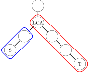
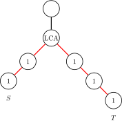

# 前缀和 & 差分 - OI Wiki

- Source: https://oi-wiki.org/basic/prefix-sum/

# 前缀和 & 差分

## 引入

前缀和与差分是算法竞赛中常用的技巧，前者用于快速求区间和，后者用于高效进行区间修改．

规定

为方便讨论，本文默认数组 {𝑎𝑖}{ai} 下标从 11 开始，并补充定义 𝑎0 =0a0=0．

## 前缀和

前缀和可以简单理解为「数列的前 𝑛n 项的和」，是一种重要的预处理方式．

### 一维前缀和

对于长度为 𝑛n 的序列 {𝑎𝑖}{ai}，如果要多次查询区间 [𝑙,𝑟][l,r] 中序列数字的和，就可以考虑使用前缀和．序列的前缀和就是

𝑆𝑖=𝑖∑𝑗=1𝑎𝑗.Si=∑j=1iaj.

它可以通过递推关系式

𝑆0=0, 𝑆𝑖=𝑆𝑖−1+𝑎𝑖S0=0, Si=Si−1+ai

逐项计算得到．要询问区间 [𝑙,𝑟][l,r] 内的序列的和，只需要计算差值

𝑆([𝑙,𝑟])=𝑆𝑟−𝑆𝑙−1.S([l,r])=Sr−Sl−1.

就这样，通过 𝑂(𝑛)O(n) 时间预处理，能够将单次查询区间和的复杂度降低到 𝑂(1)O(1)．

参考实现

C++Python

```text 1 2 3 4 5 6 7 8 9 10 11 12 13 14 15 16 ``` |  ```text int n ; // Array size. std :: vector < int > a ; // Array. (indexed from 1) std :: vector < int > ps ; // Prefix sum array. // Calculate prefix sum. void prefix_sum () { ps = a ; // Or simply: // std::partial_sum(a.begin(), a.end(), ps.begin()); for ( int i = 1 ; i <= n ; ++ i ) { ps [ i ] += ps [ i \- 1 ]; } } // Query sum of elements in [l, r]. int query ( int l , int r ) { return ps [ r ] \- ps [ l \- 1 ]; } ```   
---|---  
  
```text 1 2 3 4 5 6 7 8 9 10 11 12 13 14 15 16 17 18 ``` |  ```text n = 0 # Array size a = [] # Array (indexed from 1) ps = [] # Prefix sum array # Calculate prefix sum def prefix_sum (): global ps ps = a [:] # Or simply: # ps = list(itertools.accumulate(a)) for i in range ( 1 , n \+ 1 ): ps [ i ] += ps [ i \- 1 ] # Query sum of elements in [l, r] def query ( l , r ): return ps [ r ] \- ps [ l \- 1 ] ```   
---|---  
  
C++ 标准库中实现了前缀和函数 [`std::partial_sum`](https://zh.cppreference.com/w/cpp/algorithm/partial_sum)，定义于头文件 `<numeric>` 中．从 C++17 开始，标准库还提供了一个功能相同的前缀和函数 [`std::inclusive_scan`](https://zh.cppreference.com/w/cpp/algorithm/inclusive_scan)，同样定义于头文件 `<numeric>` 中．

### 二维/多维前缀和

将一维前缀和拓展到多维的情形，就是多维前缀和．常见的多维前缀和的求解方法有两种．

#### 基于容斥原理

这种方法多用于二维前缀和的情形．给定大小为 𝑚 ×𝑛m×n 的二维数组 𝐴A，要求出其前缀和 𝑆S．那么，𝑆S 同样是大小为 𝑚 ×𝑛m×n 的二维数组，且

𝑆𝑖,𝑗=∑𝑖′≤𝑖∑𝑗′≤𝑗𝐴𝑖′,𝑗′.Si,j=∑i′≤i∑j′≤jAi′,j′.

类比一维的情形，𝑆𝑖,𝑗Si,j 应该可以基于 𝑆𝑖−1,𝑗Si−1,j 或 𝑆𝑖,𝑗−1Si,j−1 计算，从而避免重复计算前面若干项的和．但是，如果直接将 𝑆𝑖−1,𝑗Si−1,j 和 𝑆𝑖,𝑗−1Si,j−1 相加，再加上 𝐴𝑖,𝑗Ai,j，会导致重复计算 𝑆𝑖−1,𝑗−1Si−1,j−1 这一重叠部分的前缀和，所以还需要再将这部分减掉．这就是 [容斥原理](../../math/combinatorics/inclusion-exclusion-principle/)．由此得到如下递推关系：

𝑆𝑖,𝑗=𝐴𝑖,𝑗+𝑆𝑖−1,𝑗+𝑆𝑖,𝑗−1−𝑆𝑖−1,𝑗−1.Si,j=Ai,j+Si−1,j+Si,j−1−Si−1,j−1.

实现时，直接遍历 (𝑖,𝑗)(i,j) 求和即可．

示例

考虑一个具体的例子．


其中，𝑆S 是矩阵 𝐴A 的前缀和．根据定义，𝑆3,3S3,3 是左图中虚线方框中的子矩阵的和．而且，𝑆3,2S3,2 是蓝色子矩阵的和，𝑆2,3S2,3 是红色子矩阵的和，它们重叠部分的和是 𝑆2,2S2,2．由此可见，如果直接相加 𝑆3,2S3,2 和 𝑆2,3S2,3，会重复计算 𝑆2,2S2,2，所以应该有

𝑆3,3=𝐴3,3+𝑆2,3+𝑆3,2−𝑆2,2=5+18+15−9=29.S3,3=A3,3+S2,3+S3,2−S2,2=5+18+15−9=29.

同样的道理，在已经预处理出二维前缀和后，要查询左上角为 (𝑖1,𝑗1)(i1,j1)、右下角为 (𝑖2,𝑗2)(i2,j2) 的子矩阵的和，可以计算

𝑆𝑖2,𝑗2−𝑆𝑖1−1,𝑗2−𝑆𝑖2,𝑗1−1+𝑆𝑖1−1,𝑗1−1.Si2,j2−Si1−1,j2−Si2,j1−1+Si1−1,j1−1.

这可以在 𝑂(1)O(1) 时间内完成．

在二维的情形，以上算法的时间复杂度可以简单认为是 𝑂(𝑚𝑛)O(mn)，即与给定数组的大小成线性关系．但是，当维度 𝑘k 增大时，由于容斥原理涉及的项数以指数级的速度增长，时间复杂度会成为 𝑂(2𝑘𝑁)O(2kN)，其中 𝑘k 是数组维度，而 𝑁N 是给定数组大小．因此，该算法不再适用．

[洛谷 P1387 最大正方形](https://www.luogu.com.cn/problem/P1387)

在一个 𝑛 ×𝑚n×m 的只包含 00 和 11 的矩阵里找出一个不包含 00 的最大正方形，输出边长．

参考代码

C++Python

```text 1 2 3 4 5 6 7 8 9 10 11 12 13 14 15 16 17 18 19 20 21 22 23 24 25 26 27 28 29 30 31 32 33 34 35 36 37 38 ``` |  ```text #include <algorithm> #include <iostream> #include <vector> int n , m ; std :: vector < std :: vector < int >> a , ps ; // (n + 1) x (m + 1). // Calculate the prefix sum of 2-d array. void prefix_sum () { ps = a ; for ( int i = 1 ; i <= n ; ++ i ) for ( int j = 1 ; j <= m ; ++ j ) ps [ i ][ j ] += ps [ i \- 1 ][ j ] \+ ps [ i ][ j \- 1 ] \- ps [ i \- 1 ][ j \- 1 ]; } // Find the sum of elements in submatrix [x1, y1] to [x2, y2]. int query ( int x1 , int y1 , int x2 , int y2 ) { return ps [ x2 ][ y2 ] \- ps [ x1 \- 1 ][ y2 ] \- ps [ x2 ][ y1 \- 1 ] \+ ps [ x1 \- 1 ][ y1 \- 1 ]; } int main () { std :: cin >> n >> m ; a . assign ( n \+ 1 , std :: vector < int > ( m \+ 1 )); for ( int i = 1 ; i <= n ; i ++ ) for ( int j = 1 ; j <= m ; j ++ ) std :: cin >> a [ i ][ j ]; prefix_sum (); int ans = 0 ; for ( int l = 1 ; l <= std :: min ( n , m ); ++ l ) for ( int i = l ; i <= n ; i ++ ) for ( int j = l ; j <= m ; j ++ ) if ( query ( i \- l \+ 1 , j \- l \+ 1 , i , j ) == l * l ) ans = std :: max ( ans , l ); std :: cout << ans << std :: endl ; return 0 ; } ```   
---|---  
  
```text 1 2 3 4 5 6 7 8 9 10 11 12 13 14 15 16 17 18 19 20 21 22 23 24 25 26 27 28 29 30 31 32 33 34 35 36 37 38 ``` |  ```text n , m = 0 , 0 a = [] # (n+1) x (m+1) ps = [] # prefix sum array # Calculate the prefix sum of 2D array. def prefix_sum (): global ps ps = [ row [:] for row in a ] # Deep copy of a for i in range ( 1 , n \+ 1 ): for j in range ( 1 , m \+ 1 ): ps [ i ][ j ] += ps [ i \- 1 ][ j ] \+ ps [ i ][ j \- 1 ] \- ps [ i \- 1 ][ j \- 1 ] # Find the sum of elements in submatrix [x1, y1] to [x2, y2]. def query ( x1 , y1 , x2 , y2 ): return ps [ x2 ][ y2 ] \- ps [ x1 \- 1 ][ y2 ] \- ps [ x2 ][ y1 \- 1 ] \+ ps [ x1 \- 1 ][ y1 \- 1 ] if __name__ == "__main__" : n , m = map ( int , input () . split ()) # Initialize with zero padding for 1-based indexing a = [[ 0 ] * ( m \+ 1 )] for _ in range ( n ): row = list ( map ( int , input () . split ())) a . append ([ 0 ] \+ row ) prefix_sum () ans = 0 for l in range ( 1 , min ( n , m ) \+ 1 ): for i in range ( l , n \+ 1 ): for j in range ( l , m \+ 1 ): if query ( i \- l \+ 1 , j \- l \+ 1 , i , j ) == l * l : ans = max ( ans , l ) print ( ans ) ```   
---|---  
  
#### 逐维前缀和

对于一般的情形，给定 𝑘k 维数组 𝐴A，大小为 𝑁N，同样要求得其前缀和 𝑆S．这里，

𝑆𝑖1,⋯,𝑖𝑘=∑𝑖′1≤𝑖1⋯∑𝑖′𝑘≤𝑖𝑘𝐴𝑖′1,⋯,𝑖′𝑘.Si1,⋯,ik=∑i1′≤i1⋯∑ik′≤ikAi1′,⋯,ik′.

从上式可以看出，𝑘k 维前缀和就等于 𝑘k 次求和．所以，一个显然的算法是，每次只考虑一个维度，固定所有其它维度，然后求若干个一维前缀和，这样对所有 𝑘k 个维度分别求和之后，得到的就是 𝑘k 维前缀和．

三维前缀和的参考实现

```text 1 2 3 4 5 6 7 8 9 10 11 12 13 14 15 16 17 18 19 20 21 22 23 ``` |  ```text int N1 , N2 , N3 ; std :: vector < std :: vector < std :: vector < int >>> a , ps ; // (N1 + 1) x (N2 + 1) x (N3 + 1). // Calculate prefix sum of 3d array. void prefix_sum () { ps = a ; // Prefix-sum for 3rd dimension. for ( int i = 1 ; i <= N1 ; ++ i ) for ( int j = 1 ; j <= N2 ; ++ j ) for ( int k = 1 ; k <= N3 ; ++ k ) ps [ i ][ j ][ k ] += ps [ i ][ j ][ k \- 1 ]; // Prefix-sum for 2nd dimension. for ( int i = 1 ; i <= N1 ; ++ i ) for ( int j = 1 ; j <= N2 ; ++ j ) for ( int k = 1 ; k <= N3 ; ++ k ) ps [ i ][ j ][ k ] += ps [ i ][ j \- 1 ][ k ]; // Prefix-sum for 1st dimension. for ( int i = 1 ; i <= N1 ; ++ i ) for ( int j = 1 ; j <= N2 ; ++ j ) for ( int k = 1 ; k <= N3 ; ++ k ) ps [ i ][ j ][ k ] += ps [ i \- 1 ][ j ][ k ]; } ```   
---|---  
  
因为考虑每一个维度的时候，都只遍历了整个数组一遍，这样的算法复杂度是 𝑂(𝑘𝑁)O(kN) 的，通常可以接受．

#### 特例：子集和 DP

维度比较大的情形，经常出现在一类叫做 **子集和** （sum over subsets, SOS）的问题中．这是高维前缀和的特例．

问题描述如下．考虑大小为 𝑛n 的集合的全体子集上面定义的函数 𝑓f，现在要求出其子集和函数 𝑔g，它满足

𝑔(𝑆)=∑𝑇⊆𝑆𝑓(𝑇).g(S)=∑T⊆Sf(T).

即 𝑔(𝑆)g(S) 等于其所有子集 𝑇 ⊆𝑆T⊆S 上的函数值 𝑓(𝑇)f(T) 的和．

首先，子集和问题可以写成高维前缀和的形式．注意到，𝑆S 的子集可以通过状态压缩的思想表示为长度为 𝑛n 的 0-1 字符串 𝑠s．将字符串的每一位都看作是数组下标的一个维度，那么 𝑓f 其实就是一个 𝑛n 维数组，且每个维度下标都一定在 {0,1}{0,1} 中．同时，子集的包含关系就等价于下标的大小关系，即

𝑇⊆𝑆⟺∀𝑖(𝑡𝑖≤𝑠𝑖).T⊆S⟺∀i(ti≤si).

所以，对子集求和，就是求这个 𝑛n 维数组的前缀和．

现在，可以直接使用前文所述的逐维前缀和的方法求得子集和．时间复杂度是 𝑂(𝑛2𝑛)O(n2n)．

参考实现

```text 1 2 3 4 5 6 7 8 9 10 11 12 13 14 15 16 17 ``` |  ```text int n ; std :: vector < int > a , ps ; // length = 1 << n. void sum_of_subsets () { ps = a ; // Loop over dimensions. for ( int i = 0 ; i < n ; ++ i ) { // Loop over i-th dimension. for ( int st = 0 ; st < ( 1 << n ); ++ st ) { // This condition implies that i-th dimension is 1. if (( st >> i ) & 1 ) { // ps[... 1 ...] += ps[... 0 ...]. (i-th dimension) ps [ st ] += ps [ st ^ ( 1 << i )]; } } } } ```   
---|---  
  
子集和的逆操作需要通过 [容斥原理](../../math/combinatorics/inclusion-exclusion-principle/) 进行．子集和问题也是快速莫比乌斯变换的必要步骤之一．

### 树上前缀和

一维前缀和还可以推广到有根树（树根为 11）的情形．通过预处理前缀和，可以快速求解树上一段路径的权值和．

#### 点权的情形

首先讨论权值存储在结点处的情形．设结点 𝑥x 处有权值 𝑎𝑥ax．可以通过递推关系

𝑆1=𝑎1, 𝑆𝑥=𝑆fa⁡(𝑥)+𝑎𝑥S1=a1, Sx=Sfa⁡(x)+ax

求出从根结点到结点 𝑥x 的路径上的结点的权值和，其中，fa⁡(𝑥)fa⁡(x) 表示 𝑥x 的父结点．预处理完前缀和后，就可以通过

𝑆𝑥+𝑆𝑦−𝑆lca⁡(𝑥,𝑦)−𝑆fa⁡(lca⁡(𝑥,𝑦))Sx+Sy−Slca⁡(x,y)−Sfa⁡(lca⁡(x,y))

计算连接结点 𝑥x 和 𝑦y 的路径上的结点权值和．其中，lca⁡(𝑥,𝑦)lca⁡(x,y) 表示结点 𝑥x 与 𝑦y 的 [最近公共祖先](../../graph/lca/)．

#### 边权的情形

权值储存在边上的情形几乎可以转化为点权的情形．对于所有非根结点 𝑥 ≠1x≠1，记 edge⁡(𝑥)edge⁡(x) 表示连接结点 𝑥x 和它的父结点 fa⁡(𝑥)fa⁡(x) 的边．那么，可以假设边权存储在离根远的结点上．也就是说，结点 𝑥x 处存储的是边 edge⁡(𝑥)edge⁡(x) 上的边权．根结点处存储的权值是 00．那么，通过上一小节讨论过的递推关系，同样可以预处理出根结点到结点 𝑥x 的路径经过的所有边的权值和 𝑆𝑥Sx．

此时，连接结点 𝑥x 和 𝑦y 的路径上的结点权值和可以通过

𝑆𝑥+𝑆𝑦−2𝑆lca⁡(𝑥,𝑦)Sx+Sy−2Slca⁡(x,y)

进行查询．注意与点权的情形不同，所查询的权值和不包括 lca⁡(𝑥,𝑦)lca⁡(x,y) 处的权值，因为它存储的边权不在所求路径中．

#### 子树和

和数组的情形不同，由于树的首尾不对称，所以自下而上（从树叶到树根）和自上而下（从树根到树叶）求「前缀和」得到的结果并不相同．一般情况下，「树上前缀和」指的是自上而下计算的前缀和．为方便讨论，本文将自下而上计算的「前缀和」称为 **子树和** ．

以结点 𝑥x 为根的子树的点权权值和，即相应的子树和，就是

𝑇𝑥=∑𝑦∈desc⁡(𝑥)𝑎𝑥.Tx=∑y∈desc⁡(x)ax.

其中，desc⁡(𝑥)desc⁡(x) 表示 𝑥x 的所有子孙结点（包括其自身）的集合．

与树上前缀和不同，子树和并不能应用于 𝑂(1)O(1) 求路径权值和，但是它可以用于理解下文的树上差分．

## 差分

差分是一种与前缀和相对的策略，是前缀和的逆运算．相较于给定某一序列求它的差分，竞赛中更为常见的情景是，通过维护差分序列的信息，实现多次区间修改．在区间修改结束后，可以通过前缀和恢复原序列的信息，实现对原序列的查询．注意修改操作一定要在查询操作之前．

如果需要支持多次修改和查询的混合操作，需要使用 [树状数组](../../ds/fenwick/)，但是它们的思想是共通的．

### 一维差分

对于序列 {𝑎𝑖}{ai}，它的差分序列 {𝐷𝑖}{Di} 是指

𝐷𝑖=𝑎𝑖−𝑎𝑖−1, 𝑎0=0.Di=ai−ai−1, a0=0.

C++ 标准库中实现了差分函数 [`std::adjacent_difference`](https://zh.cppreference.com/w/cpp/algorithm/adjacent_difference)，定义于头文件 `<numeric>` 中．

前缀和与差分的关系如下：

性质

设 {𝐷𝑖}{Di} 是 {𝑎𝑖}{ai} 的差分序列，那么，有

  * 序列 {𝑎𝑖}{ai} 是序列 {𝐷𝑖}{Di} 的前缀和，即

𝑎𝑖=𝑖∑𝑗=1𝐷𝑗.ai=∑j=1iDj.
  * 序列 {𝑎𝑖}{ai} 的前缀和为

𝑆𝑖=𝑖∑𝑗=1𝑗∑𝑘=1𝐷𝑘=𝑖∑𝑗=1(𝑖−𝑗+1)𝐷𝑗.Si=∑j=1i∑k=1jDk=∑j=1i(i−j+1)Dj.

差分信息常常用于维护多次对序列的一个区间加上一个数，并在之后一次或多次询问序列某一位的取值．

假设要将序列 {𝑎𝑖}{ai} 在区间 [𝑙,𝑟][l,r] 中的每个数都加上一个 𝑣v．可以在它的差分序列 {𝐷𝑖}{Di} 上做如下操作：

𝐷𝑙←𝐷𝑙+𝑣, 𝐷𝑟+1←𝐷𝑟+1−𝑣.Dl←Dl+v, Dr+1←Dr+1−v.

在所有修改操作结束后，可以通过前缀和操作恢复更新后的 {𝑎𝑖}{ai} 的值．单次修改是 𝑂(1)O(1) 的．查询时，需要做一次 𝑂(𝑛)O(n) 的前缀和操作，随后每次查询都是 𝑂(1)O(1) 的．

参考代码

```text 1 2 3 4 5 6 7 8 9 10 11 12 13 ``` |  ```text int n ; std :: vector < int > diff , a ; // Add v to each element in [l, r]. void add ( int l , int r , int v ) { diff [ l ] += v ; if ( r < n ) diff [ r \+ 1 ] -= v ; } // Execute this after all modifications and before all queries. void prefix_sum () { for ( int i = 1 ; i <= n ; ++ i ) a [ i ] = a [ i \- 1 ] \+ diff [ i ]; } ```   
---|---  
  
### 二维/多维差分

差分同样可以推广到多维的情形．将多维差分看作多维前缀和的逆运算，那么，求多维差分数组的操作就相当于根据多维前缀和求它的原数组．根据前文讨论，可以利用容斥原理．例如，二维差分的定义是

𝐷𝑖,𝑗=𝑎𝑖,𝑗−𝑎𝑖−1,𝑗−𝑎𝑖,𝑗−1+𝑎𝑖−1,𝑗−1.Di,j=ai,j−ai−1,j−ai,j−1+ai−1,j−1.

但是，如果要计算整个差分数组，更为简单高效的做法是逐维差分，即穷举所有维度，沿着每个维度都计算一遍数组的差分．

二维差分信息常用于维护二维数组的多次矩形加．例如，要对左上角为 (𝑥1,𝑦1)(x1,y1)、右下角为 (𝑥2,𝑦2)(x2,y2) 的矩阵中的每个数字都加上 𝑣v，可以对它的差分数组 {𝐷𝑖,𝑗}{Di,j} 做如下操作：

𝐷𝑥1,𝑦1←𝐷𝑥1,𝑦1+𝑣,𝐷𝑥1,𝑦2+1←𝐷𝑥1,𝑦2+1−𝑣,𝐷𝑥2+1,𝑦1←𝐷𝑥2+1,𝑦1−𝑣,𝐷𝑥2+1,𝑦2+1←𝐷𝑥2+1,𝑦2+1+𝑣.Dx1,y1←Dx1,y1+v,Dx1,y2+1←Dx1,y2+1−v,Dx2+1,y1←Dx2+1,y1−v,Dx2+1,y2+1←Dx2+1,y2+1+v.

在所有修改操作结束后，只需要执行一遍二维前缀和，就可以快速查询更新后的数组的值．

参考代码

```text 1 2 3 4 5 6 7 8 9 10 11 12 13 14 15 16 17 18 19 20 21 ``` |  ```text int n , m ; std :: vector < std :: vector < int >> diff , a ; // Add v to each element from [x1, y1] to [x2, y2]. void add ( int x1 , int y1 , int x2 , int y2 , int v ) { diff [ x1 ][ y1 ] += v ; if ( x2 < n ) diff [ x2 \+ 1 ][ y1 ] -= v ; if ( y2 < m ) diff [ x1 ][ y2 \+ 1 ] -= v ; if ( x2 < n && y2 < m ) diff [ x2 \+ 1 ][ y2 \+ 1 ] += v ; } // Execute this after all modifications and before all queries. void prefix_sum () { a = diff ; for ( int i = 1 ; i <= n ; ++ i ) for ( int j = 1 ; j <= m ; ++ j ) a [ i ][ j ] += a [ i \- 1 ][ j ]; for ( int i = 1 ; i <= n ; ++ i ) for ( int j = 1 ; j <= m ; ++ j ) a [ i ][ j ] += a [ i ][ j \- 1 ]; } ```   
---|---  
  
当然，类似的想法对于维度 𝑘 >2k>2 也成立，但是单次修改操作需要的时间复杂度为 𝑂(2𝑘)O(2k)，随着 𝑘k 增大而不再实用．

### 树上差分

差分可以推广到有根树的情形，用于实现树上一段路径的区间加操作．取决于维护的信息存储在结点上还是边上，树上差分可以分为 **点差分** 与 **边差分** ，在实现上会稍有不同．另外，相对于树上前缀和操作，更常用的是在所有修改操作后做子树和再查询．本节讨论的就是这种情形．

#### 点差分

如果要对结点 𝑥x 和 𝑦y 之间的路径上的所有点权都加 𝑣v，可以对它的差分序列 {𝐷𝑥}{Dx} 做如下操作：

𝐷𝑥←𝐷𝑥+𝑣,𝐷lca⁡(𝑥,𝑦)←𝐷lca⁡(𝑥,𝑦)−𝑣,𝐷𝑦←𝐷𝑦+𝑣,𝐷fa⁡(lca⁡(𝑥,𝑦))←𝐷fa⁡(lca⁡(𝑥,𝑦))−𝑣.Dx←Dx+v,Dlca⁡(x,y)←Dlca⁡(x,y)−v,Dy←Dy+v,Dfa⁡(lca⁡(x,y))←Dfa⁡(lca⁡(x,y))−v.

在所有修改操作完成后，可以计算一次子树和，就能得到更新后的点权．

示例

对结点 𝑆S 和 𝑇T 之间的路径上的点权做区间加操作时，上述公式中的前两条是对蓝色方框内的路径进行一维差分操作，后两条是对红色方框内的路径进行一维差分操作：



自下而上求和，就相当于对这两个区间从下向上计算前缀和．由此，对比上文的一维差分操作，就能知道点差分操作的正确性．

#### 边差分

如果要对结点 𝑥x 和 𝑦y 之间的路径上的所有边权都加 𝑣v，可以对它的差分序列 {𝐷𝑥}{Dx} 做如下操作：

𝐷𝑥←𝐷𝑥+𝑣,𝐷𝑦←𝐷𝑦+𝑣,𝐷lca⁡(𝑥,𝑦)←𝐷lca⁡(𝑥,𝑦)−2𝑣.Dx←Dx+v,Dy←Dy+v,Dlca⁡(x,y)←Dlca⁡(x,y)−2v.

在所有修改操作完成后，可以计算一次子树和，就能得到更新后的点权．

示例

如图所示，边差分操作可以用于解决红色路径上的边权区间加问题．



由于在边上直接进行差分比较困难，所以将本来应当累加到红色边上的值向下移动到相邻的结点里，操作起来就方便了．对比点差分的公式，就可以理解边差分的公式．

### 例题

[洛谷 3128 最大流](https://www.luogu.com.cn/problem/P3128)

FJ 给他的牛棚的 𝑁(2 ≤𝑁 ≤50,000)N(2≤N≤50,000) 个隔间之间安装了 𝑁 −1N−1 根管道，隔间编号从 11 到 𝑁N．所有隔间都被管道连通了．

FJ 有 𝐾(1 ≤𝐾 ≤100,000)K(1≤K≤100,000) 条运输牛奶的路线，第 𝑖i 条路线从隔间 𝑠𝑖si 运输到隔间 𝑡𝑖ti．一条运输路线会给它的两个端点处的隔间以及中间途径的所有隔间带来一个单位的运输压力，你需要计算压力最大的隔间的压力是多少．

解题思路

需要统计每个点经过了多少次，那么就用树上差分将每一次的路径上的点加一，可以很快得到每个点经过的次数．这里采用倍增法计算 LCA，最后对 DFS 遍历整棵树，在回溯时对差分数组求和就能求得答案了．

参考代码

```text 1 2 3 4 5 6 7 8 9 10 11 12 13 14 15 16 17 18 19 20 21 22 23 24 25 26 27 28 29 30 31 32 33 34 35 36 37 38 39 40 41 42 43 44 45 46 47 48 49 50 51 52 53 54 55 56 57 58 59 60 61 62 63 64 65 66 67 68 69 70 71 72 73 74 75 76 77 78 ``` |  ```text #include <algorithm> #include <iostream> using namespace std ; constexpr int MAXN = 50010 ; struct node { int to , next ; } edge [ MAXN << 1 ]; int fa [ MAXN ][ 30 ], head [ MAXN << 1 ]; int power [ MAXN ]; int depth [ MAXN ], lg [ MAXN ]; int n , k , ans = 0 , tot = 0 ; void add ( int x , int y ) { // 加边 edge [ ++ tot ]. to = y ; edge [ tot ]. next = head [ x ]; head [ x ] = tot ; } void dfs ( int now , int father ) { // dfs求最大压力 fa [ now ][ 0 ] = father ; depth [ now ] = depth [ father ] \+ 1 ; for ( int i = 1 ; i <= lg [ depth [ now ]]; ++ i ) fa [ now ][ i ] = fa [ fa [ now ][ i \- 1 ]][ i \- 1 ]; for ( int i = head [ now ]; i ; i = edge [ i ]. next ) if ( edge [ i ]. to != father ) dfs ( edge [ i ]. to , now ); } int lca ( int x , int y ) { // 求LCA，最近公共祖先 if ( depth [ x ] < depth [ y ]) swap ( x , y ); while ( depth [ x ] > depth [ y ]) x = fa [ x ][ lg [ depth [ x ] \- depth [ y ]] \- 1 ]; if ( x == y ) return x ; for ( int k = lg [ depth [ x ]] \- 1 ; k >= 0 ; k \-- ) { if ( fa [ x ][ k ] != fa [ y ][ k ]) x = fa [ x ][ k ], y = fa [ y ][ k ]; } return fa [ x ][ 0 ]; } // 用dfs求最大压力，回溯时将子树的权值加上 void get_ans ( int u , int father ) { for ( int i = head [ u ]; i ; i = edge [ i ]. next ) { int to = edge [ i ]. to ; if ( to == father ) continue ; get_ans ( to , u ); power [ u ] += power [ to ]; } ans = max ( ans , power [ u ]); } int main () { cin . tie ( nullptr ) -> sync_with_stdio ( false ); cin >> n >> k ; int x , y ; for ( int i = 1 ; i <= n ; i ++ ) { lg [ i ] = lg [ i \- 1 ] \+ ( 1 << lg [ i \- 1 ] == i ); } for ( int i = 1 ; i <= n \- 1 ; i ++ ) { // 建图 cin >> x >> y ; add ( x , y ); add ( y , x ); } dfs ( 1 , 0 ); int s , t ; for ( int i = 1 ; i <= k ; i ++ ) { cin >> s >> t ; int ancestor = lca ( s , t ); // 树上差分 power [ s ] ++ ; power [ t ] ++ ; power [ ancestor ] \-- ; power [ fa [ ancestor ][ 0 ]] \-- ; } get_ans ( 1 , 0 ); cout << ans << '\n' ; return 0 ; } ```   
---|---  
  
## 习题

前缀和：

  * [洛谷 B3612【深进 1. 例 1】求区间和](https://www.luogu.com.cn/problem/B3612)
  * [洛谷 U69096 前缀和的逆](https://www.luogu.com.cn/problem/U69096)
  * [AtCoder joi2007ho_a 最大の和](https://atcoder.jp/contests/joi2007ho/tasks/joi2007ho_a)
  * [「USACO16JAN」子共七 Subsequences Summing to Sevens](https://www.luogu.com.cn/problem/P3131)
  * [「USACO05JAN」Moo Volume S](https://www.luogu.com.cn/problem/P6067)

二维/多维前缀和：

  * [HDU 6514 Monitor](https://acm.hdu.edu.cn/showproblem.php?pid=6514)
  * [洛谷 P1387 最大正方形](https://www.luogu.com.cn/problem/P1387)
  * [「HNOI2003」激光炸弹](https://www.luogu.com.cn/problem/P2280)
  * [CF 165E Compatible Numbers](https://codeforces.com/contest/165/problem/E)
  * [CF 383E Vowels](https://codeforces.com/problemset/problem/383/E)
  * [ARC 100C Or Plus Max](https://atcoder.jp/contests/arc100/tasks/arc100_c)

树上前缀和：

  * [LOJ 10134.Dis](https://loj.ac/problem/10134)
  * [LOJ 2491. 求和](https://loj.ac/problem/2491)

差分：

  * [树状数组 3：区间修改，区间查询](https://loj.ac/problem/132)
  * [「Poetize6」IncDec Sequence](https://www.luogu.com.cn/problem/P4552)
  * [洛谷 P4231 三步必杀](https://www.luogu.com.cn/problem/P4231)

二维/多维差分：

  * [洛谷 P3397 地毯](https://www.luogu.com.cn/problem/P3397)
  * [洛谷 P8228「Wdoi-5」模块化核熔炉](https://www.luogu.com.cn/problem/P8228)

树上差分：

  * [洛谷 3128 最大流](https://www.luogu.com.cn/problem/P3128)
  * [JLOI2014 松鼠的新家](https://loj.ac/problem/2236)
  * [NOIP2015 运输计划](http://uoj.ac/problem/150)
  * [NOIP2016 天天爱跑步](http://uoj.ac/problem/261)

* * *

>  __本页面最近更新： 2026/3/26 00:24:13，[更新历史](https://github.com/OI-wiki/OI-wiki/commits/master/docs/basic/prefix-sum.md)  
>  __发现错误？想一起完善？[在 GitHub 上编辑此页！](https://oi-wiki.org/edit-landing/?ref=/basic/prefix-sum.md "edit.link.title")  
>  __本页面贡献者：[ChungZH](https://github.com/ChungZH), [Ir1d](https://github.com/Ir1d), [c-forrest](https://github.com/c-forrest), [H-J-Granger](https://github.com/H-J-Granger), [NachtgeistW](https://github.com/NachtgeistW), [sshwy](https://github.com/sshwy), [StudyingFather](https://github.com/StudyingFather), [Tiphereth-A](https://github.com/Tiphereth-A), [Enter-tainer](https://github.com/Enter-tainer), [countercurrent-time](https://github.com/countercurrent-time), [mgt](mailto:i@margatroid.xyz), [diauweb](https://github.com/diauweb), [Early0v0](https://github.com/Early0v0), [ksyx](https://github.com/ksyx), [Alpha1022](https://github.com/Alpha1022), [AngelKitty](https://github.com/AngelKitty), [CCXXXI](https://github.com/CCXXXI), [cjsoft](https://github.com/cjsoft), [ezoixx130](https://github.com/ezoixx130), [GekkaSaori](https://github.com/GekkaSaori), [Henry-ZHR](https://github.com/Henry-ZHR), [Konano](https://github.com/Konano), [LovelyBuggies](https://github.com/LovelyBuggies), [Makkiy](https://github.com/Makkiy), [minghu6](https://github.com/minghu6), [P-Y-Y](https://github.com/P-Y-Y), [PotassiumWings](https://github.com/PotassiumWings), [SamZhangQingChuan](https://github.com/SamZhangQingChuan), [Suyun514](mailto:suyun514@qq.com), [weiyong1024](https://github.com/weiyong1024), [Alpacabla](https://github.com/Alpacabla), [Backl1ght](https://github.com/Backl1ght), [Chrogeek](https://github.com/Chrogeek), [Developer09264](https://github.com/Developer09264), [GavinZhengOI](https://github.com/GavinZhengOI), [Gesrua](https://github.com/Gesrua), [HeRaNO](https://github.com/HeRaNO), [iamtwz](https://github.com/iamtwz), [Junyan721113](https://github.com/Junyan721113), [Kaiser-Yang](https://github.com/Kaiser-Yang), [kenlig](https://github.com/kenlig), [Kensuke-Hinata](https://github.com/Kensuke-Hinata), [kxccc](https://github.com/kxccc), [LeiJinpeng](https://github.com/LeiJinpeng), [LeoJacob](https://github.com/LeoJacob), [leoleoasd](https://github.com/leoleoasd), [lychees](https://github.com/lychees), [ouuan](https://github.com/ouuan), [Peanut-Tang](https://github.com/Peanut-Tang), [Planet6174](https://github.com/Planet6174), [ShaoChenHeng](https://github.com/ShaoChenHeng), [shawlleyw](https://github.com/shawlleyw), [SukkaW](https://github.com/SukkaW), [wuyudi](mailto:wuyudi1109@gmail.com)  
>  __本页面的全部内容在**[CC BY-SA 4.0](https://creativecommons.org/licenses/by-sa/4.0/deed.zh) 和 [SATA](https://github.com/zTrix/sata-license)** 协议之条款下提供，附加条款亦可能应用
