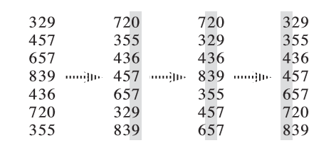

# 基数排序 - OI Wiki

- Source: https://oi-wiki.org/basic/radix-sort/

# 基数排序

提醒

本页面要介绍的不是 [**计数排序**](../counting-sort/)．

本页面将简要介绍基数排序．

## 定义

基数排序（英语：Radix sort）是一种非比较型的排序算法，最早用于解决卡片排序的问题．基数排序将待排序的元素拆分为 𝑘k 个关键字，逐一对各个关键字排序后完成对所有元素的排序．

如果是从第 11 关键字到第 𝑘k 关键字顺序进行比较，则该基数排序称为 MSD（Most Significant Digit first）基数排序；

如果是从第 𝑘k 关键字到第 11 关键字顺序进行比较，则该基数排序称为 LSD（Least Significant Digit first）基数排序．

## k - 关键字元素的比较

下面用 𝑎𝑖ai 表示元素 𝑎a 的第 𝑖i 关键字．

假如元素有 𝑘k 个关键字，对于两个元素 𝑎a 和 𝑏b，默认的比较方法是：

  * 比较两个元素的第 11 关键字 𝑎1a1 和 𝑏1b1，如果 𝑎1 <𝑏1a1<b1 则 𝑎 <𝑏a<b，如果 𝑎1 >𝑏1a1>b1 则 𝑎 >𝑏a>b，如果 𝑎1 =𝑏1a1=b1 则进行下一步；
  * 比较两个元素的第 22 关键字 𝑎2a2 和 𝑏2b2，如果 𝑎2 <𝑏2a2<b2 则 𝑎 <𝑏a<b，如果 𝑎2 >𝑏2a2>b2 则 𝑎 >𝑏a>b，如果 𝑎2 =𝑏2a2=b2 则进行下一步；
  * ……
  * 比较两个元素的第 𝑘k 关键字 𝑎𝑘ak 和 𝑏𝑘bk，如果 𝑎𝑘 <𝑏𝑘ak<bk 则 𝑎 <𝑏a<b，如果 𝑎𝑘 >𝑏𝑘ak>bk 则 𝑎 >𝑏a>b，如果 𝑎𝑘 =𝑏𝑘ak=bk 则 𝑎 =𝑏a=b．

例子：

  * 如果对自然数进行比较，将自然数按个位对齐后往高位补齐 00，则一个数字从左往右数第 𝑖i 位数就可以作为第 𝑖i 关键字；
  * 如果对字符串基于字典序进行比较，一个字符串从左往右数第 𝑖i 个字符就可以作为第 𝑖i 关键字；
  * C++ 自带的 `std::pair` 与 `std::tuple` 的默认比较方法与上述的相同．

## MSD 基数排序

基于 k - 关键字元素的比较方法，可以想到：先比较所有元素的第 11 关键字，就可以确定出各元素大致的大小关系；然后对 **具有相同第 11 关键字的元素**，再比较它们的第 22 关键字……以此类推．

由于是从第 11 关键字到第 𝑘k 关键字顺序进行比较，由上述思想导出的排序算法称为 MSD（Most Significant Digit first）基数排序．

### 算法流程

将待排序的元素拆分为 𝑘k 个关键字，先对第 11 关键字进行稳定排序，然后对于每组 **具有相同关键字的元素** 再对第 22 关键字进行稳定排序（递归执行）……最后对于每组 **具有相同关键字的元素** 再对第 𝑘k 关键字进行稳定排序．

一般而言，我们默认基数排序是稳定的，所以在 MSD 基数排序中，我们也仅仅考虑借助 **稳定算法** （通常使用计数排序）完成内层对关键字的排序．

正确性参考上文 k - 关键字元素的比较．

### 参考代码

#### 对自然数排序

下面是使用迭代式 MSD 基数排序对 `unsigned int` 范围内元素进行排序的 C++ 参考代码，可调整 𝑊W 和 log2⁡𝑊log2⁡W 的值（建议将 log2⁡𝑊log2⁡W 设为 2𝑘2k 以便位运算优化）．

参考代码

```text 1 2 3 4 5 6 7 8 9 10 11 12 13 14 15 16 17 18 19 20 21 22 23 24 25 26 27 28 29 30 31 32 33 34 35 36 37 38 39 40 41 42 43 44 45 46 47 48 49 50 51 52 53 54 55 56 57 58 59 60 61 62 63 64 65 66 ``` |  ```text constexpr unsigned MAXN = 1000 ; // 要排序的数的个数 constexpr unsigned RADIX = 10 ; // 基数 constexpr unsigned powRADIX [ 10 ] = { 1 , 10 , 100 , 1000 , 10000 , 100000 , 1000000 , 10000000 , 100000000 , 1000000000 }; // RADIX 的幂 unsigned get_digit ( unsigned value , int digit ) // 提取第 digit 位 { return ( value / powRADIX [ digit ]) % RADIX ; } void MSD_radix_sort ( unsigned * begin , unsigned * end , int digit ) // 表示现在 [begin,end) 内的元素（10 进制下）前若干位都相同 // 只有最后 digit 位（第 digit-1 到 0 位）需要进行排序 // 调用示例：MSD_radix_sort(a,a+n,9) { if ( begin >= end ) // 空区间 { return ; } /**计数排序（个人写法仅供参考）**/ static unsigned cnt [ RADIX \+ 1 ], tmp [ MAXN \+ 5 ]; // 由于不同层递归不会同时使用 cnt,tmp // 数组（每层使用完毕才会调用下一层），使用 static // 关键字可以节省空间 vector < unsigned > beg ; beg . resize ( RADIX \+ 1 ); // 对 beg 的访问可能冲突，使用局部变量 for ( int i = 0 ; i <= RADIX ; i ++ ) { cnt [ i ] = beg [ i ] = 0 ; // 清空是一个好习惯 } for ( unsigned * it = begin ; it != end ; it ++ ) // 计数 { int bitVal = get_digit ( * it , digit \- 1 ); cnt [ bitVal ] += 1 ; } beg [ 0 ] = 0 ; // 计算每个数码开始存储的位置（偏移量） for ( int i = 1 ; i <= RADIX ; i ++ ) { beg [ i ] = beg [ i \- 1 ] \+ cnt [ i \- 1 ]; } // 多计算 beg[RADIX] 是因为这样可以直接定义 i 对应的范围是 [beg[i],beg[i+1]) // 而不用担心那个 beg[i+1] 越界 for ( int i = 0 ; i < RADIX ; i ++ ) { cnt [ i ] = 0 ; } for ( unsigned * it = begin ; it != end ; it ++ ) // 将计数排序结果放入 tmp { unsigned bitVal = get_digit ( * it , digit \- 1 ); // 提取第 bit-1 位 tmp [ beg [ bitVal ] \+ cnt [ bitVal ]] = * it ; // 因为是倒序枚举，所以当前是第 cnt[bitVal]+1 个第 bit-1 位是 // cnt[bitVal] 的 cnt [ bitVal ] ++ ; } for ( unsigned * it = begin ; it != end ; it ++ ) // 将 tmp 拷贝回原数组 { * it = tmp [ it \- begin ]; } /**迭代计算**/ if ( digit == 1 ) // 已经是最低位 { return ; } for ( int i = 0 ; i < RADIX ; i ++ ) // 递归排序下一位 { MSD_radix_sort ( begin \+ beg [ i ], begin \+ beg [ i \+ 1 ], digit \- 1 ); } } ```   
---|---  
  
#### 对字符串排序

下面是使用迭代式 MSD 基数排序对 [空终止字节字符串](https://zh.cppreference.com/w/cpp/string/byte) 基于字典序进行排序的 C++ 参考代码：

参考代码

```text 1 2 3 4 5 6 7 8 9 10 11 12 13 14 15 16 17 18 19 20 21 22 23 24 25 26 27 28 29 30 31 32 33 34 35 36 37 38 39 40 41 42 43 44 45 46 47 48 49 50 51 52 53 54 55 ``` |  ```text constexpr int MAXN = 1000 ; int get_digit ( string * arr , int i , int dig ) { if ( arr [ i ][ dig ] == '\0' ) return 0 ; return arr [ i ][ dig ] \- 'a' \+ 1 ; } void MSD_radix_sort_string_base ( string * arr , int * begin , int * end , int digit ) // 主体函数 // 对仅由小写字母构成的字符串排序 // 参数表示现在 [begin,end) 内的元素 [0,digit) 位都相同 // 现在从 digit 位开始进行排序 // 调用示例：MSD_radix_sort_string(a,a+n,0) // 和上一份代码几乎完全相同，所以注释较少 // 为节省空间和时间，我们对下标数组进行排序，比较函数依旧比较字符串对应位 { if ( begin >= end ) return ; static int tmp [ MAXN \+ 5 ]; static int cnt [ 28 ]; vector < int > beg ; beg . resize ( 28 ); // Q: 为什么开 28？ // A: 0=空字符，1-26=a-z，27=额外空间（防止越界） for ( int i = 0 ; i < 28 ; i ++ ) cnt [ i ] = beg [ i ] = 0 ; for ( int * it = begin ; it != end ; it ++ ) cnt [ get_digit ( arr , * it , digit )] += 1 ; beg [ 0 ] = 0 ; for ( int i = 1 ; i <= 27 ; i ++ ) beg [ i ] = beg [ i \- 1 ] \+ cnt [ i \- 1 ]; for ( int i = 0 ; i < 28 ; i ++ ) cnt [ i ] = 0 ; for ( int * it = begin ; it != end ; it ++ ) { int bitVal = get_digit ( arr , * it , digit ); tmp [ beg [ bitVal ] \+ cnt [ bitVal ]] = * it ; cnt [ bitVal ] ++ ; } for ( int * it = begin ; it != end ; it ++ ) * it = tmp [ it \- begin ]; // 如果已经是空字符了就没必要递归了，所以递归 1~26 for ( int i = 1 ; i <= 26 ; i ++ ) MSD_radix_sort_string_base ( arr , begin \+ beg [ i ], begin \+ beg [ i \+ 1 ], digit \+ 1 ); } int label [ MAXN \+ 5 ]; void MSD_radix_sort_string ( string * begin , string * end ) // 调用接口 { static string tmp [ MAXN \+ 5 ]; int n = end \- begin ; for ( int i = 0 ; i < n ; i ++ ) { label [ i ] = i ; tmp [ i ] = * ( begin \+ i ); } MSD_radix_sort_string_base ( tmp , label , label \+ n , 0 ); for ( int i = 0 ; i < n ; i ++ ) { * ( begin \+ i ) = tmp [ label [ i ]]; } } ```   
---|---  
  
由于两个字符串的比较很容易冲上 𝑂(𝑛)O(n) 的线性复杂度，因此在字符串排序这件事情上，MSD 基数排序比大多数基于比较的排序算法在时间复杂度和实际用时上都更加优秀．

### 与桶排序的关系

前置知识：[桶排序](../bucket-sort/)

桶排序需要其它的排序算法来完成对每个桶内部元素的排序．但实际上，完全可以对每个桶继续执行桶排序，直至某一步桶的元素数量 ≤1≤1．

因此 MSD 基数排序的另一种理解方式是：使用桶排序实现的桶排序．

也因此，可以提出 MSD 基数排序在时间常数上的一种优化方法：假如到某一步桶的元素数量 ≤𝐵≤B（𝐵B 是自己选的常数），则直接执行插入排序然后返回，降低递归次数．

## LSD 基数排序

MSD 基数排序从第 11 关键字到第 𝑘k 关键字顺序进行比较，为此需要借助递归或迭代来实现，时间常数还是较大，而且在比较自然数上还是略显不便．

而将递归的操作反过来：从第 𝑘k 关键字到第 11 关键字顺序进行比较，就可以得到 LSD（Least Significant Digit first）基数排序，不使用递归就可以完成的排序算法．

### 算法流程

将待排序的元素拆分为 𝑘k 个关键字，然后先对 **所有元素** 的第 𝑘k 关键字进行稳定排序，再对 **所有元素** 的第 𝑘 −1k−1 关键字进行稳定排序，再对 **所有元素** 的第 𝑘 −2k−2 关键字进行稳定排序……最后对 **所有元素** 的第 11 关键字进行稳定排序，这样就完成了对整个待排序序列的稳定排序．



LSD 基数排序也需要借助一种 **稳定算法** 完成内层对关键字的排序．同样的，通常使用计数排序来完成．

LSD 基数排序的正确性可以参考 [《算法导论（第三版）》第 8.3-3 题的解法](https://walkccc.github.io/CLRS/Chap08/8.3/#83-3) 或参考下面的解释：

### 正确性

回顾一下 k - 关键字元素的比较方法，

  * 假如想通过 𝑎1a1 和 𝑏1b1 就比较出两个元素 𝑎a 和 𝑏b 的大小，则需要提前知道通过比较 𝑎2a2 和 𝑏2b2 得到的结论，以便于应对 𝑎1 =𝑏1a1=b1 的情况；
  * 而想通过 𝑎2a2 和 𝑏2b2 就比较出两个元素 𝑎a 和 𝑏b 的大小，则需要提前知道通过比较 𝑎3a3 和 𝑏3b3 得到的结论，以便于应对 𝑎2 =𝑏2a2=b2 的情况；
  * ……
  * 而想通过 𝑎𝑘−1ak−1 和 𝑏𝑘−1bk−1 就比较出两个元素 𝑎a 和 𝑏b 的大小，则需要提前知道通过比较 𝑎𝑘ak 和 𝑏𝑘bk 得到的结论，以便于应对 𝑎𝑘−1 =𝑏𝑘−1ak−1=bk−1 的情况；
  * 𝑎𝑘ak 和 𝑏𝑘bk 可以直接比较．

现在，将顺序反过来：

  * 𝑎𝑘ak 和 𝑏𝑘bk 可以直接比较；
  * 而知道通过比较 𝑎𝑘ak 和 𝑏𝑘bk 得到的结论后，就可以得到比较 𝑎𝑘−1ak−1 和 𝑏𝑘−1bk−1 的结论；
  * ……
  * 而知道通过比较 𝑎2a2 和 𝑏2b2 得到的结论后，就可以得到比较 𝑎1a1 和 𝑏1b1 的结论；
  * 而知道通过比较 𝑎1a1 和 𝑏1b1 得到的结论后，就最终得到了比较 𝑎a 和 𝑏b 的结论．

在这个过程中，对每个关键字边比较边重排元素的顺序，就得到了 LSD 基数排序．

### 伪代码

1𝐈𝐧𝐩𝐮𝐭. An array 𝐴 consisting of 𝑛 elements, where each element has 𝑘 keys.2𝐎𝐮𝐭𝐩𝐮𝐭. Array 𝐴 will be sorted in nondecreasing order stably.3𝐌𝐞𝐭𝐡𝐨𝐝. 4𝐟𝐨𝐫 𝑖←𝑘 𝐝𝐨𝐰𝐧 𝐭𝐨 15sort 𝐴 into nondecreasing order by the 𝑖-th key stably1Input. An array A consisting of n elements, where each element has k keys.2Output. Array A will be sorted in nondecreasing order stably.3Method. 4for i←k down to 15sort A into nondecreasing order by the i-th key stably

### 参考代码

下面是使用 LSD 基数排序实现的对 k - 关键字元素的排序．

参考代码

```text 1 2 3 4 5 6 7 8 9 10 11 12 13 14 15 16 17 18 19 20 21 22 23 24 25 26 ``` |  ```text constexpr int N = 100010 ; constexpr int W = 100010 ; constexpr int K = 100 ; int n , w , k , cnt [ W ]; struct Element { int key [ K ]; } a [ N ], b [ N ]; void counting_sort ( int p ) { memset ( cnt , 0 , sizeof ( cnt )); for ( int i = 1 ; i <= n ; ++ i ) ++ cnt [ a [ i ]. key [ p ]]; for ( int i = 1 ; i <= w ; ++ i ) cnt [ i ] += cnt [ i \- 1 ]; // 为保证排序的稳定性，此处循环i应从n到1 // 即当两元素关键字的值相同时，原先排在后面的元素在排序后仍应排在后面 for ( int i = n ; i >= 1 ; \-- i ) b [ cnt [ a [ i ]. key [ p ]] \-- ] = a [ i ]; memcpy ( a , b , sizeof ( a )); } void radix_sort () { for ( int i = k ; i >= 1 ; \-- i ) { // 借助计数排序完成对关键字的排序 counting_sort ( i ); } } ```   
---|---  
  
实际上并非必须从后往前枚举才是稳定排序，只需对 `cnt` 数组进行等价于 `std::exclusive_scan` 的操作即可．

例题 [洛谷 P1177【模板】快速排序](https://www.luogu.com.cn/problem/P1177)

给出 𝑛n 个正整数，从小到大输出．

```text 1 2 3 4 5 6 7 8 9 10 11 12 13 14 15 16 17 18 19 20 21 22 23 24 25 26 27 28 29 30 31 32 33 34 35 ``` |  ```text #include <algorithm> #include <iostream> #include <utility> void radix_sort ( int n , int a []) { int * b = new int [ n ]; // 临时空间 int * cnt = new int [ 1 << 8 ]; int mask = ( 1 << 8 ) \- 1 ; int * x = a , * y = b ; for ( int i = 0 ; i < 32 ; i += 8 ) { for ( int j = 0 ; j != ( 1 << 8 ); ++ j ) cnt [ j ] = 0 ; for ( int j = 0 ; j != n ; ++ j ) ++ cnt [ x [ j ] >> i & mask ]; for ( int sum = 0 , j = 0 ; j != ( 1 << 8 ); ++ j ) { // 等价于 std::exclusive_scan(cnt, cnt + (1 << 8), cnt, 0); sum += cnt [ j ], cnt [ j ] = sum \- cnt [ j ]; } for ( int j = 0 ; j != n ; ++ j ) y [ cnt [ x [ j ] >> i & mask ] ++ ] = x [ j ]; std :: swap ( x , y ); } delete [] cnt ; delete [] b ; } int main () { std :: ios :: sync_with_stdio ( false ); std :: cin . tie ( nullptr ); int n ; std :: cin >> n ; int * a = new int [ n ]; for ( int i = 0 ; i < n ; ++ i ) std :: cin >> a [ i ]; radix_sort ( n , a ); for ( int i = 0 ; i < n ; ++ i ) std :: cout << a [ i ] << ' ' ; delete [] a ; return 0 ; } ```   
---|---  
  
## 性质

### 稳定性

如果对内层关键字的排序是稳定的，则 MSD 基数排序和 LSD 基数排序都是稳定的排序算法．

### 时间复杂度

通常而言，基数排序比基于比较的排序算法（比如快速排序）要快．但由于需要额外的内存空间，因此当内存空间稀缺时，原地置换算法（比如快速排序）或许是个更好的选择．1

一般来说，如果每个关键字的值域都不大，就可以使用 [计数排序](../counting-sort/) 作为内层排序，此时的复杂度为 𝑂(𝑘𝑛 +𝑘∑𝑖=1𝑤𝑖)O(kn+∑i=1kwi)，其中 𝑤𝑖wi 为第 𝑖i 关键字的值域大小．如果关键字值域很大，就可以直接使用基于比较的 𝑂(𝑛𝑘log⁡𝑛)O(nklog⁡n) 排序而无需使用基数排序了．

### 空间复杂度

MSD 基数排序和 LSD 基数排序的空间复杂度都为 𝑂(𝑘 +𝑛)O(k+n)．

## 参考资料与注释

* * *

  1. Thomas H. Cormen, Charles E. Leiserson, Ronald L. Rivest, and Clifford Stein._Introduction to Algorithms_(3rd ed.). MIT Press and McGraw-Hill, 2009. ISBN 978-0-262-03384-8. "8.3 Radix sort", pp. 199. ↩

* * *

>  __本页面最近更新： 2026/1/7 08:56:54，[更新历史](https://github.com/OI-wiki/OI-wiki/commits/master/docs/basic/radix-sort.md)  
>  __发现错误？想一起完善？[在 GitHub 上编辑此页！](https://oi-wiki.org/edit-landing/?ref=/basic/radix-sort.md "edit.link.title")  
>  __本页面贡献者：[NachtgeistW](https://github.com/NachtgeistW), [H-J-Granger](https://github.com/H-J-Granger), [StudyingFather](https://github.com/StudyingFather), [Tiphereth-A](https://github.com/Tiphereth-A), [countercurrent-time](https://github.com/countercurrent-time), [Early0v0](https://github.com/Early0v0), [Enter-tainer](https://github.com/Enter-tainer), [Ir1d](https://github.com/Ir1d), [Konano](https://github.com/Konano), [AngelKitty](https://github.com/AngelKitty), [CCXXXI](https://github.com/CCXXXI), [cjsoft](https://github.com/cjsoft), [diauweb](https://github.com/diauweb), [ezoixx130](https://github.com/ezoixx130), [GekkaSaori](https://github.com/GekkaSaori), [ksyx](https://github.com/ksyx), [LovelyBuggies](https://github.com/LovelyBuggies), [Makkiy](https://github.com/Makkiy), [mgt](mailto:i@margatroid.xyz), [minghu6](https://github.com/minghu6), [P-Y-Y](https://github.com/P-Y-Y), [PotassiumWings](https://github.com/PotassiumWings), [SamZhangQingChuan](https://github.com/SamZhangQingChuan), [sshwy](https://github.com/sshwy), [Suyun514](mailto:suyun514@qq.com), [untitledunrevised](https://github.com/untitledunrevised), [weiyong1024](https://github.com/weiyong1024), [Alisahhh](https://github.com/Alisahhh), [c-forrest](https://github.com/c-forrest), [GavinZhengOI](https://github.com/GavinZhengOI), [Gesrua](https://github.com/Gesrua), [hly1204](https://github.com/hly1204), [iamtwz](https://github.com/iamtwz), [kxccc](https://github.com/kxccc), [lychees](https://github.com/lychees), [OhGaGaGaGa](https://github.com/OhGaGaGaGa), [ouuan](https://github.com/ouuan), [partychicken](https://github.com/partychicken), [Peanut-Tang](https://github.com/Peanut-Tang), [sbofgayschool](https://github.com/sbofgayschool), [smkttl](https://github.com/smkttl), [SukkaW](https://github.com/SukkaW), [TrickEye](https://github.com/TrickEye)  
>  __本页面的全部内容在**[CC BY-SA 4.0](https://creativecommons.org/licenses/by-sa/4.0/deed.zh) 和 [SATA](https://github.com/zTrix/sata-license)** 协议之条款下提供，附加条款亦可能应用
