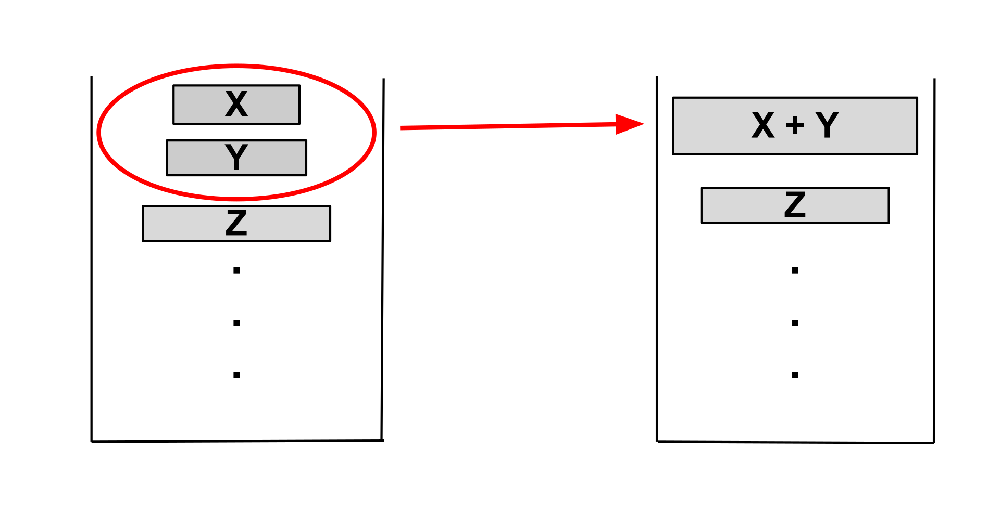

# Tim 排序 - OI Wiki

- Source: https://oi-wiki.org/basic/tim-sort/

# Tim 排序

本页面将介绍 Tim 排序（Timsort），一种混合的、稳定的排序算法．

## 引入

Timsort 由 Python 核心开发者 Tim Peters 于 2002 年设计，并应用于 Python 语言，其巧妙结合了插入排序和归并排序的优点，针对数据集中的有序性进行了精确的优化，尤其适合处理包含大量部分有序子序列的数据集．自 Python 2.3 版本以来，Timsort 被选为 Python 标准库的默认排序算法，并被广泛应用于其他编程环境，例如在 Java SE 7 中被用于对非原始对象数组进行排序．

## 步骤

Timsort 的核心思想是通过识别和利用数据集中已有的有序性，提高排序效率，其主要包括以下步骤：

  1. **识别 Run** ：扫描待排序数组，识别出有序的连续子序列（Run）．
  2. **扩展 Run** ：如果识别的 Run 长度小于 `MIN_RUN`，则使用插入排序对其进行扩展．
  3. **归并 Run** ：Timsort 维护一个特殊的栈，采用特定的归并策略将栈中已有的 Run 合并成更大的有序序列．

### 识别 Run

首先，Timsort 会从左向右扫描数组，识别出连续的有序序列，这些有序序列被称为 Run：

  * **升序 Run** ：如果后一个元素大于等于前一个元素，则继续扩展 Run．
  * **降序 Run** ：如果后一个元素小于前一个元素，则继续扩展 Run，随后将该 Run 反转为升序．

### 扩展 Run

为了提高小规模数据的排序效率，Timsort 引入了一个 Run 最小的长度 `MIN_RUN`．其值一般根据待排序数组的长度动态计算，通常为 3232 至 6464 之间．

  * 如果识别的 Run 长度大于等于 `MIN_RUN`，则不需要额外操作，直接将 Run 压入栈中．
  * 如果识别的 Run 长度小于 `MIN_RUN`，则使用二分插入排序将该 Run 的后续元素插入到 Run 中，直到 Run 的长度达到 `MIN_RUN`，然后将其压入栈中．

### 归并 Run

在 Timsort 中，归并排序是通过 **栈** 来管理和控制的．栈中保存了已经识别出的有序的 Run，并通过特定的归并规则控制栈中 Run 的合并，其目的是在合并时保持序列的平衡性和稳定性．

#### 归并规则

Timsort 是一种稳定的排序算法，即相同元素在排序后仍然保持原有的相对顺序．为确保这一点，Timsort 在归并时只会合并相邻的、连续的 Run，而不会直接合并非相邻的 Run．因为非相邻的 Run 之间可能存在相同的元素，直接合并很有可能会打乱它们的相对顺序．

同时，为了确保合并的平衡性，Timsort 引入了特定的归并规则．在每次合并操作之前，算法会检查栈顶的三个 Run X、Y 和 Z，以确保满足以下两个条件：

  * **条件一** ：`len(Z) > len(Y) + len(X)`
  * **条件二** ：`len(Y) > len(X)`

如果栈顶的三个 Run 不满足上述条件，Timsort 会将 Y 与 X 或 Z 中较小的一个进行合并，然后再次检查条件．一旦条件满足，则开始继续搜索新的 Run，将其添加到栈中并开始下一轮的归并．

#### 归并优化

为了在归并不同长度的 Run 时提高效率并减少空间开销，Timsort 在归并前会通过二分查找精确定位需要处理的元素范围，只对需要移动的部分进行归并，具体方式为：

  1. **确定插入点** ：使用二分查找，找到第二个 Run 的第一个元素在第一个 Run 中的插入位置，以及第一个 Run 的最后一个元素在第二个 Run 中的插入位置．这样，可以缩小需要归并的范围，只对需要移动的元素进行处理．

  2. **临时缓冲区** ：传统的原地合并算法效率太低，需要大量的元素移动．为了减少这种开销，Timsort 使用一个临时缓冲区，将长度较小的 Run 复制到缓冲区中，然后逐步将元素从缓冲区复制回原数组．

例如，假设存在两个 Run A 和 B，分别为：

  * Run A:[1,2,3,6,10][1,2,3,6,10]
  * Run B:[4,5,7,9,12,14,17][4,5,7,9,12,14,17]

通过二分查找，可以确定：

  * 元素 44 应插入到 Run A 的第四个位置．
  * 元素 1010 应插入到 Run B 的第五个位置．

因此，Run A 的前 33 个元素和 Run B 的后 33 个元素已经在正确位置，无需处理．只需归并 Run A 的 [6,10][6,10] 和 Run B 的 [4,5,7,9][4,5,7,9]，其归并过程如下图所示：

#### 加速模式

为进一步提升归并效率，Timsort 引入了 **加速模式（Galloping Mode）** ．在标准的归并过程中，算法会逐一比较两个 Run 中的元素，将较小的元素放入结果数组．然而，如果一侧的 Run 中有大量连续元素比另一侧的当前元素要小，逐一比较会造成不必要的开销．

为了解决这一问题，Timsort 设定了一个阈值 `Min_Gallop`（默认值为 77）．当一侧 Run 中的元素连续比较胜利的次数达到 `Min_Gallop` 时，算法会进入加速模式，快速定位元素位置，其具体步骤如下：

  1. **指数查找** ：从当前位置开始，算法以指数增长的步长 (1,2,4,8,…)(1,2,4,8,…) 在一侧的 Run 中查找，直到找到一个区间，使得目标元素位于该区间内．
  2. **二分查找** ：一旦确定了包含目标元素的区间，算法会在该区间内使用二分查找，精确定位目标元素的位置．

通过这种方式，Timsort 可以跳过大量不必要的比较，快速处理一侧 Run 中连续的、较小（或较大）的元素，将它们批量移动到合并结果中．

然而，加速模式并非在所有情况下都更高效．在某些数据分布下，加速模式可能导致更多的比较次数．为此，Timsort 采用了动态调整策略：

  * **阈值调整** ：维护一个可变的 `Min_Gallop` 参数．当加速模式表现良好（即连续多次从同一 Run 中选取元素）时，`Min_Gallop` 减 11，鼓励继续使用加速模式；当加速模式效果不佳（频繁在两个 Run 之间切换）时，`Min_Gallop` 加 11，降低加速模式的使用频率．

通过动态调整 `Min_Gallop` 的值，算法能够根据实际数据情况，在普通归并模式和加速模式之间取得平衡．对于部分有序或高度有序的数据，加速模式可以显著提高效率，使 Timsort 的性能接近 𝑂(𝑛)O(n)；而对于随机数据，算法会逐渐倾向于使用普通归并，从而保证 𝑂(𝑛log⁡𝑛)O(nlog⁡n) 的时间复杂度．

## 复杂度

Timsort 的时间复杂度取决于数据的有序性：

  * **最优情况** ：𝑂(𝑛)O(n)
    * 当数据已经有序或近似有序时，算法识别出的 Run 长度接近 𝑛n，归并次数减少，复杂度趋近于 𝑂(𝑛)O(n)．
  * **最坏情况** ：𝑂(𝑛log⁡𝑛)O(nlog⁡n)
    * 在数据完全无序的情况下，每一个 Run 的长度都接近 11，因此需要 𝑂(log⁡𝑛)O(log⁡n) 次归并，每次归并的代价为 𝑂(𝑛)O(n)，总复杂度为 𝑂(𝑛log⁡𝑛)O(nlog⁡n)．

**证明** ：

  * **识别和扩展 Run** ：

    * 识别 Run 需线性遍历一次数组，其复杂度为 𝑂(𝑛)O(n)．
    * 使用插入排序扩展 Run 也需线性遍历数组，其复杂度为 𝑂(𝑛)O(n)．
  * **归并 Run** ：

    * 归并操作的总次数与 Run 的总数有关，最坏情况下 Run 的数量为 `n / MIN_RUN`，由于 `MIN_RUN` 是常数，因此 Run 的数量可看作 𝑂(𝑛)O(n)．
    * 𝑂(𝑛)O(n) 个 Run 需要进行的归并次数为 𝑂(log⁡𝑛)O(log⁡n)，每次归并操作的代价为 𝑂(𝑛)O(n)，因此归并操作的总复杂度为 𝑂(𝑛log⁡𝑛)O(nlog⁡n)．

而对于空间复杂度，由于 Timsort 大致需要额外的 𝑂(𝑛)O(n) 空间用于存储栈和临时缓冲区，因此总的空间复杂度为 𝑂(𝑛)O(n)．

## 实现

伪代码实现 1𝑛𝑅𝑒𝑚𝑎𝑖𝑛𝑖𝑛𝑔←数组长度2𝑚𝑖𝑛𝑅𝑢𝑛←选择合适的 MinRun 的值(𝑛𝑅𝑒𝑚𝑎𝑖𝑛𝑖𝑛𝑔)3𝑠𝑡𝑎𝑟𝑡𝐼𝑛𝑑𝑒𝑥←04𝐰𝐡𝐢𝐥𝐞 𝑛𝑅𝑒𝑚𝑎𝑖𝑛𝑖𝑛𝑔>0 𝐝𝐨5𝑟𝑢𝑛𝐿𝑒𝑛𝑔𝑡ℎ←识别 Run (𝑎𝑟𝑟𝑎𝑦,𝑠𝑡𝑎𝑟𝑡𝐼𝑛𝑑𝑒𝑥,𝑛𝑅𝑒𝑚𝑎𝑖𝑛𝑖𝑛𝑔)6𝐢𝐟 𝑟𝑢𝑛𝐿𝑒𝑛𝑔𝑡ℎ<𝑚𝑖𝑛𝑅𝑢𝑛 𝐭𝐡𝐞𝐧7𝑒𝑥𝑡𝑒𝑛𝑑𝐿𝑒𝑛𝑔𝑡ℎ←min(𝑚𝑖𝑛𝑅𝑢𝑛,𝑛𝑅𝑒𝑚𝑎𝑖𝑛𝑖𝑛𝑔)8使用插入排序扩展区间 [𝑠𝑡𝑎𝑟𝑡𝐼𝑛𝑑𝑒𝑥,𝑠𝑡𝑎𝑟𝑡𝐼𝑛𝑑𝑒𝑥+𝑒𝑥𝑡𝑒𝑛𝑑𝐿𝑒𝑛𝑔𝑡ℎ−1]9𝑟𝑢𝑛𝐿𝑒𝑛𝑔𝑡ℎ←𝑒𝑥𝑡𝑒𝑛𝑑𝐿𝑒𝑛𝑔𝑡ℎ10𝐞𝐧𝐝 𝐢𝐟11将 Run (𝑠𝑡𝑎𝑟𝑡𝐼𝑛𝑑𝑒𝑥,𝑟𝑢𝑛𝐿𝑒𝑛𝑔𝑡ℎ) 压入栈中12调用 mergeCollapse(栈) 检查并合并栈中的 Run 13𝑠𝑡𝑎𝑟𝑡𝐼𝑛𝑑𝑒𝑥←𝑠𝑡𝑎𝑟𝑡𝐼𝑛𝑑𝑒𝑥+𝑟𝑢𝑛𝐿𝑒𝑛𝑔𝑡ℎ 更新起始位置14𝑛𝑅𝑒𝑚𝑎𝑖𝑛𝑖𝑛𝑔←𝑛𝑅𝑒𝑚𝑎𝑖𝑛𝑖𝑛𝑔−𝑟𝑢𝑛𝐿𝑒𝑛𝑔𝑡ℎ 更新剩余长度15𝐞𝐧𝐝 𝐰𝐡𝐢𝐥𝐞16调用 mergeForceCollapse(栈) 对栈中所有 Run 进行最终的合并1nRemaining←数组长度2minRun←选择合适的 MinRun 的值(nRemaining)3startIndex←04while nRemaining>0 do5runLength←识别 Run (array,startIndex,nRemaining)6if runLength<minRun then7extendLength←min(minRun,nRemaining)8使用插入排序扩展区间 [startIndex,startIndex+extendLength−1]9runLength←extendLength10end if11将 Run (startIndex,runLength) 压入栈中12调用 mergeCollapse(栈) 检查并合并栈中的 Run 13startIndex←startIndex+runLength 更新起始位置14nRemaining←nRemaining−runLength 更新剩余长度15end while16调用 mergeForceCollapse(栈) 对栈中所有 Run 进行最终的合并

## 参考资料

  1. [Timsort](https://en.wikipedia.org/wiki/Timsort)
  2. [On the Worst-Case Complexity of TimSort](https://drops.dagstuhl.de/opus/volltexte/2018/9467/pdf/LIPIcs-ESA-2018-4.pdf)
  3. [Original Explanation by Tim Peters](https://github.com/python/cpython/blob/main/Objects/listsort.txt)
  4. [Java 实现](https://cs.android.com/android/platform/superproject/main/+/main:libcore/ojluni/src/main/java/java/util/TimSort.java)
  5. [C 语言实现](https://github.com/python/cpython/blob/main/Objects/listobject.c)

* * *

>  __本页面最近更新： 2026/1/7 08:56:54，[更新历史](https://github.com/OI-wiki/OI-wiki/commits/master/docs/basic/tim-sort.md)  
>  __发现错误？想一起完善？[在 GitHub 上编辑此页！](https://oi-wiki.org/edit-landing/?ref=/basic/tim-sort.md "edit.link.title")  
>  __本页面贡献者：[Great-designer](https://github.com/Great-designer), [HeRaNO](https://github.com/HeRaNO), [shuzhouliu](https://github.com/shuzhouliu), [Tiphereth-A](https://github.com/Tiphereth-A), [yyyu-star](https://github.com/yyyu-star)  
>  __本页面的全部内容在**[CC BY-SA 4.0](https://creativecommons.org/licenses/by-sa/4.0/deed.zh) 和 [SATA](https://github.com/zTrix/sata-license)** 协议之条款下提供，附加条款亦可能应用
