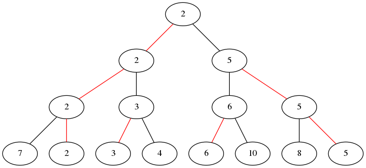
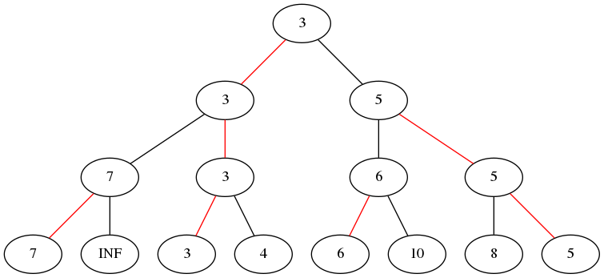

# 锦标赛排序 - OI Wiki

- Source: https://oi-wiki.org/basic/tournament-sort/

# 锦标赛排序

本页面将简要介绍锦标赛排序．

## 定义

锦标赛排序（英文：Tournament sort），又被称为树形选择排序，是 [选择排序](../selection-sort/) 的优化版本，[堆排序](../heap-sort/) 的一种变体（均采用完全二叉树）．它在选择排序的基础上使用优先队列查找下一个该选择的元素．

## 引入

锦标赛排序的名字来源于单败淘汰制的竞赛形式．在这种赛制中有许多选手参与比赛，他们两两比较，胜者进入下一轮比赛．这种淘汰方式能够决定最好的选手，但是在最后一轮比赛中被淘汰的选手不一定是第二好的——他可能不如先前被淘汰的选手．

## 过程

以 **最小锦标赛排序树** 为例：



待排序元素是叶子节点显示的元素．红色边显示的是每一轮比较中较小的元素的胜出路径．显然，完成一次＂锦标赛＂可以选出一组元素中最小的那一个．

每一轮对 𝑛n 个元素进行比较后可以得到 𝑛2n2 个「优胜者」，每一对中较小的元素进入下一轮比较．如果无法凑齐一对元素，那么这个元素直接进入下一轮的比较．



完成一次「锦标赛」后需要将被选出的元素去除．直接将其设置为 ∞∞（这个操作类似 [堆排序](../heap-sort/)），然后再次举行「锦标赛」选出次小的元素．

之后一直重复这个操作，直至所有元素有序．

## 性质

### 稳定性

锦标赛排序是一种不稳定的排序算法．

### 时间复杂度

锦标赛排序的最优时间复杂度、平均时间复杂度和最坏时间复杂度均为 𝑂(𝑛log⁡𝑛)O(nlog⁡n)．它用 𝑂(𝑛)O(n) 的时间初始化「锦标赛」，然后用 𝑂(log⁡𝑛)O(log⁡n) 的时间从 𝑛n 个元素中选取一个元素．

### 空间复杂度

锦标赛排序的空间复杂度为 𝑂(𝑛)O(n)．

## 实现

C++Python

```text 1 2 3 4 5 6 7 8 9 10 11 12 13 14 15 16 17 18 19 20 21 22 23 24 25 26 27 28 29 30 31 32 33 34 35 36 37 38 39 40 41 42 43 ``` |  ```text int n , a [ MAXN ], tmp [ MAXN << 1 ]; int winner ( int pos1 , int pos2 ) { int u = pos1 >= n ? pos1 : tmp [ pos1 ]; int v = pos2 >= n ? pos2 : tmp [ pos2 ]; if ( tmp [ u ] <= tmp [ v ]) return u ; return v ; } void creat_tree ( int & value ) { for ( int i = 0 ; i < n ; i ++ ) tmp [ n \+ i ] = a [ i ]; for ( int i = 2 * n \- 1 ; i > 1 ; i -= 2 ) { int k = i / 2 ; int j = i \- 1 ; tmp [ k ] = winner ( i , j ); } value = tmp [ tmp [ 1 ]]; tmp [ tmp [ 1 ]] = INF ; } void recreat ( int & value ) { int i = tmp [ 1 ]; while ( i > 1 ) { int j , k = i / 2 ; if ( i % 2 == 0 ) j = i \+ 1 ; else j = i \- 1 ; tmp [ k ] = winner ( i , j ); i = k ; } value = tmp [ tmp [ 1 ]]; tmp [ tmp [ 1 ]] = INF ; } void tournament_sort () { int value ; creat_tree ( value ); for ( int i = 0 ; i < n ; i ++ ) { a [ i ] = value ; recreat ( value ); } } ```   
---|---  
  
```text 1 2 3 4 5 6 7 8 9 10 11 12 13 14 15 16 17 18 19 20 21 22 23 24 25 26 27 28 29 30 31 32 33 34 35 36 37 38 39 40 41 42 43 44 45 ``` |  ```text n = 0 a = [ 0 ] * MAXN tmp = [ 0 ] * MAXN * 2 def winner ( pos1 , pos2 ): u = pos1 if pos1 >= n else tmp [ pos1 ] v = pos2 if pos2 >= n else tmp [ pos2 ] if tmp [ u ] <= tmp [ v ]: return u return v def creat_tree (): for i in range ( 0 , n ): tmp [ n \+ i ] = a [ i ] for i in range ( 2 * n \- 1 , 1 , \- 2 ): k = int ( i / 2 ) j = i \- 1 tmp [ k ] = winner ( i , j ) value = tmp [ tmp [ 1 ]] tmp [ tmp [ 1 ]] = INF return value def recreat (): i = tmp [ 1 ] while i > 1 : j = k = int ( i / 2 ) if i % 2 == 0 : j = i \+ 1 else : j = i \- 1 tmp [ k ] = winner ( i , j ) i = k value = tmp [ tmp [ 1 ]] tmp [ tmp [ 1 ]] = INF return value def tournament_sort (): value = creat_tree () for i in range ( 0 , n ): a [ i ] = value value = recreat () ```   
---|---  
  
## 外部链接

  * [Tournament sort - Wikipedia](https://en.wikipedia.org/wiki/Tournament_sort)

* * *

>  __本页面最近更新： 2026/1/7 08:56:54，[更新历史](https://github.com/OI-wiki/OI-wiki/commits/master/docs/basic/tournament-sort.md)  
>  __发现错误？想一起完善？[在 GitHub 上编辑此页！](https://oi-wiki.org/edit-landing/?ref=/basic/tournament-sort.md "edit.link.title")  
>  __本页面贡献者：[Enter-tainer](https://github.com/Enter-tainer), [iamtwz](https://github.com/iamtwz), [NachtgeistW](https://github.com/NachtgeistW), [Tiphereth-A](https://github.com/Tiphereth-A), [Xeonacid](https://github.com/Xeonacid), [zhoudavinci](https://github.com/zhoudavinci), [Alisahhh](https://github.com/Alisahhh), [Chihsiao](https://github.com/Chihsiao), [Ir1d](https://github.com/Ir1d), [ksyx](https://github.com/ksyx), [mcendu](https://github.com/mcendu), [Menci](https://github.com/Menci), [ShaoChenHeng](https://github.com/ShaoChenHeng), [shawlleyw](https://github.com/shawlleyw), [shenshuaijie](https://github.com/shenshuaijie)  
>  __本页面的全部内容在**[CC BY-SA 4.0](https://creativecommons.org/licenses/by-sa/4.0/deed.zh) 和 [SATA](https://github.com/zTrix/sata-license)** 协议之条款下提供，附加条款亦可能应用
