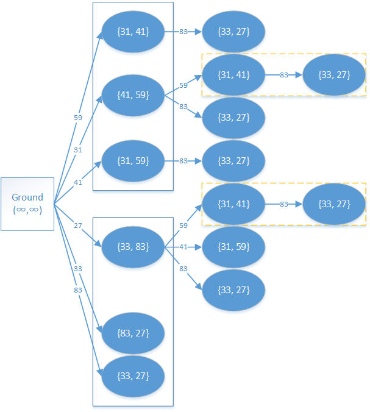

# DAG 上的 DP - OI Wiki

- Source: https://oi-wiki.org/dp/dag/

# DAG 上的 DP

## 定义

DAG 即 [有向无环图](../../graph/dag/)，一些实际问题中的二元关系都可使用 DAG 来建模，从而将这些问题转化为 DAG 上的最长（短）路问题．

## 解释

以这道题为例子，来分析一下 DAG 建模的过程．

例题 [UVa 437 巴比伦塔 The Tower of Babylon](https://onlinejudge.org/index.php?option=com_onlinejudge&Itemid=8&category=24&page=show_problem&problem=378)

有 𝑛(𝑛 ⩽30)n(n⩽30) 种砖块，已知三条边长，每种都有无穷多个．要求选一些立方体摞成一根尽量高的柱子（每个砖块可以自行选择一条边作为高），使得每个砖块的底面长宽分别严格小于它下方砖块的底面长宽，求塔的最大高度．

## 过程

### 建立 DAG

由于每个砖块的底面长宽分别严格小于它下方砖块的底面长宽，因此不难将这样一种关系作为建图的依据，而本题也就转化为最长路问题．

也就是说如果砖块 𝑗j 能放在砖块 𝑖i 上，那么 𝑖i 和 𝑗j 之间存在一条边 (𝑖,𝑗)(i,j)，且边权就是砖块 𝑗j 所选取的高．

本题的另一个问题在于每个砖块的高有三种选法，怎样建图更合适呢？

不妨将每个砖块拆解为三种堆叠方式，即将一个砖块分解为三个砖块，每一个拆解得到的砖块都选取不同的高．

初始的起点是大地，大地的底面是无穷大的，则大地可达任意砖块，当然我们写程序时不必特意写上无穷大．

假设有两个砖块，三条边分别为 31,41,5931,41,59 和 33,83,2733,83,27，那么整张 DAG 应该如下图所示．



图中蓝色实线框所表示的是一个砖块拆解得到的一组砖块，之所以用 {}{} 表示底面边长，是因为砖块一旦选取了高，底面边长就是无序的．

图中黄色虚线框表示的是重复计算部分，可以采用 [记忆化搜索](../memo/) 的方法来避免重复计算．

### 转移

题目要求的是塔的最大高度，已经转化为最长路问题，其起点上文已指出是大地，那么终点呢？显然终点已经自然确定，那就是某砖块上不能再搭别的砖块的时候．

下面我们开始考虑转移方程．

设 𝑑(𝑖,𝑟)d(i,r) 表示第 𝑖i 块砖块在最下面，且采取第 𝑟r 种堆叠方式时的最大高度．那么有如下转移方程：

𝑑(𝑖,𝑟)=max{𝑑(𝑗,𝑟′)+ℎ}d(i,r)=max{d(j,r′)+h}

其中 𝑗j 是所有那些在砖块 𝑖i 以 𝑟r 方式堆叠时可放上的砖块，𝑟′r′ 对应 𝑗j 此时的摆放方式，ℎh 对应砖块 𝑖i 采用第 𝑟r 种堆叠方式时的高度．

实现

```text 1 2 3 4 5 6 7 8 9 10 11 12 13 14 15 16 17 18 19 20 21 22 23 24 25 26 27 28 29 30 31 32 33 34 35 36 37 38 39 40 41 42 43 44 45 46 47 48 49 50 51 52 53 54 55 56 57 58 59 60 61 62 63 64 65 66 67 68 69 ``` |  ```text #include <cmath> #include <cstring> #include <iostream> using namespace std ; constexpr int MAXN = 30 \+ 5 ; constexpr int MAXV = 500 \+ 5 ; int d [ MAXN ][ 3 ]; int x [ MAXN ], y [ MAXN ], z [ MAXN ]; int babylon_sub ( int c , int rot , int n ) { if ( d [ c ][ rot ] != -1 ) { return d [ c ][ rot ]; } d [ c ][ rot ] = 0 ; int base1 , base2 ; if ( rot == 0 ) { // 处理三个方向 base1 = x [ c ]; base2 = y [ c ]; } if ( rot == 1 ) { base1 = y [ c ]; base2 = z [ c ]; } if ( rot == 2 ) { base1 = x [ c ]; base2 = z [ c ]; } for ( int i = 0 ; i < n ; i ++ ) { // 根据不同条件，分别调用不同的递归 if (( x [ i ] < base1 && y [ i ] < base2 ) || ( y [ i ] < base1 && x [ i ] < base2 )) d [ c ][ rot ] = max ( d [ c ][ rot ], babylon_sub ( i , 0 , n ) \+ z [ i ]); if (( y [ i ] < base1 && z [ i ] < base2 ) || ( z [ i ] < base1 && y [ i ] < base2 )) d [ c ][ rot ] = max ( d [ c ][ rot ], babylon_sub ( i , 1 , n ) \+ x [ i ]); if (( x [ i ] < base1 && z [ i ] < base2 ) || ( z [ i ] < base1 && x [ i ] < base2 )) d [ c ][ rot ] = max ( d [ c ][ rot ], babylon_sub ( i , 2 , n ) \+ y [ i ]); } return d [ c ][ rot ]; } int babylon ( int n ) { for ( int i = 0 ; i < n ; i ++ ) { d [ i ][ 0 ] = -1 ; d [ i ][ 1 ] = -1 ; d [ i ][ 2 ] = -1 ; } int r = 0 ; for ( int i = 0 ; i < n ; i ++ ) { // 三种建法 r = max ( r , babylon_sub ( i , 0 , n ) \+ z [ i ]); r = max ( r , babylon_sub ( i , 1 , n ) \+ x [ i ]); r = max ( r , babylon_sub ( i , 2 , n ) \+ y [ i ]); } return r ; } int main () { int t = 0 ; while ( true ) { // 死循环求答案 int n ; cin >> n ; if ( n == 0 ) break ; // 没有砖头了就停止 t ++ ; for ( int i = 0 ; i < n ; i ++ ) { cin >> x [ i ] >> y [ i ] >> z [ i ]; } cout << "Case " << t << ":" << " maximum height = " << babylon ( n ); // 递归 cout << endl ; } return 0 ; } ```   
---|---  
  
* * *

> __本页面最近更新： 2026/1/7 08:56:54，[更新历史](https://github.com/OI-wiki/OI-wiki/commits/master/docs/dp/dag.md)  
>  __发现错误？想一起完善？[在 GitHub 上编辑此页！](https://oi-wiki.org/edit-landing/?ref=/dp/dag.md "edit.link.title")  
>  __本页面贡献者：[Ir1d](https://github.com/Ir1d), [ouuan](https://github.com/ouuan), [Marcythm](https://github.com/Marcythm), [StudyingFather](https://github.com/StudyingFather), [Tiphereth-A](https://github.com/Tiphereth-A), [c-forrest](https://github.com/c-forrest), [ChungZH](https://github.com/ChungZH), [Enter-tainer](https://github.com/Enter-tainer), [iamtwz](https://github.com/iamtwz), [isdanni](https://github.com/isdanni), [kenlig](https://github.com/kenlig), [ksyx](https://github.com/ksyx), [NachtgeistW](https://github.com/NachtgeistW), [QiuDao2024](https://github.com/QiuDao2024), [sshwy](https://github.com/sshwy), [TrisolarisHD](mailto:orzcyand1317@gmail.com), [ttyS0](https://github.com/ttyS0)  
>  __本页面的全部内容在**[CC BY-SA 4.0](https://creativecommons.org/licenses/by-sa/4.0/deed.zh) 和 [SATA](https://github.com/zTrix/sata-license)** 协议之条款下提供，附加条款亦可能应用
