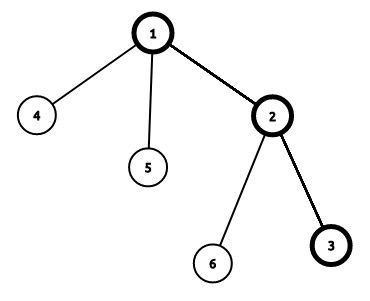

# 动态 DP - OI Wiki

- Source: https://oi-wiki.org/dp/dynamic/

# 动态 DP

前置知识：[矩阵](../../math/linear-algebra/matrix/)，[树链剖分](../../graph/hld/)．

动态 DP 问题是猫锟在 WC2018 讲的黑科技，一般用来解决树上的带有点权（边权）修改操作的 DP 问题．

## 例子

以这道模板题为例子讲解一下动态 DP 的过程．

例题 [洛谷 P4719【模板】动态 DP](https://www.luogu.com.cn/problem/P4719)

给定一棵 𝑛n 个点的树，点带点权．有 𝑚m 次操作，每次操作给定 𝑥,𝑦x,y 表示修改点 𝑥x 的权值为 𝑦y．你需要在每次操作之后求出这棵树的最大权独立集的权值大小．

### 广义矩阵乘法

定义广义矩阵乘法 𝐴 ×𝐵 =𝐶A×B=C 为：

𝐶𝑖,𝑗=𝑛max𝑘=1(𝐴𝑖,𝑘+𝐵𝑘,𝑗)Ci,j=maxk=1n(Ai,k+Bk,j)

相当于将普通的矩阵乘法中的乘变为加，加变为 maxmax 操作．

同时广义矩阵乘法满足结合律，所以可以使用矩阵快速幂．

### 不带修改操作

令 𝑓𝑖,0fi,0 表示不选择 𝑖i 的最大答案，𝑓𝑖,1fi,1 表示选择 𝑖i 的最大答案．

则有 DP 方程：

{𝑓𝑖,0=∑𝑠𝑜𝑛max(𝑓𝑠𝑜𝑛,0,𝑓𝑠𝑜𝑛,1)𝑓𝑖,1=𝑤𝑖+∑𝑠𝑜𝑛𝑓𝑠𝑜𝑛,0{fi,0=∑sonmax(fson,0,fson,1)fi,1=wi+∑sonfson,0

答案就是 max(𝑓𝑟𝑜𝑜𝑡,0,𝑓𝑟𝑜𝑜𝑡,1)max(froot,0,froot,1).

### 带修改操作

首先将这棵树进行树链剖分，假设有这样一条重链：



设 𝑔𝑖,0gi,0 表示不选择 𝑖i 且只允许选择 𝑖i 的轻儿子所在子树的最大答案，𝑔𝑖,1gi,1 表示不考虑 𝑠𝑜𝑛𝑖soni 的情况下选择 𝑖i 的最大答案，𝑠𝑜𝑛𝑖soni 表示 𝑖i 的重儿子．

假设我们已知 𝑔𝑖,0/1gi,0/1 那么有 DP 方程：

{𝑓𝑖,0=𝑔𝑖,0+max(𝑓𝑠𝑜𝑛𝑖,0,𝑓𝑠𝑜𝑛𝑖,1)𝑓𝑖,1=𝑔𝑖,1+𝑓𝑠𝑜𝑛𝑖,0{fi,0=gi,0+max(fsoni,0,fsoni,1)fi,1=gi,1+fsoni,0

答案是 max(𝑓𝑟𝑜𝑜𝑡,0,𝑓𝑟𝑜𝑜𝑡,1)max(froot,0,froot,1).

可以构造出矩阵：

[𝑔𝑖,0𝑔𝑖,0𝑔𝑖,1−∞]×[𝑓𝑠𝑜𝑛𝑖,0𝑓𝑠𝑜𝑛𝑖,1]=[𝑓𝑖,0𝑓𝑖,1][gi,0gi,0gi,1−∞]×[fsoni,0fsoni,1]=[fi,0fi,1]

注意，我们这里使用的是广义乘法规则．

可以发现，修改操作时只需要修改 𝑔𝑖,1gi,1 和每条往上的重链即可．

### 具体思路

  1. DFS 预处理求出 𝑓𝑖,0/1fi,0/1 和 𝑔𝑖,0/1gi,0/1.

  2. 对这棵树进行树链剖分（注意，因为我们对一个点进行询问需要计算从该点到该点所在的重链末尾的区间矩阵乘，所以对于每一个点记录 𝐸𝑛𝑑𝑖Endi 表示 𝑖i 所在的重链末尾节点编号），每一条重链建立线段树，线段树维护 𝑔g 矩阵和 𝑔g 矩阵区间乘积．

  3. 修改时首先修改 𝑔𝑖,1gi,1 和线段树中 𝑖i 节点的矩阵，计算 𝑡𝑜𝑝𝑖topi 矩阵的变化量，修改到 𝑓𝑎𝑡𝑜𝑝𝑖fatopi 矩阵．

  4. 查询时就是 1 到其所在的重链末尾的区间乘，最后取一个 maxmax 即可．

代码实现

```text 1 2 3 4 5 6 7 8 9 10 11 12 13 14 15 16 17 18 19 20 21 22 23 24 25 26 27 28 29 30 31 32 33 34 35 36 37 38 39 40 41 42 43 44 45 46 47 48 49 50 51 52 53 54 55 56 57 58 59 60 61 62 63 64 65 66 67 68 69 70 71 72 73 74 75 76 77 78 79 80 81 82 83 84 85 86 87 88 89 90 91 92 93 94 95 96 97 98 99 100 101 102 103 104 105 106 107 108 109 110 111 112 113 114 115 116 117 118 119 120 121 122 123 124 125 126 127 128 129 130 131 132 133 134 135 136 137 138 139 140 141 142 143 144 145 146 147 148 149 150 151 152 153 154 155 156 157 ``` |  ```text #include <algorithm> #include <cstring> #include <iostream> using namespace std ; constexpr int MAXN = 500010 ; constexpr int INF = 0x3f3f3f3f ; int Begin [ MAXN ], Next [ MAXN ], To [ MAXN ], e , n , m ; int sz [ MAXN ], son [ MAXN ], top [ MAXN ], fa [ MAXN ], dis [ MAXN ], p [ MAXN ], id [ MAXN ], End [ MAXN ]; // p[i]表示i树剖后的编号，id[p[i]] = i int cnt , tot , a [ MAXN ], f [ MAXN ][ 2 ]; struct matrix { int g [ 2 ][ 2 ]; matrix () { memset ( g , 0 , sizeof ( g )); } matrix operator * ( const matrix & b ) const // 重载矩阵乘 { matrix c ; for ( int i = 0 ; i <= 1 ; i ++ ) for ( int j = 0 ; j <= 1 ; j ++ ) for ( int k = 0 ; k <= 1 ; k ++ ) c . g [ i ][ j ] = max ( c . g [ i ][ j ], g [ i ][ k ] \+ b . g [ k ][ j ]); return c ; } } Tree [ MAXN ], g [ MAXN ]; // Tree[]是建出来的线段树，g[]是维护的每个点的矩阵 void PushUp ( int root ) { Tree [ root ] = Tree [ root << 1 ] * Tree [ root << 1 | 1 ]; } void Build ( int root , int l , int r ) { if ( l == r ) { Tree [ root ] = g [ id [ l ]]; return ; } int Mid = ( l \+ r ) >> 1 ; Build ( root << 1 , l , Mid ); Build ( root << 1 | 1 , Mid \+ 1 , r ); PushUp ( root ); } matrix Query ( int root , int l , int r , int L , int R ) { if ( L <= l && r <= R ) return Tree [ root ]; int Mid = ( l \+ r ) >> 1 ; if ( R <= Mid ) return Query ( root << 1 , l , Mid , L , R ); if ( Mid < L ) return Query ( root << 1 | 1 , Mid \+ 1 , r , L , R ); return Query ( root << 1 , l , Mid , L , R ) * Query ( root << 1 | 1 , Mid \+ 1 , r , L , R ); // 注意查询操作的书写 } void Modify ( int root , int l , int r , int pos ) { if ( l == r ) { Tree [ root ] = g [ id [ l ]]; return ; } int Mid = ( l \+ r ) >> 1 ; if ( pos <= Mid ) Modify ( root << 1 , l , Mid , pos ); else Modify ( root << 1 | 1 , Mid \+ 1 , r , pos ); PushUp ( root ); } void Update ( int x , int val ) { g [ x ]. g [ 1 ][ 0 ] += val \- a [ x ]; a [ x ] = val ; // 首先修改x的g矩阵 while ( x ) { matrix last = Query ( 1 , 1 , n , p [ top [ x ]], End [ top [ x ]]); // 查询top[x]的原本g矩阵 Modify ( 1 , 1 , n , p [ x ]); // 进行修改(x点的g矩阵已经进行修改但线段树上的未进行修改) matrix now = Query ( 1 , 1 , n , p [ top [ x ]], End [ top [ x ]]); // 查询top[x]的新g矩阵 x = fa [ top [ x ]]; g [ x ]. g [ 0 ][ 0 ] += max ( now . g [ 0 ][ 0 ], now . g [ 1 ][ 0 ]) \- max ( last . g [ 0 ][ 0 ], last . g [ 1 ][ 0 ]); g [ x ]. g [ 0 ][ 1 ] = g [ x ]. g [ 0 ][ 0 ]; g [ x ]. g [ 1 ][ 0 ] += now . g [ 0 ][ 0 ] \- last . g [ 0 ][ 0 ]; // 根据变化量修改fa[top[x]]的g矩阵 } } void add ( int u , int v ) { To [ ++ e ] = v ; Next [ e ] = Begin [ u ]; Begin [ u ] = e ; } void DFS1 ( int u ) { sz [ u ] = 1 ; int Max = 0 ; f [ u ][ 1 ] = a [ u ]; for ( int i = Begin [ u ]; i ; i = Next [ i ]) { int v = To [ i ]; if ( v == fa [ u ]) continue ; dis [ v ] = dis [ u ] \+ 1 ; fa [ v ] = u ; DFS1 ( v ); sz [ u ] += sz [ v ]; if ( sz [ v ] > Max ) { Max = sz [ v ]; son [ u ] = v ; } f [ u ][ 1 ] += f [ v ][ 0 ]; f [ u ][ 0 ] += max ( f [ v ][ 0 ], f [ v ][ 1 ]); // DFS1过程中同时求出f[i][0/1] } } void DFS2 ( int u , int t ) { top [ u ] = t ; p [ u ] = ++ cnt ; id [ cnt ] = u ; End [ t ] = cnt ; g [ u ]. g [ 1 ][ 0 ] = a [ u ]; g [ u ]. g [ 1 ][ 1 ] = \- INF ; if ( ! son [ u ]) return ; DFS2 ( son [ u ], t ); for ( int i = Begin [ u ]; i ; i = Next [ i ]) { int v = To [ i ]; if ( v == fa [ u ] || v == son [ u ]) continue ; DFS2 ( v , v ); g [ u ]. g [ 0 ][ 0 ] += max ( f [ v ][ 0 ], f [ v ][ 1 ]); g [ u ]. g [ 1 ][ 0 ] += f [ v ][ 0 ]; // g矩阵根据f[i][0/1]求出 } g [ u ]. g [ 0 ][ 1 ] = g [ u ]. g [ 0 ][ 0 ]; } int main () { cin . tie ( nullptr ) -> sync_with_stdio ( false ); cin >> n >> m ; for ( int i = 1 ; i <= n ; i ++ ) cin >> a [ i ]; for ( int i = 1 ; i <= n \- 1 ; i ++ ) { int u , v ; cin >> u >> v ; add ( u , v ); add ( v , u ); } dis [ 1 ] = 1 ; DFS1 ( 1 ); DFS2 ( 1 , 1 ); Build ( 1 , 1 , n ); for ( int i = 1 ; i <= m ; i ++ ) { int x , val ; cin >> x >> val ; Update ( x , val ); matrix ans = Query ( 1 , 1 , n , 1 , End [ 1 ]); // 查询1所在重链的矩阵乘 cout << max ( ans . g [ 0 ][ 0 ], ans . g [ 1 ][ 0 ]) << '\n' ; } return 0 ; } ```   
---|---  
  
## 习题

  * [SPOJ GSS3 - Can you answer these queries III](https://www.spoj.com/problems/GSS3/)
  * [「NOIP2018」保卫王国](https://loj.ac/p/2955)
  * [「SDOI2017」切树游戏](https://loj.ac/p/2269)

* * *

>  __本页面最近更新： 2026/1/7 08:56:54，[更新历史](https://github.com/OI-wiki/OI-wiki/commits/master/docs/dp/dynamic.md)  
>  __发现错误？想一起完善？[在 GitHub 上编辑此页！](https://oi-wiki.org/edit-landing/?ref=/dp/dynamic.md "edit.link.title")  
>  __本页面贡献者：[LJFYC007](https://github.com/LJFYC007), [c-forrest](https://github.com/c-forrest), [mgt](mailto:i@margatroid.xyz), [sshwy](https://github.com/sshwy), [StudyingFather](https://github.com/StudyingFather), [Tiphereth-A](https://github.com/Tiphereth-A), [CSPNOIP](https://github.com/CSPNOIP), [Early0v0](https://github.com/Early0v0), [Enter-tainer](https://github.com/Enter-tainer), [H-J-Granger](https://github.com/H-J-Granger), [Henry-ZHR](https://github.com/Henry-ZHR), [huhaoo](https://github.com/huhaoo), [Ir1d](https://github.com/Ir1d), [isdanni](https://github.com/isdanni), [kenlig](https://github.com/kenlig), [ksyx](https://github.com/ksyx), [Marcythm](https://github.com/Marcythm), [Mout-sea](https://github.com/Mout-sea), [NachtgeistW](https://github.com/NachtgeistW), [ouuan](https://github.com/ouuan), [thredreams](https://github.com/thredreams), [Xeonacid](https://github.com/Xeonacid)  
>  __本页面的全部内容在**[CC BY-SA 4.0](https://creativecommons.org/licenses/by-sa/4.0/deed.zh) 和 [SATA](https://github.com/zTrix/sata-license)** 协议之条款下提供，附加条款亦可能应用
