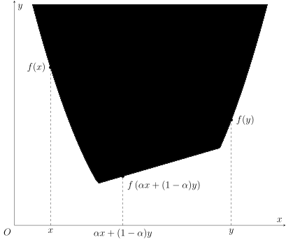
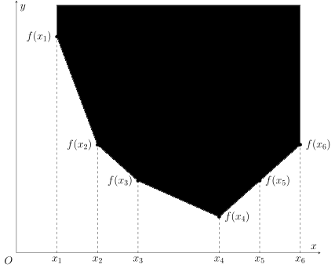
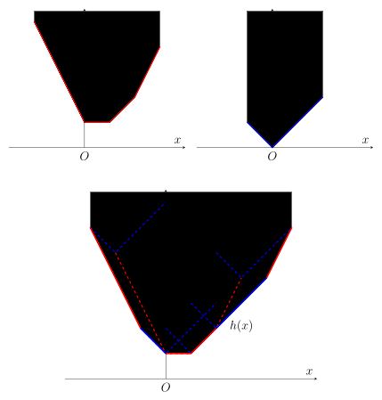
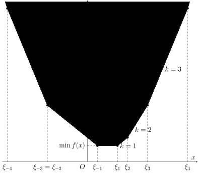

# Slope Trick 优化 - OI Wiki

- Source: https://oi-wiki.org/dp/opt/slope-trick/

# Slope Trick 优化

## 引入

对于一类二维 DP 问题，如果它的价值函数 𝑓(𝑖,𝑥)f(i,x) 对于每个固定的 𝑖i 都是 𝑥x 的凸函数，那么将函数 𝑓(𝑖, ⋅)f(i,⋅) 整体视为 𝑖i 处的状态，并维护它的差分（或斜率）

Δ𝑓(𝑖,𝑥)=𝑓(𝑖,𝑥+1)−𝑓(𝑖,𝑥)Δf(i,x)=f(i,x+1)−f(i,x)

而非函数本身，往往能够起到优化转移的效果．这种优化 DP 的思想，就称为 Slope Trick．

「斜率」

因为大多数题目中涉及的函数都只在整点处取值，所以称它为差分和斜率没有本质区别，本文按照 Slope Trick 这个名词统一称呼它为斜率．

具体题目中，斜率的维护方式可能各不相同．如果斜率的取值范围较窄，维护斜率变化的点（即拐点）更为方便；而如果函数定义域较窄，维护斜率序列本身可能更为方便．更复杂的情形，可能需要同时维护每段斜率的大小和该段的长度．无论具体维护方式是什么，这类问题的本质都是利用状态转移中斜率序列变化较少这一点简化转移．因此，它们都可以称作 Slope Trick．

## 凸函数

在讨论具体的题目之前，有必要首先了解一下凸函数的基本性质，以及在对凸函数进行各种变换时，它的斜率会如何变化．

### 实轴上的凸函数

凸函数较为一般的定义是在 𝐑R 上给出的．



𝐑R 上的凸函数

如果函数 𝑓 :𝐑 →𝐑 ∪{ ±∞}f:R→R∪{±∞} 对于所有 𝑥,𝑦 ∈𝐑x,y∈R 和 𝛼 ∈(0,1)α∈(0,1) 都满足

𝑓(𝛼𝑥+(1−𝛼)𝑦)≤𝛼𝑓(𝑥)+(1−𝛼)𝑓(𝑦),f(αx+(1−α)y)≤αf(x)+(1−α)f(y),

就称函数 𝑓f 为 **凸函数** （convex function），其中 ±∞±∞ 的运算法则规定为 ±∞±∞ 乘以任何正实数或是加上任何实数都等于其自身，且对于任何实数 𝑥 ∈𝐑x∈R 都有 −∞ <𝑥 < +∞−∞<x<+∞．

当然，如果不等号换作 ≥≥，就相应地称它为凹函数1．因为对于凹函数 𝑓f，总有 −𝑓−f 为凸函数，所以本节只考虑凸函数．

本文只考虑正常凸函数

为了避免讨论 ∞ −∞∞−∞ 的取值和额外的复杂分析，本文在讨论凸函数相关概念时，总是默认函数不会取到 −∞−∞，且不总是 +∞+∞．这样的凸函数称为 **正常凸函数** （proper convex function）．这对于理解算法竞赛涉及的内容已经足够．

当然，函数 𝑓f 往往并不会对所有实数都有定义．如果函数 𝑓f 的定义域仅是 𝐑R 的子集，那么可以将它拓展为 𝐑R 上的函数：

˜𝑓(𝑥)={𝑓(𝑥),𝑥∈dom⁡𝑓,+∞,𝑥∉dom⁡𝑓.f~(x)={f(x),x∈dom⁡f,+∞,x∉dom⁡f.

此时，称 𝑓f 是凸函数，当且仅当相应的 ˜𝑓f~ 满足上述凸函数的定义．因此，如果没有特别指出，本文提到的凸函数的定义域均是实数集 𝐑R．显然，凸函数 𝑓f 只能在一个区间（即 𝐑R 的凸子集）上取得有限值．

简单例子

常见的凸函数的例子包括：

  1. 常数函数：𝑓(𝑥) =𝑐f(x)=c，其中 𝑐 ∈𝐑c∈R；
  2. 一次函数：𝑓(𝑥) =𝑘𝑥 +𝑏f(x)=kx+b，其中 𝑘,𝑏 ∈𝐑k,b∈R 且 𝑘 ≠0k≠0；
  3. 绝对值函数：𝑓(𝑥) =|𝑥 −𝑎|f(x)=|x−a|，其中 𝑎 ∈𝐑a∈R；
  4. 任何凸函数限制在某个区间上的结果，例如 0[𝑎,𝑏](𝑥)0[a,b](x)（在凸分析的语境下也称作 [𝑎,𝑏][a,b] 的指示函数）．

当然，可以通过下文提到的保持凸性的变换组合出更为复杂的凸函数．

### 离散点集上的凸函数

算法竞赛中，很多函数仅在部分整数值处有定义．它们在一般情况下并不是（上文定义的）凸函数，因为它们的定义域不再是凸集．为了处理这种情形，需要单独定义离散点集上的函数的凸性．简单来说，需要首先对函数做线性插值，将其定义域拓展到区间，再判断它的凸性．



离散点集上的凸函数

设 𝑆 ⊂𝐑S⊂R 为离散点集，即对任意闭区间 [𝑎,𝑏][a,b]，𝑆 ∩[𝑎,𝑏]S∩[a,b] 都是有限集．对于函数 𝑓 :𝑆 →𝐑 ∪{ ±∞}f:S→R∪{±∞}，可以定义函数 ˜𝑓 :𝐑 →𝐑 ∪{ ±∞}f~:R→R∪{±∞} 使得：

  * 当 𝑥 ∈𝑆x∈S 时，˜𝑓(𝑥) =𝑓(𝑥)f~(x)=f(x)，
  * 当 𝑥 ∈(inf𝑆,sup𝑆) ∖𝑆x∈(infS,supS)∖S 时，设 𝑠− =max{𝑠 ∈𝑆 :𝑠 ≤𝑥}s−=max{s∈S:s≤x}，𝑠+ =min{𝑠 ∈𝑆 :𝑠 ≥𝑥}s+=min{s∈S:s≥x}，则

˜𝑓(𝑥)=𝑠+−𝑥𝑠+−𝑠−𝑓(𝑠−)+𝑥−𝑠−𝑠+−𝑠−𝑓(𝑠+),f~(x)=s+−xs+−s−f(s−)+x−s−s+−s−f(s+),
  * 当 𝑥 ∉[inf𝑆,sup𝑆]x∉[infS,supS] 时，˜𝑓(𝑥) = +∞f~(x)=+∞．

那么，如果 ˜𝑓(𝑥)f~(x) 是 𝐑R 上的凸函数，就称 𝑓(𝑥)f(x) 是 𝑆S 上的 **凸函数** ．

因为 𝐑R 上的凸函数处理起来更为方便，所以本文在提及凸函数时，若非特别说明，指的都是 𝐑R 上的凸函数．如果本文中某个函数仅给出了部分整数处的取值，那么它在其他实数处的取值应由定义中的 ˜𝑓f~ 确定，也就相当于直接讨论对应的分段线性函数 ˜𝑓f~．

整数集 𝐙Z 上的凸函数有一个更为直观的等价定义：

𝐙Z 上的凸函数的等价定义

函数 𝑓 :𝐙 →𝐑 ∪{ ±∞}f:Z→R∪{±∞} 是凸的，当且仅当

𝑓(𝑥)−𝑓(𝑥−1)≤𝑓(𝑥+1)−𝑓(𝑥)f(x)−f(x−1)≤f(x+1)−f(x)

对于所有 𝑥 ∈𝐙x∈Z 都成立．

证明

这个命题是凸函数的斜率刻画的简单推论．

如果 𝑓f 是 𝐙Z 上的凸函数，那么根据斜率弱增，有

Δ𝑓(𝑥−1,𝑥)≤Δ𝑓(𝑥−1,𝑥+1)≤Δ𝑓(𝑥,𝑥+1).Δf(x−1,x)≤Δf(x−1,x+1)≤Δf(x,x+1).

这就是上述条件．

反过来，如果上述条件成立，那么对于任何 𝑥1 <𝑥2x1<x2，都有

Δ𝑓(𝑥1,𝑥2)=1𝑥2−𝑥1𝑥2−1∑𝑖=𝑥1(𝑓(𝑖)−𝑓(𝑖−1)).Δf(x1,x2)=1x2−x1∑i=x1x2−1(f(i)−f(i−1)).

这相当于对所有满足 𝑥1 ≤𝑖 <𝑥2x1≤i<x2 的差分的算术平均值．如果 𝑥2x2 增加一，就相当于插入一项更大的差分；如果 𝑥1x1 增加一，就相当于移除一项最小的差分．这两个操作都会使得平均值上升．这就说明斜率 Δ𝑓(𝑥1,𝑥2)Δf(x1,x2) 弱增，即 𝑓f 是 𝐙Z 上的凸函数．

也就是说，只要斜率（差分）单调不减，这个序列就可以看作是 𝐙Z 上的凸函数．

### 凸函数的两种刻画

其实，用斜率刻画凸函数的方式也可以推广到一般情况．

凸函数的斜率刻画

设 𝑆S 为 𝐑R 或它的离散子集，则函数 𝑓 :𝑆 →𝐑 ∪{ ±∞}f:S→R∪{±∞} 为凸函数，当且仅当斜率

Δ𝑓(𝑥1,𝑥2)=𝑓(𝑥2)−𝑓(𝑥1)𝑥2−𝑥1Δf(x1,x2)=f(x2)−f(x1)x2−x1

对于任何 𝑥1,𝑥2 ∈𝑆x1,x2∈S 且 𝑥1 <𝑥2x1<x2 都是 𝑥1x1 和 𝑥2x2 的弱增函数．

证明

对于 𝐑R 上的函数 𝑓(𝑥)f(x) 以及 𝑥1 <𝑥2x1<x2，对于 𝛼 ∈(0,1)α∈(0,1)，令 𝑥3 =𝛼𝑥1 +(1 −𝛼)𝑥2x3=αx1+(1−α)x2，那么

Δ𝑓(𝑥1,𝑥3)≤Δ𝑓(𝑥1,𝑥2)≤Δ𝑓(𝑥3,𝑥2)Δf(x1,x3)≤Δf(x1,x2)≤Δf(x3,x2)

就等价于

𝑓(𝑥3)−𝑓(𝑥1)1−𝛼≤𝑓(𝑥2)−𝑓(𝑥1)≤𝑓(𝑥2)−𝑓(𝑥3)𝛼.f(x3)−f(x1)1−α≤f(x2)−f(x1)≤f(x2)−f(x3)α.

这两侧的不等式都等价于 𝑓(𝑥3) ≤𝛼𝑓(𝑥1) +(1 −𝛼)𝑓(𝑥2)f(x3)≤αf(x1)+(1−α)f(x2)，即函数 𝑓(𝑥)f(x) 的凸性．

对于 𝐑R 的离散子集 𝑆S 上的函数 𝑓(𝑥)f(x)，斜率弱增这一条件的必要性可以由 ˜𝑓(𝑥)f~(x) 的凸性推导出来．现在要证明它的充分性，为此只要证明 Δ˜𝑓(𝑥1,𝑥2)Δf~(x1,x2) 也是弱增的．设 𝑆 ={𝑠𝑖}S={si} 且 𝑠𝑖si 关于 𝑖i 严格递增，并设 𝑠𝑖1 ≤𝑥1 ≤𝑠𝑖1+1si1≤x1≤si1+1 且 𝑠𝑖2 ≤𝑥2 ≤𝑠𝑖2+1si2≤x2≤si2+1，自然有 𝑖1 ≤𝑖2i1≤i2．令 Δ𝑖 =Δ𝑓(𝑠𝑖,𝑠𝑖+1)Δi=Δf(si,si+1)，那么，可以证明 Δ𝑖1 ≤Δ˜𝑓(𝑥1,𝑥2) ≤Δ𝑖2Δi1≤Δf~(x1,x2)≤Δi2．

这分两种情形．如果 𝑖1 =𝑖2i1=i2，那么 Δ𝑖1 =Δ˜𝑓(𝑥1,𝑥2) =Δ𝑖2Δi1=Δf~(x1,x2)=Δi2，该不等式显然成立．否则，有

Δ˜𝑓(𝑥1,𝑥2)=1𝑥2−𝑥1((𝑠𝑖1+1−𝑥1)Δ𝑖1+(𝑥2−𝑠𝑖2)Δ𝑖2+𝑖2−1∑𝑗=𝑖1+1(𝑠𝑗+1−𝑠𝑗)Δ𝑗).Δf~(x1,x2)=1x2−x1((si1+1−x1)Δi1+(x2−si2)Δi2+∑j=i1+1i2−1(sj+1−sj)Δj).

根据 𝑆S 上的斜率递增可知，Δ𝑖Δi 关于 𝑖i 递增，所以，Δ𝑖1 ≤Δ˜𝑓(𝑥1,𝑥2) ≤Δ𝑖2Δi1≤Δf~(x1,x2)≤Δi2．

利用这个结论，对于 𝑥1 <𝑥2x1<x2 和 𝛼 ∈(0,1)α∈(0,1)，令 𝑥3 =𝛼𝑥1 +(1 −𝛼)𝑥2x3=αx1+(1−α)x2，并取 𝑖3i3 使得 𝑠𝑖3 ≤𝑥3 ≤𝑠𝑖3+1si3≤x3≤si3+1 成立，则有

Δ˜𝑓(𝑥1,𝑥3)≤Δ𝑖3≤Δ˜𝑓(𝑥3,𝑥2).Δf~(x1,x3)≤Δi3≤Δf~(x3,x2).

代入 𝑥3x3 的表达式，就得到 ˜𝑓(𝑥)f~(x) 的凸性．

斜率单调不减，可以看作是凸函数的等价定义．正因为凸函数的斜率具有单调性，在维护斜率时，通常需要选择 [堆（优先队列）](../../../ds/heap/) 或 [平衡树](../../../ds/bst/) 等数据结构．

本文还会用到凸函数的另一种等价刻画．对于函数 𝑓 :𝐑 →𝐑 ∪{ ±∞}f:R→R∪{±∞}，可以考察平面内函数图像上方的区域，即

epi⁡𝑓={(𝑥,𝑦)∈𝐑2:𝑦≥𝑓(𝑥)}.epi⁡f={(x,y)∈R2:y≥f(x)}.

这个区域也称为函数 𝑓f 的 **上境图** （epigraph）．函数的凸性，等价于它的上境图的凸性：

凸函数的上境图刻画

函数 𝑓 :𝐑 →𝐑 ∪{ ±∞}f:R→R∪{±∞} 是凸函数，当且仅当 epi⁡𝑓epi⁡f 是 𝐑2R2 内的凸集．

证明

如果 𝑓f 是凸函数，那么对于 (𝑥1,𝑦1),(𝑥2,𝑦2) ∈epi⁡𝑓(x1,y1),(x2,y2)∈epi⁡f 和任意 𝛼 ∈(0,1)α∈(0,1)，有

𝛼𝑦1+(1−𝛼)𝑦2≥𝛼𝑓(𝑥1)+(1−𝛼)𝑓(𝑥2)≥𝑓(𝛼𝑥1+(1−𝛼)𝑥2).αy1+(1−α)y2≥αf(x1)+(1−α)f(x2)≥f(αx1+(1−α)x2).

所以，𝛼(𝑥1,𝑦1) +(1 −𝛼)(𝑥2,𝑦2) ∈epi⁡𝑓α(x1,y1)+(1−α)(x2,y2)∈epi⁡f．

反过来，如果 epi⁡𝑓epi⁡f 是凸集，那么对于任意 𝑥1 <𝑥2x1<x2 以及 𝛼 ∈(0,1)α∈(0,1)，有

𝛼(𝑥1,𝑓(𝑥1))+(1−𝛼)(𝑥2,𝑓(𝑥2))∈epi⁡𝑓.α(x1,f(x1))+(1−α)(x2,f(x2))∈epi⁡f.

这就等价于 𝛼𝑓(𝑥1) +(1 −𝛼)𝑓(𝑥2) ≥𝑓(𝛼𝑥1+(1−𝛼)𝑥2)αf(x1)+(1−α)f(x2)≥f(αx1+(1−α)x2)，即 𝑓f 的凸性．

稍后会看到，利用上境图，可以将凸函数的卷积下确界与凸集的 Minkowski 和联系起来．

## 凸函数的变换

紧接着，本文介绍一些 Slope Trick 中经常遇见的保持凸性的变换．

### 非负线性组合

对于凸函数 𝑓f 和 𝑔g 以及非负实数 𝛼,𝛽 ≥0α,β≥0，函数 𝛼𝑓 +𝛽𝑔αf+βg 也是凸函数．而且，

Δ(𝛼𝑓+𝛽𝑔)=𝛼Δ𝑓+𝛽Δ𝑔.Δ(αf+βg)=αΔf+βΔg.

因此，如果维护了凸函数 𝑓f 和 𝑔g 的斜率，要得到它们的非负线性组合 𝛼𝑓 +𝛽𝑔αf+βg 的斜率，只需要逐段计算即可．

在维护斜率的问题中，往往其中一个函数的形式比较简单，此时可以通过懒标记的方式降低修改复杂度．在维护拐点的问题中，要计算 𝑓 +𝑔f+g 的斜率拐点，只需要将 𝑓f 和 𝑔g 的斜率拐点合并即可．

### 卷积下确界（Minkowski 和）

凸函数的另一种常见操作是卷积下确界．对于函数 𝑓f 和 𝑔g，函数

ℎ(𝑥)=inf𝑦∈𝐑𝑓(𝑦)+𝑔(𝑥−𝑦)h(x)=infy∈Rf(y)+g(x−y)

称为 𝑓f 和 𝑔g 的 **卷积下确界**2（infimal convolution）．如果 𝑓f 和 𝑔g 都是凸函数，它们的卷积下确界也是凸函数．



对图示的解释

如图所示，要求 𝑓f 和 𝑔g 的卷积下确界 ℎh，可以将 𝑓f 的图像（第三个图的红色虚线）上的每一个点都视作原点，在相应的坐标系内画出 𝑔g 的图像（第三个图中的蓝色虚线）．当坐标系原点沿着 𝑓f 的图像移动时，𝑔g 的图像（上境图）移动的轨迹轮廓（即下凸壳），就是 ℎh 的图像．可以看出，ℎh 的每一个斜率段，都要么是 𝑓f 的斜率段，要么是 𝑔g 的斜率段：只是重新按照斜率大小排序了．这个过程中，𝑓f 和 𝑔g 的角色可以互换，即让 𝑓f 的图像沿着 𝑔g 的图像移动，得到的结果是一致的．

几何直观上，epi⁡ℎepi⁡h 就是 epi⁡𝑓epi⁡f 和 epi⁡𝑔epi⁡g 的 [Minkowski 和](../../../geometry/convex-hull/#闵可夫斯基和)．如果 𝑓f 和 𝑔g 都是分段线性函数，那么 ℎh 同样是分段线性函数，且它的斜率段可以看作是 𝑓f 和 𝑔g 的斜率段合并（再排序）的结果．

证明

设 𝑓,𝑔f,g 都是凸函数，ℎh 是它们的卷积下确界．设 𝑥1 <𝑥2x1<x2，且 𝛼 ∈(0,1)α∈(0,1)．根据卷积下确界的定义，对任意 𝜀 >0ε>0，存在 𝑦𝑖,𝑧𝑖 ∈𝐑yi,zi∈R 使得 𝑦𝑖 +𝑧𝑖 =𝑥𝑖yi+zi=xi 且

ℎ(𝑥𝑖)+𝜀>𝑓(𝑦𝑖)+𝑔(𝑧𝑖).h(xi)+ε>f(yi)+g(zi).

故而，结合 𝑓,𝑔f,g 的凸性及 ℎh 的定义，有

𝛼ℎ(𝑥1)+(1−𝛼)ℎ(𝑥2)+𝜀>𝛼𝑓(𝑦1)+(1−𝛼)𝑓(𝑦2)+𝛼𝑔(𝑧1)+(1−𝛼)𝑔(𝑧2)≥𝑓(𝛼𝑦1+(1−𝛼)𝑦2)+𝑔(𝛼𝑧1+(1−𝛼)𝑧2)≥ℎ(𝛼𝑥1+(1−𝛼)𝑥2).αh(x1)+(1−α)h(x2)+ε>αf(y1)+(1−α)f(y2)+αg(z1)+(1−α)g(z2)≥f(αy1+(1−α)y2)+g(αz1+(1−α)z2)≥h(αx1+(1−α)x2).

因为 𝜀 >0ε>0 是任意选取的，所以

𝛼ℎ(𝑥1)+(1−𝛼)ℎ(𝑥2)≥ℎ(𝛼𝑥1+(1−𝛼)𝑥2).αh(x1)+(1−α)h(x2)≥h(αx1+(1−α)x2).

这就得到 ℎh 的凸性．

然后，对于几何直观，严格地说，只能证明如下结论：

epi⁡𝑓+epi⁡𝑔⊆epi⁡ℎ⊆cl⁡(epi⁡𝑓+epi⁡𝑔).epi⁡f+epi⁡g⊆epi⁡h⊆cl⁡(epi⁡f+epi⁡g).

其中，clcl 表示闭包．

对于任何 (𝑥,𝑦) ∈epi⁡𝑓 +epi⁡𝑔(x,y)∈epi⁡f+epi⁡g，都存在 (𝑥1,𝑦1) ∈epi⁡𝑓(x1,y1)∈epi⁡f 且 (𝑥2,𝑦2) ∈epi⁡𝑔(x2,y2)∈epi⁡g，使得 𝑥 =𝑥1 +𝑥2x=x1+x2 且

𝑦=𝑦1+𝑦2≥𝑓(𝑥1)+𝑔(𝑥2)≥ℎ(𝑥1+𝑥2)=ℎ(𝑥).y=y1+y2≥f(x1)+g(x2)≥h(x1+x2)=h(x).

故而，(𝑥,𝑦) ∈epi⁡ℎ(x,y)∈epi⁡h．这说明 epi⁡𝑓 +epi⁡𝑔 ⊆epi⁡ℎepi⁡f+epi⁡g⊆epi⁡h．

反过来，对于任何 (𝑥,𝑦) ∈epi⁡ℎ(x,y)∈epi⁡h，有 𝑦 ≥ℎ(𝑥)y≥h(x)．根据 ℎh 的定义，对任何 𝜀 >0ε>0，都存在 𝑥1 +𝑥2 =𝑥x1+x2=x 使得

𝑦+𝜀>𝑓(𝑥1)+𝑔(𝑥2).y+ε>f(x1)+g(x2).

令 𝑦1 =𝑓(𝑥1)y1=f(x1) 且 𝑦2 =𝑔(𝑥2)y2=g(x2)，就有 𝑦 +𝜀 >𝑦1 +𝑦2y+ε>y1+y2．这说明，对于任何 𝜀 >0ε>0，都有 (𝑥1,𝑦1) +(𝑥2,𝑦2) ∈epi⁡𝑓 +epi⁡𝑔(x1,y1)+(x2,y2)∈epi⁡f+epi⁡g 位于点 (𝑥,𝑦)(x,y) 与点 (𝑥,𝑦 +𝜀)(x,y+ε) 的连线上．取 𝜀 →0ε→0，就有 epi⁡ℎ ⊆cl⁡(epi⁡𝑓 +epi⁡𝑔)epi⁡h⊆cl⁡(epi⁡f+epi⁡g)．

所以，epi⁡𝑓 +epi⁡𝑔 =epi⁡ℎepi⁡f+epi⁡g=epi⁡h 当且仅当它是闭凸集．一个使其满足的条件是，𝑓f 和 𝑔g 都是正常凸函数且 [下半连续](https://en.wikipedia.org/wiki/Semi-continuity)．对于算法竞赛的应用来说，这已经足够了，比如分段线性函数总是满足这些条件的．

在实际问题中，如果 𝑓f 和 𝑔g 其中一个的斜率段数较少，可以直接将较少的斜率段插入到较多的斜率段中；否则，可能需要利用 [启发式合并](../../../graph/dsu-on-tree/) 或 [可并堆](../../../ds/heap/) 等方法，降低合并的整体复杂度，或者根据具体问题寻找相应的处理方式．

### 最值操作

两个凸函数的最大值仍然是凸函数，但是，两个凸函数的最小值未必仍然是凸函数．

很多常见的最小值操作可以转化为卷积下确界：

例子

  * 𝑓(𝑥) =min𝑦∈[𝑥+𝑎,𝑥+𝑏]𝑔(𝑦)f(x)=miny∈[x+a,x+b]g(y) 仍然是凸函数，因为它可以看作是卷积下确界：

𝑓(𝑥)=min𝑦∈𝐑𝑔(𝑦)+0[−𝑏,−𝑎](𝑥−𝑦).f(x)=miny∈Rg(y)+0[−b,−a](x−y).
  * 𝑓(𝑥) =min{𝑔(𝑥 −𝑎𝑖) +𝑏𝑖}f(x)=min{g(x−ai)+bi} 是 𝐙Z 上的凸函数，只要 𝑔(𝑥)g(x) 是 𝐙Z 上的凸函数，且在有限集合 {𝑎𝑖} ⊂𝐙{ai}⊂Z 上定义的函数 ℎ :𝑎𝑖 ↦𝑏𝑖h:ai↦bi 也是该离散集合上的凸函数．这是因为延拓之后的函数 ˜𝑓(𝑥)f~(x) 可以看作是卷积下确界：

˜𝑓(𝑥)=min𝑦∈𝐑˜ℎ(𝑦)+˜𝑔(𝑥−𝑦).f~(x)=miny∈Rh~(y)+g~(x−y).

因此，延拓之前的函数 𝑓(𝑥)f(x) 也是凸函数．

但并不是所有的最小值操作都保持凸性．

反例

设 𝑔(𝑥)g(x) 是凸函数，函数 𝑓(𝑥) =min{𝑔(𝑥 −1) +𝑘𝑥,𝑔(𝑥)}f(x)=min{g(x−1)+kx,g(x)} 并不一定是凸函数．

在一些特殊的问题中，尽管动态规划的转移方程可以写作两个凸函数的最小值的形式，且难以转化为卷积下确界的形式，但是价值函数依然能够保持凸性．在实际处理时，通常需要结合打表和猜测找到这类问题的合理的斜率转移方式．

了解了凸函数及其常见变换后，就可以通过具体的问题理解 Slope Trick 优化 DP 的方法．本文的例题大致分为维护拐点和维护斜率两组，用于理解这两种维护方式的常见操作和实施细节．但是，正如前文所强调的那样，维护方式并不是 Slope Trick 的本质，应当根据具体的问题需要选取合适的斜率段维护方式．

## 维护拐点

这类问题通常出现在需要最小化若干个绝对值的和式的问题中．因为这类问题中，价值函数的斜率的绝对值并不大，因此维护斜率变化的拐点更为方便．

维护拐点是指维护分段线性函数中，斜率发生变化的点．相当于对于每个斜率为 𝑘𝑖ki 的斜率段 [𝑙𝑖,𝑟𝑖][li,ri]，只维护其端点信息，而斜率本身不需要格外维护；因此，这类问题斜率每次发生变化时，都应当只变化一个固定的量．比如，如果维护了拐点集 𝜉−𝑠 ≤⋯ ≤𝜉−1 ≤𝜉1 ≤⋯ ≤𝜉𝑡ξ−s≤⋯≤ξ−1≤ξ1≤⋯≤ξt，就相当于说：区间 [𝜉−1,𝜉1][ξ−1,ξ1] 内斜率为 00；向左每经过一个拐点，斜率减少一；向右每经过一个拐点，斜率增加一；故而，区间 [𝜉2,𝜉3][ξ2,ξ3] 内，斜率就是 22，区间 [𝜉−3,𝜉−2][ξ−3,ξ−2] 内，斜率就是 −2−2，诸如此类．用形式语言表示，函数可以利用斜率拐点写作

𝑓(𝑥)=𝑓(𝜉1)+−1∑𝑖=−𝑠max{𝜉𝑖−𝑥,0}+ℓ∑𝑖=1max{𝑥−𝜉𝑖,0}.f(x)=f(ξ1)+∑i=−s−1max{ξi−x,0}+∑i=1ℓmax{x−ξi,0}.

它的最小值就是 𝑓(𝜉−1) =𝑓(𝜉1)f(ξ−1)=f(ξ1)，且可以在区间 [𝜉−1,𝜉1][ξ−1,ξ1] 内任意位置取到．



### 例题：最小成本递增序列

[[BalticOI 2004] Sequence 数字序列](https://www.luogu.com.cn/problem/P4331)

给定长度为 𝑛n 的序列 {𝑎𝑖}{ai}，求严格递增序列 {𝑏𝑖}{bi} 使得 ∑𝑖|𝑎𝑖 −𝑏𝑖|∑i|ai−bi| 最小，输出最小值和任意一种最优方案 {𝑏𝑖}{bi}．

解答

首先，{𝑏𝑖}{bi} 严格递增，等价于 {𝑏′𝑖} ={𝑏𝑖 −𝑖}{bi′}={bi−i} 弱增．因此，可以对 {𝑎′𝑖} ={𝑎𝑖 −𝑖}{ai′}={ai−i} 求出差值最小的弱增序列 {𝑏′𝑖} ={𝑏𝑖 −𝑖}{bi′}={bi−i} 再恢复成序列 {𝑏𝑖}{bi} 即可．

考虑朴素 DP 解法．设 𝑓𝑖(𝑥)fi(x) 是已经选取了序列 {𝑏′𝑖}{bi′} 中前 𝑖i 个数字，且第 𝑖i 个数字不超过 𝑥x 时，已经选取的数字与 {𝑎′𝑖}{ai′} 的前 𝑖i 个数字的最小差值：

𝑓𝑖(𝑥)=min𝑖∑𝑗=1|𝑎′𝑗−𝑏′𝑗| s.t. 𝑏′1≤𝑏′2≤⋯≤𝑏′𝑖≤𝑥.fi(x)=min∑j=1i|aj′−bj′| s.t. b1′≤b2′≤⋯≤bi′≤x.

容易得到状态转移方程为

𝑓𝑖(𝑥)=min𝑦≤𝑥𝑓𝑖−1(𝑦)+|𝑎′𝑖−𝑦|.fi(x)=miny≤xfi−1(y)+|ai′−y|.

初始状态为 𝑓0(𝑥) ≡0f0(x)≡0，最后要求的就是 min𝑥𝑓𝑛(𝑥)minxfn(x)．利用前文提到的凸函数的变换，从 𝑓𝑖−1(𝑥)fi−1(x) 到 𝑓𝑖(𝑥)fi(x)，需要经过两步变换：

  1. 首先，加上 |𝑎′𝑖 −𝑥||ai′−x|，这相当于对区间 ( −∞,𝑎′𝑖](−∞,ai′] 内的所有斜率段都增加 −1−1，对区间 [𝑎′𝑖, +∞)[ai′,+∞) 内的所有斜率段都增加 11；
  2. 对得到的函数取最小值，将 𝑔(𝑥) =𝑓𝑖−1(𝑥) +|𝑎′𝑖 −𝑥|g(x)=fi−1(x)+|ai′−x| 变为 𝑓𝑖(𝑥) =min𝑦≤𝑥𝑔(𝑦)fi(x)=miny≤xg(y)．根据前文分析，这相当于对 𝑔(𝑥)g(x) 和 0[0,+∞)0[0,+∞) 做卷积下确界．因为后者的斜率段只有一段，斜率为 00 且向右延伸至无限长，将其插入 𝑔(𝑥)g(x) 的斜率段中，相当于删除其中所有正斜率段．

明晰了这些操作后，已经可以直接用平衡树维护所有斜率段了，但代码较复杂．注意到问题中斜率每次变化至多 11，故而所有斜率段的绝对值都不超过 𝑛n．不直接维护斜率段，转而直接维护斜率拐点更为方便．

设 𝑓−1(𝑥)f−1(x) 的拐点集为 𝜉−𝑘 ≤⋯ ≤𝜉−1 ≤𝜉1 ≤⋯ ≤𝜉ℓξ−k≤⋯≤ξ−1≤ξ1≤⋯≤ξℓ．那么，上面的两步操作分别对应：

  1. 增加一个负斜率段的拐点 𝑎′𝑖ai′ 和一个正斜率段的拐点 𝑎′𝑖ai′；
  2. 弹出所有正斜率段的拐点 𝜉1,⋯,𝜉ℓξ1,⋯,ξℓ．

实际维护时，因为每次操作结束后都没有正斜率段的拐点，即斜率拐点具有形式 𝜉−𝑘 ≤⋯ ≤𝜉−1ξ−k≤⋯≤ξ−1，而且操作总发生在正负斜率段交界处，所以直接维护一个最大堆存储所有拐点即可．两步操作分别对应：

  1. 插入两次 𝑎′𝑖ai′；
  2. 弹出堆顶．

当然，每次结束后都需要维护当前函数的最小值．因为操作结束后，没有正斜率段，函数最小值就是它在最大堆堆顶处的取值．设每次操作之前堆顶为 𝜉−1ξ−1，最小值为 𝑓𝑖−1(𝜉−1)fi−1(ξ−1)．因为弹出的堆顶是正斜率段的最小拐点，函数的最小值就等于该处函数的取值，所以直接计算弹出前堆顶处函数的取值即可，亦即

𝑓𝑖−1(max{𝑎′𝑖,𝜉−1})+|max{𝑎′𝑖,𝜉−1}−𝑎′𝑖|=𝑓𝑖−1(𝜉−1)+max{0,𝜉−1−𝑎′𝑖}.fi−1(max{ai′,ξ−1})+|max{ai′,ξ−1}−ai′|=fi−1(ξ−1)+max{0,ξ−1−ai′}.

其中，第一项相等是因为 𝑓𝑖−1(𝑥)fi−1(x) 没有正斜率段．因此，每次只需要在最小值上不断累加 max{0,𝜉−1 −𝑎′𝑖}max{0,ξ−1−ai′} 即可．

本题还要求输出一种最优方案．因为最后操作结束时，最优解就是堆顶，所以 𝑏′𝑛bn′ 的取值可以直接确定．如果已经知道了第 𝑖i 个最优解 𝑏′𝑖bi′，要求解 𝑓𝑖−1(𝑥)fi−1(x) 满足 𝑥 ≤𝑏′x≤b′ 的最优解，只需要注意到因为 𝑓𝑖−1(𝑥)fi−1(x) 是凸的，所以越接近它的全局最小值点，解就越优，故而只要记录 𝑓𝑖−1(𝑥)fi−1(x) 的全局最小值点，并将它与 𝑏′𝑖bi′ 取最小值，就可以得到最优的 𝑏′𝑖−1bi−1′．

时间复杂度为 𝑂(𝑛log⁡𝑛)O(nlog⁡n)．

```text 1 2 3 4 5 6 7 8 9 10 11 12 13 14 15 16 17 18 19 20 21 22 23 24 25 ``` |  ```text #include <iostream> #include <queue> #include <vector> int main () { int n ; std :: cin >> n ; std :: vector < int > a ( n ), b ( n ); for ( int & x : a ) std :: cin >> x ; for ( int i = 0 ; i < n ; ++ i ) a [ i ] -= i ; long long res = 0 ; std :: priority_queue < int > max_heap ; for ( int i = 0 ; i < n ; ++ i ) { max_heap . emplace ( a [ i ]); max_heap . emplace ( a [ i ]); res += max_heap . top () \- a [ i ]; max_heap . pop (); b [ i ] = max_heap . top (); } std :: cout << res << '\n' ; for ( int i = n \- 2 ; i >= 0 ; \-- i ) b [ i ] = std :: min ( b [ i ], b [ i \+ 1 ]); for ( int i = 0 ; i < n ; ++ i ) std :: cout << ( b [ i ] \+ i ) << ( i == n \- 1 ? '\n' : ' ' ); return 0 ; } ```   
---|---  
  
模板题：

  * [Codeforces 713 C. Sonya and Problem Without a Legend](https://codeforces.com/problemset/problem/713/C)
  * [Luogu P2893 [USACO08FEB] Making the Grade G](https://www.luogu.com.cn/problem/P2893)
  * [Luogu P4331 [BalticOI 2004] Sequence 数字序列](https://www.luogu.com.cn/problem/P4331)
  * [Luogu P4597 序列 sequence](https://www.luogu.com.cn/problem/P4597)
  * [AtCoder 第 2 回 ドワンゴからの挑戦状 予選 E - 花火](https://atcoder.jp/contests/dwango2016-prelims/tasks/dwango2016qual_e)

### 例题：转移带限制的情形

[[NOISG 2018 Finals] Safety](https://www.luogu.com.cn/problem/P11598)

给定长度为 𝑛n 的序列 {𝑎𝑖}{ai}，求序列 {𝑏𝑖}{bi} 使其满足 |𝑏𝑖 −𝑏𝑖−1| ≤ℎ|bi−bi−1|≤h 对所有 1 <𝑖 ≤𝑛1<i≤n 都成立，并使得 ∑𝑖|𝑎𝑖 −𝑏𝑖|∑i|ai−bi| 最小，输出最小值．

解答

内容大致与上一个题目相仿，只是序列 {𝑏𝑖}{bi} 的限制发生了变化．同样地，设 𝑓𝑖(𝑥)fi(x) 为第 𝑖i 个数字取 𝑥x 时，前 𝑖i 个数字的差值的最小值：

𝑓𝑖(𝑥)=min𝑖∑𝑗=1|𝑎𝑗−𝑏𝑗| s.t. |𝑏𝑗−1−𝑏𝑗|≤ℎ,∀1<𝑗≤𝑖, 𝑏𝑖=𝑥.fi(x)=min∑j=1i|aj−bj| s.t. |bj−1−bj|≤h,∀1<j≤i, bi=x.

由此，有状态转移方程为

𝑓𝑖(𝑥)=|𝑎𝑖−𝑥|+min|𝑦−𝑥|≤ℎ𝑓𝑖−1(𝑦).fi(x)=|ai−x|+min|y−x|≤hfi−1(y).

起始条件为 𝑓0(𝑥) ≡0f0(x)≡0．最后要求的仍然是 min𝑥𝑓𝑛(𝑥)minxfn(x)．

状态转移拆解为对凸函数的操作，分两步：

  1. 首先对 𝑓𝑖−1(𝑥)fi−1(x) 取最值，变为 min|𝑦−𝑥|≤ℎ𝑓𝑖−1(𝑦)min|y−x|≤hfi−1(y)，这相当于 𝑓𝑖−1(𝑥)fi−1(x) 与 0[−ℎ,ℎ](𝑥)0[−h,h](x) 的卷积下确界；
  2. 再将得到的函数与 |𝑎𝑖 −𝑥||ai−x| 相加．

同样因为斜率每次只变化一，可以考虑维护拐点．这样，这两步操作就可以描述为：

  1. 将所有负斜率段向左移动 ℎh，将所有正斜率段向右移动 ℎh；
  2. 插入两次 𝑎𝑖ai．

显然，对于本题，将正负斜率段分别维护较为方便．因为操作主要集中在零斜率段附近，因此考虑使用 [对顶堆](../../../ds/binary-heap/#对顶堆)，即分别用最大堆和最小堆维护负斜率段和正斜率段的拐点．拐点的整体平移操作用懒标记完成．因为第二步操作需要分别对两个堆插入一个 𝑎𝑖ai，而且，插入完成后，未必最大堆的堆顶仍然小于等于最小堆的堆顶．此时，交换两堆顶，直到堆顶的大小关系得到满足即可．

最后，考虑操作过程中如何更新最小值．因为第一步平移操作并不会改变最小值，所以只要考虑交换堆顶的操作即可．设 𝜉−1 >𝜉1ξ−1>ξ1，将堆顶 𝜉−1ξ−1 与 𝜉1ξ1 交换时，函数由

max{0,𝑥−𝜉−1}+max{0,𝑥−𝜉1}max{0,x−ξ−1}+max{0,x−ξ1}

变为

max{0,𝑥−𝜉1}+max{0,𝑥−𝜉−1}.max{0,x−ξ1}+max{0,x−ξ−1}.

过程中，函数形状不变，只是向下平移了 |𝜉−1 −𝜉1||ξ−1−ξ1|．因此，要使得交换堆顶前后函数保持不变，只需要将最小值累加 |𝜉−1 −𝜉1||ξ−1−ξ1| 即可．

算法的时间复杂度仍为 𝑂(𝑛log⁡𝑛)O(nlog⁡n)，因为每次添加元素后，交换堆顶的操作至多执行一次．

```text 1 2 3 4 5 6 7 8 9 10 11 12 13 14 15 16 17 18 19 20 21 22 23 24 25 26 27 28 29 30 31 32 33 34 35 ``` |  ```text #include <iostream> #include <queue> #include <vector> int main () { int n ; long long h ; std :: cin >> n >> h ; std :: priority_queue < long long > max_heap ; std :: priority_queue < long long , std :: vector < long long > , std :: greater <>> min_heap ; long long lt = 0 , rt = 0 ; long long res = 0 ; for (; n ; \-- n ) { long long x ; std :: cin >> x ; lt += h ; rt += h ; max_heap . emplace ( x \+ lt ); min_heap . emplace ( x \- rt ); auto l = max_heap . top () \- lt ; auto r = min_heap . top () \+ rt ; while ( l > r ) { max_heap . pop (); min_heap . pop (); res += l \- r ; max_heap . emplace ( r \+ lt ); min_heap . emplace ( l \- rt ); l = max_heap . top () \- lt ; r = min_heap . top () \+ rt ; } } std :: cout << res << std :: endl ; return 0 ; } ```   
---|---  
  
模板题：

  * [Luogu P4272 [CTSC2009] 序列变换](https://www.luogu.com.cn/problem/P4272)
  * [Luogu P11598 [NOISG 2018 Finals] Safety](https://www.luogu.com.cn/problem/P11598)
  * [AtCoder Beginner Contest 217 H - Snuketoon](https://atcoder.jp/contests/abc217/tasks/abc217_h)
  * [AtCoder Regular Contest 070 E - NarrowRectangles](https://atcoder.jp/contests/arc070/tasks/arc070_c)
  * [AtCoder Regular Contest 123 D - Inc, Dec - Decomposition](https://atcoder.jp/contests/arc123/tasks/arc123_d)

## 维护斜率

还有一些问题，维护斜率更为方便．这类问题通常也可以使用 [反悔贪心](../../../basic/greedy/#后悔解法) 或模拟费用流的思想解决．费用流模型中，最小费用往往是流量的凸函数，这就为使用 Slope Trick 提供了基础．

### 例题：股票交易问题

[Codeforces 865 D. Buy Low Sell High](https://codeforces.com/problemset/problem/865/D)

给定 𝑛n 天股票价格序列 {𝑝𝑖}{pi}（均为正数），初始持股为 00，每天可买入一股、卖出一股或不交易，求 𝑛n 天后最大利润．

解答

首先考虑朴素 DP 解法．设 𝑓𝑖(𝑥)fi(x) 为第 𝑖i 天结束时持有股票数量为 𝑥 ≥0x≥0 的最大利润，则

𝑓𝑖(𝑥)=max{𝑓𝑖−1(𝑥−1)−𝑝𝑖,𝑓𝑖−1(𝑥),𝑓𝑖−1(𝑥+1)+𝑝𝑖}.fi(x)=max{fi−1(x−1)−pi,fi−1(x),fi−1(x+1)+pi}.

初始状态为 𝑓0(0) =0f0(0)=0，且对所有 𝑥 ≠0x≠0，有 𝑓0(𝑥) = −∞f0(x)=−∞．问题的答案就是 𝑓𝑛(0)fn(0)．

从 𝑓𝑖−1(𝑥)fi−1(x) 到 𝑓𝑖(𝑥)fi(x) 需要经过两步变换：

  1. 将 𝑓𝑖−1(𝑥)fi−1(x) 与函数

ℎ𝑖(𝑥)=⎧{ {⎨{ {⎩𝑝𝑖,𝑥=−1,0,𝑥=0,−𝑝𝑖,𝑥=1hi(x)={pi,x=−1,0,x=0,−pi,x=1

对应的分段线性函数 ˜ℎ(𝑥)h~(x)（显然是凹函数）做卷积上确界；

  2. 因为这样会导致函数在区间 [ −1,0)[−1,0) 内具有有限值，这与 𝑥 ≥0x≥0 的要求矛盾，故而需要截取函数在 [0, +∞)[0,+∞) 内的部分．

将它们转化为斜率段的变化，就是如下两步：

  1. 插入长度为 22、斜率为 −𝑝𝑖−pi 的斜率段；
  2. 删除斜率有限的斜率段中，斜率最大且长度为 11 的一段．

因为斜率段的长度总是自然数，所以不妨维护若干个长度为一的斜率段，从而只需要记录每段的斜率即可．因为只需要插入和访问最大值操作，所以只需要一个最大堆．操作分两步：

  1. 插入两次 −𝑝𝑖−pi；
  2. 弹出堆顶．

还需要维护 𝑓𝑖(0)fi(0) 的值．因为第一步操作得到的函数在 𝑥 = −1x=−1 处的取值就是 𝑓𝑖−1(0) +𝑝𝑖fi−1(0)+pi，所以它在 𝑥 =0x=0 处的取值就是该值加上马上要弹出的堆顶——它就是函数在区间 [ −1,0][−1,0] 上的斜率．因为截断不改变函数在 𝑥 =0x=0 处的取值，所以这就是 𝑓𝑖(0)fi(0)．

对比该算法实现与上文 最小成本递增序列 的代码可知，该算法等价于求将股票价格变为弱递减序列的最小成本．

时间复杂度为 𝑂(𝑛log⁡𝑛)O(nlog⁡n)．

```text 1 2 3 4 5 6 7 8 9 10 11 12 13 14 15 16 17 18 19 20 ``` |  ```text #include <iostream> #include <queue> #include <vector> int main () { int n ; std :: cin >> n ; std :: vector < int > a ( n ); for ( int & x : a ) std :: cin >> x ; long long res = 0 ; std :: priority_queue < int > max_heap ; for ( int x : a ) { max_heap . emplace ( \- x ); max_heap . emplace ( \- x ); res += x \+ max_heap . top (); max_heap . pop (); } std :: cout << res << '\n' ; return 0 ; } ```   
---|---  
  
模板题：

  * [Codeforces 865 D. Buy Low Sell High](https://codeforces.com/problemset/problem/865/D)

### 例题：搬运土石问题

[[USACO16OPEN] Landscaping P](https://www.luogu.com.cn/problem/P2748)

给定长度为 𝑛n 的序列 {𝑎𝑖}{ai} 和 {𝑏𝑖}{bi}，分别表示第 𝑖i 个花园已经有的泥土数量和需要的泥土数量（不能多也不能少）．购买一单位泥土放入任意花园价格为 𝑋X，从任意花园运走一单位泥土价格为 𝑌Y，从花园 𝑖i 向花园 𝑗j 运送一单位泥土价格为 𝑍|𝑖 −𝑗|Z|i−j|．求满足所有花园需求的最小成本．（𝑎𝑖,𝑏𝑖 ≤10ai,bi≤10）

解答

考虑朴素 DP 解法．设 𝑓𝑖(𝑥)fi(x) 为满足前 𝑖i 个花园需求且净剩余 𝑥x 单位泥土运到后面的花园时的最小代价．如果 𝑥 <0x<0，就相当于净亏空 |𝑥||x| 单位泥土需要从后面的花园运送过来．那么，可以写成状态转移方程为

𝑓𝑖(𝑥)=min𝑦∈𝐑𝑓𝑖−1(𝑦)+|𝑦|𝑍+ℎ((𝑥−𝑦)+(𝑏𝑖−𝑎𝑖)).fi(x)=miny∈Rfi−1(y)+|y|Z+h((x−y)+(bi−ai)).

其中，函数 ℎ(𝛿)h(δ) 表示当前花园的泥土净购买量为 𝛿δ 时的成本，即

ℎ(𝛿)=max{0,𝛿}𝑋+max{0,−𝛿}𝑌=max{𝛿𝑋,−𝛿𝑌}.h(δ)=max{0,δ}X+max{0,−δ}Y=max{δX,−δY}.

它显然是凸函数．该状态转移方程的含义为

  * 之前 𝑖 −1i−1 个花园净剩余泥土数量为 𝑦y 时，最小成本为 𝑓𝑖−1(𝑦)fi−1(y)；
  * 将净剩余（亏空）的泥土数量在 𝑖i 与 𝑖 −1i−1 之间运送的成本为 |𝑦|𝑍|y|Z；
  * 通过买卖，将第 𝑖i 个花园的泥土数量从 𝑎𝑖ai 调整为 𝑏𝑖bi，并将净剩余泥土数量从 𝑦y 调整到 𝑥x，最小成本为 ℎ((𝑥 −𝑦) +(𝑏𝑖 −𝑎𝑖))h((x−y)+(bi−ai))．

初始状态为 𝑓0(0) =0f0(0)=0，且对所有 𝑥 ≠0x≠0，有 𝑓0(𝑥) = +∞f0(x)=+∞．问题的答案就是 𝑓𝑛(0)fn(0)．

将函数 𝑓𝑖−1(𝑥)fi−1(x) 变换为 𝑓𝑖(𝑥)fi(x) 可以分为三步：

  1. 首先，加上 |𝑥|𝑍|x|Z，得到 𝑓𝑖−1(𝑥) +|𝑥|𝑍fi−1(x)+|x|Z；
  2. 然后，与 ℎ(𝑥)h(x) 做卷积下确界，得到 min𝑦∈𝐑𝑓𝑖−1(𝑦) +|𝑦|𝑍 +ℎ(𝑥 −𝑦)miny∈Rfi−1(y)+|y|Z+h(x−y)；
  3. 最后，将函数向左平移 (𝑏𝑖 −𝑎𝑖)(bi−ai) 个单位．

转化为对斜率段的操作，同样分为三步：

  1. 将原点左侧斜率段全体加上 −𝑍−Z，将原点右侧斜率段全体加上 𝑍Z；
  2. 将所有小于 −𝑌−Y 的斜率段全部替换为 −𝑌−Y，将所有大于 𝑋X 的斜率段全部替换为 𝑋X；
  3. 将所有斜率段向左平移 (𝑏𝑖 −𝑎𝑖)(bi−ai) 个单位．

原题中 𝑎𝑖ai 和 𝑏𝑖bi 很小，因此只需要维护若干个长度为 11 的斜率段即可．虽然斜率段有无穷多个，但是有上界 𝑋X 和下界 −𝑌−Y，且严格位于两者之间的斜率段数目并不多．因为不涉及插入操作，所以可以用两个栈维护原点两侧的斜率段，区间加和区间最值操作全部打懒标记完成．上述三步操作分别对应：

  1. 对左右两个栈分别打懒标记，左侧加 −𝑍−Z，右侧加 𝑍Z；
  2. 每次栈内弹出元素时，都对 −𝑌−Y 取最大值，对 𝑋X 取最小值．如果左栈为空，则弹出 −𝑌−Y．如果右栈为空，则弹出 𝑋X；
  3. 将左栈顶部的 (𝑏𝑖 −𝑎𝑖)(bi−ai) 个元素弹出，插入右栈；当然，𝑏𝑖 −𝑎𝑖 <0bi−ai<0 时，就反过来．

在交换栈顶时，更新答案，向左移动就减去当前斜率，向右移动就加上当前斜率．

算法复杂度为 𝑂(𝑛max{𝑎𝑖,𝑏𝑖})O(nmax{ai,bi})．

```text 1 2 3 4 5 6 7 8 9 10 11 12 13 14 15 16 17 18 19 20 21 22 23 24 25 26 27 28 29 30 31 32 33 34 35 36 37 ``` |  ```text #include <iostream> #include <stack> int main () { int n ; long long x , y , z ; std :: cin >> n >> x >> y >> z ; std :: stack < long long > neg , pos ; long long lt = 0 , rt = 0 ; long long res = 0 ; for (; n ; \-- n ) { int a , b ; std :: cin >> a >> b ; lt -= z ; rt += z ; for (; b < a ; ++ b ) { auto l = \- y ; if ( ! neg . empty ()) { l = std :: max ( l , neg . top () \+ lt ); neg . pop (); } pos . emplace ( l \- rt ); res -= l ; } for (; b > a ; \-- b ) { auto r = x ; if ( ! pos . empty ()) { r = std :: min ( r , pos . top () \+ rt ); pos . pop (); } neg . emplace ( r \- lt ); res += r ; } } std :: cout << res << std :: endl ; return 0 ; } ```   
---|---  
  
模板题：

  * [Luogu P2748 [USACO16OPEN] Landscaping P](https://www.luogu.com.cn/problem/P2748)
  * [Kyoto University PC 2016 H - WAAAAAAAAAAAAALL](https://atcoder.jp/contests/kupc2016/tasks/kupc2016_h)
  * [JAG Practice Contest 2017 J - Farm Village](https://atcoder.jp/contests/jag2017autumn/tasks/jag2017autumn_j)

## 习题

本文的最后，提供一些各类算法竞赛中出现过的且可以使用 Slope Trick 解决的问题，以供练习．

  * [Luogu P3642 [APIO2016] 烟火表演](https://www.luogu.com.cn/problem/P3642)
  * [Luogu P9962 [THUPC 2024 初赛] 一棵树](https://www.luogu.com.cn/problem/P9962)
  * [Luogu P11317 [RMI 2021] 路径/Paths](https://www.luogu.com.cn/problem/P11317)
  * [AtCoder Beginner Contest 383 G - Bar Cover](https://atcoder.jp/contests/abc383/tasks/abc383_g)
  * [Codeforces 280 D. k-Maximum Subsequence Sum](https://codeforces.com/problemset/problem/280/D)
  * [Codeforces 280 E. Sequence Transformation](https://codeforces.com/problemset/problem/280/E)
  * [Codeforces 802 O. April Fools' Problem (hard)](https://codeforces.com/contest/802/problem/O)
  * [Codeforces 1209 H. Moving Walkways](https://codeforces.com/contest/1209/problem/H)
  * [Codeforces 1229 F. Mateusz and Escape Room](https://codeforces.com/contest/1229/problem/F)
  * [Codeforces 1534 G. A New Beginning](https://codeforces.com/problemset/problem/1534/G)
  * [Codeforces 1787 H. Codeforces Scoreboard](https://codeforces.com/problemset/problem/1787/H)
  * [2019 Summer Petrozavodsk Camp H. Honorable Mention](https://codeforces.com/gym/102331/problem/H)
  * [2018 ACM-ICPC World Finals C. Conquer The World](https://codeforces.com/gym/102482/problem/C)
  * [300iq Contest 3 F. Farm of Monsters](https://codeforces.com/gym/102538/problem/F)

## 参考文献与注释

  * [[Tutorial] Slope Trick - zscoder](https://codeforces.com/blog/entry/47821)
  * [Slope trick explained - Kuroni](https://codeforces.com/blog/entry/77298)
  * [Slope Trick - USACO Guide](https://usaco.guide/adv/slope-trick?lang=cpp)
  * [[Tutorial] Intuition on Slope Trick - maomao90](https://codeforces.com/blog/entry/103222)

* * *

  1. 不同教材对于凸函数的称呼可能不同． ↩

  2. 也常称为 minmin 卷积、infinf 卷积或者 (min, +)(min,+) 卷积． ↩

* * *

>  __本页面最近更新： 2026/1/7 08:56:54，[更新历史](https://github.com/OI-wiki/OI-wiki/commits/master/docs/dp/opt/slope-trick.md)  
>  __发现错误？想一起完善？[在 GitHub 上编辑此页！](https://oi-wiki.org/edit-landing/?ref=/dp/opt/slope-trick.md "edit.link.title")  
>  __本页面贡献者：[c-forrest](https://github.com/c-forrest), [Tiphereth-A](https://github.com/Tiphereth-A)  
>  __本页面的全部内容在**[CC BY-SA 4.0](https://creativecommons.org/licenses/by-sa/4.0/deed.zh) 和 [SATA](https://github.com/zTrix/sata-license)** 协议之条款下提供，附加条款亦可能应用
