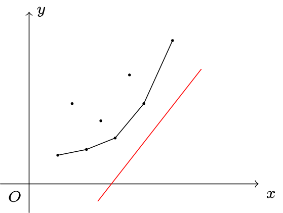

# 斜率优化 - OI Wiki

- Source: https://oi-wiki.org/dp/opt/slope/

# 斜率优化

## 例题引入

[「HNOI2008」玩具装箱](https://loj.ac/problem/10188)

有 𝑛n 个玩具，第 𝑖i 个玩具价值为 𝑐𝑖ci．要求将这 𝑛n 个玩具排成一排，分成若干段．对于一段 [𝑙,𝑟][l,r]，它的代价为 (𝑟 −𝑙 +∑𝑟𝑖=𝑙𝑐𝑖 −𝐿)2(r−l+∑i=lrci−L)2．其中 𝐿L 是一个常量，求分段的最小代价．

1 ≤𝑛 ≤5 ×104,1 ≤𝐿,𝑐𝑖 ≤1071≤n≤5×104,1≤L,ci≤107．

### 朴素的 DP 做法

令 𝑓𝑖fi 表示前 𝑖i 个物品，分若干段的最小代价．

状态转移方程：𝑓𝑖 =min𝑗<𝑖{𝑓𝑗 +(𝑖 −(𝑗 +1) +𝑝𝑟𝑒𝑖 −𝑝𝑟𝑒𝑗 −𝐿)2} =min𝑗<𝑖{𝑓𝑗 +(𝑝𝑟𝑒𝑖 −𝑝𝑟𝑒𝑗 +𝑖 −𝑗 −1 −𝐿)2}fi=minj<i{fj+(i−(j+1)+prei−prej−L)2}=minj<i{fj+(prei−prej+i−j−1−L)2}．

其中 𝑝𝑟𝑒𝑖prei 表示前 𝑖i 个数的和，即 ∑𝑖𝑗=1𝑐𝑗∑j=1icj．

该做法的时间复杂度为 𝑂(𝑛2)O(n2)，无法解决本题．

### 优化

考虑简化上面的状态转移方程式：令 𝑠𝑖 =𝑝𝑟𝑒𝑖 +𝑖,𝐿′ =𝐿 +1si=prei+i,L′=L+1，则 𝑓𝑖 =min𝑗<𝑖{𝑓𝑗 +(𝑠𝑖 −𝑠𝑗 −𝐿′)2}fi=minj<i{fj+(si−sj−L′)2}．

将与 𝑗j 无关的移到外面，我们得到

𝑓𝑖−(𝑠𝑖−𝐿′)2=min𝑗<𝑖{𝑓𝑗+𝑠2𝑗+2𝑠𝑗(𝐿′−𝑠𝑖)}fi−(si−L′)2=minj<i{fj+sj2+2sj(L′−si)}

考虑一次函数的斜截式 𝑦 =𝑘𝑥 +𝑏y=kx+b，将其移项得到 𝑏 =𝑦 −𝑘𝑥b=y−kx．我们将与 𝑗j 有关的信息表示为 𝑦y 的形式，把同时与 𝑖,𝑗i,j 有关的信息表示为 𝑘𝑥kx，把要最小化的信息（与 𝑖i 有关的信息）表示为 𝑏b，也就是截距．具体地，设

𝑥𝑗=𝑠𝑗𝑦𝑗=𝑓𝑗+𝑠2𝑗𝑘𝑖=−2(𝐿′−𝑠𝑖)𝑏𝑖=𝑓𝑖−(𝑠𝑖−𝐿′)2xj=sjyj=fj+sj2ki=−2(L′−si)bi=fi−(si−L′)2

则转移方程就写作 𝑏𝑖 =min𝑗<𝑖{𝑦𝑗 −𝑘𝑖𝑥𝑗}bi=minj<i{yj−kixj}．我们把 (𝑥𝑗,𝑦𝑗)(xj,yj) 看作二维平面上的点，则 𝑘𝑖ki 表示直线斜率，𝑏𝑖bi 表示一条过 (𝑥𝑗,𝑦𝑗)(xj,yj) 的斜率为 𝑘𝑖ki 的直线的截距．问题转化为了，选择合适的 𝑗j（1 ≤𝑗 <𝑖1≤j<i），最小化直线的截距．

如图，我们将这个斜率为 𝑘𝑖ki 的直线从下往上平移，直到有一个点 (𝑥𝑝,𝑦𝑝)(xp,yp) 在这条直线上，则有 𝑏𝑖 =𝑦𝑝 −𝑘𝑖𝑥𝑝bi=yp−kixp，这时 𝑏𝑖bi 取到最小值．算完 𝑓𝑖fi，我们就把 (𝑥𝑖,𝑦𝑖)(xi,yi) 这个点加入点集中，以做为新的 DP 决策．那么，我们该如何维护点集？

容易发现，可能让 𝑏𝑖bi 取到最小值的点一定在下凸壳上．因此在寻找 𝑝p 的时候我们不需要枚举所有 𝑖 −1i−1 个点，只需要考虑凸包上的点．而在本题中 𝑘𝑖ki 随 𝑖i 的增加而递增，因此我们可以单调队列维护凸包．

具体地，设 𝐾(𝑎,𝑏)K(a,b) 表示过 (𝑥𝑎,𝑦𝑎)(xa,ya) 和 (𝑥𝑏,𝑦𝑏)(xb,yb) 的直线的斜率．考虑队列 𝑞𝑙,𝑞𝑙+1,…,𝑞𝑟ql,ql+1,…,qr，维护的是下凸壳上的点．也就是说，对于 𝑙 <𝑖 <𝑟l<i<r，始终有 𝐾(𝑞𝑖−1,𝑞𝑖) <𝐾(𝑞𝑖,𝑞𝑖+1)K(qi−1,qi)<K(qi,qi+1) 成立．

我们维护一个指针 𝑒e 来计算 𝑏𝑖bi 最小值．我们需要找到一个 𝐾(𝑞𝑒−1,𝑞𝑒) ≤𝑘𝑖 <𝐾(𝑞𝑒,𝑞𝑒+1)K(qe−1,qe)≤ki<K(qe,qe+1) 的 𝑒e（特别地，当 𝑒 =𝑙e=l 或者 𝑒 =𝑟e=r 时要特别判断），这时就有 𝑝 =𝑞𝑒p=qe，即 𝑞𝑒qe 是 𝑖i 的最优决策点．由于 𝑘𝑖ki 是单调递增的，因此 𝑒e 的移动次数是均摊 𝑂(1)O(1) 的．

在插入一个点 (𝑥𝑖,𝑦𝑖)(xi,yi) 时，我们要判断是否 𝐾(𝑞𝑟−1,𝑞𝑟) <𝐾(𝑞𝑟,𝑖)K(qr−1,qr)<K(qr,i)，如果不等式不成立就将 𝑞𝑟qr 弹出，直到等式满足．然后将 𝑖i 插入到 𝑞q 队尾．

这样我们就将 DP 的复杂度优化到了 𝑂(𝑛)O(n)．

概括一下上述斜率优化模板题的算法：

  1. 将初始状态入队．
  2. 每次使用一条和 𝑖i 相关的直线 𝑓(𝑖)f(i) 去切维护的凸包，找到最优决策，更新 𝑑𝑝𝑖dpi．
  3. 加入状态 𝑑𝑝𝑖dpi．如果一个状态（即凸包上的一个点）在 𝑑𝑝𝑖dpi 加入后不再是凸包上的点，需要在 𝑑𝑝𝑖dpi 加入前将其剔除．

接下来我们介绍斜率优化的进阶应用，将斜率优化与二分/分治/数据结构等结合，来维护性质不那么好（缺少一些单调性性质）的 DP 方程．

## 二分/CDQ/平衡树优化 DP

当我们在 𝑖i 这个点寻找最优决策时，会使用一个和 𝑖i 相关的直线 𝑓(𝑖)f(i) 去切我们维护的凸包．切到的点即为最优决策．

在上述例题中，直线的斜率随 𝑖i 单调变化，但是对于有些问题，斜率并不是单调的．这时我们需要维护凸包上的每一个节点，然后每次用当前的直线去切这个凸包．这个过程可以使用二分解决，因为凸包上相邻两个点的斜率是有单调性的．

玩具装箱 改

有 𝑛n 个玩具，第 𝑖i 个玩具价值为 𝑐𝑖ci．要求将这 𝑛n 个玩具排成一排，分成若干段．对于一段 [𝑙,𝑟][l,r]，它的代价为 (𝑟 −𝑙 +∑𝑟𝑖=𝑙𝑐𝑖 −𝐿)2(r−l+∑i=lrci−L)2．其中 𝐿L 是一个常量，求分段的最小代价．

1 ≤𝑛 ≤5 ×104,1 ≤𝐿 ≤107, −107 ≤𝑐𝑖 ≤1071≤n≤5×104,1≤L≤107,−107≤ci≤107．

本题与「玩具装箱」问题唯一的区别是，玩具的价值可以为负．延续之前的思路，令 𝑓𝑖fi 表示前 𝑖i 个物品，分若干段的最小代价．

状态转移方程：𝑓𝑖 =min𝑗<𝑖{𝑓𝑗 +(𝑝𝑟𝑒𝑖 −𝑝𝑟𝑒𝑗 +𝑖 −𝑗 −1 −𝐿)2}fi=minj<i{fj+(prei−prej+i−j−1−L)2}．

其中 𝑝𝑟𝑒𝑖 =∑𝑖𝑗=1𝑐𝑗prei=∑j=1icj．

将方程做相同的变换

𝑓𝑖−(𝑠𝑖−𝐿′)2=min𝑗<𝑖{𝑓𝑗+𝑠2𝑗+2𝑠𝑗(𝐿′−𝑠𝑖)}fi−(si−L′)2=minj<i{fj+sj2+2sj(L′−si)}

然而这时有两个条件不成立了：

  1. 直线的斜率不再单调；
  2. 每次加入的决策点的横坐标不再单调．

仍然考虑凸壳的维护．

在寻找最优决策点，也就是用直线切凸壳的时候，我们将单调队列找队首改为：凸壳上二分．我们二分出斜率最接近直线斜率的那条凸壳边，就可以找到最优决策．

在加入决策点，也就是凸壳上加一个点的时候，我们有两种方法维护．

第一种方法是直接用平衡树维护凸壳．那么寻找决策点的二分操作就转化为在平衡树上二分，插入决策点就转化为在平衡树上插入一个结点，并删除若干个被踢出凸壳的点．此方法思路简洁但实现繁琐．

下面介绍一种基于 [CDQ 分治](../../../misc/cdq-divide/) 的做法．

设 CDQ(𝑙,𝑟)CDQ(l,r) 代表计算 𝑓𝑖,𝑖 ∈[𝑙,𝑟]fi,i∈[l,r]．考虑 CDQ(1,𝑛)CDQ(1,n)：

  * 我们先调用 CDQ(1,𝑚𝑖𝑑)CDQ(1,mid) 算出 𝑓𝑖,𝑖 ∈[1,𝑚𝑖𝑑]fi,i∈[1,mid]．然后我们对 [1,𝑚𝑖𝑑][1,mid] 这个区间内的决策点建凸壳，然后使用这个凸壳去更新 𝑓𝑖,𝑖 ∈[𝑚𝑖𝑑 +1,𝑛]fi,i∈[mid+1,n]．这时我们决策点集是固定的，不像之前那样边计算 DP 值边加入决策点，那么我们就可以把 𝑖 ∈[𝑚𝑖𝑑 +1,𝑛]i∈[mid+1,n] 的 𝑓𝑖fi 先按照直线的斜率 𝑘𝑖ki 排序，然后就可以使用单调队列来计算 DP 值了．当然，也可以在静态凸壳上二分计算 DP 值．

  * 对于 [𝑚𝑖𝑑 +1,𝑛][mid+1,n] 中的每个点，如果它的最优决策的位置是在 [1,𝑚𝑖𝑑][1,mid] 这个区间，在这一步操作中他就会被更新成最优答案．当执行完这一步操作时，我们发现 [1,𝑚𝑖𝑑][1,mid] 中的所有点已经发挥了全部的作用，凸壳中他们存不存在已经不影响之后的答案更新．因此我们可以直接舍弃这个区间的决策点，并使用 CDQ(𝑚𝑖𝑑 +1,𝑛)CDQ(mid+1,n) 解决右区间剩下的问题．

时间复杂度 𝑂(𝑛log2⁡𝑛)O(nlog2⁡n)．

对比「玩具装箱」和「玩具装箱 改」，可以总结出以下两点：

  * 二分/CDQ/平衡树等能够优化 DP 方程的计算，于一定程度上降低复杂度，但不能改变这个方程本身．
  * DP 方程的性质会取决于数据的特征，但 DP 方程本身取决于题目中的数学模型．

## 小结

斜率优化 DP 需要灵活运用，其宗旨是将最优化问题转化为二维平面上与凸包有关的截距最值问题．遇到性质不太好的方程，有时需要辅以数据结构来加以解决，届时还请就题而论．

## 习题

  * [「SDOI2016」征途](https://loj.ac/problem/2035)
  * [「ZJOI2007」仓库建设](https://loj.ac/problem/10189)
  * [「APIO2010」特别行动队](https://loj.ac/problem/10190)
  * [「JSOI2011」柠檬](https://www.luogu.com.cn/problem/P5504)
  * [「Codeforces 311B」Cats Transport](http://codeforces.com/problemset/problem/311/B)
  * [「NOI2007」货币兑换](https://loj.ac/problem/2353)
  * [「NOI2019」回家路线](https://loj.ac/problem/3156)
  * [「NOI2016」国王饮水记](https://uoj.ac/problem/223)
  * [「NOI2014」购票](https://uoj.ac/problem/7)

* * *

>  __本页面最近更新： 2026/1/7 08:56:54，[更新历史](https://github.com/OI-wiki/OI-wiki/commits/master/docs/dp/opt/slope.md)  
>  __发现错误？想一起完善？[在 GitHub 上编辑此页！](https://oi-wiki.org/edit-landing/?ref=/dp/opt/slope.md "edit.link.title")  
>  __本页面贡献者：[sshwy](https://github.com/sshwy), [GavinZhengOI](https://github.com/GavinZhengOI), [StudyingFather](https://github.com/StudyingFather), [Ir1d](https://github.com/Ir1d), [Marcythm](https://github.com/Marcythm), [mgt](mailto:i@margatroid.xyz), [Enter-tainer](https://github.com/Enter-tainer), [luoguyuntianming](https://github.com/luoguyuntianming), [ouuan](https://github.com/ouuan), [abc1763613206](https://github.com/abc1763613206), [BackSlashDelta](mailto:64258212+backslashdelta@users.noreply.github.com), [billchenchina](https://github.com/billchenchina), [Chrogeek](https://github.com/Chrogeek), [ChungZH](https://github.com/ChungZH), [fps5283](https://github.com/fps5283), [greyqz](https://github.com/greyqz), [GreyTigerOIer](https://github.com/GreyTigerOIer), [Henry-ZHR](https://github.com/Henry-ZHR), [hsfzLZH1](https://github.com/hsfzLZH1), [Kaiser-Yang](https://github.com/Kaiser-Yang), [Konano](https://github.com/Konano), [Luckyblock233](https://github.com/Luckyblock233), [MrFoodinChina](https://github.com/MrFoodinChina), [NachtgeistW](https://github.com/NachtgeistW), [nanmenyangde](https://github.com/nanmenyangde), [Tiphereth-A](https://github.com/Tiphereth-A), [wood3](https://github.com/wood3), [Xeonacid](https://github.com/Xeonacid), [代建杉](mailto:wood3s@foxmail.com)  
>  __本页面的全部内容在**[CC BY-SA 4.0](https://creativecommons.org/licenses/by-sa/4.0/deed.zh) 和 [SATA](https://github.com/zTrix/sata-license)** 协议之条款下提供，附加条款亦可能应用
