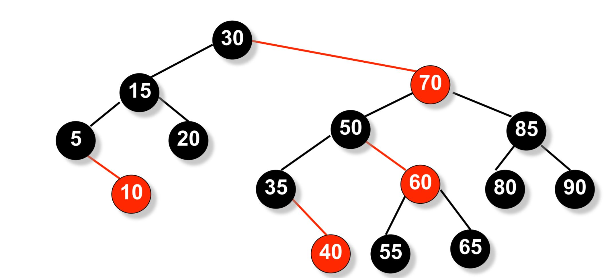
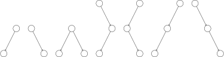
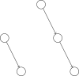
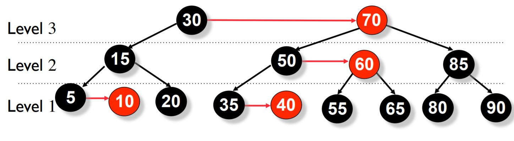
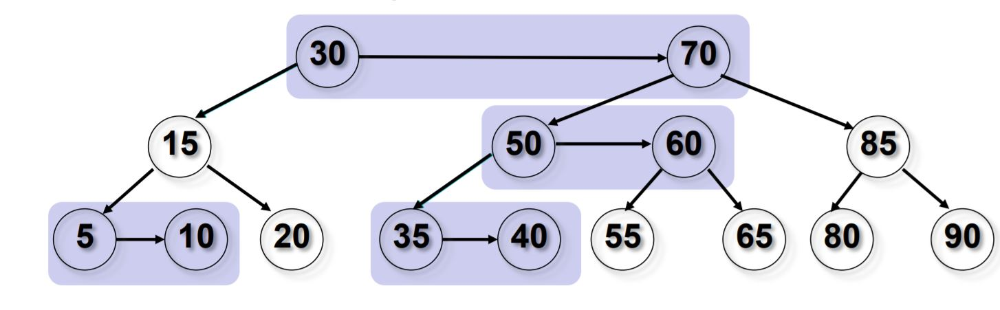
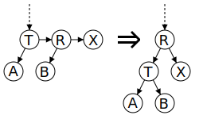
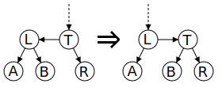

# AA 树 - OI Wiki

- Source: https://oi-wiki.org/ds/aa-tree/

# AA 树

AA 树是一种用于高效存储和检索有序数据的平衡树形结构，Arne Andersson 教授于 1993 年在他的论文 "Balanced search trees made simple" 中介绍，设计的目的是减少红黑树考虑的不同情况．AA 树可以在 𝑂(log⁡𝑁)O(log⁡N) 的时间内做查找，插入和删除．下面是一个 AA 树的例子．

AA 树是红黑树的一种变体，与红黑树不同，AA 树上的红色节点只能作为右子节点．这导致 AA 树模拟了 2-3 树而不是 2-3-4 树，从而极大地简化了维护操作．红黑树的维护算法需要考虑七种不同的情况来正确平衡树．

因为红色节点只能作为右子节点，AA 树只需要考虑两种情况．

## 定义

AA 树遵循与红黑树相同的规则，但添加了一条新规则，**即红色节点不能作为左孩子出现** ．

  1. 每个节点都可以是红色或黑色．
  2. 根节点总是黑色．
  3. 叶节点（NULL）总是黑色．
  4. 红色节点的两个子节点必须都是黑色，即没有两个相邻的红色节点．
  5. 从根节点到 NULL 节点的每条路径都有相同数量的黑色节点．
  6. 红色节点只能作为右子节点．

## 平衡维护

AA 树的每个节点维护一个 **level** 字段，类似红黑树的每个节点维护一个 color 字段 ("RED" or "BLACK")．level 的规定满足以下 5 个条件：

1、每个叶节点的 level 是 1．

2、每个左孩子的 level 是其父节点的 level 减 1．

3、每个右孩子的 level 等于其父节点的 level 或等于其父节点的 level 减 1．

4、每个右孙子的 level 严格小于其祖父节点的 level．

5、每个 level 大于 1 的节点有两个孩子．

### 水平链接（Horizontal Link）

子节点的 level 等于父节点的 level 的链接被称为 **水平链接** ，类似于红黑树中的红链接．允许单独的右水平链接，但不允许连续的右水平链接；不允许左水平链接．这些限制比红黑树的限制更加严格，因此 AA 树的平衡过程比红黑树的平衡过程在程序上要简单得多．

插入和删除操作可能会暂时导致 AA 树失去平衡（即违反 AA 树的不变性）．恢复平衡只需要两种不同的操作："**skew** "（斜化）和"**split** "（分裂）．"Skew"是将一个包含左水平链接的子树进行右旋转，以替换为一个包含右水平链接的子树．"Split"是进行左旋转并增加 level，以替换一个包含两个或更多连续的右水平链接的子树，使其变为一个包含两个较少连续的右水平链接的子树．保持平衡的插入和删除的实现通过依赖"skew"和"split"操作来仅在需要时修改树，而不是由调用者决定是否进行"skew"或"split"，从而变得更加简化．

### split（左旋）

出现连续向右的水平方向链（连续三个向右的孩子属于同一 level，节点 R 和节点 X 都是红色节点）．

此时向左旋转节点 _T_ ，把小于等于此 level 的节点看做一个子树．

  1. 子树的根的右孩子变为新的子树根；
  2. 原来的子树根变为新子树根的左孩子；
  3. 新的子树根 level+1．

伪代码实现 1𝐟𝐮𝐧𝐜𝐭𝐢𝐨𝐧 split(root)2𝐢𝐟 root→right→right→level==root→level3rotate\_left(root)4𝐞𝐧𝐝 𝐟𝐮𝐧𝐜𝐭𝐢𝐨𝐧1function split(root)2if root→right→right→level==root→level3rotate\\_left(root)4end function

### skew（右旋）

出现向左的水平方向链（连续两个向左的孩子属于同一 level）

向右旋转节点 _T_ ，把小于等于此 level 的节点看做一个子树．

  1. 子树的根的左孩子变为新的子树根；
  2. 原来的子树根变为新子树根的右孩子．

伪代码实现 1𝐟𝐮𝐧𝐜𝐭𝐢𝐨𝐧 skew(root)2𝐢𝐟 root→left→level==root→level3rotate\_right(root)4𝐞𝐧𝐝 𝐟𝐮𝐧𝐜𝐭𝐢𝐨𝐧1function skew(root)2if root→left→level==root→level3rotate\\_right(root)4end function

## AA 树的操作

AA 树本身是一棵二叉搜索树，所以搜索操作与其他二叉搜索树相同．插入和删除操作与 _AVL_ 树相同，首先在树中将 key 插入或删除，然后沿着搜索路径回退到根，并在此过程中重构树．

### 插入

伪代码实现 1𝐟𝐮𝐧𝐜𝐭𝐢𝐨𝐧 insert(root,add)2𝐢𝐟 root==NULL3root←add4𝐞𝐥𝐬𝐞 𝐢𝐟 add→key<root→key//如果允许重复<=5insert(root→left,add)6𝐞𝐥𝐬𝐞 𝐢𝐟 add→key>root→key7insert(root→right,add)8𝐞𝐧𝐝 𝐢𝐟9//如果不允许重复，在每一level上进行skew和split10skew(root);11split(root);12𝐞𝐧𝐝 𝐟𝐮𝐧𝐜𝐭𝐢𝐨𝐧1function insert(root,add)2if root==NULL3root←add4else if add→key<root→key//如果允许重复<=5insert(root→left,add)6else if add→key>root→key7insert(root→right,add)8end if9//如果不允许重复，在每一level上进行skew和split10skew(root);11split(root);12end function

### 删除

删除过程与其他二叉平衡树类似，首先将内部节点的删除转换为叶子节点的删除．具体方法是将内部节点与它最接近的前驱或后继节点替换．由于 AA 树的所有 level 大于 1 的节点都有两个子节点，前驱或后继节点将位于 level 1，删除 level 1 的节点较为简单．

伪代码实现 1//To rebalance the tree2𝐢𝐟 root->left->level<root->level−1 𝐨𝐫 root->right->level<root->level−13{4𝐢𝐟 root->right->level>--root->level5{6root->right->level←root->level7}8skew(root)9skew(root->right)10skew(root->right->right)11split(root)12split(root->right)13}1//To rebalance the tree2if root->left->level<root->level−1 or root->right->level<root->level−13{4if root->right->level>\--root->level5{6root->right->level←root->level7}8skew(root)9skew(root->right)10skew(root->right->right)11split(root)12split(root->right)13}

## 性能

AA 树的性能与红黑树的性能相当．尽管 AA 树进行的旋转操作比红黑树多，但 AA 树的算法更简单，最终导致相近的性能．红黑树的性能在各种情况下更加一致，而 AA 树往往更扁平，这使 AA 树有稍快的搜索速度．

## 参考资料

  1. [AA tree - Wikipedia](https://en.wikipedia.org/wiki/AA_tree)
  2. [Introduction to AA trees](https://iq.opengenus.org/aa-trees/)
  3. [AA tree - Visualization](https://kubokovac.eu/gnarley-trees/AAtree.html)
  4. [CMSC 420 Lecture 6: 2-3, Red-black, and AA trees](https://www.cs.umd.edu/class/fall2019/cmsc420-0201/Lects/lect06-aa.pdf)

* * *

>  __本页面最近更新： 2026/1/7 08:56:54，[更新历史](https://github.com/OI-wiki/OI-wiki/commits/master/docs/ds/aa-tree.md)  
>  __发现错误？想一起完善？[在 GitHub 上编辑此页！](https://oi-wiki.org/edit-landing/?ref=/ds/aa-tree.md "edit.link.title")  
>  __本页面贡献者：[c8ef](https://github.com/c8ef), [Tiphereth-A](https://github.com/Tiphereth-A), [yuhuoji](https://github.com/yuhuoji)  
>  __本页面的全部内容在**[CC BY-SA 4.0](https://creativecommons.org/licenses/by-sa/4.0/deed.zh) 和 [SATA](https://github.com/zTrix/sata-license)** 协议之条款下提供，附加条款亦可能应用
