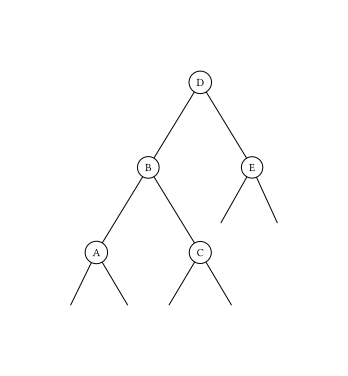
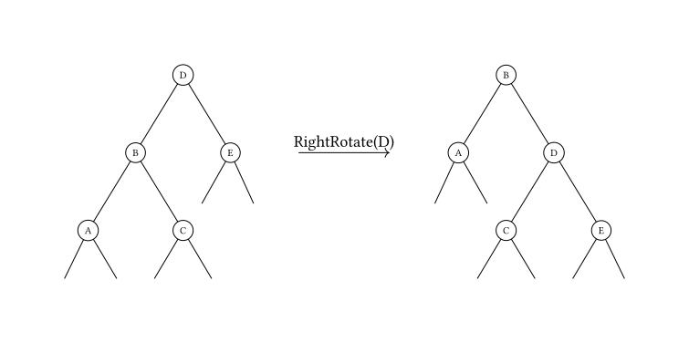
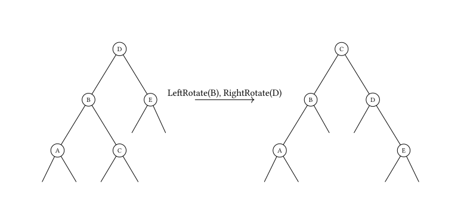

# AVL 树 - OI Wiki

- Source: https://oi-wiki.org/ds/avl/

# AVL 树

AVL 树，是一种平衡的二叉搜索树．由于各种算法教材上对 AVL 的介绍十分冗长，造成了很多人对 AVL 树复杂、不实用的印象．但实际上，AVL 树的原理简单，实现也并不复杂．

## 性质

  1. 空二叉树是一个 AVL 树
  2. 如果 T 是一棵 AVL 树，那么其左右子树也是 AVL 树，并且 |ℎ(𝑙𝑠) −ℎ(𝑟𝑠)| ≤1|h(ls)−h(rs)|≤1，h 是其左右子树的高度
  3. 树高为 𝑂(log⁡𝑛)O(log⁡n)

平衡因子：右子树高度 - 左子树高度

树高的证明

设 𝑓𝑛fn 为高度为 𝑛n 的 AVL 树所包含的最少节点数，则有

𝑓𝑛=⎧{ {⎨{ {⎩1(𝑛=1)2(𝑛=2)𝑓𝑛−1+𝑓𝑛−2+1(𝑛>2)fn={1(n=1)2(n=2)fn−1+fn−2+1(n>2)

根据常系数非齐次线性差分方程的解法，{𝑓𝑛 +1}{fn+1} 是一个斐波那契数列．这里 𝑓𝑛fn 的通项为：

𝑓𝑛=5+2√55(1+√52)𝑛+5−2√55(1−√52)𝑛−1fn=5+255(1+52)n+5−255(1−52)n−1

斐波那契数列以指数的速度增长，对于树高 𝑛n 有：

𝑛<log1+√52⁡(𝑓𝑛+1)<32log2⁡(𝑓𝑛+1)n<log1+52⁡(fn+1)<32log2⁡(fn+1)

因此 AVL 树的高度为 𝑂(log⁡𝑓𝑛)O(log⁡fn)，这里的 𝑓𝑛fn 为结点数．

## 过程

### 插入结点

与 BST（二叉搜索树）中类似，先进行一次失败的查找来确定插入的位置，插入节点后根据平衡因子来决定是否需要调整．

### 删除结点

删除和 BST 类似，将结点与后继交换后再删除．

删除会导致树高以及平衡因子变化，这时需要沿着被删除结点到根的路径来调整这种变化．

### 平衡的维护

插入或删除节点后，可能会造成 AVL 树的性质 2 被破坏．因此，需要沿着从被插入/删除的节点到根的路径对树进行维护．如果对于某一个节点，性质 2 不再满足，由于我们只插入/删除了一个节点，对树高的影响不超过 1，因此该节点的平衡因子的绝对值至多为 2．由于对称性，我们在此只讨论左子树的高度比右子树大 2 的情况，即下图中 ℎ(𝐵) −ℎ(𝐸) =2h(B)−h(E)=2．此时，还需要根据 ℎ(𝐴)h(A) 和 ℎ(𝐶)h(C) 的大小关系分两种情况讨论．需要注意的是，由于我们是自底向上维护平衡的，因此对节点 D 的所有后代来说，性质 2 仍然是被满足的．



#### 情况一：A 点树高不小于 C 点树高

设 ℎ(𝐸) =𝑥h(E)=x，则有

⎧{ {⎨{ {⎩ℎ(𝐵)=𝑥+2ℎ(𝐴)=𝑥+1𝑥≤ℎ(𝐶)≤𝑥+1{h(B)=x+2h(A)=x+1x≤h(C)≤x+1

其中 ℎ(𝐶) ≥𝑥h(C)≥x 是由于节点 B 满足性质 2，因此 ℎ(𝐶)h(C) 和 ℎ(𝐴)h(A) 的差不会超过 1．此时我们对节点 D 进行一次右旋操作（旋转操作与其它类型的平衡二叉搜索树相同），如下图所示．



显然节点 A、C、E 的高度不发生变化，并且有

⎧{ {⎨{ {⎩0≤ℎ(𝐶)−ℎ(𝐸)≤1𝑥+1≤ℎ′(𝐷)=max(ℎ(𝐶),ℎ(𝐸))+1=ℎ(𝐶)+1≤𝑥+20≤ℎ′(𝐷)−ℎ(𝐴)≤1{0≤h(C)−h(E)≤1x+1≤h′(D)=max(h(C),h(E))+1=h(C)+1≤x+20≤h′(D)−h(A)≤1

因此旋转后的节点 B 和 D 也满足性质 2．

#### 情况二：A 点树高小于 C 点树高

设 ℎ(𝐸) =𝑥h(E)=x，则与刚才同理，有

⎧{ {⎨{ {⎩ℎ(𝐵)=𝑥+2ℎ(𝐶)=𝑥+1ℎ(𝐴)=𝑥{h(B)=x+2h(C)=x+1h(A)=x

此时我们先对节点 B 进行一次左旋操作，再对节点 D 进行一次右旋操作，如下图所示．



显然节点 A、E 的高度不发生变化，并且 B 的新右儿子和 D 的新左儿子分别为 C 原来的左右儿子，则有

⎧{ { { {⎨{ { { {⎩𝑥−1≤ℎ′(𝑟𝑠𝐵),ℎ′(𝑙𝑠𝐷)≤𝑥0≤ℎ(𝐴)−ℎ′(𝑟𝑠𝐵)≤10≤ℎ(𝐸)−ℎ′(𝑙𝑠𝐷)≤1ℎ′(𝐵)=max(ℎ(𝐴),ℎ′(𝑟𝑠𝐵))+1=𝑥+1ℎ′(𝐷)=max(ℎ(𝐸),ℎ′(𝑙𝑠𝐷))+1=𝑥+1ℎ′(𝐵)−ℎ′(𝐷)=0{x−1≤h′(rsB),h′(lsD)≤x0≤h(A)−h′(rsB)≤10≤h(E)−h′(lsD)≤1h′(B)=max(h(A),h′(rsB))+1=x+1h′(D)=max(h(E),h′(lsD))+1=x+1h′(B)−h′(D)=0

因此旋转后的节点 B、C、D 也满足性质 2．

维护平衡操作：伪代码 1𝐟𝐮𝐧𝐜𝐭𝐢𝐨𝐧 MaintainBalance(𝑝)2𝑙←𝑙𝑠𝑝,𝑟←𝑟𝑠𝑝3𝐢𝐟 ℎ(𝑙)−ℎ(𝑟)=24𝐢𝐟 ℎ(𝑙𝑠𝑙)≥ℎ(𝑟𝑠𝑙)5RightRotate(𝑝)6𝐞𝐥𝐬𝐞7LeftRotate(𝑙)8RightRotate(𝑝)9𝐞𝐥𝐬𝐞 𝐢𝐟 ℎ(𝑙)−ℎ(𝑟)=−210𝐢𝐟 ℎ(𝑙𝑠𝑟)≤ℎ(𝑟𝑠𝑟)11LeftRotate(𝑝)12𝐞𝐥𝐬𝐞13RightRotate(𝑟)14LeftRotate(𝑝)1function MaintainBalance(p)2l←lsp,r←rsp3if h(l)−h(r)=24if h(lsl)≥h(rsl)5RightRotate(p)6else7LeftRotate(l)8RightRotate(p)9else if h(l)−h(r)=−210if h(lsr)≤h(rsr)11LeftRotate(p)12else13RightRotate(r)14LeftRotate(p)

与其他平衡二叉搜索树相同，AVL 树中节点的高度、子树大小等信息需要在旋转时进行维护．

## 其他操作

AVL 树的其他操作（Predecessor、Successor、Select、Rank 等）与普通的二叉搜索树相同．

## 参考代码

下面的代码是用 AVL 树实现的 `Map`，即有序不可重映射：

参考代码

```text 1 2 3 4 5 6 7 8 9 10 11 12 13 14 15 16 17 18 19 20 21 22 23 24 25 26 27 28 29 30 31 32 33 34 35 36 37 38 39 40 41 42 43 44 45 46 47 48 49 50 51 52 53 54 55 56 57 58 59 60 61 62 63 64 65 66 67 68 69 70 71 72 73 74 75 76 77 78 79 80 81 82 83 84 85 86 87 88 89 90 91 92 93 94 95 96 97 98 99 100 101 102 103 104 105 106 107 108 109 110 111 112 113 114 115 116 117 118 119 120 121 122 123 124 125 126 127 128 129 130 131 132 133 134 135 136 137 138 139 140 141 142 143 144 145 146 147 148 149 150 151 152 153 154 155 156 157 158 159 160 161 162 163 164 165 166 167 168 169 170 171 172 173 174 175 176 177 178 179 180 181 182 183 184 185 186 187 188 189 190 191 192 193 194 195 196 197 198 199 200 201 202 203 204 205 206 207 208 209 210 211 212 213 214 215 216 217 218 219 220 221 222 223 224 225 226 227 228 229 230 231 232 233 234 235 236 237 238 239 240 241 242 243 244 245 246 247 248 249 250 251 252 253 254 255 256 257 258 259 260 261 262 263 264 265 266 267 268 269 270 271 272 273 274 275 276 277 278 279 280 281 282 283 284 285 286 287 288 289 290 291 292 293 294 295 296 297 298 299 300 301 302 303 304 305 306 307 308 309 310 311 312 313 314 315 316 317 318 319 320 321 322 323 324 325 326 327 328 329 330 331 332 333 334 335 336 337 338 339 340 341 342 343 344 345 346 347 348 349 350 351 352 353 354 355 356 357 358 359 360 361 362 363 364 365 366 367 368 369 370 371 372 373 374 375 376 377 378 379 380 381 382 383 384 385 386 387 388 389 390 391 392 393 394 395 396 397 398 399 400 401 402 403 404 405 406 407 408 409 410 411 412 413 414 415 416 417 418 419 420 421 422 423 424 425 426 427 428 429 430 431 432 433 434 435 436 437 438 439 440 441 442 443 444 445 446 447 448 449 450 451 452 453 454 455 456 457 458 459 460 461 462 463 464 465 466 467 468 469 470 471 472 473 474 475 476 477 478 479 480 481 482 483 484 485 486 487 488 489 490 491 492 493 494 495 496 497 498 499 500 501 502 503 504 505 506 507 508 509 510 511 512 513 514 515 516 517 518 519 520 521 522 523 524 525 526 527 528 529 530 531 532 533 534 535 536 537 538 539 540 541 542 543 544 545 546 547 548 549 550 551 552 553 554 555 556 557 558 559 560 561 562 563 564 565 566 567 568 569 570 571 572 573 574 575 576 577 578 579 580 581 582 583 584 585 586 587 588 589 590 591 592 593 594 595 596 597 598 599 600 601 602 603 604 605 606 607 608 609 610 611 612 613 614 615 616 617 618 619 620 621 622 623 624 625 626 627 628 629 630 631 632 633 634 635 636 637 638 639 640 641 642 643 644 645 646 647 648 649 650 651 652 653 654 655 656 657 658 659 660 661 662 663 664 665 666 667 668 669 670 671 672 673 674 675 676 677 678 679 680 681 682 683 684 685 686 687 688 689 690 691 692 693 694 695 696 697 698 699 700 701 702 703 704 705 706 707 708 709 710 711 712 713 714 715 716 717 718 719 720 721 722 723 724 725 726 727 728 729 730 731 732 733 734 735 736 737 738 739 740 741 742 743 744 745 746 747 748 749 750 751 752 753 754 755 756 757 758 759 760 761 762 763 764 765 766 767 768 769 770 771 772 773 774 775 776 777 778 779 780 781 782 783 784 785 786 787 788 789 790 791 792 793 794 795 796 797 798 799 800 801 802 803 804 805 806 807 808 809 810 811 812 813 814 815 816 817 818 819 820 821 822 823 824 825 826 827 828 829 830 831 832 833 834 835 836 837 838 839 840 841 842 843 844 845 846 847 848 849 850 851 852 853 854 855 856 857 858 859 860 861 862 863 864 865 866 867 868 869 870 871 872 873 874 875 876 877 878 879 880 881 882 883 884 885 886 887 888 889 890 891 892 893 894 895 896 897 898 899 900 901 902 903 904 ``` |  ```text /** * @brief An AVLTree-based map implementation * @details The map is sorted according to the natural ordering of its * keys or by a {@code Compare} function provided; This implementation * provides guaranteed log(n) time cost for the contains, get, insert * and remove operations. */ #ifndef AVLTREE_MAP_HPP #define AVLTREE_MAP_HPP #include <cassert> #include <cstddef> #include <cstdint> #include <functional> #include <memory> #include <stack> #include <utility> #include <vector> /** * An AVLTree-based map implementation * https://en.wikipedia.org/wiki/AVL_tree * @tparam Key the type of keys maintained by this map * @tparam Value the type of mapped values * @tparam Compare */ template < typename Key , typename Value , typename Compare = std :: less < Key > > class AvlTreeMap { private : using USize = size_t ; using Factor = int64_t ; Compare compare = Compare (); public : struct Entry { Key key ; Value value ; bool operator == ( const Entry & rhs ) const noexcept { return this -> key == rhs . key && this -> value == rhs . value ; } bool operator != ( const Entry & rhs ) const noexcept { return this -> key != rhs . key || this -> value != rhs . value ; } }; private : struct Node { using Ptr = std :: shared_ptr < Node > ; using Provider = const std :: function < Ptr ( void ) > & ; using Consumer = const std :: function < void ( const Ptr & ) > & ; Key key ; Value value {}; Ptr left = nullptr ; Ptr right = nullptr ; USize height = 1 ; explicit Node ( Key k ) : key ( std :: move ( k )) {} explicit Node ( Key k , Value v ) : key ( std :: move ( k )), value ( std :: move ( v )) {} ~ Node () = default ; inline bool isLeaf () const noexcept { return this -> left == nullptr && this -> right == nullptr ; } inline void updateHeight () noexcept { if ( this -> isLeaf ()) { this -> height = 1 ; } else if ( this -> left == nullptr ) { this -> height = this -> right -> height \+ 1 ; } else if ( this -> right == nullptr ) { this -> height = this -> left -> height \+ 1 ; } else { this -> height = std :: max ( left -> height , right -> height ) \+ 1 ; } } inline Factor factor () const noexcept { if ( this -> isLeaf ()) { return 0 ; } else if ( this -> left == nullptr ) { return ( Factor ) this -> right -> height ; } else if ( this -> right == nullptr ) { return ( Factor ) \- this -> left -> height ; } else { return ( Factor )( this -> right -> height \- this -> left -> height ); } } inline Entry entry () const { return Entry { key , value }; } static Ptr from ( const Key & k ) { return std :: make_shared < Node > ( Node ( k )); } static Ptr from ( const Key & k , const Value & v ) { return std :: make_shared < Node > ( Node ( k , v )); } }; using NodePtr = typename Node :: Ptr ; using ConstNodePtr = const NodePtr & ; using NodeProvider = typename Node :: Provider ; using NodeConsumer = typename Node :: Consumer ; NodePtr root = nullptr ; USize count = 0 ; using K = const Key & ; using V = const Value & ; public : using EntryList = std :: vector < Entry > ; using KeyValueConsumer = const std :: function < void ( K , V ) > & ; using MutKeyValueConsumer = const std :: function < void ( K , Value & ) > & ; using KeyValueFilter = const std :: function < bool ( K , V ) > & ; class NoSuchMappingException : protected std :: exception { private : const char * message ; public : explicit NoSuchMappingException ( const char * msg ) : message ( msg ) {} const char * what () const noexcept override { return message ; } }; AvlTreeMap () noexcept = default ; /** * Returns the number of entries in this map. * @return size_t */ inline USize size () const noexcept { return this -> count ; } /** * Returns true if this collection contains no elements. * @return bool */ inline bool empty () const noexcept { return this -> count == 0 ; } /** * Removes all of the elements from this map. */ void clear () noexcept { this -> root = nullptr ; this -> count = 0 ; } /** * Returns the value to which the specified key is mapped; If this map * contains no mapping for the key, a {@code NoSuchMappingException} will * be thrown. * @param key * @return AvlTreeMap<Key, Value>::Value * @throws NoSuchMappingException */ Value get ( K key ) const { if ( this -> root == nullptr ) { throw NoSuchMappingException ( "Invalid key" ); } else { NodePtr node = this -> getNode ( this -> root , key ); if ( node != nullptr ) { return node -> value ; } else { throw NoSuchMappingException ( "Invalid key" ); } } } /** * Returns the value to which the specified key is mapped; If this map * contains no mapping for the key, a new mapping with a default value * will be inserted. * @param key * @return AvlTreeMap<Key, Value>::Value & */ Value & getOrDefault ( K key ) { if ( this -> root == nullptr ) { this -> root = Node :: from ( key ); this -> count += 1 ; return this -> root -> value ; } else { return this -> getNodeOrProvide ( this -> root , key , [ & key ]() { return Node :: from ( key ); }) -> value ; } } /** * Returns true if this map contains a mapping for the specified key. * @param key * @return bool */ bool contains ( K key ) const { return this -> getNode ( this -> root , key ) != nullptr ; } /** * Associates the specified value with the specified key in this map. * @param key * @param value */ void insert ( K key , V value ) { if ( this -> root == nullptr ) { this -> root = Node :: from ( key , value ); this -> count += 1 ; } else { this -> insert ( this -> root , key , value ); } } /** * If the specified key is not already associated with a value, associates * it with the given value and returns true, else returns false. * @param key * @param value * @return bool */ bool insertIfAbsent ( K key , V value ) { USize sizeBeforeInsertion = this -> size (); if ( this -> root == nullptr ) { this -> root = Node :: from ( key , value ); this -> count += 1 ; } else { this -> insert ( this -> root , key , value , false ); } return this -> size () > sizeBeforeInsertion ; } /** * If the specified key is not already associated with a value, associates * it with the given value and returns the value, else returns the associated * value. * @param key * @param value * @return */ Value & getOrInsert ( K key , V value ) { if ( this -> root == nullptr ) { this -> root = Node :: from ( key , value ); this -> count += 1 ; return root -> value ; } else { NodePtr node = getNodeOrProvide ( this -> root , key , [ & ]() { return Node :: from ( key , value ); }); return node -> value ; } } Value operator []( K key ) const { return this -> get ( key ); } Value & operator []( K key ) { return this -> getOrDefault ( key ); } /** * Removes the mapping for a key from this map if it is present; * Returns true if the mapping is present else returns false * @param key the key of the mapping * @return bool */ bool remove ( K key ) { if ( this -> root == nullptr ) { return false ; } else { return this -> remove ( this -> root , key , []( ConstNodePtr ) {}); } } /** * Removes the mapping for a key from this map if it is present and returns * the value which is mapped to the key; If this map contains no mapping for * the key, a {@code NoSuchMappingException} will be thrown. * @param key * @return AvlTreeMap<Key, Value>::Value * @throws NoSuchMappingException */ Value getAndRemove ( K key ) { Value result ; NodeConsumer action = [ & ]( ConstNodePtr node ) { result = node -> value ; }; if ( root == nullptr ) { throw NoSuchMappingException ( "Invalid key" ); } else { if ( remove ( this -> root , key , action )) { return result ; } else { throw NoSuchMappingException ( "Invalid key" ); } } } /** * Gets the entry corresponding to the specified key; if no such entry * exists, returns the entry for the least key greater than the specified * key; if no such entry exists (i.e., the greatest key in the Tree is less * than the specified key), a {@code NoSuchMappingException} will be thrown. * @param key * @return AvlTreeMap<Key, Value>::Entry * @throws NoSuchMappingException */ Entry getCeilingEntry ( K key ) const { if ( this -> root == nullptr ) { throw NoSuchMappingException ( "No ceiling entry in this map" ); } NodePtr node = this -> root ; std :: stack < NodePtr > ancestors ; while ( node != nullptr ) { if ( key == node -> key ) { return node -> entry (); } if ( compare ( key , node -> key )) { /* key < node->key */ if ( node -> left != nullptr ) { ancestors . push ( node ); node = node -> left ; } else { return node -> entry (); } } else { /* key > node->key */ if ( node -> right != nullptr ) { ancestors . push ( node ); node = node -> right ; } else { if ( ancestors . empty ()) { throw NoSuchMappingException ( "No ceiling entry in this map" ); } NodePtr parent = ancestors . top (); ancestors . pop (); while ( node == parent -> right ) { node = parent ; if ( ! ancestors . empty ()) { parent = ancestors . top (); ancestors . pop (); } else { throw NoSuchMappingException ( "No ceiling entry in this map" ); } } return parent -> entry (); } } } throw NoSuchMappingException ( "No ceiling entry in this map" ); } /** * Gets the entry corresponding to the specified key; if no such entry exists, * returns the entry for the greatest key less than the specified key; * if no such entry exists, a {@code NoSuchMappingException} will be thrown. * @param key * @return AvlTreeMap<Key, Value>::Entry * @throws NoSuchMappingException */ Entry getFloorEntry ( K key ) const { if ( this -> root == nullptr ) { throw NoSuchMappingException ( "No floor entry exists in this map" ); } NodePtr node = this -> root ; std :: stack < NodePtr > ancestors ; while ( node != nullptr ) { if ( key == node -> key ) { return node -> entry (); } if ( compare ( key , node -> key )) { /* key < node->key */ if ( node -> left != nullptr ) { ancestors . push ( node ); node = node -> left ; } else { if ( ancestors . empty ()) { throw NoSuchMappingException ( "No floor entry exists in this map" ); } NodePtr parent = ancestors . top (); ancestors . pop (); while ( node == parent -> left ) { node = parent ; if ( ! ancestors . empty ()) { parent = ancestors . top (); ancestors . pop (); } else { throw NoSuchMappingException ( "No floor entry exists in this map" ); } } return parent -> entry (); } } else { /* key > node->key */ if ( node -> right != nullptr ) { ancestors . push ( node ); node = node -> right ; } else { return node -> entry (); } } } throw NoSuchMappingException ( "No floor entry exists in this map" ); } /** * Gets the entry for the least key greater than the specified * key; if no such entry exists, returns the entry for the least * key greater than the specified key; if no such entry exists, * a {@code NoSuchMappingException} will be thrown. * @param key * @return AvlTreeMap<Key, Value>::Entry * @throws NoSuchMappingException */ Entry getHigherEntry ( K key ) { if ( this -> root == nullptr ) { throw NoSuchMappingException ( "No higher entry exists in this map" ); } NodePtr node = this -> root ; std :: stack < NodePtr > ancestors ; while ( node != nullptr ) { if ( compare ( key , node -> key )) { /* key < node->key */ if ( node -> left != nullptr ) { ancestors . push ( node ); node = node -> left ; } else { return node -> entry (); } } else { /* key >= node->key */ if ( node -> right != nullptr ) { ancestors . push ( node ); node = node -> right ; } else { if ( ancestors . empty ()) { throw NoSuchMappingException ( "No higher entry exists in this map" ); } NodePtr parent = ancestors . top (); ancestors . pop (); while ( node == parent -> right ) { node = parent ; if ( ! ancestors . empty ()) { parent = ancestors . top (); ancestors . pop (); } else { throw NoSuchMappingException ( "No higher entry exists in this map" ); } } return parent -> entry (); } } } throw NoSuchMappingException ( "No higher entry exists in this map" ); } /** * Returns the entry for the greatest key less than the specified key; if * no such entry exists (i.e., the least key in the Tree is greater than * the specified key), a {@code NoSuchMappingException} will be thrown. * @param key * @return AvlTreeMap<Key, Value>::Entry * @throws NoSuchMappingException */ Entry getLowerEntry ( K key ) const { if ( this -> root == nullptr ) { throw NoSuchMappingException ( "No lower entry exists in this map" ); } NodePtr node = this -> root ; std :: stack < NodePtr > ancestors ; while ( node != nullptr ) { if ( compare ( key , node -> key ) || key == node -> key ) { /* key <= node->key */ if ( node -> left != nullptr ) { ancestors . push ( node ); node = node -> left ; } else { if ( ancestors . empty ()) { throw NoSuchMappingException ( "No lower entry exists in this map" ); } NodePtr parent = ancestors . top (); ancestors . pop (); while ( node == parent -> left ) { node = parent ; if ( ! ancestors . empty ()) { parent = ancestors . top (); ancestors . pop (); } else { throw NoSuchMappingException ( "No lower entry exists in this map" ); } } return parent -> entry (); } } else { /* key > node->key */ if ( node -> right != nullptr ) { ancestors . push ( node ); node = node -> right ; } else { return node -> entry (); } } } throw NoSuchMappingException ( "No lower entry exists in this map" ); } /** * Remove all entries that satisfy the filter condition. * @param filter */ void removeAll ( KeyValueFilter filter ) { std :: vector < Key > keys ; this -> inorderTraversal ([ & ]( ConstNodePtr node ) { if ( filter ( node -> key , node -> value )) { keys . push_back ( node -> key ); } }); for ( const Key & key : keys ) { this -> remove ( key ); } } /** * Performs the given action for each key and value entry in this map. * The value is immutable for the action. * @param action */ void forEach ( KeyValueConsumer action ) const { this -> inorderTraversal ( [ & ]( ConstNodePtr node ) { action ( node -> key , node -> value ); }); } /** * Performs the given action for each key and value entry in this map. * The value is mutable for the action. * @param action */ void forEachMut ( MutKeyValueConsumer action ) { this -> inorderTraversal ( [ & ]( ConstNodePtr node ) { action ( node -> key , node -> value ); }); } /** * Returns a list containing all of the entries in this map. * @return AvlTreeMap<Key, Value>::EntryList */ EntryList toEntryList () const { EntryList entryList ; this -> inorderTraversal ( [ & ]( ConstNodePtr node ) { entryList . push_back ( node -> entry ()); }); return entryList ; } private : static NodePtr rotateLeft ( ConstNodePtr node ) { // clang-format off // | | // N S // / \ l-rotate(N) / \ // L S ==========> N R // / \ / \ // M R L M NodePtr successor = node -> right ; // clang-format on node -> right = successor -> left ; successor -> left = node ; node -> updateHeight (); successor -> updateHeight (); return successor ; } static NodePtr rotateRight ( ConstNodePtr node ) { // clang-format off // | | // N S // / \ r-rotate(N) / \ // S R ==========> L N // / \ / \ // L M M R NodePtr successor = node -> left ; // clang-format on node -> left = successor -> right ; successor -> right = node ; node -> updateHeight (); successor -> updateHeight (); return successor ; } static void swapNode ( NodePtr & lhs , NodePtr & rhs ) { std :: swap ( lhs -> key , rhs -> key ); std :: swap ( lhs -> value , rhs -> value ); std :: swap ( lhs , rhs ); } static void fixBalance ( NodePtr & node ) { if ( node -> factor () < -1 ) { if ( node -> left -> factor () < 0 ) { // clang-format off // Left-Left Case // | // C | // / r-rotate(C) B // B ==========> / \ // / A C // A // clang-format on node = rotateRight ( node ); } else { // clang-format off // Left-Right Case // | | // C C | // / l-rotate(A) / r-rotate(C) B // A ==========> B ==========> / \ // \ / A C // B A // clang-format on node -> left = rotateLeft ( node -> left ); node = rotateRight ( node ); } } else if ( node -> factor () > 1 ) { if ( node -> right -> factor () > 0 ) { // clang-format off // Right-Right Case // | // C | // \ l-rotate(C) B // B ==========> / \ // \ A C // A // clang-format on node = rotateLeft ( node ); } else { // clang-format off // Right-Left Case // | | // A A | // \ r-rotate(C) \ l-rotate(A) B // C ==========> B ==========> / \ // / \ A C // B C // clang-format on node -> right = rotateRight ( node -> right ); node = rotateLeft ( node ); } } } NodePtr getNodeOrProvide ( NodePtr & node , K key , NodeProvider provide ) { assert ( node != nullptr ); if ( key == node -> key ) { return node ; } assert ( key != node -> key ); NodePtr result ; if ( compare ( key , node -> key )) { /* key < node->key */ if ( node -> left == nullptr ) { result = node -> left = provide (); this -> count += 1 ; node -> updateHeight (); } else { result = getNodeOrProvide ( node -> left , key , provide ); node -> updateHeight (); fixBalance ( node ); } } else { /* key > node->key */ if ( node -> right == nullptr ) { result = node -> right = provide (); this -> count += 1 ; node -> updateHeight (); } else { result = getNodeOrProvide ( node -> right , key , provide ); node -> updateHeight (); fixBalance ( node ); } } return result ; } NodePtr getNode ( ConstNodePtr node , K key ) const { assert ( node != nullptr ); if ( key == node -> key ) { return node ; } if ( compare ( key , node -> key )) { /* key < node->key */ return node -> left == nullptr ? nullptr : getNode ( node -> left , key ); } else { /* key > node->key */ return node -> right == nullptr ? nullptr : getNode ( node -> right , key ); } } void insert ( NodePtr & node , K key , V value , bool replace = true ) { assert ( node != nullptr ); if ( key == node -> key ) { if ( replace ) { node -> value = value ; } return ; } assert ( key != node -> key ); if ( compare ( key , node -> key )) { /* key < node->key */ if ( node -> left == nullptr ) { node -> left = Node :: from ( key , value ); this -> count += 1 ; node -> updateHeight (); } else { insert ( node -> left , key , value , replace ); node -> updateHeight (); fixBalance ( node ); } } else { /* key > node->key */ if ( node -> right == nullptr ) { node -> right = Node :: from ( key , value ); this -> count += 1 ; node -> updateHeight (); } else { insert ( node -> right , key , value , replace ); node -> updateHeight (); fixBalance ( node ); } } } bool remove ( NodePtr & node , K key , NodeConsumer action ) { assert ( node != nullptr ); if ( key != node -> key ) { if ( compare ( key , node -> key )) { /* key < node->key */ NodePtr & left = node -> left ; if ( left != nullptr && remove ( left , key , action )) { node -> updateHeight (); fixBalance ( node ); return true ; } else { return false ; } } else { /* key > node->key */ NodePtr & right = node -> right ; if ( right != nullptr && remove ( right , key , action )) { node -> updateHeight (); fixBalance ( node ); return true ; } else { return false ; } } } assert ( key == node -> key ); action ( node ); if ( node -> isLeaf ()) { // Case 1: no child node = nullptr ; } else if ( node -> right == nullptr ) { // clang-format off // Case 2: left child only // P // | remove(N) P // N ========> | // / L // L // clang-format on node = node -> left ; node -> updateHeight (); } else if ( node -> left == nullptr ) { // clang-format off // Case 3: right child only // P // | remove(N) P // N ========> | // \ R // R // clang-format on node = node -> right ; node -> updateHeight (); } else if ( node -> right -> left == nullptr ) { // clang-format off // Case 4: both left and right child, right child has no left child // | | // N remove(N) R // / \ ========> / // L R L // clang-format on NodePtr right = node -> right ; swapNode ( node , right ); right -> right = node -> right ; node = right ; node -> updateHeight (); fixBalance ( node ); } else { // clang-format off // Case 5: both left and right child, right child is not a leaf // Step 1. find the node N with the smallest key // and its parent P on the right subtree // Step 2. swap S and N // Step 3. remove node N like Case 1 or Case 3 // Step 4. update height for P // | | // N S | // / \ / \ S // L .. swap(N, S) L .. remove(N) / \ // | =========> | ========> L .. // P P | // / \ / \ P // S .. N .. / \ // \ \ R .. // R R // clang-format on // Step 1 NodePtr successor = node -> right ; NodePtr parent = node ; while ( successor -> left != nullptr ) { parent = successor ; successor = parent -> left ; } // Step 2 swapNode ( node , successor ); // Step 3 parent -> left = node -> right ; // Restore node node = successor ; // Step 4 parent -> updateHeight (); } this -> count -= 1 ; return true ; } void inorderTraversal ( NodeConsumer action ) const { if ( this -> root == nullptr ) { return ; } std :: stack < NodePtr > stack ; NodePtr node = this -> root ; while ( node != nullptr || ! stack . empty ()) { while ( node != nullptr ) { stack . push ( node ); node = node -> left ; } if ( ! stack . empty ()) { node = stack . top (); stack . pop (); action ( node ); node = node -> right ; } } } }; #endif // AVLTREE_MAP_HPP ```   
---|---  
  
## 其他资料

在 [AVL Tree Visualization](https://www.cs.usfca.edu/~galles/visualization/AVLtree.html) 可以观察 AVL 树维护平衡的过程．

[维基百科 -- AVL 树](https://en.wikipedia.org/wiki/AVL_tree)

* * *

>  __本页面最近更新： 2026/1/7 10:15:08，[更新历史](https://github.com/OI-wiki/OI-wiki/commits/master/docs/ds/avl.md)  
>  __发现错误？想一起完善？[在 GitHub 上编辑此页！](https://oi-wiki.org/edit-landing/?ref=/ds/avl.md "edit.link.title")  
>  __本页面贡献者：[Ir1d](https://github.com/Ir1d), [Wajov](https://github.com/Wajov), [Enter-tainer](https://github.com/Enter-tainer), [Tiphereth-A](https://github.com/Tiphereth-A), [mgt](mailto:i@margatroid.xyz), [RIvance](https://github.com/RIvance), [5ab-juruo](https://github.com/5ab-juruo), [ChungZH](https://github.com/ChungZH), [diauweb](https://github.com/diauweb), [GoodCoder666](https://github.com/GoodCoder666), [Great-designer](https://github.com/Great-designer), [iamtwz](https://github.com/iamtwz), [jimgreen2013](https://github.com/jimgreen2013), [Tokur233](https://github.com/Tokur233), [Xeonacid](https://github.com/Xeonacid)  
>  __本页面的全部内容在**[CC BY-SA 4.0](https://creativecommons.org/licenses/by-sa/4.0/deed.zh) 和 [SATA](https://github.com/zTrix/sata-license)** 协议之条款下提供，附加条款亦可能应用
