# 二叉堆 - OI Wiki

- Source: https://oi-wiki.org/ds/binary-heap/

# 二叉堆

## 结构

从二叉堆的结构说起，它是一棵二叉树，并且是完全二叉树，每个结点中存有一个元素（或者说，有个权值）．

堆性质：父亲的权值不小于儿子的权值（大根堆）．同样的，我们可以定义小根堆．本文以大根堆为例．

由堆性质，树根存的是最大值（getmax 操作就解决了）．

## 过程

### 插入操作

插入操作是指向二叉堆中插入一个元素，要保证插入后也是一棵完全二叉树．

最简单的方法就是，最下一层最右边的叶子之后插入．

如果最下一层已满，就新增一层．

插入之后可能会不满足堆性质？

**向上调整** ：如果这个结点的权值大于它父亲的权值，就交换，重复此过程直到不满足或者到根．

可以证明，插入之后向上调整后，没有其他结点会不满足堆性质．

向上调整的时间复杂度是 𝑂(log⁡𝑛)O(log⁡n) 的．



### 删除操作

删除操作指删除堆中最大的元素，即删除根结点．

但是如果直接删除，则变成了两个堆，难以处理．

所以不妨考虑插入操作的逆过程，设法将根结点移到最后一个结点，然后直接删掉．

然而实际上不好做，我们通常采用的方法是，把根结点和最后一个结点直接交换．

于是直接删掉（在最后一个结点处的）根结点，但是新的根结点可能不满足堆性质……

**向下调整** ：在该结点的儿子中，找一个最大的，与该结点交换，重复此过程直到底层．

可以证明，删除并向下调整后，没有其他结点不满足堆性质．

时间复杂度 𝑂(log⁡𝑛)O(log⁡n)．

### 增加某个点的权值

很显然，直接修改后，向上调整一次即可，时间复杂度为 𝑂(log⁡𝑛)O(log⁡n)．

## 实现

我们发现，上面介绍的几种操作主要依赖于两个核心：向上调整和向下调整．

考虑使用一个序列 ℎh 来表示堆．ℎ𝑖hi 的两个儿子分别是 ℎ2𝑖h2i 和 ℎ2𝑖+1h2i+1，11 是根结点：


参考代码：

```text 1 2 3 4 5 6 7 8 9 10 11 12 13 14 15 16 ``` |  ```text void up ( int x ) { while ( x > 1 && h [ x ] > h [ x / 2 ]) { std :: swap ( h [ x ], h [ x / 2 ]); x /= 2 ; } } void down ( int x ) { while ( x * 2 <= n ) { t = x * 2 ; if ( t \+ 1 <= n && h [ t \+ 1 ] > h [ t ]) t ++ ; if ( h [ t ] <= h [ x ]) break ; std :: swap ( h [ x ], h [ t ]); x = t ; } } ```   
---|---  
  
### 建堆

考虑这么一个问题，从一个空的堆开始，插入 𝑛n 个元素，不在乎顺序．

直接一个一个插入需要 𝑂(𝑛log⁡𝑛)O(nlog⁡n) 的时间，有没有更好的方法？

#### 方法一：使用 decreasekey（即，向上调整）

从根开始，按 BFS 序进行．

```text 1 2 3 ``` |  ```text void build_heap_1 () { for ( i = 1 ; i <= n ; i ++ ) up ( i ); } ```   
---|---  
  
为啥这么做：对于第 𝑘k 层的结点，向上调整的复杂度为 𝑂(𝑘)O(k) 而不是 𝑂(log⁡𝑛)O(log⁡n)．

总复杂度：log⁡1 +log⁡2 +⋯ +log⁡𝑛 =Θ(𝑛log⁡𝑛)log⁡1+log⁡2+⋯+log⁡n=Θ(nlog⁡n)．

（在「基于比较的排序」中证明过）

#### 方法二：使用向下调整

这时换一种思路，从叶子开始，逐个向下调整

```text 1 2 3 ``` |  ```text void build_heap_2 () { for ( i = n ; i >= 1 ; i \-- ) down ( i ); } ```   
---|---  
  
换一种理解方法，每次「合并」两个已经调整好的堆，这说明了正确性．

注意到向下调整的复杂度，为 𝑂(log⁡𝑛 −𝑘)O(log⁡n−k)，另外注意到叶节点无需调整，因此可从序列约 𝑛/2n/2 的位置开始调整，可减少部分常数但不影响复杂度．

证明 总复杂度=𝑛log⁡𝑛−log⁡1−log⁡2−⋯−log⁡𝑛≤𝑛log⁡𝑛−0×20−1×21−⋯−(log⁡𝑛−1)×𝑛2 =𝑛log⁡𝑛−(𝑛−1)−(𝑛−2)−(𝑛−4)−⋯−(𝑛−𝑛2)=𝑛log⁡𝑛−𝑛log⁡𝑛+1+2+4+⋯+𝑛2=𝑛−1=𝑂(𝑛)总复杂度=nlog⁡n−log⁡1−log⁡2−⋯−log⁡n≤nlog⁡n−0×20−1×21−⋯−(log⁡n−1)×n2 =nlog⁡n−(n−1)−(n−2)−(n−4)−⋯−(n−n2)=nlog⁡n−nlog⁡n+1+2+4+⋯+n2=n−1=O(n)

之所以能 𝑂(𝑛)O(n) 建堆，是因为堆性质很弱，二叉堆并不是唯一的．

要是像排序那样的强条件就难说了．

## 应用

### 对顶堆

[SPOJ RMID2 - Running Median Again](https://www.spoj.com/problems/RMID2/)

维护一个序列，支持两种操作：

  1. 向序列中插入一个元素
  2. 输出并删除当前序列的中位数（若序列长度为偶数，则输出较小的中位数）

这个问题可以被进一步抽象成：动态维护一个序列上第 𝑘k 大的数，𝑘k 值可能会发生变化．

对于此类问题，我们可以使用 **对顶堆** 这一技巧予以解决（可以避免写权值线段树或 BST 带来的繁琐）．

对顶堆由一个大根堆与一个小根堆组成，小根堆维护大值即前 𝑘k 大的值（包含第 k 个），大根堆维护小值即比第 𝑘k 大数小的其他数．

这两个堆构成的数据结构支持以下操作：

  * 维护：当小根堆的大小小于 𝑘k 时，不断将大根堆堆顶元素取出并插入小根堆，直到小根堆的大小等于 𝑘k；当小根堆的大小大于 𝑘k 时，不断将小根堆堆顶元素取出并插入大根堆，直到小根堆的大小等于 𝑘k；
  * 插入元素：若插入的元素大于等于小根堆堆顶元素，则将其插入小根堆，否则将其插入大根堆，然后维护对顶堆；
  * 查询第 𝑘k 大元素：小根堆堆顶元素即为所求；
  * 删除第 𝑘k 大元素：删除小根堆堆顶元素，然后维护对顶堆；
  * 𝑘k 值 +1/ −1+1/−1：根据新的 𝑘k 值直接维护对顶堆．

显然，查询第 𝑘k 大元素的时间复杂度是 𝑂(1)O(1) 的．由于插入、删除或调整 𝑘k 值后，小根堆的大小与期望的 𝑘k 值最多相差 11，故每次维护最多只需对大根堆与小根堆中的元素进行一次调整，因此，这些操作的时间复杂度都是 𝑂(log⁡𝑛)O(log⁡n) 的．

参考代码

```text 1 2 3 4 5 6 7 8 9 10 11 12 13 14 15 16 17 18 19 20 21 22 23 24 25 26 27 28 29 30 31 32 33 34 35 36 37 38 39 40 ``` |  ```text #include <iostream> #include <queue> using namespace std ; int main () { cin . tie ( nullptr ) -> sync_with_stdio ( false ); int t , x ; cin >> t ; while ( t \-- ) { // 大根堆，维护前一半元素（存小值） priority_queue < int , vector < int > , less < int >> a ; // 小根堆，维护后一半元素（存大值） priority_queue < int , vector < int > , greater < int >> b ; while ( cin >> x , x ) { // 若为查询并删除操作，输出并删除大根堆堆顶元素 // 因为这题要求输出中位数中较小者（偶数个数字会存在两个中位数候选） // 这个和上面的第k大讲解有稍许出入，但如果理解了上面的，这个稍微变通下便可理清 if ( x == -1 ) { cout << a . top () << '\n' ; a . pop (); } // 若为插入操作，根据大根堆堆顶的元素值，选择合适的堆进行插入 else { if ( a . empty () || x <= a . top ()) a . push ( x ); else b . push ( x ); } // 对对顶堆进行调整 if ( a . size () > ( a . size () \+ b . size () \+ 1 ) / 2 ) { b . push ( a . top ()); a . pop (); } else if ( a . size () < ( a . size () \+ b . size () \+ 1 ) / 2 ) { a . push ( b . top ()); b . pop (); } } } return 0 ; } ```   
---|---  
  
### 习题

  * [SPOJ RMID - Running Median](https://www.spoj.com/problems/RMID)
  * [洛谷 P1801 黑匣子](https://www.luogu.com.cn/problem/P1801)

* * *

>  __本页面最近更新： 2026/1/7 08:56:54，[更新历史](https://github.com/OI-wiki/OI-wiki/commits/master/docs/ds/binary-heap.md)  
>  __发现错误？想一起完善？[在 GitHub 上编辑此页！](https://oi-wiki.org/edit-landing/?ref=/ds/binary-heap.md "edit.link.title")  
>  __本页面贡献者：[Ir1d](https://github.com/Ir1d), [Asurx](mailto:9735627709@qq.com), [sshwy](https://github.com/sshwy), [ouuan](https://github.com/ouuan), [AzurIce](https://github.com/AzurIce), [Enter-tainer](https://github.com/Enter-tainer), [HeRaNO](https://github.com/HeRaNO), [ksyx](https://github.com/ksyx), [sbofgayschool](https://github.com/sbofgayschool), [Tiphereth-A](https://github.com/Tiphereth-A), [WAAutoMaton](https://github.com/WAAutoMaton), [Xeonacid](https://github.com/Xeonacid), [ZJsonJun](https://github.com/ZJsonJun), [c-forrest](https://github.com/c-forrest), [Chrogeek](https://github.com/Chrogeek), [Great-designer](https://github.com/Great-designer), [hly1204](https://github.com/hly1204), [iamtwz](https://github.com/iamtwz), [Junyan721113](https://github.com/Junyan721113), [kenlig](https://github.com/kenlig), [mcendu](https://github.com/mcendu), [mgt](mailto:i@margatroid.xyz), [StudyingFather](https://github.com/StudyingFather), [TrisolarisHD](mailto:orzcyand1317@gmail.com), [wpcwzy](https://github.com/wpcwzy), [zyouxam](https://github.com/zyouxam)  
>  __本页面的全部内容在**[CC BY-SA 4.0](https://creativecommons.org/licenses/by-sa/4.0/deed.zh) 和 [SATA](https://github.com/zTrix/sata-license)** 协议之条款下提供，附加条款亦可能应用
