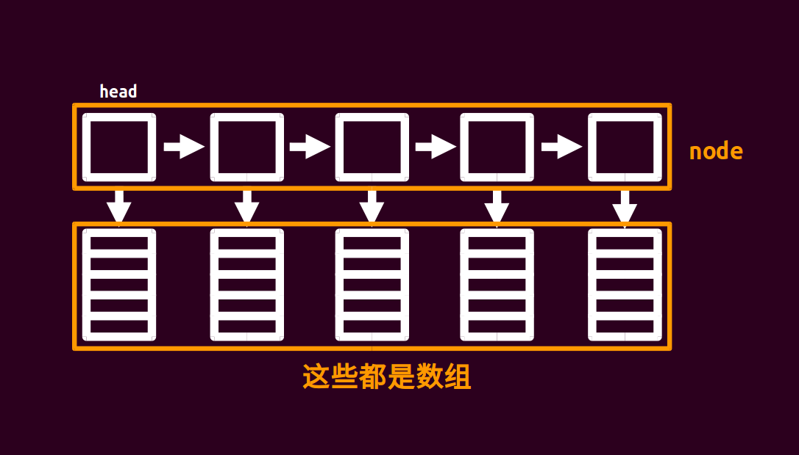

# 块状链表 - OI Wiki

- Source: https://oi-wiki.org/ds/block-list/

# 块状链表



块状链表大概就长这样……

不难发现块状链表就是一个链表，每个节点指向一个数组． 我们把原来长度为 n 的数组分为 √𝑛n 个节点，每个节点对应的数组大小为 √𝑛n． 所以我们这么定义结构体，代码见下． 其中 `sqn` 表示 `sqrt(n)` 即 √𝑛n，`pb` 表示 `push_back`，即在这个 `node` 中加入一个元素．

实现

```text 1 2 3 4 5 6 7 8 9 ``` |  ```text struct node { node * nxt ; int size ; char d [( sqn << 1 ) \+ 5 ]; node () { size = 0 , nxt = NULL , memset ( d , 0 , sizeof ( d )); } void pb ( char c ) { d [ size ++ ] = c ; } }; ```   
---|---  
  
块状链表应该至少支持：分裂、插入、查找． 什么是分裂？分裂就是分裂一个 `node`，变成两个小的 `node`，以保证每个 `node` 的大小都接近 √𝑛n（否则可能退化成普通数组）．当一个 `node` 的大小超过 2 ×√𝑛2×n 时执行分裂操作．

分裂操作怎么做呢？先新建一个节点，再把被分裂的节点的后 √𝑛n 个值 `copy` 到新节点，然后把被分裂的节点的后 √𝑛n 个值删掉（`size--`），最后把新节点插入到被分裂节点的后面即可．

块状链表的所有操作的复杂度都是 √𝑛n 的．

还有一个要说的． 随着元素的插入（或删除），𝑛n 会变，√𝑛n 也会变．这样块的大小就会变化，我们难道还要每次维护块的大小？

其实不然，把 √𝑛n 设置为一个定值即可．比如题目给的范围是 106106，那么 √𝑛n 就设置为大小为 103103 的常量，不用更改它．

```text 1 ``` |  ```text list < vector < char >> orz_list ; ```   
---|---  
  
## libstdc++ 中的 `rope`

### 导入

libstdc++ 中的 `rope` 也起到块状链表的作用，它采用可持久化平衡树实现，可完成随机访问和插入、删除元素的操作．

由于 `rope` 并不是真正的用块状链表来实现，所以它的时间复杂度并不等同于块状链表，而是相当于可持久化平衡树的复杂度（即 𝑂(log⁡𝑛)O(log⁡n)）．

可以使用如下方法来引入：

```text 1 2 ``` |  ```text #include <ext/rope> using namespace __gnu_cxx ; ```   
---|---  
  
关于双下划线开头的库函数

OI 中，关于能否使用双下划线开头的库函数曾经一直不确定，2021 年 CCF 发布的 [关于 NOI 系列活动中编程语言使用限制的补充说明](https://www.noi.cn/xw/2021-09-01/735729.shtml) 中提到「允许使用以下划线开头的库函数或宏，但具有明确禁止操作的库函数和宏除外」．故 `rope` 目前可以在 OI 中正常使用．

### 基本操作

操作| 作用  
---|---  
`rope<int> a`| 初始化 `rope`（与 `vector` 等容器很相似）  
`a.push_back(x)`| 在 `a` 的末尾添加元素 `x`  
`a.insert(pos, x)`| 在 `a` 的 `pos` 个位置添加元素 `x`  
`a.erase(pos, x)`| 在 `a` 的 `pos` 个位置删除 `x` 个元素  
`a.at(x)` 或 `a[x]`| 访问 `a` 的第 `x` 个元素  
`a.length()` 或 `a.size()`| 获取 `a` 的大小  
  
## 例题

[POJ2887 Big String](http://poj.org/problem?id=2887)

题解： 很简单的模板题．代码如下：

```text 1 2 3 4 5 6 7 8 9 10 11 12 13 14 15 16 17 18 19 20 21 22 23 24 25 26 27 28 29 30 31 32 33 34 35 36 37 38 39 40 41 42 43 44 45 46 47 48 49 50 51 52 53 54 55 56 57 58 59 60 61 62 63 64 65 66 67 68 69 70 71 72 73 74 75 76 77 ``` |  ```text #include <cctype> #include <cstring> #include <iostream> using namespace std ; constexpr int sqn = 1e3 ; struct node { // 定义块状链表 node * nxt ; int size ; char d [( sqn << 1 ) \+ 5 ]; node () { size = 0 , nxt = NULL ; } void pb ( char c ) { d [ size ++ ] = c ; } } * head = NULL ; char inits [( int ) 1e6 \+ 5 ]; int llen , q ; void readch ( char & ch ) { // 读入字符 do cin >> ch ; while ( ! isalpha ( ch )); } void check ( node * p ) { // 判断，记得要分裂 if ( p -> size >= ( sqn << 1 )) { node * q = new node ; for ( int i = sqn ; i < p -> size ; i ++ ) q -> pb ( p -> d [ i ]); p -> size = sqn , q -> nxt = p -> nxt , p -> nxt = q ; } } void insert ( char c , int pos ) { // 元素插入，借助链表来理解 node * p = head ; int tot , cnt ; if ( pos > llen ++ ) { while ( p -> nxt != NULL ) p = p -> nxt ; p -> pb ( c ), check ( p ); return ; } for ( tot = head -> size ; p != NULL && tot < pos ; p = p -> nxt , tot += p -> size ); tot -= p -> size , cnt = pos \- tot \- 1 ; for ( int i = p -> size \- 1 ; i >= cnt ; i \-- ) p -> d [ i \+ 1 ] = p -> d [ i ]; p -> d [ cnt ] = c , p -> size ++ ; check ( p ); } char query ( int pos ) { // 查询 node * p ; int tot ; for ( p = head , tot = head -> size ; p != NULL && tot < pos ; p = p -> nxt , tot += p -> size ); tot -= p -> size ; return p -> d [ pos \- tot \- 1 ]; } int main () { cin . tie ( nullptr ) -> sync_with_stdio ( false ); cin >> inits >> q ; llen = strlen ( inits ); node * p = new node ; head = p ; for ( int i = 0 ; i < llen ; i ++ ) { if ( i % sqn == 0 && i ) p -> nxt = new node , p = p -> nxt ; p -> pb ( inits [ i ]); } char a ; int k ; while ( q \-- ) { readch ( a ); if ( a == 'Q' ) cin >> k , cout << query ( k ) << '\n' ; else readch ( a ), cin >> k , insert ( a , k ); } return 0 ; } ```   
---|---  
  
* * *

> __本页面最近更新： 2026/1/27 11:38:23，[更新历史](https://github.com/OI-wiki/OI-wiki/commits/master/docs/ds/block-list.md)  
>  __发现错误？想一起完善？[在 GitHub 上编辑此页！](https://oi-wiki.org/edit-landing/?ref=/ds/block-list.md "edit.link.title")  
>  __本页面贡献者：[Ir1d](https://github.com/Ir1d), [ChungZH](https://github.com/ChungZH), [HeRaNO](https://github.com/HeRaNO), [konnyakuxzy](https://github.com/konnyakuxzy), [ksyx](https://github.com/ksyx), [Tiphereth-A](https://github.com/Tiphereth-A), [Chrogeek](https://github.com/Chrogeek), [Enter-tainer](https://github.com/Enter-tainer), [iamtwz](https://github.com/iamtwz), [kenlig](https://github.com/kenlig), [littlefrog](https://github.com/littlefrog), [littlefrogfromthenorth](https://github.com/littlefrogfromthenorth), [megakite](https://github.com/megakite), [sgt57](https://github.com/sgt57), [shuzhouliu](https://github.com/shuzhouliu), [StudyingFather](https://github.com/StudyingFather), [Xeonacid](https://github.com/Xeonacid)  
>  __本页面的全部内容在**[CC BY-SA 4.0](https://creativecommons.org/licenses/by-sa/4.0/deed.zh) 和 [SATA](https://github.com/zTrix/sata-license)** 协议之条款下提供，附加条款亦可能应用
