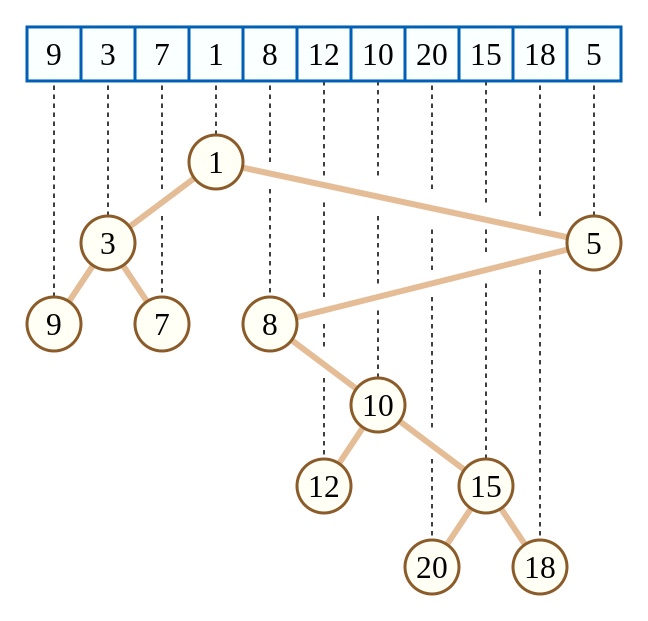
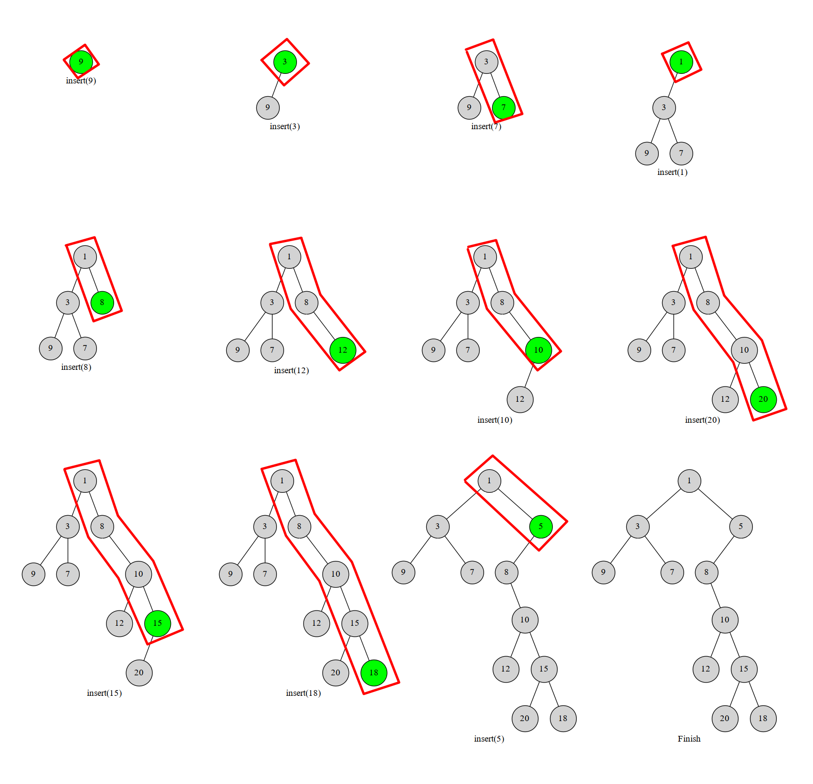

# 笛卡尔树 - OI Wiki

- Source: https://oi-wiki.org/ds/cartesian-tree/

# 笛卡尔树

## 引入

笛卡尔树是一种二叉树，每一个节点由一个键值二元组 (𝑘,𝑤)(k,w) 构成．要求 𝑘k 满足二叉搜索树（BST）的性质，而 𝑤w 满足堆的性质．如果笛卡尔树的 𝑘,𝑤k,w 键值确定，且 𝑘k 互不相同，𝑤w 也互不相同，那么这棵笛卡尔树的结构是唯一的．如下图：



（图源自维基百科）

上面这棵笛卡尔树相当于把数组元素值当作键值 𝑤w，而把数组下标当作键值 𝑘k．可以发现，这棵树的键值 𝑘k 满足 BST 的性质，而键值 𝑤w 满足小根堆的性质．同时根据二叉搜索树的性质，可以发现这种特殊的笛卡尔树满足一棵子树内的下标是一个连续区间．

竞赛中使用笛卡尔树时，常用数组下标作为二元组的键值 𝑘k，数组下标 𝑘k 满足 BST 性质．

下文使用 𝑘,𝑤k,w 时，默认 𝑘k 满足 BST 性质，𝑤w 满足堆的性质．

## 单调栈构建笛卡尔树

### 过程

我们考虑将元素按 𝑘k 升序依次插入到当前的笛卡尔树中．

对于一棵笛卡尔树，定义「右链」为从根节点开始一直走右儿子，走到叶节点形成的链．则插入节点后，这个节点一定在右链上．因为是按照满足 BST 性质的 𝑘k 升序插入，那么这个新插入的节点必然在树的 **最右端** ．这个节点不可能是一个左儿子，也没有右儿子．

于是我们执行这样一个过程，从下往上比较右链节点与当前节点 𝑢u 的 𝑤w，如果找到了一个右链上的节点 𝑥x 满足 𝑤𝑥 <𝑤𝑢wx<wu，就把 𝑢u 接到 𝑥x 的右儿子上，而 𝑥x 原本的右子树就变成 𝑢u 的左子树．

图中红框部分就是我们始终维护的右链：



显然每个数最多进出右链一次（或者说每个点在右链中存在的是一段连续的时间）．这个过程可以用单调栈维护，栈中维护当前笛卡尔树的右链上的节点．一个点不在右链上了就把它弹掉．这样每个点最多进出一次，复杂度 𝑂(𝑛)O(n)．

笛卡尔树与 Treap

实际上，Treap 是笛卡尔树的一种，只不过 Treap 中 𝑤w 的值完全随机．Treap 有线性的构建算法，如果提前将键值 𝑘k 排好序，是可以使用上述单调栈算法完成构建过程的，只不过很少会这么用．

### C++ 实现

```text 1 2 3 4 5 6 7 8 9 ``` |  ```text // stk 维护笛卡尔树中节点对应到序列中的下标 for ( int i = 1 ; i <= n ; i ++ ) { int k = top ; // top 表示操作前的栈顶，k 表示当前栈顶 while ( k > 0 && w [ stk [ k ]] > w [ i ]) k \-- ; // 维护右链上的节点 if ( k ) rs [ stk [ k ]] = i ; // 栈顶元素.右儿子 := 当前元素 if ( k < top ) ls [ i ] = stk [ k \+ 1 ]; // 当前元素.左儿子 := 上一个被弹出的元素 stk [ ++ k ] = i ; // 当前元素入栈 top = k ; } ```   
---|---  
  
## 例题

[HDU 1506. Largest Rectangle in a Histogram](https://acm.hdu.edu.cn/showproblem.php?pid=1506)

𝑛n 个位置，每个位置上的高度是 ℎ𝑖hi，求最大子矩形．如下图：


阴影部分就是图中的最大子矩阵．

解题思路

具体地，我们把下标作为键值 𝑘k，ℎ𝑖hi 作为键值 𝑤w 满足小根堆性质，构建一棵 (𝑖,ℎ𝑖)(i,hi) 的笛卡尔树．

这样我们枚举每个节点 𝑢u，把 𝑤𝑢wu（即节点 𝑢u 的高度 ℎh）作为最大子矩阵的高度．由于我们建立的笛卡尔树满足小根堆性质，因此 𝑢u 的子树内的节点的高度都大于等于 𝑢u．而我们又知道 𝑢u 子树内的下标是一段连续的区间．于是我们只需要知道子树的大小，然后就可以算这个区间的最大子矩阵的面积了．用每一个点计算出来的值更新答案即可．显然这个可以一次 DFS 完成，因此复杂度是 𝑂(𝑛)O(n) 的．

参考实现

```text 1 2 3 4 5 6 7 8 9 10 11 12 13 14 15 16 17 18 19 20 21 22 23 24 25 26 27 28 29 30 31 32 33 34 35 36 37 38 39 40 41 42 43 44 45 46 47 48 49 50 51 52 53 54 55 56 ``` |  ```text #include <algorithm> #include <cstring> #include <iostream> using namespace std ; using ll = long long ; constexpr int N = 100000 \+ 10 , INF = 0x3f3f3f3f ; struct node { int idx , val , par , ch [ 2 ]; friend bool operator < ( node a , node b ) { return a . idx < b . idx ; } void init ( int _idx , int _val , int _par ) { idx = _idx , val = _val , par = _par , ch [ 0 ] = ch [ 1 ] = 0 ; } } tree [ N ]; int root , top , stk [ N ]; ll ans ; int cartesian_build ( int n ) { // 建树，满足小根堆性质 for ( int i = 1 ; i <= n ; i ++ ) { int k = i \- 1 ; while ( tree [ k ]. val > tree [ i ]. val ) k = tree [ k ]. par ; tree [ i ]. ch [ 0 ] = tree [ k ]. ch [ 1 ]; tree [ k ]. ch [ 1 ] = i ; tree [ i ]. par = k ; tree [ tree [ i ]. ch [ 0 ]]. par = i ; } return tree [ 0 ]. ch [ 1 ]; } int dfs ( int x ) { // 一次dfs更新答案就可以了 if ( ! x ) return 0 ; int sz = dfs ( tree [ x ]. ch [ 0 ]); sz += dfs ( tree [ x ]. ch [ 1 ]); ans = max ( ans , ( ll )( sz \+ 1 ) * tree [ x ]. val ); return sz \+ 1 ; } int main () { cin . tie ( nullptr ) -> sync_with_stdio ( false ); int n , hi ; while ( cin >> n , n ) { tree [ 0 ]. init ( 0 , 0 , 0 ); for ( int i = 1 ; i <= n ; i ++ ) { cin >> hi ; tree [ i ]. init ( i , hi , 0 ); } root = cartesian_build ( n ); ans = 0 ; dfs ( root ); cout << ans << '\n' ; } return 0 ; } ```   
---|---  
  
## 参考资料

[笛卡尔树 - 维基百科](https://zh.wikipedia.org/wiki/%E7%AC%9B%E5%8D%A1%E5%B0%94%E6%A0%91)

* * *

>  __本页面最近更新： 2026/1/7 08:56:54，[更新历史](https://github.com/OI-wiki/OI-wiki/commits/master/docs/ds/cartesian-tree.md)  
>  __发现错误？想一起完善？[在 GitHub 上编辑此页！](https://oi-wiki.org/edit-landing/?ref=/ds/cartesian-tree.md "edit.link.title")  
>  __本页面贡献者：[GavinZhengOI](https://github.com/GavinZhengOI), [sshwy](https://github.com/sshwy), [ouuan](mailto:1609483441@qq.com), [ksyx](https://github.com/ksyx), [mgt](mailto:i@margatroid.xyz), [Enter-tainer](https://github.com/Enter-tainer), [Ir1d](https://github.com/Ir1d), [ouuan](https://github.com/ouuan), [StudyingFather](https://github.com/StudyingFather), [AngelKitty](https://github.com/AngelKitty), [HeRaNO](https://github.com/HeRaNO), [iamtwz](https://github.com/iamtwz), [jimmyas](https://github.com/jimmyas), [kenlig](https://github.com/kenlig), [littleyinhee](https://github.com/littleyinhee), [megakite](https://github.com/megakite), [TH911](https://github.com/TH911), [Tiphereth-A](https://github.com/Tiphereth-A), [zhouyuyang2002](https://github.com/zhouyuyang2002)  
>  __本页面的全部内容在**[CC BY-SA 4.0](https://creativecommons.org/licenses/by-sa/4.0/deed.zh) 和 [SATA](https://github.com/zTrix/sata-license)** 协议之条款下提供，附加条款亦可能应用
