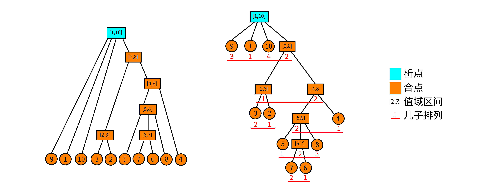
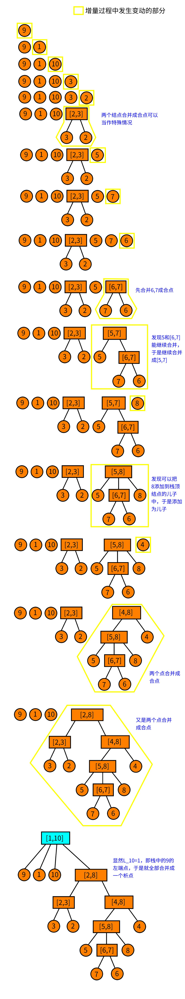

# 析合树 - OI Wiki

- Source: https://oi-wiki.org/ds/divide-combine/

# 析合树

## 关于段的问题

我们由一个小清新的问题引入：

> 对于一个 1 −𝑛1−n 的排列，我们称一个值域连续的区间为段．问一个排列的段的个数．比如，{5,3,4,1,2}{5,3,4,1,2} 的段有：[1,1],[2,2],[3,3],[4,4],[5,5],[2,3],[4,5],[1,3],[2,5],[1,5][1,1],[2,2],[3,3],[4,4],[5,5],[2,3],[4,5],[1,3],[2,5],[1,5]．

看到这个东西，感觉要维护区间的值域集合，复杂度好像挺不友好的．线段树可以查询某个区间是否为段，但不太能统计段的个数．

这里我们引入这个神奇的数据结构——析合树！

## 连续段

在介绍析合树之前，我们先做一些前提条件的限定．鉴于 LCA 的课件中给出的定义不易理解，为方便读者理解，这里给出一些不太严谨（但更容易理解）的定义．

### 排列与连续段

**排列** ：定义一个 𝑛n 阶排列 𝑃P 是一个大小为 𝑛n 的序列，使得 𝑃𝑖Pi 取遍 1,2,⋯,𝑛1,2,⋯,n．说得形式化一点，𝑛n 阶排列 𝑃P 是一个有序集合满足：

  1. |𝑃| =𝑛|P|=n.
  2. ∀𝑖,𝑃𝑖 ∈[1,𝑛]∀i,Pi∈[1,n].
  3. ∄𝑖,𝑗 ∈[1,𝑛],𝑃𝑖 =𝑃𝑗∄i,j∈[1,n],Pi=Pj.

**连续段** ：对于排列 𝑃P，定义连续段 (𝑃,[𝑙,𝑟])(P,[l,r]) 表示一个区间 [𝑙,𝑟][l,r]，要求 𝑃𝑙∼𝑟Pl∼r 值域是连续的．说得更形式化一点，对于排列 𝑃P，连续段表示一个区间 [𝑙,𝑟][l,r] 满足：

(∄ 𝑥,𝑧∈[𝑙,𝑟],𝑦∉[𝑙,𝑟], 𝑃𝑥<𝑃𝑦<𝑃𝑧)(∄ x,z∈[l,r],y∉[l,r], Px<Py<Pz)

特别地，当 𝑙 >𝑟l>r 时，我们认为这是一个空的连续段，记作 (𝑃,∅)(P,∅)．

我们称排列 𝑃P 的所有连续段的集合为 𝐼𝑃IP，并且我们认为 (𝑃,∅) ∈𝐼𝑃(P,∅)∈IP．

### 连续段的运算

连续段是依赖区间和值域定义的，于是我们可以定义连续段的交并差的运算．

定义 𝐴 =(𝑃,[𝑎,𝑏]),𝐵 =(𝑃,[𝑥,𝑦])A=(P,[a,b]),B=(P,[x,y])，且 𝐴,𝐵 ∈𝐼𝑃A,B∈IP．于是连续段的关系和运算可以表示为：

  1. 𝐴 ⊆𝐵 ⟺ 𝑥 ≤𝑎 ∧𝑏 ≤𝑦A⊆B⟺x≤a∧b≤y.
  2. 𝐴 =𝐵 ⟺ 𝑎 =𝑥 ∧𝑏 =𝑦A=B⟺a=x∧b=y.
  3. 𝐴 ∩𝐵 =(𝑃,[max(𝑎,𝑥),min(𝑏,𝑦)])A∩B=(P,[max(a,x),min(b,y)]).
  4. 𝐴 ∪𝐵 =(𝑃,[min(𝑎,𝑥),max(𝑏,𝑦)])A∪B=(P,[min(a,x),max(b,y)]).
  5. 𝐴 ∖𝐵 =(𝑃,{𝑖|𝑖 ∈[𝑎,𝑏] ∧𝑖 ∉[𝑥,𝑦]})A∖B=(P,{i|i∈[a,b]∧i∉[x,y]}).

其实这些运算就是普通的集合交并差放在区间上而已．

### 连续段的性质

连续段的一些显而易见的性质．我们定义 𝐴,𝐵 ∈𝐼𝑃,𝐴 ∩𝐵 ≠∅,𝐴 ∉𝐵,𝐵 ∉𝐴A,B∈IP,A∩B≠∅,A∉B,B∉A，那么有 𝐴 ∪𝐵,𝐴 ∩𝐵,𝐴 ∖𝐵,𝐵 ∖𝐴 ∈𝐼𝑃A∪B,A∩B,A∖B,B∖A∈IP．

证明？证明的本质就是集合的交并差的运算．

## 析合树

好的，现在讲到重点了．你可能已经猜到了，析合树正是由连续段组成的一棵树．但是要知道一个排列可能有多达 𝑂(𝑛2)O(n2) 个连续段，因此我们就要抽出其中更基本的连续段组成析合树．

### 本原段

其实这个定义全称叫作 **本原连续段** ．但笔者认为本原段更为简洁．

对于排列 𝑃P，我们认为一个本原段 𝑀M 表示在集合 𝐼𝑃IP 中，不存在与之相交且不包含的连续段．形式化地定义，我们认为 𝑋 ∈𝐼𝑃X∈IP 且满足 ∀𝐴 ∈𝐼𝑃, 𝑋 ∩𝐴 =(𝑃,∅) ∨𝑋 ⊆𝐴 ∨𝐴 ⊆𝑋∀A∈IP, X∩A=(P,∅)∨X⊆A∨A⊆X．

所有本原段的集合为 𝑀𝑃MP. 显而易见，(𝑃,∅) ∈𝑀𝑃(P,∅)∈MP．

显然，本原段之间只有相离或者包含关系．并且你发现 **一个连续段可以由几个互不相交的本原段构成** ．最大的本原段就是整个排列本身，它包含了其他所有本原段，因此我们认为本原段可以构成一个树形结构，我们称这个结构为 **析合树** ．更严格地说，排列 𝑃P 的析合树由排列 𝑃P 的 **所有本原段** 组成．

前面干讲这么多的定义，不来点图怎么行．考虑排列 𝑃 ={9,1,10,3,2,5,7,6,8,4}P={9,1,10,3,2,5,7,6,8,4}. 它的本原段构成的析合树如下：



在图中我们没有标明本原段．而图中 **每个结点都代表一个本原段** ．我们只标明了每个本原段的值域．举个例子，结点 [5,8][5,8] 代表的本原段就是 (𝑃,[6,9]) ={5,7,6,8}(P,[6,9])={5,7,6,8}．于是这里就有一个问题：**什么是析点合点？**

### 析点与合点

这里我们直接给出定义，稍候再来讨论它的正确性．

  1. **值域区间** ：对于一个结点 𝑢u，用 [𝑢𝑙,𝑢𝑟][ul,ur] 表示该结点的值域区间．
  2. **儿子序列** ：对于析合树上的一个结点 𝑢u，假设它的儿子结点是一个 **有序** 序列，该序列是以值域区间为元素的（单个的数 𝑥x 可以理解为 [𝑥,𝑥][x,x] 的区间）．我们把这个序列称为儿子序列．记作 𝑆𝑢Su．
  3. **儿子排列** ：对于一个儿子序列 𝑆𝑢Su，把它的元素离散化成正整数后形成的排列称为儿子排列．举个例子，对于结点 [5,8][5,8]，它的儿子序列为 {[5,5],[6,7],[8,8]}{[5,5],[6,7],[8,8]}，那么把区间排序标个号，则它的儿子排列就为 {1,2,3}{1,2,3}；类似的，结点 [4,8][4,8] 的儿子排列为 {2,1}{2,1}．结点 𝑢u 的儿子排列记为 𝑃𝑢Pu．
  4. **合点** ：我们认为，儿子排列为顺序或者逆序的点为合点．形式化地说，满足 𝑃𝑢 ={1,2,⋯,|𝑆𝑢|}Pu={1,2,⋯,|Su|} 或者 𝑃𝑢 ={|𝑆𝑢|,|𝑆𝑢 −1|,⋯,1}Pu={|Su|,|Su−1|,⋯,1} 的点称为合点．**叶子结点没有儿子排列，我们也认为它是合点** ．
  5. **析点** ：不是合点的就是析点．

从图中可以看到，只有 [1,10][1,10] 不是合点．因为 [1,10][1,10] 的儿子排列是 {3,1,4,2}{3,1,4,2}．

### 析点与合点的性质

析点与合点的命名来源于他们的性质．首先我们有一个非常显然的性质：对于析合树中任何的结点 𝑢u，其儿子序列区间的并集就是结点 𝑢u 的值域区间．即 ⋃|𝑆𝑢|𝑖=1𝑆𝑢[𝑖] =[𝑢𝑙,𝑢𝑟]⋃i=1|Su|Su[i]=[ul,ur]．

对于一个合点 𝑢u：其儿子序列的任意 **子区间** 都构成一个 **连续段** ．形式化地说，∀𝑆𝑢[𝑙 ∼𝑟]∀Su[l∼r]，有 ⋃𝑟𝑖=𝑙𝑆𝑢[𝑖] ∈𝐼𝑃⋃i=lrSu[i]∈IP．

对于一个析点 𝑢u：其儿子序列的任意 **长度大于 1（这里的长度是指儿子序列中的元素数，不是下标区间的长度）** 的子区间都 **不** 构成一个 **连续段** ．形式化地说，∀𝑆𝑢[𝑙 ∼𝑟],𝑙 <𝑟∀Su[l∼r],l<r，有 ⋃𝑟𝑖=𝑙𝑆𝑢[𝑖] ∉𝐼𝑃⋃i=lrSu[i]∉IP．

合点的性质不难证明．因为合点的儿子排列要么是顺序，要么是倒序，而值域区间也是首位相接，因此只要是连续的一段子序列（区间）都是一个连续段．

对于析点的性质可能很多读者就不太能理解了：为什么 **任意** 长度大于 11 的子区间都不构成连续段？

使用反证法．假设对于一个点 𝑢u，它的儿子序列中有一个 **最长的** 区间 𝑆𝑢[𝑙 ∼𝑟]Su[l∼r] 构成了连续段．那么这个 𝐴 =⋃𝑟𝑖=𝑙𝑆𝑢[𝑖] ∈𝐼𝑃A=⋃i=lrSu[i]∈IP，也就意味着 𝐴A 是一个本原段！（因为 𝐴A 是儿子序列中最长的，因此找不到一个与它相交又不包含的连续段）于是你就没有使用所有的本原段构成这个析合树．矛盾．

### 析合树的构造

对于具体构造析合树，LCA 提供了一种线性构造算法1，下面给出一种比较好懂的 𝑂(𝑛log⁡𝑛)O(nlog⁡n) 算法．

#### 增量法

我们考虑增量法．用一个栈维护前 𝑖 −1i−1 个元素构成的析合森林．在这里需要 **着重强调** ，析合森林的意思是，在任何时侯，栈中结点要么是析点要么是合点．现在考虑当前结点 𝑃𝑖Pi．

  1. 我们先判断它能否成为栈顶结点的儿子，如果能就变成栈顶的儿子，然后把栈顶取出，作为当前结点．重复上述过程直到栈空或者不能成为栈顶结点的儿子．
  2. 如果不能成为栈顶的儿子，就看能不能把栈顶的若干个连续的结点都合并成一个结点（判断能否合并的方法在后面），把合并后的点，作为当前结点．
  3. 重复上述过程直到不能进行为止．然后结束此次增量，直接把当前结点压栈．

接下来我们仔细解释一下．

#### 具体的策略

我们认为，如果当前点能够成为栈顶结点的儿子，那么栈顶结点是一个合点．如果是析点，那么你合并后这个析点就存在一个子连续段，不满足析点的性质．因此一定是合点．

如果无法成为栈顶结点的儿子，那么我们就看栈顶连续的若干个点能否与当前点一起合并．设 𝑙l 为当前点所在区间的左端点．我们计算 𝐿𝑖Li 表示右端点下标为 𝑖i 的连续段中，左端点 <𝑙<l 的最大值．当前结点为 𝑃𝑖Pi，栈顶结点记为 𝑡t．

  1. 如果 𝐿𝑖Li 不存在，那么显然当前结点无法合并；
  2. 如果 𝑡𝑙 =𝐿𝑖tl=Li，那么这就是两个结点合并，合并后就是一个 **合点** ；
  3. 否则在栈中一定存在一个点 𝑡′t′ 的左端点 𝑡′𝑙 =𝐿𝑖t′l=Li，那么一定可以从当前结点合并到 𝑡′t′ 形成一个 **析点** ；

#### 判断能否合并

最后，我们考虑如何处理 𝐿𝑖Li．事实上，一个连续段 (𝑃,[𝑙,𝑟])(P,[l,r]) 等价于区间极差与区间长度 -1 相等．即

max𝑙≤𝑖≤𝑟𝑃𝑖−min𝑙≤𝑖≤𝑟𝑃𝑖=𝑟−𝑙maxl≤i≤rPi−minl≤i≤rPi=r−l

而且由于 P 是一个排列，因此对于任意的区间 [𝑙,𝑟][l,r] 都有

max𝑙≤𝑖≤𝑟𝑃𝑖−min𝑙≤𝑖≤𝑟𝑃𝑖≥𝑟−𝑙maxl≤i≤rPi−minl≤i≤rPi≥r−l

于是我们就维护 max𝑙≤𝑖≤𝑟𝑃𝑖 −min𝑙≤𝑖≤𝑟𝑃𝑖 −(𝑟 −𝑙)maxl≤i≤rPi−minl≤i≤rPi−(r−l)，那么要找到一个连续段相当于查询一个最小值！

有了上述思路，不难想到这样的算法．对于增量过程中的当前的 𝑖i，我们维护一个数组 𝑄Q 表示区间 [𝑗,𝑖][j,i] 的极差减长度．即

𝑄𝑗=max𝑗≤𝑘≤𝑖𝑃𝑘−min𝑗≤𝑘≤𝑖𝑃𝑘−(𝑖−𝑗), 0<𝑗<𝑖Qj=maxj≤k≤iPk−minj≤k≤iPk−(i−j), 0<j<i

现在我们想知道在 1 ∼𝑖 −11∼i−1 中是否存在一个最小的 𝑗j 使得 𝑄𝑗 =0Qj=0．这等价于求 𝑄1∼𝑖−1Q1∼i−1 的最小值．求得最小的 𝑗j 就是 𝐿𝑖Li．如果没有，那么 𝐿𝑖 =𝑖Li=i．

但是当第 𝑖i 次增量结束时，我们需要快速把 𝑄Q 数组更新到 i+1 的情况．原本的区间从 [𝑗,𝑖][j,i] 变成 [𝑗,𝑖 +1][j,i+1]，如果 𝑃𝑖+1 >maxPi+1>max 或者 𝑃𝑖+1 <minPi+1<min 都会造成 𝑄𝑗Qj 发生变化．如何变化？如果 𝑃𝑖+1 >maxPi+1>max，相当于我们把 𝑄𝑗Qj 先减掉 maxmax 再加上 𝑃𝑖+1Pi+1 就完成了 𝑄𝑗Qj 的更新；𝑃𝑖+1 <minPi+1<min 同理，相当于 𝑄𝑗 =𝑄𝑗 +min −𝑃𝑖+1Qj=Qj+min−Pi+1.

那么如果对于一个区间 [𝑥,𝑦][x,y]，满足 𝑃𝑥∼𝑖,𝑃𝑥+1∼𝑖,𝑃𝑥+2∼𝑖,⋯,𝑃𝑦∼𝑖Px∼i,Px+1∼i,Px+2∼i,⋯,Py∼i 的区间 maxmax 都相同呢？你已经发现了，那么相当于我们在做一个区间加的操作；同理，当 𝑃𝑥∼𝑖,𝑃𝑥+1∼𝑖,⋯,𝑃𝑦∼𝑖Px∼i,Px+1∼i,⋯,Py∼i 的区间 minmin 都想同时也是一个区间加的操作．同时，maxmax 和 minmin 的更新是相互独立的，因此可以各自更新．

因此我们对 𝑄Q 的维护可以这样描述：

  1. 找到最大的 𝑗j 使得 𝑃𝑗 >𝑃𝑖+1Pj>Pi+1，那么显然，𝑃𝑗+1∼𝑖Pj+1∼i 这一段数全部小于 𝑃𝑖+1Pi+1，于是就需要更新 𝑄𝑗+1∼𝑖Qj+1∼i 的最大值．由于 𝑃𝑖,max(𝑃𝑖,𝑃𝑖−1),max(𝑃𝑖,𝑃𝑖−1,𝑃𝑖−2),⋯,max(𝑃𝑖,𝑃𝑖−1,⋯,𝑃𝑗+1)Pi,max(Pi,Pi−1),max(Pi,Pi−1,Pi−2),⋯,max(Pi,Pi−1,⋯,Pj+1) 是（非严格）单调递增的，因此可以每一段相同的 maxmax 做相同的更新，即区间加操作．
  2. 更新 minmin 同理．
  3. 把每一个 𝑄𝑗Qj 都减 11．因为区间长度加 11．
  4. 查询 𝐿𝑖Li：即查询 𝑄Q 的最小值的所在的 **下标** ．

没错，我们可以使用线段树维护 𝑄Q！现在还有一个问题：怎么找到相同的一段使得他们的 max/minmax/min 都相同？使用单调栈维护！维护两个单调栈分别表示 max/minmax/min．那么显然，栈中以相邻两个元素为端点的区间的 max/minmax/min 是相同的，于是在维护单调栈的时侯顺便更新线段树即可．

具体的维护方法见代码．

讲这么多干巴巴的想必小伙伴也听得云里雾里的，那么我们就先上图吧．长图警告！



### 实现

最后放一个实现的代码供参考．代码转自 [大米饼的博客](https://www.cnblogs.com/Paul-Guderian/p/11020708.html)，添加了一些注释．

```text 1 2 3 4 5 6 7 8 9 10 11 12 13 14 15 16 17 18 19 20 21 22 23 24 25 26 27 28 29 30 31 32 33 34 35 36 37 38 39 40 41 42 43 44 45 46 47 48 49 50 51 52 53 54 55 56 57 58 59 60 61 62 63 64 65 66 67 68 69 70 71 72 73 74 75 76 77 78 79 80 81 82 83 84 85 86 87 88 89 90 91 92 93 94 95 96 97 98 99 100 101 102 103 104 105 106 107 108 109 110 111 112 113 114 115 116 117 118 119 120 121 122 123 124 125 126 127 128 129 130 131 132 133 134 135 136 137 138 139 140 141 142 143 144 145 146 147 148 149 150 151 152 153 154 155 156 157 158 159 160 161 162 163 164 165 166 167 168 169 170 171 172 173 174 175 176 177 178 179 180 181 182 183 184 185 186 187 188 189 190 191 192 193 194 195 196 197 198 199 200 201 202 203 204 205 206 207 208 209 210 211 212 ``` |  ```text #include <algorithm> #include <cstdio> using namespace std ; constexpr int N = 200010 ; int n , m , a [ N ], st1 [ N ], st2 [ N ], tp1 , tp2 , rt ; int L [ N ], R [ N ], M [ N ], id [ N ], cnt , typ [ N ], bin [ 20 ], st [ N ], tp ; // 本篇代码原题应为 CERC2017 Intrinsic Interval // a 数组即为原题中对应的排列 // st1 和 st2 分别两个单调栈，tp1、tp2 为对应的栈顶，rt 为析合树的根 // L、R 数组表示该析合树节点的左右端点，M 数组的作用在析合树构造时有提到 // id 存储的是排列中某一位置对应的节点编号，typ 用于标记析点还是合点 // st 为存储析合树节点编号的栈，tp为其栈顶 struct RMQ { // 预处理 RMQ（Max & Min） int lg [ N ], mn [ N ][ 17 ], mx [ N ][ 17 ]; void chkmn ( int & x , int y ) { if ( x > y ) x = y ; } void chkmx ( int & x , int y ) { if ( x < y ) x = y ; } void build () { for ( int i = bin [ 0 ] = 1 ; i < 20 ; ++ i ) bin [ i ] = bin [ i \- 1 ] << 1 ; for ( int i = 2 ; i <= n ; ++ i ) lg [ i ] = lg [ i >> 1 ] \+ 1 ; for ( int i = 1 ; i <= n ; ++ i ) mn [ i ][ 0 ] = mx [ i ][ 0 ] = a [ i ]; for ( int i = 1 ; i < 17 ; ++ i ) for ( int j = 1 ; j \+ bin [ i ] \- 1 <= n ; ++ j ) mn [ j ][ i ] = min ( mn [ j ][ i \- 1 ], mn [ j \+ bin [ i \- 1 ]][ i \- 1 ]), mx [ j ][ i ] = max ( mx [ j ][ i \- 1 ], mx [ j \+ bin [ i \- 1 ]][ i \- 1 ]); } int ask_mn ( int l , int r ) { int t = lg [ r \- l \+ 1 ]; return min ( mn [ l ][ t ], mn [ r \- bin [ t ] \+ 1 ][ t ]); } int ask_mx ( int l , int r ) { int t = lg [ r \- l \+ 1 ]; return max ( mx [ l ][ t ], mx [ r \- bin [ t ] \+ 1 ][ t ]); } } D ; // 维护 L_i struct SEG { // 线段树 #define ls (k << 1) #define rs (k << 1 | 1) int mn [ N << 1 ], ly [ N << 1 ]; // 区间加；区间最小值 void pushup ( int k ) { mn [ k ] = min ( mn [ ls ], mn [ rs ]); } void mfy ( int k , int v ) { mn [ k ] += v , ly [ k ] += v ; } void pushdown ( int k ) { if ( ly [ k ]) mfy ( ls , ly [ k ]), mfy ( rs , ly [ k ]), ly [ k ] = 0 ; } void update ( int k , int l , int r , int x , int y , int v ) { if ( l == x && r == y ) { mfy ( k , v ); return ; } pushdown ( k ); int mid = ( l \+ r ) >> 1 ; if ( y <= mid ) update ( ls , l , mid , x , y , v ); else if ( x > mid ) update ( rs , mid \+ 1 , r , x , y , v ); else update ( ls , l , mid , x , mid , v ), update ( rs , mid \+ 1 , r , mid \+ 1 , y , v ); pushup ( k ); } int query ( int k , int l , int r ) { // 询问 0 的位置 if ( l == r ) return l ; pushdown ( k ); int mid = ( l \+ r ) >> 1 ; if ( ! mn [ ls ]) return query ( ls , l , mid ); else return query ( rs , mid \+ 1 , r ); // 如果不存在 0 的位置就会自动返回当前你查询的位置 } } T ; int o = 1 , hd [ N ], dep [ N ], fa [ N ][ 18 ]; struct Edge { int v , nt ; } E [ N << 1 ]; void add ( int u , int v ) { // 树结构加边 E [ o ] = Edge { v , hd [ u ]}; hd [ u ] = o ++ ; } void dfs ( int u ) { for ( int i = 1 ; bin [ i ] <= dep [ u ]; ++ i ) fa [ u ][ i ] = fa [ fa [ u ][ i \- 1 ]][ i \- 1 ]; for ( int i = hd [ u ]; i ; i = E [ i ]. nt ) { int v = E [ i ]. v ; dep [ v ] = dep [ u ] \+ 1 ; fa [ v ][ 0 ] = u ; dfs ( v ); } } int go ( int u , int d ) { for ( int i = 0 ; i < 18 && d ; ++ i ) if ( bin [ i ] & d ) d ^= bin [ i ], u = fa [ u ][ i ]; return u ; } int lca ( int u , int v ) { if ( dep [ u ] < dep [ v ]) swap ( u , v ); u = go ( u , dep [ u ] \- dep [ v ]); if ( u == v ) return u ; for ( int i = 17 ; ~ i ; \-- i ) if ( fa [ u ][ i ] != fa [ v ][ i ]) u = fa [ u ][ i ], v = fa [ v ][ i ]; return fa [ u ][ 0 ]; } // 判断当前区间是否为连续段 bool judge ( int l , int r ) { return D . ask_mx ( l , r ) \- D . ask_mn ( l , r ) == r \- l ; } // 建树 void build () { for ( int i = 1 ; i <= n ; ++ i ) { // 单调栈 // 在区间 [st1[tp1-1]+1,st1[tp1]] 的最小值就是 a[st1[tp1]] // 现在把它出栈，意味着要把多减掉的 Min 加回来． // 线段树的叶结点位置 j 维护的是从 j 到当前的 i 的 // Max{j,i}-Min{j,i}-(i-j) // 区间加只是一个 Tag． // 维护单调栈的目的是辅助线段树从 i-1 更新到 i． // 更新到 i 后，只需要查询全局最小值即可知道是否有解 while ( tp1 && a [ i ] <= a [ st1 [ tp1 ]]) // 单调递增的栈，维护 Min T . update ( 1 , 1 , n , st1 [ tp1 \- 1 ] \+ 1 , st1 [ tp1 ], a [ st1 [ tp1 ]]), tp1 \-- ; while ( tp2 && a [ i ] >= a [ st2 [ tp2 ]]) T . update ( 1 , 1 , n , st2 [ tp2 \- 1 ] \+ 1 , st2 [ tp2 ], \- a [ st2 [ tp2 ]]), tp2 \-- ; T . update ( 1 , 1 , n , st1 [ tp1 ] \+ 1 , i , \- a [ i ]); st1 [ ++ tp1 ] = i ; T . update ( 1 , 1 , n , st2 [ tp2 ] \+ 1 , i , a [ i ]); st2 [ ++ tp2 ] = i ; id [ i ] = ++ cnt ; L [ cnt ] = R [ cnt ] = i ; // 这里的 L,R 是指节点所对应区间的左右端点 int le = T . query ( 1 , 1 , n ), now = cnt ; while ( tp && L [ st [ tp ]] >= le ) { if ( typ [ st [ tp ]] && judge ( M [ st [ tp ]], i )) { // 判断是否能成为儿子，如果能就做 R [ st [ tp ]] = i , M [ st [ tp ]] = L [ now ], add ( st [ tp ], now ), now = st [ tp \-- ]; } else if ( judge ( L [ st [ tp ]], i )) { typ [ ++ cnt ] = 1 ; // 合点一定是被这样建出来的 L [ cnt ] = L [ st [ tp ]], R [ cnt ] = i , M [ cnt ] = L [ now ]; // 这里M数组是记录节点最右面的儿子的左端点，用于上方能否成为儿子的判断 add ( cnt , st [ tp \-- ]), add ( cnt , now ); now = cnt ; } else { add ( ++ cnt , now ); // 新建一个结点，把 now 添加为儿子 // 如果从当前结点开始不能构成连续段，就合并． // 直到找到一个结点能构成连续段．而且我们一定能找到这样 // 一个结点． do add ( cnt , st [ tp \-- ]); while ( tp && ! judge ( L [ st [ tp ]], i )); L [ cnt ] = L [ st [ tp ]], R [ cnt ] = i , add ( cnt , st [ tp \-- ]); now = cnt ; } } st [ ++ tp ] = now ; // 增量结束，把当前点压栈 T . update ( 1 , 1 , n , 1 , i , -1 ); // 因为区间右端点向后移动一格，因此整体 -1 } rt = st [ 1 ]; // 栈中最后剩下的点是根结点 } // 分 lca 为析或和，这里把叶子看成析的 void query ( int l , int r ) { int x = id [ l ], y = id [ r ]; int z = lca ( x , y ); if ( typ [ z ] & 1 ) l = L [ go ( x , dep [ x ] \- dep [ z ] \- 1 )], r = R [ go ( y , dep [ y ] \- dep [ z ] \- 1 )]; // 合点这里特判的原因是因为这个合点不一定是最小的包含l，r的连续段. // 因为合点所代表的区间的子区间也都是连续段，而我们只需要其中的一段就够了． else l = L [ z ], r = R [ z ]; printf ( "%d %d \n " , l , r ); } int main () { scanf ( "%d" , & n ); for ( int i = 1 ; i <= n ; ++ i ) scanf ( "%d" , & a [ i ]); D . build (); build (); dfs ( rt ); scanf ( "%d" , & m ); for ( int i = 1 ; i <= m ; ++ i ) { int x , y ; scanf ( "%d%d" , & x , & y ); query ( x , y ); } return 0 ; } // 20190612 // 析合树 ```   
---|---  
  
## 参考文献与链接

[大米饼的博客 -【学习笔记】析合树](https://www.cnblogs.com/Paul-Guderian/p/11020708.html)

* * *

  1. 刘承奥．简单的连续段数据结构．WC2019 营员交流． ↩

* * *

>  __本页面最近更新： 2026/2/26 03:56:39，[更新历史](https://github.com/OI-wiki/OI-wiki/commits/master/docs/ds/divide-combine.md)  
>  __发现错误？想一起完善？[在 GitHub 上编辑此页！](https://oi-wiki.org/edit-landing/?ref=/ds/divide-combine.md "edit.link.title")  
>  __本页面贡献者：[Ir1d](https://github.com/Ir1d), [StudyingFather](https://github.com/StudyingFather), [H-J-Granger](https://github.com/H-J-Granger), [sshwy](https://github.com/sshwy), [Tiphereth-A](https://github.com/Tiphereth-A), [countercurrent-time](https://github.com/countercurrent-time), [diauweb](https://github.com/diauweb), [Enter-tainer](https://github.com/Enter-tainer), [mgt](mailto:i@margatroid.xyz), [NachtgeistW](https://github.com/NachtgeistW), [Early0v0](https://github.com/Early0v0), [xyjg](https://github.com/xyjg), [AngelKitty](https://github.com/AngelKitty), [CCXXXI](https://github.com/CCXXXI), [cjsoft](https://github.com/cjsoft), [ezoixx130](https://github.com/ezoixx130), [GekkaSaori](https://github.com/GekkaSaori), [Konano](https://github.com/Konano), [ksyx](https://github.com/ksyx), [LovelyBuggies](https://github.com/LovelyBuggies), [Makkiy](https://github.com/Makkiy), [minghu6](https://github.com/minghu6), [P-Y-Y](https://github.com/P-Y-Y), [PotassiumWings](https://github.com/PotassiumWings), [SamZhangQingChuan](https://github.com/SamZhangQingChuan), [Suyun514](mailto:suyun514@qq.com), [weiyong1024](https://github.com/weiyong1024), [Xeonacid](https://github.com/Xeonacid), [abc1763613206](https://github.com/abc1763613206), [alphagocc](https://github.com/alphagocc), [GavinZhengOI](https://github.com/GavinZhengOI), [Gesrua](https://github.com/Gesrua), [kxccc](https://github.com/kxccc), [lychees](https://github.com/lychees), [ouuan](https://github.com/ouuan), [Peanut-Tang](https://github.com/Peanut-Tang), [QAQAutoMaton](https://github.com/QAQAutoMaton), [r-value](https://github.com/r-value), [SukkaW](https://github.com/SukkaW), [swiftqwq](https://github.com/swiftqwq), [zyouxam](https://github.com/zyouxam)  
>  __本页面的全部内容在**[CC BY-SA 4.0](https://creativecommons.org/licenses/by-sa/4.0/deed.zh) 和 [SATA](https://github.com/zTrix/sata-license)** 协议之条款下提供，附加条款亦可能应用
