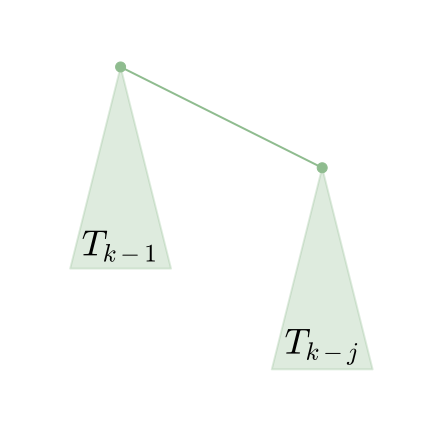

# 并查集复杂度 - OI Wiki

- Source: https://oi-wiki.org/ds/dsu-complexity/

# 并查集复杂度

本部分内容转载并修改自 [时间复杂度 - 势能分析浅谈](https://www.luogu.com.cn/blog/Atalod/shi-jian-fu-za-du-shi-neng-fen-xi-qian-tan)，已取得原作者授权同意．

## 定义

### 阿克曼函数

这里，先给出 𝛼(𝑛)α(n) 的定义．为了给出这个定义，先给出 𝐴𝑘(𝑗)Ak(j) 的定义．

定义 𝐴𝑘(𝑗)Ak(j) 为：

𝐴𝑘(𝑗)={𝑗+1𝑘=0𝐴(𝑗+1)𝑘−1(𝑗)𝑘≥1Ak(j)={j+1k=0Ak−1(j+1)(j)k≥1

即阿克曼函数．

这里，𝑓𝑖(𝑥)fi(x) 表示将 𝑓f 连续应用在 𝑥x 上 𝑖i 次，即 𝑓0(𝑥) =𝑥f0(x)=x，𝑓𝑖(𝑥) =𝑓(𝑓𝑖−1(𝑥))fi(x)=f(fi−1(x))．

再定义 𝛼(𝑛)α(n) 为使得 𝐴𝛼(𝑛)(1) ≥𝑛Aα(n)(1)≥n 的最小整数值．注意，我们之前将它描述为 𝐴𝛼(𝑛)(𝛼(𝑛)) ≥𝑛Aα(n)(α(n))≥n，反正他们的增长速度都很慢，值都不超过 4．

### 基础定义

每个节点都有一个 rank．这里的 rank 不是节点个数，而是深度．节点的初始 rank 为 0，在合并的时候，如果两个节点的 rank 不同，则将 rank 小的节点合并到 rank 大的节点上，并且不更新大节点的 rank 值．否则，随机将某个节点合并到另外一个节点上，将根节点的 rank 值 +1．这里根节点的 rank 给出了该树的高度．记 x 的 rank 为 𝑟𝑛𝑘(𝑥)rnk(x)，类似的，记 x 的父节点为 𝑓𝑎(𝑥)fa(x)．我们总有 𝑟𝑛𝑘(𝑥) +1 ≤𝑟𝑛𝑘(𝑓𝑎(𝑥))rnk(x)+1≤rnk(fa(x))．

为了定义势函数，需要预先定义一个辅助函数 𝑙𝑒𝑣𝑒𝑙(𝑥)level(x)．其中，𝑙𝑒𝑣𝑒𝑙(𝑥) =max(𝑘 :𝑟𝑛𝑘(𝑓𝑎(𝑥)) ≥𝐴𝑘(𝑟𝑛𝑘(𝑥)))level(x)=max(k:rnk(fa(x))≥Ak(rnk(x)))．当 𝑟𝑛𝑘(𝑥) ≥1rnk(x)≥1 的时候，再定义一个辅助函数 𝑖𝑡𝑒𝑟(𝑥) =max(𝑖 :𝑟𝑛𝑘(𝑓𝑎(𝑥)) ≥𝐴𝑖𝑙𝑒𝑣𝑒𝑙(𝑥)(𝑟𝑛𝑘(𝑥))iter(x)=max(i:rnk(fa(x))≥Alevel(x)i(rnk(x))．这些函数定义的 𝑥x 都满足 𝑟𝑛𝑘(𝑥) >0rnk(x)>0 且 𝑥x 不是某个树的根．

上面那些定义可能让你有点头晕．再理一下，对于一个 𝑥x 和 𝑓𝑎(𝑥)fa(x)，如果 𝑟𝑛𝑘(𝑥) >0rnk(x)>0，总是可以找到一对 𝑖,𝑘i,k 令 𝑟𝑛𝑘(𝑓𝑎(𝑥)) ≥𝐴𝑖𝑘(𝑟𝑛𝑘(𝑥))rnk(fa(x))≥Aki(rnk(x))，而 𝑙𝑒𝑣𝑒𝑙(𝑥) =max(𝑘)level(x)=max(k)，在这个前提下，𝑖𝑡𝑒𝑟(𝑥) =max(𝑖)iter(x)=max(i)．𝑙𝑒𝑣𝑒𝑙level 描述了 𝐴A 的最大迭代级数，而 𝑖𝑡𝑒𝑟iter 描述了在最大迭代级数时的最大迭代次数．

对于这两个函数，𝑙𝑒𝑣𝑒𝑙(𝑥)level(x) 总是随着操作的进行而增加或不变，如果 𝑙𝑒𝑣𝑒𝑙(𝑥)level(x) 不增加，𝑖𝑡𝑒𝑟(𝑥)iter(x) 也只会增加或不变．并且，它们总是满足以下两个不等式：

0≤𝑙𝑒𝑣𝑒𝑙(𝑥)<𝛼(𝑛)0≤level(x)<α(n)1≤𝑖𝑡𝑒𝑟(𝑥)≤𝑟𝑛𝑘(𝑥)1≤iter(x)≤rnk(x)

考虑 𝑙𝑒𝑣𝑒𝑙(𝑥)level(x)、𝑖𝑡𝑒𝑟(𝑥)iter(x) 和 𝐴𝑗𝑘Akj 的定义，这些很容易被证明出来，就留给读者用于熟悉定义了．

定义势能函数 Φ(𝑆) =∑𝑥∈𝑆Φ(𝑥)Φ(S)=∑x∈SΦ(x)，其中 𝑆S 表示一整个并查集，而 𝑥x 为并查集中的一个节点．定义 Φ(𝑥)Φ(x) 为：

Φ(𝑥)={𝛼(𝑛)×rnk(𝑥)rnk(𝑥)=0 或 𝑥 为某棵树的根节点(𝛼(𝑛)−level(𝑥))×rnk(𝑥)−𝑖𝑡𝑒𝑟(𝑥)otherwiseΦ(x)={α(n)×rnk(x)rnk(x)=0 或 x 为某棵树的根节点(α(n)−level(x))×rnk(x)−iter(x)otherwise

然后就是通过操作引起的势能变化来证明摊还时间复杂度为 Θ(𝛼(𝑛))Θ(α(n)) 啦．注意，这里我们讨论的 𝑢𝑛𝑖𝑜𝑛(𝑥,𝑦)union(x,y) 操作保证了 𝑥x 和 𝑦y 都是某个树的根，因此不需要额外执行 𝑓𝑖𝑛𝑑(𝑥)find(x) 和 𝑓𝑖𝑛𝑑(𝑦)find(y)．

可以发现，势能总是个非负数．另，在开始的时候，并查集的势能为 00．

## 证明

### union(x,y) 操作

其花费的时间为 Θ(1)Θ(1)，因此我们考虑其引起的势能的变化．

这里，我们假设 𝑟𝑛𝑘(𝑥) ≤𝑟𝑛𝑘(𝑦)rnk(x)≤rnk(y)，即 𝑥x 被接到 𝑦y 上．这样，势能增加的节点仅有 𝑥x（从树根变成非树根），𝑦y（秩可能增加）和操作前 𝑦y 的子节点（父节点的秩可能增加）．我们先证明操作前 𝑦y 的子节点 𝑐c 的势能不可能增加，并且如果减少了，至少减少 11．

设操作前 𝑐c 的势能为 Φ(𝑐)Φ(c)，操作后为 Φ(𝑐′)Φ(c′)，这里 𝑐c 可以是任意一个 𝑟𝑛𝑘(𝑐) >0rnk(c)>0 的非根节点，操作可以是任意操作，包括下面的 find 操作．我们分三种情况讨论．

  1. 𝑖𝑡𝑒𝑟(𝑐)iter(c) 和 𝑙𝑒𝑣𝑒𝑙(𝑐)level(c) 并未增加．显然有 Φ(𝑐) =Φ(𝑐′)Φ(c)=Φ(c′)．
  2. 𝑖𝑡𝑒𝑟(𝑐)iter(c) 增加了，𝑙𝑒𝑣𝑒𝑙(𝑐)level(c) 并未增加．这里 𝑖𝑡𝑒𝑟(𝑐)iter(c) 至少增加一，即 Φ(𝑐′) ≤Φ(𝑐) −1Φ(c′)≤Φ(c)−1，势能函数减少了，并且至少减少 1．
  3. 𝑙𝑒𝑣𝑒𝑙(𝑐)level(c) 增加了，𝑖𝑡𝑒𝑟(𝑐)iter(c) 可能减少．但是由于 0 <𝑖𝑡𝑒𝑟(𝑐) ≤𝑟𝑛𝑘(𝑐)0<iter(c)≤rnk(c)，𝑖𝑡𝑒𝑟(𝑐)iter(c) 最多减少 𝑟𝑛𝑘(𝑐) −1rnk(c)−1，而 𝑙𝑒𝑣𝑒𝑙(𝑐)level(c) 至少增加 11．由定义 Φ(𝑐) =(𝛼(𝑛) −𝑙𝑒𝑣𝑒𝑙(𝑐)) ×𝑟𝑛𝑘(𝑐) −𝑖𝑡𝑒𝑟(𝑐)Φ(c)=(α(n)−level(c))×rnk(c)−iter(c)，可得 Φ(𝑐′) ≤Φ(𝑐) −1Φ(c′)≤Φ(c)−1．
  4. 其他情况．由于 𝑟𝑛𝑘(𝑐)rnk(c) 不变，𝑟𝑛𝑘(𝑓𝑎(𝑐))rnk(fa(c)) 不减，所以不存在．

所以，势能增加的节点仅可能是 𝑥x 或 𝑦y．而 𝑥x 从树根变成了非树根，如果 𝑟𝑛𝑘(𝑥) =0rnk(x)=0，则一直有 Φ(𝑥) =Φ(𝑥′) =0Φ(x)=Φ(x′)=0．否则，一定有 𝛼(𝑥) ×𝑟𝑛𝑘(𝑥) ≥(𝛼(𝑛) −𝑙𝑒𝑣𝑒𝑙(𝑥)) ×𝑟𝑛𝑘(𝑥) −𝑖𝑡𝑒𝑟(𝑥)α(x)×rnk(x)≥(α(n)−level(x))×rnk(x)−iter(x)．即，Φ(𝑥′) ≤Φ(𝑥)Φ(x′)≤Φ(x)．

因此，唯一势能可能增加的点就是 𝑦y．而 𝑦y 的势能最多增加 𝛼(𝑛)α(n)．因此，可得 𝑢𝑛𝑖𝑜𝑛union 操作均摊后的时间复杂度为 Θ(𝛼(𝑛))Θ(α(n))．

### find(a) 操作

如果查找路径包含 Θ(𝑠)Θ(s) 个节点，显然其查找的时间复杂度是 Θ(𝑠)Θ(s)．如果由于查找操作，没有节点的势能增加，且至少有 𝑠 −𝛼(𝑛)s−α(n) 个节点的势能至少减少 11，就可以证明 𝑓𝑖𝑛𝑑(𝑎)find(a) 操作的时间复杂度为 Θ(𝛼(𝑛))Θ(α(n))．为了避免混淆，这里用 𝑎a 作为参数，而出现的 𝑥x 都是泛指某一个并查集内的结点．

首先证明没有节点的势能增加．很显然，我们在上面证明过所有非根节点的势能不增，而根节点的 𝑟𝑛𝑘rnk 没有改变，所以没有节点的势能增加．

接下来证明至少有 𝑠 −𝛼(𝑛)s−α(n) 个节点的势能至少减少 11．我们上面证明过了，如果 𝑙𝑒𝑣𝑒𝑙(𝑥)level(x) 或者 𝑖𝑡𝑒𝑟(𝑥)iter(x) 有改变的话，它们的势能至少减少 11．所以，只需要证明至少有 𝑠 −𝛼(𝑛)s−α(n) 个节点的 𝑙𝑒𝑣𝑒𝑙(𝑥)level(x) 或者 𝑖𝑡𝑒𝑟(𝑥)iter(x) 有改变即可．

回忆一下非根节点势能的定义，Φ(𝑥) =(𝛼(𝑛) −𝑙𝑒𝑣𝑒𝑙(𝑥)) ×𝑟𝑛𝑘(𝑥) −𝑖𝑡𝑒𝑟(𝑥)Φ(x)=(α(n)−level(x))×rnk(x)−iter(x)，而 𝑙𝑒𝑣𝑒𝑙(𝑥)level(x) 和 𝑖𝑡𝑒𝑟(𝑥)iter(x) 是使 𝑟𝑛𝑘(𝑓𝑎(𝑥)) ≥𝐴𝑖𝑡𝑒𝑟(𝑥)𝑙𝑒𝑣𝑒𝑙(𝑥)(𝑟𝑛𝑘(𝑥))rnk(fa(x))≥Alevel(x)iter(x)(rnk(x)) 的最大数．

所以，如果 𝑟𝑜𝑜𝑡𝑥rootx 代表 𝑥x 所处的树的根节点，只需要证明 𝑟𝑛𝑘(𝑟𝑜𝑜𝑡𝑥) ≥𝐴𝑖𝑡𝑒𝑟(𝑥)+1𝑙𝑒𝑣𝑒𝑙(𝑥)(𝑟𝑛𝑘(𝑥))rnk(rootx)≥Alevel(x)iter(x)+1(rnk(x)) 就好了．根据 𝐴𝑖𝑘Aki 的定义，𝐴𝑖𝑡𝑒𝑟(𝑥)+1𝑙𝑒𝑣𝑒𝑙(𝑥)(𝑟𝑛𝑘(𝑥)) =𝐴𝑙𝑒𝑣𝑒𝑙(𝑥)(𝐴𝑖𝑡𝑒𝑟(𝑥)𝑙𝑒𝑣𝑒𝑙(𝑥)(𝑟𝑛𝑘(𝑥)))Alevel(x)iter(x)+1(rnk(x))=Alevel(x)(Alevel(x)iter(x)(rnk(x)))．

注意，我们可能会用 𝑘(𝑥)k(x) 代表 𝑙𝑒𝑣𝑒𝑙(𝑥)level(x)，𝑖(𝑥)i(x) 代表 𝑖𝑡𝑒𝑟(𝑥)iter(x) 以避免式子过于冗长．这里，就是 𝑟𝑛𝑘(𝑟𝑜𝑜𝑡𝑥) ≥𝐴𝑘(𝑥)(𝐴𝑖(𝑥)𝑘(𝑥)(𝑥))rnk(rootx)≥Ak(x)(Ak(x)i(x)(x))．

当你看到这的时候，可能会有一种「这啥玩意」的感觉．这意味着你可能需要多看几遍，或者跳过一些内容以后再看．

这里，我们需要一个外接的 𝐴𝑘(𝑥)Ak(x)，意味着我们可能需要再找一个点 𝑦y．令 𝑦y 是搜索路径上在 𝑥x 之后的满足 𝑘(𝑦) =𝑘(𝑥)k(y)=k(x) 的点，这里「搜索路径之后」相当于「是 𝑥x 的祖先」．显然，不是每一个 𝑥x 都有这样一个 𝑦y．很容易证明，没有这样的 𝑦y 的 𝑥x 不超过 𝛼(𝑛) +2α(n)+2 个．因为只有每个 𝑘k 的最后一个 𝑥x 和 𝑎a 以及 𝑟𝑜𝑜𝑡𝑎roota 没有这样的 𝑦y．

我们再强调一遍 𝑓𝑎(𝑥)fa(x) 指的是路径压缩 **之前** 𝑥x 的父节点，路径压缩 **之后** 𝑥x 的父节点一律用 𝑟𝑜𝑜𝑡𝑥rootx 表示．对于每个存在 𝑦y 的 𝑥x，总是有 𝑟𝑛𝑘(𝑦) ≥𝑟𝑛𝑘(𝑓𝑎(𝑥))rnk(y)≥rnk(fa(x))．同时，我们有 𝑟𝑛𝑘(𝑓𝑎(𝑥)) ≥𝐴𝑖(𝑥)𝑘(𝑥)(𝑟𝑛𝑘(𝑥))rnk(fa(x))≥Ak(x)i(x)(rnk(x))．由于 𝑘(𝑥) =𝑘(𝑦)k(x)=k(y)，我们用 𝑘k 来统称，即，𝑟𝑛𝑘(𝑓𝑎(𝑥)) ≥𝐴𝑖(𝑥)𝑘(𝑟𝑛𝑘(𝑥))rnk(fa(x))≥Aki(x)(rnk(x))．我们需要造一个 𝐴𝑘Ak 出来，所以我们可以不关注 𝑖𝑡𝑒𝑟(𝑦)iter(y) 的值，直接使用弱化版的 𝑟𝑛𝑘(𝑓𝑎(𝑦)) ≥𝐴𝑘(𝑟𝑛𝑘(𝑦))rnk(fa(y))≥Ak(rnk(y))．

如果我们将不等式组合起来，神奇的事情就发生了．我们发现，𝑟𝑛𝑘(𝑓𝑎(𝑦)) ≥𝐴𝑖(𝑥)+1𝑘(𝑟𝑛𝑘(𝑥))rnk(fa(y))≥Aki(x)+1(rnk(x))．也就是说，为了从 𝑟𝑛𝑘(𝑥)rnk(x) 迭代到 𝑟𝑛𝑘(𝑓𝑎(𝑦))rnk(fa(y))，至少可以迭代 𝐴𝑘Ak 不少于 𝑖(𝑥) +1i(x)+1 次而不超过 𝑟𝑛𝑘(𝑓𝑎(𝑦))rnk(fa(y))．

显然，有 𝑟𝑛𝑘(𝑟𝑜𝑜𝑡𝑦) ≥𝑟𝑛𝑘(𝑓𝑎(𝑦))rnk(rooty)≥rnk(fa(y))，且 𝑟𝑛𝑘(𝑥)rnk(x) 在路径压缩时不变．因此，我们可以得到 𝑟𝑛𝑘(𝑟𝑜𝑜𝑡𝑥) ≥𝐴𝑖(𝑥)+1𝑘(𝑟𝑛𝑘(𝑥))rnk(rootx)≥Aki(x)+1(rnk(x))，也就是说 𝑖𝑡𝑒𝑟(𝑥)iter(x) 的值至少增加 1，如果 𝑟𝑛𝑘(𝑥)rnk(x) 没有增加，一定是 𝑙𝑒𝑣𝑒𝑙(𝑥)level(x) 增加了．

所以，Φ(𝑥)Φ(x) 至少减少了 1．由于这样的 𝑥x 节点至少有 𝑠 −𝛼(𝑛) −2s−α(n)−2 个，所以最后 Φ(𝑆)Φ(S) 至少减少了 𝑠 −𝛼(𝑛) −2s−α(n)−2，均摊后的时间复杂度即为 Θ(𝛼(𝑛) +2) =Θ(𝛼(𝑛))Θ(α(n)+2)=Θ(α(n))．

## 为何并查集会被卡

这个问题也就是问，如果我们不按秩合并，会有哪些性质被破坏，导致并查集的时间复杂度不能保证为 Θ(𝑚𝛼(𝑛))Θ(mα(n))．

如果我们在合并的时候，𝑟𝑛𝑘rnk 较大的合并到了 𝑟𝑛𝑘rnk 较小的节点上面，我们就将那个 𝑟𝑛𝑘rnk 较小的节点的 𝑟𝑛𝑘rnk 值设为另一个节点的 𝑟𝑛𝑘rnk 值加一．这样，我们就能保证 𝑟𝑛𝑘(𝑓𝑎(𝑥)) ≥𝑟𝑛𝑘(𝑥) +1rnk(fa(x))≥rnk(x)+1，从而不会出现类似于满地 compile error 一样的性质不符合．

显然，如果这样子的话，我们破坏的就是 𝑢𝑛𝑖𝑜𝑛(𝑥,𝑦)union(x,y) 函数「y 的势能最多增加 𝛼(𝑛)α(n)」这一句．

存在一个能使路径压缩并查集时间复杂度降至 Ω(𝑚log1+𝑚𝑛⁡𝑛)Ω(mlog1+mn⁡n) 的结构，定义如下：

二项树（实际上和一般的二项树不太一样），其中 j 是常数，𝑇𝑘Tk 为一个 𝑇𝑘−1Tk−1 加上一个 𝑇𝑘−𝑗Tk−j 作为根节点的儿子．

边界条件，𝑇1T1 到 𝑇𝑗Tj 都是一个单独的点．

令 𝑟𝑛𝑘(𝑇𝑘) =𝑟𝑘rnk(Tk)=rk，这里我们有 𝑟𝑘 =(𝑘 −1)/𝑗rk=(k−1)/j（证明略）．每轮操作，我们将它接到一个单节点上，然后查询底部的 𝑗j 个节点．也就是说，我们接到单节点上的时候，单节点的势能提高了 (𝑘 −1)/𝑗 +1(k−1)/j+1．在 𝑗 =⌊𝑚𝑛⌋j=⌊mn⌋，𝑖 =⌊log𝑗+1⁡𝑛2⌋i=⌊logj+1⁡n2⌋，𝑘 =𝑖𝑗k=ij 的时候，势能增加量为：

𝛼(𝑛)×((𝑖𝑗−1)/𝑗+1)=𝛼(𝑛)×((⌊log⌊𝑚𝑛⌋+1⁡𝑛2⌋×⌊𝑚𝑛⌋−1)/⌊𝑚𝑛⌋+1)α(n)×((ij−1)/j+1)=α(n)×((⌊log⌊mn⌋+1⁡n2⌋×⌊mn⌋−1)/⌊mn⌋+1)

变换一下，去掉所有的取整符号，就可以得出，势能增加量 ≥𝛼(𝑛) ×(log1+𝑚𝑛⁡𝑛 −𝑛𝑚)≥α(n)×(log1+mn⁡n−nm)，m 次操作就是 Ω(𝑚log1+𝑚𝑛⁡𝑛 −𝑛) =Ω(𝑚log1+𝑚𝑛⁡𝑛)Ω(mlog1+mn⁡n−n)=Ω(mlog1+mn⁡n)．

## 关于启发式合并

由于按秩合并比启发式合并难写，所以很多 dalao 会选择使用启发式合并来写并查集．具体来说，则是对每个根都维护一个 𝑠𝑖𝑧𝑒(𝑥)size(x)，每次将 𝑠𝑖𝑧𝑒size 小的合并到大的上面．

所以，启发式合并会不会被卡？

首先，可以从秩参与证明的性质来说明．如果 𝑠𝑖𝑧𝑒size 可以代替 𝑟𝑛𝑘rnk 的地位，则可以使用启发式合并．快速总结一下，秩参与证明的性质有以下三条：

  1. 每次合并，最多有一个节点的秩上升，而且最多上升 1．
  2. 总有 𝑟𝑛𝑘(𝑓𝑎(𝑥)) ≥𝑟𝑛𝑘(𝑥) +1rnk(fa(x))≥rnk(x)+1．
  3. 节点的秩不减．

关于第二条和第三条，𝑠𝑖𝑧siz 显然满足，然而第一条不满足，如果将 𝑥x 合并到 𝑦y 上面，则 𝑠𝑖𝑧(𝑦)siz(y) 会增大 𝑠𝑖𝑧(𝑥)siz(x) 那么多．

所以，可以考虑使用 log2⁡𝑠𝑖𝑧(𝑥)log2⁡siz(x) 代替 𝑟𝑛𝑘(𝑥)rnk(x)．

关于第一条性质，由于节点的 𝑠𝑖𝑧siz 最多翻倍，所以 log2⁡𝑠𝑖𝑧(𝑥)log2⁡siz(x) 最多上升 1．关于第二三条性质，结论较为显然，这里略去证明．

所以说，如果不想写按秩合并，就写启发式合并好了，时间复杂度仍旧是 Θ(𝑚𝛼(𝑛))Θ(mα(n))．

* * *

>  __本页面最近更新： 2026/1/7 08:56:54，[更新历史](https://github.com/OI-wiki/OI-wiki/commits/master/docs/ds/dsu-complexity.md)  
>  __发现错误？想一起完善？[在 GitHub 上编辑此页！](https://oi-wiki.org/edit-landing/?ref=/ds/dsu-complexity.md "edit.link.title")  
>  __本页面贡献者：[orzAtalod](https://github.com/orzAtalod), [Enter-tainer](https://github.com/Enter-tainer), [H-J-Granger](https://github.com/H-J-Granger), [StudyingFather](https://github.com/StudyingFather), [CCXXXI](https://github.com/CCXXXI), [Friendseeker](https://github.com/Friendseeker), [iamtwz](https://github.com/iamtwz), [NachtgeistW](https://github.com/NachtgeistW), [R-fzx](https://github.com/R-fzx), [Tiphereth-A](https://github.com/Tiphereth-A), [Xeonacid](https://github.com/Xeonacid), [yusancky](https://github.com/yusancky)  
>  __本页面的全部内容在**[CC BY-SA 4.0](https://creativecommons.org/licenses/by-sa/4.0/deed.zh) 和 [SATA](https://github.com/zTrix/sata-license)** 协议之条款下提供，附加条款亦可能应用
