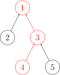
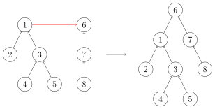

# 并查集 - OI Wiki

- Source: https://oi-wiki.org/ds/dsu/

# 并查集


## 引入

并查集是一种用于管理元素所属集合的数据结构，实现为一个森林，其中每棵树表示一个集合，树中的节点表示对应集合中的元素．

顾名思义，并查集支持两种操作：

  * 合并（Unite）：合并两个元素所属集合（合并对应的树）．
  * 查询（Find）：查询某个元素所属集合（查询对应的树的根节点），这可以用于判断两个元素是否属于同一集合．

并查集在经过修改后可以支持单个元素的删除、移动或维护树上的边权．使用动态开点线段树还可以实现 [可持久化并查集](../persistent-seg/#拓展基于主席树的可持久化并查集)．

Warning

并查集无法以较低复杂度实现集合的分离．

## 初始化

初始时，每个元素都位于一个单独的集合，表示为一棵只有根节点的树．方便起见，我们将根节点的父亲设为自己．

实现

C++Python

```text 1 2 3 4 5 ``` |  ```text struct dsu { vector < size_t > pa ; explicit dsu ( size_t size ) : pa ( size ) { iota ( pa . begin (), pa . end (), 0 ); } }; ```   
---|---  
  
```text 1 2 3 ``` |  ```text class Dsu : def __init__ ( self , size ): self . pa = list ( range ( size )) ```   
---|---  
  
## 查询

我们需要沿着树向上移动，直至找到根节点．



实现

C++Python

```text 1 ``` |  ```text size_t dsu::find ( size_t x ) { return pa [ x ] == x ? x : find ( pa [ x ]); } ```   
---|---  
  
```text 1 2 ``` |  ```text def find ( self , x ): return x if self . pa [ x ] == x else self . find ( self . pa [ x ]) ```   
---|---  
  
### 路径压缩

查询过程中经过的每个元素都属于该集合，我们可以将其直接连到根节点以加快后续查询．


实现

C++Python

```text 1 ``` |  ```text size_t dsu::find ( size_t x ) { return pa [ x ] == x ? x : pa [ x ] = find ( pa [ x ]); } ```   
---|---  
  
```text 1 2 3 4 ``` |  ```text def find ( self , x ): if self . pa [ x ] != x : self . pa [ x ] = self . find ( self . pa [ x ]) return self . pa [ x ] ```   
---|---  
  
## 合并

要合并两棵树，我们只需要将一棵树的根节点连到另一棵树的根节点．



实现

C++Python

```text 1 ``` |  ```text void dsu::unite ( size_t x , size_t y ) { pa [ find ( x )] = find ( y ); } ```   
---|---  
  
```text 1 2 ``` |  ```text def unite ( self , x , y ): self . pa [ self . find ( x )] = self . find ( y ) ```   
---|---  
  
### 启发式合并

合并时，选择哪棵树的根节点作为新树的根节点会影响未来操作的复杂度．我们可以将节点较少或深度较小的树连到另一棵，以免发生退化．

具体复杂度讨论

由于需要我们支持的只有集合的合并、查询操作，当我们需要将两个集合合二为一时，无论将哪一个集合连接到另一个集合的下面，都能得到正确的结果．但不同的连接方法存在时间复杂度的差异．具体来说，如果我们将一棵点数与深度都较小的集合树连接到一棵更大的集合树下，显然相比于另一种连接方案，接下来执行查找操作的用时更小（也会带来更优的最坏时间复杂度）．

当然，我们不总能遇到恰好如上所述的集合——点数与深度都更小．鉴于点数与深度这两个特征都很容易维护，我们常常从中择一，作为估价函数．而无论选择哪一个，时间复杂度都为 𝑂(𝑚𝛼(𝑚,𝑛))O(mα(m,n))，具体的证明可参见 References 中引用的论文．

在算法竞赛的实际代码中，即便不使用启发式合并，代码也往往能够在规定时间内完成任务．在 Tarjan 的论文1中，证明了不使用启发式合并、只使用路径压缩的最坏时间复杂度是 𝑂(𝑚log⁡𝑛)O(mlog⁡n)．在姚期智的论文2中，证明了不使用启发式合并、只使用路径压缩，在平均情况下，时间复杂度依然是 𝑂(𝑚𝛼(𝑚,𝑛))O(mα(m,n))．

如果只使用启发式合并，而不使用路径压缩，时间复杂度为 𝑂(𝑚log⁡𝑛)O(mlog⁡n)．由于路径压缩单次合并可能造成大量修改，有时路径压缩并不适合使用．例如，在可持久化并查集、线段树分治 + 并查集中，一般使用只启发式合并的并查集．

按节点数合并的参考实现：（注意需要调整初始化方法）

实现

C++Python

```text 1 2 3 4 5 6 7 8 9 10 11 12 13 14 15 ``` |  ```text struct dsu { vector < size_t > pa , size ; explicit dsu ( size_t size_ ) : pa ( size_ ), size ( size_ , 1 ) { iota ( pa . begin (), pa . end (), 0 ); } void unite ( size_t x , size_t y ) { x = find ( x ), y = find ( y ); if ( x == y ) return ; if ( size [ x ] < size [ y ]) swap ( x , y ); pa [ y ] = x ; size [ x ] += size [ y ]; } }; ```   
---|---  
  
```text 1 2 3 4 5 6 7 8 9 10 11 12 13 ``` |  ```text class Dsu : def __init__ ( self , size ): self . pa = list ( range ( size )) self . size = [ 1 ] * size def unite ( self , x , y ): x , y = self . find ( x ), self . find ( y ) if x == y : return if self . size [ x ] < self . size [ y ]: x , y = y , x self . pa [ y ] = x self . size [ x ] += self . size [ y ] ```   
---|---  
  
## 参考实现

带有路径压缩、按节点数合并的并查集的完整实现如下所示：

模板题 [Luogu P3367【模板】并查集](https://www.luogu.com.cn/problem/P3367) 参考实现

C++Python

```text 1 2 3 4 5 6 7 8 9 10 11 12 13 14 15 16 17 18 19 20 21 22 23 24 25 26 27 28 29 30 31 32 33 34 35 36 37 38 ``` |  ```text #include <algorithm> #include <iostream> #include <numeric> #include <vector> struct DSU { std :: vector < size_t > pa , size ; explicit DSU ( size_t size_ ) : pa ( size_ ), size ( size_ , 1 ) { std :: iota ( pa . begin (), pa . end (), 0 ); } size_t find ( size_t x ) { return pa [ x ] == x ? x : pa [ x ] = find ( pa [ x ]); } void unite ( size_t x , size_t y ) { x = find ( x ), y = find ( y ); if ( x == y ) return ; if ( size [ x ] < size [ y ]) std :: swap ( x , y ); pa [ y ] = x ; size [ x ] += size [ y ]; } }; int main () { int n , m ; std :: cin >> n >> m ; DSU dsu ( n \+ 1 ); for (; m ; \-- m ) { int z , x , y ; std :: cin >> z >> x >> y ; if ( z == 1 ) { dsu . unite ( x , y ); } else { std :: cout << ( dsu . find ( x ) == dsu . find ( y ) ? 'Y' : 'N' ) << '\n' ; } } return 0 ; } ```   
---|---  
  
```text 1 2 3 4 5 6 7 8 9 10 11 12 13 14 15 16 17 18 19 20 21 22 23 24 25 26 27 28 29 ``` |  ```text class Dsu : def __init__ ( self , size ): self . pa = list ( range ( size )) self . size = [ 1 ] * size def find ( self , x ): if self . pa [ x ] != x : self . pa [ x ] = self . find ( self . pa [ x ]) return self . pa [ x ] def unite ( self , x , y ): x , y = self . find ( x ), self . find ( y ) if x == y : return if self . size [ x ] < self . size [ y ]: x , y = y , x self . pa [ y ] = x self . size [ x ] += self . size [ y ] if __name__ == "__main__" : n , m = map ( int , input () . split ()) dsu = Dsu ( n \+ 1 ) for _ in range ( m ): z , x , y = map ( int , input () . split ()) if z == 1 : dsu . unite ( x , y ) else : print ( "Y" if dsu . find ( x ) == dsu . find ( y ) else "N" ) ```   
---|---  
  
## 复杂度

同时使用路径压缩和启发式合并之后，并查集的每个操作平均时间仅为 𝑂(𝛼(𝑛))O(α(n))．其中，𝛼α 为阿克曼函数的反函数，增长极其缓慢．也就是说，并查集单次操作的平均运行时间可以认为是一个很小的常数．时间复杂度的证明在 [这个页面](../dsu-complexity/) 中．

反 Ackermann 函数

[Ackermann 函数](https://en.wikipedia.org/wiki/Ackermann_function) 𝐴(𝑚,𝑛)A(m,n) 的定义是这样的：

𝐴(𝑚,𝑛) =⎧{ {⎨{ {⎩𝑛+1if 𝑚=0𝐴(𝑚−1,1)if 𝑚>0 and 𝑛=0𝐴(𝑚−1,𝐴(𝑚,𝑛−1))otherwiseA(m,n)={n+1if m=0A(m−1,1)if m>0 and n=0A(m−1,A(m,n−1))otherwise

而反 Ackermann 函数 𝛼(𝑛)α(n) 的定义是 Ackermann 函数的反函数，即为最大的整数 𝑚m 使得 𝐴(𝑚,𝑚) ⩽𝑛A(m,m)⩽n．

并查集的空间复杂度显然为 𝑂(𝑛)O(n)．

## 拓展操作

在普通的并查集的基础上，还可以做一系列修改使之支持更多的操作或维护更复杂的信息．

### 带删除并查集

普通的并查集无法支持删除操作，是因为删除一个节点的时候，不可避免地会将以它为根的子树上所有节点都删除．为了解决这一问题，在带删除操作的并查集中，可以通过建立虚点的方法保证所有实际存储数据的节点总是叶子节点．为此，需要在初始化时，就为每个数据节点都建立一个虚点，并将数据节点的父节点设置为该虚点．由于每次合并两个集合时，都只会将两个集合的树根连接，所以，从始至终只有虚点会有子节点．这就保证了删除一个节点时，不会误删其他节点．

注意，删除单个节点后，需要重新为该节点建立一个虚点作为其父节点；否则，无法正确执行后续的合并和删除操作．

模板题 [SPOJ JMFILTER - Junk-Mail Filter](https://www.spoj.com/problems/JMFILTER/) 参考实现

C++Python

```text 1 2 3 4 5 6 7 8 9 10 11 12 13 14 15 16 17 18 19 20 21 22 23 24 25 26 27 28 29 30 31 32 33 34 35 36 37 38 39 40 41 42 43 44 45 46 47 48 49 50 51 52 53 54 55 56 57 58 59 60 61 ``` |  ```text #include <algorithm> #include <iostream> #include <numeric> #include <vector> struct DSU { size_t id ; std :: vector < size_t > pa , size ; explicit DSU ( size_t size_ , size_t m ) : id ( size_ * 2 ), pa ( size_ * 2 \+ m ), size ( size_ * 2 \+ m , 1 ) { // size 的前半段其实没有使用，只是为了让下标计算更简单 std :: iota ( pa . begin (), pa . begin () \+ size_ , size_ ); // 令 i 指向虚点 i + size_ std :: iota ( pa . begin () \+ size_ , pa . end (), size_ ); // 所有虚点指向它自身 } size_t find ( size_t x ) { return pa [ x ] == x ? x : pa [ x ] = find ( pa [ x ]); } void unite ( size_t x , size_t y ) { x = find ( x ), y = find ( y ); if ( x == y ) return ; if ( size [ x ] < size [ y ]) std :: swap ( x , y ); pa [ y ] = x ; size [ x ] += size [ y ]; } void erase ( size_t x ) { size_t y = find ( x ); \-- size [ y ]; pa [ x ] = id ++ ; } }; int main () { int n , m , case_id = 0 ; while (( std :: cin >> n >> m ), n ) { DSU dsu ( n , m ); for (; m ; \-- m ) { char ch ; std :: cin >> ch ; if ( ch == 'M' ) { int x , y ; std :: cin >> x >> y ; dsu . unite ( x , y ); } else if ( ch == 'S' ) { int x ; std :: cin >> x ; dsu . erase ( x ); } } int res = 0 ; for ( int i = n ; i < dsu . id ; ++ i ) { if ( dsu . size [ i ] && i == dsu . find ( i )) { ++ res ; } } std :: cout << "Case #" << ( ++ case_id ) << ": " << res << '\n' ; } return 0 ; } ```   
---|---  
  
```text 1 2 3 4 5 6 7 8 9 10 11 12 13 14 15 16 17 18 19 20 21 22 23 24 25 26 27 28 29 30 31 32 33 34 35 36 37 38 39 40 41 42 43 44 45 46 47 48 49 50 51 52 53 ``` |  ```text # 此代码仅作示意，因超时无法通过原题 class Dsu : def __init__ ( self , size , m ): self . id = size * 2 # 令 i 指向虚点 i + size_，所有虚点指向它自身 self . pa = list ( range ( size , size * 2 )) \+ list ( range ( size , size * 2 \+ m )) # size 的前半段其实没有使用，只是为了让下标计算更简单 self . size = [ 1 ] * ( size * 2 \+ m ) def find ( self , x ): if self . pa [ x ] != x : self . pa [ x ] = self . find ( self . pa [ x ]) return self . pa [ x ] def unite ( self , x , y ): x , y = self . find ( x ), self . find ( y ) if x == y : return if self . size [ x ] < self . size [ y ]: x , y = y , x self . pa [ y ] = x self . size [ x ] += self . size [ y ] def erase ( self , x ): y = self . find ( x ) self . size [ y ] -= 1 self . pa [ x ] = self . id self . id += 1 if __name__ == "__main__" : case_id = 0 while True : n , m = map ( int , input () . split ()) if not n : break dsu = Dsu ( n , m ) for _ in range ( m ): op = input () . split () if op [ 0 ] == "M" : x = int ( op [ 1 ]) y = int ( op [ 2 ]) dsu . unite ( x , y ) elif op [ 0 ] == "S" : x = int ( op [ 1 ]) dsu . erase ( x ) res = 0 for i in range ( n , dsu . id ): if dsu . size [ i ] and i == dsu . find ( i ): res += 1 case_id += 1 print ( f "Case # { case_id } : { res } " ) input () ```   
---|---  
  
类似的方法还可以用于实现在集合间移动单个元素．实现细节详见例题．

### 带权并查集

我们还可以在并查集的边上定义某种权值和这种权值在路径压缩时产生的运算，从而解决更多的问题．比如对于经典的「NOI2001」食物链，我们可以在边权上维护模 33 意义下的加法群．对于这类维护模意义下边权且模数很小的问题，还可以通过将并查集的单个点拆分为多个状态的方式来解决．这种特殊情形下的技巧，也称为「种类并查集」或「拓展域并查集」．后文会通过例题来说明这些做法．

为了维护并查集中的边权，需要将边权下放到子节点中存储．因此，每个节点存储的都是它到它的父节点之间的边权．只有当一个节点的父节点发生变化时，才需要相应地调整边权．一般情形中，这可能发生在路径压缩和合并两个节点时．例如，如果边权是当前节点与父节点之间的距离，那么，在路径压缩时，每次将当前节点的父节点替换为根节点，都需要将父节点到根节点的距离加到当前节点存储的边权上；类似地，在合并两个节点所在集合时，需要计算两个根节点之间新连接的边的权值．

模板题 [Library Checker - Unionfind with Potential](https://judge.yosupo.jp/problem/unionfind_with_potential) 参考实现

C++Python

```text 1 2 3 4 5 6 7 8 9 10 11 12 13 14 15 16 17 18 19 20 21 22 23 24 25 26 27 28 29 30 31 32 33 34 35 36 37 38 39 40 41 42 43 44 45 46 47 48 49 50 51 52 53 54 55 56 57 58 59 60 61 62 63 ``` |  ```text #include <algorithm> #include <iostream> #include <numeric> #include <vector> constexpr int M = 998244353 ; struct DSU { std :: vector < size_t > pa , size , dist ; explicit DSU ( size_t size_ ) : pa ( size_ ), size ( size_ , 1 ), dist ( size_ ) { std :: iota ( pa . begin (), pa . end (), 0 ); } size_t find ( size_t x ) { if ( pa [ x ] == x ) return x ; size_t y = find ( pa [ x ]); ( dist [ x ] += dist [ pa [ x ]]) %= M ; return pa [ x ] = y ; } bool unite ( size_t x , size_t y , int d ) { find ( x ), find ( y ); ( d += M \- dist [ y ]) %= M ; ( d += dist [ x ]) %= M ; x = pa [ x ], y = pa [ y ]; if ( x == y ) return d == 0 ; if ( size [ x ] < size [ y ]) { std :: swap ( x , y ); d = ( M \- d ) % M ; } pa [ y ] = x ; size [ x ] += size [ y ]; dist [ y ] = d ; return true ; } int check ( size_t x , size_t y ) { find ( x ), find ( y ); if ( pa [ x ] != pa [ y ]) return -1 ; return ( dist [ y ] \- dist [ x ] \+ M ) % M ; } }; int main () { int n , m ; std :: cin >> n >> m ; DSU dsu ( n ); for (; m ; \-- m ) { int op ; std :: cin >> op ; if ( op ) { int u , v ; std :: cin >> u >> v ; std :: cout << dsu . check ( u , v ) << '\n' ; } else { int u , v , x ; std :: cin >> u >> v >> x ; std :: cout << dsu . unite ( u , v , x ) << '\n' ; } } return 0 ; } ```   
---|---  
  
```text 1 2 3 4 5 6 7 8 9 10 11 12 13 14 15 16 17 18 19 20 21 22 23 24 25 26 27 28 29 30 31 32 33 34 35 36 37 38 39 40 41 42 43 44 45 46 47 48 49 50 51 52 ``` |  ```text M = 998244353 class DSU : def __init__ ( self , size : int ): self . pa = list ( range ( size )) self . size = [ 1 ] * size self . dist = [ 0 ] * size def find ( self , x : int ) -> int : if self . pa [ x ] == x : return x y = self . find ( self . pa [ x ]) self . dist [ x ] = ( self . dist [ x ] \+ self . dist [ self . pa [ x ]]) % M self . pa [ x ] = y return y def unite ( self , x : int , y : int , d : int ) -> bool : self . find ( x ) self . find ( y ) d = ( d \+ M \- self . dist [ y ]) % M d = ( d \+ self . dist [ x ]) % M x , y = self . pa [ x ], self . pa [ y ] if x == y : return d == 0 if self . size [ x ] < self . size [ y ]: x , y = y , x d = ( M \- d ) % M self . pa [ y ] = x self . size [ x ] += self . size [ y ] self . dist [ y ] = d return True def check ( self , x : int , y : int ) -> int : self . find ( x ) self . find ( y ) if self . pa [ x ] != self . pa [ y ]: return \- 1 return ( self . dist [ y ] \- self . dist [ x ] \+ M ) % M if __name__ == "__main__" : n , m = map ( int , input () . split ()) dsu = DSU ( n ) for _ in range ( m ): op , * rest = map ( int , input () . split ()) if op : u , v = rest print ( dsu . check ( u , v )) else : u , v , x = rest print ( int ( dsu . unite ( u , v , x ))) ```   
---|---  
  
## 例题

算法竞赛中，直接考察并查集的题目大多都需要针对题目设计特殊的结构．

[UVa11987 Almost Union-Find](https://onlinejudge.org/index.php?option=com_onlinejudge&Itemid=8&category=229&page=show_problem&problem=3138)

实现类似并查集的数据结构，支持以下操作：

  1. 合并两个元素所属集合．
  2. 将单个元素移动到另一个元素所在的集合．
  3. 查询某个元素所属集合的大小及元素和．

解答

这道题目中，操作 1 和操作 3 都容易处理，难点在于操作 2．假定要将元素 𝑥x 移动到元素 𝑦y 所在的集合．在普通的并查集中，直接将元素 𝑥x 的父亲设为元素 𝑦y 所在集合的根节点是不行的，因为这样会将元素 𝑥x 所在子树的元素都一起移动．针对这个问题，解决方法就是保证元素 𝑥x 没有子节点．为此，在建立并查集时为每个元素 𝑥x 都建立一个虚点 ˜𝑥x~，并将元素 𝑥x 的父亲指向对应的虚点 ˜𝑥x~．这样，在合并两个集合的时候，因为总是将一个树根连接到另一个树根，而树根又全部是虚点，所以，只有虚点会有子节点，而所有实际存储元素的点都没有子节点．此时，要移动元素，就容易实现得多．

参考实现

C++Python

```text 1 2 3 4 5 6 7 8 9 10 11 12 13 14 15 16 17 18 19 20 21 22 23 24 25 26 27 28 29 30 31 32 33 34 35 36 37 38 39 40 41 42 43 44 45 46 47 48 49 50 51 52 53 54 55 56 57 58 59 60 61 62 63 64 65 ``` |  ```text #include <cassert> #include <iostream> #include <numeric> #include <vector> using namespace std ; struct dsu { vector < size_t > pa , size , sum ; explicit dsu ( size_t size_ ) : pa ( size_ * 2 ), size ( size_ * 2 , 1 ), sum ( size_ * 2 ) { // size 与 sum 的前半段其实没有使用，只是为了让下标计算更简单 iota ( pa . begin (), pa . begin () \+ size_ , size_ ); iota ( pa . begin () \+ size_ , pa . end (), size_ ); iota ( sum . begin () \+ size_ , sum . end (), 0 ); } void unite ( size_t x , size_t y ) { x = find ( x ), y = find ( y ); if ( x == y ) return ; if ( size [ x ] < size [ y ]) swap ( x , y ); pa [ y ] = x ; size [ x ] += size [ y ]; sum [ x ] += sum [ y ]; } void move ( size_t x , size_t y ) { auto fx = find ( x ), fy = find ( y ); if ( fx == fy ) return ; pa [ x ] = fy ; \-- size [ fx ], ++ size [ fy ]; sum [ fx ] -= x , sum [ fy ] += x ; } size_t find ( size_t x ) { return pa [ x ] == x ? x : pa [ x ] = find ( pa [ x ]); } }; int main () { size_t n , m , op , x , y ; while ( cin >> n >> m ) { dsu dsu ( n \+ 1 ); // 元素范围是 1..n while ( m \-- ) { cin >> op ; switch ( op ) { case 1 : cin >> x >> y ; dsu . unite ( x , y ); break ; case 2 : cin >> x >> y ; dsu . move ( x , y ); break ; case 3 : cin >> x ; x = dsu . find ( x ); cout << dsu . size [ x ] << ' ' << dsu . sum [ x ] << '\n' ; break ; default : assert ( false ); // not reachable } } } return 0 ; } ```   
---|---  
  
```text 1 2 3 4 5 6 7 8 9 10 11 12 13 14 15 16 17 18 19 20 21 22 23 24 25 26 27 28 29 30 31 32 33 34 35 36 37 38 39 40 41 42 43 44 45 46 47 48 49 50 ``` |  ```text class Dsu : def __init__ ( self , size ): # size 与 sum 的前半段其实没有使用，只是为了让下标计算更简单 self . pa = list ( range ( size , size * 2 )) * 2 self . size = [ 1 ] * size * 2 self . sum = list ( range ( size )) * 2 def unite ( self , x , y ): x , y = self . find ( x ), self . find ( y ) if x == y : return if self . size [ x ] < self . size [ y ]: x , y = y , x self . pa [ y ] = x self . size [ x ] += self . size [ y ] self . sum [ x ] += self . sum [ y ] def move ( self , x , y ): fx , fy = self . find ( x ), self . find ( y ) if fx == fy : return self . pa [ x ] = fy self . size [ fx ] -= 1 self . size [ fy ] += 1 self . sum [ fx ] -= x self . sum [ fy ] += x def find ( self , x ): if self . pa [ x ] != x : self . pa [ x ] = self . find ( self . pa [ x ]) return self . pa [ x ] if __name__ == "__main__" : while True : try : n , m = map ( int , input () . split ()) dsu = Dsu ( n \+ 1 ) # 元素范围是 1..n for _ in range ( m ): op_x_y = list ( map ( int , input () . split ())) op = op_x_y [ 0 ] if op == 1 : dsu . unite ( op_x_y [ 1 ], op_x_y [ 2 ]) elif op == 2 : dsu . move ( op_x_y [ 1 ], op_x_y [ 2 ]) elif op == 3 : x = dsu . find ( op_x_y [ 1 ]) print ( dsu . size [ x ], dsu . sum [ x ]) except EOFError : break ```   
---|---  
  
[Luogu P2024「NOI2011」食物链](https://www.luogu.com.cn/problem/P2024)

动物王国中有三类动物 𝐴,𝐵,𝐶A,B,C，这三类动物的食物链构成了有趣的环形．𝐴A 吃 𝐵B，𝐵B 吃 𝐶C，𝐶C 吃 𝐴A．

现有 𝑁N 个动物，以 1 ∼𝑁1∼N 编号．每个动物都是 𝐴,𝐵,𝐶A,B,C 中的一种，但是我们并不知道它到底是哪一种．

有人用两种说法对这 𝑁N 个动物所构成的食物链关系进行描述：

  * 第一种说法是 `1 X Y`，表示 𝑋X 和 𝑌Y 是同类．
  * 第二种说法是 `2 X Y`，表示 𝑋X 吃 𝑌Y．

此人对 𝑁N 个动物，用上述两种说法，一句接一句地说出 𝐾K 句话，这 𝐾K 句话有的是真的，有的是假的．当一句话满足下列三条之一时，这句话就是假话，否则就是真话．

  * 当前的话与前面的某些真的话冲突，就是假话；
  * 当前的话中 𝑋X 或 𝑌Y 比 𝑁N 大，就是假话；
  * 当前的话表示 𝑋X 吃 𝑋X，就是假话．

你的任务是根据给定的 𝑁N 和 𝐾K 句话，输出假话的总数．

解答一

考虑用带权并查集维护食物链信息．如果 𝑥x 和 𝑦y 是同类，那么 𝑥 ≡𝑦(mod3)x≡y(mod3)；如果 𝑥x 吃 𝑦y，那么 𝑥 −𝑦 ≡1(mod3)x−y≡1(mod3)．这样就将本题转化为前文的模板题．

具体地，对于每一句话，除去那些那些 𝑥 >𝑛x>n 或 𝑦 >𝑛y>n 的显然的假话外，需要判断 𝑥x 和 𝑦y 是否已经连接：如果已经连接，计算两者的模意义下的距离，并与这句话声称的信息进行比较；否则，将两者按照这句话提供的信息连接．除了显然的情形外，一句话是假话，当且仅当提到的两个节点已经连接，且对应的距离与这句话声称的信息矛盾．

参考实现一

C++Python

```text 1 2 3 4 5 6 7 8 9 10 11 12 13 14 15 16 17 18 19 20 21 22 23 24 25 26 27 28 29 30 31 32 33 34 35 36 37 38 39 40 41 42 43 44 45 46 47 48 49 50 51 52 53 54 ``` |  ```text #include <algorithm> #include <iostream> #include <numeric> #include <vector> constexpr int M = 3 ; struct DSU { std :: vector < size_t > pa , size , dist ; explicit DSU ( size_t size_ ) : pa ( size_ ), size ( size_ , 1 ), dist ( size_ ) { std :: iota ( pa . begin (), pa . end (), 0 ); } size_t find ( size_t x ) { if ( pa [ x ] == x ) return x ; size_t y = find ( pa [ x ]); ( dist [ x ] += dist [ pa [ x ]]) %= M ; return pa [ x ] = y ; } bool unite ( size_t x , size_t y , int d ) { find ( x ), find ( y ); ( d += M \- dist [ y ]) %= M ; ( d += dist [ x ]) %= M ; x = pa [ x ], y = pa [ y ]; if ( x == y ) return d == 0 ; if ( size [ x ] < size [ y ]) { std :: swap ( x , y ); d = ( M \- d ) % M ; } pa [ y ] = x ; size [ x ] += size [ y ]; dist [ y ] = d ; return true ; } }; int main () { int n , m ; std :: cin >> n >> m ; DSU dsu ( n \+ 1 ); int res = 0 ; for (; m ; \-- m ) { int op , x , y ; std :: cin >> op >> x >> y ; if ( x > n || y > n ) ++ res ; else res += ! dsu . unite ( x , y , op == 1 ? 0 : 1 ); } std :: cout << res << std :: endl ; return 0 ; } ```   
---|---  
  
```text 1 2 3 4 5 6 7 8 9 10 11 12 13 14 15 16 17 18 19 20 21 22 23 24 25 26 27 28 29 30 31 32 33 34 35 36 37 38 39 40 41 42 43 44 45 ``` |  ```text M = 3 class DSU : def __init__ ( self , size : int ): self . pa = list ( range ( size )) self . size = [ 1 ] * size self . dist = [ 0 ] * size def find ( self , x : int ) -> int : if self . pa [ x ] == x : return x y = self . find ( self . pa [ x ]) self . dist [ x ] = ( self . dist [ x ] \+ self . dist [ self . pa [ x ]]) % M self . pa [ x ] = y return y def unite ( self , x : int , y : int , d : int ) -> bool : self . find ( x ) self . find ( y ) d = ( d \+ M \- self . dist [ y ]) % M d = ( d \+ self . dist [ x ]) % M x , y = self . pa [ x ], self . pa [ y ] if x == y : return d == 0 if self . size [ x ] < self . size [ y ]: x , y = y , x d = ( M \- d ) % M self . pa [ y ] = x self . size [ x ] += self . size [ y ] self . dist [ y ] = d return True if __name__ == "__main__" : n , m = map ( int , input () . split ()) dsu = DSU ( n \+ 1 ) res = 0 for _ in range ( m ): op , x , y = map ( int , input () . split ()) if x > n or y > n : res += 1 else : res += not dsu . unite ( x , y , 0 if op == 1 else 1 ) print ( res ) ```   
---|---  
  
解答二

将一种生物 𝑥x 拆分为三种状态．在具体实现中，我们可以直接将不同的状态当作不同的元素：

  * 与 𝑥x 处于同一集合的状态与 𝑥x 属于同一物种；
  * 与 𝑥 +𝑛x+n 处于同一集合的状态能被 𝑥x 吃；
  * 与 𝑥 +2𝑛x+2n 处于同一集合的能吃 𝑥x．

于是，对于一句话：

  * `1 x y` 为假话当且仅当：

    1. 𝑥 >𝑁x>N 或 𝑦 >𝑁y>N；
    2. 𝑦y 与 𝑥 +𝑛x+n 或 𝑥 +2𝑛x+2n 中的一个处于同一集合内．
  * `2 x y` 为假话当且仅当：

    1. 𝑥 >𝑁x>N 或 𝑦 >𝑁y>N；
    2. 𝑦y 与 𝑥x 或 𝑥 +2𝑛x+2n 中的一个处于同一集合内．
  * 若为真话，合并对应状态．

参考实现二

C++Python

```text 1 2 3 4 5 6 7 8 9 10 11 12 13 14 15 16 17 18 19 20 21 22 23 24 25 26 27 28 29 30 31 32 33 34 35 36 37 38 39 40 41 42 43 44 45 46 47 48 49 50 51 52 53 54 55 ``` |  ```text #include <algorithm> #include <iostream> #include <numeric> #include <vector> struct DSU { std :: vector < size_t > pa , size ; explicit DSU ( size_t size_ ) : pa ( size_ ), size ( size_ , 1 ) { std :: iota ( pa . begin (), pa . end (), 0 ); } size_t find ( size_t x ) { return pa [ x ] == x ? x : pa [ x ] = find ( pa [ x ]); } void unite ( size_t x , size_t y ) { x = find ( x ), y = find ( y ); if ( x == y ) return ; if ( size [ x ] < size [ y ]) std :: swap ( x , y ); pa [ y ] = x ; size [ x ] += size [ y ]; } }; int main () { int n , m ; std :: cin >> n >> m ; DSU dsu ( n * 3 \+ 1 ); int res = 0 ; for (; m ; \-- m ) { int op , x , y ; std :: cin >> op >> x >> y ; if ( x > n || y > n ) ++ res ; else if ( op == 1 ) { if ( dsu . find ( x ) == dsu . find ( y \+ n ) || dsu . find ( x ) == dsu . find ( y \+ ( n << 1 ))) { ++ res ; } else { dsu . unite ( x , y ); dsu . unite ( x \+ n , y \+ n ); dsu . unite ( x \+ n * 2 , y \+ n * 2 ); } } else { if ( dsu . find ( x ) == dsu . find ( y ) || dsu . find ( x ) == dsu . find ( y \+ n )) { ++ res ; } else { dsu . unite ( x , y \+ n * 2 ); dsu . unite ( x \+ n , y ); dsu . unite ( x \+ n * 2 , y \+ n ); } } } std :: cout << res << std :: endl ; return 0 ; } ```   
---|---  
  
```text 1 2 3 4 5 6 7 8 9 10 11 12 13 14 15 16 17 18 19 20 21 22 23 24 25 26 27 28 29 30 31 32 33 34 35 36 37 38 39 40 41 42 43 ``` |  ```text class Dsu : def __init__ ( self , size ): self . pa = list ( range ( size )) self . size = [ 1 ] * size def find ( self , x ): if self . pa [ x ] != x : self . pa [ x ] = self . find ( self . pa [ x ]) return self . pa [ x ] def unite ( self , x , y ): x , y = self . find ( x ), self . find ( y ) if x == y : return if self . size [ x ] < self . size [ y ]: x , y = y , x self . pa [ y ] = x self . size [ x ] += self . size [ y ] if __name__ == "__main__" : n , m = map ( int , input () . split ()) dsu = Dsu ( n * 3 \+ 1 ) res = 0 for _ in range ( m ): op , x , y = map ( int , input () . split ()) if x > n or y > n : res += 1 elif op == 1 : if dsu . find ( x ) == dsu . find ( y \+ n ) or dsu . find ( x ) == dsu . find ( y \+ ( n << 1 )): res += 1 else : dsu . unite ( x , y ) dsu . unite ( x \+ n , y \+ n ) dsu . unite ( x \+ n * 2 , y \+ n * 2 ) else : if dsu . find ( x ) == dsu . find ( y ) or dsu . find ( x ) == dsu . find ( y \+ n ): res += 1 else : dsu . unite ( x , y \+ n * 2 ) dsu . unite ( x \+ n , y ) dsu . unite ( x \+ n * 2 , y \+ n ) print ( res ) ```   
---|---  
  
[ABC396E Min of Restricted Sum](https://atcoder.jp/contests/abc396/tasks/abc396_e)

给定整数 𝑁,𝑀N,M 和长度为 𝑀M 的整数序列 𝑋 =(𝑋1,𝑋2,…,𝑋𝑀)X=(X1,X2,…,XM)、𝑌 =(𝑌1,𝑌2,…,𝑌𝑀)Y=(Y1,Y2,…,YM)、𝑍 =(𝑍1,𝑍2,…,𝑍𝑀)Z=(Z1,Z2,…,ZM)．其中，保证 𝑋X 和 𝑌Y 的所有元素均在 11 至 𝑁N 的范围内．

定义长度为 𝑁N 的非负整数序列 𝐴 =(𝐴1,𝐴2,…,𝐴𝑁)A=(A1,A2,…,AN) 为 **好的整数序列** ，当且仅当满足以下条件：

  * 对于所有满足 1 ≤𝑖 ≤𝑀1≤i≤M 的整数 𝑖i，有 𝐴𝑋𝑖 ⊕𝐴𝑌𝑖 =𝑍𝑖AXi⊕AYi=Zi，其中 ⊕⊕ 表示异或运算．

请判断是否存在这样的好的整数序列．若存在，请找出使得元素总和 𝑁∑𝑖=1𝐴𝑖∑i=1NAi 最小的好的整数序列，并输出该序列．

解答

异或就是单个二进制位上的「相同」或「不同」关系．那么，将 𝐴𝑖Ai 的所有二进制位拆开，异或关系就能用带权并查集（或种类并查集）维护了．同一个连通块内的元素一定对应着 𝐴A 中不同数字的同一个数位．统计答案时，同一连通块的元素通常分为两组，两组之间取值应当不同，只需要取其中较大的一组赋值为 00，另一组赋值为 11 即可保证总权值最小．

参考实现

C++Python

```text 1 2 3 4 5 6 7 8 9 10 11 12 13 14 15 16 17 18 19 20 21 22 23 24 25 26 27 28 29 30 31 32 33 34 35 36 37 38 39 40 41 42 43 44 45 46 47 48 49 50 51 52 53 54 55 56 57 58 59 60 61 62 63 64 65 66 67 68 69 ``` |  ```text #include <algorithm> #include <iostream> #include <numeric> #include <vector> constexpr int M = 2 ; struct DSU { std :: vector < size_t > pa , size , dist ; explicit DSU ( size_t size_ ) : pa ( size_ ), size ( size_ , 1 ), dist ( size_ ) { std :: iota ( pa . begin (), pa . end (), 0 ); } size_t find ( size_t x ) { if ( pa [ x ] == x ) return x ; size_t y = find ( pa [ x ]); ( dist [ x ] += dist [ pa [ x ]]) %= M ; return pa [ x ] = y ; } bool unite ( size_t x , size_t y , int d ) { find ( x ), find ( y ); ( d += M \- dist [ y ]) %= M ; ( d += dist [ x ]) %= M ; x = pa [ x ], y = pa [ y ]; if ( x == y ) return d == 0 ; if ( size [ x ] < size [ y ]) { std :: swap ( x , y ); d = ( M \- d ) % M ; } pa [ y ] = x ; size [ x ] += size [ y ]; dist [ y ] = d ; return true ; } }; int main () { int n , m ; std :: cin >> n >> m ; DSU dsu (( n \+ 1 ) << 5 ); for (; m ; \-- m ) { int x , y , z ; std :: cin >> x >> y >> z ; for ( int i = 0 ; i < 31 ; ++ i ) { if ( ! dsu . unite (( x << 5 ) | i , ( y << 5 ) | i , ( z >> i ) & 1 )) { std :: cout << -1 << std :: endl ; return 0 ; } } } std :: vector < int > a ( n \+ 1 ), cnt (( n \+ 1 ) << 5 ); for ( int i = 1 ; i < (( n \+ 1 ) << 5 ); ++ i ) { dsu . find ( i ); if ( dsu . dist [ i ]) ++ cnt [ dsu . pa [ i ]]; } for ( int i = 1 ; i <= n ; ++ i ) { for ( int j = 0 ; j < 31 ; ++ j ) { int x = ( i << 5 ) | j , y = dsu . pa [ x ]; if (( cnt [ y ] > dsu . size [ y ] / 2 ) ^ dsu . dist [ x ]) { a [ i ] |= 1 << j ; } } } for ( int i = 1 ; i <= n ; ++ i ) std :: cout << a [ i ] << ' ' ; std :: cout << std :: endl ; return 0 ; } ```   
---|---  
  
```text 1 2 3 4 5 6 7 8 9 10 11 12 13 14 15 16 17 18 19 20 21 22 23 24 25 26 27 28 29 30 31 32 33 34 35 36 37 38 39 40 41 42 43 44 45 46 47 48 49 50 51 52 53 54 55 56 57 58 59 60 ``` |  ```text M = 2 class DSU : def __init__ ( self , size : int ): self . pa = list ( range ( size )) self . size = [ 1 ] * size self . dist = [ 0 ] * size def find ( self , x : int ) -> int : if self . pa [ x ] == x : return x y = self . find ( self . pa [ x ]) self . dist [ x ] = ( self . dist [ x ] \+ self . dist [ self . pa [ x ]]) % M self . pa [ x ] = y return y def unite ( self , x : int , y : int , d : int ) -> bool : self . find ( x ) self . find ( y ) d = ( d \+ M \- self . dist [ y ]) % M d = ( d \+ self . dist [ x ]) % M x , y = self . pa [ x ], self . pa [ y ] if x == y : return d == 0 if self . size [ x ] < self . size [ y ]: x , y = y , x d = ( M \- d ) % M self . pa [ y ] = x self . size [ x ] += self . size [ y ] self . dist [ y ] = d return True if __name__ == "__main__" : n , m = map ( int , input () . split ()) dsu = DSU (( n \+ 1 ) << 5 ) for _ in range ( m ): x , y , z = map ( int , input () . split ()) for i in range ( 31 ): if not dsu . unite (( x << 5 ) | i , ( y << 5 ) | i , ( z >> i ) & 1 ): print ( \- 1 ) exit () a = [ 0 ] * ( n \+ 1 ) cnt = [ 0 ] * (( n \+ 1 ) << 5 ) for i in range ( 1 , ( n \+ 1 ) << 5 ): dsu . find ( i ) if dsu . dist [ i ]: cnt [ dsu . pa [ i ]] += 1 for i in range ( 1 , n \+ 1 ): for j in range ( 31 ): x = ( i << 5 ) | j y = dsu . pa [ x ] if ( cnt [ y ] > dsu . size [ y ] // 2 ) ^ dsu . dist [ x ]: a [ i ] |= 1 << j print ( " " . join ( map ( str , a [ 1 :]))) ```   
---|---  
  
## 习题

  * [「NOI2015」程序自动分析](https://uoj.ac/problem/127)
  * [「JSOI2008」星球大战](https://www.luogu.com.cn/problem/P1197)
  * [「NOIP2023」三值逻辑](https://www.luogu.com.cn/problem/P9869)
  * [「NOI2002」银河英雄传说](https://www.luogu.com.cn/problem/P1196)

## 其他应用

[最小生成树算法](../../graph/mst/) 中的 Kruskal 和 [最近公共祖先](../../graph/lca/) 中的 Tarjan 算法是基于并查集的算法．

相关专题见 [并查集应用](../../topic/dsu-app/)．

## 参考资料与拓展阅读

  1. [知乎回答：是否在并查集中真的有二分路径压缩优化？](https://www.zhihu.com/question/28410263/answer/40966441)
  2. Gabow, H. N., & Tarjan, R. E. (1985). A Linear-Time Algorithm for a Special Case of Disjoint Set Union. JOURNAL OF COMPUTER AND SYSTEM SCIENCES, 30, 209-221.[PDF](https://dl.acm.org/doi/pdf/10.1145/800061.808753)
  3. [CSDN：扩展域并查集 & 带权并查集](https://blog.csdn.net/qqqqqwerttwtwe/article/details/145440100)

* * *

  1. Tarjan, R. E., & Van Leeuwen, J. (1984). Worst-case analysis of set union algorithms. Journal of the ACM (JACM), 31(2), 245-281.[ResearchGate PDF](https://www.researchgate.net/profile/Jan_Van_Leeuwen2/publication/220430653_Worst-case_Analysis_of_Set_Union_Algorithms/links/0a85e53cd28bfdf5eb000000/Worst-case-Analysis-of-Set-Union-Algorithms.pdf) ↩

  2. Yao, A. C. (1985). On the expected performance of path compression algorithms.[SIAM Journal on Computing, 14(1), 129-133.](https://epubs.siam.org/doi/abs/10.1137/0214010?journalCode=smjcat) ↩

* * *

>  __本页面最近更新： 2026/1/7 08:56:54，[更新历史](https://github.com/OI-wiki/OI-wiki/commits/master/docs/ds/dsu.md)  
>  __发现错误？想一起完善？[在 GitHub 上编辑此页！](https://oi-wiki.org/edit-landing/?ref=/ds/dsu.md "edit.link.title")  
>  __本页面贡献者：[Ir1d](https://github.com/Ir1d), [H-J-Granger](https://github.com/H-J-Granger), [Tiphereth-A](https://github.com/Tiphereth-A), [CCXXXI](https://github.com/CCXXXI), [ouuan](https://github.com/ouuan), [StudyingFather](https://github.com/StudyingFather), [countercurrent-time](https://github.com/countercurrent-time), [Enter-tainer](https://github.com/Enter-tainer), [sshwy](https://github.com/sshwy), [Marcythm](https://github.com/Marcythm), [NachtgeistW](https://github.com/NachtgeistW), [orzAtalod](https://github.com/orzAtalod), [Xeonacid](https://github.com/Xeonacid), [ChungZH](https://github.com/ChungZH), [HeRaNO](https://github.com/HeRaNO), [juicymio](https://github.com/juicymio), [mgt](mailto:i@margatroid.xyz), [AngelKitty](https://github.com/AngelKitty), [c-forrest](https://github.com/c-forrest), [cjsoft](https://github.com/cjsoft), [diauweb](https://github.com/diauweb), [Early0v0](https://github.com/Early0v0), [ezoixx130](https://github.com/ezoixx130), [GekkaSaori](https://github.com/GekkaSaori), [Henry-ZHR](https://github.com/Henry-ZHR), [iamtwz](https://github.com/iamtwz), [Konano](https://github.com/Konano), [ksyx](https://github.com/ksyx), [LovelyBuggies](https://github.com/LovelyBuggies), [Makkiy](https://github.com/Makkiy), [minghu6](https://github.com/minghu6), [P-Y-Y](https://github.com/P-Y-Y), [Pig-Eat-Earth](https://github.com/Pig-Eat-Earth), [PotassiumWings](https://github.com/PotassiumWings), [sailordiary](https://github.com/sailordiary), [SamZhangQingChuan](https://github.com/SamZhangQingChuan), [stevebraveman](https://github.com/stevebraveman), [Suyun514](mailto:suyun514@qq.com), [weiyong1024](https://github.com/weiyong1024), [Yanjun-Zhao](https://github.com/Yanjun-Zhao), [abc1763613206](https://github.com/abc1763613206), [aofall](https://github.com/aofall), [chaiHDU](mailto:101644612+chaihdu@users.noreply.github.com), [Chrogeek](https://github.com/Chrogeek), [CoelacanthusHex](https://github.com/CoelacanthusHex), [GavinZhengOI](https://github.com/GavinZhengOI), [Gesrua](https://github.com/Gesrua), [gi-b716](https://github.com/gi-b716), [Haohu Shen](mailto:haohu.shen@ucalgary.ca), [JuicyMio](https://github.com/JuicyMio), [kxccc](https://github.com/kxccc), [leoleoasd](https://github.com/leoleoasd), [lychees](https://github.com/lychees), [mcendu](https://github.com/mcendu), [Menci](https://github.com/Menci), [Peanut-Tang](https://github.com/Peanut-Tang), [Persdre](https://github.com/Persdre), [shawlleyw](https://github.com/shawlleyw), [shuzhouliu](https://github.com/shuzhouliu), [SJoshua](https://github.com/SJoshua), [SukkaW](https://github.com/SukkaW), [symkube](https://github.com/symkube), [Tedhjl](https://github.com/Tedhjl)  
>  __本页面的全部内容在**[CC BY-SA 4.0](https://creativecommons.org/licenses/by-sa/4.0/deed.zh) 和 [SATA](https://github.com/zTrix/sata-license)** 协议之条款下提供，附加条款亦可能应用
