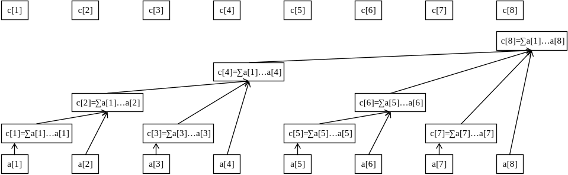
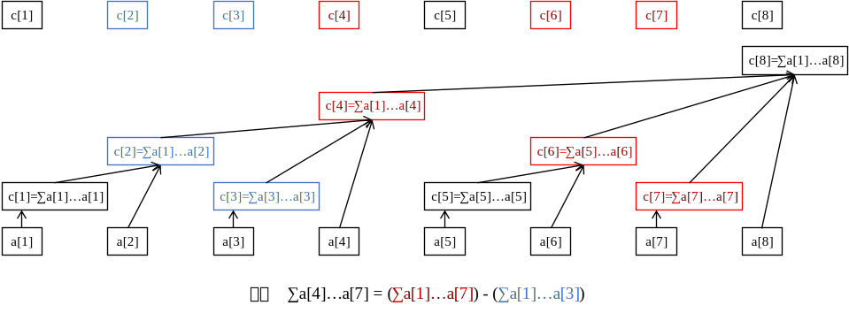

# 树状数组 - OI Wiki

- Source: https://oi-wiki.org/ds/fenwick/

# 树状数组

## 引入

树状数组是一种支持 **单点修改** 和 **区间查询** 的，代码量小的数据结构．

什么是「单点修改」和「区间查询」？

假设有这样一道题：

已知一个数列 𝑎a，你需要进行下面两种操作：

  * 给定 𝑥,𝑦x,y，将 𝑎[𝑥]a[x] 自增 𝑦y．
  * 给定 𝑙,𝑟l,r，求解 𝑎[𝑙…𝑟]a[l…r] 的和．

其中第一种操作就是「单点修改」，第二种操作就是「区间查询」．

类似地，还有：「区间修改」、「单点查询」．它们分别的一个例子如下：

  * 区间修改：给定 𝑙,𝑟,𝑥l,r,x，将 𝑎[𝑙…𝑟]a[l…r] 中的每个数都分别自增 𝑥x；
  * 单点查询：给定 𝑥x，求解 𝑎[𝑥]a[x] 的值．

注意到，区间问题一般严格强于单点问题，因为对单点的操作相当于对一个长度为 11 的区间操作．

普通树状数组维护的信息及运算要满足 **结合律** 且 **可差分** ，如加法（和）、乘法（积）、异或等．

  * 结合律：(𝑥 ∘𝑦) ∘𝑧 =𝑥 ∘(𝑦 ∘𝑧)(x∘y)∘z=x∘(y∘z)，其中 ∘∘ 是一个二元运算符．
  * 可差分：具有逆运算的运算，即已知 𝑥 ∘𝑦x∘y 和 𝑥x 可以求出 𝑦y．

需要注意的是：

  * 模意义下的乘法若要可差分，需保证每个数都存在逆元（模数为质数时一定存在）；
  * 例如 gcdgcd，maxmax 这些信息不可差分，所以不能用普通树状数组处理，但是：
    * 使用两个树状数组可以用于处理区间最值，见 [Efficient Range Minimum Queries using Binary Indexed Trees](http://history.ioinformatics.org/oi/files/volume9.pdf#page=41)．
    * 本页面也会介绍一种支持不可差分信息查询的，Θ(log2⁡𝑛)Θ(log2⁡n) 时间复杂度的拓展树状数组．

事实上，树状数组能解决的问题是线段树能解决的问题的子集：树状数组能做的，线段树一定能做；线段树能做的，树状数组不一定可以．然而，树状数组的代码要远比线段树短，时间效率常数也更小，因此仍有学习价值．

有时，在差分数组和辅助数组的帮助下，树状数组还可解决更强的 **区间加单点值** 和 **区间加区间和** 问题．

## 树状数组

### 初步感受

先来举个例子：我们想知道 𝑎[1…7]a[1…7] 的前缀和，怎么做？

一种做法是：𝑎1 +𝑎2 +𝑎3 +𝑎4 +𝑎5 +𝑎6 +𝑎7a1+a2+a3+a4+a5+a6+a7，需要求 77 个数的和．

但是如果已知三个数 𝐴A，𝐵B，𝐶C，𝐴 =𝑎[1…4]A=a[1…4] 的和，𝐵 =𝑎[5…6]B=a[5…6] 的总和，𝐶 =𝑎[7…7]C=a[7…7] 的总和（其实就是 𝑎[7]a[7] 自己）．你会怎么算？你一定会回答：𝐴 +𝐵 +𝐶A+B+C，只需要求 33 个数的和．

这就是树状数组能快速求解信息的原因：我们总能将一段前缀 [1,𝑛][1,n] 拆成 **不多于 𝐥𝐨𝐠⁡𝒏log⁡n 段区间**，使得这 log⁡𝑛log⁡n 段区间的信息是 **已知的** ．

于是，我们只需合并这 log⁡𝑛log⁡n 段区间的信息，就可以得到答案．相比于原来直接合并 𝑛n 个信息，效率有了很大的提高．

不难发现信息必须满足结合律，否则就不能像上面这样合并了．

下面这张图展示了树状数组的工作原理：



最下面的八个方块代表原始数据数组 𝑎a．上面参差不齐的方块（与最上面的八个方块是同一个数组）代表数组 𝑎a 的上级——𝑐c 数组．

𝑐c 数组就是用来储存原始数组 𝑎a 某段区间的和的，也就是说，这些区间的信息是已知的，我们的目标就是把查询前缀拆成这些小区间．

例如，从图中可以看出：

  * 𝑐2c2 管辖的是 𝑎[1…2]a[1…2]；
  * 𝑐4c4 管辖的是 𝑎[1…4]a[1…4]；
  * 𝑐6c6 管辖的是 𝑎[5…6]a[5…6]；
  * 𝑐8c8 管辖的是 𝑎[1…8]a[1…8]；
  * 剩下的 𝑐[𝑥]c[x] 管辖的都是 𝑎[𝑥]a[x] 自己（可以看做 𝑎[𝑥…𝑥]a[x…x] 的长度为 11 的小区间）．

不难发现，𝑐[𝑥]c[x] 管辖的一定是一段右边界是 𝑥x 的区间总信息．我们先不关心左边界，先来感受一下树状数组是如何查询的．

举例：计算 𝑎[1…7]a[1…7] 的和．

过程：从 𝑐7c7 开始往前跳，发现 𝑐7c7 只管辖 𝑎7a7 这个元素；然后找 𝑐6c6，发现 𝑐6c6 管辖的是 𝑎[5…6]a[5…6]，然后跳到 𝑐4c4，发现 𝑐4c4 管辖的是 𝑎[1…4]a[1…4] 这些元素，然后再试图跳到 𝑐0c0，但事实上 𝑐0c0 不存在，不跳了．

我们刚刚找到的 𝑐c 是 𝑐7,𝑐6,𝑐4c7,c6,c4，事实上这就是 𝑎[1…7]a[1…7] 拆分出的三个小区间，合并得到答案是 𝑐7 +𝑐6 +𝑐4c7+c6+c4．

举例：计算 𝑎[4…7]a[4…7] 的和．

我们还是从 𝑐7c7 开始跳，跳到 𝑐6c6 再跳到 𝑐4c4．此时我们发现它管理了 𝑎[1…4]a[1…4] 的和，但是我们不想要 𝑎[1…3]a[1…3] 这一部分，怎么办呢？很简单，减去 𝑎[1…3]a[1…3] 的和就行了．

那不妨考虑最开始，就将查询 𝑎[4…7]a[4…7] 的和转化为查询 𝑎[1…7]a[1…7] 的和，以及查询 𝑎[1…3]a[1…3] 的和，最终将两个结果作差．



### 管辖区间

那么问题来了，𝑐[𝑥](𝑥 ≥1)c[x](x≥1) 管辖的区间到底往左延伸多少？也就是说，区间长度是多少？

树状数组中，规定 𝑐[𝑥]c[x] 管辖的区间长度为 2𝑘2k，其中：

  * 设二进制最低位为第 00 位，则 𝑘k 恰好为 𝑥x 二进制表示中，最低位的 `1` 所在的二进制位数；
  * 2𝑘2k（𝑐[𝑥]c[x] 的管辖区间长度）恰好为 𝑥x 二进制表示中，最低位的 `1` 以及后面所有 `0` 组成的数．

举个例子，𝑐88c88 管辖的是哪个区间？

因为 88(10) =01011000(2)88(10)=01011000(2)，其二进制最低位的 `1` 以及后面的 `0` 组成的二进制是 `1000`，即 88，所以 𝑐88c88 管辖 88 个 𝑎a 数组中的元素．

因此，𝑐88c88 代表 𝑎[81…88]a[81…88] 的区间信息．

我们记 𝑥x 二进制最低位 `1` 以及后面的 `0` 组成的数为 lowbit⁡(𝑥)lowbit⁡(x)，那么 𝑐[𝑥]c[x] 管辖的区间就是 [𝑥 −lowbit⁡(𝑥) +1,𝑥][x−lowbit⁡(x)+1,x]．

注意

lowbitlowbit 指的不是最低位 `1` 所在的位数 𝑘k，而是这个 `1` 和后面所有 `0` 组成的 2𝑘2k．

怎么计算 `lowbit`？根据位运算知识，可以得到 `lowbit(x) = x & -x`．

lowbit 的原理

将 `x` 的二进制所有位全部取反，再加 1，就可以得到 `-x` 的二进制编码．例如，66 的二进制编码是 `110`，全部取反后得到 `001`，加 `1` 得到 `010`．

设原先 `x` 的二进制编码是 `(...)10...00`，全部取反后得到 `[...]01...11`，加 `1` 后得到 `[...]10...00`，也就是 `-x` 的二进制编码了．这里 `x` 二进制表示中第一个 `1` 是 `x` 最低位的 `1`．

`(...)` 和 `[...]` 中省略号的每一位分别相反，所以 `x & -x = (...)10...00 & [...]10...00 = 10...00`，得到的结果就是 `lowbit`．

实现

C++Python

```text 1 2 3 4 5 6 7 8 ``` |  ```text int lowbit ( int x ) { // x 的二进制中，最低位的 1 以及后面所有 0 组成的数． // lowbit(0b01011000) == 0b00001000 // ~~~~^~~~ // lowbit(0b01110010) == 0b00000010 // ~~~~~~^~ return x & \- x ; } ```   
---|---  
  
```text 1 2 3 4 5 6 7 8 9 ``` |  ```text def lowbit ( x ): """ x 的二进制中，最低位的 1 以及后面所有 0 组成的数． lowbit(0b01011000) == 0b00001000 ~~~~~^~~ lowbit(0b01110010) == 0b00000010 ~~~~~~~^~ """ return x & \- x ```   
---|---  
  
### 区间查询

接下来我们来看树状数组具体的操作实现，先来看区间查询．

回顾查询 𝑎[4…7]a[4…7] 的过程，我们是将它转化为两个子过程：查询 𝑎[1…7]a[1…7] 和查询 𝑎[1…3]a[1…3] 的和，最终作差．

其实任何一个区间查询都可以这么做：查询 𝑎[𝑙…𝑟]a[l…r] 的和，就是 𝑎[1…𝑟]a[1…r] 的和减去 𝑎[1…𝑙 −1]a[1…l−1] 的和，从而把区间问题转化为前缀问题，更方便处理．

事实上，将有关 𝑙…𝑟l…r 的区间询问转化为 1…𝑟1…r 和 1…𝑙 −11…l−1 的前缀询问再差分，在竞赛中是一个非常常用的技巧．

那前缀查询怎么做呢？回顾下查询 𝑎[1…7]a[1…7] 的过程：

> 从 𝑐7c7 往前跳，发现 𝑐7c7 只管辖 𝑎7a7 这个元素；然后找 𝑐6c6，发现 𝑐6c6 管辖的是 𝑎[5…6]a[5…6]，然后跳到 𝑐4c4，发现 𝑐4c4 管辖的是 𝑎[1…4]a[1…4] 这些元素，然后再试图跳到 𝑐0c0，但事实上 𝑐0c0 不存在，不跳了．
> 
> 我们刚刚找到的 𝑐c 是 𝑐7,𝑐6,𝑐4c7,c6,c4，事实上这就是 𝑎[1…7]a[1…7] 拆分出的三个小区间，合并一下，答案是 𝑐7 +𝑐6 +𝑐4c7+c6+c4．

观察上面的过程，每次往前跳，一定是跳到现区间的左端点的左一位，作为新区间的右端点，这样才能将前缀不重不漏地拆分．比如现在 𝑐6c6 管的是 𝑎[5…6]a[5…6]，下一次就跳到 5 −1 =45−1=4，即访问 𝑐4c4．

我们可以写出查询 𝑎[1…𝑥]a[1…x] 的过程：

  * 从 𝑐[𝑥]c[x] 开始往前跳，有 𝑐[𝑥]c[x] 管辖 𝑎[𝑥 −lowbit⁡(𝑥) +1…𝑥]a[x−lowbit⁡(x)+1…x]；
  * 令 𝑥 ←𝑥 −lowbit⁡(𝑥)x←x−lowbit⁡(x)，如果 𝑥 =0x=0 说明已经跳到尽头了，终止循环；否则回到第一步．
  * 将跳到的 𝑐c 合并．

实现时，我们不一定要先把 𝑐c 都跳出来然后一起合并，可以边跳边合并．

比如我们要维护的信息是和，直接令初始 ans =0ans=0，然后每跳到一个 𝑐[𝑥]c[x] 就 ans ←ans +𝑐[𝑥]ans←ans+c[x]，最终 ansans 就是所有合并的结果．

实现

C++Python

```text 1 2 3 4 5 6 7 8 ``` |  ```text int getsum ( int x ) { // a[1]..a[x]的和 int ans = 0 ; while ( x > 0 ) { ans = ans \+ c [ x ]; x = x \- lowbit ( x ); } return ans ; } ```   
---|---  
  
```text 1 2 3 4 5 6 ``` |  ```text def getsum ( x ): # a[1]..a[x]的和 ans = 0 while x > 0 : ans = ans \+ c [ x ] x = x \- lowbit ( x ) return ans ```   
---|---  
  
### 树状数组与其树形态的性质

在讲解单点修改之前，先讲解树状数组的一些基本性质，以及其树形态来源，这有助于更好理解树状数组的单点修改．

我们约定：

  * 𝑙(𝑥) =𝑥 −lowbit⁡(𝑥) +1l(x)=x−lowbit⁡(x)+1．即，𝑙(𝑥)l(x) 是 𝑐[𝑥]c[x] 管辖范围的左端点．
  * 对于任意正整数 𝑥x，总能将 𝑥x 表示成 𝑠 ×2𝑘+1 +2𝑘s×2k+1+2k 的形式，其中 lowbit⁡(𝑥) =2𝑘lowbit⁡(x)=2k．
  * 下面「𝑐[𝑥]c[x] 和 𝑐[𝑦]c[y] 不交」指 𝑐[𝑥]c[x] 的管辖范围和 𝑐[𝑦]c[y] 的管辖范围不相交，即 [𝑙(𝑥),𝑥][l(x),x] 和 [𝑙(𝑦),𝑦][l(y),y] 不相交．「𝑐[𝑥]c[x] 包含于 𝑐[𝑦]c[y]」等表述同理．

**性质 𝟏1：对于 𝒙 ≤𝒚x≤y，要么有 𝒄[𝒙]c[x] 和 𝒄[𝒚]c[y] 不交，要么有 𝒄[𝒙]c[x] 包含于 𝒄[𝒚]c[y]．**

证明

证明：假设 𝑐[𝑥]c[x] 和 𝑐[𝑦]c[y] 相交，即 [𝑙(𝑥),𝑥][l(x),x] 和 [𝑙(𝑦),𝑦][l(y),y] 相交，则一定有 𝑙(𝑦) ≤𝑥 ≤𝑦l(y)≤x≤y．

将 𝑦y 表示为 𝑠 ×2𝑘+1 +2𝑘s×2k+1+2k，则 𝑙(𝑦) =𝑠 ×2𝑘+1 +1l(y)=s×2k+1+1．所以，𝑥x 可以表示为 𝑠 ×2𝑘+1 +𝑏s×2k+1+b，其中 1 ≤𝑏 ≤2𝑘1≤b≤2k．

不难发现 lowbit⁡(𝑥) =lowbit⁡(𝑏)lowbit⁡(x)=lowbit⁡(b)．又因为 𝑏 −lowbit⁡(𝑏) ≥0b−lowbit⁡(b)≥0，

所以 𝑙(𝑥) =𝑥 −lowbit⁡(𝑥) +1 =𝑠 ×2𝑘+1 +𝑏 −lowbit⁡(𝑏) +1 ≥𝑠 ×2𝑘+1 +1 =𝑙(𝑦)l(x)=x−lowbit⁡(x)+1=s×2k+1+b−lowbit⁡(b)+1≥s×2k+1+1=l(y)，即 𝑙(𝑦) ≤𝑙(𝑥) ≤𝑥 ≤𝑦l(y)≤l(x)≤x≤y．

所以，如果 𝑐[𝑥]c[x] 和 𝑐[𝑦]c[y] 相交，那么 𝑐[𝑥]c[x] 的管辖范围一定完全包含于 𝑐[𝑦]c[y]．

**性质 𝟐2：𝒄[𝒙]c[x] 真包含于 𝒄[𝒙 +𝐥𝐨𝐰𝐛𝐢𝐭⁡(𝒙)]c[x+lowbit⁡(x)]．**

证明

证明：设 𝑦 =𝑥 +lowbit⁡(𝑥)y=x+lowbit⁡(x)，𝑥 =𝑠 ×2𝑘+1 +2𝑘x=s×2k+1+2k，则 𝑦 =(𝑠 +1) ×2𝑘+1y=(s+1)×2k+1，𝑙(𝑥) =𝑠 ×2𝑘+1 +1l(x)=s×2k+1+1．

不难发现 lowbit⁡(𝑦) ≥2𝑘+1lowbit⁡(y)≥2k+1，所以 𝑙(𝑦) =(𝑠 +1) ×2𝑘+1 −lowbit⁡(𝑦) +1 ≤𝑠 ×2𝑘+1 +1 =𝑙(𝑥)l(y)=(s+1)×2k+1−lowbit⁡(y)+1≤s×2k+1+1=l(x)，即 𝑙(𝑦) ≤𝑙(𝑥) ≤𝑥 <𝑦l(y)≤l(x)≤x<y．

所以，𝑐[𝑥]c[x] 真包含于 𝑐[𝑥 +lowbit⁡(𝑥)]c[x+lowbit⁡(x)]．

**性质 33：对于任意 𝒙 <𝒚 <𝒙 +𝐥𝐨𝐰𝐛𝐢𝐭⁡(𝒙)x<y<x+lowbit⁡(x)，有 𝒄[𝒙]c[x] 和 𝒄[𝒚]c[y] 不交．**

证明

证明：设 𝑥 =𝑠 ×2𝑘+1 +2𝑘x=s×2k+1+2k，则 𝑦 =𝑥 +𝑏 =𝑠 ×2𝑘+1 +2𝑘 +𝑏y=x+b=s×2k+1+2k+b，其中 1 ≤𝑏 <2𝑘1≤b<2k．

不难发现 lowbit⁡(𝑦) =lowbit⁡(𝑏)lowbit⁡(y)=lowbit⁡(b)．又因为 𝑏 −lowbit⁡(𝑏) ≥0b−lowbit⁡(b)≥0，

因此 𝑙(𝑦) =𝑦 −lowbit⁡(𝑦) +1 =𝑥 +𝑏 −lowbit⁡(𝑏) +1 >𝑥l(y)=y−lowbit⁡(y)+1=x+b−lowbit⁡(b)+1>x，即 𝑙(𝑥) ≤𝑥 <𝑙(𝑦) ≤𝑦l(x)≤x<l(y)≤y．

所以，𝑐[𝑥]c[x] 和 𝑐[𝑦]c[y] 不交．

有了这三条性质的铺垫，我们接下来看树状数组的树形态（请忽略 𝑎a 向 𝑐c 的连边）．


事实上，树状数组的树形态是 𝑥x 向 𝑥 +lowbit⁡(𝑥)x+lowbit⁡(x) 连边得到的图，其中 𝑥 +lowbit⁡(𝑥)x+lowbit⁡(x) 是 𝑥x 的父亲．

注意，在考虑树状数组的树形态时，我们不考虑树状数组大小的影响，即我们认为这是一棵无限大的树，方便分析．实际实现时，我们只需用到 𝑥 ≤𝑛x≤n 的 𝑐[𝑥]c[x]，其中 𝑛n 是原数组长度．

这棵树天然满足了很多美好性质，下面列举若干（设 𝑓𝑎[𝑢]fa[u] 表示 𝑢u 的直系父亲）：

  * 𝑢 <𝑓𝑎[𝑢]u<fa[u]．
  * 𝑢u 大于任何一个 𝑢u 的后代，小于任何一个 𝑢u 的祖先．
  * 点 𝑢u 的 lowbitlowbit 严格小于 𝑓𝑎[𝑢]fa[u] 的 lowbitlowbit．

证明

设 𝑦 =𝑥 +lowbit⁡(𝑥)y=x+lowbit⁡(x)，𝑥 =𝑠 ×2𝑘+1 +2𝑘x=s×2k+1+2k，则 𝑦 =(𝑠 +1) ×2𝑘+1y=(s+1)×2k+1，不难发现 lowbit⁡(𝑦) ≥2𝑘+1 >lowbit⁡(𝑥)lowbit⁡(y)≥2k+1>lowbit⁡(x)，证毕．

  * 点 𝑥x 的高度是 log2⁡lowbit⁡(𝑥)log2⁡lowbit⁡(x)，即 𝑥x 二进制最低位 `1` 的位数．

高度的定义

点 𝑥x 的高度 ℎ(𝑥)h(x) 满足：如果 𝑥mod2 =1xmod2=1，则 ℎ(𝑥) =0h(x)=0，否则 ℎ(𝑥) =max(ℎ(𝑦)) +1h(x)=max(h(y))+1，其中 𝑦y 代表 𝑥x 的所有儿子（此时 𝑥x 至少存在一个儿子 𝑥 −1x−1）．

也就是说，一个点的高度恰好比它最高的那个儿子再高 11．如果一个点没有儿子，它的高度是 00．

这里引出高度这一概念，是为后面解释复杂度更方便．

  * 𝑐[𝑢]c[u] 真包含于 𝑐[𝑓𝑎[𝑢]]c[fa[u]]（性质 22）．
  * 𝑐[𝑢]c[u] 真包含于 𝑐[𝑣]c[v]，其中 𝑣v 是 𝑢u 的任一祖先（在上一条性质上归纳）．
  * 𝑐[𝑢]c[u] 真包含 𝑐[𝑣]c[v]，其中 𝑣v 是 𝑢u 的任一后代（上面那条性质 𝑢u，𝑣v 颠倒）．
  * 对于任意 𝑣′ >𝑢v′>u，若 𝑣′v′ 不是 𝑢u 的祖先，则 𝑐[𝑢]c[u] 和 𝑐[𝑣′]c[v′] 不交．

证明

𝑢u 和 𝑢u 的祖先中，一定存在一个点 𝑣v 使得 𝑣 <𝑣′ <𝑓𝑎[𝑣]v<v′<fa[v]，根据性质 33 得 𝑐[𝑣′]c[v′] 不相交于 𝑐[𝑣]c[v]，而 𝑐[𝑣]c[v] 包含 𝑐[𝑢]c[u]，因此 𝑐[𝑣′]c[v′] 不交于 𝑐[𝑢]c[u]．

  * 对于任意 𝑣 <𝑢v<u，如果 𝑣v 不在 𝑢u 的子树上，则 𝑐[𝑢]c[u] 和 𝑐[𝑣]c[v] 不交（上面那条性质 𝑢u，𝑣′v′ 颠倒）．
  * 对于任意 𝑣 >𝑢v>u，当且仅当 𝑣v 是 𝑢u 的祖先，𝑐[𝑢]c[u] 真包含于 𝑐[𝑣]c[v]（上面几条性质的总结）．这就是树状数组单点修改的核心原理．
  * 设 𝑢 =𝑠 ×2𝑘+1 +2𝑘u=s×2k+1+2k，则其儿子数量为 𝑘 =log2⁡lowbit⁡(𝑢)k=log2⁡lowbit⁡(u)，编号分别为 𝑢 −2𝑡(0 ≤𝑡 <𝑘)u−2t(0≤t<k)．
    * 举例：假设 𝑘 =3k=3，𝑢u 的二进制编号为 `...1000`，则 𝑢u 有三个儿子，二进制编号分别为 `...0111`、`...0110`、`...0100`．

证明

在一个数 𝑥x 的基础上减去 2𝑡2t，𝑥x 二进制第 𝑡t 位会反转，而更低的位保持不变．

考虑 𝑢u 的儿子 𝑣v，有 𝑣 +lowbit⁡(𝑣) =𝑢v+lowbit⁡(v)=u，即 𝑣 =𝑢 −2𝑡v=u−2t 且 lowbit⁡(𝑣) =2𝑡lowbit⁡(v)=2t．设 𝑢 =𝑠 ×2𝑘+1 +2𝑘u=s×2k+1+2k．

**考虑 𝟎 ≤𝒕 <𝒌0≤t<k**，𝑢u 的第 𝑡t 位及后方均为 00，所以 𝑣 =𝑢 −2𝑡v=u−2t 的第 𝑡t 位变为 11，后面仍为 00，**满足** lowbit⁡(𝑣) =2𝑡lowbit⁡(v)=2t．

**考虑 𝒕 =𝒌t=k**，则 𝑣 =𝑢 −2𝑘v=u−2k，𝑣v 的第 𝑘k 位变为 00，**不满足** lowbit⁡(𝑣) =2𝑡lowbit⁡(v)=2t．

**考虑 𝒕 >𝒌t>k**，则 𝑣 =𝑢 −2𝑡v=u−2t，𝑣v 的第 𝑘k 位是 11，所以 lowbit⁡(𝑣) =2𝑘lowbit⁡(v)=2k，**不满足** lowbit⁡(𝑣) =2𝑡lowbit⁡(v)=2t．

  * 𝑢u 的所有儿子对应 𝑐c 的管辖区间恰好拼接成 [𝑙(𝑢),𝑢 −1][l(u),u−1]．
    * 举例：假设 𝑘 =3k=3，𝑢u 的二进制编号为 `...1000`，则 𝑢u 有三个儿子，二进制编号分别为 `...0111`、`...0110`、`...0100`．
    * `c[...0100]` 表示 `a[...0001 ~ ...0100]`．
    * `c[...0110]` 表示 `a[...0101 ~ ...0110]`．
    * `c[...0111]` 表示 `a[...0111 ~ ...0111]`．
    * 不难发现上面是三个管辖区间的并集恰好是 `a[...0001 ~ ...0111]`，即 [𝑙(𝑢),𝑢 −1][l(u),u−1]．

证明

𝑢u 的儿子总能表示成 𝑢 −2𝑡(0 ≤𝑡 <𝑘)u−2t(0≤t<k)，不难发现，𝑡t 越小，𝑢 −2𝑡u−2t 越大，代表的区间越靠右．我们设 𝑓(𝑡) =𝑢 −2𝑡f(t)=u−2t，则 𝑓(𝑘 −1),𝑓(𝑘 −2),…,𝑓(0)f(k−1),f(k−2),…,f(0) 分别构成 𝑢u 从左到右的儿子．

不难发现 lowbit⁡(𝑓(𝑡)) =2𝑡lowbit⁡(f(t))=2t，所以 𝑙(𝑓(𝑡)) =𝑢 −2𝑡 −2𝑡 +1 =𝑢 −2𝑡+1 +1l(f(t))=u−2t−2t+1=u−2t+1+1．

考虑相邻的两个儿子 𝑓(𝑡 +1)f(t+1) 和 𝑓(𝑡)f(t)．前者管辖区间的右端点是 𝑓(𝑡 +1) =𝑢 −2𝑡+1f(t+1)=u−2t+1，后者管辖区间的左端点是 𝑙(𝑓(𝑡)) =𝑢 −2𝑡+1 +1l(f(t))=u−2t+1+1，恰好相接．

考虑最左面的儿子 𝑓(𝑘 −1)f(k−1)，其管辖左边界 𝑙(𝑓(𝑘 −1)) =𝑢 −2𝑘 +1l(f(k−1))=u−2k+1 恰为 𝑙(𝑢)l(u)．

考虑最右面的儿子 𝑓(0)f(0)，其管辖右边界就是 𝑢 −1u−1．

因此，这些儿子的管辖区间可以恰好拼成 [𝑙(𝑢),𝑢 −1][l(u),u−1]．

### 单点修改

现在来考虑如何单点修改 𝑎[𝑥]a[x]．

我们的目标是快速正确地维护 𝑐c 数组．为保证效率，我们只需遍历并修改管辖了 𝑎[𝑥]a[x] 的所有 𝑐[𝑦]c[y]，因为其他的 𝑐c 显然没有发生变化．

管辖 𝑎[𝑥]a[x] 的 𝑐[𝑦]c[y] 一定包含 𝑐[𝑥]c[x]（根据性质 11），所以 𝑦y 在树状数组树形态上是 𝑥x 的祖先．因此我们从 𝑥x 开始不断跳父亲，直到跳得超过了原数组长度为止．

设 𝑛n 表示 𝑎a 的大小，不难写出单点修改 𝑎[𝑥]a[x] 的过程：

  * 初始令 𝑥′ =𝑥x′=x．
  * 修改 𝑐[𝑥′]c[x′]．
  * 令 𝑥′ ←𝑥′ +lowbit⁡(𝑥′)x′←x′+lowbit⁡(x′)，如果 𝑥′ >𝑛x′>n 说明已经跳到尽头了，终止循环；否则回到第二步．

区间信息和单点修改的种类，共同决定 𝑐[𝑥′]c[x′] 的修改方式．下面给几个例子：

  * 若 𝑐[𝑥′]c[x′] 维护区间和，修改种类是将 𝑎[𝑥]a[x] 加上 𝑝p，则修改方式则是将所有 𝑐[𝑥′]c[x′] 也加上 𝑝p．
  * 若 𝑐[𝑥′]c[x′] 维护区间积，修改种类是将 𝑎[𝑥]a[x] 乘上 𝑝p，则修改方式则是将所有 𝑐[𝑥′]c[x′] 也乘上 𝑝p．

然而，单点修改的自由性使得修改的种类和维护的信息不一定是同种运算，比如，若 𝑐[𝑥′]c[x′] 维护区间和，修改种类是将 𝑎[𝑥]a[x] 赋值为 𝑝p，可以考虑转化为将 𝑎[𝑥]a[x] 加上 𝑝 −𝑎[𝑥]p−a[x]．如果是将 𝑎[𝑥]a[x] 乘上 𝑝p，就考虑转化为 𝑎[𝑥]a[x] 加上 𝑎[𝑥] ×𝑝 −𝑎[𝑥]a[x]×p−a[x]．

下面以维护区间和，单点加为例给出实现．

实现

C++Python

```text 1 2 3 4 5 6 ``` |  ```text void add ( int x , int k ) { while ( x <= n ) { // 不能越界 c [ x ] = c [ x ] \+ k ; x = x \+ lowbit ( x ); } } ```   
---|---  
  
```text 1 2 3 4 ``` |  ```text def add ( x , k ): while x <= n : # 不能越界 c [ x ] = c [ x ] \+ k x = x \+ lowbit ( x ) ```   
---|---  
  
### 建树

也就是根据最开始给出的序列，将树状数组建出来（𝑐c 全部预处理好）．

一般可以直接转化为 𝑛n 次单点修改，时间复杂度 Θ(𝑛log⁡𝑛)Θ(nlog⁡n)（复杂度分析在后面）．

比如给定序列 𝑎 =(5,1,4)a=(5,1,4) 要求建树，直接看作对 𝑎[1]a[1] 单点加 55，对 𝑎[2]a[2] 单点加 11，对 𝑎[3]a[3] 单点加 44 即可．

也有 Θ(𝑛)Θ(n) 的建树方法，见本页面 Θ(𝑛)Θ(n) 建树 一节．

### 复杂度分析

空间复杂度显然 Θ(𝑛)Θ(n)．

时间复杂度：

  * 对于区间查询操作：整个 𝑥 ←𝑥 −lowbit⁡(𝑥)x←x−lowbit⁡(x) 的迭代过程，可看做将 𝑥x 二进制中的所有 11，从低位到高位逐渐改成 00 的过程，拆分出的区间数等于 𝑥x 二进制中 11 的数量（即 popcount⁡(𝑥)popcount⁡(x)）．因此，单次查询时间复杂度是 Θ(log⁡𝑛)Θ(log⁡n)；
  * 对于单点修改操作：跳父亲时，访问到的高度一直严格增加，且始终有 𝑥 ≤𝑛x≤n．由于点 𝑥x 的高度是 log2⁡lowbit⁡(𝑥)log2⁡lowbit⁡(x)，所以跳到的高度不会超过 log2⁡𝑛log2⁡n，所以访问到的 𝑐c 的数量是 log⁡𝑛log⁡n 级别．因此，单次单点修改复杂度是 Θ(log⁡𝑛)Θ(log⁡n)．

## 区间加区间和

前置知识：[前缀和 & 差分](../../basic/prefix-sum/)．

该问题可以使用两个树状数组维护差分数组解决．

考虑序列 𝑎a 的差分数组 𝑑d，其中 𝑑[𝑖] =𝑎[𝑖] −𝑎[𝑖 −1]d[i]=a[i]−a[i−1]．由于差分数组的前缀和就是原数组，所以 𝑎𝑖 =∑𝑖𝑗=1𝑑𝑗ai=∑j=1idj．

一样地，我们考虑将查询区间和通过差分转化为查询前缀和．那么考虑查询 𝑎[1…𝑟]a[1…r] 的和，即 ∑𝑟𝑖=1𝑎𝑖∑i=1rai，进行推导：

𝑟∑𝑖=1𝑎𝑖=𝑟∑𝑖=1𝑖∑𝑗=1𝑑𝑗∑i=1rai=∑i=1r∑j=1idj

观察这个式子，不难发现每个 𝑑𝑗dj 总共被加了 𝑟 −𝑗 +1r−j+1 次．接着推导：

𝑟∑𝑖=1𝑖∑𝑗=1𝑑𝑗=𝑟∑𝑖=1𝑑𝑖×(𝑟−𝑖+1)=𝑟∑𝑖=1𝑑𝑖×(𝑟+1)−𝑟∑𝑖=1𝑑𝑖×𝑖∑i=1r∑j=1idj=∑i=1rdi×(r−i+1)=∑i=1rdi×(r+1)−∑i=1rdi×i

∑𝑟𝑖=1𝑑𝑖∑i=1rdi 并不能推出 ∑𝑟𝑖=1𝑑𝑖 ×𝑖∑i=1rdi×i 的值，所以要用两个树状数组分别维护 𝑑𝑖di 和 𝑑𝑖 ×𝑖di×i 的和信息．

那么怎么做区间加呢？考虑给原数组 𝑎[𝑙…𝑟]a[l…r] 区间加 𝑥x 给 𝑑d 带来的影响．

因为差分是 𝑑[𝑖] =𝑎[𝑖] −𝑎[𝑖 −1]d[i]=a[i]−a[i−1]，

  * 𝑎[𝑙]a[l] 多了 𝑣v 而 𝑎[𝑙 −1]a[l−1] 不变，所以 𝑑[𝑙]d[l] 的值多了 𝑣v．
  * 𝑎[𝑟 +1]a[r+1] 不变而 𝑎[𝑟]a[r] 多了 𝑣v，所以 𝑑[𝑟 +1]d[r+1] 的值少了 𝑣v．
  * 对于不等于 𝑙l 且不等于 𝑟 +1r+1 的任意 𝑖i，𝑎[𝑖]a[i] 和 𝑎[𝑖 −1]a[i−1] 要么都没发生变化，要么都加了 𝑣v，𝑎[𝑖] +𝑣 −(𝑎[𝑖 −1] +𝑣)a[i]+v−(a[i−1]+v) 还是 𝑎[𝑖] −𝑎[𝑖 −1]a[i]−a[i−1]，所以其它的 𝑑[𝑖]d[i] 均不变．

那就不难想到维护方式了：对于维护 𝑑𝑖di 的树状数组，对 𝑙l 单点加 𝑣v，𝑟 +1r+1 单点加 −𝑣−v；对于维护 𝑑𝑖 ×𝑖di×i 的树状数组，对 𝑙l 单点加 𝑣 ×𝑙v×l，𝑟 +1r+1 单点加 −𝑣 ×(𝑟 +1)−v×(r+1)．

而更弱的问题，「区间加求单点值」，只需用树状数组维护一个差分数组 𝑑𝑖di．询问 𝑎[𝑥]a[x] 的单点值，直接求 𝑑[1…𝑥]d[1…x] 的和即可．

这里直接给出「区间加区间和」的代码：

实现

C++Python

```text 1 2 3 4 5 6 7 8 9 10 11 12 13 14 15 16 17 18 19 20 21 22 23 24 25 26 27 28 29 30 ``` |  ```text int t1 [ MAXN ], t2 [ MAXN ], n ; int lowbit ( int x ) { return x & ( \- x ); } void add ( int k , int v ) { int v1 = k * v ; while ( k <= n ) { t1 [ k ] += v , t2 [ k ] += v1 ; // 注意不能写成 t2[k] += k * v，因为 k 的值已经不是原数组的下标了 k += lowbit ( k ); } } int getsum ( int * t , int k ) { int ret = 0 ; while ( k ) { ret += t [ k ]; k -= lowbit ( k ); } return ret ; } void add1 ( int l , int r , int v ) { add ( l , v ), add ( r \+ 1 , \- v ); // 将区间加差分为两个前缀加 } long long getsum1 ( int l , int r ) { return ( r \+ 1l l ) * getsum ( t1 , r ) \- 1l l * l * getsum ( t1 , l \- 1 ) \- ( getsum ( t2 , r ) \- getsum ( t2 , l \- 1 )); } ```   
---|---  
  
```text 1 2 3 4 5 6 7 8 9 10 11 12 13 14 15 16 17 18 19 20 21 22 23 24 25 26 27 28 29 30 31 32 33 34 35 36 ``` |  ```text t1 = [ 0 ] * MAXN t2 = [ 0 ] * MAXN n = 0 def lowbit ( x ): return x & ( \- x ) def add ( k , v ): v1 = k * v while k <= n : t1 [ k ] = t1 [ k ] \+ v t2 [ k ] = t2 [ k ] \+ v1 k = k \+ lowbit ( k ) def getsum ( t , k ): ret = 0 while k : ret = ret \+ t [ k ] k = k \- lowbit ( k ) return ret def add1 ( l , r , v ): add ( l , v ) add ( r \+ 1 , \- v ) def getsum1 ( l , r ): return ( ( r ) * getsum ( t1 , r ) \- l * getsum ( t1 , l \- 1 ) \- ( getsum ( t2 , r ) \- getsum ( t2 , l \- 1 )) ) ```   
---|---  
  
根据这个原理，应该可以实现「区间乘区间积」，「区间异或一个数，求区间异或值」等，只要满足维护的信息和区间操作是同种运算即可，感兴趣的读者可以自己尝试．

## 二维树状数组

### 单点修改，子矩阵查询

二维树状数组，也被称作树状数组套树状数组，用来维护二维数组上的单点修改和前缀信息问题．

与一维树状数组类似，我们用 𝑐(𝑥,𝑦)c(x,y) 表示 𝑎(𝑥 −lowbit⁡(𝑥) +1,𝑦 −lowbit⁡(𝑦) +1)…𝑎(𝑥,𝑦)a(x−lowbit⁡(x)+1,y−lowbit⁡(y)+1)…a(x,y) 的矩阵总信息，即一个以 𝑎(𝑥,𝑦)a(x,y) 为右下角，高 lowbit⁡(𝑥)lowbit⁡(x)，宽 lowbit⁡(𝑦)lowbit⁡(y) 的矩阵的总信息．

对于单点修改，设：

𝑓(𝑥,𝑖)={𝑥𝑖=0𝑓(𝑥,𝑖−1)+lowbit⁡(𝑓(𝑥,𝑖−1))𝑖>0f(x,i)={xi=0f(x,i−1)+lowbit⁡(f(x,i−1))i>0

即 𝑓(𝑥,𝑖)f(x,i) 为 𝑥x 在树状数组树形态上的第 𝑖i 级祖先（第 00 级祖先是自己）．

则只有 𝑐(𝑓(𝑥,𝑖),𝑓(𝑦,𝑗))c(f(x,i),f(y,j)) 中的元素管辖 𝑎(𝑥,𝑦)a(x,y)，修改 𝑎(𝑥,𝑦)a(x,y) 时只需修改所有 𝑐(𝑓(𝑥,𝑖),𝑓(𝑦,𝑗))c(f(x,i),f(y,j))，其中 𝑓(𝑥,𝑖) ≤𝑛f(x,i)≤n，𝑓(𝑦,𝑗) ≤𝑚f(y,j)≤m．

正确性证明

𝑐(𝑝,𝑞)c(p,q) 管辖 𝑎(𝑥,𝑦)a(x,y)，求 𝑝p 和 𝑞q 的取值范围．

考虑一个大小为 𝑛n 的一维树状数组 𝑐1c1（对应原数组 𝑎1a1）和一个大小为 𝑚m 的一维树状数组 𝑐2c2（对应原数组 𝑎2a2）．

则命题等价为：𝑐1(𝑝)c1(p) 管辖 𝑎1[𝑥]a1[x] 且 𝑐2(𝑞)c2(q) 管辖 𝑎2[𝑦]a2[y] 的条件．

也就是说，在树状数组树形态上，𝑝p 是 𝑥x 及其祖先中的一个点，𝑞q 是 𝑦y 及其祖先中的一个点．

所以 𝑝 =𝑓(𝑥,𝑖)p=f(x,i)，𝑞 =𝑓(𝑦,𝑗)q=f(y,j)．

对于查询，我们设：

𝑔(𝑥,𝑖)=⎧{ {⎨{ {⎩𝑥𝑖=0𝑔(𝑥,𝑖−1)−lowbit⁡(𝑔(𝑥,𝑖−1))𝑖,𝑔(𝑥,𝑖−1)>00otherwise.g(x,i)={xi=0g(x,i−1)−lowbit⁡(g(x,i−1))i,g(x,i−1)>00otherwise.

则合并所有 𝑐(𝑔(𝑥,𝑖),𝑔(𝑦,𝑗))c(g(x,i),g(y,j))，其中 𝑔(𝑥,𝑖),𝑔(𝑦,𝑗) >0g(x,i),g(y,j)>0．

正确性证明

设 ∘∘ 表示合并两个信息的运算符（比如，如果信息是区间和，则 ∘ = +∘=+）．

考虑一个一维树状数组 𝑐1c1，𝑐1[𝑔(𝑥,0)] ∘𝑐1[𝑔(𝑥,1)] ∘𝑐1[𝑔(𝑥,2)] ∘⋯c1[g(x,0)]∘c1[g(x,1)]∘c1[g(x,2)]∘⋯ 恰好表示原数组上 [1…𝑥][1…x] 这段区间信息．

类似地，设 𝑡(𝑥) =𝑐(𝑥,𝑔(𝑦,0)) ∘𝑐(𝑥,𝑔(𝑦,1)) ∘𝑐(𝑥,𝑔(𝑦,2)) ∘⋯t(x)=c(x,g(y,0))∘c(x,g(y,1))∘c(x,g(y,2))∘⋯，则 𝑡(𝑥)t(x) 恰好表示 𝑎(𝑥 −lowbit⁡(𝑥) +1,1)…𝑎(𝑥,𝑦)a(x−lowbit⁡(x)+1,1)…a(x,y) 这个矩阵信息．

又类似地，就有 𝑡(𝑔(𝑥,0)) ∘𝑡(𝑔(𝑥,1)) ∘𝑡(𝑔(𝑥,2)) ∘⋯t(g(x,0))∘t(g(x,1))∘t(g(x,2))∘⋯ 表示 𝑎(1,1)…𝑎(𝑥,𝑦)a(1,1)…a(x,y) 这个矩阵信息．

其实这里 𝑡(𝑥)t(x) 这个函数如果看成一个树状数组，相当于一个树状数组套了一个树状数组，这也就是「树状数组套树状数组」这个名字的来源．

下面给出单点加、查询子矩阵和的代码．

实现

单点加查询子矩阵和

```text 1 2 3 4 5 6 7 8 ``` |  ```text void add ( int x , int y , int v ) { for ( int i = x ; i <= n ; i += lowbit ( i )) { for ( int j = y ; j <= m ; j += lowbit ( j )) { // 注意这里必须得建循环变量，不能像一维数组一样直接 while (x <= n) 了 c [ i ][ j ] += v ; } } } ```   
---|---  
  
```text 1 2 3 4 5 6 7 8 9 10 11 12 13 14 ``` |  ```text int sum ( int x , int y ) { int res = 0 ; for ( int i = x ; i > 0 ; i -= lowbit ( i )) { for ( int j = y ; j > 0 ; j -= lowbit ( j )) { res += c [ i ][ j ]; } } return res ; } int ask ( int x1 , int y1 , int x2 , int y2 ) { // 查询子矩阵和 return sum ( x2 , y2 ) \- sum ( x2 , y1 \- 1 ) \- sum ( x1 \- 1 , y2 ) \+ sum ( x1 \- 1 , y1 \- 1 ); } ```   
---|---  
  
### 子矩阵加，求子矩阵和

前置知识：[前缀和 & 差分](../../basic/prefix-sum/) 和本页面 区间加区间和 一节．

和一维树状数组的「区间加区间和」问题类似，考虑维护差分数组．

二维数组上的差分数组是这样的：

𝑑(𝑖,𝑗)=𝑎(𝑖,𝑗)−𝑎(𝑖−1,𝑗)−𝑎(𝑖,𝑗−1)+𝑎(𝑖−1,𝑗−1)．d(i,j)=a(i,j)−a(i−1,j)−a(i,j−1)+a(i−1,j−1)．为什么这么定义？

这是因为，理想规定状态下，在差分矩阵上做二维前缀和应该得到原矩阵，因为这是一对逆运算．

二维前缀和的公式是这样的：

𝑠(𝑖,𝑗) =𝑠(𝑖 −1,𝑗) +𝑠(𝑖,𝑗 −1) −𝑠(𝑖 −1,𝑗 −1) +𝑎(𝑖,𝑗)s(i,j)=s(i−1,j)+s(i,j−1)−s(i−1,j−1)+a(i,j)．

所以，设 𝑎a 是原数组，𝑑d 是差分数组，有：

𝑎(𝑖,𝑗) =𝑎(𝑖 −1,𝑗) +𝑎(𝑖,𝑗 −1) −𝑎(𝑖 −1,𝑗 −1) +𝑑(𝑖,𝑗)a(i,j)=a(i−1,j)+a(i,j−1)−a(i−1,j−1)+d(i,j)

移项就得到二维差分的公式了．

𝑑(𝑖,𝑗) =𝑎(𝑖,𝑗) −𝑎(𝑖 −1,𝑗) −𝑎(𝑖,𝑗 −1) +𝑎(𝑖 −1,𝑗 −1)d(i,j)=a(i,j)−a(i−1,j)−a(i,j−1)+a(i−1,j−1)．

这样以来，对左上角 (𝑥1,𝑦1)(x1,y1)，右下角 (𝑥2,𝑦2)(x2,y2) 的子矩阵区间加 𝑣v，相当于在差分数组上，对 𝑑(𝑥1,𝑦1)d(x1,y1) 和 𝑑(𝑥2 +1,𝑦2 +1)d(x2+1,y2+1) 分别单点加 𝑣v，对 𝑑(𝑥2 +1,𝑦1)d(x2+1,y1) 和 𝑑(𝑥1,𝑦2 +1)d(x1,y2+1) 分别单点加 −𝑣−v．

至于原因，把这四个 𝑑d 分别用定义式表示出来，分析一下每项的变化即可．

举个例子吧，初始差分数组为 00，给 𝑎(2,2)…𝑎(3,4)a(2,2)…a(3,4) 子矩阵加 𝑣v 后差分数组会变为：

⎛⎜ ⎜ ⎜ ⎜ ⎜ ⎜⎝000000𝑣00−𝑣000000−𝑣00𝑣⎞⎟ ⎟ ⎟ ⎟ ⎟ ⎟⎠(000000v00−v000000−v00v)

（其中 𝑎(2,2)…𝑎(3,4)a(2,2)…a(3,4) 这个子矩阵恰好是上面位于中心的 2 ×32×3 大小的矩阵．）

因此，子矩阵加的做法是：转化为差分数组上的四个单点加操作．

现在考虑查询子矩阵和：

对于点 (𝑥,𝑦)(x,y)，它的二维前缀和可以表示为：

𝑥∑𝑖=1𝑦∑𝑗=1𝑖∑ℎ=1𝑗∑𝑘=1𝑑(ℎ,𝑘)∑i=1x∑j=1y∑h=1i∑k=1jd(h,k)

原因就是差分的前缀和的前缀和就是原本的前缀和．

和一维树状数组的「区间加区间和」问题类似，统计 𝑑(ℎ,𝑘)d(h,k) 的出现次数，为 (𝑥 −ℎ +1) ×(𝑦 −𝑘 +1)(x−h+1)×(y−k+1)．

然后接着推导：

𝑥∑𝑖=1𝑦∑𝑗=1𝑖∑ℎ=1𝑗∑𝑘=1𝑑(ℎ,𝑘)=𝑥∑𝑖=1𝑦∑𝑗=1𝑑(𝑖,𝑗)×(𝑥−𝑖+1)×(𝑦−𝑗+1)=𝑥∑𝑖=1𝑦∑𝑗=1𝑑(𝑖,𝑗)×(𝑥𝑦+𝑥+𝑦+1)−𝑑(𝑖,𝑗)×𝑖×(𝑦+1)−𝑑(𝑖,𝑗)×𝑗×(𝑥+1)+𝑑(𝑖,𝑗)×𝑖×𝑗∑i=1x∑j=1y∑h=1i∑k=1jd(h,k)=∑i=1x∑j=1yd(i,j)×(x−i+1)×(y−j+1)=∑i=1x∑j=1yd(i,j)×(xy+x+y+1)−d(i,j)×i×(y+1)−d(i,j)×j×(x+1)+d(i,j)×i×j

所以我们需维护四个树状数组，分别维护 𝑑(𝑖,𝑗)d(i,j)，𝑑(𝑖,𝑗) ×𝑖d(i,j)×i，𝑑(𝑖,𝑗) ×𝑗d(i,j)×j，𝑑(𝑖,𝑗) ×𝑖 ×𝑗d(i,j)×i×j 的和信息．

当然了，和一维同理，如果只需要子矩阵加求单点值，维护一个差分数组然后询问前缀和就足够了．

下面给出代码：

实现

```text 1 2 3 4 5 6 7 8 9 10 11 12 13 14 15 16 17 18 19 20 21 22 23 24 25 26 27 28 29 30 31 32 33 ``` |  ```text using ll = long long ; ll t1 [ N ][ N ], t2 [ N ][ N ], t3 [ N ][ N ], t4 [ N ][ N ]; void add ( ll x , ll y , ll z ) { for ( int X = x ; X <= n ; X += lowbit ( X )) for ( int Y = y ; Y <= m ; Y += lowbit ( Y )) { t1 [ X ][ Y ] += z ; t2 [ X ][ Y ] += z * x ; // 注意是 z * x 而不是 z * X，后面同理 t3 [ X ][ Y ] += z * y ; t4 [ X ][ Y ] += z * x * y ; } } void range_add ( ll xa , ll ya , ll xb , ll yb , ll z ) { //(xa, ya) 到 (xb, yb) 子矩阵 add ( xa , ya , z ); add ( xa , yb \+ 1 , \- z ); add ( xb \+ 1 , ya , \- z ); add ( xb \+ 1 , yb \+ 1 , z ); } ll ask ( ll x , ll y ) { ll res = 0 ; for ( int i = x ; i ; i -= lowbit ( i )) for ( int j = y ; j ; j -= lowbit ( j )) res += ( x \+ 1 ) * ( y \+ 1 ) * t1 [ i ][ j ] \- ( y \+ 1 ) * t2 [ i ][ j ] \- ( x \+ 1 ) * t3 [ i ][ j ] \+ t4 [ i ][ j ]; return res ; } ll range_ask ( ll xa , ll ya , ll xb , ll yb ) { return ask ( xb , yb ) \- ask ( xb , ya \- 1 ) \- ask ( xa \- 1 , yb ) \+ ask ( xa \- 1 , ya \- 1 ); } ```   
---|---  
  
## 权值树状数组及应用

我们知道，普通树状数组直接在原序列的基础上构建，𝑐6c6 表示的就是 𝑎[5…6]a[5…6] 的区间信息．

然而事实上，我们还可以在原序列的权值数组上构建树状数组，这就是权值树状数组．

什么是权值数组？

一个序列 𝑎a 的权值数组 𝑏b，满足 𝑏[𝑥]b[x] 的值为 𝑥x 在 𝑎a 中的出现次数．

例如：𝑎 =(1,3,4,3,4)a=(1,3,4,3,4) 的权值数组为 𝑏 =(1,0,2,2)b=(1,0,2,2)．

很明显，𝑏b 的大小和 𝑎a 的值域有关．

若原数列值域过大，且重要的不是具体值而是值与值之间的相对大小关系，常 [离散化](../../misc/discrete/) 原数组后再建立权值数组．

另外，权值数组是原数组无序性的一种表示：它重点描述数组的元素内容，忽略了数组的顺序，若两数组只是顺序不同，所含内容一致，则它们的权值数组相同．

因此，对于给定数组的顺序不影响答案的问题，在权值数组的基础上思考一般更直观，比如 [[NOIP2021] 数列](https://www.luogu.com.cn/problem/P7961)．

运用权值树状数组，我们可以解决一些经典问题．

### 单点修改，查询全局第 𝑘k 小

在此处只讨论第 𝑘k 小，第 𝑘k 大问题可以通过简单计算转化为第 𝑘k 小问题．

该问题可离散化，如果原序列 𝑎a 值域过大，离散化后再建立权值数组 𝑏b．注意，还要把单点修改中的涉及到的值也一起离散化，不能只离散化原数组 𝑎a 中的元素．

对于单点修改，只需将对原数列的单点修改转化为对权值数组的单点修改即可．具体来说，原数组 𝑎[𝑥]a[x] 从 𝑦y 修改为 𝑧z，转化为对权值数组 𝑏b 的单点修改就是 𝑏[𝑦]b[y] 单点减 11，𝑏[𝑧]b[z] 单点加 11．

对于查询第 𝑘k 小，考虑二分 𝑥x，查询权值数组中 [1,𝑥][1,x] 的前缀和，找到 𝑥0x0 使得 [1,𝑥0][1,x0] 的前缀和 <𝑘<k 而 [1,𝑥0 +1][1,x0+1] 的前缀和 ≥𝑘≥k，则第 𝑘k 大的数是 𝑥0 +1x0+1（注：这里认为 [1,0][1,0] 的前缀和是 00）．

这样做时间复杂度是 Θ(log2⁡𝑛)Θ(log2⁡n) 的．

考虑用倍增替代二分．

设 𝑥 =0x=0，sum =0sum=0，枚举 𝑖i 从 log2⁡𝑛log2⁡n 降为 00：

  * 查询权值数组中 [𝑥 +1…𝑥 +2𝑖][x+1…x+2i] 的区间和 𝑡t．
  * 如果 sum +𝑡 <𝑘sum+t<k，扩展成功，𝑥 ←𝑥 +2𝑖x←x+2i，sum ←sum +𝑡sum←sum+t；否则扩展失败，不操作．

这样得到的 𝑥x 是满足 [1…𝑥][1…x] 前缀和 <𝑘<k 的最大值，所以最终 𝑥 +1x+1 就是答案．

看起来这种方法时间效率没有任何改善，但事实上，查询 [𝑥 +1…𝑥 +2𝑖][x+1…x+2i] 的区间和只需访问 𝑐[𝑥 +2𝑖]c[x+2i] 的值即可．

原因很简单，考虑 lowbit⁡(𝑥 +2𝑖)lowbit⁡(x+2i)，它一定是 2𝑖2i，因为 𝑥x 之前只累加过 2𝑗2j 满足 𝑗 >𝑖j>i．因此 𝑐[𝑥 +2𝑖]c[x+2i] 表示的区间就是 [𝑥 +1…𝑥 +2𝑖][x+1…x+2i]．

如此一来，时间复杂度降低为 Θ(log⁡𝑛)Θ(log⁡n)．

实现

C++Python

```text 1 2 3 4 5 6 7 8 9 10 11 12 ``` |  ```text // 权值树状数组查询第 k 小 int kth ( int k ) { int sum = 0 , x = 0 ; for ( int i = log2 ( n ); ~ i ; \-- i ) { x += 1 << i ; // 尝试扩展 if ( x > n || sum \+ t [ x ] >= k ) // 如果扩展失败 x -= 1 << i ; else sum += t [ x ]; } return x \+ 1 ; // 找不到就返回 n + 1 } ```   
---|---  
  
```text 1 2 3 4 5 6 7 8 9 10 11 12 13 ``` |  ```text # 权值树状数组查询第 k 小 def kth ( k ): sum = 0 x = 0 i = int ( log2 ( n )) while ~ i : x = x \+ ( 1 << i ) # 尝试扩展 if x > n or sum \+ t [ x ] >= k : # 如果扩展失败 x = x \- ( 1 << i ) else : sum = sum \+ t [ x ] i = i \- 1 return x \+ 1 # 找不到就返回 n + 1 ```   
---|---  
  
### 全局逆序对（全局二维偏序）

相关阅读和参考实现：[逆序对](../../math/permutation/#逆序数)

全局逆序对也可以用权值树状数组巧妙解决．问题是这样的：给定长度为 𝑛n 的序列 𝑎a，求 𝑎a 中满足 𝑖 <𝑗i<j 且 𝑎[𝑖] >𝑎[𝑗]a[i]>a[j] 的数对 (𝑖,𝑗)(i,j) 的数量．

该问题可离散化，如果原序列 𝑎a 值域过大，离散化后再建立权值数组 𝑏b．

我们考虑从 𝑛n 到 11 倒序枚举 𝑖i，作为逆序对中第一个元素的索引，然后计算有多少个 𝑗 >𝑖j>i 满足 𝑎[𝑗] <𝑎[𝑖]a[j]<a[i]，最后累计答案即可．

事实上，我们只需要这样做（设当前 𝑎[𝑖] =𝑥a[i]=x）：

  * 查询 𝑏[1…𝑥 −1]b[1…x−1] 的前缀和，即为左端点为 𝑎[𝑖]a[i] 的逆序对数量．
  * 𝑏[𝑥]b[x] 自增 11；

原因十分自然：出现在 𝑏[1…𝑥 −1]b[1…x−1] 中的元素一定比当前的 𝑥 =𝑎[𝑖]x=a[i] 小，而 𝑖i 的倒序枚举，自然使得这些已在权值数组中的元素，在原数组上的索引 𝑗j 大于当前遍历到的索引 𝑖i．

用例子说明，𝑎 =(4,3,1,2,1)a=(4,3,1,2,1)．

𝑖i 按照 5 →15→1 扫：

  * 𝑎[5] =1a[5]=1，查询 𝑏[1…0]b[1…0] 前缀和，为 00，𝑏[1]b[1] 自增 11，𝑏 =(1,0,0,0)b=(1,0,0,0)．
  * 𝑎[4] =2a[4]=2，查询 𝑏[1…1]b[1…1] 前缀和，为 11，𝑏[2]b[2] 自增 11，𝑏 =(1,1,0,0)b=(1,1,0,0)．
  * 𝑎[3] =1a[3]=1，查询 𝑏[1…0]b[1…0] 前缀和，为 00，𝑏[1]b[1] 自增 11，𝑏 =(2,1,0,0)b=(2,1,0,0)．
  * 𝑎[2] =3a[2]=3，查询 𝑏[1…2]b[1…2] 前缀和，为 33，𝑏[3]b[3] 自增 11，𝑏 =(2,1,1,0)b=(2,1,1,0)．
  * 𝑎[1] =4a[1]=4，查询 𝑏[1…3]b[1…3] 前缀和，为 44，𝑏[4]b[4] 自增 11，𝑏 =(2,1,1,1)b=(2,1,1,1)．

所以最终答案为 0 +1 +0 +3 +4 =80+1+0+3+4=8．

注意到，遍历 𝑖i 后的查询 𝑏[1…𝑥 −1]b[1…x−1] 和自增 𝑏[𝑥]b[x] 的两个步骤可以颠倒，变成先自增 𝑏[𝑥]b[x] 再查询 𝑏[1…𝑥 −1]b[1…x−1]，不影响答案．两个角度来解释：

  * 对 𝑏[𝑥]b[x] 的修改不影响对 𝑏[1…𝑥 −1]b[1…x−1] 的查询．
  * 颠倒后，实质是在查询 𝑖 ≤𝑗i≤j 且 𝑎[𝑖] >𝑎[𝑗]a[i]>a[j] 的数对数量，而 𝑖 =𝑗i=j 时不存在 𝑎[𝑖] >𝑎[𝑗]a[i]>a[j]，所以 𝑖 ≤𝑗i≤j 相当于 𝑖 <𝑗i<j，所以这与原来的逆序对问题是等价的．

如果查询非严格逆序对（𝑖 <𝑗i<j 且 𝑎[𝑖] ≥𝑎[𝑗]a[i]≥a[j]）的数量，那就要改为查询 𝑏[1…𝑥]b[1…x] 的和，这时就不能颠倒两步了，还是两个角度来解释：

  * 对 𝑏[𝑥]b[x] 的修改 **影响** 对 𝑏[1…𝑥]b[1…x] 的查询．
  * 颠倒后，实质是在查询 𝑖 ≤𝑗i≤j 且 𝑎[𝑖] ≥𝑎[𝑗]a[i]≥a[j] 的数对数量，而 𝑖 =𝑗i=j 时恒有 𝑎[𝑖] ≥𝑎[𝑗]a[i]≥a[j]，所以 𝑖 ≤𝑗i≤j **不相当于** 𝑖 <𝑗i<j，与原问题 **不等价** ．

如果查询 𝑖 ≤𝑗i≤j 且 𝑎[𝑖] ≥𝑎[𝑗]a[i]≥a[j] 的数对数量，那这两步就需要颠倒了．

另外，对于原逆序对问题，还有一种做法是正着枚举 𝑗j，查询有多少 𝑖 <𝑗i<j 满足 𝑎[𝑖] >𝑎[𝑗]a[i]>a[j]．做法如下（设 𝑥 =𝑎[𝑗]x=a[j]）：

  * 查询 𝑏[𝑥 +1…𝑉]b[x+1…V]（𝑉V 是 𝑏b 的大小，即 𝑎a 的值域（或离散化后的值域））的区间和．
  * 将 𝑏[𝑥]b[x] 自增 11．

原因：出现在 𝑏[𝑥 +1…𝑉]b[x+1…V] 中的元素一定比当前的 𝑥 =𝑎[𝑗]x=a[j] 大，而 𝑗j 的正序枚举，自然使得这些已在权值数组中的元素，在原数组上的索引 𝑖i 小于当前遍历到的索引 𝑗j．

此外，逆序对的计数还可以通过 [归并排序](../../basic/merge-sort/#逆序对) 解决．这一方法可以避免离散化．时间复杂度同样为 𝑂(𝑛log⁡𝑛)O(nlog⁡n)．两种算法的参考实现都在 [逆序对](../../math/permutation/#逆序数) 章节．

## 树状数组维护不可差分信息

比如维护区间最值等．

注意，这种方法虽然码量小，但单点修改和区间查询的时间复杂度均为 Θ(log2⁡𝑛)Θ(log2⁡n)，比使用线段树的时间复杂度 Θ(log⁡𝑛)Θ(log⁡n) 劣．

### 区间查询

我们还是基于之前的思路，从 𝑟r 沿着 lowbitlowbit 一直向前跳，但是我们不能跳到 𝑙l 的左边．

因此，如果我们跳到了 𝑐[𝑥]c[x]，先判断下一次要跳到的 𝑥 −lowbit⁡(𝑥)x−lowbit⁡(x) 是否小于 𝑙l：

  * 如果小于 𝑙l，我们直接把 **𝒂[𝒙]a[x] 单点** 合并到总信息里，然后跳到 𝑐[𝑥 −1]c[x−1]．
  * 如果大于等于 𝑙l，说明没越界，正常合并 𝑐[𝑥]c[x]，然后跳到 𝑐[𝑥 −lowbit⁡(𝑥)]c[x−lowbit⁡(x)] 即可．

下面以查询区间最大值为例，给出代码：

实现

```text 1 2 3 4 5 6 7 8 9 10 11 12 13 ``` |  ```text int getmax ( int l , int r ) { int ans = 0 ; while ( r >= l ) { ans = max ( ans , a [ r ]); \-- r ; for (; r \- lowbit ( r ) >= l ; r -= lowbit ( r )) { // 注意，循环条件不要写成 r - lowbit(r) + 1 >= l // 否则 l = 1 时，r 跳到 0 会死循环 ans = max ( ans , C [ r ]); } } return ans ; } ```   
---|---  
  
可以证明，上述算法的时间复杂度是 Θ(log2⁡𝑛)Θ(log2⁡n)．

时间复杂度证明

考虑 𝑟r 和 𝑙l 不同的最高位，一定有 𝑟r 在这一位上为 11，𝑙l 在这一位上为 00（因为 𝑟 ≥𝑙r≥l）．

如果 𝑟r 在这一位的后面仍然有 11，一定有 𝑟 −lowbit⁡(𝑟) ≥𝑙r−lowbit⁡(r)≥l，所以下一步一定是把 𝑟r 的最低位 11 填为 00；

如果 𝑟r 的这一位 11 就是 𝑟r 的最低位 11，无论是 𝑟 ←𝑟 −lowbit⁡(𝑟)r←r−lowbit⁡(r) 还是 𝑟 ←𝑟 −1r←r−1，𝑟r 的这一位 11 一定会变为 00．

因此，𝑟r 经过至多 log⁡𝑛log⁡n 次变换后，𝑟r 和 𝑙l 不同的最高位一定可以下降一位．所以，总时间复杂度是 Θ(log2⁡𝑛)Θ(log2⁡n)．

### 单点更新

注

请先理解树状数组树形态的以下两条性质，再学习本节．

  * 设 𝑢 =𝑠 ×2𝑘+1 +2𝑘u=s×2k+1+2k，则其儿子数量为 𝑘 =log2⁡lowbit⁡(𝑢)k=log2⁡lowbit⁡(u)，编号分别为 𝑢 −2𝑡(0 ≤𝑡 <𝑘)u−2t(0≤t<k)．
  * 𝑢u 的所有儿子对应 𝑐c 的管辖区间恰好拼接成 [𝑙(𝑢),𝑢 −1][l(u),u−1]．

关于这两条性质的含义及证明，都可以在本页面的 树状数组与其树形态的性质 一节找到．

更新 𝑎[𝑥]a[x] 后，我们只需要更新满足在树状数组树形态上，满足 𝑦y 是 𝑥x 的祖先的 𝑐[𝑦]c[y]．

对于最值（以最大值为例），一种常见的错误想法是，如果 𝑎[𝑥]a[x] 修改成 𝑝p，则将所有 𝑐[𝑦]c[y] 更新为 max(𝑐[𝑦],𝑝)max(c[y],p)．下面是一个反例：(1,2,3,4,5)(1,2,3,4,5) 中将 55 修改成 44，最大值是 44，但按照上面的修改这样会得到 55．将 𝑐[𝑦]c[y] 直接修改为 𝑝p 也是错误的，一个反例是，将上面例子中的 33 修改为 44．

事实上，对于不可差分信息，不存在通过 𝑝p 直接修改 𝑐[𝑦]c[y] 的方式．这是因为修改本身就相当于是把旧数从原区间「移除」，然后加入一个新数．「移除」时对区间信息的影响，相当于做「逆运算」，而不可差分信息不存在「逆运算」，所以无法直接修改 𝑐[𝑦]c[y]．

换句话说，对每个受影响的 𝑐[𝑦]c[y]，这个区间的信息我们必定要重构了．

考虑 𝑐[𝑦]c[y] 的儿子们，它们的信息一定是正确的（因为我们先更新儿子再更新父亲），而这些儿子又恰好组成了 [𝑙(𝑦),𝑦 −1][l(y),y−1] 这一段管辖区间，那再合并一个单点 𝑎[𝑦]a[y] 就可以合并出 [𝑙(𝑦),𝑦][l(y),y]，也就是 𝑐[𝑦]c[y] 了．这样，我们能用至多 log⁡𝑛log⁡n 个区间重构合并出每个需要修改的 𝑐c．

实现

```text 1 2 3 4 5 6 7 8 9 10 ``` |  ```text void update ( int x , int v ) { a [ x ] = v ; for ( int i = x ; i <= n ; i += lowbit ( i )) { // 枚举受影响的区间 C [ i ] = a [ i ]; for ( int j = 1 ; j < lowbit ( i ); j *= 2 ) { C [ i ] = max ( C [ i ], C [ i \- j ]); } } } ```   
---|---  
  
容易看出上述算法时间复杂度为 Θ(log2⁡𝑛)Θ(log2⁡n)．

### 建树

可以考虑拆成 𝑛n 个单点修改，Θ(𝑛log2⁡𝑛)Θ(nlog2⁡n) 建树．

也有 Θ(𝑛)Θ(n) 的建树方法，见本页面 Θ(𝑛)Θ(n) 建树 一节的方法一．

## Tricks

### Θ(𝑛)Θ(n) 建树

以维护区间和为例．

方法一：

每一个节点的值是由所有与自己直接相连的儿子的值求和得到的．因此可以倒着考虑贡献，即每次确定完儿子的值后，用自己的值更新自己的直接父亲．

实现

C++Python

```text 1 2 3 4 5 6 7 8 ``` |  ```text // Θ(n) 建树 void init () { for ( int i = 1 ; i <= n ; ++ i ) { t [ i ] += a [ i ]; int j = i \+ lowbit ( i ); if ( j <= n ) t [ j ] += t [ i ]; } } ```   
---|---  
  
```text 1 2 3 4 5 6 7 ``` |  ```text # Θ(n) 建树 def init (): for i in range ( 1 , n \+ 1 ): t [ i ] = t [ i ] \+ a [ i ] j = i \+ lowbit ( i ) if j <= n : t [ j ] = t [ j ] \+ t [ i ] ```   
---|---  
  
方法二：

前面讲到 𝑐[𝑖]c[i] 表示的区间是 [𝑖 −lowbit⁡(𝑖) +1,𝑖][i−lowbit⁡(i)+1,i]，那么我们可以先预处理一个 sumsum 前缀和数组，再计算 𝑐c 数组．

实现

C++Python

```text 1 2 3 4 5 6 ``` |  ```text // Θ(n) 建树 void init () { for ( int i = 1 ; i <= n ; ++ i ) { t [ i ] = sum [ i ] \- sum [ i \- lowbit ( i )]; } } ```   
---|---  
  
```text 1 2 3 4 ``` |  ```text # Θ(n) 建树 def init (): for i in range ( 1 , n \+ 1 ): t [ i ] = sum [ i ] \- sum [ i \- lowbit ( i )] ```   
---|---  
  
### 时间戳优化

对付多组数据很常见的技巧．若每次输入新数据都暴力清空树状数组，就可能会造成超时．因此使用 tagtag 标记，存储当前节点上次使用时间（即最近一次是被第几组数据使用）．每次操作时判断这个位置 tagtag 中的时间和当前时间是否相同，就可以判断这个位置应该是 00 还是数组内的值．

实现

C++Python

```text 1 2 3 4 5 6 7 8 9 10 11 12 13 14 15 16 17 18 19 20 21 ``` |  ```text // 时间戳优化 int tag [ MAXN ], t [ MAXN ], Tag ; void reset () { ++ Tag ; } void add ( int k , int v ) { while ( k <= n ) { if ( tag [ k ] != Tag ) t [ k ] = 0 ; t [ k ] += v , tag [ k ] = Tag ; k += lowbit ( k ); } } int getsum ( int k ) { int ret = 0 ; while ( k ) { if ( tag [ k ] == Tag ) ret += t [ k ]; k -= lowbit ( k ); } return ret ; } ```   
---|---  
  
```text 1 2 3 4 5 6 7 8 9 10 11 12 13 14 15 16 17 18 19 20 21 22 23 24 25 26 ``` |  ```text # 时间戳优化 tag = [ 0 ] * MAXN t = [ 0 ] * MAXN Tag = 0 def reset (): Tag = Tag \+ 1 def add ( k , v ): while k <= n : if tag [ k ] != Tag : t [ k ] = 0 t [ k ] = t [ k ] \+ v tag [ k ] = Tag k = k \+ lowbit ( k ) def getsum ( k ): ret = 0 while k : if tag [ k ] == Tag : ret = ret \+ t [ k ] k = k \- lowbit ( k ) return ret ```   
---|---  
  
## 例题

  * [树状数组 1：单点修改，区间查询](https://loj.ac/problem/130)
  * [树状数组 2：区间修改，单点查询](https://loj.ac/problem/131)
  * [树状数组 3：区间修改，区间查询](https://loj.ac/problem/132)
  * [二维树状数组 1：单点修改，区间查询](https://loj.ac/problem/133)
  * [二维树状数组 2：区间修改，单点查询](https://loj.ac/problem/134)
  * [二维树状数组 3：区间修改，区间查询](https://loj.ac/problem/135)

* * *

>  __本页面最近更新： 2026/2/12 19:57:12，[更新历史](https://github.com/OI-wiki/OI-wiki/commits/master/docs/ds/fenwick.md)  
>  __发现错误？想一起完善？[在 GitHub 上编辑此页！](https://oi-wiki.org/edit-landing/?ref=/ds/fenwick.md "edit.link.title")  
>  __本页面贡献者：[Ir1d](https://github.com/Ir1d), [Enter-tainer](https://github.com/Enter-tainer), [Tiphereth-A](https://github.com/Tiphereth-A), [Xeonacid](https://github.com/Xeonacid), [chenryang](https://github.com/chenryang), [dbxxx-ac](https://github.com/dbxxx-ac), [H-J-Granger](https://github.com/H-J-Granger), [ksyx](https://github.com/ksyx), [StudyingFather](https://github.com/StudyingFather), [Zhoier](https://github.com/Zhoier), [countercurrent-time](https://github.com/countercurrent-time), [NachtgeistW](https://github.com/NachtgeistW), [wangdehu](https://github.com/wangdehu), [Early0v0](https://github.com/Early0v0), [HeRaNO](https://github.com/HeRaNO), [ranwen](https://github.com/ranwen), [shuzhouliu](https://github.com/shuzhouliu), [sshwy](https://github.com/sshwy), [Suyun514](mailto:suyun514@qq.com), [Weijun-Lin](https://github.com/Weijun-Lin), [ananbaobeichicun](https://github.com/ananbaobeichicun), [AngelKitty](https://github.com/AngelKitty), [CCXXXI](https://github.com/CCXXXI), [ChungZH](https://github.com/ChungZH), [cjsoft](https://github.com/cjsoft), [diauweb](https://github.com/diauweb), [ezoixx130](https://github.com/ezoixx130), [GekkaSaori](https://github.com/GekkaSaori), [HowieHz](https://github.com/HowieHz), [iamtwz](https://github.com/iamtwz), [Konano](https://github.com/Konano), [LiuZengqiang](https://github.com/LiuZengqiang), [LovelyBuggies](https://github.com/LovelyBuggies), [Makkiy](https://github.com/Makkiy), [mgt](mailto:i@margatroid.xyz), [minghu6](https://github.com/minghu6), [ouuan](https://github.com/ouuan), [P-Y-Y](https://github.com/P-Y-Y), [PotassiumWings](https://github.com/PotassiumWings), [SamZhangQingChuan](https://github.com/SamZhangQingChuan), [weiyong1024](https://github.com/weiyong1024), [y-kx-b](https://github.com/y-kx-b), [alphagocc](https://github.com/alphagocc), [aofall](https://github.com/aofall), [AtomAlpaca](https://github.com/AtomAlpaca), [c-forrest](https://github.com/c-forrest), [Chrogeek](https://github.com/Chrogeek), [CoelacanthusHex](https://github.com/CoelacanthusHex), [corchis-S](https://github.com/corchis-S), [dbxxx-oi](https://github.com/dbxxx-oi), [FinParker](https://github.com/FinParker), [GavinZhengOI](https://github.com/GavinZhengOI), [Gesrua](https://github.com/Gesrua), [Great-designer](https://github.com/Great-designer), [jollyroger182](https://github.com/jollyroger182), [kxccc](https://github.com/kxccc), [lychees](https://github.com/lychees), [Marcythm](https://github.com/Marcythm), [mcendu](https://github.com/mcendu), [megakite](https://github.com/megakite), [Menci](https://github.com/Menci), [Nemodontcry](https://github.com/Nemodontcry), [Peanut-Tang](https://github.com/Peanut-Tang), [Persdre](https://github.com/Persdre), [r-value](https://github.com/r-value), [RuiYu2021](https://github.com/RuiYu2021), [shawlleyw](https://github.com/shawlleyw), [SukkaW](https://github.com/SukkaW), [Ycrpro](https://github.com/Ycrpro)  
>  __本页面的全部内容在**[CC BY-SA 4.0](https://creativecommons.org/licenses/by-sa/4.0/deed.zh) 和 [SATA](https://github.com/zTrix/sata-license)** 协议之条款下提供，附加条款亦可能应用
