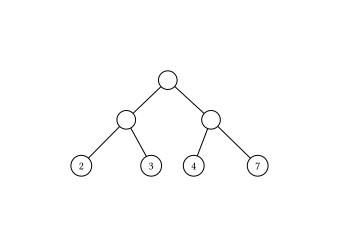
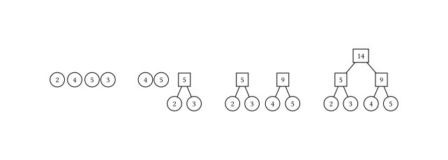
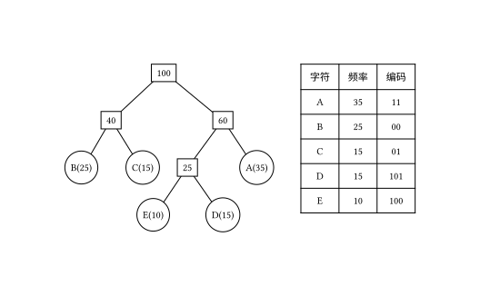

# 霍夫曼树 - OI Wiki

- Source: https://oi-wiki.org/ds/huffman-tree/

# 霍夫曼树

## 树的带权路径长度

设二叉树具有 𝑛n 个带权叶结点，从根结点到各叶结点的路径长度与相应叶节点权值的乘积之和称为 **树的带权路径长度（Weighted Path Length of Tree，WPL）** ．

设 𝑤𝑖wi 为二叉树第 𝑖i 个叶结点的权值，𝑙𝑖li 为从根结点到第 𝑖i 个叶结点的路径长度，则 WPL 计算公式如下：

𝑊𝑃𝐿=𝑛∑𝑖=1𝑤𝑖𝑙𝑖WPL=∑i=1nwili



如上图所示，其 WPL 计算过程与结果如下：

𝑊𝑃𝐿=2∗2+3∗2+4∗2+7∗2=4+6+8+14=32WPL=2∗2+3∗2+4∗2+7∗2=4+6+8+14=32

## 结构

对于给定一组具有确定权值的叶结点，可以构造出不同的二叉树，其中，**WPL 最小的二叉树** 称为 **霍夫曼树（Huffman Tree）** ．

对于霍夫曼树来说，其叶结点权值越小，离根越远，叶结点权值越大，离根越近，此外其仅有叶结点的度为 00，其他结点度均为 22．

## 霍夫曼算法

霍夫曼算法用于构造一棵霍夫曼树，算法步骤如下：

  1. **初始化** ：由给定的 𝑛n 个权值构造 𝑛n 棵只有一个根节点的二叉树，得到一个二叉树集合 𝐹F．
  2. **选取与合并** ：从二叉树集合 𝐹F 中选取根节点权值 **最小的两棵** 二叉树分别作为左右子树构造一棵新的二叉树，这棵新二叉树的根节点的权值为其左、右子树根结点的权值和．
  3. **删除与加入** ：从 𝐹F 中删除作为左、右子树的两棵二叉树，并将新建立的二叉树加入到 𝐹F 中．
  4. 重复 2、3 步，当集合中只剩下一棵二叉树时，这棵二叉树就是霍夫曼树．



### 正确性证明

引理

最优前缀编码树（Huffman 树）中的权值最小的两个叶结点总是最深的叶结点，并且将这两个结点调整为兄弟结点至少不会破坏编码树的最优性．

证明

我们采用反证法来证明该命题．假设在一棵最优前缀编码树中，存在两个权值最小的叶结点，它们不是最深的叶结点．设这两个结点为 𝑎a 和 𝑏b，且它们的深度小于某个最深的叶结点．对于这个最深的叶结点 𝑐c，我们可以将 𝑎a 和 𝑐c 交换位置，或将 𝑏b 和 𝑐c 交换位置．由于 Huffman 算法保证树的每一层按权值最小的叶结点合并，因此在交换后，树的带权路径长度（WPL）将减少．由此矛盾可得出假设不成立，因此权值最小的两个叶结点必须是最深的叶结点．

接下来，假设这两个权值最小的叶结点分别为 𝑎a 和 𝑏b，它们的深度相同．如果在一棵最优前缀编码树中这两个结点不是兄弟结点，假设存在其他结点 𝑐c 和 𝑑d 与 𝑎a 和 𝑏b 分别是兄弟结点（假设 𝑎a 和 𝑐c 是兄弟结点，𝑏b 和 𝑑d 是兄弟结点）．我们可以将 𝑎a 和 𝑏b 合并为一个子树．

  * 如果 𝑎a 和 𝑏b 合并后的权值之和小于 𝑐c 或 𝑑d 的权值，那么我们可以将合并后的子树与权值较大的结点（如 𝑐c 或 𝑑d）合并，形成新的子树，WPL 会减少．
  * 如果 𝑎a 和 𝑏b 的权值之和不小于 𝑐c 和 𝑑d 的权值，我们可以直接将 𝑎a 和 𝑏b 调整为兄弟结点，𝑐c 和 𝑑d 作为另一个兄弟结点，WPL 不会增加．

因此，经过这样的调整，最优性不会被破坏，得证．

定理

Huffman 算法得到的前缀编码树是最优前缀编码树．

证明

我们使用数学归纳法来证明该定理．

  * **基本情况** : 当字母数 𝑛 =2n=2 时，显然，直接将两个字母合并成一棵树即为最优编码树．
  * **归纳假设** : 假设对于字母数 𝑛 =𝑘n=k（𝑘 ≥2k≥2）时，Huffman 算法能够得到最优前缀编码树．
  * **归纳步骤** : 对于字母数 𝑛 =𝑘 +1n=k+1，我们从 𝑘 +1k+1 个字母中选出两个权值最小的字母，将它们合并为一棵子树，子树的根作为虚拟字母（虚拟结点）．根据引理可知，这一操作不会破坏前缀编码树的最优性．此时，虚拟字母与剩下的 𝑘k 个字母一同构成 𝑘 +1k+1 个字母，根据归纳假设，当字母数为 𝑘k 时，Huffman 算法能够得到最优前缀编码树．

因此，通过数学归纳法，Huffman 算法对于任意字母数 𝑛n 都能够得到最优前缀编码树，得证．

## 霍夫曼编码

在进行程序设计时，通常给每一个字符标记一个单独的代码来表示一组字符，即 **编码** ．

在进行二进制编码时，假设所有的代码都等长，那么表示 𝑛n 个不同的字符需要 ⌈log2⁡𝑛⌉⌈log2⁡n⌉ 位，称为 **等长编码** ．

如果每个字符的 **使用频率相等** ，那么等长编码无疑是空间效率最高的编码方法，而如果字符出现的频率不同，则可以让频率高的字符采用尽可能短的编码，频率低的字符采用尽可能长的编码，来构造出一种 **不等长编码** ，从而获得更好的空间效率．

在设计不等长编码时，要考虑解码的唯一性，如果一组编码中任一编码都不是其他任何一个编码的前缀，那么称这组编码为 **前缀编码** ，其保证了编码被解码时的唯一性．

霍夫曼树可用于构造 **最短的前缀编码** ，即 **霍夫曼编码（Huffman Code）** ，其构造步骤如下：

  1. 设需要编码的字符集为：𝑑1,𝑑2,…,𝑑𝑛d1,d2,…,dn，他们在字符串中出现的频率为：𝑤1,𝑤2,…,𝑤𝑛w1,w2,…,wn．
  2. 以 𝑑1,𝑑2,…,𝑑𝑛d1,d2,…,dn 作为叶结点，𝑤1,𝑤2,…,𝑤𝑛w1,w2,…,wn 作为叶结点的权值，构造一棵霍夫曼树．
  3. 规定霍夫曼编码树的左分支代表 00，右分支代表 11，则从根结点到每个叶结点所经过的路径组成的 00、11 序列即为该叶结点对应字符的编码．



## 示例代码

霍夫曼树的构建

```text 1 2 3 4 5 6 7 8 9 10 11 12 13 14 15 16 17 18 19 20 21 22 23 24 25 26 27 28 29 30 31 32 33 34 35 36 37 38 39 40 41 42 43 44 45 46 47 48 49 50 51 52 53 ``` |  ```text struct HNode { int weight ; HNode * lchild , * rchild ; }; using Htree = HNode * ; Htree createHuffmanTree ( int arr [], int n ) { Htree forest [ N ]; Htree root = NULL ; for ( int i = 0 ; i < n ; i ++ ) { // 将所有点存入森林 Htree temp ; temp = ( Htree ) malloc ( sizeof ( HNode )); temp -> weight = arr [ i ]; temp -> lchild = temp -> rchild = NULL ; forest [ i ] = temp ; } for ( int i = 1 ; i < n ; i ++ ) { // n-1 次循环建霍夫曼树 int minn = -1 , minnSub ; // minn 为最小值树根下标，minnsub 为次小值树根下标 for ( int j = 0 ; j < n ; j ++ ) { if ( forest [ j ] != NULL && minn == -1 ) { minn = j ; continue ; } if ( forest [ j ] != NULL ) { minnSub = j ; break ; } } for ( int j = minnSub ; j < n ; j ++ ) { // 根据 minn 与 minnSub 赋值 if ( forest [ j ] != NULL ) { if ( forest [ j ] -> weight < forest [ minn ] -> weight ) { minnSub = minn ; minn = j ; } else if ( forest [ j ] -> weight < forest [ minnSub ] -> weight ) { minnSub = j ; } } } // 建新树 root = ( Htree ) malloc ( sizeof ( HNode )); root -> weight = forest [ minn ] -> weight \+ forest [ minnSub ] -> weight ; root -> lchild = forest [ minn ]; root -> rchild = forest [ minnSub ]; forest [ minn ] = root ; // 指向新树的指针赋给 minn 位置 forest [ minnSub ] = NULL ; // minnSub 位置为空 } return root ; } ```   
---|---  
  
计算构成霍夫曼树的 WPL

```text 1 2 3 4 5 6 7 8 9 10 11 12 13 14 15 16 17 18 19 20 ``` |  ```text struct HNode { int weight ; HNode * lchild , * rchild ; }; using Htree = HNode * ; int getWPL ( Htree root , int len ) { // 递归实现，对于已经建好的霍夫曼树，求 WPL if ( root == NULL ) return 0 ; else { if ( root -> lchild == NULL && root -> rchild == NULL ) // 叶节点 return root -> weight * len ; else { int left = getWPL ( root -> lchild , len \+ 1 ); int right = getWPL ( root -> rchild , len \+ 1 ); return left \+ right ; } } } ```   
---|---  
  
对于未建好的霍夫曼树，直接求其 WPL

```text 1 2 3 4 5 6 7 8 9 10 11 12 13 14 15 16 ``` |  ```text int getWPL ( int arr [], int n ) { // 对于未建好的霍夫曼树，直接求其 WPL priority_queue < int , vector < int > , greater < int >> huffman ; // 小根堆 for ( int i = 0 ; i < n ; i ++ ) huffman . push ( arr [ i ]); int res = 0 ; for ( int i = 0 ; i < n \- 1 ; i ++ ) { int x = huffman . top (); huffman . pop (); int y = huffman . top (); huffman . pop (); int temp = x \+ y ; res += temp ; huffman . push ( temp ); } return res ; } ```   
---|---  
  
对于给定序列，计算霍夫曼编码

```text 1 2 3 4 5 6 7 8 9 10 11 12 13 14 15 16 17 18 19 20 21 ``` |  ```text struct HNode { int weight ; HNode * lchild , * rchild ; }; using Htree = HNode * ; void huffmanCoding ( Htree root , int len , int arr []) { // 计算霍夫曼编码 if ( root != NULL ) { if ( root -> lchild == NULL && root -> rchild == NULL ) { printf ( "结点为 %d 的字符的编码为: " , root -> weight ); for ( int i = 0 ; i < len ; i ++ ) printf ( "%d" , arr [ i ]); printf ( " \n " ); } else { arr [ len ] = 0 ; huffmanCoding ( root -> lchild , len \+ 1 , arr ); arr [ len ] = 1 ; huffmanCoding ( root -> rchild , len \+ 1 , arr ); } } } ```   
---|---  
  
* * *

> __本页面最近更新： 2026/3/9 02:32:28，[更新历史](https://github.com/OI-wiki/OI-wiki/commits/master/docs/ds/huffman-tree.md)  
>  __发现错误？想一起完善？[在 GitHub 上编辑此页！](https://oi-wiki.org/edit-landing/?ref=/ds/huffman-tree.md "edit.link.title")  
>  __本页面贡献者：[Tiphereth-A](https://github.com/Tiphereth-A), [Alex-McAvoy](https://github.com/Alex-McAvoy), [lingkerio](https://github.com/lingkerio), [LvCGame](https://github.com/LvCGame), [1Wizzy](https://github.com/1Wizzy), [c-forrest](https://github.com/c-forrest), [Ir1d](https://github.com/Ir1d), [ksyx](https://github.com/ksyx), [sphcode](https://github.com/sphcode), [StudyingFather](https://github.com/StudyingFather)  
>  __本页面的全部内容在**[CC BY-SA 4.0](https://creativecommons.org/licenses/by-sa/4.0/deed.zh) 和 [SATA](https://github.com/zTrix/sata-license)** 协议之条款下提供，附加条款亦可能应用
