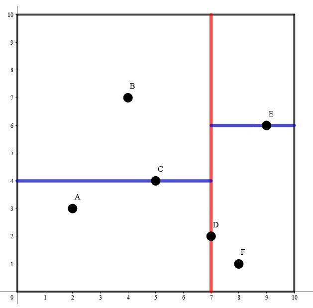
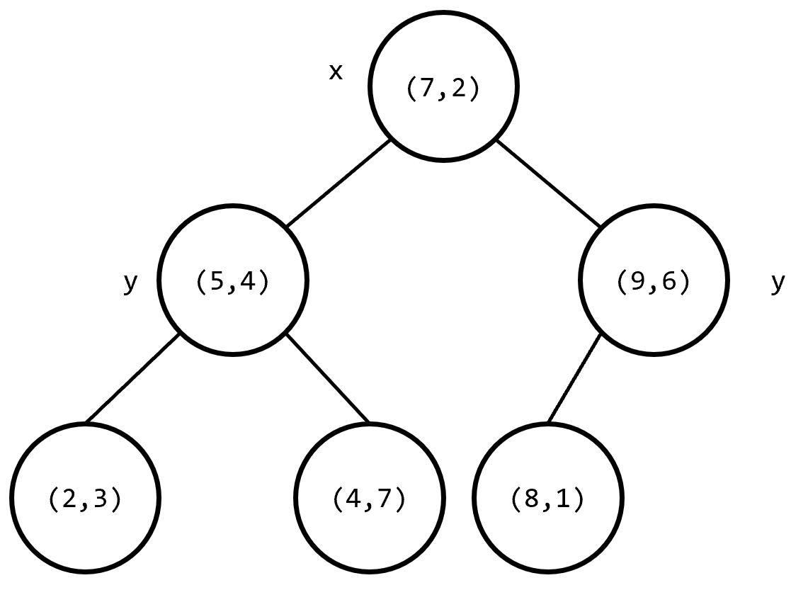

# K-D Tree - OI Wiki

- Source: https://oi-wiki.org/ds/kdt/

# K-D Tree

k-D Tree(KDT , k-Dimension Tree) 是一种可以 **高效处理 𝑘k 维空间信息** 的数据结构．

在结点数 𝑛n 远大于 2𝑘2k 时，应用 k-D Tree 的时间效率很好．

在算法竞赛的题目中，一般有 𝑘 =2k=2．在本页面分析时间复杂度时，将认为 𝑘k 是常数．

## 建树

k-D Tree 具有二叉搜索树的形态，二叉搜索树上的每个结点都对应 𝑘k 维空间内的一个点．其每个子树中的点都在一个 𝑘k 维的超长方体内，这个超长方体内的所有点也都在这个子树中．

假设我们已经知道了 𝑘k 维空间内的 𝑛n 个不同的点的坐标，要将其构建成一棵 k-D Tree，步骤如下：

  1. 若当前超长方体中只有一个点，返回这个点．

  2. 选择一个维度，将当前超长方体按照这个维度分成两个超长方体．

  3. 选择切割点：在选择的维度上选择一个点，这一维度上的值小于这个点的归入一个超长方体（左子树），其余的归入另一个超长方体（右子树）．

  4. 将选择的点作为这棵子树的根节点，递归对分出的两个超长方体构建左右子树，维护子树的信息．

为了方便理解，我们举一个 𝑘 =2k=2 时的例子．



其构建出 k-D Tree 的形态可能是这样的：



其中树上每个结点上的坐标是选择的分割点的坐标，非叶子结点旁的 𝑥x 或 𝑦y 是选择的切割维度．

这样的复杂度无法保证．对于 2,32,3 两步，我们提出两个优化：

  1. 轮流选择 𝑘k 个维度，以保证在任意连续 𝑘k 层里每个维度都被切割到．
  2. 每次在维度上选择切割点时选择该维度上的 **中位数** ，这样可以保证每次分成的左右子树大小尽量相等．

可以发现，使用优化 22 后，构建出的 k-D Tree 的树高最多为 log⁡𝑛 +𝑂(1)log⁡n+O(1)．

现在，构建 k-D Tree 时间复杂度的瓶颈在于快速选出一个维度上的中位数，并将在该维度上的值小于该中位数的置于中位数的左边，其余置于右边．如果每次都使用 `sort` 函数对该维度进行排序，时间复杂度是 𝑂(𝑛log2⁡𝑛)O(nlog2⁡n) 的．事实上，单次找出 𝑛n 个元素中的中位数并将中位数置于排序后正确的位置的复杂度可以达到 𝑂(𝑛)O(n)．

我们来回顾一下快速排序的思想．每次我们选出一个数，将小于该数的置于该数的左边，大于该数的置于该数的右边，保证该数在排好序后正确的位置上，然后递归排序左侧和右侧的值．这样的期望复杂度是 𝑂(𝑛log⁡𝑛)O(nlog⁡n) 的．但是由于 k-D Tree 只要求要中位数在排序后正确的位置上，所以我们只需要递归排序包含中位数的 **一侧** ．可以证明，这样的期望复杂度是 𝑂(𝑛)O(n) 的．在 `algorithm` 库中，有一个实现相同功能的函数 `nth_element()`，要找到 `s[l]` 和 `s[r]` 之间的值按照排序规则 `cmp` 排序后在 `s[mid]` 位置上的值，并保证 `s[mid]` 左边的值小于 `s[mid]`，右边的值大于 `s[mid]`，只需写 `nth_element(s+l,s+mid,s+r+1,cmp)`．

借助这种思想，构建 k-D Tree 时间复杂度是 𝑂(𝑛log⁡𝑛)O(nlog⁡n) 的．

## 高维空间上的操作

在查询高维矩形区域内的所有点的一些信息时，记录每个结点子树内每一维度上的坐标的最大值和最小值．如果当前子树对应的矩形与所求矩形没有交点，则不继续搜索其子树；如果当前子树对应的矩形完全包含在所求矩形内，返回当前子树内所有点的权值和；否则，判断当前点是否在所求矩形内，更新答案并递归在左右子树中查找答案．

实现

```text 1 2 3 4 5 6 7 8 9 10 11 12 13 ``` |  ```text int query ( int p ) { if ( ! p ) return 0 ; bool flag { false }; for ( int k : { 0 , 1 }) flag |= ( ! ( l . x [ k ] <= t [ p ]. L [ k ] && t [ p ]. R [ k ] <= h . x [ k ])); if ( ! flag ) return t [ p ]. sum ; for ( int k : { 0 , 1 }) if ( t [ p ]. R [ k ] < l . x [ k ] || h . x [ k ] < t [ p ]. L [ k ]) return 0 ; int ans { 0 }; flag = false ; for ( int k : { 0 , 1 }) flag |= ( ! ( l . x [ k ] <= t [ p ]. x [ k ] && t [ p ]. x [ k ] <= h . x [ k ])); if ( ! flag ) ans = t [ p ]. v ; return ans += query ( t [ p ]. l ) \+ query ( t [ p ]. r ); } ```   
---|---  
  
### 复杂度分析

先考虑二维的，在查询矩形 𝑅R 时，我们将 k-D Tree 上的结点分为三类：

  1. 与 𝑅R 无交．
  2. 完全被 𝑅R 包含．
  3. 部分被 𝑅R 包含．

显然单次查询的复杂度是第 3 类点的个数．注意到第三类点的矩形要么完全包含 𝑅R，要么互不包含，而前者显然只有 𝑂(ℎ) =𝑂(log⁡𝑛)O(h)=O(log⁡n) 个，现在我们来分析后者的个数．

首先，我们不妨令矩形的所有边偏移 𝜖ϵ，使得查询矩形不穿过已经有的任何点．这样显然是不影响矩形的查询所涵盖的点集的．

注意到互不包含的第 3 类点所对应的矩形，一定有 𝑅R 的一条边穿过之．所以我们只需要计算 𝑅R 的每条边穿过的矩形个数，即任意一条线段最多经过多少个点对应的矩形．

考虑对于某一个结点 𝑢u，它有四个孙子，且它到每一个孙子都在两个维度上各进行了一次划分．经过观察可以发现，按照这种方法将一个矩形划分成四个子矩形，一条与坐标轴平行的线段最多经过两个区域，即从 𝑢u 出发的查询，最多向下进入两个孙子仍有第 3 类点（如果线段刚好与分割边界重合则不一定，但是我们偏移查询矩形边界的操作使得这种情况不存在）．

而因为建树的时候，每个点是其整个子树在当前划分维度上的中位数，所以子树大小必定减半．于是，设 𝑢u 的子树大小为 𝑛n，我们能写出如下递归式：

𝑇(𝑛)=2𝑇(𝑛/4)+𝑂(1)T(n)=2T(n/4)+O(1)

由主定理得 𝑇(𝑛) =𝑂(√𝑛)T(n)=O(n)．

将递归式推广到 𝑘k 维，即 𝑇(𝑛) =2𝑘−1𝑇(𝑛/2𝑘) +𝑂(1)T(n)=2k−1T(n/2k)+O(1)，于是 𝑇(𝑛) =𝑂(𝑛1−1𝑘)T(n)=O(n1−1k)（将 𝑘k 视为常数）．

### 插入/删除

如果维护的这个 𝑘k 维点集是可变的，即可能会插入或删除一些点，此时 k-D Tree 的平衡性无法保证．由于 k-D Tree 的构造，不能支持旋转，类似与 FHQ Treap 的随机优先级也不能保证其复杂度．对此，有两种比较常见的维护方法．

Note

很多选手会使用替罪羊树结构来维护．但是注意到在刚才的复杂度分析中，要求儿子的子树大小严格减半，即树高必须为严格的 log⁡𝑛 +𝑂(1)log⁡n+O(1)，而替罪羊树只满足树高 𝑂(log⁡𝑛)O(log⁡n)，故查询复杂度无法保证．

#### 根号重构

插入的时候，先存下来要插入的点，每 𝐵B 次插入进行一次重构．

删除打个标记即可．如果要求较为严格，可以维护树内有多少个被删除了，达到 𝐵B 则重构．

修改复杂度均摊 𝑂(𝑛log⁡𝑛/𝐵)O(nlog⁡n/B)，查询 𝑂(𝐵 +𝑛1−1𝑘)O(B+n1−1k)，若二者数量同阶则 𝐵 =𝑂(√𝑛log⁡𝑛)B=O(nlog⁡n) 最优（修改 𝑂(√𝑛log⁡𝑛)O(nlog⁡n)，查询 𝑂(√𝑛log⁡𝑛 +𝑛1−1𝑘)O(nlog⁡n+n1−1k)）．

#### 二进制分组

考虑维护若干棵 22 的自然数次幂的 k-D Tree，满足这些树的大小之和为 𝑛n．

插入的时候，新增一棵大小为 11 的 k-D Tree，然后不断将相同大小的树合并（直接拍扁重构）．实现的时候可以只重构一次．

容易发现需要合并的树的大小一定从 2020 开始且指数连续．复杂度类似二进制加法，是均摊 𝑂(𝑛log2⁡𝑛)O(nlog2⁡n) 的，因为重构本身带 loglog．

查询的时候，直接分别在每棵树上查询，复杂度为 𝑂(∑𝑖≥0(𝑛2𝑖)1−1𝑘) =𝑂(𝑛1−1𝑘)O(∑i≥0(n2i)1−1k)=O(n1−1k)．

### 例题

[洛谷 P4148 简单题](https://www.luogu.com.cn/problem/P4148)

在一个初始值全为 00 的 𝑛 ×𝑛n×n 的二维矩阵上，进行 𝑞q 次操作，每次操作为以下两种之一：

  1. `1 x y A`：将坐标 (𝑥,𝑦)(x,y) 上的数加上 𝐴A．
  2. `2 x1 y1 x2 y2`：输出以 (𝑥1,𝑦1)(x1,y1) 为左下角，(𝑥2,𝑦2)(x2,y2) 为右上角的矩形内（包括矩形边界）的数字和．

强制在线．内存限制 `20M`．保证答案及所有过程量在 `int` 范围内．

1 ≤𝑛 ≤500000,1 ≤𝑞 ≤2000001≤n≤500000,1≤q≤200000

20M 的空间卡掉了所有树套树，强制在线卡掉了 CDQ 分治，只能使用 k-D Tree．

以下是二进制分组的参考代码．

参考代码

```text 1 2 3 4 5 6 7 8 9 10 11 12 13 14 15 16 17 18 19 20 21 22 23 24 25 26 27 28 29 30 31 32 33 34 35 36 37 38 39 40 41 42 43 44 45 46 47 48 49 50 51 52 53 54 55 56 57 58 59 60 61 62 63 64 65 66 67 68 69 70 71 72 73 74 75 76 77 78 79 80 81 82 83 84 85 86 87 88 89 90 91 92 93 94 95 96 97 98 99 ``` |  ```text #include <algorithm> #include <iostream> using namespace std ; constexpr int N ( 2e5 ), LG { 18 }; struct pt { int x [ 2 ]; int v , sum ; int l , r ; int L [ 2 ], R [ 2 ]; } t [ N \+ 5 ], l , h ; int rt [ LG ]; int b [ N \+ 5 ], cnt ; void upd ( int p ) { t [ p ]. sum = t [ t [ p ]. l ]. sum \+ t [ t [ p ]. r ]. sum \+ t [ p ]. v ; for ( int k : { 0 , 1 }) { t [ p ]. L [ k ] = t [ p ]. R [ k ] = t [ p ]. x [ k ]; if ( t [ p ]. l ) { t [ p ]. L [ k ] = min ( t [ p ]. L [ k ], t [ t [ p ]. l ]. L [ k ]); t [ p ]. R [ k ] = max ( t [ p ]. R [ k ], t [ t [ p ]. l ]. R [ k ]); } if ( t [ p ]. r ) { t [ p ]. L [ k ] = min ( t [ p ]. L [ k ], t [ t [ p ]. r ]. L [ k ]); t [ p ]. R [ k ] = max ( t [ p ]. R [ k ], t [ t [ p ]. r ]. R [ k ]); } } } int build ( int l , int r , int dep = 0 ) { int p {( l \+ r ) >> 1 }; nth_element ( b \+ l , b \+ p , b \+ r \+ 1 , [ dep ]( int x , int y ) { return t [ x ]. x [ dep ] < t [ y ]. x [ dep ]; }); int x { b [ p ]}; if ( l < p ) t [ x ]. l = build ( l , p \- 1 , dep ^ 1 ); if ( p < r ) t [ x ]. r = build ( p \+ 1 , r , dep ^ 1 ); upd ( x ); return x ; } void append ( int & p ) { if ( ! p ) return ; b [ ++ cnt ] = p ; append ( t [ p ]. l ); append ( t [ p ]. r ); p = 0 ; } int query ( int p ) { if ( ! p ) return 0 ; bool flag { false }; for ( int k : { 0 , 1 }) flag |= ( ! ( l . x [ k ] <= t [ p ]. L [ k ] && t [ p ]. R [ k ] <= h . x [ k ])); if ( ! flag ) return t [ p ]. sum ; for ( int k : { 0 , 1 }) if ( t [ p ]. R [ k ] < l . x [ k ] || h . x [ k ] < t [ p ]. L [ k ]) return 0 ; int ans { 0 }; flag = false ; for ( int k : { 0 , 1 }) flag |= ( ! ( l . x [ k ] <= t [ p ]. x [ k ] && t [ p ]. x [ k ] <= h . x [ k ])); if ( ! flag ) ans = t [ p ]. v ; return ans += query ( t [ p ]. l ) \+ query ( t [ p ]. r ); } int main () { int n ; cin >> n ; int lst { 0 }; n = 0 ; while ( true ) { int op ; cin >> op ; if ( op == 1 ) { int x , y , A ; cin >> x >> y >> A ; x ^= lst ; y ^= lst ; A ^= lst ; t [ ++ n ] = {{ x , y }, A }; b [ cnt = 1 ] = n ; for ( int sz { 0 };; ++ sz ) if ( ! rt [ sz ]) { rt [ sz ] = build ( 1 , cnt ); break ; } else append ( rt [ sz ]); } else if ( op == 2 ) { cin >> l . x [ 0 ] >> l . x [ 1 ] >> h . x [ 0 ] >> h . x [ 1 ]; l . x [ 0 ] ^= lst ; l . x [ 1 ] ^= lst ; h . x [ 0 ] ^= lst ; h . x [ 1 ] ^= lst ; lst = 0 ; for ( int i { 0 }; i < LG ; ++ i ) lst += query ( rt [ i ]); cout << lst << " \n " ; } else break ; } return 0 ; } ```   
---|---  
  
## 邻域查询

Warning

使用 k-D Tree 单次查询最近点的时间复杂度最坏还是 𝑂(𝑛)O(n) 的，但不失为一种优秀的骗分算法，使用时请注意．在这里对邻域查询的讲解仅限于加强对 k-D Tree 结构的认识．

例题 [luogu P1429 平面最近点对（加强版）](https://www.luogu.com.cn/problem/P1429)

给定平面上的 𝑛n 个点 (𝑥𝑖,𝑦𝑖)(xi,yi)，找出平面上最近两个点对之间的 [欧几里得距离](../../geometry/distance/#欧氏距离)．

2 ≤𝑛 ≤200000,0 ≤𝑥𝑖,𝑦𝑖 ≤1092≤n≤200000,0≤xi,yi≤109

首先建出关于这 𝑛n 个点的 2-D Tree．

枚举每个结点，对于每个结点找到不等于该结点且距离最小的点，即可求出答案．每次暴力遍历 2-D Tree 上的每个结点的时间复杂度是 𝑂(𝑛)O(n) 的，需要剪枝．我们可以维护一个子树中的所有结点在每一维上的坐标的最小值和最大值．假设当前已经找到的最近点对的距离是 𝑎𝑛𝑠ans，如果查询点到子树内所有点都包含在内的长方形的 **最近** 距离大于等于 𝑎𝑛𝑠ans，则在这个子树内一定没有答案，搜索时不进入这个子树．

此外，还可以使用一种启发式搜索的方法，即若一个结点的两个子树都有可能包含答案，先在与查询点距离最近的一个子树中搜索答案．可以认为，**查询点到子树对应的长方形的最近距离就是此题的估价函数** ．

参考代码

```text 1 2 3 4 5 6 7 8 9 10 11 12 13 14 15 16 17 18 19 20 21 22 23 24 25 26 27 28 29 30 31 32 33 34 35 36 37 38 39 40 41 42 43 44 45 46 47 48 49 50 51 52 53 54 55 56 57 58 59 60 61 62 63 64 65 66 67 68 69 70 71 72 73 74 75 76 77 78 79 80 81 82 83 84 85 86 87 88 89 90 91 92 93 94 95 96 97 98 ``` |  ```text #include <algorithm> #include <cmath> #include <cstdlib> #include <cstring> #include <iomanip> #include <iostream> using namespace std ; constexpr int MAXN = 200010 ; int n , d [ MAXN ], lc [ MAXN ], rc [ MAXN ]; double ans = 2e18 ; struct node { double x , y ; } s [ MAXN ]; double L [ MAXN ], R [ MAXN ], D [ MAXN ], U [ MAXN ]; double dist ( int a , int b ) { return ( s [ a ]. x \- s [ b ]. x ) * ( s [ a ]. x \- s [ b ]. x ) \+ ( s [ a ]. y \- s [ b ]. y ) * ( s [ a ]. y \- s [ b ]. y ); } bool cmp1 ( node a , node b ) { return a . x < b . x ; } bool cmp2 ( node a , node b ) { return a . y < b . y ; } void maintain ( int x ) { L [ x ] = R [ x ] = s [ x ]. x ; D [ x ] = U [ x ] = s [ x ]. y ; if ( lc [ x ]) L [ x ] = min ( L [ x ], L [ lc [ x ]]), R [ x ] = max ( R [ x ], R [ lc [ x ]]), D [ x ] = min ( D [ x ], D [ lc [ x ]]), U [ x ] = max ( U [ x ], U [ lc [ x ]]); if ( rc [ x ]) L [ x ] = min ( L [ x ], L [ rc [ x ]]), R [ x ] = max ( R [ x ], R [ rc [ x ]]), D [ x ] = min ( D [ x ], D [ rc [ x ]]), U [ x ] = max ( U [ x ], U [ rc [ x ]]); } int build ( int l , int r ) { if ( l > r ) return 0 ; if ( l == r ) { maintain ( l ); return l ; } int mid = ( l \+ r ) >> 1 ; double avx = 0 , avy = 0 , vax = 0 , vay = 0 ; // average variance for ( int i = l ; i <= r ; i ++ ) avx += s [ i ]. x , avy += s [ i ]. y ; avx /= ( double )( r \- l \+ 1 ); avy /= ( double )( r \- l \+ 1 ); for ( int i = l ; i <= r ; i ++ ) vax += ( s [ i ]. x \- avx ) * ( s [ i ]. x \- avx ), vay += ( s [ i ]. y \- avy ) * ( s [ i ]. y \- avy ); if ( vax >= vay ) d [ mid ] = 1 , nth_element ( s \+ l , s \+ mid , s \+ r \+ 1 , cmp1 ); else d [ mid ] = 2 , nth_element ( s \+ l , s \+ mid , s \+ r \+ 1 , cmp2 ); lc [ mid ] = build ( l , mid \- 1 ), rc [ mid ] = build ( mid \+ 1 , r ); maintain ( mid ); return mid ; } double f ( int a , int b ) { double ret = 0 ; if ( L [ b ] > s [ a ]. x ) ret += ( L [ b ] \- s [ a ]. x ) * ( L [ b ] \- s [ a ]. x ); if ( R [ b ] < s [ a ]. x ) ret += ( s [ a ]. x \- R [ b ]) * ( s [ a ]. x \- R [ b ]); if ( D [ b ] > s [ a ]. y ) ret += ( D [ b ] \- s [ a ]. y ) * ( D [ b ] \- s [ a ]. y ); if ( U [ b ] < s [ a ]. y ) ret += ( s [ a ]. y \- U [ b ]) * ( s [ a ]. y \- U [ b ]); return ret ; } void query ( int l , int r , int x ) { if ( l > r ) return ; int mid = ( l \+ r ) >> 1 ; if ( mid != x ) ans = min ( ans , dist ( x , mid )); if ( l == r ) return ; double distl = f ( x , lc [ mid ]), distr = f ( x , rc [ mid ]); if ( distl < ans && distr < ans ) { if ( distl < distr ) { query ( l , mid \- 1 , x ); if ( distr < ans ) query ( mid \+ 1 , r , x ); } else { query ( mid \+ 1 , r , x ); if ( distl < ans ) query ( l , mid \- 1 , x ); } } else { if ( distl < ans ) query ( l , mid \- 1 , x ); if ( distr < ans ) query ( mid \+ 1 , r , x ); } } int main () { cin . tie ( nullptr ) -> sync_with_stdio ( false ); cin >> n ; for ( int i = 1 ; i <= n ; i ++ ) cin >> s [ i ]. x >> s [ i ]. y ; build ( 1 , n ); for ( int i = 1 ; i <= n ; i ++ ) query ( 1 , n , i ); cout << fixed << setprecision ( 4 ) << sqrt ( ans ) << '\n' ; return 0 ; } ```   
---|---  
  
例题 [「CQOI2016」K 远点对](https://loj.ac/problem/2043)

给定平面上的 𝑛n 个点 (𝑥𝑖,𝑦𝑖)(xi,yi)，求欧几里得距离下的第 𝑘k 远无序点对之间的距离．

𝑛 ≤100000,1 ≤𝑘 ≤100,0 ≤𝑥𝑖,𝑦𝑖 <231n≤100000,1≤k≤100,0≤xi,yi<231

和上一道例题类似，从最近点对变成了 𝑘k 远点对，估价函数改成了查询点到子树对应的长方形区域的最远距离．用一个小根堆来维护当前找到的前 𝑘k 远点对之间的距离，如果当前找到的点对距离大于堆顶，则弹出堆顶并插入这个距离，同样的，使用堆顶的距离来剪枝．

由于题目中强调的是无序点对，即交换前后两点的顺序后仍是相同的点对，则每个有序点对会被计算两次，那么读入的 𝑘k 要乘以 22．

参考代码

```text 1 2 3 4 5 6 7 8 9 10 11 12 13 14 15 16 17 18 19 20 21 22 23 24 25 26 27 28 29 30 31 32 33 34 35 36 37 38 39 40 41 42 43 44 45 46 47 48 49 50 51 52 53 54 55 56 57 58 59 60 61 62 63 64 65 66 67 68 69 70 71 72 73 74 75 76 77 78 79 80 81 82 83 84 85 86 87 ``` |  ```text #include <algorithm> #include <cstring> #include <iostream> #include <queue> using namespace std ; constexpr int MAXN = 100010 ; long long n , k ; priority_queue < long long , vector < long long > , greater < long long >> q ; struct node { long long x , y ; } s [ MAXN ]; bool cmp1 ( node a , node b ) { return a . x < b . x ; } bool cmp2 ( node a , node b ) { return a . y < b . y ; } long long lc [ MAXN ], rc [ MAXN ], L [ MAXN ], R [ MAXN ], D [ MAXN ], U [ MAXN ]; void maintain ( int x ) { L [ x ] = R [ x ] = s [ x ]. x ; D [ x ] = U [ x ] = s [ x ]. y ; if ( lc [ x ]) L [ x ] = min ( L [ x ], L [ lc [ x ]]), R [ x ] = max ( R [ x ], R [ lc [ x ]]), D [ x ] = min ( D [ x ], D [ lc [ x ]]), U [ x ] = max ( U [ x ], U [ lc [ x ]]); if ( rc [ x ]) L [ x ] = min ( L [ x ], L [ rc [ x ]]), R [ x ] = max ( R [ x ], R [ rc [ x ]]), D [ x ] = min ( D [ x ], D [ rc [ x ]]), U [ x ] = max ( U [ x ], U [ rc [ x ]]); } int build ( int l , int r ) { if ( l > r ) return 0 ; int mid = ( l \+ r ) >> 1 ; double av1 = 0 , av2 = 0 , va1 = 0 , va2 = 0 ; // average variance for ( int i = l ; i <= r ; i ++ ) av1 += s [ i ]. x , av2 += s [ i ]. y ; av1 /= ( r \- l \+ 1 ); av2 /= ( r \- l \+ 1 ); for ( int i = l ; i <= r ; i ++ ) va1 += ( av1 \- s [ i ]. x ) * ( av1 \- s [ i ]. x ), va2 += ( av2 \- s [ i ]. y ) * ( av2 \- s [ i ]. y ); if ( va1 > va2 ) nth_element ( s \+ l , s \+ mid , s \+ r \+ 1 , cmp1 ); else nth_element ( s \+ l , s \+ mid , s \+ r \+ 1 , cmp2 ); lc [ mid ] = build ( l , mid \- 1 ); rc [ mid ] = build ( mid \+ 1 , r ); maintain ( mid ); return mid ; } long long sq ( long long x ) { return x * x ; } long long dist ( int a , int b ) { return max ( sq ( s [ a ]. x \- L [ b ]), sq ( s [ a ]. x \- R [ b ])) \+ max ( sq ( s [ a ]. y \- D [ b ]), sq ( s [ a ]. y \- U [ b ])); } void query ( int l , int r , int x ) { if ( l > r ) return ; int mid = ( l \+ r ) >> 1 ; long long t = sq ( s [ mid ]. x \- s [ x ]. x ) \+ sq ( s [ mid ]. y \- s [ x ]. y ); if ( t > q . top ()) q . pop (), q . push ( t ); long long distl = dist ( x , lc [ mid ]), distr = dist ( x , rc [ mid ]); if ( distl > q . top () && distr > q . top ()) { if ( distl > distr ) { query ( l , mid \- 1 , x ); if ( distr > q . top ()) query ( mid \+ 1 , r , x ); } else { query ( mid \+ 1 , r , x ); if ( distl > q . top ()) query ( l , mid \- 1 , x ); } } else { if ( distl > q . top ()) query ( l , mid \- 1 , x ); if ( distr > q . top ()) query ( mid \+ 1 , r , x ); } } int main () { cin >> n >> k ; k *= 2 ; for ( int i = 1 ; i <= k ; i ++ ) q . push ( 0 ); for ( int i = 1 ; i <= n ; i ++ ) cin >> s [ i ]. x >> s [ i ]. y ; build ( 1 , n ); for ( int i = 1 ; i <= n ; i ++ ) query ( 1 , n , i ); cout << q . top () << endl ; return 0 ; } ```   
---|---  
  
## 习题

[「SDOI2010」捉迷藏](https://www.luogu.com.cn/problem/P2479)

[「Violet」天使玩偶/SJY 摆棋子](https://www.luogu.com.cn/problem/P4169)

[「国家集训队」JZPFAR](https://www.luogu.com.cn/problem/P2093)

[「BOI2007」Mokia 摩基亚](https://www.luogu.com.cn/problem/P4390)

[luogu P4475 巧克力王国](https://www.luogu.com.cn/problem/P4475)

[「CH 弱省胡策 R2」TATT](https://www.luogu.com.cn/problem/P3769)

* * *

>  __本页面最近更新： 2026/1/7 08:56:54，[更新历史](https://github.com/OI-wiki/OI-wiki/commits/master/docs/ds/kdt.md)  
>  __发现错误？想一起完善？[在 GitHub 上编辑此页！](https://oi-wiki.org/edit-landing/?ref=/ds/kdt.md "edit.link.title")  
>  __本页面贡献者：[Ir1d](https://github.com/Ir1d), [hsfzLZH1](https://github.com/hsfzLZH1), [ouuan](https://github.com/ouuan), [Enter-tainer](https://github.com/Enter-tainer), [JosephusW](https://github.com/JosephusW), [Tiphereth-A](https://github.com/Tiphereth-A), [AC-Stray](https://github.com/AC-Stray), [c-forrest](https://github.com/c-forrest), [CCXXXI](https://github.com/CCXXXI), [Chrogeek](https://github.com/Chrogeek), [Eletary](https://github.com/Eletary), [Henry-ZHR](https://github.com/Henry-ZHR), [kenlig](https://github.com/kenlig), [ksyx](https://github.com/ksyx), [minamimelon](https://github.com/minamimelon), [Rainboylvx](https://github.com/Rainboylvx), [shuzhouliu](https://github.com/shuzhouliu), [StudyingFather](https://github.com/StudyingFather), [Xeonacid](https://github.com/Xeonacid)  
>  __本页面的全部内容在**[CC BY-SA 4.0](https://creativecommons.org/licenses/by-sa/4.0/deed.zh) 和 [SATA](https://github.com/zTrix/sata-license)** 协议之条款下提供，附加条款亦可能应用
