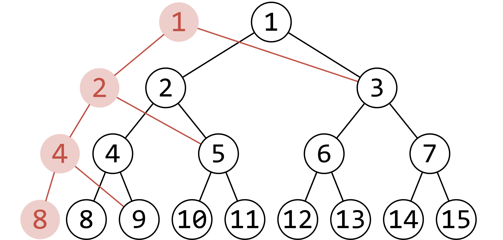

# 可持久化线段树 - OI Wiki

- Source: https://oi-wiki.org/ds/persistent-seg/

# 可持久化线段树

## 主席树

主席树全称是可持久化权值线段树，参见 [知乎讨论](https://www.zhihu.com/question/59195374)．

关于函数式线段树

**函数式线段树** 是指使用函数式编程思想的线段树．在函数式编程思想中，将计算机运算视为数学函数，并避免可改变的状态或变量．不难发现，函数式线段树是 [完全可持久化](../persistent/#完全可持久化-fully-persistent) 的．

## 引入

先引入一道题目：给定 𝑛n 个整数构成的序列 𝑎a，将对于指定的闭区间 [𝑙,𝑟][l,r] 查询其区间内的第 𝑘k 小值．

你该如何解决？

一种可行的方案是：使用主席树． 主席树的主要思想就是：保存每次插入操作时的历史版本，以便查询区间第 𝑘k 小．

怎么保存呢？简单暴力一点，每次开一棵线段树呗．  
那空间还不爆掉？

## 解释

我们分析一下，发现每次修改操作修改的点的个数是一样的．  
（例如下图，修改了 [1,8][1,8] 中对应权值为 1 的结点，红色的点即为更改的点）  


只更改了 𝑂(log⁡𝑛)O(log⁡n) 个结点，形成一条链，也就是说每次更改的结点数 = 树的高度．  
注意主席树不能使用堆式存储法，就是说不能用 𝑥 ×2x×2，𝑥 ×2 +1x×2+1 来表示左右儿子，而是应该动态开点，并保存每个节点的左右儿子编号．  
所以我们只要在记录左右儿子的基础上，保存插入每个数的时候的根节点就可以实现持久化了．

我们把问题简化一下：每次求 [1,𝑟][1,r] 区间内的 𝑘k 小值．  
怎么做呢？只需要找到插入 r 时的根节点版本，然后用普通权值线段树（有的叫键值线段树/值域线段树）做就行了．

这个相信大家都能理解，回到原问题——求 [𝑙,𝑟][l,r] 区间 𝑘k 小值．  
这里我们再联系另外一个知识：**前缀和** ．  
这个小东西巧妙运用了区间减法的性质，通过预处理从而达到 𝑂(1)O(1) 回答每个询问．

我们可以发现，主席树统计的信息也满足这个性质．  
所以……如果需要得到 [𝑙,𝑟][l,r] 的统计信息，只需要用 [1,𝑟][1,r] 的信息减去 [1,𝑙 −1][1,l−1] 的信息就行了．

至此，该问题解决！

关于空间问题，我们分析一下：由于我们是动态开点的，所以一棵线段树只会出现 2𝑛 −12n−1 个结点．  
然后，有 𝑛n 次修改，每次至多增加 ⌈log2⁡𝑛⌉ +1⌈log2⁡n⌉+1 个结点．因此，最坏情况下 𝑛n 次修改后的结点总数会达到 2𝑛 −1 +𝑛(⌈log2⁡𝑛⌉ +1)2n−1+n(⌈log2⁡n⌉+1)． 此题的 𝑛 ≤105n≤105，单次修改至多增加 ⌈log2⁡105⌉ +1 =18⌈log2⁡105⌉+1=18 个结点，故 𝑛n 次修改后的结点总数为 2 ×105 −1 +18 ×1052×105−1+18×105，忽略掉 −1−1，大概就是 20 ×10520×105．

最后给一个忠告：千万不要吝啬空间（大多数题目中空间限制都较为宽松，因此一般不用担心空间超限的问题）！大胆一点，直接上个 25 ×10525×105，接近原空间的两倍（即 `n << 5`）．

## 实现

```text 1 2 3 4 5 6 7 8 9 10 11 12 13 14 15 16 17 18 19 20 21 22 23 24 25 26 27 28 29 30 31 32 33 34 35 36 37 38 39 40 41 42 43 44 45 46 47 48 49 50 51 52 53 54 55 56 57 58 59 60 61 62 63 64 65 66 67 68 69 ``` |  ```text #include <algorithm> #include <cstdio> #include <cstring> using namespace std ; constexpr int MAXN = 1e5 ; // 数据范围 int tot , n , m ; int sum [( MAXN << 5 ) \+ 10 ], rt [ MAXN \+ 10 ], ls [( MAXN << 5 ) \+ 10 ], rs [( MAXN << 5 ) \+ 10 ]; int a [ MAXN \+ 10 ], ind [ MAXN \+ 10 ], len ; int getid ( const int & val ) { // 离散化 return lower_bound ( ind \+ 1 , ind \+ len \+ 1 , val ) \- ind ; } int build ( int l , int r ) { // 建树 int root = ++ tot ; if ( l == r ) return root ; int mid = l \+ r >> 1 ; ls [ root ] = build ( l , mid ); rs [ root ] = build ( mid \+ 1 , r ); return root ; // 返回该子树的根节点 } int update ( int k , int l , int r , int root ) { // 插入操作 int dir = ++ tot ; ls [ dir ] = ls [ root ], rs [ dir ] = rs [ root ], sum [ dir ] = sum [ root ] \+ 1 ; if ( l == r ) return dir ; int mid = l \+ r >> 1 ; if ( k <= mid ) ls [ dir ] = update ( k , l , mid , ls [ dir ]); else rs [ dir ] = update ( k , mid \+ 1 , r , rs [ dir ]); return dir ; } int query ( int u , int v , int l , int r , int k ) { // 查询操作 int mid = l \+ r >> 1 , x = sum [ ls [ v ]] \- sum [ ls [ u ]]; // 通过区间减法得到左儿子中所存储的数值个数 if ( l == r ) return l ; if ( k <= x ) // 若 k 小于等于 x ，则说明第 k 小的数字存储在在左儿子中 return query ( ls [ u ], ls [ v ], l , mid , k ); else // 否则说明在右儿子中 return query ( rs [ u ], rs [ v ], mid \+ 1 , r , k \- x ); } void init () { scanf ( "%d%d" , & n , & m ); for ( int i = 1 ; i <= n ; ++ i ) scanf ( "%d" , a \+ i ); memcpy ( ind , a , sizeof ind ); sort ( ind \+ 1 , ind \+ n \+ 1 ); len = unique ( ind \+ 1 , ind \+ n \+ 1 ) \- ind \- 1 ; rt [ 0 ] = build ( 1 , len ); for ( int i = 1 ; i <= n ; ++ i ) rt [ i ] = update ( getid ( a [ i ]), 1 , len , rt [ i \- 1 ]); } int l , r , k ; void work () { while ( m \-- ) { scanf ( "%d%d%d" , & l , & r , & k ); printf ( "%d \n " , ind [ query ( rt [ l \- 1 ], rt [ r ], 1 , len , k )]); // 回答询问 } } int main () { init (); work (); return 0 ; } ```   
---|---  
  
## 拓展：基于主席树的可持久化并查集

主席树是实现可持久化并查集的便捷方式，在此也提供一个基于主席树的可持久化并查集实现示例．

```text 1 2 3 4 5 6 7 8 9 10 11 12 13 14 15 16 17 18 19 20 21 22 23 24 25 26 27 28 29 30 31 32 33 34 35 36 37 38 39 40 41 42 43 44 45 46 47 48 49 50 51 52 53 54 55 56 57 58 59 60 61 62 63 64 65 66 67 68 69 70 71 72 73 74 75 76 77 78 79 80 81 82 83 84 85 86 87 88 89 90 91 92 93 94 95 96 97 98 99 100 101 102 103 104 105 106 107 108 109 110 111 112 113 114 115 116 117 118 119 120 121 122 123 124 125 126 127 ``` |  ```text #include <algorithm> #include <iostream> using namespace std ; struct SegmentTree { int lc , rc , val , rnk ; }; constexpr int MAXN = 100000 \+ 5 ; constexpr int MAXM = 200000 \+ 5 ; SegmentTree t [ MAXN * 2 \+ MAXM * 40 ]; // 每次操作1会修改两次，一次修改父节点，一次修改父节点的秩 int rt [ MAXM ]; int n , m , tot ; int build ( int l , int r ) { int p = ++ tot ; if ( l == r ) { t [ p ]. val = l ; t [ p ]. rnk = 1 ; return p ; } int mid = ( l \+ r ) / 2 ; t [ p ]. lc = build ( l , mid ); t [ p ]. rc = build ( mid \+ 1 , r ); return p ; } int getRnk ( int p , int l , int r , int pos ) { // 查询秩 if ( l == r ) { return t [ p ]. rnk ; } int mid = ( l \+ r ) / 2 ; if ( pos <= mid ) { return getRnk ( t [ p ]. lc , l , mid , pos ); } else { return getRnk ( t [ p ]. rc , mid \+ 1 , r , pos ); } } int modifyRnk ( int now , int l , int r , int pos , int val ) { // 修改秩（高度） int p = ++ tot ; t [ p ] = t [ now ]; if ( l == r ) { t [ p ]. rnk = max ( t [ p ]. rnk , val ); return p ; } int mid = ( l \+ r ) / 2 ; if ( pos <= mid ) { t [ p ]. lc = modifyRnk ( t [ now ]. lc , l , mid , pos , val ); } else { t [ p ]. rc = modifyRnk ( t [ now ]. rc , mid \+ 1 , r , pos , val ); } return p ; } int query ( int p , int l , int r , int pos ) { // 查询父节点（序列中的值） if ( l == r ) { return t [ p ]. val ; } int mid = ( l \+ r ) / 2 ; if ( pos <= mid ) { return query ( t [ p ]. lc , l , mid , pos ); } else { return query ( t [ p ]. rc , mid \+ 1 , r , pos ); } } int findRoot ( int p , int pos ) { // 查询根节点 int f = query ( p , 1 , n , pos ); if ( pos == f ) { return pos ; } return findRoot ( p , f ); } int modify ( int now , int l , int r , int pos , int fa ) { // 修改父节点（合并） int p = ++ tot ; t [ p ] = t [ now ]; if ( l == r ) { t [ p ]. val = fa ; return p ; } int mid = ( l \+ r ) / 2 ; if ( pos <= mid ) { t [ p ]. lc = modify ( t [ now ]. lc , l , mid , pos , fa ); } else { t [ p ]. rc = modify ( t [ now ]. rc , mid \+ 1 , r , pos , fa ); } return p ; } int main () { cin . tie ( nullptr ) -> sync_with_stdio ( false ); cin >> n >> m ; rt [ 0 ] = build ( 1 , n ); for ( int i = 1 ; i <= m ; i ++ ) { int op , a , b ; cin >> op ; if ( op == 1 ) { cin >> a >> b ; int fa = findRoot ( rt [ i \- 1 ], a ), fb = findRoot ( rt [ i \- 1 ], b ); if ( fa != fb ) { if ( getRnk ( rt [ i \- 1 ], 1 , n , fa ) > getRnk ( rt [ i \- 1 ], 1 , n , fb )) { // 按秩合并 swap ( fa , fb ); } int tmp = modify ( rt [ i \- 1 ], 1 , n , fa , fb ); rt [ i ] = modifyRnk ( tmp , 1 , n , fb , getRnk ( rt [ i \- 1 ], 1 , n , fa ) \+ 1 ); } else { rt [ i ] = rt [ i \- 1 ]; } } else if ( op == 2 ) { cin >> a ; rt [ i ] = rt [ a ]; } else { cin >> a >> b ; rt [ i ] = rt [ i \- 1 ]; cout << ( findRoot ( rt [ i ], a ) == findRoot ( rt [ i ], b )) << '\n' ; } } return 0 ; } ```   
---|---  
  
## 参考

<https://en.wikipedia.org/wiki/Persistent_data_structure>

<https://www.cnblogs.com/zinthos/p/3899565.html>

* * *

>  __本页面最近更新： 2026/1/7 08:56:54，[更新历史](https://github.com/OI-wiki/OI-wiki/commits/master/docs/ds/persistent-seg.md)  
>  __发现错误？想一起完善？[在 GitHub 上编辑此页！](https://oi-wiki.org/edit-landing/?ref=/ds/persistent-seg.md "edit.link.title")  
>  __本页面贡献者：[Ir1d](https://github.com/Ir1d), [H-J-Granger](https://github.com/H-J-Granger), [StudyingFather](https://github.com/StudyingFather), [EndlessCheng](https://github.com/EndlessCheng), [Enter-tainer](https://github.com/Enter-tainer), [countercurrent-time](https://github.com/countercurrent-time), [NachtgeistW](https://github.com/NachtgeistW), [cjsoft](https://github.com/cjsoft), [Tiphereth-A](https://github.com/Tiphereth-A), [abc1763613206](https://github.com/abc1763613206), [Alpha1022](https://github.com/Alpha1022), [AngelKitty](https://github.com/AngelKitty), [CCXXXI](https://github.com/CCXXXI), [diauweb](https://github.com/diauweb), [Early0v0](https://github.com/Early0v0), [ezoixx130](https://github.com/ezoixx130), [GekkaSaori](https://github.com/GekkaSaori), [Konano](https://github.com/Konano), [LovelyBuggies](https://github.com/LovelyBuggies), [Makkiy](https://github.com/Makkiy), [mgt](mailto:i@margatroid.xyz), [minghu6](https://github.com/minghu6), [ouuan](https://github.com/ouuan), [P-Y-Y](https://github.com/P-Y-Y), [PotassiumWings](https://github.com/PotassiumWings), [SamZhangQingChuan](https://github.com/SamZhangQingChuan), [sshwy](https://github.com/sshwy), [Suyun514](mailto:suyun514@qq.com), [weiyong1024](https://github.com/weiyong1024), [billchenchina](https://github.com/billchenchina), [ChungZH](https://github.com/ChungZH), [FinParker](https://github.com/FinParker), [GavinZhengOI](https://github.com/GavinZhengOI), [Gesrua](https://github.com/Gesrua), [Honeta](https://github.com/Honeta), [hsfzLZH1](https://github.com/hsfzLZH1), [iamtwz](https://github.com/iamtwz), [ksyx](https://github.com/ksyx), [kxccc](https://github.com/kxccc), [lychees](https://github.com/lychees), [Marcythm](https://github.com/Marcythm), [Peanut-Tang](https://github.com/Peanut-Tang), [renbaoshuo](https://github.com/renbaoshuo), [SukkaW](https://github.com/SukkaW), [william-song-shy](https://github.com/william-song-shy)  
>  __本页面的全部内容在**[CC BY-SA 4.0](https://creativecommons.org/licenses/by-sa/4.0/deed.zh) 和 [SATA](https://github.com/zTrix/sata-license)** 协议之条款下提供，附加条款亦可能应用
