# PQ 树 - OI Wiki

- Source: https://oi-wiki.org/ds/pq-tree/

# PQ 树

PQ 树是一种基于树的数据结构，代表一组元素上的一系列排列，由 Kellogg S. Booth 和 George S. Lueker 于 1976 年发现命名，用来解决以下问题

> 给出 𝑚m 个集合 𝑆𝑖Si，你要找到一个 1 ∼𝑛1∼n 的排列，使得每个集合内的元素都相邻．

PQ 树可以在 𝑂(𝑛 +∑|𝑆𝑖|)O(n+∑|Si|) 时间内构建．本文中介绍的构建方法时间复杂度为 𝑂(𝑛𝑚)O(nm)．

## 定义

PQ 树有三种结点：**叶子结点** 、**P 结点** 和 **Q 结点** ．其中叶子结点代表排列中的一个元素，P 结点表示它的子结点可以任意排列，Q 结点表示它的儿子顺序可以反转．所有非叶子结点都是 P 结点或 Q 结点中的一种．P 结点至少有 2 个儿子，Q 结点至少有 3 个儿子．  
由于结点的定义，PQ 树本身代表了 **所有的** 合法方案，其先序遍历就是其中之一．  
下图是一棵 PQ 树．  
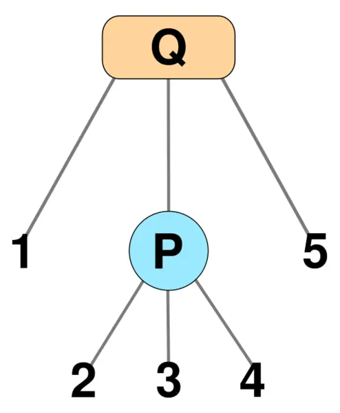  
其先序遍历 1,2,3,4,5 代表了一个合法方案．如果 P 结点的儿子重排列为 4,2,3，我们得到了另一个合法方案 1,4,2,3,5．保持 P 结点儿子顺序不变，Q 结点的儿子顺序反转，得到了另一个合法方案 5,3,2,4,1．

## 构建

**PQ 树使用儿子 - 兄弟表示法．**

我们增量构建一棵 PQ 树．

首先建立一棵树，其根为 P，总共 𝑛n 个儿子，分别是 1,2,…,𝑛1,2,…,n，代表没有任何限制时的 PQ 树．随着限制的不断加入，我们不断修改这棵树．

当加入一个新的限制集合 𝑆S 时，我们把所有属于这个集合的叶子结点标记为 **黑色** ，不在这个集合内的叶子结点标记为 **白色** ．对于所有非叶子结点，如果其所有儿子均为黑色，将其也标记为黑色；如果其所有儿子均为白色，将其也标记为白色；否则将其标记为 **灰色** ．在下面的图中，黑色结点、白色结点、灰色结点分别用黑色、灰色、一半黑一半灰来表示．

我们要求 PQ 树中的结点按照颜色排序．

### 自底向上法

包含所有黑色结点的最小子树被称为 **相关子树** ，相关子树的根（不一定是整棵树的根）被称为 **相关根** ．

添加一个限制的过程被称为 reduction．一次 reduction 分为两个阶段：冒泡阶段和减少阶段．

#### 冒泡阶段

冒泡阶段只处理相关子树．我们将相关子树中的所有结点标记为黑色或灰色，并为每个结点计算其拥有的相关子结点数量．为了高效地完成这个过程，我们从叶子往根处理相关子树．这需要记录每个点的父亲结点，但在减少阶段一个点的父亲结点经常要被修改．为了在线性时间内构造，只有 P 结点的儿子和 **Q 结点的最后一个儿子** 始终记录正确的父亲结点．对于 Q 结点的其他儿子，在冒泡阶段用最后一个儿子的父亲更新他们的父亲．

当遇到一个中间的结点时，我们看一下它的兄弟是否已经有合法的父亲结点．如果没有，将其标记为 **阻塞** 的．如果后面它的兄弟有了合法的父亲，那么修改这个结点的父亲并且取消标记．如果在冒泡阶段结束时，仍然有一段连续的阻塞结点（如下面的情况 Q3），一个没有父结点的「伪结点」成为该块的父结点，并在减少阶段时被去除．

#### 减少阶段

减少阶段用一个队列来处理结点．首先将所有限制内的叶子结点加入队列．每次取出队首的结点 𝑢u 并处理．如果 𝑢u 的父亲也是相关子树内的结点，那么将 fa𝑢fau 入队．  
对于每一个结点 𝑢u，我们分情况讨论．如果不属于其中任何一种情况，则无解．

##### 叶子结点

将 𝑢u 标记为黑色．

##### P 结点

如果所有儿子均为黑色，将 𝑢u 标记为黑色．  
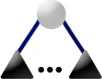  
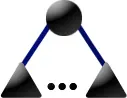

如果 𝑢u 有黑色儿子和白色儿子，且 𝑢u 是相关根，那么新建一个 P 结点 𝑣v 成为它所有黑色儿子的根．  
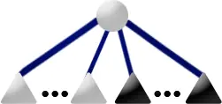  
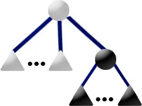

如果 𝑢u 有黑色儿子和白色儿子，且 𝑢u 不是相关根，那么做以下操作：

  * 新建一个 P 结点 𝑓f 成为所有黑色儿子的根．
  * 新建一个 P 结点 𝑒e 成为所有白色儿子的根．
  * 如果 𝑒e（和/或 𝑓f）只有一个儿子，那么不要新建结点，而是将 𝑒e（和/或 𝑓f）直接赋值成那个儿子．
  * 将 𝑢u 改成 Q 结点并把其儿子设为 𝑒e 和 𝑓f，将其标记为灰色．

注意到根据之前的定义，Q 结点至少有 3 个儿子，因此这里的 𝑢u 被视为一个「伪结点」，并且将在后面被继续处理．  
  
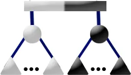

如果 𝑢u 有一个灰色儿子 𝑝p，且 𝑢u 是相关根，那么新建一个 P 结点 𝑣v 作为其所有黑色儿子的根，将 𝑣v 的兄弟设为 𝑝p 最后一个一个黑色儿子，然后把 𝑣v 设为 𝑝p 的最后一个儿子．  
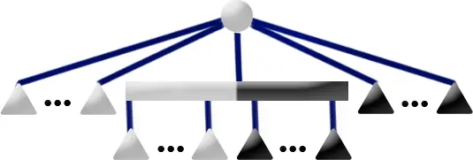  
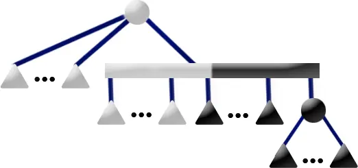

如果 𝑢u 有一个灰色儿子 𝑝p，且 𝑢u 不是相关根，那么进行以下操作：

  * 新建一个 P 结点 𝑓f 成为所有黑色儿子的根．
  * 新建一个 P 结点 𝑒e 成为所有白色儿子的根．
  * 如果 𝑒e（和/或 𝑓f）只有一个儿子，那么不要新建结点，而是将 𝑒e（和/或 𝑓f）直接赋值成那个儿子．
  * 将 𝑒e 的兄弟设为 𝑝p 最后一个白色儿子，然后把 𝑒e 设为 𝑝p 的最后一个儿子．
  * 将 𝑓f 的兄弟设为 𝑝p 最后一个黑色儿子，然后把 𝑓f 设为 𝑝p 的最后一个儿子．

  
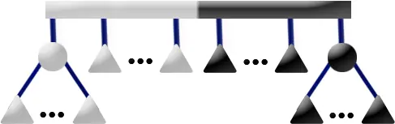

如果 𝑢u 恰有两个灰色儿子 𝑝1,𝑝2p1,p2，那么进行以下操作：

  * 新建一个 P 结点 𝑓f 成为所有黑色儿子的根．
  * 如果 𝑓f 只有一个儿子，那么不要新建结点，而是将 𝑓f 直接赋值成那个儿子．
  * 把 𝑝1p1 的最后一个黑色儿子的兄弟设为 𝑓f．
  * 把 𝑓f 的兄弟设为 𝑝2p2 的最后一个黑色儿子．
  * 把 𝑝2p2 的最后一个儿子设为 𝑝2p2 的最后一个白色儿子．

可以发现这样 𝑝2p2 就被合并进了 𝑝1p1．  
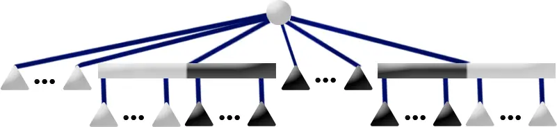  
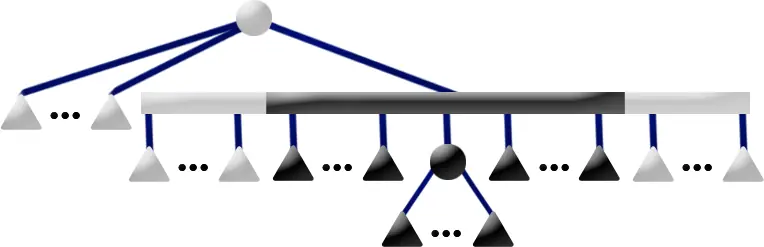

##### Q 结点

如果 𝑢u 只有黑色儿子，那么将 𝑢u 标记成黑色．（下面的图的形状错了．）  
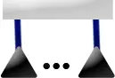  
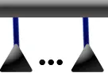

如果 𝑢u 有一个灰色儿子 𝑝p，且所有标记相同的儿子均连续出现，那么进行如下操作：

  * 设 𝑝𝑓pf 为 𝑝p 最后一个黑色儿子，𝑝𝑒pe 为 𝑝p 最后一个白色儿子，𝑓f 为 𝑝p 的黑色兄弟，𝑒e 为 𝑝p 的白色兄弟．
  * 将 𝑓f 的兄弟设为 𝑝𝑓pf，𝑒e 的兄弟设为 𝑝𝑒pe．
  * 如果 𝑝p 没有一个白色兄弟或黑色兄弟，将 𝑢u 的最后一个儿子设成 𝑝p 的最后一个儿子．
  * 删除 𝑝p．

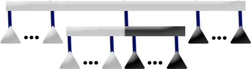  
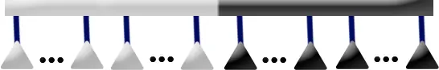

如果 𝑢u 恰有两个灰色儿子 𝑝1,𝑝2p1,p2，且所有标记相同的儿子均连续出现，那么对 𝑝1,𝑝2p1,p2 都进行上一种操作即可．  
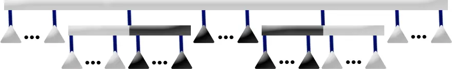  


该构建方法是原论文中的，但是实现较为不便．

### 自顶向下法

目前 OI 中的实现大多采用该方法．其实方法类似，下面出现的情况基本都能在上面找到．

注意到根据之前的染色过程，所有黑色和白色的点都已经满足条件，因此我们 **只需要处理灰色结点** ．

#### P 结点

  * 如果 𝑢u 有多于两个灰色儿子，无解．
  * 如果 𝑢u 只有一个灰色儿子，且没有黑色儿子，递归处理灰色儿子．
  * 否则先清空 𝑢u 的儿子，然后加入所有的白色儿子．新建一个 Q 结点 𝑞1q1 并成为 𝑢u 的儿子．在 𝑞1q1 中加入所有的灰色儿子．新建一个 P 结点 𝑝p 作为所有黑色儿子的根，将 𝑝p 插入 𝑞1q1 的中间．（对应了自底向上法 P 结点的所有情况．）

注意到我们会要求两个灰色节点白色全在左侧，黑色全在右侧（或相反），因此我们需要实现一个分裂函数 `split`，可以把这个子树的点分裂成黑白部分，并同时保留分裂成的子树的节点的 **所有可能** ．

#### Q 结点

  * 找到最左边和最右边的非白色节点位置 𝑙,𝑟l,r．如果 [𝑙 +1,𝑟 −1][l+1,r−1] 内有非黑色节点，无解．
  * 如果没有黑色节点，只有一个灰色节点，递归处理这个灰色节点，否则只需要将 𝑙l 和 𝑟r 位置的节点分裂．

#### 分裂函数

令要分裂的点为 𝑢u，我们想把 𝑢u 分裂成左边全是白色，右边全是黑色的森林．如果 𝑢u 不是灰色结点则直接返回子树．只考虑灰色结点的情况． 如果 𝑢u 是 P 类结点：

  * 如果 𝑢u 有至少两个灰色儿子，则无解．
  * 否则左边是所有白色儿子，中间递归处理灰色儿子，右边是所有黑色儿子．注意到要保留所有的可能，因此要新建两个 P 结点分别作为白色儿子和黑色儿子的根．（对应自底向上法的 P4 情况．）
  * 删除 𝑢u．

如果 𝑢u 是 Q 类结点：

  * 如果正序和反序都不满足白 - 灰 - 黑，则无解．
  * 如果有至少两个灰色儿子，也无解．
  * 否则递归分裂灰色儿子即可．
  * 删除 𝑢u．

最后把所有多余的结点（只有一个儿子的结点）删除．

## 代码实现

```text 1 2 3 4 5 6 7 8 9 10 11 12 13 14 15 16 17 18 19 20 21 22 23 24 25 26 27 28 29 30 31 32 33 34 35 36 37 38 39 40 41 42 43 44 45 46 47 48 49 50 51 52 53 54 55 56 57 58 59 60 61 62 63 64 65 66 67 68 69 70 71 72 73 74 75 76 77 78 79 80 81 82 83 84 85 86 87 88 89 90 91 92 93 94 95 96 97 98 99 100 101 102 103 104 105 106 107 108 109 110 111 112 113 114 115 116 117 118 119 120 121 122 123 124 125 126 127 128 129 130 131 132 133 134 135 136 137 138 139 140 141 142 143 144 145 146 147 148 149 150 151 152 153 154 155 156 157 158 159 160 161 162 163 164 165 166 167 168 169 170 171 172 173 174 175 176 177 178 179 180 181 182 183 184 185 186 187 188 189 190 191 192 193 194 ``` |  ```text class PQTree { public : PQTree () {} void Init ( int n ) { n_ = n , rt_ = tot_ = n \+ 1 ; for ( int i = 1 ; i <= n ; i ++ ) g_ [ rt_ ]. emplace_back ( i ); } void Insert ( const std :: string & s ) { s_ = s ; Dfs0 ( rt_ ); Work ( rt_ ); while ( g_ [ rt_ ]. size () == 1 ) rt_ = g_ [ rt_ ][ 0 ]; Remove ( rt_ ); } std :: vector < int > ans () { DfsAns ( rt_ ); return ans_ ; } ~ PQTree () {} private : int n_ , rt_ , tot_ , pool_ [ 100001 ], top_ , typ_ [ 100001 ] /* 0-P 1-Q */ , col_ [ 100001 ] /* 0-black 1-white 2-grey */ ; std :: vector < int > g_ [ 100001 ], ans_ ; std :: string s_ ; void Fail () { std :: cout << "NO \n " ; std :: exit ( 0 ); } int NewNode ( int ty ) { int x = top_ ? pool_ [ top_ \-- ] : ++ tot_ ; typ_ [ x ] = ty ; return x ; } void Delete ( int u ) { g_ [ u ]. clear (), pool_ [ ++ top_ ] = u ; } void Dfs0 ( int u ) { // get color of each node if ( u >= 1 && u <= n_ ) { col_ [ u ] = s_ [ u ] == '1' ; return ; } bool c0 = false , c1 = false ; for ( auto && v : g_ [ u ]) { Dfs0 ( v ); if ( col_ [ v ]) c1 = true ; if ( col_ [ v ] != 1 ) c0 = true ; } if ( c0 && ! c1 ) col_ [ u ] = 0 ; else if ( ! c0 && c1 ) col_ [ u ] = 1 ; else col_ [ u ] = 2 ; } bool Check ( const std :: vector < int > & v ) { int p2 = -1 ; for ( int i = 0 ; i < static_cast < int > ( v . size ()); i ++ ) if ( col_ [ v [ i ]] == 2 ) { if ( p2 != -1 ) return false ; p2 = i ; } if ( p2 == -1 ) for ( int i = 0 ; i < static_cast < int > ( v . size ()); i ++ ) if ( col_ [ v [ i ]]) { p2 = i ; break ; } for ( int i = 0 ; i < p2 ; i ++ ) if ( col_ [ v [ i ]]) return false ; for ( int i = p2 \+ 1 ; i < static_cast < int > ( v . size ()); i ++ ) if ( col_ [ v [ i ]] != 1 ) return false ; return true ; } std :: vector < int > Split ( int u ) { if ( col_ [ u ] != 2 ) return { u }; std :: vector < int > ng ; if ( typ_ [ u ]) { // Q if ( ! Check ( g_ [ u ])) { std :: reverse ( g_ [ u ]. begin (), g_ [ u ]. end ()); if ( ! Check ( g_ [ u ])) Fail (); } for ( auto && v : g_ [ u ]) if ( col_ [ v ] != 2 ) { ng . emplace_back ( v ); } else { auto s = Split ( v ); ng . insert ( ng . end (), s . begin (), s . end ()); } } else { // P std :: vector < int > son [ 3 ]; for ( auto && x : g_ [ u ]) son [ col_ [ x ]]. emplace_back ( x ); if ( son [ 2 ]. size () > 1 ) Fail (); if ( ! son [ 0 ]. empty ()) { int n0 = NewNode ( 0 ); g_ [ n0 ] = son [ 0 ]; ng . emplace_back ( n0 ); } if ( ! son [ 2 ]. empty ()) { auto s = Split ( son [ 2 ][ 0 ]); ng . insert ( ng . end (), s . begin (), s . end ()); } if ( ! son [ 1 ]. empty ()) { int n1 = NewNode ( 0 ); g_ [ n1 ] = son [ 1 ]; ng . emplace_back ( n1 ); } } Delete ( u ); return ng ; } void Work ( int u ) { if ( col_ [ u ] != 2 ) return ; if ( typ_ [ u ]) { // Q int l = 1e9 , r = -1e9 ; for ( int i = 0 ; i < static_cast < int > ( g_ [ u ]. size ()); i ++ ) if ( col_ [ g_ [ u ][ i ]]) checkmin ( l , i ), checkmax ( r , i ); for ( int i = l \+ 1 ; i < r ; i ++ ) if ( col_ [ g_ [ u ][ i ]] != 1 ) Fail (); if ( l == r && col_ [ g_ [ u ][ l ]] == 2 ) { Work ( g_ [ u ][ l ]); return ; } std :: vector < int > ng ; for ( int i = 0 ; i < l ; i ++ ) ng . emplace_back ( g_ [ u ][ i ]); auto s = Split ( g_ [ u ][ l ]); ng . insert ( ng . end (), s . begin (), s . end ()); for ( int i = l \+ 1 ; i < r ; i ++ ) ng . emplace_back ( g_ [ u ][ i ]); if ( l != r ) { s = Split ( g_ [ u ][ r ]); std :: reverse ( s . begin (), s . end ()); ng . insert ( ng . end (), s . begin (), s . end ()); } for ( int i = r \+ 1 ; i < static_cast < int > ( g_ [ u ]. size ()); i ++ ) ng . emplace_back ( g_ [ u ][ i ]); g_ [ u ] = ng ; } else { // P std :: vector < int > son [ 3 ]; for ( auto && x : g_ [ u ]) son [ col_ [ x ]]. emplace_back ( x ); if ( son [ 1 ]. empty () && son [ 2 ]. size () == 1 ) { Work ( son [ 2 ][ 0 ]); return ; } g_ [ u ]. clear (); if ( son [ 2 ]. size () > 2 ) Fail (); g_ [ u ] = son [ 0 ]; int n1 = NewNode ( 1 ); g_ [ u ]. emplace_back ( n1 ); if ( son [ 2 ]. size () >= 1 ) { auto s = Split ( son [ 2 ][ 0 ]); g_ [ n1 ]. insert ( g_ [ n1 ]. end (), s . begin (), s . end ()); } if ( son [ 1 ]. size ()) { int n2 = NewNode ( 0 ); g_ [ n1 ]. emplace_back ( n2 ); g_ [ n2 ] = son [ 1 ]; } if ( son [ 2 ]. size () >= 2 ) { auto s = Split ( son [ 2 ][ 1 ]); std :: reverse ( s . begin (), s . end ()); g_ [ n1 ]. insert ( g_ [ n1 ]. end (), s . begin (), s . end ()); } } } void Remove ( int u ) { // remove the nodes with only one child for ( auto && v : g_ [ u ]) { int tv = v ; while ( g_ [ tv ]. size () == 1 ) { int t = tv ; tv = g_ [ tv ][ 0 ]; Delete ( t ); } v = tv , Remove ( v ); } } void DfsAns ( int u ) { if ( u >= 1 && u <= n_ ) { ans_ . emplace_back ( u ); return ; } for ( auto && v : g_ [ u ]) DfsAns ( v ); } } T ; ```   
---|---  
  
## 习题

  * [CF243E Matrix](https://codeforces.com/problemset/problem/243/E)
  * [CF1552I Organizing a Music Festival](https://codeforces.com/contest/1552/problem/I)

## 参考资料

  * Booth, Kellogg S. & Lueker, George S. (1976).["Testing for the consecutive ones property, interval graphs, and graph planarity using PQ-tree algorithms"](https://www.sciencedirect.com/science/article/pii/S0022000076800451?via%3Dihub)._[Journal of Computer and System Sciences](https://en.wikipedia.org/wiki/Journal_of_Computer_and_System_Sciences)_.**13**(3): 335–379.[doi](https://en.wikipedia.org/wiki/Doi_%28identifier%29):[10.1016/S0022-0000(76)80045-1](https://doi.org/10.1016%2FS0022-0000%2876%2980045-1).
  * [PQ Tree Algorithm and Consecutive Ones Problem](https://gregable.com/2008/11/pq-tree-algorithm.html)
  * [CF243E Matrix PQTree - RainAir's Blog](https://blog.aor.sd.cn/archives/1657/)

* * *

>  __本页面最近更新： 2026/1/7 08:56:54，[更新历史](https://github.com/OI-wiki/OI-wiki/commits/master/docs/ds/pq-tree.md)  
>  __发现错误？想一起完善？[在 GitHub 上编辑此页！](https://oi-wiki.org/edit-landing/?ref=/ds/pq-tree.md "edit.link.title")  
>  __本页面贡献者：[isdanni](https://github.com/isdanni), [Tiphereth-A](https://github.com/Tiphereth-A), [xyf007](https://github.com/xyf007), [CCXXXI](https://github.com/CCXXXI), [Ir1d](https://github.com/Ir1d), [ksyx](https://github.com/ksyx), [mgt](mailto:i@margatroid.xyz), [R-G-Mocoratioen](https://github.com/R-G-Mocoratioen)  
>  __本页面的全部内容在**[CC BY-SA 4.0](https://creativecommons.org/licenses/by-sa/4.0/deed.zh) 和 [SATA](https://github.com/zTrix/sata-license)** 协议之条款下提供，附加条款亦可能应用
