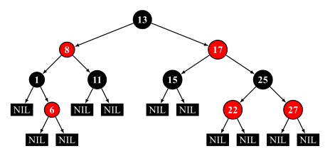
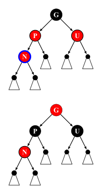
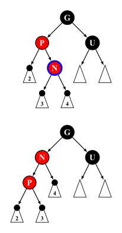
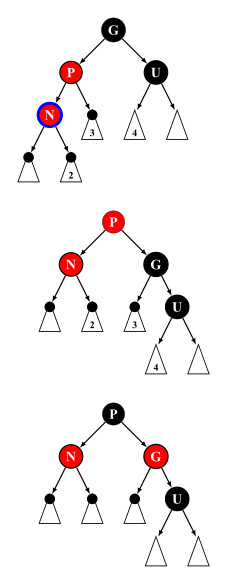
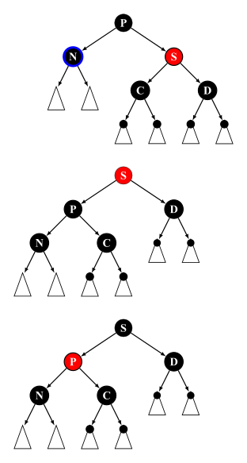
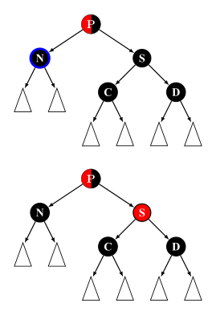
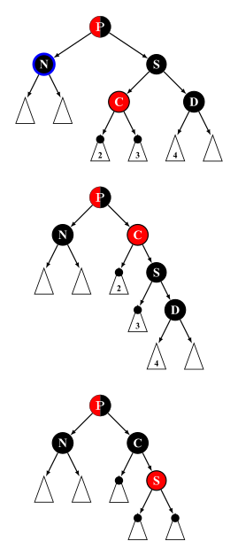
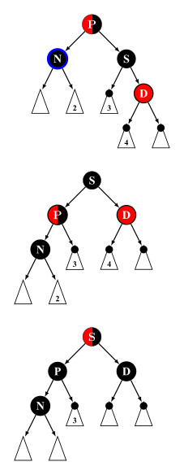
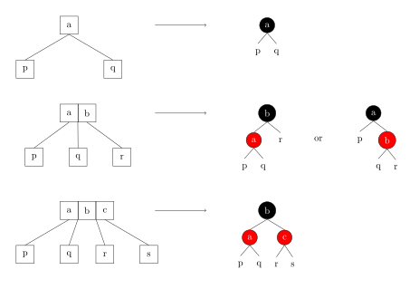
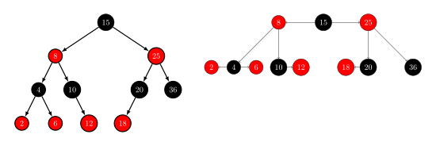

# 红黑树 - OI Wiki

- Source: https://oi-wiki.org/ds/rbtree/

# 红黑树

红黑树是一种自平衡的二叉搜索树．每个节点额外存储了一个 color 字段 ("RED" or "BLACK")，用于确保树在插入和删除时保持平衡．

红黑树是 4 阶 B 树（[2-3-4 树](https://en.wikipedia.org/wiki/2%E2%80%933%E2%80%934_tree)）的变体．1

## 性质

一棵合法的红黑树必须遵循以下四条性质：

  1. 节点为红色或黑色
  2. NIL 节点（空叶子节点）为黑色
  3. 红色节点的子节点为黑色
  4. 从根节点到 NIL 节点的每条路径上的黑色节点数量相同

下图为一棵合法的红黑树：



Note

部分资料中还加入了第五条性质，即根节点必须为黑色，这条性质要求完成插入操作后若根节点为红色则将其染黑，但由于将根节点染黑的操作也可以延迟至删除操作时进行，因此，该条性质并非必须满足（本文给出的代码实现中满足该性质）．为严谨起见，这里同时引用 [维基百科原文](https://en.wikipedia.org/wiki/Red%E2%80%93black_tree#Properties) 进行说明：

> Some authors, e.g. Cormen & al.,3claim "the root is black" as fifth requirement; but not Mehlhorn & Sanders4or Sedgewick & Wayne.5Since the root can always be changed from red to black, this rule has little effect on analysis. This article also omits it, because it slightly disturbs the recursive algorithms and proofs.

## 红黑树类的定义

```text 1 2 3 4 5 6 7 8 9 10 11 12 13 14 15 16 17 18 19 20 21 22 23 24 25 26 27 28 29 30 31 32 33 34 35 36 37 38 ``` |  ```text /** * An RBTree-based set implementation * * @tparam key_t key type * @tparam compare_t compare function */ template < typename key_t , typename compare_t = std :: less < key_t >> struct rb_tree { /** * Tree node */ struct node_t { node_t * fa ; // == nullptr if root of the tree, otherwise parent node_t * ch [ 2 ]; // == nullptr if child is empty // ch[0]: left child, ch[1]: right child key_t data ; size_t sz ; // Size of subtree bool red ; // == true if node is red, otherwise black /** * Get child direction of current non-null node * * @return true if this node is right child of its parent, otherwise false */ auto child_dir () const -> bool { return this == fa -> ch [ 1 ]; } }; using pointer = node_t * ; using const_pointer = const node_t * ; using pointer_const = node_t * const ; const compare_t compare ; pointer root ; rb_tree () : compare {}, root { nullptr } {} // ... }; ```   
---|---  
  
Note

在红黑树节点的存储中，用数组来存储子节点指针可以提高代码复用率．

## 操作

Note

红黑树的插入/删除有多种实现方式，本文采用《算法导论》的实现方式，将插入后的平衡维护分为 3 种情况，删除后的平衡维护分为 4 种情况．

红黑树的遍历、查找最小/最大值、搜索元素、求元素的排名、根据排名反查元素、查找前驱/后继等操作和 [二叉搜索树](../bst/) 一致，此处不再赘述．

另外，在下文插入/删除平衡维护的代码注释中，我们作如下约定：

  * 用 `p` 表示节点 `p` 为黑色；
  * 用 `[p]` 表示节点 `p` 为红色；
  * 用 `{p}` 表示节点 `p` 为红色或黑色；
  * 用 `|p|` 表示节点 `p` 为 NIL 节点或颜色为黑色．

### 旋转

旋转操作是多数平衡树能够维持平衡的关键，它能在不改变一棵合法 BST 中序遍历结果的情况下改变局部节点的深度．


实现

```text 1 2 3 4 5 6 7 8 9 10 11 12 13 14 15 16 17 18 19 20 ``` |  ```text /** * @param p root of subtree (may be same as {@code root}) * @param dir direction. 0: left rotate; 1: right rotate * @return new root of subtree */ auto rotate ( pointer p , bool dir ) -> pointer { auto g = p -> fa ; auto s = p -> ch [ ! dir ]; // new root of subtree assert ( s ); // pointer to true node required s -> sz = p -> sz , p -> sz = size ( p -> ch [ dir ]) \+ size ( s -> ch [ dir ]) \+ 1 ; auto c = s -> ch [ dir ]; if ( c ) c -> fa = p ; p -> ch [ ! dir ] = c , s -> ch [ dir ] = p ; p -> fa = s , s -> fa = g ; if ( g ) g -> ch [ p == g -> ch [ 1 ]] = s ; else root = s ; return s ; } ```   
---|---  
  
### 插入

红黑树的插入操作与普通的 BST 类似，对于红黑树来说，新插入的节点初始为红色，完成插入后需根据插入节点及相关节点的状态进行修正以满足上文提到的四条性质．

实现

```text 1 2 3 4 5 6 7 8 9 10 11 12 13 14 15 16 17 18 19 20 21 22 23 24 25 26 27 28 29 30 31 32 33 34 35 36 37 38 39 40 41 42 43 44 45 46 47 48 49 50 ``` |  ```text /** * @return nullptr if insert failed, otherwise pointer of inserted node */ auto insert ( const key_t & data ) -> const_pointer { pointer n = new node_t ; n -> fa = n -> ch [ 0 ] = n -> ch [ 1 ] = nullptr ; n -> data = data , n -> sz = 1 ; pointer now = root , p = nullptr ; bool dir = 0 ; while ( now ) { p = now ; dir = compare ( now -> data , data ); now = now -> ch [ dir ]; } insert_fixup_leaf ( p , n , dir ); return n ; } /** * Insert leaf node {@code n} to {@code p} * * @param p parent of node which will be inserted * @param n leaf node which will be inserted * @param dir direction of n, 0: left; 1: right */ void insert_leaf ( pointer_const p , pointer_const n , bool dir ) { if ( ! p ) { root = n ; return ; } p -> ch [ dir ] = n , n -> fa = p ; auto now = p ; while ( now ) now -> sz ++ , now = now -> fa ; } /** * Insert leaf node {@code n} to {@code p}, then fixup * * @param p parent of node which will be inserted * @param n node which will be inserted * @param dir direction of n, 0: left; 1: right */ void insert_fixup_leaf ( pointer p , pointer n , bool dir ) { n -> red = p ; insert_leaf ( p , n , dir ); // Fix double red // ... // Post process: color root black root -> red = false ; } ```   
---|---  
  
### 插入后的平衡维护

Note

为加深理解，请读者自行验证平衡维护后是否满足性质 4．

由于插入的节点若不为根节点则必为红色，所以插入后可能违反性质 3，需要维护平衡性．

令插入的节点为 𝑛n，其父节点为 𝑝p，祖父节点为 𝑔g，叔节点为 𝑢u．由性质 3 可知 𝑔g 必为黑色．

我们从插入的位置开始向上递归维护，若 𝑝p 为黑色即可终止，否则分为 3 种情况．

```text 1 2 3 4 5 ``` |  ```text while ( is_red ( p = n -> fa )) { bool p_dir = p -> child_dir (); auto g = p -> fa , u = g -> ch [ ! p_dir ]; // ... } ```   
---|---  
  
#### Insert case 1

𝑝p 和 𝑢u 均为红色．此时我们只需重新染色即可．



实现

```text 1 2 3 4 5 6 7 8 9 10 11 12 ``` |  ```text // Case 1: both p and u are red // g [g] // / \ / \ // [p] [u] ==> p u // / / // [n] [n] if ( is_red ( u )) { p -> red = u -> red = false ; g -> red = true ; n = g ; continue ; } ```   
---|---  
  
#### Insert case 2

𝑝p 为红色，𝑢u 为黑色，𝑝p 的方向和 𝑛n 的方向不同．

此时我们需要旋转 𝑝p 节点来转为第三种情况．



实现

```text 1 2 3 4 5 6 7 8 ``` |  ```text // p is red and u is black // Case 2: dir of n is different with dir of p // g g // / \ / \ // [p] u ==> [n] u // \ / // [n] [p] if ( n -> child_dir () != p_dir ) rotate ( p , p_dir ), std :: swap ( n , p ); ```   
---|---  
  
#### Insert case 3

𝑝p 为红色，𝑢u 为黑色，𝑝p 的方向和 𝑛n 的方向相同．

此时我们需要旋转 𝑔g 节点以将 𝑝p 转为子树的根，之后交换 𝑝p 和 𝑔g 的颜色即可．



实现

```text 1 2 3 4 5 6 7 8 ``` |  ```text // Case 3: p is red, u is black and dir of n is same as dir of p // g p // / \ / \ // [p] u ==> [n] [g] // / \ // [n] u p -> red = false , g -> red = true ; rotate ( g , ! p_dir ); ```   
---|---  
  
### 删除

红黑树的删除操作与普通的 BST 相比要多一些步骤．具体而言：

  * 若待删除的节点 𝑛n 有两个子节点，则交换 𝑛n 和右子树中最小节点 𝑠s 的数据，并将 𝑛n 设为 𝑠s．此时 𝑛n 不可能有两个子节点．
  * 若待删除的节点 𝑛n 有一个子节点 𝑠s．由性质 4 可知 𝑠s 必为红色，再由性质 3 可知 𝑛n 必为黑色．所以只需将 𝑛n 在父节点 𝑝p 中对应的指针替换为 𝑠s 的地址，以及将 𝑠s 的父节点指针替换为 𝑝p 的地址，之后再将 𝑠s 染黑即可．
  * 若待删除的节点 𝑛n 没有子节点．若 𝑛n 是根节点或 𝑛n 是红色节点，则直接删除即可，否则直接删除会违反性质 4，需要维护平衡性．

实现

```text 1 2 3 4 5 6 7 8 9 10 11 12 13 14 15 16 17 18 19 20 21 22 23 24 25 26 27 28 29 30 31 32 33 34 35 36 37 38 39 40 41 42 43 44 45 46 47 48 49 50 51 52 53 54 55 56 57 58 59 60 61 62 63 64 65 66 67 68 69 ``` |  ```text /** * @return succeed or not */ auto erase ( const key_t & key ) -> bool { auto p = lower_bound ( key ); if ( ! p || p -> data != key ) return false ; erase ( p ); return true ; } /** * @return {@code next(p)} */ auto erase ( pointer p ) -> const_pointer { if ( ! p ) return nullptr ; pointer result ; if ( p -> ch [ 0 ] && p -> ch [ 1 ]) { auto s = leftmost ( p -> ch [ 1 ]); std :: swap ( s -> data , p -> data ); result = p , p = s ; } else result = next ( p ); erase_fixup_branch_or_leaf ( p ); delete p ; return result ; } /** * Erase node {@code n} * * @param n node which will be deleted, must have no more than 2 child */ void erase_branch_or_leaf ( pointer_const n ) { auto p = n -> fa , s = n -> ch [ 0 ] ? n -> ch [ 0 ] : n -> ch [ 1 ]; if ( s ) s -> fa = p ; if ( ! p ) { root = s ; return ; } p -> ch [ n -> child_dir ()] = s ; auto now = p ; while ( now ) now -> sz \-- , now = now -> fa ; } /** * Erase node {@code n}, then fixup * * @param n node which will be deleted, must have no more than 2 child */ void erase_fixup_branch_or_leaf ( pointer n ) { bool n_dir = n == root ? false : n -> child_dir (); erase_branch_or_leaf ( n ); auto p = n -> fa ; if ( ! p ) { // n is root if ( root ) root -> red = false ; return ; } else { auto s = p -> ch [ n_dir ]; if ( s ) { // n has 1 child // n must be black and s must be red, so we need to color s black s -> red = false ; return ; } } // n is not root but leaf with black color, need to be fixup // ... // Post process: see case 2 & case 4 n -> red = false ; } ```   
---|---  
  
### 删除后的平衡维护

Note

为加深理解，请读者自行验证平衡维护后是否满足性质 4．

由上文讨论可知 𝑛n 是黑色叶子节点且不为根节点．我们设 𝑛n 的父节点为 𝑝p，兄弟节点为 𝑠s，侄节点分别为 𝑐c 和 𝑑d．

删除的维护也是从 𝑛n 开始向上递归维护，若 𝑛n 是根或 𝑛n 为红色即可终止，否则分为 4 种情况．

```text 1 2 3 4 5 6 7 8 9 10 11 12 13 ``` |  ```text while ( p && ! n -> red ) { auto s = p -> ch [ ! n_dir ]; // Delete case 1 // ... // Other cases // s must be black auto c = s -> ch [ n_dir ], d = s -> ch [ ! n_dir ]; // ... end_erase_fixup : p = n -> fa ; if ( ! p ) break ; n_dir = n -> child_dir (); } ```   
---|---  
  
#### Delete case 1

𝑠s 为红色．

此时我们旋转 𝑝p，将 𝑠s 转为子树根节点，之后交换 𝑠s 和 𝑝p 的颜色来转为其余三种情况之一．



实现

```text 1 2 3 4 5 6 7 8 9 10 11 ``` |  ```text // Case 1: s is red // p s // / \ / \ // |n| [s] ==> [p] d // / \ / \ // c d |n| c if ( is_red ( s )) { s -> red = false , p -> red = true ; rotate ( p , n_dir ); s = p -> ch [ ! n_dir ]; } ```   
---|---  
  
#### Delete case 2

𝑝p 的颜色不确定，𝑠s、𝑐c、𝑑d 均为黑色．

此时只需将 𝑠s 染红即可．



需要注意的是，若 𝑝p 为红色则会违反性质 3，但是若 𝑝p 为红色则会直接退出循环，所以我们在最后将其染黑．

实现

```text 1 2 3 4 5 6 7 8 9 10 11 12 ``` |  ```text // Case 2: both c and d are black // {p} {p} // / \ / \ // |n| s ==> |n| [s] // / \ / \ // c d c d // p will be colored black in the end if ( ! is_red ( c ) && ! is_red ( d )) { s -> red = true ; n = p ; goto end_erase_fixup ; } ```   
---|---  
  
#### Delete case 3

𝑝p 的颜色不确定，𝑠s、𝑑d 均为黑色，𝑐c 为红色．

此时需要旋转 𝑠s 使 𝑐c 为原来 𝑠s 对应子树的根节点，并交换 𝑠s 和 𝑐c 的颜色转为第四种情况即可．



实现

```text 1 2 3 4 5 6 7 8 9 10 11 12 13 ``` |  ```text // Case 3: c is red and d is black // {p} {p} // / \ / \ // |n| s ==> |n| c // / \ \ // [c] d [s] // \ // d if ( ! is_red ( d )) { c -> red = false , s -> red = true ; rotate ( s , ! n_dir ); s = p -> ch [ ! n_dir ], c = s -> ch [ n_dir ], d = s -> ch [ ! n_dir ]; } ```   
---|---  
  
#### Delete case 4

𝑝p、𝑐c 的颜色不确定，𝑠s 为黑色，𝑑d 为红色．

此时需要旋转 𝑝p 使 𝑠s 为子树的根节点，交换 𝑠s 和 𝑝p 的颜色，并将 𝑑d 染黑即可终止维护平衡．



实现

```text 1 2 3 4 5 6 7 8 ``` |  ```text // Case 4: d is red // {p} {s} // / \ / \ // |n| s ==> p d // / \ / \ // {c} [d] |n| {c} s -> red = p -> red , p -> red = d -> red = false ; rotate ( p , n_dir ), n = root ; ```   
---|---  
  
## 参考代码

下面的代码是用红黑树实现的 set：

实现

```text 1 2 3 4 5 6 7 8 9 10 11 12 13 14 15 16 17 18 19 20 21 22 23 24 25 26 27 28 29 30 31 32 33 34 35 36 37 38 39 40 41 42 43 44 45 46 47 48 49 50 51 52 53 54 55 56 57 58 59 60 61 62 63 64 65 66 67 68 69 70 71 72 73 74 75 76 77 78 79 80 81 82 83 84 85 86 87 88 89 90 91 92 93 94 95 96 97 98 99 100 101 102 103 104 105 106 107 108 109 110 111 112 113 114 115 116 117 118 119 120 121 122 123 124 125 126 127 128 129 130 131 132 133 134 135 136 137 138 139 140 141 142 143 144 145 146 147 148 149 150 151 152 153 154 155 156 157 158 159 160 161 162 163 164 165 166 167 168 169 170 171 172 173 174 175 176 177 178 179 180 181 182 183 184 185 186 187 188 189 190 191 192 193 194 195 196 197 198 199 200 201 202 203 204 205 206 207 208 209 210 211 212 213 214 215 216 217 218 219 220 221 222 223 224 225 226 227 228 229 230 231 232 233 234 235 236 237 238 239 240 241 242 243 244 245 246 247 248 249 250 251 252 253 254 255 256 257 258 259 260 261 262 263 264 265 266 267 268 269 270 271 272 273 274 275 276 277 278 279 280 281 282 283 284 285 286 287 288 289 290 291 292 293 294 295 296 297 298 299 300 301 302 303 304 305 306 307 308 309 310 311 312 313 314 315 316 317 318 319 320 321 322 323 324 325 326 327 328 329 330 331 332 333 334 335 336 337 338 339 340 341 342 343 344 345 346 347 348 349 350 351 352 353 354 355 356 357 358 359 360 361 362 363 364 365 366 367 368 369 370 371 372 373 374 375 376 377 378 379 380 381 382 383 384 385 386 387 388 389 390 391 392 393 394 395 396 397 398 399 400 401 402 403 404 ``` |  ```text /** * @file rbtree.hpp * @brief An RBTree-based set implementation * @details The set is sorted according to the {@code compare_t} function * provided; This implementation provides find, insert, remove, find order, find * key by order in O(log(n)) time. * @author [Tiphereth-A](https://github.com/Tiphereth-A) */ #ifndef RBTREE_HPP #define RBTREE_HPP #include <cassert> #include <cstdint> #include <functional> using std :: size_t ; /** * An RBTree-based set implementation * * @tparam key_t key type * @tparam compare_t compare function */ template < typename key_t , typename compare_t = std :: less < key_t >> struct rb_tree { /** * Tree node */ struct node_t { node_t * fa ; // == nullptr if root of the tree, otherwise parent node_t * ch [ 2 ]; // == nullptr if child is empty // ch[0]: left child, ch[1]: right child key_t data ; size_t sz ; // Size of subtree bool red ; // == true if node is red, otherwise black /** * Get child direction of current non-null node * * @return true if this node is right child of its parent, otherwise false */ auto child_dir () const -> bool { return this == fa -> ch [ 1 ]; } }; using pointer = node_t * ; using const_pointer = const node_t * ; using pointer_const = node_t * const ; const compare_t compare ; pointer root ; rb_tree () : compare {}, root { nullptr } {} ~ rb_tree () { post_order ([]( auto it ) { delete it ; }); } auto size () const -> size_t { return size ( root ); } template < typename F > void pre_order ( F callback ) { auto f = [ & ]( auto && f , pointer p ) { if ( ! p ) return ; callback ( p ), f ( f , p -> ch [ 0 ]), f ( f , p -> ch [ 1 ]); }; f ( f , root ); } template < typename F > void in_order ( F callback ) { auto f = [ & ]( auto && f , pointer p ) { if ( ! p ) return ; f ( f , p -> ch [ 0 ]), callback ( p ), f ( f , p -> ch [ 1 ]); }; f ( f , root ); } template < typename F > void post_order ( F callback ) { auto f = [ & ]( auto && f , pointer p ) { if ( ! p ) return ; f ( f , p -> ch [ 0 ]), f ( f , p -> ch [ 1 ]), callback ( p ); }; f ( f , root ); } auto leftmost ( const_pointer p ) const { return most ( p , 0 ); } auto rightmost ( const_pointer p ) const { return most ( p , 1 ); } auto prev ( const_pointer p ) const { return neighbour ( p , 0 ); } auto next ( const_pointer p ) const { return neighbour ( p , 1 ); } auto lower_bound ( const key_t & key ) const -> pointer { const_pointer now = root , ans = nullptr ; while ( now ) { if ( ! compare ( now -> data , key )) ans = now , now = now -> ch [ 0 ]; else now = now -> ch [ 1 ]; } return ( pointer ) ans ; } auto upper_bound ( const key_t & key ) const -> pointer { const_pointer now = root , ans = nullptr ; while ( now ) { if ( compare ( key , now -> data )) ans = now , now = now -> ch [ 0 ]; else now = now -> ch [ 1 ]; } return ( pointer ) ans ; } // Order start from 0 auto order_of_key ( const key_t & key ) const -> size_t { size_t ans = 0 ; auto now = root ; while ( now ) { if ( ! compare ( now -> data , key )) now = now -> ch [ 0 ]; else ans += size ( now -> ch [ 0 ]) \+ 1 , now = now -> ch [ 1 ]; } return ans ; } // Order start from 0 auto find_by_order ( size_t order ) const -> const_pointer { const_pointer now = root , ans = nullptr ; while ( now && now -> sz >= order ) { auto lsize = size ( now -> ch [ 0 ]); if ( order < lsize ) now = now -> ch [ 0 ]; else { ans = now ; if ( order == lsize ) break ; now = now -> ch [ 1 ], order -= lsize \+ 1 ; } } return ans ; } /** * @return nullptr if insert failed, otherwise pointer of inserted node */ auto insert ( const key_t & data ) -> const_pointer { pointer n = new node_t ; n -> fa = n -> ch [ 0 ] = n -> ch [ 1 ] = nullptr ; n -> data = data , n -> sz = 1 ; pointer now = root , p = nullptr ; bool dir = 0 ; while ( now ) { p = now ; dir = compare ( now -> data , data ); now = now -> ch [ dir ]; } insert_fixup_leaf ( p , n , dir ); return n ; } /** * @return succeed or not */ auto erase ( const key_t & key ) -> bool { auto p = lower_bound ( key ); if ( ! p || p -> data != key ) return false ; erase ( p ); return true ; } /** * @return {@code next(p)} */ auto erase ( pointer p ) -> const_pointer { if ( ! p ) return nullptr ; pointer result ; if ( p -> ch [ 0 ] && p -> ch [ 1 ]) { auto s = leftmost ( p -> ch [ 1 ]); std :: swap ( s -> data , p -> data ); result = p , p = s ; } else result = next ( p ); erase_fixup_branch_or_leaf ( p ); delete p ; return result ; } private : static auto size ( const_pointer p ) -> size_t { return p ? p -> sz : 0 ; } static auto is_red ( const_pointer p ) -> bool { return p ? p -> red : false ; } /** * @param dir 0: leftmost, 1: rightmost */ auto most ( const_pointer p , bool dir ) const -> pointer { if ( ! p ) return nullptr ; while ( p -> ch [ dir ]) p = p -> ch [ dir ]; return ( pointer ) p ; } /** * @param dir 0: prev, 1: next */ auto neighbour ( const_pointer p , bool dir ) const -> pointer { if ( ! p ) return nullptr ; if ( p -> ch [ dir ]) return most ( p -> ch [ dir ], ! dir ); if ( p == root ) return nullptr ; while ( p && p -> fa && p -> child_dir () == dir ) p = p -> fa ; return p ? p -> fa : nullptr ; } /** * Insert leaf node {@code n} to {@code p} * * @param p parent of node which will be inserted * @param n leaf node which will be inserted * @param dir direction of n, 0: left; 1: right */ void insert_leaf ( pointer_const p , pointer_const n , bool dir ) { if ( ! p ) { root = n ; return ; } p -> ch [ dir ] = n , n -> fa = p ; auto now = p ; while ( now ) now -> sz ++ , now = now -> fa ; } /** * Erase node {@code n} * * @param n node which will be deleted, must have no more than 2 child */ void erase_branch_or_leaf ( pointer_const n ) { auto p = n -> fa , s = n -> ch [ 0 ] ? n -> ch [ 0 ] : n -> ch [ 1 ]; if ( s ) s -> fa = p ; if ( ! p ) { root = s ; return ; } p -> ch [ n -> child_dir ()] = s ; auto now = p ; while ( now ) now -> sz \-- , now = now -> fa ; } /** * @param p root of subtree (may be same as {@code root}) * @param dir direction. 0: left rotate; 1: right rotate * @return new root of subtree */ auto rotate ( pointer p , bool dir ) -> pointer { auto g = p -> fa ; auto s = p -> ch [ ! dir ]; // new root of subtree assert ( s ); // pointer to true node required s -> sz = p -> sz , p -> sz = size ( p -> ch [ dir ]) \+ size ( s -> ch [ dir ]) \+ 1 ; auto c = s -> ch [ dir ]; if ( c ) c -> fa = p ; p -> ch [ ! dir ] = c , s -> ch [ dir ] = p ; p -> fa = s , s -> fa = g ; if ( g ) g -> ch [ p == g -> ch [ 1 ]] = s ; else root = s ; return s ; } #pragma GCC diagnostic ignored "-Wcomment" /** * Insert leaf node {@code n} to {@code p}, then fixup * * @param p parent of node which will be inserted * @param n node which will be inserted * @param dir direction of n, 0: left; 1: right */ void insert_fixup_leaf ( pointer p , pointer n , bool dir ) { n -> red = p ; insert_leaf ( p , n , dir ); // Fix double red while ( is_red ( p = n -> fa )) { bool p_dir = p -> child_dir (); auto g = p -> fa , u = g -> ch [ ! p_dir ]; // Case 1: both p and u are red // g [g] // / \ / \ // [p] [u] ==> p u // / / // [n] [n] if ( is_red ( u )) { p -> red = u -> red = false ; g -> red = true ; n = g ; continue ; } // p is red and u is black // Case 2: dir of n is different with dir of p // g g // / \ / \ // [p] u ==> [n] u // \ / // [n] [p] if ( n -> child_dir () != p_dir ) rotate ( p , p_dir ), std :: swap ( n , p ); // Case 3: p is red, u is black and dir of n is same as dir of p // g p // / \ / \ // [p] u ==> [n] [g] // / \ // [n] u p -> red = false , g -> red = true ; rotate ( g , ! p_dir ); } // Post process: color root black root -> red = false ; } /** * Erase node {@code n}, then fixup * * @param n node which will be deleted, must have no more than 2 child */ void erase_fixup_branch_or_leaf ( pointer n ) { bool n_dir = n == root ? false : n -> child_dir (); erase_branch_or_leaf ( n ); auto p = n -> fa ; if ( ! p ) { // n is root if ( root ) root -> red = false ; return ; } else { auto s = p -> ch [ n_dir ]; if ( s ) { // n has 1 child // n must be black and s must be red, so we need to color s black s -> red = false ; return ; } } // n is not root but leaf with black color, need to be fixup while ( p && ! n -> red ) { auto s = p -> ch [ ! n_dir ]; // Case 1: s is red // p s // / \ / \ // |n| [s] ==> [p] d // / \ / \ // c d |n| c if ( is_red ( s )) { s -> red = false , p -> red = true ; rotate ( p , n_dir ); s = p -> ch [ ! n_dir ]; } // s must be black auto c = s -> ch [ n_dir ], d = s -> ch [ ! n_dir ]; // Case 2: both c and d are black // {p} {p} // / \ / \ // |n| s ==> |n| [s] // / \ / \ // c d c d // p will be colored black in the end if ( ! is_red ( c ) && ! is_red ( d )) { s -> red = true ; n = p ; goto end_erase_fixup ; } // Case 3: c is red and d is black // {p} {p} // / \ / \ // |n| s ==> |n| c // / \ \ // [c] d [s] // \ // d if ( ! is_red ( d )) { c -> red = false , s -> red = true ; rotate ( s , ! n_dir ); s = p -> ch [ ! n_dir ], c = s -> ch [ n_dir ], d = s -> ch [ ! n_dir ]; } // Case 4: d is red // {p} {s} // / \ / \ // |n| s ==> p d // / \ / \ // {c} [d] |n| {c} s -> red = p -> red , p -> red = d -> red = false ; rotate ( p , n_dir ), n = root ; end_erase_fixup : p = n -> fa ; if ( ! p ) break ; n_dir = n -> child_dir (); } // Post process: see case 2 & case 4 n -> red = false ; } }; #pragma GCC diagnostic warning "-Wcomment" #endif // RBTREE_HPP ```   
---|---  
  
例题：[Luogu P3369【模板】普通平衡树](https://www.luogu.com.cn/problem/P3369) 与 [Luogu P6136【模板】普通平衡树（数据加强版）](https://www.luogu.com.cn/problem/P6136)

```text 1 2 3 4 5 6 7 8 9 10 11 12 13 14 15 16 17 18 19 20 21 22 23 24 25 26 27 28 29 30 31 32 33 34 35 36 37 38 39 40 41 42 43 44 45 46 47 48 49 50 51 52 53 54 55 56 57 58 59 60 61 62 63 64 65 66 67 68 69 70 71 72 73 74 75 76 77 78 79 80 81 82 83 84 85 86 87 88 89 90 91 92 93 94 95 96 97 98 99 100 101 102 103 104 105 106 107 108 109 110 111 112 113 114 115 116 117 118 119 120 121 122 123 124 125 126 127 128 129 130 131 132 133 134 135 136 137 138 139 140 141 142 143 144 145 146 147 148 149 150 151 152 153 154 155 156 157 158 159 160 161 162 163 164 165 166 167 168 169 170 171 172 173 174 175 176 177 178 179 180 181 182 183 184 185 186 187 188 189 190 191 192 193 194 195 196 197 198 199 200 201 202 203 204 205 206 207 208 209 210 211 212 213 214 215 216 217 218 219 220 221 222 223 224 225 226 227 228 229 230 231 232 233 234 235 236 237 238 239 240 241 242 243 244 245 246 247 248 249 250 251 252 253 254 255 256 257 258 259 260 261 262 263 264 265 266 267 268 269 270 271 272 273 274 275 276 277 278 279 280 281 282 283 284 285 286 287 288 289 290 291 292 293 294 295 296 297 298 299 300 301 302 303 304 305 306 307 308 309 310 311 312 313 314 315 316 317 318 319 320 321 322 323 324 325 326 327 328 329 330 331 332 333 334 335 336 337 338 339 340 341 342 343 344 345 346 347 348 349 350 351 352 353 354 355 356 357 358 359 360 361 362 363 364 365 366 367 368 369 370 371 372 373 374 375 376 377 378 379 380 381 382 383 384 385 386 387 388 389 390 391 392 393 394 395 396 397 398 399 400 401 402 403 404 405 406 407 408 409 410 411 412 413 414 415 416 417 418 419 420 421 422 423 424 425 426 427 428 429 430 431 432 433 434 435 436 437 438 439 440 441 442 443 444 445 446 447 448 449 450 451 452 453 454 455 456 457 458 459 460 461 462 463 464 465 466 467 468 469 470 471 472 473 474 ``` |  ```text #include <cassert> #include <cstdint> #include <functional> using std :: size_t ; /** * An RBTree-based set implementation * * @tparam key_t key type * @tparam compare_t compare function */ template < typename key_t , typename compare_t = std :: less < key_t >> struct rb_tree { /** * Tree node */ struct node_t { node_t * fa ; // == nullptr if root of the tree, otherwise parent node_t * ch [ 2 ]; // == nullptr if child is empty // ch[0]: left child, ch[1]: right child key_t data ; size_t sz ; // Size of subtree bool red ; // == true if node is red, otherwise black /** * Get child direction of current non-null node * * @return true if this node is right child of its parent, otherwise false */ auto child_dir () const -> bool { return this == fa -> ch [ 1 ]; } }; using pointer = node_t * ; using const_pointer = const node_t * ; using pointer_const = node_t * const ; const compare_t compare ; pointer root ; rb_tree () : compare {}, root { nullptr } {} ~ rb_tree () { post_order ([]( auto it ) { delete it ; }); } auto size () const -> size_t { return size ( root ); } template < typename F > void pre_order ( F callback ) { auto f = [ & ]( auto && f , pointer p ) { if ( ! p ) return ; callback ( p ), f ( f , p -> ch [ 0 ]), f ( f , p -> ch [ 1 ]); }; f ( f , root ); } template < typename F > void in_order ( F callback ) { auto f = [ & ]( auto && f , pointer p ) { if ( ! p ) return ; f ( f , p -> ch [ 0 ]), callback ( p ), f ( f , p -> ch [ 1 ]); }; f ( f , root ); } template < typename F > void post_order ( F callback ) { auto f = [ & ]( auto && f , pointer p ) { if ( ! p ) return ; f ( f , p -> ch [ 0 ]), f ( f , p -> ch [ 1 ]), callback ( p ); }; f ( f , root ); } auto leftmost ( const_pointer p ) const { return most ( p , 0 ); } auto rightmost ( const_pointer p ) const { return most ( p , 1 ); } auto prev ( const_pointer p ) const { return neighbour ( p , 0 ); } auto next ( const_pointer p ) const { return neighbour ( p , 1 ); } auto lower_bound ( const key_t & key ) const -> pointer { const_pointer now = root , ans = nullptr ; while ( now ) { if ( ! compare ( now -> data , key )) ans = now , now = now -> ch [ 0 ]; else now = now -> ch [ 1 ]; } return ( pointer ) ans ; } auto upper_bound ( const key_t & key ) const -> pointer { const_pointer now = root , ans = nullptr ; while ( now ) { if ( compare ( key , now -> data )) ans = now , now = now -> ch [ 0 ]; else now = now -> ch [ 1 ]; } return ( pointer ) ans ; } // Order start from 0 auto order_of_key ( const key_t & key ) const -> size_t { size_t ans = 0 ; auto now = root ; while ( now ) { if ( ! compare ( now -> data , key )) now = now -> ch [ 0 ]; else ans += size ( now -> ch [ 0 ]) \+ 1 , now = now -> ch [ 1 ]; } return ans ; } // Order start from 0 auto find_by_order ( size_t order ) const -> const_pointer { const_pointer now = root , ans = nullptr ; while ( now && now -> sz >= order ) { auto lsize = size ( now -> ch [ 0 ]); if ( order < lsize ) now = now -> ch [ 0 ]; else { ans = now ; if ( order == lsize ) break ; now = now -> ch [ 1 ], order -= lsize \+ 1 ; } } return ans ; } /** * @return nullptr if insert failed, otherwise pointer of inserted node */ auto insert ( const key_t & data ) -> const_pointer { pointer n = new node_t ; n -> fa = n -> ch [ 0 ] = n -> ch [ 1 ] = nullptr ; n -> data = data , n -> sz = 1 ; pointer now = root , p = nullptr ; bool dir = 0 ; while ( now ) { p = now ; dir = compare ( now -> data , data ); now = now -> ch [ dir ]; } insert_fixup_leaf ( p , n , dir ); return n ; } /** * @return succeed or not */ auto erase ( const key_t & key ) -> bool { auto p = lower_bound ( key ); if ( ! p || p -> data != key ) return false ; erase ( p ); return true ; } /** * @return {@code next(p)} */ auto erase ( pointer p ) -> const_pointer { if ( ! p ) return nullptr ; pointer result ; if ( p -> ch [ 0 ] && p -> ch [ 1 ]) { auto s = leftmost ( p -> ch [ 1 ]); std :: swap ( s -> data , p -> data ); result = p , p = s ; } else result = next ( p ); erase_fixup_branch_or_leaf ( p ); delete p ; return result ; } private : static auto size ( const_pointer p ) -> size_t { return p ? p -> sz : 0 ; } static auto is_red ( const_pointer p ) -> bool { return p ? p -> red : false ; } /** * @param dir 0: leftmost, 1: rightmost */ auto most ( const_pointer p , bool dir ) const -> pointer { if ( ! p ) return nullptr ; while ( p -> ch [ dir ]) p = p -> ch [ dir ]; return ( pointer ) p ; } /** * @param dir 0: prev, 1: next */ auto neighbour ( const_pointer p , bool dir ) const -> pointer { if ( ! p ) return nullptr ; if ( p -> ch [ dir ]) return most ( p -> ch [ dir ], ! dir ); if ( p == root ) return nullptr ; while ( p && p -> fa && p -> child_dir () == dir ) p = p -> fa ; return p ? p -> fa : nullptr ; } /** * Insert leaf node {@code n} to {@code p} * * @param p parent of node which will be inserted * @param n leaf node which will be inserted * @param dir direction of n, 0: left; 1: right */ void insert_leaf ( pointer_const p , pointer_const n , bool dir ) { if ( ! p ) { root = n ; return ; } p -> ch [ dir ] = n , n -> fa = p ; auto now = p ; while ( now ) now -> sz ++ , now = now -> fa ; } /** * Erase node {@code n} * * @param n node which will be deleted, must have no more than 2 child */ void erase_branch_or_leaf ( pointer_const n ) { auto p = n -> fa , s = n -> ch [ 0 ] ? n -> ch [ 0 ] : n -> ch [ 1 ]; if ( s ) s -> fa = p ; if ( ! p ) { root = s ; return ; } p -> ch [ n -> child_dir ()] = s ; auto now = p ; while ( now ) now -> sz \-- , now = now -> fa ; } /** * @param p root of subtree (may be same as {@code root}) * @param dir direction. 0: left rotate; 1: right rotate * @return new root of subtree */ auto rotate ( pointer p , bool dir ) -> pointer { auto g = p -> fa ; auto s = p -> ch [ ! dir ]; // new root of subtree assert ( s ); // pointer to true node required s -> sz = p -> sz , p -> sz = size ( p -> ch [ dir ]) \+ size ( s -> ch [ dir ]) \+ 1 ; auto c = s -> ch [ dir ]; if ( c ) c -> fa = p ; p -> ch [ ! dir ] = c , s -> ch [ dir ] = p ; p -> fa = s , s -> fa = g ; if ( g ) g -> ch [ p == g -> ch [ 1 ]] = s ; else root = s ; return s ; } #pragma GCC diagnostic ignored "-Wcomment" /** * Insert leaf node {@code n} to {@code p}, then fixup * * @param p parent of node which will be inserted * @param n node which will be inserted * @param dir direction of n, 0: left; 1: right */ void insert_fixup_leaf ( pointer p , pointer n , bool dir ) { n -> red = p ; insert_leaf ( p , n , dir ); // Fix double red while ( is_red ( p = n -> fa )) { bool p_dir = p -> child_dir (); auto g = p -> fa , u = g -> ch [ ! p_dir ]; // Case 1: both p and u are red // g [g] // / \ / \ // [p] [u] ==> p u // / / // [n] [n] if ( is_red ( u )) { p -> red = u -> red = false ; g -> red = true ; n = g ; continue ; } // p is red and u is black // Case 2: dir of n is different with dir of p // g g // / \ / \ // [p] u ==> [n] u // \ / // [n] [p] if ( n -> child_dir () != p_dir ) rotate ( p , p_dir ), std :: swap ( n , p ); // Case 3: p is red, u is black and dir of n is same as dir of p // g p // / \ / \ // [p] u ==> [n] [g] // / \ // [n] u p -> red = false , g -> red = true ; rotate ( g , ! p_dir ); } // Post process: color root black root -> red = false ; } /** * Erase node {@code n}, then fixup * * @param n node which will be deleted, must have no more than 2 child */ void erase_fixup_branch_or_leaf ( pointer n ) { bool n_dir = n == root ? false : n -> child_dir (); erase_branch_or_leaf ( n ); auto p = n -> fa ; if ( ! p ) { // n is root if ( root ) root -> red = false ; return ; } else { auto s = p -> ch [ n_dir ]; if ( s ) { // n has 1 child // n must be black and s must be red, so we need to color s black s -> red = false ; return ; } } // n is not root but leaf with black color, need to be fixup while ( p && ! n -> red ) { auto s = p -> ch [ ! n_dir ]; // Case 1: s is red // p s // / \ / \ // |n| [s] ==> [p] d // / \ / \ // c d |n| c if ( is_red ( s )) { s -> red = false , p -> red = true ; rotate ( p , n_dir ); s = p -> ch [ ! n_dir ]; } // s must be black auto c = s -> ch [ n_dir ], d = s -> ch [ ! n_dir ]; // Case 2: both c and d are black // {p} {p} // / \ / \ // |n| s ==> |n| [s] // / \ / \ // c d c d // p will be colored black in the end if ( ! is_red ( c ) && ! is_red ( d )) { s -> red = true ; n = p ; goto end_erase_fixup ; } // Case 3: c is red and d is black // {p} {p} // / \ / \ // |n| s ==> |n| c // / \ \ // [c] d [s] // \ // d if ( ! is_red ( d )) { c -> red = false , s -> red = true ; rotate ( s , ! n_dir ); s = p -> ch [ ! n_dir ], c = s -> ch [ n_dir ], d = s -> ch [ ! n_dir ]; } // Case 4: d is red // {p} {s} // / \ / \ // |n| s ==> p d // / \ / \ // {c} [d] |n| {c} s -> red = p -> red , p -> red = d -> red = false ; rotate ( p , n_dir ), n = root ; end_erase_fixup : p = n -> fa ; if ( ! p ) break ; n_dir = n -> child_dir (); } // Post process: see case 2 & case 4 n -> red = false ; } }; #pragma GCC diagnostic warning "-Wcomment" #include <iostream> #include <numeric> #include <vector> template < bool P6136 > // == false: P3369, == true: P6136 struct IO_luogu_P3369_P6136 { int last_ans = 0 ; std :: size_t n , m ; std :: vector < int > a ; std :: vector < int > ans_list ; void init () { std :: cin >> n ; if ( ! P6136 ) { m = n ; return ; } std :: cin >> m ; a . resize ( n ); for ( auto & i : a ) std :: cin >> i ; } int opt () { int x ; std :: cin >> x ; return x ; } int x () { int x ; std :: cin >> x ; return P6136 ? x ^ last_ans : x ; } void print ( int ans ) { ans_list . push_back ( last_ans = ans ); } void print_total_ans () { if ( P6136 ) std :: cout << std :: accumulate ( ans_list . begin (), ans_list . end (), 0 , std :: bit_xor < int > {}) << '\n' ; else for ( auto && i : ans_list ) std :: cout << i << '\n' ; } }; // 把这里的模板参数改为 false 即为「Luogu P3369【模板】普通平衡树」的代码 IO_luogu_P3369_P6136 < true > io ; int main () { std :: cin . tie ( nullptr ) -> sync_with_stdio ( false ); io . init (); std :: size_t n = io . n , m = io . m ; rb_tree < std :: pair < int , int >> bt ; int cnt = 0 ; for ( auto i : io . a ) bt . insert ( std :: make_pair ( i , cnt ++ )); for ( int i = 0 , opt , x ; ( std :: size_t ) i < m ; ++ i ) { opt = io . opt (), x = io . x (); switch ( opt ) { case 1 : bt . insert ({ x , cnt ++ }); break ; case 2 : bt . erase ( bt . lower_bound ({ x , 0 })); break ; case 3 : io . print (( int ) bt . order_of_key ({ x , 0 }) \+ 1 ); break ; case 4 : io . print ( bt . find_by_order (( uint32_t ) x \- 1 ) -> data . first ); break ; case 6 : io . print ( bt . upper_bound ({ x , n \+ m }) -> data . first ); break ; case 5 : auto it = bt . lower_bound ({ x , 0 }); io . print (( it ? bt . prev ( it ) : bt . rightmost ( bt . root )) -> data . first ); break ; } } io . print_total_ans (); return 0 ; } ```   
---|---  
  
## 与 2-3-4 树的关系

2-3-4 树是 4 阶 B 树，与一般的 B 树一样，2-3-4 树可以实现在 𝑂(log⁡𝑛)O(log⁡n) 时间内进行搜索、插入和删除操作．2-3-4 树的节点分为三种，2 节点、3 节点和 4 节点，分别包含一个、两个或三个数据元素．所有的叶子节点都处于同一深度（最底层），所有数据都有序存储．

2-3-4 树和红黑树是同构的，任意一棵红黑树都唯一对应一棵 2-3-4 树．在 2-3-4 树上的插入和删除操作导致节点的扩展、分裂和合并，相当于红黑树中的变色和旋转．下图是 2-3-4 树的 2 节点、3 节点和 4 节点对应的红黑树节点．注意到 2-3-4 树的 3 节点对应红黑树中红色节点左偏和右偏两种情况，所以一棵红黑树可能对应多棵 2-3-4 树．



下图是一棵红黑树和与之对应的 2-3-4 树．将红黑树中的红色节点上移到父节点的左右两侧，形成一个 B 树节点，就可以得到与之对应的 2-3-4 树．可以发现，红黑树的节点数等于 2-3-4 树的节点个数．



可以通过对比 2-3-4 树来理解红黑树的插入和删除操作．2

## 实际工程项目中的使用

由于红黑树是目前主流工业界综合效率最高的内存型平衡树，其在实际的工程项目中有着广泛的使用，这里列举几个实际的使用案例并给出相应的源码链接，以便读者进行对比学习．

### Linux

源码：

  * [`linux/lib/rbtree.c`](https://elixir.bootlin.com/linux/latest/source/lib/rbtree.c)

Linux 中的红黑树所有操作均使用循环迭代进行实现，保证效率的同时又增加了大量的注释来保证代码可读性，十分建议读者阅读学习．Linux 内核中的红黑树使用非常广泛，这里仅列举几个经典案例．

  * [CFS 非实时任务调度](https://www.kernel.org/doc/html/latest/scheduler/sched-design-CFS.html)

Linux 的稳定内核版本在 2.6.24 之后，使用了新的调度程序 CFS，所有非实时可运行进程都以虚拟运行时间为键值用一棵红黑树进行维护，以完成更公平高效地调度所有任务．CFS 弃用 active/expired 数组和动态计算优先级，不再跟踪任务的睡眠时间和区别是否交互任务，而是在调度中采用基于时间计算键值的红黑树来选取下一个任务，根据所有任务占用 CPU 时间的状态来确定调度任务优先级．

  * [epoll](https://man7.org/linux/man-pages/man7/epoll.7.html)

epoll 全称 event poll，是 Linux 内核实现 IO 多路复用 (IO multiplexing) 的一个实现，是原先 poll/select 的改进版．Linux 中 epoll 的实现选择使用红黑树来储存文件描述符．

### Nginx

源码：

  * [`nginx/src/core/ngx_rbtree.h`](https://github.com/nginx/nginx/blob/master/src/core/ngx_rbtree.h)
  * [`nginx/src/core/ngx_rbtree.c`](https://github.com/nginx/nginx/blob/master/src/core/ngx_rbtree.c)

nginx 中的用户态定时器是通过红黑树实现的．在 nginx 中，所有 timer 节点都由一棵红黑树进行维护，在 worker 进程的每一次循环中都会调用 `ngx_process_events_and_timers` 函数，在该函数中就会调用处理定时器的函数 `ngx_event_expire_timers`，每次该函数都不断的从红黑树中取出时间值最小的，查看他们是否已经超时，然后执行他们的函数，直到取出的节点的时间没有超时为止．

关于 nginx 中红黑树的源码分析公开资源很多，读者可以自行查找学习．

### C++

源码：

  * GNU libstdc++

    * [`libstdc++-v3/include/bits/stl_tree.h`](https://github.com/gcc-mirror/gcc/blob/master/libstdc%2B%2B-v3/include/bits/stl_tree.h)
    * [`libstdc++-v3/src/c++98/tree.cc`](https://github.com/gcc-mirror/gcc/blob/master/libstdc%2B%2B-v3/src/c%2B%2B98/tree.cc)

另外，`libstdc++` 在 `<ext/rb_tree>` 中提供了 [`__gnu_cxx::rb_tree`](https://github.com/gcc-mirror/gcc/blob/master/libstdc%2B%2B-v3/include/ext/rb_tree)，其继承了 `std::_Rb_tree`，可以认为是供外部使用的类型别名．需要注意的是，该头文件 **不是** C++ 标准的一部分，所以非必要不推荐使用．

`libstdc++` 的 [`pb_ds`](../../lang/pb-ds/tree/) 中也提供了红黑树．

  * LLVM libcxx

    * [`libcxx/include/__tree`](https://github.com/llvm/llvm-project/blob/main/libcxx/include/__tree)
  * Microsoft STL

    * [`stl/inc/xtree`](https://github.com/microsoft/STL/blob/main/stl/inc/xtree)

大多数 STL 中的 `std::set` 和 `std::map` 的内部数据结构就是红黑树（例如上面提到的这些）．不过值得注意的是，C++ 标准并未规定必须以红黑树实现 `std::set` 和 `std::map`，所以不应该在工程项目中直接使用 `std::set` 和 `std::map` 的内部数据结构．

### OpenJDK

源码：

  * [`java.util.TreeMap<K, V>`](https://github.com/openjdk/jdk/blob/master/src/java.base/share/classes/java/util/TreeMap.java)
  * [`java.util.TreeSet<K, V>`](https://github.com/openjdk/jdk/blob/master/src/java.base/share/classes/java/util/TreeSet.java)
  * [`java.util.HashMap<K, V>`](https://github.com/openjdk/jdk/blob/master/src/java.base/share/classes/java/util/HashMap.java)

JDK 中的 `TreeMap` 和 `TreeSet` 都是使用红黑树作为底层数据结构的．同时在 JDK 1.8 之后 `HashMap` 内部哈希表中每个表项的链表长度超过 8 时也会自动转变为红黑树以提升查找效率．

## 参考资料

  * Cormen, T. H., Leiserson, C. E., Rivest, R. L., & Stein, C. (2022)._Introduction to algorithms_. MIT press.
  * [Red-Black Tree - Wikipedia](https://en.wikipedia.org/wiki/Red%E2%80%93black_tree)
  * [Red-Black Tree Visualization](https://www.cs.usfca.edu/~galles/visualization/RedBlack.html)

* * *

  1. L. J. Guibas and R. Sedgewick, "A dichromatic framework for balanced trees,"_19 th Annual Symposium on Foundations of Computer Science (sfcs 1978)_, Ann Arbor, MI, USA, 1978, pp. 8-21, doi:[10.1109/SFCS.1978.3](https://doi.org/10.1109%2FSFCS.1978.3). ↩

  2. [这篇博文](https://www.cnblogs.com/zhenbianshu/p/8185345.html) 提供了详细的描述． ↩

  3. <https://en.wikipedia.org/wiki/Red–black_tree#cite_note-Cormen2009-18> ↩

  4. <https://en.wikipedia.org/wiki/Red–black_tree#cite_note-Mehlhorn2008-17> ↩

  5. <https://en.wikipedia.org/wiki/Red–black_tree#cite_note-Algs4-16>: 432–447 ↩

* * *

>  __本页面最近更新： 2026/1/7 08:56:54，[更新历史](https://github.com/OI-wiki/OI-wiki/commits/master/docs/ds/rbtree.md)  
>  __发现错误？想一起完善？[在 GitHub 上编辑此页！](https://oi-wiki.org/edit-landing/?ref=/ds/rbtree.md "edit.link.title")  
>  __本页面贡献者：[Tiphereth-A](https://github.com/Tiphereth-A), [trudbot](https://github.com/trudbot), [yuhuoji](https://github.com/yuhuoji), [0x03A6](https://github.com/0x03A6), [abc1763613206](https://github.com/abc1763613206), [auuuu4](https://github.com/auuuu4), [c-forrest](https://github.com/c-forrest), [CCXXXI](https://github.com/CCXXXI), [Conless](https://github.com/Conless), [Enter-tainer](https://github.com/Enter-tainer), [fanenr](https://github.com/fanenr), [hsfzLZH1](https://github.com/hsfzLZH1), [iamtwz](https://github.com/iamtwz), [leverimmy](https://github.com/leverimmy), [Lhcfl](https://github.com/Lhcfl), [Marcythm](https://github.com/Marcythm), [RIvance](https://github.com/RIvance), [Xeniume](https://github.com/Xeniume), [Xeonacid](https://github.com/Xeonacid), [aqhan](https://github.com/aqhan), [Astricaelus](https://github.com/Astricaelus), [happyZYM](https://github.com/happyZYM), [HeRaNO](https://github.com/HeRaNO), [LeverImmy](https://github.com/LeverImmy), [YBYCS](https://github.com/YBYCS)  
>  __本页面的全部内容在**[CC BY-SA 4.0](https://creativecommons.org/licenses/by-sa/4.0/deed.zh) 和 [SATA](https://github.com/zTrix/sata-license)** 协议之条款下提供，附加条款亦可能应用
