# 栈 - OI Wiki

- Source: https://oi-wiki.org/ds/stack/

# 栈

## 引入



栈是 OI 中常用的一种线性数据结构．请注意，本文主要讲的是栈这种数据结构，而非程序运行时的系统栈/栈空间．

栈的修改与访问是按照后进先出的原则进行的，因此栈通常被称为是后进先出（last in first out）表，简称 LIFO 表．

Warning

LIFO 表达的是 **当前在容器** 内最后进来的最先出去．

我们考虑这样一个栈

```text 1 2 3 4 ``` |  ```text push(1) pop(1) push(2) pop(2) ```   
---|---  
  
如果从整体考虑，1 最先入栈，最先出栈，2 最后入栈，最后出栈，这样就成了一个先进先出表，显然是错误的．

所以，在考虑数据结构是 LIFO 还是 FIFO 的时候，应当考虑在当前容器内的情况．

## 使用数组模拟栈

我们可以方便的使用数组来模拟一个栈，如下：

实现

C++Python

```text 1 2 3 4 5 6 7 8 9 10 11 ``` |  ```text int st [ N ]; // 这里使用 st[0] (即 *st) 代表栈中元素数量，同时也是栈顶下标 // 压栈 ： st [ ++* st ] = var1 ; // 取栈顶 ： int u = st [ * st ]; // 弹栈 ：注意越界问题, *st == 0 时不能继续弹出 if ( * st ) \--* st ; // 清空栈 * st = 0 ; ```   
---|---  
  
```text 1 2 3 4 5 6 7 8 9 10 11 12 13 ``` |  ```text st = [ 0 ] * N # 这里使用 st[0] 代表栈中元素数量，同时也是栈顶下标 # 压栈 ： st [ st [ 0 ] \+ 1 ] = var1 st [ 0 ] = st [ 0 ] \+ 1 # 取栈顶： u = st [ st [ 0 ]] # 弹栈：注意越界问题, *st == 0 时不能继续弹出 if st [ 0 ]: st [ 0 ] = st [ 0 ] \- 1 # 清空栈 st [ 0 ] = 0 ```   
---|---  
  
## C++ STL 中的栈

C++ 中的 STL 也提供了一个容器 `std::stack`，使用前需要引入 `stack` 头文件．

STL 中对 `stack` 的定义

```text 1 2 3 4 5 ``` |  ```text // clang-format off template < class T , class Container = std :: deque < T > > class stack ; ```   
---|---  
  
`T` 为 stack 中要存储的数据类型．

`Container` 为用于存储元素的底层容器类型．这个容器必须提供通常语义的下列函数：

  * `back()`
  * `push_back()`
  * `pop_back()`

STL 容器 `std::vector`、`std::deque` 和 `std::list` 满足这些要求．如果不指定，则默认使用 `std::deque` 作为底层容器．

STL 中的 `stack` 容器提供了一众成员函数以供调用，其中较为常用的有：

  * 元素访问
    * `st.top()` 返回栈顶
  * 修改
    * `st.push()` 插入传入的参数到栈顶
    * `st.pop()` 弹出栈顶
  * 容量
    * `st.empty()` 返回是否为空
    * `st.size()` 返回元素数量

此外，`std::stack` 还提供了一些运算符．较为常用的是使用赋值运算符 `=` 为 `stack` 赋值，示例：

```text 1 2 3 4 5 6 7 8 9 10 11 12 ``` |  ```text // 新建两个栈 st1 和 st2 std :: stack < int > st1 , st2 ; // 为 st1 装入 1 st1 . push ( 1 ); // 将 st1 赋值给 st2 st2 = st1 ; // 输出 st2 的栈顶元素 cout << st2 . top () << endl ; // 输出: 1 ```   
---|---  
  
## 使用 Python 中的 list 模拟栈

在 Python 中，你可以使用列表来模拟一个栈：

实现

```text 1 2 3 4 5 6 7 8 9 10 11 12 13 14 15 ``` |  ```text st = [ 5 , 1 , 4 ] # 使用 append() 向栈顶添加元素 st . append ( 2 ) st . append ( 3 ) # >>> st # [5, 1, 4, 2, 3] # 使用 pop 取出栈顶元素 st . pop () # >>> st # [5, 1, 4, 2] # 使用 clear 清空栈 st . clear () ```   
---|---  
  
## 参考资料

  1. [std::stack - zh.cppreference.com](https://zh.cppreference.com/w/cpp/container/stack)

* * *

>  __本页面最近更新： 2026/1/7 08:56:54，[更新历史](https://github.com/OI-wiki/OI-wiki/commits/master/docs/ds/stack.md)  
>  __发现错误？想一起完善？[在 GitHub 上编辑此页！](https://oi-wiki.org/edit-landing/?ref=/ds/stack.md "edit.link.title")  
>  __本页面贡献者：[Ir1d](https://github.com/Ir1d), [Xeonacid](https://github.com/Xeonacid), [i-yyi](https://github.com/i-yyi), [william-song-shy](https://github.com/william-song-shy), [iamtwz](https://github.com/iamtwz), [mgt](mailto:i@margatroid.xyz), [c-forrest](https://github.com/c-forrest), [Enter-tainer](https://github.com/Enter-tainer), [franklinqin0](https://github.com/franklinqin0), [ksyx](https://github.com/ksyx), [mcendu](https://github.com/mcendu), [Menci](https://github.com/Menci), [nonPointer](https://github.com/nonPointer), [renbaoshuo](https://github.com/renbaoshuo), [shawlleyw](https://github.com/shawlleyw), [Shen-Linwood](https://github.com/Shen-Linwood), [Tiphereth-A](https://github.com/Tiphereth-A)  
>  __本页面的全部内容在**[CC BY-SA 4.0](https://creativecommons.org/licenses/by-sa/4.0/deed.zh) 和 [SATA](https://github.com/zTrix/sata-license)** 协议之条款下提供，附加条款亦可能应用
