# Top Tree - OI Wiki

- Source: https://oi-wiki.org/ds/top-tree/

# Top Tree

## Self-Adjusting Top Tree

### 简介

Self-Adjusting Top Tree，是 2005 年 Tarjan 和 Werneck 在他们的论文 Self-Adjusting Top Trees 中提出的一种基于 Top Tree 理论的维护完全动态森林的数据结构，简称为 SATT．

Self-Adjusting Top Tree 可以实现森林中任一棵树的链修改/查询、子树修改/查询以及非局部搜索等操作．

Splay Tree 是 SATT 的基础，但是 SATT 用的 Splay Tree 和普通的 Splay 在细节处不太一样（进行了一些扩展）．

### 问题引入

维护一个森林，支持如下操作：

  * 删除，添加一条边，保证操作前后仍是一个森林．

  * 修改某棵树上某条简单路径的权值．

  * 修改以某个点为根的子树权值．

  * 查询某棵树上的某条简单路径权值和．

  * 查询以某个点为根的子树权值和．

### 树收缩

对于任意一棵树，我们都可以运用 **树收缩** 理论来将它收缩为一条边．

具体地，树收缩有两个基本操作：**Compress** 和 **Rake** ，Compress 操作指定一个度数为 22 的点 𝑥x，与点 𝑥x 相邻的那两个点记为 𝑦y、𝑧z，我们连一条新边 𝑦𝑧yz；将点 𝑥x、边 𝑥𝑧xz、边 𝑥𝑦xy 的信息放到 𝑦𝑧yz 中储存，并删去它们．如图所示．

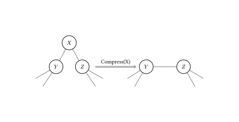

Rake 操作指定一个度为 11 的点 𝑥x，而且与点 𝑥x 相邻的点 𝑦y 的度数需大于 11，设点 𝑦y 的另一个邻点为 𝑧z，我们将点 𝑥x、边 𝑥𝑦xy 的信息放入边 𝑦𝑧yz 中储存，并删去它们．如图所示．

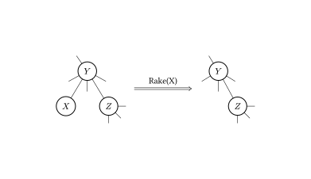

不难证明，任何一棵树都可以只用 Compress 操作和 Rake 操作来将它收缩为一条边，如图所示．

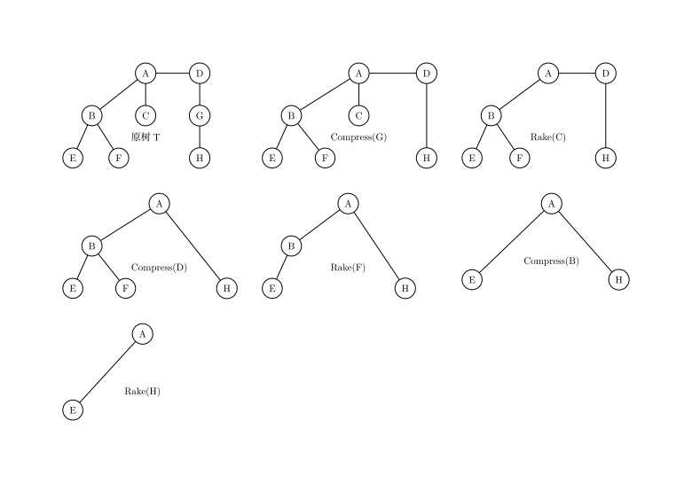

### 簇

为了表达方便，我们记在进行任何操作之前的原树为 𝑇T．在对 𝑇T 进行某些树收缩操作（可以不做任何操作）之后的树记为 𝑇𝑥Tx．

我们研究某个 𝑇𝑥Tx 中某一条边所包含的信息情况．

这条边除了带有它本身的信息（当然，如果这条边在 𝑇T 中不存在，这条边就没有本身的信息）之外，还可能包含其它通过 Compress/Rake 操作合并到它上面的点、边的信息．我们不妨先从下图中的树收缩过程中选取一条边，看看它所包含的信息在 𝑇T 中代表哪些点、边．

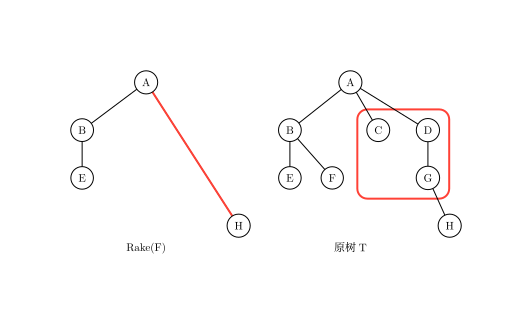

如图，选取的边和对应的图已用红线圈出．

可以看出，这条边所包含的信息在 𝑇T 中代表的点、边是连通的．我们可以推及，对于任一 𝑇𝑥Tx 中的任一条边储存的信息在 𝑇T 中总体现为一个连通子图．我们将这样的连通子图称为 **簇（Cluster）** ．

然而，簇是 **不完整的子图** ，它包含的某些边的端点不被簇它自己包含．于是我们将这些端点称作簇的 **端点（Endpoint）** ，将它包含的那些连通子图的点称作 **内点（Internal Node）** ，连通子图的边称作 **内边（Internal Edge）** ．

对于任意一个簇，都有以下性质：

  1. 簇只存储和维护内点和内边的信息．

  2. 簇有两个端点．这两个端点即为 𝑇𝑥Tx 中代表那个簇的边相连的那两个点．两个端点之间的路径我们称之为 **簇路径（Cluster Path）** ；记一个簇的两个端点分别为 𝑥x、𝑦y，我们下面用 𝐶(𝑥,𝑦)C(x,y) 来表示这个簇．

  3. 内点仅与端点或内点相连．

特别地，对于 𝑇T 中的每条边，都各自独立为一个簇（仅包含边自己的信息），这种簇我们称之为 **基簇（Base Cluster）** ．对于由 𝑇T 收缩到只有一条边的最终的 𝑇𝑥Tx，那条边代表的簇包含除了两个端点之外的整棵 𝑇T 的信息，这个簇我们称之为 **根簇（Root Cluster）** ．

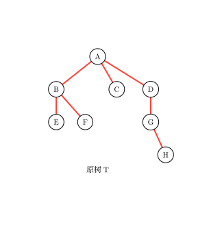

如图，上文提到的基簇已用红线标出．

从簇的视角来看 Compress/Rake 操作，我们发现这两个操作会将两个簇「合二为一」，剩下一个新簇，所以树收缩的过程也是所有的基簇合并为一个簇的过程．

所以我们也可以得到下图，是对一系列树收缩操作的另一表示．

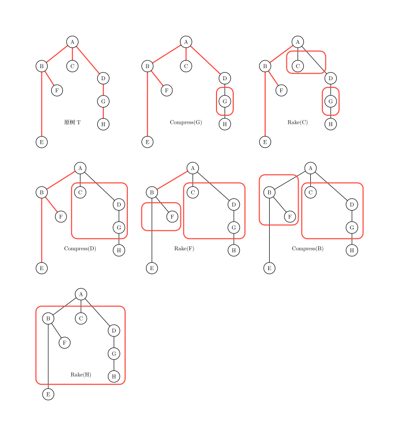

### Top Tree

我们现在想表示某一棵树进行树收缩的全过程．

我们可以用上文的两种方法来表示这一过程，但这样十分麻烦，如果树收缩进行了 𝑛n 步，我们就要用 𝑛n 棵树来表示整个树收缩．

考虑一个对某棵树进行某一树收缩的更简便表示，我们引入 **Top Tree** ．

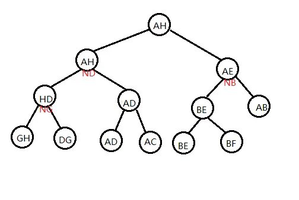

如图，是以上文的收缩方法和原树为基础的一棵 Top Tree．

Top Tree 有以下性质；

  1. 一棵 Top Tree 对应一棵原树和一种对其进行树收缩的方法，Top Tree 的每个节点都表示在某个 𝑇𝑥Tx 中的某一条边，也就是树收缩过程中形成的某一个簇．图中的形如 𝑁𝑥Nx 的点表示 `compress(x)` 这一操作形成的簇．

  2. Top Tree 中的一个节点有两个儿子（都分别代表一个簇），这个节点代表的簇是这两个簇通过 Compress 或 Rake 操作合并得到的新簇．

  3. Top Tree 的叶子节点是基簇，其根节点是根簇．因此我们按一棵 Top Tree 的拓扑序分层，它的每一层就代表了一棵 𝑇𝑥Tx．

### 用三度化 Self-Adjusting Top Tree 实现信息维护

#### 原理

Top Tree 对树收缩过程的极大简化，使我们看到通过维护树收缩过程来维护树上信息的可能性，SATT 即是通过这一原理来维护树上信息的．

注意到树收缩的过程也是树上信息不断加入的过程，我们执行一次 `compress(x)`，𝑥x 点的信息从此刻起就开始在某个簇中出现，影响着我们的统计结果．

假如我们现在用 Top Tree 来维护某棵树 𝑇T，树上的每个点，边都有权值，我们要维护的是 𝑇T 的权值和．

现在我们在维护时要对 𝑇T 中某个点 𝑥x 的权值进行修改，很明显，我们就需要更改 Top Tree 中所有簇信息包含 𝑥x 的节点信息，这样做单次时间复杂度会是 𝑂(𝑛)O(n) 级别的．

然而，如果我们选的点它在 Top Tree 中簇信息包含 𝑥x 的节点个数很少，也就是说使它的信息尽可能晚地加入簇中，我们单次操作的时间复杂度就会有一个很大的提升．如图．

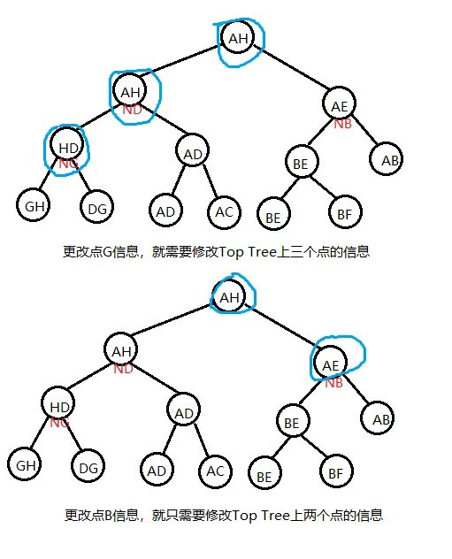

SATT 就是通过修改 **某个点/某条路径** 在树收缩过程中信息被加入簇中的先后顺序（以降低其在被修改时的单次时间复杂度）来维护树上信息的．

### 实际结构

我们先将一棵原树 𝑇T 分层定根，然后我们考虑对某种树收缩顺序的 Top Tree 的根簇，它有两个端点，我们令这其中一个端点就是原树的根，另一个端点任选．

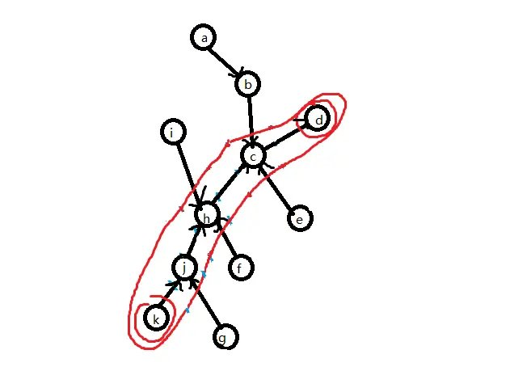

如图，给根簇选出一组端点，这里标注簇时将端点也圈进去了．

由树收缩的基本操作可知，簇路径上的点、边 (𝑗,ℎ,𝑐,𝑗ℎ,ℎ𝑐)(j,h,c,jh,hc) 的信息最后是通过 Compress 操作才加入 𝐶(𝑘,𝑔)C(k,g) 的，而的非簇路径点 (𝑎,𝑏,𝑖,𝑓,𝑔,𝑒,𝑖𝑔,⋯)(a,b,i,f,g,e,ig,⋯) 是通过 Rake 操作才加入 𝐶(𝑘,𝑔)C(k,g) 的．

我们将簇路径单独拿出来，这是一条形态特殊（为链）的树，我们为这棵树建出一棵 top tree（其代表的树收缩顺序任意）．

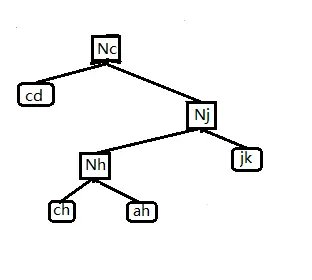

我们将这一结构称之为 **Compress Tree** ，因为在这棵 Top Tree 中任一个点的两个儿子之间是通过 Compress 操作来合并成它们的父亲．

Compress Tree 里的节点称为 **Compress Node** ．只考虑当前这条簇路径，一个非叶子的 Compress Node 就代表一次 compress 过程，表示将左儿子和右儿子信息合并起来，再将这个 `compress(x)` 本身存储的点 𝑥x 信息加入．这棵 Compress Tree 就维护了 𝐶(𝑘,𝑔)C(k,g) 簇路径的信息．

另外，在 Compress Tree 中，我们实际上还对使用的 Top Tree 做了一些限制．注意到 Compress Tree 维护的是一个 𝑇T 中点的深度两两不同的链，我们规定在 Compress Tree 中基簇的中序遍历顺序与对应的 𝑇T 中边的深度是一致的，且中序遍历越小深度越浅．同样，对于每个点 𝑥x 对应的 `compress(x)` 的关系也是如此．

现在来维护那些非簇路径的信息，我们假设这些非簇路径上的点、边已经形成了一个个极大簇，而这些极大簇是由这些用蓝线圈出的更小簇之间互相 Rake 形成的，对由一些更小簇合并形成一个极大簇的过程，我们用一个三叉树来表示，类似地，我们称这一结构为 **Rake Tree** ，对应地 Rake Tree 里的点就是 **Rake Node** ．每个 Rake Node 都代表一个簇，是由其左儿子和右儿子 Rake 到其中儿子代表的更小簇上形成的．具体可见下图，可知 Rake Tree 中的每个点都代表了 𝑇T 中具有相同端点的更小簇．

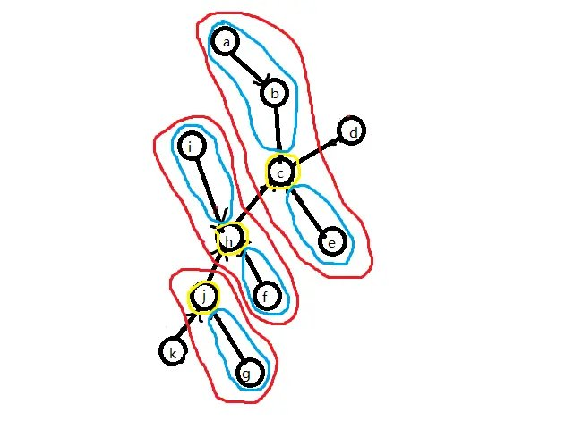

如图，蓝线圈出的是一个个极大簇，黄线圈出的是一个个更小簇．

对于那些更小簇，我们对它们进行相同处理，给它们选择簇路径、建出 Compress Tree、……如此递归下去，就建出了许多表示树收缩过程的 Compress Tree，Rake Tree．

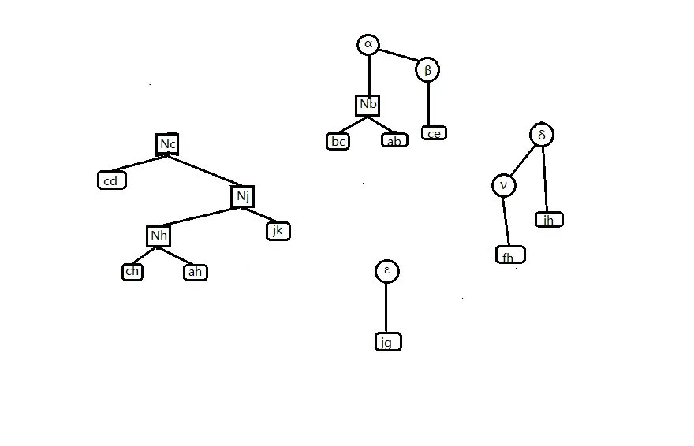

上图为原树的 Rake-Compress Tree（因为每个 Rake Node 都连着一棵 Compress Tree，所以表现为一棵 Rake Tree 连着许多 Compress Tree 的形态）和代表根簇路径的 Compress Tree．

考虑将这些树以某种方式拼接在一起，使它们形成一个有序的整体．记一个 Rake Tree 代表的最小簇的集合的公共端点是点 𝑥x．我们给这些 Rake Node 的中儿子（一个 Compress Tree 集合）都加入非 𝑥x 的另一端点，但仍保持其中序遍历和 Top Tree 的基本性质，如图．

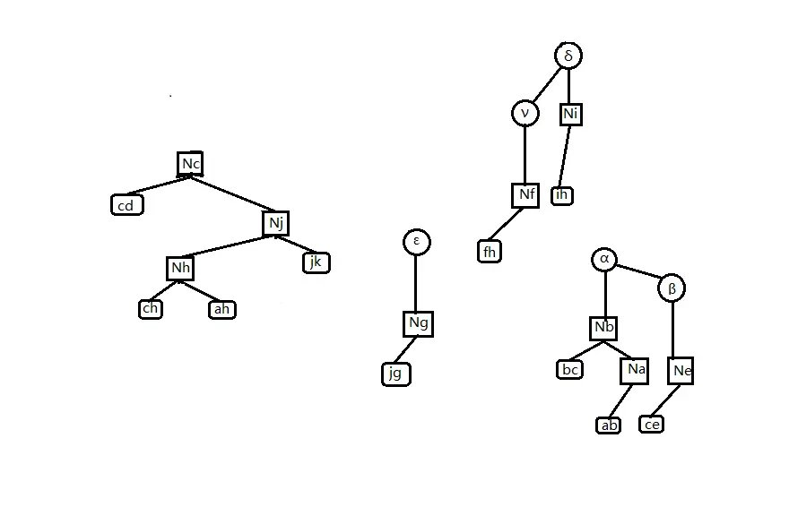

这一步相当于是让 Rake 操作加入某个 𝑇T 中点的操作直接发生在 Compress Tree 中，这不仅使我们能正确维护 Rake Node 的信息（只需将三个儿子信息合并即可），还使我们 Compress Tree 的结构更完整．下一步，我们将 Compress Tree 改为三叉树，若某个 Rake Tree 的公共端点是点 𝑥x，我们就将 Rake Tree 挂在 `compress(x)` 的中儿子处，如图．

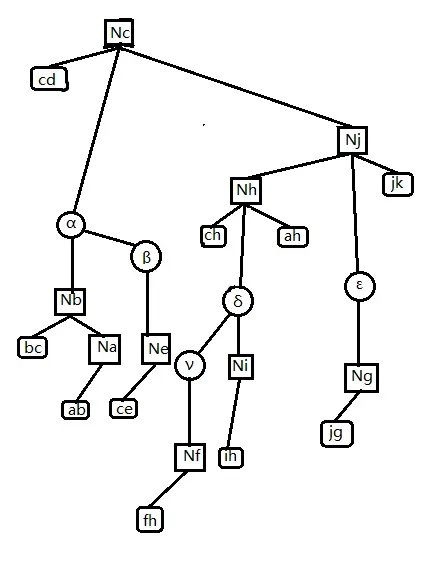

此时经过三叉化的 `compress(x)` 点，它的意义就变成先将其中儿子 Rake 到簇路径上，再统计左右儿子和点 𝑥x 的信息．

最后，我们再处理一下根簇路径的那棵 Compress Tree：与其它所有 Compress Tree 一致地，按中序遍历加入它的两个端点，使得它的根储存整棵 𝑇T 的信息．

于是我们就实现了用三度化 Self-Adjusting Top Tree 实现一棵树的信息维护．

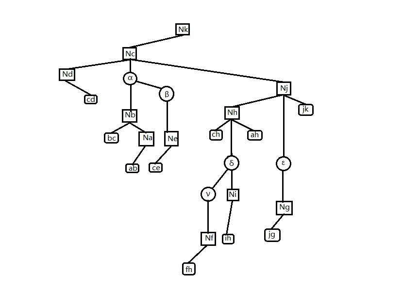

总结一下，SATT 有以下性质：

  1. SATT 由 Compress Tree 和 Rake Tree 组成，Compress Tree 是一棵特殊的 Top Tree；Rake Tree 是一个三叉树，它们都对应一棵树进行树收缩的过程．

  2. Compress Tree 里的点最多有三个儿子．Compress Tree 可以做类似于 Splay 树的旋转操作（只需保证其中序遍历不变即可，旋转一个点时保持其中儿子不动）．

  3. Rake Tree 里的点一定有一个中儿子．Rake Tree 可以做类似于 Splay 树的旋转操作（只需保证其中序遍历不变即可，旋转一个点时保持其中儿子不动）．

  4. SATT 的拓扑序反映了原树 𝑇T 的树收缩顺序．

我们在上文中提到的「修改某个点/某条路径在树收缩过程中信息被加入簇中的先后顺序」SATT 是否能实现呢，答案是肯定的．

在 SATT 中，有一个 `access(x)` 的操作，它的作用是使某点 𝑥x 成为根簇的非根端点，同时在 SATT 中使 `compress(x)` 成为 SATT 的根．

我们可以通过 `access(x)` 操作以均摊 𝑂(log⁡𝑛)O(log⁡n) 的复杂度使 SATT 中代表 `compress(x)` 的点旋到整棵 SATT 的树根，根据 SATT 的第四个性质，我们改变了 `compress(x)` 的操作顺序，使得它最晚执行，𝑥x 点的信息也就被最晚加入；这样当我们要修改 𝑥x 点的信息时，就只需要更新 `compress(x)`．

### 代码实现

#### Push 类函数

首先考虑上传信息，即 `Pushup(x)` 函数．在考虑对 SATT 的某个节点维护信息时，首先分这个点在 Compress Tree 还是在 Rake Tree 进行讨论，原因可见上文，不再赘述，下面以维护某个点的子树大小为例

```text 1 2 3 4 5 6 7 8 9 10 11 12 ``` |  ```text // ls(x) x的左儿子 // rs(x) x的右儿子 // ms(x) x的中儿子 // type==0 是 Compress Node // type==1 是 Rake Node void pushup ( int x , int type ) { if ( type == 0 ) size [ x ] = size [ rs ( x )] \+ size [ ms ( x )] \+ 1 ; else size [ x ] = size [ rs ( x )] \+ size [ ms ( x )] \+ size [ ls ( x )]; return ; } ```   
---|---  
  
查询点 𝑥x 的子树大小，就将其 Access 到 SATT 根，答案是其中儿子的 size +1+1；因为根据上文，在 Access 之后，其中儿子才是它的真子树．

然后考虑下传信息，即 `Pushdown(x)` 函数．我们如果要对原树中的某个子树做整体修改，一个很自然的想法是：将这个节点直接 Access 到 SATT 根节点，给它的中儿子打上一个标记即可．同理，查询子树就直接 Access 后查询中儿子．

我们如果要对原树中的某条路径做整体修改，我们就 expose 路径的两个端点，其中 `expose(x, y)` 是指使点 𝑥x 成为 𝑇T 的根节点，使点 𝑦y 成为根簇的另一个端点．对应在 SATT 上，此时根簇的 Compress Tree 就是 𝑥x 到 𝑦y 的路径．于是直接给根簇的 Compress Tree 打上一个标记即可．同理查询链 expose 后查询根节点即可．

于是我们就知道问题引入的问题怎么做了．

```text 1 2 3 4 5 6 7 8 9 10 11 12 13 14 15 16 17 18 19 20 21 22 23 24 25 26 27 28 29 30 31 32 ``` |  ```text void pushdown ( int x , int type ) { if ( type == 0 ) { // 处理链 chain [ ls ( x )] += chain [ x ] chain [ rs ( x )] += chain [ x ]; val [ ls ( x )] += chain [ x ]; val [ rs ( x )] += chain [ x ]; // 处理子树 subtree [ ls ( x )] += subtree [ x ]; subtree [ rs ( x )] += subtree [ x ]; subtree [ ms ( x )] += subtree [ x ]; val [ ls ( x )] += subtree [ x ]; val [ rs ( x )] += subtree [ x ]; val [ ms ( x )] += subtree [ x ]; subtree [ x ] = 0 ; } else { subtree [ ls ( x )] += subtree [ x ]; subtree [ rs ( x )] += subtree [ x ]; subtree [ ms ( x )] += subtree [ x ]; val [ ls ( x )] += subtree [ x ]; val [ rs ( x )] += subtree [ x ]; val [ ms ( x )] += subtree [ x ]; subtree [ x ] = 0 ; } return ; } // 下传标记 void pushall ( int x , int type ) { if ( ! isroot ( x )) pushall ( father [ x ], type ); pushdown ( x , type ); return ; } ```   
---|---  
  
#### Splay 类函数

我们知道 SATT 中的 Rake Tree 和 Compress Tree 都是可以旋转的，也就是说它们可以用 Splay 来维护．因此我们可以写出以下代码：

```text 1 2 3 4 5 6 7 8 9 10 11 12 13 14 15 16 17 18 19 20 21 22 23 24 25 26 27 28 29 30 31 32 ``` |  ```text // 是一个节点的中儿子或无父亲 // ls 一个SATT节点的左儿子 // rs 一个SATT节点的右儿子 // ms 一个SATT节点的中儿子 // type==1 在 Rake Tree中 // type==0 在 Compress Tree中 bool isroot ( int x ) { return rs ( father [ x ]) != x && ls ( father [ x ]) != x ; } bool direction ( int x ) { return rs ( father [ x ]) == x ; } void rotate ( int x , int type ) { int y = father [ x ], z = father [ y ], d = direction ( x ), w = son [ x ][ d ^ 1 ]; if ( z ) son [ z ][ ms ( z ) == y ? 2 : direction ( y )] = x ; son [ x ][ d ^ 1 ] = y ; son [ y ][ d ] = w ; if ( w ) father [ w ] = y ; father [ y ] = x ; father [ x ] = z ; pushup ( y , type ); pushup ( x , type ); return ; } void splay ( int x , int type , int goal = 0 ) { pushall ( x , ty ); // 下传标记 for ( int y ; y = father [ x ], ( ! isroot ( x )) && y != goal ; rotate ( x , ty )) { if ( father [ y ] != goal && ( ! isroot ( y ))) { rotate ( direction ( x ) ^ diretion ( y ) ? x : y , type ); } } return ; } ```   
---|---  
  
值得注意的是，函数 `direction` 和 `isroot` 与普通 Splay 的不同．因为无论这个点怎么转，这个点的中儿子是不会变的．

#### Access 类函数

`access(x)` 的意义是：将点 𝑥x 旋转到整个 SATT 的根处，使点 𝑥x 成为根簇的两个端点之一（另一端点即为 𝑇T 的根节点），同时不能改变原树的结构和原树的根．

为了实现 `access(x)`，我们先将其旋转到其所在 Compress Tree 的树根，再把点 𝑥x 的右儿子去掉，使点 𝑥x 成为其所在 Compress Tree 对应簇的端点．

```text 1 2 3 4 5 6 7 8 9 ``` |  ```text if ( rs ( x )) { int y = new_node (); setfather ( ms ( x ), y , 0 ); setfather ( rs ( x ), y , 2 ); rs ( x ) = 0 ; setfather ( y , x , 2 ); pushup ( y , 1 ); pushup ( x , 0 ); } ```   
---|---  
  
如果这时点 𝑥x 已经到了根部，则退出；若没有，则执行以下步骤，以让它跨过它上面的 Rake Tree：

  1. 将其父亲节点（一定是一个 Rake Node），splay 到其 Rake Tree 的树根；

  2. 将 𝑥x 的爷节点（一定是一个 Compress Node）splay 到其 Compress Tree 根部．

  3. 若 𝑥x 的爷节点有一个右儿子，则将点 x 和爷节点的右儿子互换，更新信息，然后退出．

  4. 若爷节点没有右儿子，则先让点 𝑥x 成为爷节点的右儿子，此时点 𝑥x 原来的父节点没有中儿子，根据上文 Rake Node 的性质，它不能存在．于是调用 `Delete` 函数，将其删除，然后退出．

1，2 两个步骤合称为 **Local Splay** ．3，4 两个步骤合称为 **Splice** ．但我们方便起见，将它们都写在 `Splice(x)` 函数里．

上文提到的 `Delete(x)` 函数是这样的：

  1. 检视将要删除的点 𝑥x 有没有左儿子，若有，则将左儿子的子树后继续旋转到点 𝑥x 下方（成为新的左儿子），然后将右儿子（若有）变成左儿子的右儿子，此时点 𝑥x 的左儿子就代替了点 𝑥x．这相当于 Splay 的合并操作．

  2. 若没有左儿子，则直接让其右儿子代替点 𝑥x．

不难发现，`Splice(x)` 改变了原树的一些簇的端点选取．一次 splice 完了之后，我们将点 𝑥x 的父亲节点当作新的点 𝑥x，进行下一次 splice．

最终我们会发现，我们最开始要操作的点 𝑥x 一定在根簇的 Compress Tree 最右端．我们只需最后做一次 **Global Splay** ，将其旋至 SATT 根部即可．

```text 1 2 3 4 5 6 7 8 9 10 11 12 13 14 15 16 17 18 19 20 21 22 23 24 25 26 27 28 29 30 31 32 33 34 35 36 37 38 39 40 41 42 43 44 45 46 47 48 49 50 51 52 53 54 55 56 57 58 59 60 61 62 63 64 65 66 67 68 69 70 71 ``` |  ```text // ls 一个SATT节点的左儿子 // rs 一个SATT节点的右儿子 // ms 一个SATT节点的中儿子 // son[x][0] ls // son[x][1] rs // son[x][2] ms // type==1 在 Rake Tree中 // type==0 在 Compress Tree中 int new_node () { if ( top ) { top \-- ; return Stack [ top \+ 1 ]; } return ++ tot ; } void setfather ( int x , int fa , int type ) { if ( x ) father [ x ] = fa ; son [ fa ][ type ] = x ; } void Delete ( int x ) { setfather ( ms ( x ), father [ x ], 1 ); if ( ls ( x )) { int p = ls ( x ); pushdown ( p , 1 ); while ( rs ( p )) p = rs ( p ), pushdown ( p , 1 ); splay ( p , 1 , x ); setfather ( rs ( x ), p , 1 ); setfather ( p , father [ x ], 2 ); pushup ( p , 1 ); pushup ( father [ x ], 0 ); } else setfather ( rs ( x ), father [ x ], 2 ); Clear ( x ); } void splice ( int x ) { // local splay splay ( x , 1 ); int y = father [ x ]; splay ( y , 0 ); pushdown ( x , 1 ); // splice if ( rs ( y )) { swap ( father [ ms ( x )], father [ rs ( y )]); swap ( ms ( x ), rs ( y )); } else Delete ( x ); pushup ( x , 1 ); pushup ( y , 0 ); } void access ( int x ) { splay ( x , 0 ); if ( rs ( x )) { int y = new_node (); setfather ( ms ( x ), y , 0 ); setfather ( rs ( x ), y , 2 ); rs ( x ) = 0 ; setfather ( y , x , 2 ); pushup ( y , 1 ); pushup ( x , 0 ); } while ( father [ x ]) { splice ( father [ x ]); x = father [ x ]; pushup ( x , 0 ); } splay ( x , 0 ) // global splay } ```   
---|---  
  
若要让一个点成为原树的根，那么我们就将点 𝑥x Access 到 SATT 的根节点，可知此时点 𝑥x 已经是最终状态的簇一个端点．由 Compress Tree 的中序遍历性质可知，将点 𝑥x 所在的 Compress Tree 左右颠倒（所有点的左右儿子互换），就使点 𝑥x 成为原树的根．在具体实现中，我们通过给点 𝑥x 打上一个翻转标记，之后下传来进行这一过程．

```text 1 2 3 4 ``` |  ```text void makeroot ( int x ) { access ( x ); push_rev ( x ); } ```   
---|---  
  
于是 `expose(x, y)` 就呼之欲出：

```text 1 2 3 4 ``` |  ```text void expose ( int x , int y ) { makeroot ( x ); access ( y ); } ```   
---|---  
  
### Link & Cut

现在我们要将原树中两个不连通的点之间连一条边，我们先让其中的一个点 𝑥x 成为原树的根，再将另一个点 𝑦y 旋转到根处，可知此时应该使点 𝑦y 成为点 𝑥x 的右儿子．然后在点 𝑦y 的右儿子上挂上这一条边（在只需维护点的 SATT 中，这一步可省）．

```text 1 2 3 4 5 6 7 8 9 ``` |  ```text void Link ( int x , int y , int z ) { // z代表连接 x, y的边 access ( x ); makeroot ( y ); setfather ( y , x , 1 ); setfather ( z , y , 0 ); pushup ( x , 0 ); pushup ( y , 0 ); } ```   
---|---  
  
`Cut` 跟 `Link` 原理差不多

```text 1 2 3 4 5 6 ``` |  ```text void cut ( int x , int y ) { expose ( x , y ); clear ( rs ( x )); // 删掉 xy 这一基簇 father [ x ] = ls ( y ) = rs ( x ); pushup ( y , 0 ); } ```   
---|---  
  
### 完整代码

[Luogu P3690【模板】动态树](https://www.luogu.com.cn/problem/P3690)

```text 1 2 3 4 5 6 7 8 9 10 11 12 13 14 15 16 17 18 19 20 21 22 23 24 25 26 27 28 29 30 31 32 33 34 35 36 37 38 39 40 41 42 43 44 45 46 47 48 49 50 51 52 53 54 55 56 57 58 59 60 61 62 63 64 65 66 67 68 69 70 71 72 73 74 75 76 77 78 79 80 81 82 83 84 85 86 87 88 89 90 91 92 93 94 95 96 97 98 99 100 101 102 103 104 105 106 107 108 109 110 111 112 113 114 115 116 117 118 119 120 121 122 123 124 125 126 127 128 129 130 131 132 133 134 135 136 137 138 139 140 141 142 143 144 145 146 147 148 149 150 151 152 153 154 155 156 157 158 159 160 161 162 163 164 165 166 167 168 169 170 171 172 173 174 175 176 177 178 179 180 181 182 183 184 185 186 187 188 189 190 ``` |  ```text #include <iostream> #define ls(x) T[x][0] #define rs(x) T[x][1] #define ms(x) T[x][2] using namespace std ; constexpr int MAXN = 300005 ; int T [ MAXN ][ 3 ], s [ MAXN ][ 2 ], tot , v [ MAXN ], r [ MAXN ], top , st [ MAXN ], f [ MAXN ]; int nnd () { if ( top ) { top \-- ; return st [ top \+ 1 ]; } return ++ tot ; } bool isr ( int x ) { return rs ( f [ x ]) != x && ls ( f [ x ]) != x ; } bool dir ( int x ) { return rs ( f [ x ]) == x ; } void psu ( int x , int ty ) { if ( ty ) { s [ x ][ 1 ] = s [ ls ( x )][ 1 ] ^ s [ rs ( x )][ 1 ] ^ s [ ms ( x )][ 1 ]; return ; } s [ x ][ 0 ] = s [ ls ( x )][ 0 ] ^ v [ x ] ^ s [ rs ( x )][ 0 ]; s [ x ][ 1 ] = s [ ls ( x )][ 1 ] ^ s [ ms ( x )][ 1 ] ^ s [ rs ( x )][ 1 ] ^ v [ x ]; } void psr ( int x ) { if ( ! x ) return ; r [ x ] ^= 1 ; swap ( ls ( x ), rs ( x )); } void psd ( int x , int ty ) { if ( ty ) return ; if ( r [ x ]) { psr ( ls ( x )); psr ( rs ( x )); r [ x ] = 0 ; } } void upd ( int x , int ty ) { if ( ! isr ( x )) upd ( f [ x ], ty ); psd ( x , ty ); } void stf ( int x , int fa , int ty ) { if ( x ) f [ x ] = fa ; T [ fa ][ ty ] = x ; } void rtt ( int x , int ty ) { int y = f [ x ], z = f [ y ], d = dir ( x ), w = T [ x ][ d ^ 1 ]; if ( z ) T [ z ][ ms ( z ) == y ? 2 : dir ( y )] = x ; T [ x ][ d ^ 1 ] = y ; T [ y ][ d ] = w ; if ( w ) f [ w ] = y ; f [ y ] = x ; f [ x ] = z ; psu ( y , ty ); psu ( x , ty ); } void spy ( int x , int ty , int gl = 0 ) { upd ( x , ty ); for ( int y ; y = f [ x ], ( ! isr ( x )) && y != gl ; rtt ( x , ty )) { if ( f [ y ] != gl && ( ! isr ( y ))) rtt ( dir ( x ) ^ dir ( y ) ? x : y , ty ); } } void cle ( int x ) { ls ( x ) = ms ( x ) = rs ( x ) = s [ x ][ 0 ] = s [ x ][ 1 ] = r [ x ] = v [ x ] = 0 ; st [ ++ top ] = x ; } void del ( int x ) { stf ( ms ( x ), f [ x ], 1 ); if ( ls ( x )) { int p = ls ( x ); psd ( p , 1 ); while ( rs ( p )) p = rs ( p ), psd ( p , 1 ); spy ( p , 1 , x ); stf ( rs ( x ), p , 1 ); stf ( p , f [ x ], 2 ); psu ( p , 1 ); psu ( f [ x ], 0 ); } else stf ( rs ( x ), f [ x ], 2 ); cle ( x ); } void spl ( int x ) { spy ( x , 1 ); int y = f [ x ]; spy ( y , 0 ); psd ( x , 1 ); if ( rs ( y )) { swap ( f [ ms ( x )], f [ rs ( y )]); swap ( ms ( x ), rs ( y )); psu ( x , 1 ); } else del ( x ); psu ( rs ( y ), 0 ); psu ( y , 0 ); } void acs ( int x ) { spy ( x , 0 ); int ys = x ; if ( rs ( x )) { int y = nnd (); stf ( ms ( x ), y , 0 ); stf ( rs ( x ), y , 2 ); rs ( x ) = 0 ; stf ( y , x , 2 ); psu ( y , 1 ); psu ( x , 0 ); } while ( f [ x ]) { spl ( f [ x ]); x = f [ x ]; } spy ( ys , 0 ); } int fdr ( int x ) { acs ( x ); psd ( x , 0 ); while ( ls ( x )) x = ls ( x ), psd ( x , 0 ); spy ( x , 0 ); return x ; } void mkr ( int x ) { acs ( x ); psr ( x ); } void epo ( int x , int y ) { mkr ( x ); acs ( y ); } void lnk ( int x , int y ) { if ( fdr ( x ) == fdr ( y )) return ; acs ( x ); mkr ( y ); stf ( y , x , 1 ); psu ( x , 0 ); psu ( y , 0 ); } void cu ( int x , int y ) { epo ( x , y ); if ( ls ( y ) != x || rs ( x )) return ; f [ x ] = ls ( y ) = 0 ; psu ( y , 0 ); } int main () { cin . tie ( nullptr ) -> sync_with_stdio ( false ); int n , m ; cin >> n >> m ; tot = n ; for ( int i = 1 ; i <= n ; i ++ ) { cin >> v [ i ]; psu ( i , 0 ); } for ( int i = 1 ; i <= m ; i ++ ) { int op , U , V ; cin >> op >> U >> V ; if ( op == 0 ) { epo ( U , V ); cout << s [ V ][ 0 ] << '\n' ; } if ( op == 1 ) lnk ( U , V ); if ( op == 2 ) cu ( U , V ); if ( op == 3 ) { acs ( U ); v [ U ] = V ; psu ( U , 0 ); } } return 0 ; } ```   
---|---  
  
### SATT 的时间复杂度证明

设在一棵 SATT（点数为 𝑛n）中，其当前状态 𝑥x 的势能函数为

𝜑(𝑥)=𝑛∑𝑖=1𝑟(𝑖)φ(x)=∑i=1nr(i)

其中 𝑟(𝑖) =⌈log2⁡siz(𝑖)⌉r(i)=⌈log2⁡siz(i)⌉．siz(𝑖)siz(i) 为以 𝑖i 为根的子树大小．

则 SATT 的 splay 的均摊复杂度显然仍是 3𝑛log⁡𝑛 +13nlog⁡n+1，即使 SATT 是一个三叉树．

因此对于 SATT，我们只要证得 Access 函数复杂度正确，就能证得 SATT 的时间复杂度．

我们逐步分析 Accese 的均摊复杂度．

我们先要将点 𝑥x 旋至其所在 Compress Tree 的根，则这一步的均摊复杂度

𝑎≤3log⁡𝑛+1a≤3log⁡n+1

接着我们要使点 𝑥x 无右儿子，则这一步的均摊复杂度

𝑎=1+𝑟′(𝛾)−0≤log⁡𝑛+1a=1+r′(γ)−0≤log⁡n+1

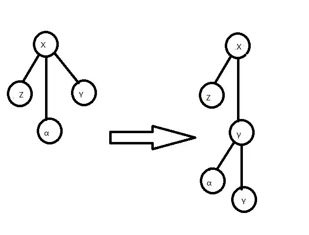

如图，为去掉点 𝑥x 的右儿子过程．

然后是 Local Splay，Splice 交替进行的过程，经过若干次 Splice，点 𝑥x 被旋至 SATT 的根．我们对其中一组 Local Splay，Splice 进行分析：

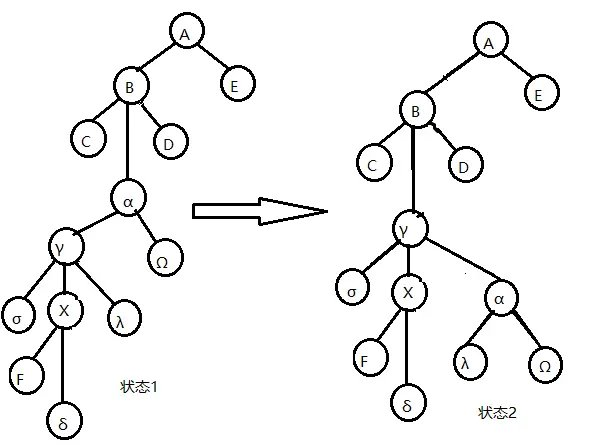

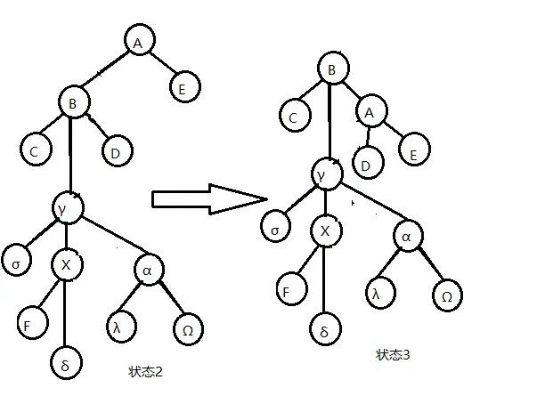

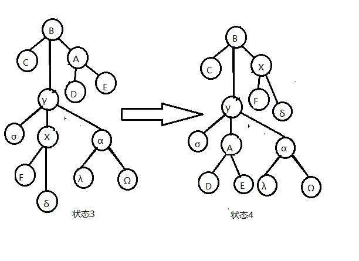

如图，体现了对点 𝑥x 做一次 Splice 的过程，不包括最后左旋点 𝑥x 的部分．

为表达方便，设 𝑟𝑥(𝑖)rx(i) 为点 𝑖i 在状态 𝑥x 时的 𝑟r 值．

由图，易知由状态 1 到状态 2 的操作（将点 𝑥x 的父亲旋至其 Rake Tree 的根部的 Local Splay 操作）的均摊复杂度

𝑎≤3(𝑟2(𝛾)−𝑟1(𝛾))+1a≤3(r2(γ)−r1(γ))+1

由图，易知由状态 2 到状态 3 的操作（将点 𝑥x 的爷节点旋至其 Compress Tree 的根部的 Local Splay 操作）的均摊复杂度

𝑎≤3(𝑟3(𝐵)−𝑟2(𝐵))+1a≤3(r3(B)−r2(B))+1

重点分析由状态 3 到状态 4 的操作（Splice）

𝑎=𝑟4(𝛾)−𝑟3(𝛾)+1a=r4(γ)−r3(γ)+1

不难发现 𝑟4(𝛾) ≤𝑟3(𝐵)r4(γ)≤r3(B)

故这一次操作的均摊复杂度为

𝑎≤𝑟3(𝐵)−𝑟3(𝛾)+1≤3(𝑟3(𝐵)−𝑟3(𝛾))+1a≤r3(B)−r3(γ)+1≤3(r3(B)−r3(γ))+1

综合上述过程，一次 Splice 的复杂度为

𝑎≤3𝑟3(𝐵)+3𝑟3(𝐵)+3𝑟2(𝛾)−3𝑟3(𝛾)−3𝑟2(𝐵)−3𝑟1(𝛾)+3a≤3r3(B)+3r3(B)+3r2(γ)−3r3(γ)−3r2(B)−3r1(γ)+3

记下一次 Splice 的点 𝑋X（即状态 4 中的点 𝐵B）的 𝑟r 值为 𝑟′(𝑋)r′(X)，并注意到 𝑟3(𝛾),𝑟1(𝛾) ≥𝑟1(𝑋)r3(γ),r1(γ)≥r1(X)，𝑟3(𝐵),𝑟2(𝛾) ≤𝑟′(𝑋)r3(B),r2(γ)≤r′(X) 且 𝑟3(𝐵) =𝑟2(𝐵)r3(B)=r2(B)，所以

𝑎≤9(𝑟′(𝑋)−𝑟(𝑋))+3a≤9(r′(X)−r(X))+3

除了上面这个复杂度以外，在 Splice 中可能还会有因 `delete(x)` 产生的额外均摊复杂度，记这一部分为 𝑎′ ≤3log⁡𝑛 +1a′≤3log⁡n+1．

先不管 𝑎′a′ 部分，每次 Splice 的 𝑟′(𝑋)r′(X) 等于下一次的 𝑟(𝑋)r(X)，且第一次 Splice 的 𝑟(𝑋)r(X) 等于我们一开始旋转点 𝑥x 到其 Compress Tree 树根时的 𝑟(𝑋)r(X)，则对于不计 `delete(x)` 的一次 `access(x)` 复杂度，我们有：

𝑎≤9(𝑟′(𝑥)−𝑟(𝑥))+3𝑘+1a≤9(r′(x)−r(x))+3k+1

其中 𝑘k 为 Splice 次数．

看样子 𝑎a 会带一个 3𝑘 +13k+1 导致均摊复杂度无法分析，但我们有办法来对付它，注意到 zig-zig/zig-zag 的旋转可以这么均摊

𝑎≤3(𝑟′(𝑋)−𝑟(𝑋))+𝑞≤3(𝑞−1)(𝑟′(𝑋)−𝑟(𝑋))a≤3(r′(X)−r(X))+q≤3(q−1)(r′(X)−r(X))

如果我们能找到足够多的 zig-zig，zig-zag 操作，我们就可以将这 3𝑘 +13k+1 平摊到这些操作上去，从而消掉这个 3𝑘 +13k+1．

我们发现 Globel Splay 里面就有这么多的 zig-zig，zag-zig 来给我们使用，因为 Globel Splay 里面点的个数一定大于 𝑘k，而从点 𝑥x 到 Globel Splay 根部路径的点数一定不少于 𝑘k，也就是说一次 `access(x)` 中一定会至少有 𝑘2k2 个 zig-zag 操作，算上 Globel Splay 的均摊复杂度 𝑎 ≤3log⁡𝑛 +1a≤3log⁡n+1，一次 `access(x)` 不记 `delete(x)` 的均摊复杂度为

𝑎≤9(𝑟′(𝑋)−𝑟(𝑋))+3𝑘+1+18(𝑟″(𝑋)−𝑟′(𝑋))−𝑆+1+3log⁡𝑛+1,𝑆≥3𝑘𝑎≤18(𝑟″(𝑋)−𝑟(𝑋))+2+3log⁡𝑛+1𝑎≤21(𝑟″(𝑋)−𝑟(𝑋))+3a≤9(r′(X)−r(X))+3k+1+18(r″(X)−r′(X))−S+1+3log⁡n+1,S≥3ka≤18(r″(X)−r(X))+2+3log⁡n+1a≤21(r″(X)−r(X))+3

现在算上 𝑎′a′，列出进行 𝑚m 次 `access(x)` 操作的总式子．

𝑚∑𝑖=1𝑎′𝑖+𝑚∑𝑖=1𝑎𝑖=𝑚∑𝑖=1𝑐𝑖+𝜑(𝑥𝑛)−𝜑(𝑥0)∑i=1mai′+∑i=1mai=∑i=1mci+φ(xn)−φ(x0)

我们要求的是实际复杂度

𝑚∑𝑖=1𝑐𝑖=𝑚∑𝑖=1𝑎𝑖+𝑚∑𝑖=1𝑎′𝑖−𝜑(𝑥𝑛)+𝜑(𝑥0)≤𝑚∑𝑖=1𝑎′𝑖+21𝑚log⁡𝑛+𝑛log⁡𝑛+3𝑚∑i=1mci=∑i=1mai+∑i=1mai′−φ(xn)+φ(x0)≤∑i=1mai′+21mlog⁡n+nlog⁡n+3m

注意到 `delete(x)` 操作的本质是删掉一个 Rake Node，但我们在 𝑚m 次操作中最多只会添加 𝑚m 个 Rake Node，由 Rake Node 的定义，我们初始时最多有 𝑛n 个 Rake Node，也就是说我们总共只会做 𝑚 +𝑛m+n 次 `delete(x)` 操作，由 𝑎′ ≤3log⁡𝑛 +1a′≤3log⁡n+1 可知

𝑚∑𝑖=1𝑐𝑖≤3(𝑚+𝑛)log⁡𝑛+21𝑚log⁡𝑛+𝑛log⁡𝑛+4𝑚+𝑛∑i=1mci≤3(m+n)log⁡n+21mlog⁡n+nlog⁡n+4m+n

所以我们就证明了 Access 的复杂度，而其他函数要么基于 Access 要么单次时间复杂度为常数，所以我们就证明了 SATT 的复杂度．

顺便一提，如果像 LCT 一样省略 Global Splay 的过程，改为在每次 Splice 时直接将要 Access 的点旋转一下，这样做时间复杂度也是对的（实测省略 Global Splay 的版本要快很多，能与 LCT 在 Luogu P3690 跑得不分上下）．

### 例题

#### 例题 1

[CEOI 2019 Dynamic Diameter](https://loj.ac/p/3163)

给定一棵 𝑛n 个节点的树，每条边有边权，有 𝑞q 次更新，每次修改一条边的边权，并询问树的直径．强制在线．

维护动态直径，建出 SATT 后，我们只需要在 `Pushup(x)` 里面维护每个点的答案，最后查询根节点的答案（即整棵树的直径）就可以了．

```text 1 2 3 4 5 6 7 8 9 10 11 12 13 14 15 16 17 18 19 20 21 22 ``` |  ```text void pushup ( int x , int op ) { if ( op == 0 ) { // 是 Compress Node len [ x ] = len [ ls ( x )] \+ len [ rs ( x )]; diam [ x ] = maxs [ ls ( x )][ 1 ] \+ maxs [ rs ( x )][ 0 ]; diam [ x ] = max ( diam [ x ], max ( maxs [ ls ( x )][ 1 ], maxs [ rs ( x )][ 0 ]) \+ maxs [ ms ( x )][ 0 ]); diam [ x ] = max ( diam [ x ], max ( max ( diam [ ls ( x )], diam [ rs ( x )]), diam [ ms ( x )])); maxs [ x ][ 0 ] = max ( maxs [ ls ( x )][ 0 ], len [ ls ( x )] \+ max ( maxs [ ms ( x )][ 0 ], maxs [ rs ( x )][ 0 ])); maxs [ x ][ 1 ] = max ( maxs [ rs ( x )][ 1 ], len [ rs ( x )] \+ max ( maxs [ ms ( x )][ 0 ], maxs [ ls ( x )][ 1 ])); } else { // 是 Rake Node diam [ x ] = maxs [ ls ( x )][ 0 ] \+ maxs [ rs ( x )][ 0 ]; diam [ x ] = max ( diam [ x ], maxs [ ms ( x )][ 0 ] \+ max ( maxs [ ls ( x )][ 0 ], maxs [ rs ( x )][ 0 ])); diam [ x ] = max ( max ( diam [ x ], diam [ ms ( x )]), max ( diam [ ls ( x )], diam [ rs ( x )])); maxs [ x ][ 0 ] = max ( maxs [ ms ( x )][ 0 ], max ( maxs [ ls ( x )][ 0 ], maxs [ rs ( x )][ 0 ])); } return ; } ```   
---|---  
  
其中 𝑑𝑖𝑎𝑚diam 是当前点的答案（这个点代表的簇的直径）．𝑙𝑒𝑛len 表示当前 Compress Node 所在簇路径的长度，𝑚𝑎𝑥𝑠0/1maxs0/1 表示 Compress Node 到簇内点和端点的不选簇路径儿子/不选父亲的最大距离（如果是 Rake Node 则只存储选取当前簇的上端点到簇内点和端点的最大距离 𝑚𝑎𝑥𝑠0maxs0）．每次查询 SATT 根节点的 diam 即可，正确性显然．

注意对 `Pushrev(x)` 做一些改动．

```text 1 2 3 4 5 6 ``` |  ```text void pushrev ( int x ) { if ( ! x ) return ; r [ x ] ^= 1 ; swap ( ls ( x ), rs ( x )); swap ( maxs [ x ][ 0 ], maxs [ x ][ 1 ]); } ```   
---|---  
  
#### 例题 2

[「CSP-S 2019」树的重心](https://loj.ac/p/3213)

给定一棵树，求出单独删去树的每条边后，分裂出的两个子树的重心编号和之和．

假如我们能动态 𝑂(log⁡𝑛)O(log⁡n) 维护树的重心，我们就做出这个题了．

SATT 支持动态 𝑂(log⁡𝑛)O(log⁡n) 维护树的重心，做到这需要 **非局部搜索（Non-local Search）** ．

对于一种树上的性质，如果一个点/一条边在整棵树中有这种性质，且在所有包含它的子树中都包含此种性质，我们就称这个性质是 **局部的（Local）** ，否则称它是 **非局部的（Non-local）** ．局部信息一般可以通过 `pushup(x)` 来维护

例如，权值最小值是局部的，因为一个点/一条边如果在整棵树中权值最小，那么在所有包含它的子树中它也是权值最小的，而权值第二小显然就是非局部的．

我们上文维护的 𝑑𝑖𝑎𝑚diam 也是局部信息．

回到正题，重心显然是一个非局部信息，无法通过简单的 `pushup(x)` 来维护．我们考虑在 SATT 上搜索：

我们的搜索从 SATT 的根节点，即根簇开始．注意到重心有很好的性质：假如有一条边的一侧点的个数大于等于另一侧点的个数，那么边的这一侧一定至少有一个重心（重心可能有两个）．

记 𝑠𝑢𝑚sum 表示某一个簇的点个数，𝑚𝑎𝑥𝑠maxs 为一棵 Rake Tree 的所有 Rake Node 中儿子的 𝑠𝑢𝑚sum 最大值．

```text 1 2 3 4 5 6 7 8 9 10 ``` |  ```text void pushup ( int x , int op ) { if ( op == 0 ) { // 是 Compress Node sum [ x ] = sum [ ls ( x )] \+ sum [ rs ( x )] \+ sum [ ms ( x )] \+ 1 ; } else { // 是 Rake Node maxs [ x ] = max ( maxs [ ls ( x )], max ( maxs [ rs ( x )], sum [ ms ( x )])); sum [ x ] = sum [ ls ( x )] \+ sum [ rs ( x )] \+ sum [ ms ( x )]; } } ```   
---|---  
  
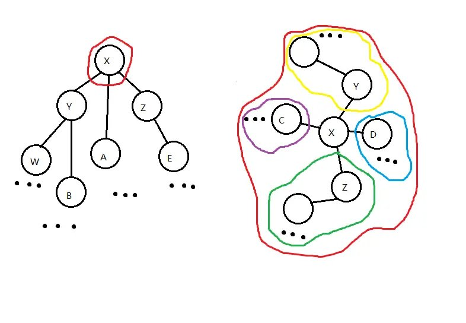

如图，为在进行 Non-local Search 时的 SATT 和对应的原树 𝑇T．

我们做如下比较：

  1. 比较簇 𝑐𝑜𝑚𝑝𝑟𝑒𝑠𝑠(𝑌)compress(Y) 的 𝑠𝑢𝑚sum 值与簇 𝑐𝑜𝑚𝑝𝑟𝑒𝑠𝑠(𝑍)compress(Z)、簇 𝐴A 和点 𝑋X 的并（我们暂称为簇 𝛼α）的 𝑠𝑢𝑚sum 值．若 𝑐𝑜𝑚𝑝𝑟𝑒𝑠𝑠(𝑌)compress(Y) 的 𝑠𝑢𝑚sum 值大于等于后者，说明至少有一个重心在 𝑐𝑜𝑚𝑝𝑟𝑒𝑠𝑠(𝑌)compress(Y) 的子树中，我们递归到 𝑐𝑜𝑚𝑝𝑟𝑒𝑠𝑠(𝑌)compress(Y) 搜索．（如果此处取等，点 𝑋X 也是一个重心，需要记录）

  2. 比较簇 𝑐𝑜𝑚𝑝𝑟𝑒𝑠𝑠(𝑍)compress(Z) 的 𝑠𝑢𝑚sum 值与簇 𝑐𝑜𝑚𝑝𝑟𝑒𝑠𝑠(𝑌)compress(Y)、簇 𝐴A 和点 𝑋X 的并（我们暂称为簇 𝛽β）的 𝑠𝑢𝑚sum 值．若 𝑐𝑜𝑚𝑝𝑟𝑒𝑠𝑠(𝑍)compress(Z) 的 𝑠𝑢𝑚sum 值大于等于后者，说明至少有一个重心在 𝑐𝑜𝑚𝑝𝑟𝑒𝑠𝑠(𝑍)compress(Z) 的子树中，我们递归到 𝑐𝑜𝑚𝑝𝑟𝑒𝑠𝑠(𝑍)compress(Z) 搜索．（如果此处取等，点 𝑋X 也是一个重心，需要记录）

  3. 比较点 𝑥x 中儿子 Rake tree 之中 𝑠𝑢𝑚sum 最大的更小簇的 𝑠𝑢𝑚sum 值与簇 𝑐𝑜𝑚𝑝𝑟𝑒𝑠𝑠(𝑌)compress(Y)、簇 𝐴A、点 𝑋X 及其它更小簇的并（我们暂称为簇 𝑌Y）的 𝑠𝑢𝑚sum 值，若那个更小簇的 𝑠𝑢𝑚sum 值大于等于后者，说明至少有一个重心在那个更小簇的子树中，我们递归到它搜索．如果此处取等，点 𝑋X 也是一个重心，需要记录．

  4. 若以上比较都不递归，则点 𝑋X 一定是一个重心，记录并退出．

第一步的搜索显然正确，之后应该怎么搜呢？

假如我们递归到 𝑌Y，则现在 𝑌Y 储存信息的并不完整，因为 𝑐𝑜𝑚𝑝𝑟𝑒𝑠𝑠(𝑌)compress(Y) 里面只存储了它自己这个簇的信息，而我们要求的是整棵树的重心．解决方法是，将之前簇的信息记录下来，在点 𝑌Y 上比较计算时将上一个簇的信息与点 𝑌Y 自己的信息合并处理．具体实现如下：

```text 1 2 3 4 5 6 7 8 9 10 11 12 13 14 15 16 17 18 19 20 21 22 23 24 25 26 27 28 29 30 31 32 33 34 35 36 37 38 39 40 41 42 43 44 45 46 47 48 49 50 51 52 53 54 55 56 57 ``` |  ```text void non_local_search ( int x , int lv , int rv , int op ) { // lv 和 rv 都是搜索的上一个簇的信息 if ( ! x ) return ; psd ( x , 0 ); if ( op == 0 ) { if ( maxs [ ms ( x )] >= sum [ ms ( x )] \- maxs [ ms ( x )] \+ sum [ rs ( x )] \+ sum [ ls ( x )] \+ lv \+ 1 \+ rv ) { if ( maxs [ ms ( x )] == sum [ ms ( x )] \- maxs [ ms ( x )] \+ sum [ rs ( x )] \+ sum [ ls ( x )] \+ lv \+ 1 \+ rv ) { if ( ans1 ) ans2 = x ; else ans1 = x ; } non_local_search ( ms ( x ), sum [ ms ( x )] \- maxs [ ms ( x )] \+ sum [ rs ( x )] \+ sum [ ls ( x )] \+ 1 \+ lv \+ rv , 0 , 1 ); return ; } if ( ss [ rs ( x )] \+ rv >= ss [ ms ( x )] \+ ss [ ls ( x )] \+ lv \+ 1 ) { if ( ss [ rs ( x )] \+ rv == ss [ ms ( x )] \+ ss [ ls ( x )] \+ lv \+ 1 ) { if ( ans1 ) ans2 = x ; else ans1 = x ; } non_local_search ( rs ( x ), sum [ ms ( x )] \+ 1 \+ sum [ ls ( x )] \+ lv , rv , 0 ); return ; } if ( sum [ ls ( x )] \+ lv >= sum [ ms ( x )] \+ sum [ rs ( x )] \+ 1 \+ rv ) { if ( sum [ ls ( x )] \+ lv == sum [ ms ( x )] \+ sum [ rs ( x )] \+ 1 \+ rv ) { if ( ans1 ) ans2 = x ; else ans1 = x ; } non_local_search ( ls ( x ), lv , rv \+ sum [ ms ( x )] \+ 1 \+ sum [ rs ( x )], 0 ); return ; } } else { if ( maxs [ ls ( x )] == maxs [ x ]) { non_local_search ( ls ( x ), lv , rv , 1 ); return ; } if ( maxs [ rs ( x )] == maxs [ x ]) { non_local_search ( rs ( x ), lv , rv , 1 ); return ; } non_local_search ( ms ( x ), lv , rv , 0 ); return ; } if ( ans1 ) ans2 = x ; else ans1 = x ; } ```   
---|---  
  
示例代码

```text 1 2 3 4 5 6 7 8 9 10 11 12 13 14 15 16 17 18 19 20 21 22 23 24 25 26 27 28 29 30 31 32 33 34 35 36 37 38 39 40 41 42 43 44 45 46 47 48 49 50 51 52 53 54 55 56 57 58 59 60 61 62 63 64 65 66 67 68 69 70 71 72 73 74 75 76 77 78 79 80 81 82 83 84 85 86 87 88 89 90 91 92 93 94 95 96 97 98 99 100 101 102 103 104 105 106 107 108 109 110 111 112 113 114 115 116 117 118 119 120 121 122 123 124 125 126 127 128 129 130 131 132 133 134 135 136 137 138 139 140 141 142 143 144 145 146 147 148 149 150 151 152 153 154 155 156 157 158 159 160 161 162 163 164 165 166 167 168 169 170 171 172 173 174 175 176 177 178 179 180 181 182 183 184 185 186 187 188 189 190 191 192 193 194 195 196 197 198 199 200 201 202 203 204 205 206 207 208 209 210 211 212 213 214 215 216 217 218 219 220 221 222 223 224 225 226 227 228 229 230 231 232 233 234 235 236 237 238 239 240 241 242 243 244 245 246 247 248 ``` |  ```text #include <algorithm> #include <iostream> #define ls(x) T[x][0] #define rs(x) T[x][1] #define ms(x) T[x][2] using namespace std ; constexpr int MAXN = 600005 ; int T [ MAXN ][ 3 ], tot , r [ MAXN ], top , st [ MAXN ], f [ MAXN ], maxs [ MAXN ], ss [ MAXN ]; int nnd () { if ( top ) { top \-- ; return st [ top \+ 1 ]; } return ++ tot ; } bool isr ( int x ) { return rs ( f [ x ]) != x && ls ( f [ x ]) != x ; } bool dir ( int x ) { return rs ( f [ x ]) == x ; } void psr ( int x ) { if ( ! x ) return ; r [ x ] ^= 1 ; swap ( ls ( x ), rs ( x )); } void psd ( int x , int ty ) { if ( ty ) return ; if ( r [ x ]) { psr ( ls ( x )); psr ( rs ( x )); r [ x ] = 0 ; } } void psu ( int x , int op ) { psd ( x , op ); /*不知道哪没 psd*/ if ( op == 0 ) { ss [ x ] = ss [ ls ( x )] \+ ss [ rs ( x )] \+ ss [ ms ( x )] \+ 1 ; } else { maxs [ x ] = max ( maxs [ ls ( x )], max ( maxs [ rs ( x )], ss [ ms ( x )])); ss [ x ] = ss [ ls ( x )] \+ ss [ rs ( x )] \+ ss [ ms ( x )]; } } void upd ( int x , int ty ) { if ( ! isr ( x )) upd ( f [ x ], ty ); psd ( x , ty ); } void stf ( int x , int fa , int ty ) { if ( x ) f [ x ] = fa ; T [ fa ][ ty ] = x ; } void rtt ( int x , int ty ) { int y = f [ x ], z = f [ y ], d = dir ( x ), w = T [ x ][ d ^ 1 ]; if ( z ) T [ z ][ ms ( z ) == y ? 2 : dir ( y )] = x ; T [ x ][ d ^ 1 ] = y ; T [ y ][ d ] = w ; if ( w ) f [ w ] = y ; f [ y ] = x ; f [ x ] = z ; psu ( y , ty ); psu ( x , ty ); } void spy ( int x , int ty , int gl = 0 ) { upd ( x , ty ); for ( int y ; y = f [ x ], ( ! isr ( x )) && y != gl ; rtt ( x , ty )) { if ( f [ y ] != gl && ( ! isr ( y ))) rtt ( dir ( x ) ^ dir ( y ) ? x : y , ty ); } } void cle ( int x ) { ls ( x ) = ms ( x ) = rs ( x ) = ss [ x ] = r [ x ] = maxs [ x ] = f [ x ] = 0 ; st [ ++ top ] = x ; } void del ( int x ) { stf ( ms ( x ), f [ x ], 1 ); if ( ls ( x )) { int p = ls ( x ); psd ( p , 1 ); while ( rs ( p )) p = rs ( p ), psd ( p , 1 ); spy ( p , 1 , x ); stf ( rs ( x ), p , 1 ); stf ( p , f [ x ], 2 ); psu ( p , 1 ); psu ( f [ x ], 0 ); } else stf ( rs ( x ), f [ x ], 2 ); cle ( x ); } void spl ( int x ) { spy ( x , 1 ); int y = f [ x ]; spy ( y , 0 ); psd ( x , 1 ); if ( rs ( y )) { swap ( f [ ms ( x )], f [ rs ( y )]); swap ( ms ( x ), rs ( y )); } else del ( x ); psu ( x , 1 ); psu ( y , 0 ); rtt ( rs ( y ), 0 ); } void acs ( int x ) { spy ( x , 0 ); if ( rs ( x )) { int y = nnd (); stf ( ms ( x ), y , 0 ); stf ( rs ( x ), y , 2 ); rs ( x ) = 0 ; stf ( y , x , 2 ); psu ( y , 1 ); psu ( x , 0 ); } while ( f [ x ]) spl ( f [ x ]); } void mkr ( int x ) { acs ( x ); psr ( x ); } void epo ( int x , int y ) { mkr ( x ); acs ( y ); } void lnk ( int x , int y ) { acs ( x ); mkr ( y ); stf ( y , x , 1 ); psu ( x , 0 ); } void cu ( int x , int y ) { epo ( x , y ); f [ x ] = ls ( y ) = 0 ; psu ( y , 0 ); } int ans1 , ans2 ; void non_local_search ( int x , int lv , int rv , int op ) { if ( ! x ) return ; psd ( x , 0 ); if ( op == 0 ) { if ( maxs [ ms ( x )] >= ss [ ms ( x )] \- maxs [ ms ( x )] \+ ss [ rs ( x )] \+ ss [ ls ( x )] \+ lv \+ 1 \+ rv ) { if ( maxs [ ms ( x )] == ss [ ms ( x )] \- maxs [ ms ( x )] \+ ss [ rs ( x )] \+ ss [ ls ( x )] \+ lv \+ 1 \+ rv ) { if ( ans1 ) ans2 = x ; else ans1 = x ; } non_local_search ( ms ( x ), ss [ ms ( x )] \- maxs [ ms ( x )] \+ ss [ rs ( x )] \+ ss [ ls ( x )] \+ 1 \+ lv \+ rv , 0 , 1 ); return ; } if ( ss [ rs ( x )] \+ rv >= ss [ ms ( x )] \+ ss [ ls ( x )] \+ lv \+ 1 ) { if ( ss [ rs ( x )] \+ rv == ss [ ms ( x )] \+ ss [ ls ( x )] \+ lv \+ 1 ) { if ( ans1 ) ans2 = x ; else ans1 = x ; } non_local_search ( rs ( x ), ss [ ms ( x )] \+ 1 \+ ss [ ls ( x )] \+ lv , rv , 0 ); return ; } if ( ss [ ls ( x )] \+ lv >= ss [ ms ( x )] \+ ss [ rs ( x )] \+ 1 \+ rv ) { if ( ss [ ls ( x )] \+ lv == ss [ ms ( x )] \+ ss [ rs ( x )] \+ 1 \+ rv ) { if ( ans1 ) ans2 = x ; else ans1 = x ; } non_local_search ( ls ( x ), lv , rv \+ ss [ ms ( x )] \+ 1 \+ ss [ rs ( x )], 0 ); return ; } } else { if ( maxs [ ls ( x )] == maxs [ x ]) { non_local_search ( ls ( x ), lv , rv , 1 ); return ; } if ( maxs [ rs ( x )] == maxs [ x ]) { non_local_search ( rs ( x ), lv , rv , 1 ); return ; } non_local_search ( ms ( x ), lv , rv , 0 ); return ; } if ( ans1 ) ans2 = x ; else ans1 = x ; return ; } int qu [ MAXN ], qv [ MAXN ]; int main () { cin . tie ( nullptr ) -> sync_with_stdio ( false ); int TT ; cin >> TT ; while ( TT \-- ) { int n ; cin >> n ; tot = n ; long long ANS = 0 ; for ( int i = 1 ; i <= n ; i ++ ) ss [ i ] = 1 ; for ( int i = 1 ; i < n ; i ++ ) { cin >> qu [ i ] >> qv [ i ]; lnk ( qu [ i ], qv [ i ]); } for ( int i = 1 ; i < n ; i ++ ) { cu ( qu [ i ], qv [ i ]); ans1 = 0 ; ans2 = 0 ; non_local_search ( qu [ i ], 0 , 0 , 0 ); ANS += ans1 \+ ans2 ; if ( ans1 ) acs ( ans1 ); if ( ans2 ) acs ( ans2 ); ans1 = 0 ; ans2 = 0 ; non_local_search ( qv [ i ], 0 , 0 , 0 ); ANS += ans1 \+ ans2 ; if ( ans1 ) acs ( ans1 ); if ( ans2 ) acs ( ans2 ); lnk ( qu [ i ], qv [ i ]); } cout << ANS << '\n' ; for ( int i = 1 ; i <= tot ; i ++ ) T [ i ][ 0 ] = T [ i ][ 1 ] = T [ i ][ 2 ] = ss [ i ] = r [ i ] = maxs [ i ] = f [ i ] = 0 ; tot = top = 0 ; } return 0 ; } ```   
---|---  
  
### Reference

  1. Robert E. Tarjan and Renato F. Werneck. 2005. Self-adjusting top trees. In Proceedings of the sixteenth annual ACM-SIAM symposium on Discrete algorithms (SODA '05). Society for Industrial and Applied Mathematics, USA, 813–822. DOI 10.5555/1070432.1070547

  2. [negiizhao 的博客](https://negiizhao.blog.uoj.ac/blog/4912)

* * *

>  __本页面最近更新： 2026/1/7 08:56:54，[更新历史](https://github.com/OI-wiki/OI-wiki/commits/master/docs/ds/top-tree.md)  
>  __发现错误？想一起完善？[在 GitHub 上编辑此页！](https://oi-wiki.org/edit-landing/?ref=/ds/top-tree.md "edit.link.title")  
>  __本页面贡献者：[Enter-tainer](https://github.com/Enter-tainer), [F7487](https://github.com/F7487), [Tiphereth-A](https://github.com/Tiphereth-A), [AtomAlpaca](https://github.com/AtomAlpaca), [FFjet](https://github.com/FFjet), [HeRaNO](https://github.com/HeRaNO), [hsfzLZH1](https://github.com/hsfzLZH1), [Ir1d](https://github.com/Ir1d), [liuzimingc](https://github.com/liuzimingc), [Xeonacid](https://github.com/Xeonacid)  
>  __本页面的全部内容在**[CC BY-SA 4.0](https://creativecommons.org/licenses/by-sa/4.0/deed.zh) 和 [SATA](https://github.com/zTrix/sata-license)** 协议之条款下提供，附加条款亦可能应用
