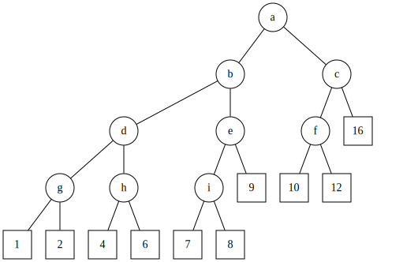
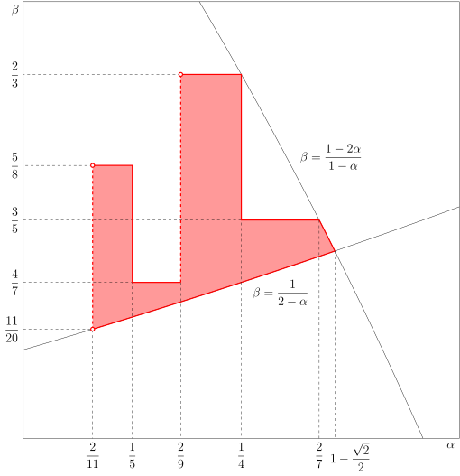
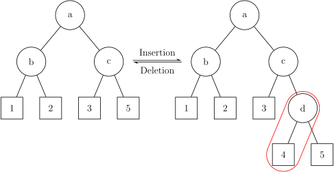

# WBLT - OI Wiki

- Source: https://oi-wiki.org/ds/wblt/

# WBLT

## 引入

**Weight Balanced Leafy Tree** ，下称 **WBLT** ，是一种平衡树，比起其它平衡树主要有实现简单、常数小的优点．它支持区间操作，而且可持久化．

Weight Balanced Leafy Tree 顾名思义是 Weight Balanced Tree 和 Leafy Tree 的结合．

Weight Balanced Tree 的每个结点储存这个结点下子树的大小，并且通过保持左右子树的大小关系在一定范围来保证树高．

Leafy Tree 维护的原始信息仅存储在树的 **叶子节点** 上，而非叶子节点仅用于维护子节点信息和维持数据结构的形态．我们熟知的线段树就是一种 Leafy Tree．



本文的树均指的是二叉的 Leafy Tree，即每个节点的子节点数目只能是 00 或者 22．本文中的 𝑛n，指的是树的叶子节点的数目．叶子节点数目为 𝑛n 的树，总的节点数量是 2𝑛 −12n−1，因此，WBLT 占用的空间是 Θ(𝑛)Θ(n) 的．

## 基本结构及平衡维护

本节介绍 WBLT 的基本结构，定义树的 𝛼α‑平衡的概念，并解释如何通过旋转或合并的方式维护树的平衡．

### 节点信息

要实现一个基本的 WBLT，只需要记录每个节点的如下信息：

  * `lc[x]`、`rc[x]`：左、右子节点；
  * `sz[x]`：以 𝑥x 为根的子树中的叶子节点的数目．

利用 WBLT 实现平衡树，还需要在每个节点处记录与键值相关的信息：

  * `val[x]`：节点 𝑥x 处的键值．

因为只有叶子节点实际存储键值，所以其他节点处存储的信息是由它们的子节点合并得到的，以方便后续查询．

比如，一种常用的合并方式就是将两个子节点的键值中较大的那个存储于该节点．这样，每个节点存储的就是以它为根的子树中，所有叶子节点的键值的最大值．基于此，节点信息的更新方法如下：

参考代码

```text 1 2 3 4 ``` |  ```text void push_up ( int x ) { sz [ x ] = sz [ ch [ x ][ 0 ]] \+ sz [ ch [ x ][ 1 ]]; val [ x ] = val [ ch [ x ][ 1 ]]; } ```   
---|---  
  
当然，如果需要，还可以实现相应的 `push_down(x)` 函数．

### 辅助函数

除了基本的节点信息维护外，WBLT 通常还需要实现如下辅助函数，用于内存管理：

  * `new_node()`：新建节点；
  * `del_node(x)`：删除节点 𝑥x；
  * `new_leaf(v)`：新建以 𝑣v 为键值的叶子节点；
  * `join(x, y)`：连接子树，即分别以 𝑥x、𝑦y 为左右子节点，新建节点 𝑧z；
  * `cut(x)`：拆分子树，即获得节点 𝑥x 的两个子节点，并删除节点 𝑥x．

如果 WBLT 的实现十分依赖于拆分和连接子树，会建立较多的新节点，并释放等量的旧节点．如果不及时回收旧的无用节点，会导致空间不再是线性的．以下是这些辅助函数的数组实现：

参考代码

```text 1 2 3 4 5 6 7 8 9 10 11 12 13 14 15 16 17 18 19 20 21 22 23 24 25 26 27 28 29 30 31 32 33 34 35 36 37 ``` |  ```text // Return a new empty node. int new_node () { int x = top ? pool [ \-- top ] : ++ id ; sz [ x ] = val [ x ] = ch [ x ][ 0 ] = ch [ x ][ 1 ] = 0 ; return x ; } // Release a node for later use. void del_node ( int & x ) { pool [ top ++ ] = x ; x = 0 ; } // Return a new leaf node of value v. int new_leaf ( int v ) { int x = new_node (); val [ x ] = v ; sz [ x ] = 1 ; return x ; } // Return a new node with subtrees x and y. int join ( int x , int y ) { int z = new_node (); ch [ z ][ 0 ] = x ; ch [ z ][ 1 ] = y ; push_up ( z ); return z ; } // Return subtrees of x and release x. auto cut ( int & x ) { int y = ch [ x ][ 0 ]; int z = ch [ x ][ 1 ]; del_node ( x ); return std :: make_pair ( y , z ); } ```   
---|---  
  
封装好这些辅助函数后，数组实现和指针实现在后续函数中就没有区别了．

### 平衡的概念

对于一个树，可以定义它在一个非叶节点 𝑥x 处的 **平衡度** 为

𝜌(𝑥)=min{𝑤(𝑇left⁡(𝑥)),𝑤(𝑇right⁡(𝑥))}𝑤(𝑇𝑥).ρ(x)=min{w(Tleft⁡(x)),w(Tright⁡(x))}w(Tx).

其中，𝑇𝑥Tx 表示以 𝑥x 为根的子树，𝑤( ⋅)w(⋅) 表示子树的权重（它的叶子节点的数目），而 left⁡(𝑥)left⁡(x) 和 right⁡(𝑥)right⁡(x) 分别表示 𝑥x 的左右叶子节点．特别地，叶子节点处规定 𝜌(𝑥) =1/2ρ(x)=1/2．

对于 𝛼 ∈(0,1/2]α∈(0,1/2]，如果某个节点 𝑥x 处平衡度 𝜌(𝑥) ≥𝛼ρ(x)≥α，就称该节点是 **𝛼 α‑平衡** 的．如果树的每个节点处都是 𝛼α‑平衡的，就称树是 **𝛼 α‑平衡** 的．这样的树的集合记作 𝐵𝐵[𝛼]BB[α]．一个树是 **𝛼 α‑平衡** 的，当且仅当它本身是 𝛼α‑平衡的，且它的左右子树都是 𝛼α‑平衡的或者它是叶子节点．

树是 𝛼α‑平衡的，有一个显然的好处是，它的高度是 𝑂(log⁡𝑛)O(log⁡n) 的．这是因为，从叶子节点每向根移动一步，子树所包含的叶子节点数目就至少扩大到原来的 1/(1 −𝛼)1/(1−α) 倍，因此只能移动 𝑂(log11−𝛼⁡𝑛) =𝑂(log⁡𝑛)O(log11−α⁡n)=O(log⁡n) 次．这就保证了在 𝛼α‑平衡的树中，单次查询的复杂度总是严格 𝑂(log⁡𝑛)O(log⁡n) 的，且算法的常数与 log⁡(1/(1−𝛼))log⁡(1/(1−α))（以 22 为底）正相关．当 𝛼α 位于下文提供的合理范围内时，这个常数大致为 2 ∼3.52∼3.5．

WBLT 的平衡维护通常可以通过旋转或合并的方式进行．两种方式实现的 WBLT，单次插入、删除等操作，复杂度都是严格 𝑂(log⁡𝑛)O(log⁡n) 的．但是，与固定优先级的 [Treap](../treap/) 不同，WBLT 的结构并不具有唯一性，因此，两种方式维护得到的树的结构并不相同，虽然这并不影响它们的使用．当然，平衡的维护还可以采取类似 [替罪羊树](../sgt/) 的策略，利用重构达到均摊 𝑂(log⁡𝑛)O(log⁡n) 的复杂度，但是这样就失去了 WBLT 可持久化和区间操作等优势，因而并不推荐．

下文分别介绍了通过旋转和合并维护平衡的方法，并实现了相应的平衡维护和合并操作的函数．封装好这些函数后，两种维护树平衡的方式在后续具体的平衡树的实现中再无区别．而且，无论使用哪种方式，单次维护平衡的操作的时间复杂度都是 𝑂(1)O(1) 的，单次合并树 𝑇1T1 和树 𝑇2T2 的复杂度都是 𝑂(∣log⁡𝑤(𝑇1)𝑤(𝑇2)∣)O(|log⁡w(T1)w(T2)|) 的．

省略权重的记号

为了维护树的平衡，只需要保留子树的权重信息．因此，为了表达方便，下面讨论平衡维护的两节将混用树和它的权重的记号．比如，子树 𝑥x 的权重也由 𝑥x 表示，而不是 𝑤(𝑥)w(x)．类似地，子树 𝑥x 和 𝑦y 合并得到的树也用它的权重表示，直接写作树 𝑥 +𝑦x+y．

### 通过旋转维护

WBLT 的旋转操作和 [Treap 的旋转操作](../treap/#旋转) 完全相同，可以采取与 Treap 完全一致的旋转策略．当然，旋转本身同样可以看作是重新分配子树权重的过程，因此也可以利用拆分和连接子树完成．两种实现的结果是完全一致的，但是第二种实现更方便 WBLT 的持久化．

参考代码

不依赖连接依赖连接

```text 1 2 3 4 5 6 7 8 9 ``` |  ```text // Rotate the subtree at x such that ch[x][r] is the new root. void rotate ( int & x , bool r ) { int y = ch [ x ][ r ]; ch [ x ][ r ] = ch [ y ][ ! r ]; ch [ y ][ ! r ] = x ; push_up ( x ); push_up ( y ); x = y ; } ```   
---|---  
  
```text 1 2 3 4 5 6 7 8 9 10 11 12 ``` |  ```text // Rotate the subtree at x such that ch[x][r] is the new root. void rotate ( int & x , bool r ) { int a , b , c , d ; std :: tie ( a , b ) = cut ( x ); if ( r ) { std :: tie ( c , d ) = cut ( b ); x = join ( join ( a , c ), d ); } else { std :: tie ( c , d ) = cut ( a ); x = join ( c , join ( d , b )); } } ```   
---|---  
  
假设在某个树的修改操作后，正在自下而上地恢复树的平衡．现在，左右子树 𝑥x 和 𝑦y 不再平衡，但是它们自身都是平衡的．不妨设右子树 𝑦y 过轻，即 𝑦 <𝛼(𝑥 +𝑦)y<α(x+y)．此时，树的形态如图中左侧的树所示．


一种朴素的平衡维护策略是将 𝑥x 旋转到根节点处，这样它原先的右子节点 𝑤w 就和 𝑦y 一起成为了新树的右子节点，而它原先的左子节点 𝑧z 成为了新树的左子节点．这相当于将原来的树左侧中 𝑤w 的权重移动到它的右侧．如果 𝑤w 的权重合适，这样的操作就可以恢复树的平衡．这样得到的树如图中右侧的树所示．

但是，如果 𝑤w 本身过重，这样的操作可能移动了太多的权重到右子树，从而使得新树中左子树过轻，即 𝑧 <𝛼(𝑥 +𝑦)z<α(x+y)．对于这种情形，因为子树 𝑧z 和子树 𝑦y 的权重都太小，只能考虑将 𝑤w 分拆为两个子树，分别与 𝑧z 和 𝑦y 连接，成为新树的两个子树．这相当于首先将节点 𝑤w 旋转到节点 𝑥x 处，再将它旋转到根节点处．同样，可以期待这样得到的树能够达到平衡，形态如图中上方的树所示．

这两种旋转的策略分别称为单旋和双旋．单旋和双旋策略的选取，主要取决于子树 𝑤w 相对于子树 𝑥x 的比重，即存在阈值 𝛽β，使得

  * 当 𝑤 ≤𝛽𝑥w≤βx 时，应选取单旋策略；
  * 当 𝑤 >𝛽𝑥w>βx 时，应选取双旋策略．

难点在于阈值 𝛽β 的选择，这就需要做一些具体的计算．Blum 和 Mehlhorn 证明了，对于参数1

𝛼∈(211,1−√22]≈(0.182,0.292], 𝛽=12−𝛼,α∈(211,1−22]≈(0.182,0.292], β=12−α,

能够通过上述单旋和双旋结合的策略，维护因为单次插入或删除而失衡的 WBLT 的平衡．

证明

需要证明的是，如果树在单次插入或删除后失衡，可以通过上述策略恢复它的平衡．结合上述图示，令

𝜌1=𝑦𝑥+𝑦, 𝜌2=𝑤𝑥, 𝜌3=𝑣𝑤.ρ1=yx+y, ρ2=wx, ρ3=vw.

那么，有 𝜌1 <𝛼 ≤𝜌2,𝜌3 ≤1 −𝛼ρ1<α≤ρ2,ρ3≤1−α．此处还有一个隐含条件，是关于 𝜌1ρ1 的取值范围的：

  * 如果失衡是由插入单个元素引起的，那么，应该有

𝑦𝑥−1+𝑦≥𝛼⟹𝜌1≥𝛼𝑦𝑦+𝛼≥𝛼1+𝛼.yx−1+y≥α⟹ρ1≥αyy+α≥α1+α.
  * 如果失衡是由删除单个元素引起的，那么，应该有

𝑦+1𝑥+𝑦+1≥𝛼⟹𝜌1≥𝛼𝑦𝑦+1−𝛼≥𝛼2−𝛼.y+1x+y+1≥α⟹ρ1≥αyy+1−α≥α2−α.

因为对于 0 <𝛼 <1/20<α<1/2，总有 𝛼/(2 −𝛼) <𝛼/(1 +𝛼)α/(2−α)<α/(1+α)，所以删除元素会导致比增添元素更严重的失衡，尤其是对于树的规模很小的情形．

接下来，恢复平衡的操作分为两种情形：

情形一：𝑤w 没有过重，即 𝜌2 ≤𝛽ρ2≤β 时，单旋

首先，𝑧z 和 𝑤 +𝑦w+y 平衡．这是因为

(1−𝛼2−𝛼)𝛼+𝛼2−𝛼≤𝑤+𝑦𝑥+𝑦=(1−𝜌1)𝜌2+𝜌1<(1−𝛼)12−𝛼+𝛼.(1−α2−α)α+α2−α≤w+yx+y=(1−ρ1)ρ2+ρ1<(1−α)12−α+α.

左侧表达式在 𝛼 ∈(0,1)α∈(0,1) 时总大于 𝛼α，右侧表达式在 𝛼 ∈(0,1 −√2/2]α∈(0,1−2/2] 时总不大于 (1 −𝛼)(1−α)．

其次，𝑤w 和 𝑦y 平衡．同样地，考虑

𝑦𝑤+𝑦=𝜌1(1−𝜌1)𝜌2+𝜌1.yw+y=ρ1(1−ρ1)ρ2+ρ1.

一方面，对于所有 𝛼 ∈(0,(3 −√5)/2)α∈(0,(3−5)/2)，有

𝑦𝑤+𝑦<𝛼(1−𝛼)𝛼+𝛼<1−𝛼.yw+y<α(1−α)α+α<1−α.

另一方面，对于所有 𝛼 ∈(0,1/3)α∈(0,1/3)，除了删除元素且 𝑦 =1y=1 的情形外，都有

𝜌1≥min{𝛼1+𝛼,2𝛼3−𝛼}=2𝛼3−𝛼,ρ1≥min{α1+α,2α3−α}=2α3−α,

所以，有

𝑦𝑤+𝑦≥2𝛼3−𝛼(1−2𝛼3−𝛼)12−𝛼+2𝛼3−𝛼>𝛼.yw+y≥2α3−α(1−2α3−α)12−α+2α3−α>α.

最后，考虑剩余的情形，即删除元素且 𝑦 =1y=1 时．最可能失衡的情形发生在 𝑥 =⌊2/𝛼⌋ −2x=⌊2/α⌋−2 且 𝑤 =⌊𝛽𝑥⌋w=⌊βx⌋ 时．树可以恢复平衡，当且仅当

11+⌊𝛽𝑥⌋≥𝛼⟺⌊𝛽𝑥⌋≤1𝛼−1⟺𝛽𝑥<1𝛼⟺𝑥<2𝛼−1.11+⌊βx⌋≥α⟺⌊βx⌋≤1α−1⟺βx<1α⟺x<2α−1.

而这总是成立的．这就完成了该情形的证明．注意，最后一种情形的证明利用了权重总是整数这一性质，并不能合并到之前的讨论中．

情形二：𝑤w 过重，即 𝜌2 >𝛽ρ2>β 时，双旋

首先，𝑧 +𝑢z+u 和 𝑣 +𝑦v+y 平衡．这是因为

𝛼2−𝛼+(1−𝛼2−𝛼)12−𝛼𝛼<𝑧+𝑢𝑥+𝑦=𝜌1+(1−𝜌1)𝜌2𝜌3<𝛼+(1−𝛼)3α2−α+(1−α2−α)12−αα<z+ux+y=ρ1+(1−ρ1)ρ2ρ3<α+(1−α)3

左侧表达式在 𝛼 ∈(0,1)α∈(0,1) 时总大于 𝛼α，右侧表达式在 𝛼 ∈(0,(3 −√5)/2)α∈(0,(3−5)/2) 时总小于 (1 −𝛼)(1−α)．

然后，𝑧z 和 𝑢u 平衡．这是因为对于 𝛼 ∈(0,1)α∈(0,1)，总是成立

𝛼=12−𝛼𝛼1−12−𝛼(1−𝛼)<𝑢𝑧=𝜌2(1−𝜌3)1−𝜌2𝜌3<(1−𝛼)21−(1−𝛼)𝛼<1−𝛼.α=12−αα1−12−α(1−α)<uz=ρ2(1−ρ3)1−ρ2ρ3<(1−α)21−(1−α)α<1−α.

最后，𝑣v 和 𝑦y 平衡．类似其他的情形，考虑

𝑦𝑣+𝑦=𝜌1𝜌1+(1−𝜌1)𝜌2𝜌3.yv+y=ρ1ρ1+(1−ρ1)ρ2ρ3.

一方面，对于所有 𝛼 ∈(0,1 −√2/2]α∈(0,1−2/2]，都有

𝑦𝑣+𝑦<𝛼𝛼+(1−𝛼)12−𝛼𝛼≤1−𝛼.yv+y<αα+(1−α)12−αα≤1−α.

另一方面，

𝑦𝑣+𝑦≥𝜌1𝜌1+(1−𝜌1)(1−𝛼)2.yv+y≥ρ1ρ1+(1−ρ1)(1−α)2.

右侧表达式不小于 𝛼α，当且仅当

𝜌1≥𝛼(1−𝛼)1+𝛼(1−𝛼).ρ1≥α(1−α)1+α(1−α).

如果失衡是由插入引起的，那么 𝜌1 ≥𝛼/(1 +𝛼)ρ1≥α/(1+α)，显然成立．否则，情形有些复杂：

  * 当 𝑦 ≥3y≥3 时，𝜌1 ≥3𝛼/(4 −𝛼)ρ1≥3α/(4−α)，且 3𝛼/(4 −𝛼) ≥𝛼(1 −𝛼)/(1 +𝛼(1 −𝛼))3α/(4−α)≥α(1−α)/(1+α(1−α)) 对于所有 𝛼 ∈[1 −√3/2,1)α∈[1−3/2,1) 都成立；
  * 当 𝑦 =2y=2 时，最可能失衡的情形发生在 𝑥 =⌊3/𝛼⌋ −3x=⌊3/α⌋−3，𝑤 =⌊(1 −𝛼)𝑥⌋w=⌊(1−α)x⌋ 且 𝑣 =⌊(1 −𝛼)𝑤⌋v=⌊(1−α)w⌋ 时，此时 𝑣/(𝑣 +𝑦) ≥𝛼v/(v+y)≥α 对于所有 𝛼 ∈(3/22,1)α∈(3/22,1) 都成立；
  * 当 𝑦 =1y=1 时，最可能失衡的情形发生在 𝑥 =⌊2/𝛼⌋ −2x=⌊2/α⌋−2，𝑤 =⌊(1 −𝛼)𝑥⌋w=⌊(1−α)x⌋ 且 𝑣 =⌊(1 −𝛼)𝑤⌋v=⌊(1−α)w⌋ 时，此时 𝑣/(𝑣 +𝑦) ≥𝛼v/(v+y)≥α 对于所有 𝛼 ∈(2/11,1)α∈(2/11,1) 都成立．

最后两种情形的讨论，同样利用了所有节点的权重都是整数这一点．

综合两种情形，当 𝛼 ∈(2/11,1 −√2/2]α∈(2/11,1−2/2] 时，前述单旋和双旋结合的策略可以保证树的平衡．

从这个分析过程中可以看出，最难保持平衡的情形发生在从小规模的树中删除节点时．除了 𝛽 =1/(2 −𝛼)β=1/(2−α) 之外，对于其他参数的选择的正确性证明，同样可以重复上述的过程，只是用到的一些不等式需要相应地调整．

随后，Hirai 和 Yamamoto 通过机器证明完整地确定了所有可行的 (𝛼,𝛽)(α,β) 的范围，结果是一个相当复杂的二维图形：



他们在文章中推荐使用如下策略维持平衡：

  * 当 𝑥 >3𝑦x>3y 时，判断失衡；
  * 当 𝑤 ≤2𝑧w≤2z 时，选取单旋策略，否则，选取双旋策略．

原因是，这是可行的参数范围内唯一可以用简单整数表示的策略，从而避免了浮点数运算造成的效率损失．他们推荐的策略相当于取 (𝛼,𝛽) =(1/4,2/3)(α,β)=(1/4,2/3)．实践中，可以根据具体情况，选择合适的参数．

参考实现如下：

参考代码

```text 1 2 3 4 5 6 7 8 9 10 11 12 13 14 15 16 17 18 19 20 21 22 23 ``` |  ```text // Check whether a subtree of weight SX is too heavy // in a tree of weight SX + SY. bool too_heavy ( int sx , int sy ) { // or sx > sy * 3; return sy < ALPHA * ( sx \+ sy ); } // Check if ch[x][!r] is too heavy so that a double rotation is needed. bool need_double_rotation ( int x , bool r ) { // or sz[ch[x][!r]] > sz[ch[x][r]] * 2; return sz [ ch [ x ][ ! r ]] > sz [ x ] / ( 2 \- ALPHA ); } // Balance the subtree at x; void balance ( int & x ) { if ( sz [ x ] == 1 ) return ; bool r = sz [ ch [ x ][ 1 ]] > sz [ ch [ x ][ 0 ]]; if ( ! too_heavy ( sz [ ch [ x ][ r ]], sz [ ch [ x ][ ! r ]])) return ; if ( need_double_rotation ( ch [ x ][ r ], r )) { rotate ( ch [ x ][ r ], ! r ); } rotate ( x , r ); } ```   
---|---  
  
实现了维护平衡的策略后，合并两树的算法就非常简单．仍然设 𝑥 >𝑦x>y，合并的策略如下：

  * 如果右子树 𝑦y 是空的，直接返回左子树 𝑥x；
  * 如果左右子树 𝑥x 和 𝑦y 已经平衡，即 𝑦 ≥𝛼(𝑥 +𝑦)y≥α(x+y)，直接连接两子树；
  * 否则，将 𝑥x 的右子树 𝑤w 与 𝑦y 合并，将左子树 𝑧z 与它们合并的结果连接，并调整新树的平衡．

参考实现如下：

参考代码

```text 1 2 3 4 5 6 7 8 9 10 11 12 13 14 15 16 17 18 ``` |  ```text // Merge two subtrees. int merge ( int x , int y ) { if ( ! x || ! y ) return x | y ; int a , b ; if ( too_heavy ( sz [ x ], sz [ y ])) { std :: tie ( a , b ) = cut ( x ); int z = join ( a , merge ( b , y )); balance ( z ); return z ; } else if ( too_heavy ( sz [ y ], sz [ x ])) { std :: tie ( a , b ) = cut ( y ); int z = join ( merge ( x , a ), b ); balance ( z ); return z ; } else { return join ( x , y ); } } ```   
---|---  
  
可以证明，这样可以维持合并后树的平衡，且这样操作的复杂度是 𝑂(|log⁡(𝑥/𝑦)|)O(|log⁡(x/y)|) 的．

平衡和复杂度的证明

只需要考虑 𝑦y 过轻的情形，即 𝑦 <𝛼(𝑥 +𝑦)y<α(x+y)．此时，先合并 𝑤w 和 𝑦y，再连接 𝑧z 和 𝑤 +𝑦w+y．需要证明的是，只要在树根处调整树的平衡，就能够保证树的平衡．假设树 𝑤 +𝑦w+y 的左、右子树分别是 𝑐c 和 𝑑d，且 𝑐c 的左、右子树分别是 𝑎a 和 𝑏b．在树根处调整平衡，可以分为三种情形：

情形一：𝑧z 和 𝑤 +𝑦w+y 已经平衡，无需进一步调整，即 𝑧 ≥𝛼(𝑥 +𝑦)z≥α(x+y)

根据平衡的定义，子树 𝑧z 和 𝑤 +𝑦w+y 都是平衡的，且它们互相也是平衡的，那么整棵树也是平衡的．

情形二：𝑧z 过轻且 𝑐c 没有过重，可以通过单旋恢复平衡，即 𝑧 <𝛼(𝑥 +𝑦)z<α(x+y) 且 𝑐 ≤𝛽(𝑤 +𝑦)c≤β(w+y)

此时，因为 𝑧z 和 𝑤w 平衡，但 𝑦y 相较于 𝑥 =𝑧 +𝑤x=z+w 过轻，所以，子树 𝑧z 的权重满足

𝛼(1−𝛼)(𝑥+𝑦)<𝛼(𝑧+𝑤)≤𝑧≤𝛼(𝑥+𝑦).α(1−α)(x+y)<α(z+w)≤z≤α(x+y).

而 𝑐c 的权重则满足

𝛼(𝑤+𝑦)≤𝑐≤𝛽(𝑤+𝑦).α(w+y)≤c≤β(w+y).

由此，𝑧z 和 𝑐c 互相平衡，只要

𝛼1−𝛼<1−𝛼𝛼𝛼<𝑐𝑧=𝑤+𝑦𝑧𝑐𝑤+𝑦<1−𝛼(1−𝛼)𝛼(1−𝛼)𝛽≤1−𝛼𝛼,α1−α<1−ααα<cz=w+yzcw+y<1−α(1−α)α(1−α)β≤1−αα,

这要求

𝛽≤(1−𝛼)21−𝛼(1−𝛼).β≤(1−α)21−α(1−α).

以及 𝑧 +𝑐z+c 和 𝑑d 互相平衡，只要

𝛼≤(1−𝛽)(1−𝛼)≤𝑑𝑤+𝑦𝑤+𝑦𝑥+𝑦=𝑑𝑥+𝑦<𝑑𝑐+𝑑≤1−𝛼,α≤(1−β)(1−α)≤dw+yw+yx+y=dx+y<dc+d≤1−α,

这要求

𝛽≤1−2𝛼1−𝛼.β≤1−2α1−α. 情形三：𝑧z 过轻且 𝑐c 过重，可以通过双旋恢复平衡，即 𝑧 <𝛼(𝑥 +𝑦)z<α(x+y) 且 𝑐 >𝛽(𝑤 +𝑦)c>β(w+y)

类似情形二，有

𝛼(1−𝛼)(𝑥+𝑦)<𝑧≤𝛼(𝑥+𝑦),𝛽(𝑤+𝑦)<𝑐≤(1−𝛼)(𝑤+𝑦),𝛼𝑐≤𝑎,𝑏≤(1−𝛼)𝑐.α(1−α)(x+y)<z≤α(x+y),β(w+y)<c≤(1−α)(w+y),αc≤a,b≤(1−α)c.

由此，𝑧z 和 𝑎a 互相平衡，只要

𝛼1−𝛼≤1−𝛼𝛼𝛽𝛼≤𝑎𝑧=𝑤+𝑦𝑧𝑎𝑐+𝑑<1−𝛼(1−𝛼)𝛼(1−𝛼)(1−𝛼)2,α1−α≤1−ααβα≤az=w+yzac+d<1−α(1−α)α(1−α)(1−α)2,

这要求

𝛽≥𝛼(1−𝛼)2.β≥α(1−α)2.

其次，𝑏b 和 𝑑d 互相平衡，只要

𝛼1−𝛼≤𝛽1−𝛽𝛼≤𝑏𝑑=𝑐𝑑𝑏𝑐≤1−𝛼𝛼(1−𝛼)<1−𝛼𝛼,α1−α≤β1−βα≤bd=cdbc≤1−αα(1−α)<1−αα,

这要求

𝛽≥12−𝛼.β≥12−α.

最后，𝑧 +𝑎z+a 和 𝑏 +𝑑b+d 互相平衡，只要

𝛼<(1−𝛼)(1−(1−𝛼)2)≤𝑏+𝑑𝑥+𝑦=𝑤+𝑦𝑥+𝑦𝑏+𝑑𝑤+𝑦<(1−𝛼(1−𝛼))(1−𝛽𝛼)≤1−𝛼,α<(1−α)(1−(1−α)2)≤b+dx+y=w+yx+yb+dw+y<(1−α(1−α))(1−βα)≤1−α,

这要求

𝛽≥𝛼1−𝛼+𝛼2.β≥α1−α+α2.

综合三种情形，只要

0<𝛼≤1−√22, 12−𝛼≤𝛽≤1−2𝛼1−𝛼,0<α≤1−22, 12−α≤β≤1−2α1−α,

就能保证合并后的树可以利用单旋和双旋结合的策略调整到平衡．这显然包含正文给出的参数范围．

最后，简单说明一下该算法的复杂度为什么是 𝑂(|log⁡(𝑥/𝑦)|)O(|log⁡(x/y)|) 的．合并的流程中，如果 𝑦y 相较于 𝑥x 过轻，就尝试与 𝑥x 的右子树合并，这个过程一直持续到以 𝑥x 某个子孙节点为根的子树与 𝑦y 平衡为止．因为每向下加深一层，子树权重至少变为原来的 (1 −𝛼)(1−α)，所以至多只要 log11−𝛼⁡(𝑥/𝑦)log11−α⁡(x/y) 次迭代，就能找到与 𝑦y 平衡的子树．因此，该合并算法调用 𝑂(log⁡𝑛)O(log⁡n) 次平衡算法3，复杂度也就是 𝑂(log⁡𝑛)O(log⁡n)．

虽然并不明显，但是这个论证过程依赖于这样一个结论：不断取右子树的过程中，𝑦y 不会在一次迭代前后，从相较于左侧的子树过轻，变为相较于它过重．这是因为能够与 𝑦y 平衡的子树权重范围位于 𝛼𝑦/(1 −𝛼)αy/(1−α) 与 (1 −𝛼)𝑦/𝛼(1−α)y/α 之间．因此，如果在一次迭代时，就从 𝑦y 过轻变成 𝑦y 过重，则 𝑥x 的子树的权重在该次迭代过程中至少缩小到了原来的 𝛼2/(1 −𝛼)2α2/(1−α)2 倍．但是，单次迭代，子树权重至多只能缩小到原来的 𝛼α 倍，但是在上述 𝛼α 的范围中，𝛼 >𝛼2/(1 −𝛼)2α>α2/(1−α)2．这说明，前设情形是不可能的，某次迭代之后一定会有 𝑦y 与 𝑥x 的某个子树平衡的情形发生．

### 通过合并维护

合并两子树是指，保证左子树的键值总是不大于右子树的键值的情况下，建立新树，使其所有叶子节点的信息恰为左右子树叶子节点信息的并，且保证树的平衡．

为此，有如下策略2：（仍然设 𝑥 >𝑦x>y）

  * 如果右子树 𝑦y 是空的，直接返回左子树 𝑥x；
  * 如果左右子树 𝑥x 和 𝑦y 已经平衡，即 𝑦 ≥𝛼(𝑥 +𝑦)y≥α(x+y)，直接连接两子树；
  * 否则，右子树 𝑦y 过轻，但如果 𝑥x 的左子树 𝑧z 和 𝑤 +𝑦w+y 可以平衡，即 𝑧 ≥𝛼(𝑥 +𝑦)z≥α(x+y)，就将 𝑤w 和 𝑦y 先合并，再合并 𝑧z 和 𝑤 +𝑦w+y；
  * 否则，𝑧z 和 𝑦y 都过轻，此时，需要首先合并 𝑧z 和 𝑤w 的左子树 𝑢u，再合并 𝑤w 的右子树 𝑣v 和 𝑦y，再将两次合并的结果 **合并** 为新树．

将这一策略与前文的平衡策略对比，可以看到后两种情形中节点的组合方式分别和前述平衡策略中单旋和双旋的结果相似，只是将子树的连接换作了合并．

可以证明，当

0<𝛼≤1−√22≈0.2920<α≤1−22≈0.292

时，这样得到的树总是平衡的，且这样操作的复杂度是 𝑂(|log⁡(𝑥/𝑦)|)O(|log⁡(x/y)|) 的．也就是说，合并两个树的成本，与两个树的绝对大小无关，而只与它们的相对大小有关．

平衡和复杂度的证明

设合并权重分别为 𝑥x 和 𝑦y 的两棵子树时，需要直接连接两棵子树的次数为 𝜏(𝑥,𝑦)τ(x,y)．严格来说，需要证明当 0 <𝛼 ≤1 −√2/20<α≤1−2/2 时，存在常数 𝐶 >0C>0，对于任意 𝑥 >𝑦 >0x>y>0，都有

𝜏(𝑥,𝑦)≤1+𝐶log+⁡𝛼𝑥(1−𝛼)2𝑦,τ(x,y)≤1+Clog+⁡αx(1−α)2y,

其中，log+⁡𝑥 =max{0,log⁡𝑥}log+⁡x=max{0,log⁡x}；而且，对于所有 𝑥/𝑦 ≤(1 −𝛼)/𝛼x/y≤(1−α)/α，都有 𝜏(𝑥,𝑦) =1τ(x,y)=1．实际上，式子中的常数可以取作

𝐶=−2log⁡(1−𝛼).C=−2log⁡(1−α).

这就说明了合并算法的复杂度是 𝑂(|log⁡(𝑥/𝑦)|)O(|log⁡(x/y)|) 的．

为了证明合并算法得到的树总是平衡的，且上述复杂度的表达式成立，需要使用归纳法．对于所有第一象限的格点 (𝑥,𝑦) ∈𝐍2+(x,y)∈N+2，可以赋以 (𝑥 +𝑦,|𝑥 −𝑦|)(x+y,|x−y|) 的字典序，这显然是该集合上的良序，可以沿着该顺序进行归纳．归纳起点是 (𝑥,𝑦) =(1,1)(x,y)=(1,1)，此时，两子树都只有一个叶子节点，直接连接得到的子树必然是平衡的，且 𝜏(𝑥,𝑦) =1τ(x,y)=1，符合上式．下面假设归纳进行到 (𝑥,𝑦)(x,y)，且结论对于所有 (𝑥,𝑦)(x,y) 之前的点都成立．这分为三种情形：

情形一：树 𝑥x 和 𝑦y 平衡，即 𝑦 ≥𝛼(𝑥 +𝑦)y≥α(x+y)

此时，直接连接得到树也是平衡的，且只调用树的连接算法一次，所以有 𝜏(𝑥,𝑦) =1τ(x,y)=1．

情形二：树 𝑦y 过轻，但是 𝑧z 并不过轻，即 𝑦 <𝛼(𝑥 +𝑦) ≤𝑧y<α(x+y)≤z

此时，首先合并 𝑤w 和 𝑦y，然后合并 𝑧z 和 𝑤 +𝑦w+y，所以

𝜏(𝑥,𝑦)=𝜏(𝑤,𝑦)+𝜏(𝑧,𝑤+𝑦).τ(x,y)=τ(w,y)+τ(z,w+y).

由归纳假设，子树 𝑤 +𝑦w+y 已经是平衡的．对于第二步合并，其实可以直接证明证明 𝑧z 和 𝑤 +𝑦w+y 是平衡的：

𝛼≤𝑧𝑧+(𝑤+𝑦)=𝑧𝑥+𝑦<𝑧𝑧+𝑤≤1−𝛼.α≤zz+(w+y)=zx+y<zz+w≤1−α.

因此，合并 𝑧z 和 𝑤 +𝑦w+y 其实是直接连接两个子树，有 𝜏(𝑧,𝑤 +𝑦) =1τ(z,w+y)=1．因此，最后得到的树也是平衡的．

现在估计 𝜏(𝑤,𝑦)τ(w,y) 的大小．因为 𝑦 >(𝛼/(1 −𝛼))𝑥y>(α/(1−α))x 且 𝛼𝑥 ≤𝑤 ≤(1 −𝛼)𝑥αx≤w≤(1−α)x，所以，经放缩可知

𝛼1−𝛼<1−𝛼=𝛼𝑥(𝛼/(1−𝛼))𝑥<𝑤𝑦≤(1−𝛼)𝑥𝑦.α1−α<1−α=αx(α/(1−α))x<wy≤(1−α)xy.

这说明，𝑤w 和 𝑦y 不平衡，只出现在 𝑤 >𝑦w>y 时，所以，有

𝜏(𝑤,𝑦)≤1+𝐶log+⁡𝛼𝑤(1−𝛼)2𝑦≤1+𝐶log+⁡𝛼𝑥(1−𝛼)𝑦=1+𝐶log⁡(1−𝛼)+𝐶log+⁡𝛼𝑥(1−𝛼)2𝑦.τ(w,y)≤1+Clog+⁡αw(1−α)2y≤1+Clog+⁡αx(1−α)y=1+Clog⁡(1−α)+Clog+⁡αx(1−α)2y.

最后一步的等式成立，是因为 𝑥/𝑦 >(1 −𝛼)/𝛼x/y>(1−α)/α．

因此，有

𝜏(𝑥,𝑦)≤2+𝐶log⁡(1−𝛼)+𝐶log+⁡𝛼𝑥(1−𝛼)2𝑦.τ(x,y)≤2+Clog⁡(1−α)+Clog+⁡αx(1−α)2y. 情形三：树 𝑦y 和 𝑧z 都过轻，即 𝑦,𝑧 <𝛼(𝑥 +𝑦)y,z<α(x+y)

此时，首先合并 𝑧z 和 𝑢u，再合并 𝑣v 和 𝑦y，最后合并 𝑧 +𝑢z+u 和 𝑣 +𝑦v+y．因此，

𝜏(𝑥,𝑦)=𝜏(𝑧,𝑢)+𝜏(𝑣,𝑦)+𝜏(𝑧+𝑢,𝑣+𝑦).τ(x,y)=τ(z,u)+τ(v,y)+τ(z+u,v+y).

类似前文情形，可以估计每一步合并时两个子树的权重比值．

因为 𝑧,𝑦 <𝛼(𝑥 +𝑦)z,y<α(x+y)，所以 𝑤 >(1 −2𝛼)(𝑥 +𝑦)w>(1−2α)(x+y)．同时，利用平衡条件，有 𝛼 ≤𝑧/𝑥,𝑤/𝑥,𝑢/𝑤,𝑣/𝑤 ≤1 −𝛼α≤z/x,w/x,u/w,v/w≤1−α．这说明

𝛼1−𝛼<𝛼1−𝛼11−𝛼≤𝑧𝑢=𝑧𝑤𝑤𝑢<𝛼1−2𝛼1𝛼≤1−𝛼𝛼,𝛼1−𝛼≤𝛼1−2𝛼𝛼<𝑣𝑦=𝑣𝑤𝑤𝑦≤(1−𝛼)(1−𝛼)𝑥𝑦=(1−𝛼)2𝑥𝑦.α1−α<α1−α11−α≤zu=zwwu<α1−2α1α≤1−αα,α1−α≤α1−2αα<vy=vwwy≤(1−α)(1−α)xy=(1−α)2xy.

对于最后一项，有

𝑧+𝑢𝑣+𝑦=𝑥+𝑦𝑣+𝑦−1=𝑥+𝑦𝑦𝑦𝑣+𝑦−1<(1−𝛼)(𝑥𝑦+1)−1<(1−𝛼)𝑥𝑦.z+uv+y=x+yv+y−1=x+yyyv+y−1<(1−α)(xy+1)−1<(1−α)xy.

反过来，有

𝑧+𝑢𝑣+𝑦=𝑥+𝑦𝑣+𝑦−1≥𝑥+𝑦(1−𝛼)2𝑥+𝑦−1>1(1−𝛼)3+𝛼−1>𝛼1−𝛼.z+uv+y=x+yv+y−1≥x+y(1−α)2x+y−1>1(1−α)3+α−1>α1−α.

利用这些不等式，可以说明最后得到的树必然是平衡的．利用归纳假设可知，𝑧z 和 𝑢u 合并，𝑣v 和 𝑦y 合并，都可以保证得到的树是平衡的．而且，其中第一步 𝑧z 和 𝑢u 合并实际上是直接连接两棵树．对于树 𝑧 +𝑢z+u 和树 𝑣 +𝑦v+y 的合并，又有两种子情形：

  * 如果 𝑧 +𝑢 ≤𝑣 +𝑦z+u≤v+y，那么它们的权重比值严格大于 𝛼/(1 −𝛼)α/(1−α)，故而可以直接连接，结果是平衡的；
  * 否则，它们的权重比值必然严格小于 𝑥/𝑦x/y，但是 (𝑧 +𝑢) +(𝑣 +𝑦) =𝑥 +𝑦(z+u)+(v+y)=x+y，所以 |(𝑧 +𝑢) −(𝑣 +𝑦)| <|𝑥 −𝑦||(z+u)−(v+y)|<|x−y|，由前文给出的字典序判断，这种情形也可以应用归纳假设，结果也是平衡的．

进一步应用归纳假设可知：

𝜏(𝑧,𝑢)=1,𝜏(𝑣,𝑦)≤1+𝐶log+⁡𝛼𝑥𝑦,𝜏(𝑧+𝑢,𝑣+𝑦)≤1+𝐶log+⁡𝛼𝑥(1−𝛼)𝑦.τ(z,u)=1,τ(v,y)≤1+Clog+⁡αxy,τ(z+u,v+y)≤1+Clog+⁡αx(1−α)y.

三个不等式直接相加，会导致对数项前面的系数变成 2𝐶2C，无法完成归纳．因此，此处需要更为细致的估计．

当 max{𝑣/𝑦,(𝑧 +𝑢)/(𝑣 +𝑦)} ≤(1 −𝛼)/𝛼max{v/y,(z+u)/(v+y)}≤(1−α)/α 时，𝜏(𝑣,𝑦)τ(v,y) 和 𝜏(𝑧 +𝑢,𝑣 +𝑦)τ(z+u,v+y) 中必然有一项为 11，所以，有

𝜏(𝑣,𝑦)+𝜏(𝑧+𝑢,𝑣+𝑦)≤2+𝐶log+⁡𝛼𝑥(1−𝛼)𝑦=2+𝐶log⁡(1−𝛼)+𝐶log+⁡𝛼𝑥(1−𝛼)2𝑦.τ(v,y)+τ(z+u,v+y)≤2+Clog+⁡αx(1−α)y=2+Clog⁡(1−α)+Clog+⁡αx(1−α)2y.

否则，应该有

𝜏(𝑣,𝑦)+𝜏(𝑧+𝑢,𝑣+𝑦)≤2+𝐶log+⁡𝛼𝑣(1−𝛼)2𝑦+𝐶log+⁡𝛼(𝑧+𝑢)(1−𝛼)2(𝑣+𝑦)=2+𝐶log⁡𝛼(1−𝛼)2+𝐶log+⁡𝛼𝑣(𝑧+𝑢)(1−𝛼)2𝑦(𝑣+𝑦).τ(v,y)+τ(z+u,v+y)≤2+Clog+⁡αv(1−α)2y+Clog+⁡α(z+u)(1−α)2(v+y)=2+Clog⁡α(1−α)2+Clog+⁡αv(z+u)(1−α)2y(v+y).

对于 0 <𝛼 ≤1 −√2/20<α≤1−2/2，有

𝛼(1−𝛼)2<1−𝛼.α(1−α)2<1−α.

而且，有

𝑣(𝑧+𝑢)𝑦(𝑣+𝑦)=(𝑣+𝑦𝑦−1)(𝑥+𝑦𝑦𝑦𝑣+𝑦−1)=𝑥+𝑦𝑦+1−𝑥+𝑦𝑦𝑦𝑣+𝑦−𝑣+𝑦𝑦<𝑥𝑦.v(z+u)y(v+y)=(v+yy−1)(x+yyyv+y−1)=x+yy+1−x+yyyv+y−v+yy<xy.

这就说明，对于后面这种情形，也有

𝜏(𝑣,𝑦)+𝜏(𝑧+𝑢,𝑣+𝑦)<2+𝐶log⁡(1−𝛼)+𝐶log+⁡𝛼𝑥(1−𝛼)2𝑦.τ(v,y)+τ(z+u,v+y)<2+Clog⁡(1−α)+Clog+⁡αx(1−α)2y.

整体的合并复杂度为

𝜏(𝑥,𝑦)≤3+𝐶log⁡(1−𝛼)+𝐶log+⁡𝛼𝑥(1−𝛼)2𝑦.τ(x,y)≤3+Clog⁡(1−α)+Clog+⁡αx(1−α)2y.

综合所有情形，有

𝜏(𝑥,𝑦)≤3+𝐶log⁡(1−𝛼)+𝐶log+⁡𝛼𝑥(1−𝛼)2𝑦.τ(x,y)≤3+Clog⁡(1−α)+Clog+⁡αx(1−α)2y.

因此，只要取 2 +𝐶log⁡(1−𝛼) ≤02+Clog⁡(1−α)≤0，就可以完成复杂度的归纳．一个显然的选择为

𝐶=−2log⁡(1−𝛼).C=−2log⁡(1−α).

这个常数说明，两个树合并时，直接连接子树的次数大致不会超过树高差值的二倍．

参考实现如下：

参考代码

```text 1 2 3 4 5 6 7 8 9 10 11 12 13 14 15 16 17 18 19 20 21 22 23 24 ``` |  ```text // Merge two subtrees. int merge ( int x , int y ) { if ( ! x || ! y ) return x | y ; int a , b , c , d ; if ( too_heavy ( sz [ x ], sz [ y ])) { std :: tie ( a , b ) = cut ( x ); if ( too_heavy ( sz [ b ] \+ sz [ y ], sz [ a ])) { std :: tie ( c , d ) = cut ( b ); return merge ( merge ( a , c ), merge ( d , y )); } else { return merge ( a , merge ( b , y )); } } else if ( too_heavy ( sz [ y ], sz [ x ])) { std :: tie ( a , b ) = cut ( y ); if ( too_heavy ( sz [ a ] \+ sz [ x ], sz [ b ])) { std :: tie ( c , d ) = cut ( a ); return merge ( merge ( x , c ), merge ( d , b )); } else { return merge ( merge ( x , a ), b ); } } else { return join ( x , y ); } } ```   
---|---  
  
利用该合并策略，同样可以很容易实现树的平衡维护：失衡时，直接合并左右子树即可．

参考代码

```text 1 2 3 4 5 6 7 8 9 10 ``` |  ```text // Balance the subtree at x; void balance ( int & x ) { if ( sz [ x ] == 1 ) return ; if ( too_heavy ( sz [ ch [ x ][ 0 ]], sz [ ch [ x ][ 1 ]]) || too_heavy ( sz [ ch [ x ][ 1 ]], sz [ ch [ x ][ 0 ]])) { int a , b ; std :: tie ( a , b ) = cut ( x ); x = merge ( a , b ); } } ```   
---|---  
  
因为需要再平衡的两个树的大小总是近乎平衡的，因此维护平衡的复杂度是 𝑂(1)O(1) 的．

## 平衡树基础操作

利用前文实现的函数，WBLT 可以支持平衡树的所有基础操作．本节以可重集为例，讨论 WBLT 实现平衡树的方法．

### 建树

建树操作与线段树十分相似，只需要向下递归二分区间，直至区间长度为 11 时把要维护的信息放叶子节点上，回溯的时候合并区间信息即可．

参考代码

```text 1 2 3 4 5 6 ``` |  ```text // Build the tree for the interval [ll, rr]. int build ( int ll , int rr ) { if ( ll == rr ) return new_leaf ( ll ); int mm = ( ll \+ rr ) / 2 ; return join ( build ( ll , mm ), build ( mm \+ 1 , rr )); } ```   
---|---  
  
时间复杂度为 𝑂(𝑛)O(n)．

### 插入与删除

对于插入操作，需要从根节点开始向下递归，直到找到权值大于等于插入元素的权值最小的叶子节点，再新建两个节点，其中一个用来存储新插入的值，另一个作为两个叶子的新父亲替代这个最小叶子节点的位置，再将这两个叶子连接到这个父亲上．回溯时，需要维护树的平衡．



如图所示，要向左侧的树中插入值为 44 的元素．首先找到值为 55 的叶子节点，然后新建叶子节点 44 和非叶子节点 dd，并将 44 和 55 连接到 dd 上．这就得到右侧的树．

对于删除，考虑上面过程的逆过程．即找到与要删除的值权值相等的一个叶子节点，将它和它的父亲节点删除，并用其父亲的另一个儿子代替父亲的位置．回溯时，同样需要维护树的平衡．

参考实现如下：

参考代码

```text 1 2 3 4 5 6 7 8 9 10 11 12 13 14 15 16 17 18 19 20 21 22 23 24 25 26 27 28 29 30 31 32 33 34 35 36 37 38 39 40 41 42 43 44 45 ``` |  ```text // Insert v to the subtree at x. void insert ( int & x , int v ) { if ( ! x ) { x = new_leaf ( v ); } else if ( sz [ x ] == 1 ) { bool r = v >= val [ x ]; ch [ x ][ r ] = new_leaf ( v ); ch [ x ][ ! r ] = new_leaf ( val [ x ]); push_up ( x ); } else { bool r = v > val [ ch [ x ][ 0 ]]; insert ( ch [ x ][ r ], v ); push_up ( x ); balance ( x ); } } // Insert v. void insert ( int v ) { insert ( rt , v ); } // Remove v from the subtree at x. bool remove ( int & x , int v ) { if ( ! x ) return false ; if ( sz [ x ] == 1 ) { if ( val [ x ] == v ) { del_node ( x ); return true ; } else { return false ; } } else { bool r = v > val [ ch [ x ][ 0 ]]; bool succ = remove ( ch [ x ][ r ], v ); if ( ! ch [ x ][ r ]) { x = ch [ x ][ ! r ]; } else { push_up ( x ); balance ( x ); } return succ ; } } // Remove v. bool remove ( int v ) { return remove ( rt , v ); } ```   
---|---  
  
注意空树的处理．如果不想处理空树，可以提前向树内插入 ∞∞ 元素．

两种操作的时间复杂度均为 𝑂(log⁡𝑛)O(log⁡n)．

### 查询排名

因为 WBLT 的形态和线段树十分相似，因此查询排名可以使用类似线段树上二分的方式：如果左子树的最大值大于等于待查值就往左子节点跳；否则，就向右子节点跳，同时答案加上左子树的权重．

参考实现如下：

参考代码

```text 1 2 3 4 5 6 7 8 9 10 11 12 13 14 15 16 17 ``` |  ```text // Count the number of nodes less than v in the subtree at x. int count_less_than ( int x , int v ) { if ( ! x ) return 0 ; int res = 0 ; while ( sz [ x ] > 1 ) { if ( val [ ch [ x ][ 0 ]] < v ) { res += sz [ ch [ x ][ 0 ]]; x = ch [ x ][ 1 ]; } else { x = ch [ x ][ 0 ]; } } return res \+ ( val [ x ] < v ? 1 : 0 ); } // Find the rank of v. int find_rank ( int v ) { return count_less_than ( rt , v ) \+ 1 ; } ```   
---|---  
  
时间复杂度为 𝑂(log⁡𝑛)O(log⁡n)．

### 根据排名查询

依然是利用线段树上二分的思想，只不过这里比较的是节点的权重．

参考实现如下：

参考代码

```text 1 2 3 4 5 6 7 8 9 10 11 12 13 14 15 16 ``` |  ```text // Find the k-th element in the subtree at x. // It is guaranteed that such an element exists. int find_kth ( int x , int k ) { while ( sz [ x ] > 1 ) { if ( sz [ ch [ x ][ 0 ]] >= k ) { x = ch [ x ][ 0 ]; } else { k -= sz [ ch [ x ][ 0 ]]; x = ch [ x ][ 1 ]; } } return val [ x ]; } // Find the k-th element. int find_kth ( int k ) { return k > sz [ rt ] || k <= 0 ? -1 : find_kth ( rt , k ); } ```   
---|---  
  
时间复杂度为 𝑂(log⁡𝑛)O(log⁡n)．

### 查找前驱、后继

以上两种功能结合即可．

参考实现如下：

参考代码

```text 1 2 3 4 5 ``` |  ```text // Find the predecessor of v. int find_prev ( int v ) { return find_kth ( find_rank ( v ) \- 1 ); } // Find the successor of v. int find_next ( int v ) { return find_kth ( find_rank ( v \+ 1 )); } ```   
---|---  
  
如果想直接实现，需要注意键值相同的节点可能存储于多个叶子节点．

### 分裂操作

WBLT 的分裂与 [无旋 Treap](../treap/#分裂split) 类似，根据子树大小或权值决定向下递归分裂左子树或右子树．不同的是，WBLT 需要对分裂出来的子树进行 **合并** ，以维护最终分裂的树的平衡．

根据子树大小分裂的参考实现如下：

参考代码

```text 1 2 3 4 5 6 7 8 9 10 11 12 13 14 15 16 17 18 ``` |  ```text // Split the subtree at x. // The left half will have k elements. std :: pair < int , int > split ( int x , int k ) { if ( ! x ) return { 0 , 0 }; if ( ! k ) return { 0 , x }; if ( k == sz [ x ]) return { x , 0 }; int a , b ; std :: tie ( a , b ) = cut ( x ); if ( k <= sz [ a ]) { int ll , rr ; std :: tie ( ll , rr ) = split ( a , k ); return { ll , merge ( rr , b )}; } else { int ll , rr ; std :: tie ( ll , rr ) = split ( b , k \- sz [ a ]); return { merge ( a , ll ), rr }; } } ```   
---|---  
  
时间复杂度为 𝑂(log⁡𝑛)O(log⁡n)．

复杂度证明

向下递归的层数显然不超过树高，是 𝑂(log⁡𝑛)O(log⁡n) 的．需要证明的是，将左右两侧分裂出来的子树分别合并起来的复杂度是 𝑂(log⁡𝑛)O(log⁡n) 的．不妨仅考虑左侧的子树，因为右侧是对称的．设左侧分裂出来的子树自下而上分别是 𝑇1,𝑇2,⋯,𝑇ℓT1,T2,⋯,Tℓ，这些子树的数量 ℓ ∈𝑂(log⁡𝑛)ℓ∈O(log⁡n)．合并的过程可以描述为，自 𝑇′1 =𝑇1T1′=T1 开始，将 𝑇′𝑖−1Ti−1′ 与 𝑇𝑖Ti 合并得到 𝑇′𝑖Ti′，递归地合并完所有子树为止．合并的总复杂度可以表示为

ℓ∑𝑖=2𝜏(𝑇𝑖,𝑇′𝑖−1),∑i=2ℓτ(Ti,Ti−1′),

其中，𝜏(𝑇𝑖,𝑇′𝑖−1)τ(Ti,Ti−1′) 是将 𝑇𝑖Ti 和 𝑇′𝑖−1Ti−1′ 合并起来的复杂度．

如果总是有 𝑤(𝑇𝑖) ≥𝑤(𝑇′𝑖−1)w(Ti)≥w(Ti−1′)，那么根据合并两子树的复杂度表达式，有

𝜏(𝑇𝑖,𝑇′𝑖−1)∈𝑂(log⁡𝑤(𝑇𝑖)𝑤(𝑇′𝑖−1))⊆𝑂(log⁡𝑤(𝑇′𝑖)𝑤(𝑇′𝑖−1)).τ(Ti,Ti−1′)∈O(log⁡w(Ti)w(Ti−1′))⊆O(log⁡w(Ti′)w(Ti−1′)).

因为这些大 𝑂O 记号中的常数都是一致的，所以可以直接相加，裂项相消．

但是，应该注意的是，𝑤(𝑇𝑖) ≥𝑤(𝑇′𝑖−1)w(Ti)≥w(Ti−1′) 并不总是成立，因为 𝑇′𝑖−1Ti−1′ 是从 𝑇𝑖Ti 在原来的树中对应的右子树分裂出来的，而这个右子树可能比左子树 𝑇𝑖Ti 更大．尽管如此，即使 𝑇′𝑖−1Ti−1′ 比 𝑇𝑖Ti 大，作为右子树的一部分，权重 𝑤(𝑇′𝑖−1)w(Ti−1′) 也不会超过 𝑤(𝑇𝑖)w(Ti) 的 (1 −𝛼)/𝛼(1−α)/α 倍，这意味着，此时 𝑇′𝑖−1Ti−1′ 和 𝑇𝑖Ti 一定是平衡的，合并的复杂度是 𝑂(1)O(1) 的．

将这两种情形总结在一起，单次合并的复杂度可以写为

𝜏(𝑇𝑖,𝑇′𝑖−1)∈𝑂(log⁡𝑤(𝑇′𝑖)𝑤(𝑇′𝑖−1))+𝑂(1).τ(Ti,Ti−1′)∈O(log⁡w(Ti′)w(Ti−1′))+O(1).

由此，合并的总复杂度为

𝑂(ℓ∑𝑖=2(1+log⁡𝑤(𝑇′𝑖)𝑤(𝑇′𝑖−1)))⊆𝑂(ℓ+log⁡𝑤(𝑇′ℓ))⊆𝑂(log⁡𝑛).O(∑i=2ℓ(1+log⁡w(Ti′)w(Ti−1′)))⊆O(ℓ+log⁡w(Tℓ′))⊆O(log⁡n).

这也说明，分裂算法的总复杂度是 𝑂(log⁡𝑛)O(log⁡n) 的．

## 参考实现

本文介绍了如何利用 WBLT 完成平衡树的基本操作．下面是用 WBLT 实现的 [普通平衡树模板](https://loj.ac/p/104)．

参考代码

```text 1 2 3 4 5 6 7 8 9 10 11 12 13 14 15 16 17 18 19 20 21 22 23 24 25 26 27 28 29 30 31 32 33 34 35 36 37 38 39 40 41 42 43 44 45 46 47 48 49 50 51 52 53 54 55 56 57 58 59 60 61 62 63 64 65 66 67 68 69 70 71 72 73 74 75 76 77 78 79 80 81 82 83 84 85 86 87 88 89 90 91 92 93 94 95 96 97 98 99 100 101 102 103 104 105 106 107 108 109 110 111 112 113 114 115 116 117 118 119 120 121 122 123 124 125 126 127 128 129 130 131 132 133 134 135 136 137 138 139 140 141 142 143 144 145 146 147 148 149 150 151 152 153 154 155 156 157 158 159 160 161 162 163 164 165 166 167 168 169 170 171 172 173 174 175 176 177 178 179 180 181 182 183 184 185 186 187 188 189 190 191 192 193 194 195 196 197 198 199 200 201 202 203 204 205 206 207 208 209 210 211 212 213 214 215 216 217 218 219 220 221 222 223 224 225 226 227 228 229 230 231 232 233 234 235 236 237 238 239 240 241 242 243 244 245 246 247 248 249 250 251 252 253 254 255 256 257 258 259 260 261 262 263 264 265 266 267 268 269 270 271 272 273 274 275 276 277 278 279 280 281 282 283 284 285 286 ``` |  ```text #include <iostream> #include <tuple> // Change here to use different strategies to balance and to merge. #define BALANCE_BY_ROTATING 1 #define ROTATE_BY_JOINING 0 constexpr int N = 2e6 ; constexpr double ALPHA = 0.292 ; int id , rt , ch [ N ][ 2 ], sz [ N ], val [ N ]; int pool [ N ], top ; void push_up ( int x ) { sz [ x ] = sz [ ch [ x ][ 0 ]] \+ sz [ ch [ x ][ 1 ]]; val [ x ] = val [ ch [ x ][ 1 ]]; } // Return a new empty node. int new_node () { int x = top ? pool [ \-- top ] : ++ id ; sz [ x ] = val [ x ] = ch [ x ][ 0 ] = ch [ x ][ 1 ] = 0 ; return x ; } // Release a node for later use. void del_node ( int & x ) { pool [ top ++ ] = x ; x = 0 ; } // Return a new leaf node of value v. int new_leaf ( int v ) { int x = new_node (); val [ x ] = v ; sz [ x ] = 1 ; return x ; } // Return a new node with subtrees x and y. int join ( int x , int y ) { int z = new_node (); ch [ z ][ 0 ] = x ; ch [ z ][ 1 ] = y ; push_up ( z ); return z ; } // Return subtrees of x and release x. auto cut ( int & x ) { int y = ch [ x ][ 0 ]; int z = ch [ x ][ 1 ]; del_node ( x ); return std :: make_pair ( y , z ); } // Check whether a subtree of weight SX is too heavy // in a tree of weight SX + SY. bool too_heavy ( int sx , int sy ) { // or sx > sy * 3; return sy < ALPHA * ( sx \+ sy ); } #if BALANCE_BY_ROTATING #if ROTATE_BY_JOINING // Rotate the subtree at x such that ch[x][r] is the new root. void rotate ( int & x , bool r ) { int a , b , c , d ; std :: tie ( a , b ) = cut ( x ); if ( r ) { std :: tie ( c , d ) = cut ( b ); x = join ( join ( a , c ), d ); } else { std :: tie ( c , d ) = cut ( a ); x = join ( c , join ( d , b )); } } #else // Rotate the subtree at x such that ch[x][r] is the new root. void rotate ( int & x , bool r ) { int y = ch [ x ][ r ]; ch [ x ][ r ] = ch [ y ][ ! r ]; ch [ y ][ ! r ] = x ; push_up ( x ); push_up ( y ); x = y ; } #endif // Check if ch[x][!r] is too heavy so that a double rotation is needed. bool need_double_rotation ( int x , bool r ) { // or sz[ch[x][!r]] > sz[ch[x][r]] * 2; return sz [ ch [ x ][ ! r ]] > sz [ x ] / ( 2 \- ALPHA ); } // Balance the subtree at x; void balance ( int & x ) { if ( sz [ x ] == 1 ) return ; bool r = sz [ ch [ x ][ 1 ]] > sz [ ch [ x ][ 0 ]]; if ( ! too_heavy ( sz [ ch [ x ][ r ]], sz [ ch [ x ][ ! r ]])) return ; if ( need_double_rotation ( ch [ x ][ r ], r )) { rotate ( ch [ x ][ r ], ! r ); } rotate ( x , r ); } // Merge two subtrees. int merge ( int x , int y ) { if ( ! x || ! y ) return x | y ; int a , b ; if ( too_heavy ( sz [ x ], sz [ y ])) { std :: tie ( a , b ) = cut ( x ); int z = join ( a , merge ( b , y )); balance ( z ); return z ; } else if ( too_heavy ( sz [ y ], sz [ x ])) { std :: tie ( a , b ) = cut ( y ); int z = join ( merge ( x , a ), b ); balance ( z ); return z ; } else { return join ( x , y ); } } #else // Merge two subtrees. int merge ( int x , int y ) { if ( ! x || ! y ) return x | y ; int a , b , c , d ; if ( too_heavy ( sz [ x ], sz [ y ])) { std :: tie ( a , b ) = cut ( x ); if ( too_heavy ( sz [ b ] \+ sz [ y ], sz [ a ])) { std :: tie ( c , d ) = cut ( b ); return merge ( merge ( a , c ), merge ( d , y )); } else { return merge ( a , merge ( b , y )); } } else if ( too_heavy ( sz [ y ], sz [ x ])) { std :: tie ( a , b ) = cut ( y ); if ( too_heavy ( sz [ a ] \+ sz [ x ], sz [ b ])) { std :: tie ( c , d ) = cut ( a ); return merge ( merge ( x , c ), merge ( d , b )); } else { return merge ( merge ( x , a ), b ); } } else { return join ( x , y ); } } // Balance the subtree at x; void balance ( int & x ) { if ( sz [ x ] == 1 ) return ; if ( too_heavy ( sz [ ch [ x ][ 0 ]], sz [ ch [ x ][ 1 ]]) || too_heavy ( sz [ ch [ x ][ 1 ]], sz [ ch [ x ][ 0 ]])) { int a , b ; std :: tie ( a , b ) = cut ( x ); x = merge ( a , b ); } } #endif // Insert v to the subtree at x. void insert ( int & x , int v ) { if ( ! x ) { x = new_leaf ( v ); } else if ( sz [ x ] == 1 ) { bool r = v >= val [ x ]; ch [ x ][ r ] = new_leaf ( v ); ch [ x ][ ! r ] = new_leaf ( val [ x ]); push_up ( x ); } else { bool r = v > val [ ch [ x ][ 0 ]]; insert ( ch [ x ][ r ], v ); push_up ( x ); balance ( x ); } } // Insert v. void insert ( int v ) { insert ( rt , v ); } // Remove v from the subtree at x. bool remove ( int & x , int v ) { if ( ! x ) return false ; if ( sz [ x ] == 1 ) { if ( val [ x ] == v ) { del_node ( x ); return true ; } else { return false ; } } else { bool r = v > val [ ch [ x ][ 0 ]]; bool succ = remove ( ch [ x ][ r ], v ); if ( ! ch [ x ][ r ]) { x = ch [ x ][ ! r ]; } else { push_up ( x ); balance ( x ); } return succ ; } } // Remove v. bool remove ( int v ) { return remove ( rt , v ); } // Count the number of nodes less than v in the subtree at x. int count_less_than ( int x , int v ) { if ( ! x ) return 0 ; int res = 0 ; while ( sz [ x ] > 1 ) { if ( val [ ch [ x ][ 0 ]] < v ) { res += sz [ ch [ x ][ 0 ]]; x = ch [ x ][ 1 ]; } else { x = ch [ x ][ 0 ]; } } return res \+ ( val [ x ] < v ? 1 : 0 ); } // Find the rank of v. int find_rank ( int v ) { return count_less_than ( rt , v ) \+ 1 ; } // Find the k-th element in the subtree at x. // It is guaranteed that such an element exists. int find_kth ( int x , int k ) { while ( sz [ x ] > 1 ) { if ( sz [ ch [ x ][ 0 ]] >= k ) { x = ch [ x ][ 0 ]; } else { k -= sz [ ch [ x ][ 0 ]]; x = ch [ x ][ 1 ]; } } return val [ x ]; } // Find the k-th element. int find_kth ( int k ) { return k > sz [ rt ] || k <= 0 ? -1 : find_kth ( rt , k ); } // Find the predecessor of v. int find_prev ( int v ) { return find_kth ( find_rank ( v ) \- 1 ); } // Find the successor of v. int find_next ( int v ) { return find_kth ( find_rank ( v \+ 1 )); } int main () { int n ; std :: cin >> n ; for (; n ; \-- n ) { int op , x ; std :: cin >> op >> x ; switch ( op ) { case 1 : insert ( x ); break ; case 2 : remove ( x ); break ; case 3 : std :: cout << find_rank ( x ) << '\n' ; break ; case 4 : std :: cout << find_kth ( x ) << '\n' ; break ; case 5 : std :: cout << find_prev ( x ) << '\n' ; break ; case 6 : std :: cout << find_next ( x ) << '\n' ; break ; } } return 0 ; } ```   
---|---  
  
利用合并和分裂，也可以实现文艺平衡树．下面是用 WBLT 实现的 [文艺平衡树模板](https://loj.ac/p/105)，需要在向下访问节点时下传懒标记．

参考代码

```text 1 2 3 4 5 6 7 8 9 10 11 12 13 14 15 16 17 18 19 20 21 22 23 24 25 26 27 28 29 30 31 32 33 34 35 36 37 38 39 40 41 42 43 44 45 46 47 48 49 50 51 52 53 54 55 56 57 58 59 60 61 62 63 64 65 66 67 68 69 70 71 72 73 74 75 76 77 78 79 80 81 82 83 84 85 86 87 88 89 90 91 92 93 94 95 96 97 98 99 100 101 102 103 104 105 106 107 108 109 110 111 112 113 114 115 116 117 118 119 120 121 122 123 124 125 126 127 128 129 130 131 132 133 134 135 136 137 138 139 140 141 142 143 144 145 146 147 148 149 150 151 152 153 154 155 156 157 158 159 160 161 162 163 164 165 166 167 168 169 170 171 172 173 174 175 176 177 178 179 180 181 182 183 184 185 186 187 188 189 190 191 192 193 194 195 196 197 198 199 200 201 202 203 204 205 206 207 208 209 210 211 212 213 214 215 216 217 218 219 220 221 222 223 224 225 226 227 228 229 230 231 232 233 234 235 236 237 238 239 240 241 242 243 244 245 246 247 248 249 ``` |  ```text #include <iostream> #include <tuple> // Change here to use different strategies to balance and to merge. #define BALANCE_BY_ROTATING 0 #define ROTATE_BY_JOINING 1 constexpr int N = 2e5 ; constexpr double ALPHA = 0.292 ; int id , rt , ch [ N ][ 2 ], sz [ N ], val [ N ], lz [ N ]; int pool [ N ], top ; void push_up ( int x ) { sz [ x ] = sz [ ch [ x ][ 0 ]] \+ sz [ ch [ x ][ 1 ]]; } void lazy_reverse ( int x ) { if ( ! x ) return ; std :: swap ( ch [ x ][ 0 ], ch [ x ][ 1 ]); lz [ x ] ^= 1 ; } void push_down ( int x ) { if ( lz [ x ]) { lazy_reverse ( ch [ x ][ 0 ]); lazy_reverse ( ch [ x ][ 1 ]); lz [ x ] = 0 ; } } // Return a new empty node. int new_node () { int x = top ? pool [ \-- top ] : ++ id ; sz [ x ] = val [ x ] = ch [ x ][ 0 ] = ch [ x ][ 1 ] = 0 ; return x ; } // Release a node for later use. void del_node ( int & x ) { pool [ top ++ ] = x ; x = 0 ; } // Return a new leaf node of value v. int new_leaf ( int v ) { int x = new_node (); val [ x ] = v ; sz [ x ] = 1 ; return x ; } // Return a new node with subtrees x and y. int join ( int x , int y ) { int z = new_node (); ch [ z ][ 0 ] = x ; ch [ z ][ 1 ] = y ; push_up ( z ); return z ; } // Return subtrees of x and release x. auto cut ( int & x ) { push_down ( x ); int y = ch [ x ][ 0 ]; int z = ch [ x ][ 1 ]; del_node ( x ); return std :: make_pair ( y , z ); } // Check whether a subtree of weight SX is too heavy // in a tree of weight SX + SY. bool too_heavy ( int sx , int sy ) { // or sx > sy * 3; return sy < ALPHA * ( sx \+ sy ); } #if BALANCE_BY_ROTATING #if ROTATE_BY_JOINING // Rotate the subtree at x such that ch[x][r] is the new root. void rotate ( int & x , bool r ) { int a , b , c , d ; std :: tie ( a , b ) = cut ( x ); if ( r ) { std :: tie ( c , d ) = cut ( b ); x = join ( join ( a , c ), d ); } else { std :: tie ( c , d ) = cut ( a ); x = join ( c , join ( d , b )); } } #else // Rotate the subtree at x such that ch[x][r] is the new root. void rotate ( int & x , bool r ) { int y = ch [ x ][ r ]; ch [ x ][ r ] = ch [ y ][ ! r ]; ch [ y ][ ! r ] = x ; push_up ( x ); push_up ( y ); x = y ; } #endif // Check if ch[x][!r] is too heavy so that a double rotation is needed. bool need_double_rotation ( int x , bool r ) { // or sz[ch[x][!r]] > sz[ch[x][r]] * 2; return sz [ ch [ x ][ ! r ]] > sz [ x ] / ( 2 \- ALPHA ); } // Balance the subtree at x; void balance ( int & x ) { if ( sz [ x ] == 1 ) return ; push_down ( x ); bool r = sz [ ch [ x ][ 1 ]] > sz [ ch [ x ][ 0 ]]; if ( ! too_heavy ( sz [ ch [ x ][ r ]], sz [ ch [ x ][ ! r ]])) return ; push_down ( ch [ x ][ r ]); if ( need_double_rotation ( ch [ x ][ r ], r )) { push_down ( ch [ ch [ x ][ r ]][ ! r ]); rotate ( ch [ x ][ r ], ! r ); } rotate ( x , r ); } // Merge two subtrees. int merge ( int x , int y ) { if ( ! x || ! y ) return x | y ; int a , b ; if ( too_heavy ( sz [ x ], sz [ y ])) { std :: tie ( a , b ) = cut ( x ); int z = join ( a , merge ( b , y )); balance ( z ); return z ; } else if ( too_heavy ( sz [ y ], sz [ x ])) { std :: tie ( a , b ) = cut ( y ); int z = join ( merge ( x , a ), b ); balance ( z ); return z ; } else { return join ( x , y ); } } #else // Merge two subtrees. int merge ( int x , int y ) { if ( ! x || ! y ) return x | y ; int a , b , c , d ; if ( too_heavy ( sz [ x ], sz [ y ])) { std :: tie ( a , b ) = cut ( x ); if ( too_heavy ( sz [ b ] \+ sz [ y ], sz [ a ])) { std :: tie ( c , d ) = cut ( b ); return merge ( merge ( a , c ), merge ( d , y )); } else { return merge ( a , merge ( b , y )); } } else if ( too_heavy ( sz [ y ], sz [ x ])) { std :: tie ( a , b ) = cut ( y ); if ( too_heavy ( sz [ a ] \+ sz [ x ], sz [ b ])) { std :: tie ( c , d ) = cut ( a ); return merge ( merge ( x , c ), merge ( d , b )); } else { return merge ( merge ( x , a ), b ); } } else { return join ( x , y ); } } // Balance the subtree at x; void balance ( int & x ) { if ( sz [ x ] == 1 ) return ; if ( too_heavy ( sz [ ch [ x ][ 0 ]], sz [ ch [ x ][ 1 ]]) || too_heavy ( sz [ ch [ x ][ 1 ]], sz [ ch [ x ][ 0 ]])) { int a , b ; std :: tie ( a , b ) = cut ( x ); x = merge ( a , b ); } } #endif // Split the subtree at x. // The left half will have k elements. std :: pair < int , int > split ( int x , int k ) { if ( ! x ) return { 0 , 0 }; if ( ! k ) return { 0 , x }; if ( k == sz [ x ]) return { x , 0 }; int a , b ; std :: tie ( a , b ) = cut ( x ); if ( k <= sz [ a ]) { int ll , rr ; std :: tie ( ll , rr ) = split ( a , k ); return { ll , merge ( rr , b )}; } else { int ll , rr ; std :: tie ( ll , rr ) = split ( b , k \- sz [ a ]); return { merge ( a , ll ), rr }; } } // Reverse the interval [l, r]. void reverse ( int l , int r ) { int ll , rr ; std :: tie ( rt , rr ) = split ( rt , r ); std :: tie ( ll , rt ) = split ( rt , l \- 1 ); lazy_reverse ( rt ); rt = merge ( ll , merge ( rt , rr )); } // Output the subtree at x. void print ( int x ) { if ( sz [ x ] == 1 ) { std :: cout << val [ x ] << ' ' ; } else { push_down ( x ); print ( ch [ x ][ 0 ]); print ( ch [ x ][ 1 ]); } } // Output the tree. void print () { print ( rt ); std :: cout << '\n' ; } // Build the tree for the interval [ll, rr]. int build ( int ll , int rr ) { if ( ll == rr ) return new_leaf ( ll ); int mm = ( ll \+ rr ) / 2 ; return join ( build ( ll , mm ), build ( mm \+ 1 , rr )); } int main () { int n , m ; std :: cin >> n >> m ; rt = build ( 1 , n ); for (; m ; \-- m ) { int l , r ; std :: cin >> l >> r ; reverse ( l , r ); } print (); return 0 ; } ```   
---|---  
  
注意 WBLT 需要两倍的空间；涉及分裂与合并时，需要注意垃圾回收，及时回收无用的节点，否则空间不是线性的．

## 参考资料与注释

  * [Weight-balanced tree - Wikipedia](https://en.wikipedia.org/wiki/Weight-balanced_tree)
  * Nievergelt, J.; Reingold, E. M. (1973). "Binary Search Trees of Bounded Balance". SIAM Journal on Computing. 2: 33–43.
  * Blum, Norbert; Mehlhorn, Kurt (1980). "On the average number of rebalancing operations in weight-balanced trees". Theoretical Computer Science. 11 (3): 303–320.
  * Hirai, Y.; Yamamoto, K. (2011). "Balancing weight-balanced trees". Journal of Functional Programming. 21 (3): 287.
  * Blelloch, Guy E.; Ferizovic, Daniel; Sun, Yihan (2016), "Just Join for Parallel Ordered Sets", Symposium on Parallel Algorithms and Architectures, Proc. of 28th ACM Symp. Parallel Algorithms and Architectures (SPAA 2016), ACM, pp. 253–264.
  * Straka, Milan. (2011). "Adams’Trees Revisited: Correctness Proof and Efficient Implementation." International Symposium on Trends in Functional Programming. Berlin, Heidelberg: Springer Berlin Heidelberg.

* * *

  1. Nievergelt 和 Reingold 的原始论文中给出的参数范围 𝛼 <1 −√22, 𝛽 =1−2𝛼1−𝛼α<1−22, β=1−2α1−α 是错误的．Hirai 和 Yamamoto 的文章中提供了相应的反例，问题主要出现在某些很小的树上，从而导致整个归纳证明失效．当然，实际算法竞赛中，很难造出能卡掉这些错误参数的数据，所以实践中可能并不会有太大影响． ↩

  2. 通过稍后的证明可以看出：第三种情形中，𝑧z 和 𝑤 +𝑦w+y 总是平衡的；第四种情形中，𝑧z 和 𝑢u 总是平衡的．它们都可以直接连接，而不需要合并． ↩

  3. 因为单次平衡操作至多相当于连接两次子树，而且最后两子树已经平衡时还需要调用一次连接子树的算法，所以如果以调用连接子树的算法的次数计算，基于平衡实现的合并操作和下文直接合并的平衡操作的算法的常数是一致的． ↩

* * *

>  __本页面最近更新： 2026/1/7 08:56:54，[更新历史](https://github.com/OI-wiki/OI-wiki/commits/master/docs/ds/wblt.md)  
>  __发现错误？想一起完善？[在 GitHub 上编辑此页！](https://oi-wiki.org/edit-landing/?ref=/ds/wblt.md "edit.link.title")  
>  __本页面贡献者：[H-J-Granger](https://github.com/H-J-Granger), [c-forrest](https://github.com/c-forrest), [Ir1d](https://github.com/Ir1d), [StudyingFather](https://github.com/StudyingFather), [countercurrent-time](https://github.com/countercurrent-time), [NachtgeistW](https://github.com/NachtgeistW), [Enter-tainer](https://github.com/Enter-tainer), [AngelKitty](https://github.com/AngelKitty), [AtomAlpaca](https://github.com/AtomAlpaca), [caijianhong](https://github.com/caijianhong), [CCXXXI](https://github.com/CCXXXI), [cesonic](https://github.com/cesonic), [cjsoft](https://github.com/cjsoft), [diauweb](https://github.com/diauweb), [Early0v0](https://github.com/Early0v0), [ezoixx130](https://github.com/ezoixx130), [GekkaSaori](https://github.com/GekkaSaori), [Konano](https://github.com/Konano), [LovelyBuggies](https://github.com/LovelyBuggies), [Makkiy](https://github.com/Makkiy), [mgt](mailto:i@margatroid.xyz), [minghu6](https://github.com/minghu6), [mizusakuraed](https://github.com/mizusakuraed), [P-Y-Y](https://github.com/P-Y-Y), [PotassiumWings](https://github.com/PotassiumWings), [SamZhangQingChuan](https://github.com/SamZhangQingChuan), [sshwy](https://github.com/sshwy), [Suyun514](mailto:suyun514@qq.com), [Tiphereth-A](https://github.com/Tiphereth-A), [weiyong1024](https://github.com/weiyong1024), [abc1763613206](https://github.com/abc1763613206), [aofall](https://github.com/aofall), [CoelacanthusHex](https://github.com/CoelacanthusHex), [GavinZhengOI](https://github.com/GavinZhengOI), [Gesrua](https://github.com/Gesrua), [hsfzLZH1](https://github.com/hsfzLZH1), [iamtwz](https://github.com/iamtwz), [ksyx](https://github.com/ksyx), [kxccc](https://github.com/kxccc), [lychees](https://github.com/lychees), [Marcythm](https://github.com/Marcythm), [Peanut-Tang](https://github.com/Peanut-Tang), [Persdre](https://github.com/Persdre), [shuzhouliu](https://github.com/shuzhouliu), [stevebraveman](https://github.com/stevebraveman), [SukkaW](https://github.com/SukkaW), [ziyao233](https://github.com/ziyao233)  
>  __本页面的全部内容在**[CC BY-SA 4.0](https://creativecommons.org/licenses/by-sa/4.0/deed.zh) 和 [SATA](https://github.com/zTrix/sata-license)** 协议之条款下提供，附加条款亦可能应用
