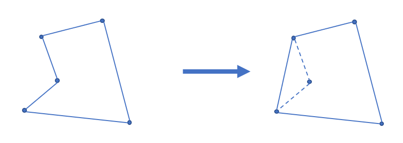
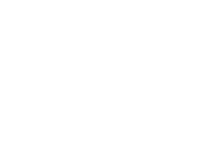
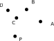
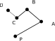
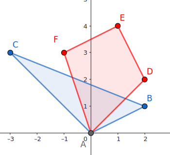
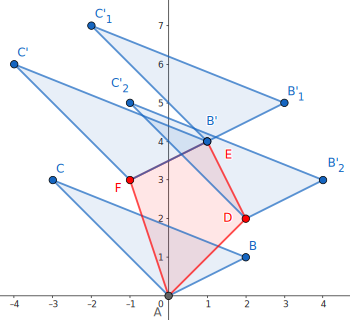
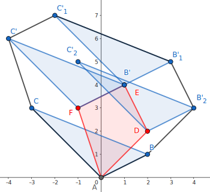

# 凸包 - OI Wiki

- Source: https://oi-wiki.org/geometry/convex-hull/

# 凸包

## 二维凸包

### 定义

#### 凸多边形

凸多边形是指所有内角大小都在 [0,𝜋][0,π] 范围内的 **简单多边形** ．

#### 凸包

在平面上能包含所有给定点的最小凸多边形叫做凸包．

其定义为：对于给定集合 𝑋X，所有包含 𝑋X 的凸集的交集 𝑆S 被称为 𝑋X 的 **凸包** ．

实际上可以理解为用一个橡皮筋包含住所有给定点的形态．

凸包用最小的周长围住了给定的所有点．如果一个凹多边形围住了所有的点，它的周长一定不是最小，如下图．根据三角不等式，凸多边形在周长上一定是最优的．



### Andrew 算法求凸包

常用的求法有 Graham 扫描法和 Andrew 算法，这里主要介绍 Andrew 算法．

#### 性质

该算法的时间复杂度为 𝑂(𝑛log⁡𝑛)O(nlog⁡n)，其中 𝑛n 为待求凸包点集的大小，复杂度的瓶颈在于对所有点坐标的双关键字排序．

#### 过程

首先把所有点以横坐标为第一关键字，纵坐标为第二关键字排序．

显然排序后最小的元素和最大的元素一定在凸包上．而且因为是凸多边形，我们如果从一个点出发逆时针走，轨迹总是「左拐」的，一旦出现右拐，就说明这一段不在凸包上．因此我们可以用一个单调栈来维护上下凸壳．

因为从左向右看，上下凸壳所旋转的方向不同，为了让单调栈起作用，我们首先 **升序枚举** 求出下凸壳，然后 **降序** 求出上凸壳．

求凸壳时，一旦发现即将进栈的点（𝑃P）和栈顶的两个点（𝑆1,𝑆2S1,S2，其中 𝑆1S1 为栈顶）行进的方向向右旋转，即叉积小于 00：←←←←←←→𝑆2𝑆1 ×←←←←←→𝑆1𝑃 <0S2S1→×S1P→<0，则弹出栈顶，回到上一步，继续检测，直到 ←←←←←←→𝑆2𝑆1 ×←←←←←→𝑆1𝑃 ≥0S2S1→×S1P→≥0 或者栈内仅剩一个元素为止．

通常情况下不需要保留位于凸包边上的点，因此上面一段中 ←←←←←←→𝑆2𝑆1 ×←←←←←→𝑆1𝑃 <0S2S1→×S1P→<0 这个条件中的「<<」可以视情况改为 ≤≤，同时后面一个条件应改为 >>．



#### 实现

代码实现

C++Python

```text 1 2 3 4 5 6 7 8 9 10 11 12 13 14 15 16 17 18 19 20 21 22 23 24 25 ``` |  ```text // stk[] 是整型，存的是下标 // p[] 存储向量或点 tp = 0 ; // 初始化栈 std :: sort ( p \+ 1 , p \+ 1 \+ n ); // 对点进行排序 stk [ ++ tp ] = 1 ; // 栈内添加第一个元素，且不更新 used，使得 1 在最后封闭凸包时也对单调栈更新 for ( int i = 2 ; i <= n ; ++ i ) { while ( tp >= 2 // 下一行 * 操作符被重载为叉积 && ( p [ stk [ tp ]] \- p [ stk [ tp \- 1 ]]) * ( p [ i ] \- p [ stk [ tp ]]) <= 0 ) used [ stk [ tp \-- ]] = 0 ; used [ i ] = 1 ; // used 表示在凸壳上 stk [ ++ tp ] = i ; } int tmp = tp ; // tmp 表示下凸壳大小 for ( int i = n \- 1 ; i > 0 ; \-- i ) if ( ! used [ i ]) { // ↓求上凸壳时不影响下凸壳 while ( tp > tmp && ( p [ stk [ tp ]] \- p [ stk [ tp \- 1 ]]) * ( p [ i ] \- p [ stk [ tp ]]) <= 0 ) used [ stk [ tp \-- ]] = 0 ; used [ i ] = 1 ; stk [ ++ tp ] = i ; } for ( int i = 1 ; i <= tp ; ++ i ) // 复制到新数组中去 h [ i ] = p [ stk [ i ]]; int ans = tp \- 1 ; ```   
---|---  
  
```text 1 2 3 4 5 6 7 8 9 10 11 12 13 14 15 16 17 18 19 20 21 22 23 24 25 26 27 28 ``` |  ```text stk = [] # 是整型，存的是下标 p = [] # 存储向量或点 tp = 0 # 初始化栈 p . sort () # 对点进行排序 tp = tp \+ 1 stk [ tp ] = 1 # 栈内添加第一个元素，且不更新 used，使得 1 在最后封闭凸包时也对单调栈更新 for i in range ( 2 , n \+ 1 ): while tp >= 2 and ( p [ stk [ tp ]] \- p [ stk [ tp \- 1 ]]) * ( p [ i ] \- p [ stk [ tp ]]) <= 0 : # 下一行 * 操作符被重载为叉积 used [ stk [ tp ]] = 0 tp = tp \- 1 used [ i ] = 1 # used 表示在凸壳上 tp = tp \+ 1 stk [ tp ] = i tmp = tp # tmp 表示下凸壳大小 for i in range ( n \- 1 , 0 , \- 1 ): if used [ i ] == False : # ↓求上凸壳时不影响下凸壳 while tp > tmp and ( p [ stk [ tp ]] \- p [ stk [ tp \- 1 ]]) * ( p [ i ] \- p [ stk [ tp ]]) <= 0 : used [ stk [ tp ]] = 0 tp = tp \- 1 used [ i ] = 1 tp = tp \+ 1 stk [ tp ] = i for i in range ( 1 , tp \+ 1 ): h [ i ] = p [ stk [ i ]] ans = tp \- 1 ```   
---|---  
  
根据上面的代码，最后凸包上有 𝑎𝑛𝑠ans 个元素（额外存储了 11 号点，因此 ℎh 数组中有 𝑎𝑛𝑠 +1ans+1 个元素），并且按逆时针方向排序．周长就是

𝑎𝑛𝑠∑𝑖=1∣←←←←←←←←→ℎ𝑖ℎ𝑖+1∣∑i=1ans|hihi+1→|

### Graham 扫描法

#### 性质

与 Andrew 算法相同，Graham 扫描法的时间复杂度为 𝑂(𝑛log⁡𝑛)O(nlog⁡n)，复杂度瓶颈也在于对所有点排序．

#### 过程

首先找到所有点中，纵坐标最小的一个点 𝑃P．根据凸包的定义我们知道，这个点一定在凸包上．然后将所有的点以相对于点 P 的极角大小为关键字进行排序．



和 Andrew 算法类似地，我们考虑从点 𝑃P 出发，在凸包上逆时针走，那么我们经过的所有节点一定都是「左拐」的．形式化地说，对于凸包逆时针方向上任意连续经过的三个点 𝑃1,𝑃2,𝑃3P1,P2,P3，一定满足 ←←←←←←→𝑃1𝑃2 ×←←←←←←→𝑃2𝑃3 ≥0P1P2→×P2P3→≥0．

新建一个栈用于存储凸包的信息，先将 𝑃P 压入栈中，然后按照极角序依次尝试加入每一个点．如果进栈的点 𝑃0P0 和栈顶的两个点 𝑃1,𝑃2P1,P2（其中 𝑃1P1 为栈顶）行进的方向「右拐」了，那么就弹出栈顶的 𝑃1P1，不断重复上述过程直至进栈的点与栈顶的两个点满足条件，或者栈中仅剩下一个元素，再将 𝑃0P0 压入栈中．




代码实现

```text 1 2 3 4 5 6 7 8 9 10 11 12 13 14 15 16 17 18 19 20 21 22 23 24 25 26 27 28 29 30 31 32 33 34 35 36 37 38 39 ``` |  ```text struct Point { double x , y , ang ; Point operator \- ( const Point & p ) const { return { x \- p . x , y \- p . y , 0 }; } } p [ MAXN ]; double dis ( Point p1 , Point p2 ) { return sqrt (( p1 . x \- p2 . x ) * ( p1 . x \- p2 . x ) \+ ( p1 . y \- p2 . y ) * ( p1 . y \- p2 . y )); } bool cmp ( Point p1 , Point p2 ) { if ( p1 . ang == p2 . ang ) { return dis ( p1 , p [ 1 ]) < dis ( p2 , p [ 1 ]); } return p1 . ang < p2 . ang ; } double cross ( Point p1 , Point p2 ) { return p1 . x * p2 . y \- p1 . y * p2 . x ; } int main () { for ( int i = 2 ; i <= n ; ++ i ) { if ( p [ i ]. y < p [ 1 ]. y || ( p [ i ]. y == p [ 1 ]. y && p [ i ]. x < p [ 1 ]. x )) { std :: swap ( p [ 1 ], p [ i ]); } } for ( int i = 2 ; i <= n ; ++ i ) { p [ i ]. ang = atan2 ( p [ i ]. y \- p [ 1 ]. y , p [ i ]. x \- p [ 1 ]. x ); } std :: sort ( p \+ 2 , p \+ n \+ 1 , cmp ); sta [ ++ top ] = 1 ; for ( int i = 2 ; i <= n ; ++ i ) { while ( top >= 2 && cross ( p [ sta [ top ]] \- p [ sta [ top \- 1 ]], p [ i ] \- p [ sta [ top ]]) < 0 ) { top \-- ; } sta [ ++ top ] = i ; } return 0 ; } ```   
---|---  
  
## 闵可夫斯基和

### 定义

点集 𝑃P 和点集 𝑄Q 的闵可夫斯基和 𝑃 +𝑄P+Q 定义为 𝑃 +𝑄 ={𝑎 +𝑏|𝑎 ∈𝑃,𝑏 ∈𝑄}P+Q={a+b|a∈P,b∈Q}，即把点集 𝑄Q 中的每个点看做一个向量，将点集 𝑃P 中每个点沿这些向量平移，最终得到的结果的集合就是点集 𝑃 +𝑄P+Q．此处仅讨论 **凸包** 的闵可夫斯基和．

例如：对于点集 𝑃 ={(0,0),( −3,3),(2,1)}P={(0,0),(−3,3),(2,1)} 和 点集 𝑄 ={(0,0),( −1,3),(1,4),(2,2)}Q={(0,0),(−1,3),(1,4),(2,2)}，



将 𝑃P 沿 𝑄Q 的每个向量平移：



不难发现新图形也是一个 **凸包** ：



### 性质

  1. 若点集合 𝑃P，𝑄Q 为凸集，则其闵可夫斯基和 𝑃 +𝑄P+Q 也是凸集．

证明

设 𝑒,𝑓 ∈𝑃 +𝑄e,f∈P+Q，有 𝑎,𝑏 ∈𝑃a,b∈P，𝑐,𝑑 ∈𝑄c,d∈Q 且 𝑒 =𝑎 +𝑐,𝑓 =𝑏 +𝑑e=a+c,f=b+d，则对任意 𝑡 ∈[0,1]t∈[0,1] 均有：

𝑡𝑒+(1−𝑡)𝑓=𝑡(𝑎+𝑐)+(1−𝑡)(𝑏+𝑑)=(𝑡𝑎+(1−𝑡)𝑏)+(𝑡𝑐+(1−𝑡)𝑑)∈𝑃+𝑄.te+(1−t)f=t(a+c)+(1−t)(b+d)=(ta+(1−t)b)+(tc+(1−t)d)∈P+Q.

证毕．

     1. 若点集 𝑃P，𝑄Q 为凸集，则其闵可夫斯基和 𝑃 +𝑄P+Q 的边集是由凸集 𝑃P，𝑄Q 的边按极角排序后连接的结果．
证明

不妨假设凸集 𝑃P 中任意一条边的斜率与 𝑄Q 中任意一条边的斜率均不相同．将坐标系进行旋转，使得 𝑃P 上的一条边 𝑋𝑌XY 与 𝑥x 轴平行且在最下方．

设此时 𝑄Q 中最低的点 𝑈U，𝑃 +𝑄P+Q 的 **最低** 且 **靠左** 的点 𝐴A．

可知 ⃗𝐴 =⃗𝑋 +⃗𝑈A→=X→+U→，所以 𝐴A 必然在 𝑃 +𝑄P+Q 的边界上．

同理，𝑃 +𝑄P+Q 中 **最低** 且 **靠右** 的点 𝐵B 有 ⃗𝐵 =⃗𝑌 +⃗𝑈B→=Y→+U→，也必然在 𝑃 +𝑄P+Q 的边界上．

因此，有 ⃗𝐴𝐵 =⃗𝑋𝑌 +⃗𝑈AB→=XY→+U→．

若按顺序进行旋转，则结果连续的构成了 𝑃 +𝑄P+Q 中的每条边．

证毕．

### 实现

我们可以根据性质 2，将凸集 𝑃,𝑄P,Q 极角排序，得到它们在 𝑃 +𝑄P+Q 上的出现顺序，把 𝑃1 +𝑄1P1+Q1 看做 𝑃 +𝑄P+Q 的起点，然后用类似 **归并** 的做法依次放边即可．

时间复杂度：𝑂(𝑛 +𝑚)O(n+m)

实现

```text 1 2 3 4 5 6 7 8 9 10 11 12 13 14 15 16 17 18 19 20 21 22 23 24 25 26 27 28 29 30 31 32 33 34 35 36 37 ``` |  ```text template < class T > struct Point { T x , y ; Point ( T x = 0 , T y = 0 ) : x ( x ), y ( y ) {} friend Point operator \+ ( const Point & a , const Point & b ) { return { a . x \+ b . x , a . y \+ b . y }; } friend Point operator \- ( const Point & a , const Point & b ) { return { a . x \- b . x , a . y \- b . y }; } // 点乘 friend T operator * ( const Point & a , const Point & b ) { return a . x * b . x \+ a . y * b . y ; } // 叉乘 friend T operator ^ ( const Point & a , const Point & b ) { return a . x * b . y \- a . y * b . x ; } }; template < class T > vector < Point < T >> minkowski_sum ( vector < Point < T >> a , vector < Point < T >> b ) { vector < Point < T >> c { a [ 0 ] \+ b [ 0 ]}; for ( usz i = 0 ; i \+ 1 < a . size (); ++ i ) a [ i ] = a [ i \+ 1 ] \- a [ i ]; for ( usz i = 0 ; i \+ 1 < b . size (); ++ i ) b [ i ] = b [ i \+ 1 ] \- b [ i ]; a . pop_back (), b . pop_back (); c . resize ( a . size () \+ b . size () \+ 1 ); merge ( a . begin (), a . end (), b . begin (), b . end (), c . begin () \+ 1 , []( const Point < i64 > & a , const Point < i64 > & b ) { return ( a ^ b ) < 0 ; }); for ( usz i = 1 ; i < c . size (); ++ i ) c [ i ] = c [ i ] \+ c [ i \- 1 ]; return c ; } ```   
---|---  
  
### 例题

[例题 [JSOI2018] 战争](https://loj.ac/p/2549)

有两个凸包 𝑃,𝑄P,Q，平移 𝑞q 次 𝑄Q，问每次移动后是否有交点．1 ≤𝑛,𝑚 ≤105,1 ≤𝑞 ≤1051≤n,m≤105,1≤q≤105．

实现

```text 1 2 3 4 5 6 7 8 9 10 11 12 13 14 15 16 17 18 19 20 21 22 23 24 25 26 27 28 29 30 31 32 33 34 35 36 37 38 39 40 41 42 43 44 45 46 47 48 49 50 51 52 53 54 55 56 57 58 59 60 61 62 63 64 65 66 67 68 69 70 71 72 73 74 75 76 77 78 79 80 81 82 83 84 85 86 87 88 89 90 91 92 93 94 95 96 97 98 99 100 101 102 103 104 ``` |  ```text #include <algorithm> #include <cassert> #include <cstdint> #include <iostream> #include <vector> using namespace std ; using i64 = int64_t ; using isz = ptrdiff_t ; using usz = size_t ; template < class T > struct Point { T x , y ; Point ( T x = 0 , T y = 0 ) : x ( x ), y ( y ) {} friend Point operator \+ ( const Point & a , const Point & b ) { return { a . x \+ b . x , a . y \+ b . y }; } friend Point operator \- ( const Point & a , const Point & b ) { return { a . x \- b . x , a . y \- b . y }; } // 点乘 friend T operator * ( const Point & a , const Point & b ) { return a . x * b . x \+ a . y * b . y ; } // 叉乘 friend T operator ^ ( const Point & a , const Point & b ) { return a . x * b . y \- a . y * b . x ; } friend istream & operator >> ( istream & is , Point & p ) { return is >> p . x >> p . y ; } }; template < class T > vector < Point < T >> convex_hull ( vector < Point < T >> p ) { assert ( ! p . empty ()); sort ( p . begin (), p . end (), []( const Point < i64 > & a , const Point < i64 > & b ) { return a . x < b . x ; }); vector < Point < T >> u { p [ 0 ]}, d { p . back ()}; for ( usz i = 1 ; i < p . size (); ++ i ) { while ( u . size () >= 2 && (( u . back () \- u [ u . size () \- 2 ]) ^ ( p [ i ] \- u . back ())) > 0 ) u . pop_back (); u . push_back ( p [ i ]); } for ( usz i = p . size () \- 2 ; ( isz ) i >= 0 ; \-- i ) { while ( d . size () >= 2 && (( d . back () \- d [ d . size () \- 2 ]) ^ ( p [ i ] \- d . back ())) > 0 ) d . pop_back (); d . push_back ( p [ i ]); } u . insert ( u . end (), d . begin () \+ 1 , d . end ()); return u ; } template < class T > vector < Point < T >> minkowski_sum ( vector < Point < T >> a , vector < Point < T >> b ) { vector < Point < T >> c { a [ 0 ] \+ b [ 0 ]}; for ( usz i = 0 ; i \+ 1 < a . size (); ++ i ) a [ i ] = a [ i \+ 1 ] \- a [ i ]; for ( usz i = 0 ; i \+ 1 < b . size (); ++ i ) b [ i ] = b [ i \+ 1 ] \- b [ i ]; a . pop_back (), b . pop_back (); c . resize ( a . size () \+ b . size () \+ 1 ); merge ( a . begin (), a . end (), b . begin (), b . end (), c . begin () \+ 1 , []( const Point < i64 > & a , const Point < i64 > & b ) { return ( a ^ b ) < 0 ; }); for ( usz i = 1 ; i < c . size (); ++ i ) c [ i ] = c [ i ] \+ c [ i \- 1 ]; return c ; } int main () { cin . tie ( nullptr ) -> sync_with_stdio ( false ); uint32_t n , m , q ; vector < Point < i64 >> a , b ; cin >> n >> m >> q ; a . resize ( n ), b . resize ( m ); for ( auto & p : a ) cin >> p ; for ( auto & p : b ) cin >> p , p = 0 \- p ; a = convex_hull ( a ), b = convex_hull ( b ); a = minkowski_sum ( a , b ); a . pop_back (); for ( usz i = 1 ; i < a . size (); ++ i ) a [ i ] = a [ i ] \- a [ 0 ]; while ( q \-- ) { Point < i64 > v ; cin >> v ; v = v \- a [ 0 ]; if ( v . x < 0 ) { cout << "0 \n " ; continue ; } auto it = upper_bound ( a . begin () \+ 1 , a . end (), v , []( const Point < i64 > & a , const Point < i64 > & b ) { return ( a ^ b ) < 0 ; }); if ( it == a . begin () \+ 1 || it == a . end ()) { cout << "0 \n " ; continue ; } i64 s0 = * it ^ * prev ( it ), s1 = v ^ * prev ( it ), s2 = * it ^ v ; cout << ( s1 >= 0 && s2 >= 0 && s1 \+ s2 <= s0 ) << '\n' ; } return 0 ; } ```   
---|---  
  
## 三维凸包

### 基础知识

> 圆的反演：反演中心为 𝑂O，反演半径为 𝑅R，若经过 𝑂O 的直线经过 𝑃P,𝑃′P′，且 𝑂𝑃 ×𝑂𝑃′ =𝑅2OP×OP′=R2，则称 𝑃P、𝑃′P′ 关于 𝑂O 互为反演．

### 过程

求凸包的过程如下：

  * 首先对其微小扰动，避免出现四点共面的情况．
  * 对于一个已知凸包，新增一个点 𝑃P，将 𝑃P 视作一个点光源，向凸包做射线，可以知道，光线的可见面和不可见面一定是由若干条棱隔开的．
  * 将光的可见面删去，并新增由其分割棱与 𝑃P 构成的平面． 重复此过程即可，由 [Pick 定理](../pick/)、欧拉公式（在凸多面体中，其顶点 𝑉V、边数 𝐸E 及面数 𝐹F 满足 𝑉 −𝐸 +𝐹 =2V−E+F=2）和圆的反演，复杂度 𝑂(𝑛2)O(n2)．1

### 模板题

[P4724【模板】三维凸包](https://www.luogu.com.cn/problem/P4724)

重复上述过程即可得到答案．

代码实现

```text 1 2 3 4 5 6 7 8 9 10 11 12 13 14 15 16 17 18 19 20 21 22 23 24 25 26 27 28 29 30 31 32 33 34 35 36 37 38 39 40 41 42 43 44 45 46 47 48 49 50 51 52 53 54 55 56 57 58 59 60 61 62 63 64 65 66 67 68 69 70 71 72 73 74 75 76 77 78 79 80 81 ``` |  ```text #include <cmath> #include <cstdlib> #include <iomanip> #include <iostream> using namespace std ; constexpr int N = 2010 ; constexpr double eps = 1e-9 ; int n , cnt , vis [ N ][ N ]; double ans ; double Rand () { return rand () / ( double ) RAND_MAX ; } double reps () { return ( Rand () \- 0.5 ) * eps ; } struct Node { double x , y , z ; void shake () { x += reps (); y += reps (); z += reps (); } double len () { return sqrt ( x * x \+ y * y \+ z * z ); } Node operator \- ( Node A ) const { return { x \- A . x , y \- A . y , z \- A . z }; } Node operator * ( Node A ) const { return { y * A . z \- z * A . y , z * A . x \- x * A . z , x * A . y \- y * A . x }; } double operator & ( Node A ) const { return x * A . x \+ y * A . y \+ z * A . z ; } } A [ N ]; struct Face { int v [ 3 ]; Node Normal () { return ( A [ v [ 1 ]] \- A [ v [ 0 ]]) * ( A [ v [ 2 ]] \- A [ v [ 0 ]]); } double area () { return Normal (). len () / 2.0 ; } } f [ N ], C [ N ]; int see ( Face a , Node b ) { return (( b \- A [ a . v [ 0 ]]) & a . Normal ()) > 0 ; } void Convex_3D () { f [ ++ cnt ] = { 1 , 2 , 3 }; f [ ++ cnt ] = { 3 , 2 , 1 }; for ( int i = 4 , cc = 0 ; i <= n ; i ++ ) { for ( int j = 1 , v ; j <= cnt ; j ++ ) { if ( ! ( v = see ( f [ j ], A [ i ]))) C [ ++ cc ] = f [ j ]; for ( int k = 0 ; k < 3 ; k ++ ) vis [ f [ j ]. v [ k ]][ f [ j ]. v [( k \+ 1 ) % 3 ]] = v ; } for ( int j = 1 ; j <= cnt ; j ++ ) for ( int k = 0 ; k < 3 ; k ++ ) { int x = f [ j ]. v [ k ], y = f [ j ]. v [( k \+ 1 ) % 3 ]; if ( vis [ x ][ y ] && ! vis [ y ][ x ]) C [ ++ cc ] = { x , y , i }; } for ( int j = 1 ; j <= cc ; j ++ ) f [ j ] = C [ j ]; cnt = cc ; cc = 0 ; } } int main () { cin >> n ; for ( int i = 1 ; i <= n ; i ++ ) cin >> A [ i ]. x >> A [ i ]. y >> A [ i ]. z , A [ i ]. shake (); Convex_3D (); for ( int i = 1 ; i <= cnt ; i ++ ) ans += f [ i ]. area (); cout << fixed << setprecision ( 3 ) << ans << '\n' ; return 0 ; } ```   
---|---  
  
## 练习

  * [UVa11626 Convex Hull](https://uva.onlinejudge.org/index.php?option=com_onlinejudge&Itemid=8&category=78&page=show_problem&problem=2673)

  * [「USACO5.1」圈奶牛 Fencing the Cows](https://www.luogu.com.cn/problem/P2742)

  * [POJ1873 The Fortified Forest](http://poj.org/problem?id=1873)

  * [POJ1113 Wall](http://poj.org/problem?id=1113)

  * [USACO22JAN Multiple Choice Test P](https://www.luogu.com.cn/problem/P8101)

  * [「SHOI2012」信用卡凸包](https://www.luogu.com.cn/problem/P3829)

## 参考资料与注释

* * *

  1. [三维凸包学习小记](https://www.cnblogs.com/xzyxzy/p/10225804.html) ↩

* * *

>  __本页面最近更新： 2026/1/7 08:56:54，[更新历史](https://github.com/OI-wiki/OI-wiki/commits/master/docs/geometry/convex-hull.md)  
>  __发现错误？想一起完善？[在 GitHub 上编辑此页！](https://oi-wiki.org/edit-landing/?ref=/geometry/convex-hull.md "edit.link.title")  
>  __本页面贡献者：[Ir1d](https://github.com/Ir1d), [H-J-Granger](https://github.com/H-J-Granger), [StudyingFather](https://github.com/StudyingFather), [countercurrent-time](https://github.com/countercurrent-time), [Enter-tainer](https://github.com/Enter-tainer), [NachtgeistW](https://github.com/NachtgeistW), [CCXXXI](https://github.com/CCXXXI), [ksyx](https://github.com/ksyx), [sshwy](https://github.com/sshwy), [Tiphereth-A](https://github.com/Tiphereth-A), [AngelKitty](https://github.com/AngelKitty), [c-forrest](https://github.com/c-forrest), [cjsoft](https://github.com/cjsoft), [diauweb](https://github.com/diauweb), [Early0v0](https://github.com/Early0v0), [ezoixx130](https://github.com/ezoixx130), [GekkaSaori](https://github.com/GekkaSaori), [Henry-ZHR](https://github.com/Henry-ZHR), [iamtwz](https://github.com/iamtwz), [Konano](https://github.com/Konano), [LovelyBuggies](https://github.com/LovelyBuggies), [lychees](https://github.com/lychees), [Makkiy](https://github.com/Makkiy), [mgt](mailto:i@margatroid.xyz), [minghu6](https://github.com/minghu6), [P-Y-Y](https://github.com/P-Y-Y), [PotassiumWings](https://github.com/PotassiumWings), [SamZhangQingChuan](https://github.com/SamZhangQingChuan), [Suyun514](mailto:suyun514@qq.com), [weiyong1024](https://github.com/weiyong1024), [Xeonacid](https://github.com/Xeonacid), [xglight](https://github.com/xglight), [AtomAlpaca](https://github.com/AtomAlpaca), [F1shAndCat](https://github.com/F1shAndCat), [GavinZhengOI](https://github.com/GavinZhengOI), [Gesrua](https://github.com/Gesrua), [gi-b716](https://github.com/gi-b716), [gitbugfsj](https://github.com/gitbugfsj), [kxccc](https://github.com/kxccc), [livrth](mailto:lyvrth@gmail.com), [megakite](https://github.com/megakite), [Menci](https://github.com/Menci), [ouuan](https://github.com/ouuan), [Peanut-Tang](https://github.com/Peanut-Tang), [shawlleyw](https://github.com/shawlleyw), [shuzhouliu](https://github.com/shuzhouliu), [Sshwy](mailto:hwy1272918035@outlook.com), [SukkaW](https://github.com/SukkaW), [wjy-yy](https://github.com/wjy-yy)  
>  __本页面的全部内容在**[CC BY-SA 4.0](https://creativecommons.org/licenses/by-sa/4.0/deed.zh) 和 [SATA](https://github.com/zTrix/sata-license)** 协议之条款下提供，附加条款亦可能应用
