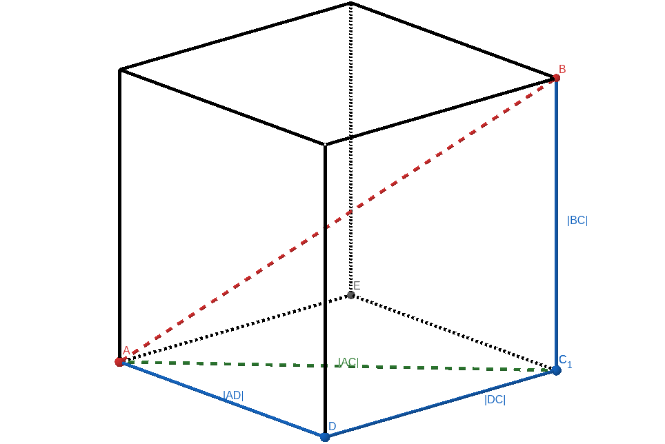
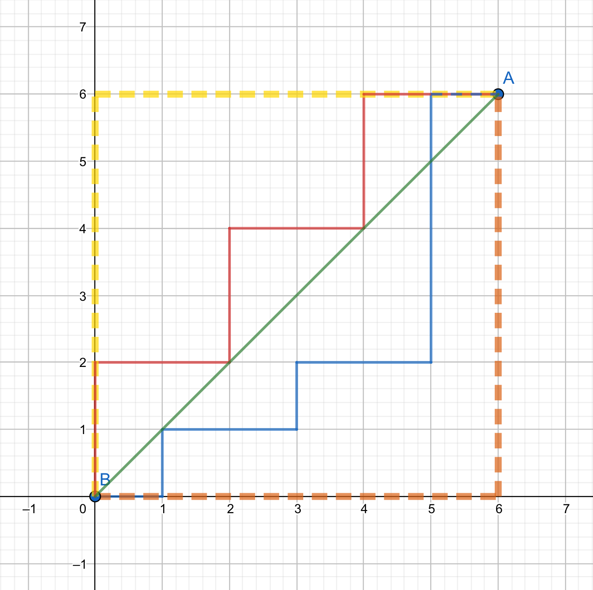
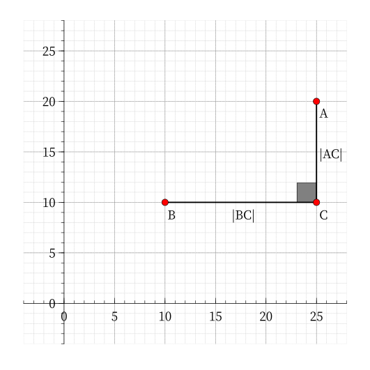
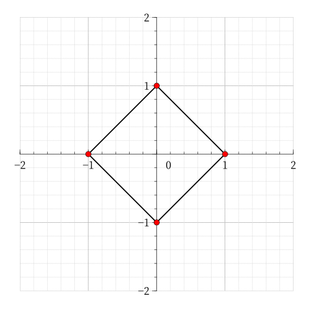
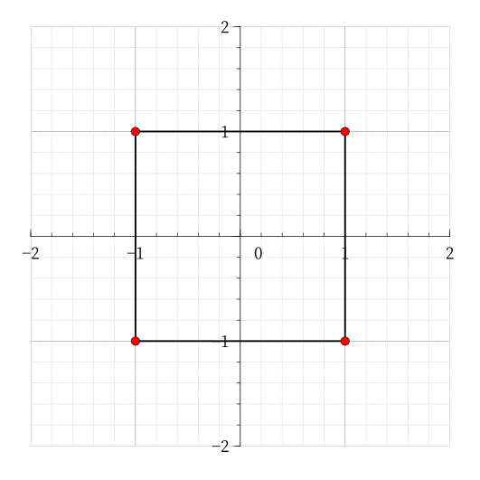

# 距离 - OI Wiki

- Source: https://oi-wiki.org/geometry/distance/

# 距离

## 欧氏距离

### 二维空间

#### 定义

欧氏距离，一般也称作欧几里得距离．在平面直角坐标系中，设点 𝐴,𝐵A,B 的坐标分别为 𝐴(𝑥1,𝑦1),𝐵(𝑥2,𝑦2)A(x1,y1),B(x2,y2)，则两点间的欧氏距离为：

|𝐴𝐵|=√(𝑥2−𝑥1)2+(𝑦2−𝑦1)2|AB|=(x2−x1)2+(y2−y1)2

#### 解释

举个例子，若在平面直角坐标系中，有两点 𝐴(6,5),𝐵(2,2)A(6,5),B(2,2)，通过公式，我们很容易得到 𝐴,𝐵A,B 两点间的欧氏距离：

|𝐴𝐵|=√(2−6)2+(2−5)2=√42+32=5|AB|=(2−6)2+(2−5)2=42+32=5

除此之外，𝑃(𝑥,𝑦)P(x,y) 到原点的欧氏距离可以用公式表示为：

|𝑃|=√𝑥2+𝑦2|P|=x2+y2

### n 维空间

#### 引入

那么，三维空间中两点的欧氏距离公式呢？我们来观察下图．



我们很容易发现，在 △𝐴𝐷𝐶△ADC 中，∠𝐴𝐷𝐶 =90∘∠ADC=90∘；在 △𝐴𝐶𝐵△ACB 中，∠𝐴𝐶𝐵 =90∘∠ACB=90∘．

∴ |𝐴𝐵|=√|𝐴𝐶|2+|𝐵𝐶|2=√|𝐴𝐷|2+|𝐶𝐷|2+|𝐵𝐶|2∴ |AB|=|AC|2+|BC|2=|AD|2+|CD|2+|BC|2

#### 定义

由此可得，三维空间中欧氏距离的距离公式为：

|𝐴𝐵|=√(𝑥2−𝑥1)2+(𝑦2−𝑦1)2+(𝑧2−𝑧1)2|𝑃|=√𝑥2+𝑦2+𝑧2|AB|=(x2−x1)2+(y2−y1)2+(z2−z1)2|P|=x2+y2+z2

#### 解释

[NOIP2017 提高组 奶酪](https://uoj.ac/problem/332) 就运用了这一知识，可以作为欧氏距离的例题．

以此类推，我们就得到了 𝑛n 维空间中欧氏距离的距离公式：对于 ⃗𝐴(𝑥11,𝑥12,⋯,𝑥1𝑛), ⃗𝐵(𝑥21,𝑥22,⋯,𝑥2𝑛)A→(x11,x12,⋯,x1n), B→(x21,x22,⋯,x2n)，有

‖⟶𝐴𝐵‖=√(𝑥11−𝑥21)2+(𝑥12−𝑥22)2+⋅⋅⋅+(𝑥1𝑛−𝑥2𝑛)2=√𝑛∑𝑖=1(𝑥1𝑖−𝑥2𝑖)2‖AB→‖=(x11−x21)2+(x12−x22)2+⋅⋅⋅+(x1n−x2n)2=∑i=1n(x1i−x2i)2

欧氏距离虽然很有用，但也有明显的缺点．两个整点计算其欧氏距离时，往往答案是浮点型，会存在一定误差．

## 曼哈顿距离

### 定义

在二维空间内，两个点之间的曼哈顿距离（Manhattan distance）为它们横坐标之差的绝对值与纵坐标之差的绝对值之和．设点 𝐴(𝑥1,𝑦1),𝐵(𝑥2,𝑦2)A(x1,y1),B(x2,y2)，则 𝐴,𝐵A,B 之间的曼哈顿距离用公式可以表示为：

𝑑(𝐴,𝐵)=|𝑥1−𝑥2|+|𝑦1−𝑦2|d(A,B)=|x1−x2|+|y1−y2|

### 解释

观察下图：



在 𝐴,𝐵A,B 间，黄线、橙线都表示曼哈顿距离，而红线、蓝线表示等价的曼哈顿距离，绿线表示欧氏距离．

同样的例子，在下图中 𝐴,𝐵A,B 的坐标分别为 𝐴(25,20),𝐵(10,10)A(25,20),B(10,10)．



通过公式，我们很容易得到 𝐴,𝐵A,B 两点间的曼哈顿距离：

𝑑(𝐴,𝐵)=|20−10|+|25−10|=10+15=25d(A,B)=|20−10|+|25−10|=10+15=25

经过推导，我们得到 𝑛n 维空间的曼哈顿距离公式为：

𝑑(𝐴,𝐵)=|𝑥1−𝑦1|+|𝑥2−𝑦2|+⋅⋅⋅+|𝑥𝑛−𝑦𝑛|=𝑛∑𝑖=1|𝑥𝑖−𝑦𝑖|d(A,B)=|x1−y1|+|x2−y2|+⋅⋅⋅+|xn−yn|=∑i=1n|xi−yi|

### 性质

除了公式之外，曼哈顿距离还具有以下数学性质：

  * 非负性：曼哈顿距离是一个非负数，即 𝑑(𝑖,𝑗) ≥0d(i,j)≥0．
  * 统一性：一个点到自身的曼哈顿距离为 00，即 𝑑(𝑖,𝑖) =0d(i,i)=0．
  * 对称性：𝐴A 到 𝐵B 与 𝐵B 到 𝐴A 的曼哈顿距离相等，即 𝑑(𝑖,𝑗) =𝑑(𝑗,𝑖)d(i,j)=d(j,i)．
  * 三角不等式：从点 𝑖i 到 𝑗j 的直接距离不会大于途经的任何其它点 𝑘k 的距离，即 𝑑(𝑖,𝑗) ≤𝑑(𝑖,𝑘) +𝑑(𝑘,𝑗)d(i,j)≤d(i,k)+d(k,j)．

### 例题

[P5098「USACO04OPEN」Cave Cows 3](https://www.luogu.com.cn/problem/P5098)

根据题意，对于式子 |𝑥1 −𝑥2| +|𝑦1 −𝑦2||x1−x2|+|y1−y2|，我们可以假设 𝑥1 −𝑥2 ≥0x1−x2≥0，根据 𝑦1 −𝑦2y1−y2 的符号分成两种情况：

  * (𝑦1 −𝑦2 ≥0) →|𝑥1 −𝑥2| +|𝑦1 −𝑦2| =𝑥1 +𝑦1 −(𝑥2 +𝑦2)(y1−y2≥0)→|x1−x2|+|y1−y2|=x1+y1−(x2+y2)

  * (𝑦1 −𝑦2 <0) →|𝑥1 −𝑥2| +|𝑦1 −𝑦2| =𝑥1 −𝑦1 −(𝑥2 −𝑦2)(y1−y2<0)→|x1−x2|+|y1−y2|=x1−y1−(x2−y2)

只要分别求出 𝑥 +𝑦,𝑥 −𝑦x+y,x−y 的最大值和最小值即能得出答案．

参考代码

C++Python

```text 1 2 3 4 5 6 7 8 9 10 11 12 13 14 15 ``` |  ```text #include <algorithm> #include <cstdio> using namespace std ; int main () { int n , x , y , minx = 0x7fffffff , maxx = 0 , miny = 0x7fffffff , maxy = 0 ; scanf ( "%d" , & n ); for ( int i = 1 ; i <= n ; i ++ ) { scanf ( "%d%d" , & x , & y ); minx = min ( minx , x \+ y ), maxx = max ( maxx , x \+ y ); miny = min ( miny , x \- y ), maxy = max ( maxy , x \- y ); } printf ( "%d \n " , max ( maxx \- minx , maxy \- miny )); return 0 ; } ```   
---|---  
  
```text 1 2 3 4 5 6 7 8 9 10 11 12 ``` |  ```text minx = 0x7FFFFFFF maxx = 0 miny = 0x7FFFFFFF maxy = 0 n = int ( input ()) for i in range ( 1 , n \+ 1 ): x , y = map ( lambda x : int ( x ), input () . split ()) minx = min ( minx , x \+ y ) maxx = max ( maxx , x \+ y ) miny = min ( miny , x \- y ) maxy = max ( maxy , x \- y ) print ( max ( maxx \- minx , maxy \- miny )) ```   
---|---  
  
其实还有第二种做法，那就是把曼哈顿距离转化为切比雪夫距离求解，最后部分会讲到．

## 切比雪夫距离

### 定义

切比雪夫距离（Chebyshev distance）是向量空间中的一种度量，二个点之间的距离定义为其各坐标数值差的最大值．1

在二维空间内，两个点之间的切比雪夫距离为它们横坐标之差的绝对值与纵坐标之差的绝对值的最大值．设点 𝐴(𝑥1,𝑦1),𝐵(𝑥2,𝑦2)A(x1,y1),B(x2,y2)，则 𝐴,𝐵A,B 之间的切比雪夫距离用公式可以表示为：

𝑑(𝐴,𝐵)=max(|𝑥1−𝑥2|,|𝑦1−𝑦2|)d(A,B)=max(|x1−x2|,|y1−y2|)

𝑛n 维空间中切比雪夫距离的距离公式可以表示为：

𝑑(𝑥,𝑦)=max{|𝑥1−𝑦1|,|𝑥2−𝑦2|,⋅⋅⋅,|𝑥𝑛−𝑦𝑛|}=max{|𝑥𝑖−𝑦𝑖|}(𝑖∈[1,𝑛])d(x,y)=max{|x1−y1|,|x2−y2|,⋅⋅⋅,|xn−yn|}=max{|xi−yi|}(i∈[1,n])

### 解释

仍然是这个例子，下图中 𝐴,𝐵A,B 的坐标分别为 𝐴(25,20),𝐵(10,10)A(25,20),B(10,10)．


𝑑(𝐴,𝐵)=max(|20−10|,|25−10|)=max(10,15)=15d(A,B)=max(|20−10|,|25−10|)=max(10,15)=15

## 曼哈顿距离与切比雪夫距离的相互转化

### 过程

首先，我们考虑画出平面直角坐标系上所有到原点的曼哈顿距离为 11 的点．

通过公式，我们很容易得到方程 |𝑥| +|𝑦| =1|x|+|y|=1．

将绝对值展开，得到 44 个 一次函数，分别是：

𝑦=−𝑥+1(𝑥≥0,𝑦≥0)𝑦=𝑥+1(𝑥≤0,𝑦≥0)𝑦=𝑥−1(𝑥≥0,𝑦≤0)𝑦=−𝑥−1(𝑥≤0,𝑦≤0)y=−x+1(x≥0,y≥0)y=x+1(x≤0,y≥0)y=x−1(x≥0,y≤0)y=−x−1(x≤0,y≤0)

将这 44 个函数画到平面直角坐标系上，得到一个边长为 √22 的正方形，如下图所示：



正方形边界上所有的点到原点的 曼哈顿距离 都是 11．

同理，我们再考虑画出平面直角坐标系上所有到原点的 切比雪夫距离 为 11 的点．

通过公式，我们知道 max(|𝑥|,|𝑦|) =1max(|x|,|y|)=1．

我们将式子展开，也同样可以得到 44 条线段，分别是：

𝑦=1(−1≤𝑥≤1)𝑦=−1(−1≤𝑥≤1)𝑥=1,(−1≤𝑦≤1)𝑥=−1,(−1≤𝑦≤1)y=1(−1≤x≤1)y=−1(−1≤x≤1)x=1,(−1≤y≤1)x=−1,(−1≤y≤1)

画到平面直角坐标系上，可以得到一个边长为 22 的正方形，如下图所示：



正方形边界上所有的点到原点的切比雪夫距离都是 11．

将这两幅图对比，我们会神奇地发现：

这 22 个正方形是相似图形．

### 证明

所以，曼哈顿距离与切比雪夫距离之间会不会有联系呢？

接下来我们简略证明一下：

假设 𝐴(𝑥1,𝑦1),𝐵(𝑥2,𝑦2)A(x1,y1),B(x2,y2)，

我们把曼哈顿距离中的绝对值拆开，能够得到四个值，这四个值中的最大值是两个非负数之和，即曼哈顿距离．则 𝐴,𝐵A,B 两点的曼哈顿距离为：

𝑑(𝐴,𝐵)=|𝑥1−𝑥2|+|𝑦1−𝑦2|=max{𝑥1−𝑥2+𝑦1−𝑦2,𝑥1−𝑥2+𝑦2−𝑦1,𝑥2−𝑥1+𝑦1−𝑦2,𝑥2−𝑥1+𝑦2−𝑦1}=max(|(𝑥1+𝑦1)−(𝑥2+𝑦2)|,|(𝑥1−𝑦1)−(𝑥2−𝑦2)|)d(A,B)=|x1−x2|+|y1−y2|=max{x1−x2+y1−y2,x1−x2+y2−y1,x2−x1+y1−y2,x2−x1+y2−y1}=max(|(x1+y1)−(x2+y2)|,|(x1−y1)−(x2−y2)|)

我们很容易发现，这就是 (𝑥1 +𝑦1,𝑥1 −𝑦1),(𝑥2 +𝑦2,𝑥2 −𝑦2)(x1+y1,x1−y1),(x2+y2,x2−y2) 两点之间的切比雪夫距离．

所以将每一个点 (𝑥,𝑦)(x,y) 转化为 (𝑥 +𝑦,𝑥 −𝑦)(x+y,x−y)，新坐标系下的切比雪夫距离即为原坐标系下的曼哈顿距离．

同理，𝐴,𝐵A,B 两点的切比雪夫距离为：

𝑑(𝐴,𝐵)=max{|𝑥1−𝑥2|,|𝑦1−𝑦2|}=max{∣𝑥1+𝑦12−𝑥2+𝑦22∣+∣𝑥1−𝑦12−𝑥2−𝑦22∣}d(A,B)=max{|x1−x2|,|y1−y2|}=max{|x1+y12−x2+y22|+|x1−y12−x2−y22|}

而这就是 (𝑥1+𝑦12,𝑥1−𝑦12),(𝑥2+𝑦22,𝑥2−𝑦22)(x1+y12,x1−y12),(x2+y22,x2−y22) 两点之间的曼哈顿距离．

所以将每一个点 (𝑥,𝑦)(x,y) 转化为 (𝑥+𝑦2,𝑥−𝑦2)(x+y2,x−y2)，新坐标系下的曼哈顿距离即为原坐标系下的切比雪夫距离．

### 结论

  * 曼哈顿坐标系是通过切比雪夫坐标系旋转 45∘45∘ 后，再缩小到原来的一半得到的．
  * 将一个点 (𝑥,𝑦)(x,y) 的坐标变为 (𝑥 +𝑦,𝑥 −𝑦)(x+y,x−y) 后，原坐标系中的曼哈顿距离等于新坐标系中的切比雪夫距离．
  * 将一个点 (𝑥,𝑦)(x,y) 的坐标变为 (𝑥+𝑦2,𝑥−𝑦2)(x+y2,x−y2) 后，原坐标系中的切比雪夫距离等于新坐标系中的曼哈顿距离．

碰到求切比雪夫距离或曼哈顿距离的题目时，我们往往可以相互转化来求解．两种距离在不同的题目中有不同的优缺点，应该灵活运用．

### 例题

[P4648「IOI2007」pairs 动物对数](https://www.luogu.com.cn/problem/P4648)（曼哈顿距离转切比雪夫距离）

[P3964「TJOI2013」松鼠聚会](https://www.luogu.com.cn/problem/P3964)（切比雪夫距离转曼哈顿距离）

最后给出 [P5098「USACO04OPEN」Cave Cows 3](https://www.luogu.com.cn/problem/P5098) 的第二种解法：

我们考虑将题目所求的曼哈顿距离转化为切比雪夫距离，即把每个点的坐标 (𝑥,𝑦)(x,y) 变为 (𝑥 +𝑦,𝑥 −𝑦)(x+y,x−y)．

所求的答案就变为 max𝑖,𝑗∈𝑛{max{|𝑥𝑖−𝑥𝑗|,|𝑦𝑖−𝑦𝑗|}}maxi,j∈n{max{|xi−xj|,|yi−yj|}}．

现要使得横坐标之差和纵坐标之差最大，只需要预处理出 𝑥,𝑦x,y 的最大值和最小值即可．

参考代码

C++Python

```text 1 2 3 4 5 6 7 8 9 10 11 12 13 14 15 16 ``` |  ```text #include <algorithm> #include <cstdio> using namespace std ; int main () { int n , x , y , a , b , minx = 0x7fffffff , maxx = 0 , miny = 0x7fffffff , maxy = 0 ; scanf ( "%d" , & n ); for ( int i = 1 ; i <= n ; i ++ ) { scanf ( "%d%d" , & a , & b ); x = a \+ b , y = a \- b ; minx = min ( minx , x ), maxx = max ( maxx , x ); miny = min ( miny , y ), maxy = max ( maxy , y ); } printf ( "%d \n " , max ( maxx \- minx , maxy \- miny )); return 0 ; } ```   
---|---  
  
```text 1 2 3 4 5 6 7 8 9 10 11 12 13 14 ``` |  ```text minx = 0x7FFFFFFF maxx = 0 miny = 0x7FFFFFFF maxy = 0 n = int ( input ()) for i in range ( 1 , n \+ 1 ): a , b = map ( lambda x : int ( x ), input () . split ()) x = a \+ b y = a \- b minx = min ( minx , x ) maxx = max ( maxx , x ) miny = min ( miny , y ) maxy = max ( maxy , y ) print ( max ( maxx \- minx , maxy \- miny )) ```   
---|---  
  
对比两份代码，我们又能够发现，两种不同的思路，写出来的代码却是完全等价的，是不是很神奇呢？当然，更高深的东西需要大家另行研究．

## 闵可夫斯基距离

我们定义 𝑛n 维空间中两点 𝑋(𝑥1,𝑥2,…,𝑥𝑛)X(x1,x2,…,xn)，𝑌(𝑦1,𝑦2,…,𝑦𝑛)Y(y1,y2,…,yn) 之间的闵可夫斯基距离为：

𝐷(𝑋,𝑌)=(𝑛∑𝑖=1|𝑥𝑖−𝑦𝑖|𝑝)1𝑝.D(X,Y)=(∑i=1n|xi−yi|p)1p.

特别的：

  1. 当 𝑝 =1p=1 时，𝐷(𝑋,𝑌) =∑𝑛𝑖=1|𝑥𝑖−𝑦𝑖|D(X,Y)=∑i=1n|xi−yi| 即为曼哈顿距离；
  2. 当 𝑝 =2p=2 时，𝐷(𝑋,𝑌) =(∑𝑛𝑖=1(𝑥𝑖−𝑦𝑖)2)1/2D(X,Y)=(∑i=1n(xi−yi)2)1/2 即为欧几里得距离；
  3. 当 𝑝 →∞p→∞ 时，𝐷(𝑋,𝑌) =lim𝑝→∞(∑𝑛𝑖=1|𝑥𝑖−𝑦𝑖|𝑝)1/𝑝 =𝑛max𝑖=1|𝑥𝑖−𝑦𝑖|D(X,Y)=limp→∞(∑i=1n|xi−yi|p)1/p=maxi=1n|xi−yi| 即为切比雪夫距离．

注意：当 𝑝 ≥1p≥1 时，闵可夫斯基距离才是度量，具体证明参见 [Minkowski distance - Wikipedia](https://en.wikipedia.org/wiki/Minkowski_distance)．

## 参考资料与链接

  1. [浅谈三种常见的距离算法](https://www.luogu.com.cn/blog/xuxing/Distance-Algorithm)，感谢作者 xuxing 的授权．

* * *

  1. [切比雪夫距离 - 维基百科，自由的百科全书](https://zh.wikipedia.org/wiki/%E5%88%87%E6%AF%94%E9%9B%AA%E5%A4%AB%E8%B7%9D%E7%A6%BB) ↩

* * *

>  __本页面最近更新： 2026/1/7 08:56:54，[更新历史](https://github.com/OI-wiki/OI-wiki/commits/master/docs/geometry/distance.md)  
>  __发现错误？想一起完善？[在 GitHub 上编辑此页！](https://oi-wiki.org/edit-landing/?ref=/geometry/distance.md "edit.link.title")  
>  __本页面贡献者：[Ir1d](https://github.com/Ir1d), [partychicken](https://github.com/partychicken), [abc1763613206](https://github.com/abc1763613206), [Chrogeek](https://github.com/Chrogeek), [ChungZH](https://github.com/ChungZH), [Enter-tainer](https://github.com/Enter-tainer), [frank-xjh](https://github.com/frank-xjh), [hsfzLZH1](https://github.com/hsfzLZH1), [Tiphereth-A](https://github.com/Tiphereth-A), [countercurrent-time](https://github.com/countercurrent-time), [Haohu Shen](mailto:haohu.shen@ucalgary.ca), [Henry-ZHR](https://github.com/Henry-ZHR), [iamtwz](https://github.com/iamtwz), [ksyx](https://github.com/ksyx), [Planet6174](https://github.com/Planet6174), [Tiger3018](https://github.com/Tiger3018), [Xeonacid](https://github.com/Xeonacid), [current2020](https://github.com/current2020), [ezoixx130](https://github.com/ezoixx130), [HeRaNO](https://github.com/HeRaNO), [i-Yirannn](https://github.com/i-Yirannn), [i-yyi](https://github.com/i-yyi), [Marcythm](https://github.com/Marcythm), [Menci](https://github.com/Menci), [mgt](mailto:i@margatroid.xyz), [ouuan](https://github.com/ouuan), [scp020](https://github.com/scp020), [shawlleyw](https://github.com/shawlleyw), [StudyingFather](https://github.com/StudyingFather), [swsoyee](https://github.com/swsoyee), [TrisolarisHD](mailto:orzcyand1317@gmail.com), [turing0](https://github.com/turing0), [xmb3857](https://github.com/xmb3857)  
>  __本页面的全部内容在**[CC BY-SA 4.0](https://creativecommons.org/licenses/by-sa/4.0/deed.zh) 和 [SATA](https://github.com/zTrix/sata-license)** 协议之条款下提供，附加条款亦可能应用
