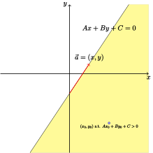
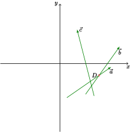
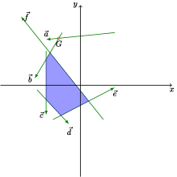
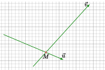
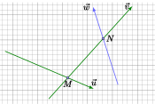
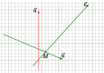

# 半平面交 - OI Wiki

- Source: https://oi-wiki.org/geometry/half-plane/

# 半平面交

## 定义

### 半平面

一条直线和直线的一侧．半平面是一个点集，因此是一条直线和直线的一侧构成的点集．当包含直线时，称为闭半平面；当不包含直线时，称为开半平面．

解析式一般为 𝐴𝑥 +𝐵𝑦 +𝐶 ≥0Ax+By+C≥0．

在计算几何中用向量表示，整个题统一以向量的左侧或右侧为半平面．



### 半平面交

半平面交是指多个半平面的交集．因为半平面是点集，所以点集的交集仍然是点集．在平面直角坐标系围成一个区域．

这就很像普通的线性规划问题了，得到的半平面交就是线性规划中的可行域．一般情况下半平面交是有限的，经常考察面积等问题的解决．

它可以理解为向量集中每一个向量的右侧的交，或者是下面方程组的解．

⎧{ {⎨{ {⎩𝐴1𝑥+𝐵1𝑦+𝐶≥0𝐴2𝑥+𝐵2𝑦+𝐶≥0⋯{A1x+B1y+C≥0A2x+B2y+C≥0⋯

### 多边形的核

如果一个点集中的点与多边形上任意一点的连线与多边形没有其他交点，那么这个点集被称为多边形的核．

把多边形的每条边看成是首尾相连的向量，那么这些向量在多边形内部方向的半平面交就是多边形的核．

## 解法 - S&I 算法

### 极角排序

C 语言有一个库函数叫做 `atan2(double y,double x)`，可以返回 𝜃 ∈( −𝜋,𝜋]θ∈(−π,π]，𝜃 =arctan⁡𝑦𝑥θ=arctan⁡yx．

直接以向量为自变量，调用这个函数，以返回值为关键字排序，得到新的边（向量）集．

排序时，如果遇到共线向量（且方向相同），则取靠近可行域的一个．比如两个向量的极角相同，而我们要的是向量的左侧半平面，那么我们只需要保留左侧的向量．判断方法是取其中一个向量的起点或终点与另一个比较，检查是在左边还是在右边．

### 维护单调队列

因为半平面交是一个凸多边形，所以需要维护一个凸壳．因为后来加入的只可能会影响最开始加入的或最后加入的边（此时凸壳连通），只需要删除队首和队尾的元素，所以需要用单调队列．

我们遍历排好序了的向量，并维护另一个交点数组．当单队中元素超过 2 个时，他们之间就会产生交点．

对于当前向量，如果上一个交点在这条向量表示的半平面交的 **异侧** ，那么上一条边就没有意义了．



如上图，假设取向量左侧半平面．极角排序后，遍历顺序应该是 ⃗𝑎 →⃗𝑏 →⃗𝑐a→→b→→c→．当 ⃗𝑎a→ 和 ⃗𝑏b→ 入队时，在交点数组里会产生一个点 𝐷D（交点数组保存队列中相同下标的向量与前一向量的交点）．

接下来枚举到 ⃗𝑐c→ 时，发现 𝐷D 在 ⃗𝑐c→ 的右侧．而因为 **产生** 𝐷D **的向量的极角一定比** ⃗𝑐c→ **要小** ，所以产生 𝐷D 的向量（指 ⃗𝑏b→）就对半平面交没有影响了．

还有一种可能的情况是快结束的时候，新加入的向量会从队首开始造成影响．



仍然假设取向量左侧半平面．加入向量 ⃗𝑓f→ 之后，第一个交点 𝐺G 就在 ⃗𝑓f→ 的右侧，我们把上面的判断标准逆过来看，就知道此时应该删除向量 ⃗𝑎a→，也即 **队首** 的向量．

最后用队首的向量排除一下队尾多余的向量．因为队首的向量会被后面的约束，而队尾的向量不会．此时它们围成了一个环，因此队首的向量就可以约束队尾的向量．

### 得到半平面交

如果半平面交是一个凸 𝑛n 边形，最后在交点数组里会得到 𝑛n 个点．我们再把它们首尾相连，就是一个统一方向（顺或逆时针）的 𝑛n 多边形．

此时就可以用三角剖分求面积了．（求面积是最基础的考法）

偶尔会出现半平面交不存在或面积为 0 的情况，注意考虑边界．

### 注意事项

当出现一个可以把队列里的点全部弹出去的向量（即所有队列里的点都在该向量的右侧），则我们 **必须** 先处理队尾，再处理队首．因此在循环中，我们先枚举 `--r;` 的部分，再枚举 `++l;` 的部分，才不会错．原因如下．



一般情况下，我们在队列（队列顺序为 {⃗𝑢,⃗𝑣}{u→,v→}）后面加一条边（向量 ⃗𝑤w→），会产生一个交点 𝑁N，缩小 ⃗𝑣v→ 后面的范围．



但是毕竟每次操作都是一般的，因此可能会有把 𝑀M 点「挤出去」的情况．



如果此时出现了向量 ⃗𝑎a→，使得 𝑀M 在 ⃗𝑎a→ 的右侧，那么 𝑀M 就要出队了．此时如果从队首枚举 `++l`，显然是扩大了范围．实际上 𝑀M 点是由 ⃗𝑢u→ 和 ⃗𝑣v→ 共同构成的，因此需要考虑影响到现有进程的是 ⃗𝑢u→ 还是 ⃗𝑣v→．而因为我们在极角排序后，向量是逆时针顺序，所以 ⃗𝑣v→ 的影响要更大一些．

就如上图，如果 𝑀M 确认在 ⃗𝑎a→ 的右侧，那么此时 ⃗𝑣v→ 的影响一定不会对半平面交的答案作出任何贡献．

而我们排除队首的原因是 **当前向量的限制比队首向量要大** ，这个条件的前提是队列里有不止两个线段（向量），不然就会出现上面的情况．

所以一定要先排除队尾再排除队首．

代码 - 比较部分

```text 1 2 3 4 5 6 7 8 ``` |  ```text friend bool operator < ( seg x , seg y ) { db t1 = atan2 (( x . b \- x . a ). y , ( x . b \- x . a ). x ); db t2 = atan2 (( y . b \- y . a ). y , ( y . b \- y . a ). x ); // 求极角 if ( fabs ( t1 \- t2 ) > eps ) // 如果极角不等 return t1 < t2 ; return ( y . a \- x . a ) * ( y . b \- x . a ) > eps ; // 判断向量x在y的哪边，令最靠左的排在最左边 } ```   
---|---  
  
代码 - 增量部分

```text 1 2 3 4 5 6 7 8 9 10 11 12 13 14 15 16 17 18 19 20 21 22 23 24 25 ``` |  ```text // pnt its(seg a,seg b)表示求线段a,b的交点 // s[]是极角排序后的向量 // q[]是向量队列 // t[i]是s[i-1]与s[i]的交点 // 【码风】队列的范围是(l,r] // 求的是向量左侧的半平面 int l = 0 , r = 0 ; for ( int i = 1 ; i <= n ; ++ i ) if ( s [ i ] != s [ i \- 1 ]) { // 注意要先检查队尾 while ( r \- l > 1 && ( s [ i ]. b \- t [ r ]) * ( s [ i ]. a \- t [ r ]) > eps ) // 如果上一个交点在向量右侧则弹出队尾 \-- r ; while ( r \- l > 1 && ( s [ i ]. b \- t [ l \+ 2 ]) * ( s [ i ]. a \- t [ l \+ 2 ]) > eps ) // 如果第一个交点在向量右侧则弹出队首 ++ l ; q [ ++ r ] = s [ i ]; if ( r \- l > 1 ) t [ r ] = its ( q [ r ], q [ r \- 1 ]); // 求新交点 } while ( r \- l > 1 && ( q [ l \+ 1 ]. b \- t [ r ]) * ( q [ l \+ 1 ]. a \- t [ r ]) > eps ) // 注意删除多余元素 \-- r ; t [ r \+ 1 ] = its ( q [ l \+ 1 ], q [ r ]); // 再求出新的交点 ++ r ; // 这里不能在t里面++r需要注意一下…… ```   
---|---  
  
## 练习

[POJ 2451 Uyuw's Concert](http://poj.org/problem?id=2451) 注意边界

[POJ 1279 Art Gallery](http://poj.org/problem?id=1279) 求多边形的核

[「CQOI2006」凸多边形](https://www.luogu.com.cn/problem/P4196)

* * *

>  __本页面最近更新： 2026/1/7 08:56:54，[更新历史](https://github.com/OI-wiki/OI-wiki/commits/master/docs/geometry/half-plane.md)  
>  __发现错误？想一起完善？[在 GitHub 上编辑此页！](https://oi-wiki.org/edit-landing/?ref=/geometry/half-plane.md "edit.link.title")  
>  __本页面贡献者：[Ir1d](https://github.com/Ir1d), [H-J-Granger](https://github.com/H-J-Granger), [StudyingFather](https://github.com/StudyingFather), [wjy-yy](https://github.com/wjy-yy), [countercurrent-time](https://github.com/countercurrent-time), [NachtgeistW](https://github.com/NachtgeistW), [sshwy](https://github.com/sshwy), [Tiphereth-A](https://github.com/Tiphereth-A), [CCXXXI](https://github.com/CCXXXI), [Enter-tainer](https://github.com/Enter-tainer), [Xeonacid](https://github.com/Xeonacid), [AngelKitty](https://github.com/AngelKitty), [cjsoft](https://github.com/cjsoft), [diauweb](https://github.com/diauweb), [Early0v0](https://github.com/Early0v0), [ezoixx130](https://github.com/ezoixx130), [GavinZhengOI](https://github.com/GavinZhengOI), [GekkaSaori](https://github.com/GekkaSaori), [Konano](https://github.com/Konano), [LovelyBuggies](https://github.com/LovelyBuggies), [Makkiy](https://github.com/Makkiy), [mgt](mailto:i@margatroid.xyz), [minghu6](https://github.com/minghu6), [P-Y-Y](https://github.com/P-Y-Y), [PotassiumWings](https://github.com/PotassiumWings), [SamZhangQingChuan](https://github.com/SamZhangQingChuan), [Suyun514](mailto:suyun514@qq.com), [weiyong1024](https://github.com/weiyong1024), [Gesrua](https://github.com/Gesrua), [Henry-ZHR](https://github.com/Henry-ZHR), [ksyx](https://github.com/ksyx), [kxccc](https://github.com/kxccc), [lychees](https://github.com/lychees), [ouuan](https://github.com/ouuan), [Peanut-Tang](https://github.com/Peanut-Tang), [SukkaW](https://github.com/SukkaW)  
>  __本页面的全部内容在**[CC BY-SA 4.0](https://creativecommons.org/licenses/by-sa/4.0/deed.zh) 和 [SATA](https://github.com/zTrix/sata-license)** 协议之条款下提供，附加条款亦可能应用
