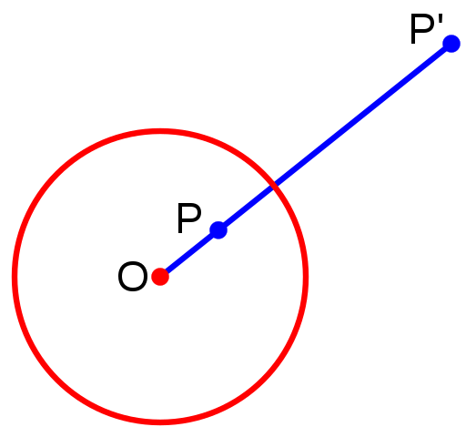
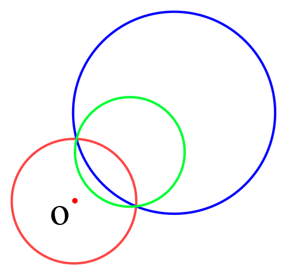
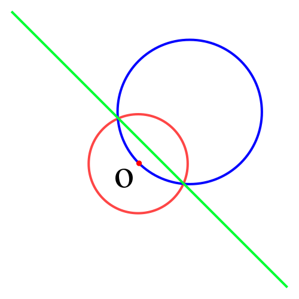

# 反演变换 - OI Wiki

- Source: https://oi-wiki.org/geometry/inverse/

# 反演变换

## 引入

反演变换适用于题目中存在多个圆/直线之间的相切关系的情况．利用反演变换的性质，在反演空间求解问题，可以大幅简化计算．

## 定义

给定反演中心点 𝑂O 和反演半径 𝑅R．若平面上点 𝑃P 和 𝑃′P′ 满足：

  * 点 𝑃′P′ 在射线 ⟶𝑂𝑃OP→ 上
  * |𝑂𝑃| ⋅|𝑂𝑃′| =𝑅2|OP|⋅|OP′|=R2

则称点 𝑃P 和点 𝑃′P′ 互为反演点．

## 解释

下图所示即为平面上一点 𝑃P 的反演：



## 性质

  1. 圆 𝑂O 外的点的反演点在圆 𝑂O 内，反之亦然；圆 𝑂O 上的点的反演点为其自身．

  2. 不过点 𝑂O 的圆 𝐴A，其反演图形也是不过点 𝑂O 的圆．



     * 记圆 𝐴A 半径为 𝑟1r1，其反演图形圆 𝐵B 半径为 𝑟2r2，则有：

𝑟2=12(1|𝑂𝐴|−𝑟1−1|𝑂𝐴|+𝑟1)𝑅2r2=12(1|OA|−r1−1|OA|+r1)R2
证明


根据反演变换定义：

|𝑂𝐶|⋅|𝑂𝐶′|=(|𝑂𝐴|+𝑟1)⋅(|𝑂𝐵|−𝑟2)=𝑅2|𝑂𝐷|⋅|𝑂𝐷′|=(|𝑂𝐴|−𝑟1)⋅(|𝑂𝐵|+𝑟2)=𝑅2|OC|⋅|OC′|=(|OA|+r1)⋅(|OB|−r2)=R2|OD|⋅|OD′|=(|OA|−r1)⋅(|OB|+r2)=R2

消掉 |𝑂𝐵||OB|，解方程即可．

     * 记点 𝑂O 坐标为 (𝑥0,𝑦0)(x0,y0)，点 𝐴A 坐标为 𝑥1,𝑦1x1,y1，点 𝐵B 坐标为 𝑥2,𝑦2x2,y2，则有：

𝑥2=𝑥0+|𝑂𝐵||𝑂𝐴|(𝑥1−𝑥0)𝑦2=𝑦0+|𝑂𝐵||𝑂𝐴|(𝑦1−𝑦0)x2=x0+|OB||OA|(x1−x0)y2=y0+|OB||OA|(y1−y0)

其中 |𝑂𝐵||OB| 可在上述求 𝑟2r2 的过程中计算得到．

  3. 过点 𝑂O 的圆 𝐴A，其反演图形是不过点 𝑂O 的直线．因为圆 𝐴A 上无限接近点 𝑂O 的一点，其反演点离点 𝑂O 无限远．



  4. 两个图形相切且存在不为点 𝑂O 的切点，则他们的反演图形也相切．

## 例题

### [「ICPC 2013 杭州赛区」Problem of Apollonius](https://acm.hdu.edu.cn/showproblem.php?pid=4773)

#### 题目大意

求过两圆外一点，且与两圆相切的所有的圆．

#### 解法

首先考虑解析几何解法，似乎很难求解．

考虑以需要经过的点为反演中心进行反演（反演半径任意），所求的圆的反演图形是一条直线（应用性质 33），且与题目给出两圆的反演图形（性质 22）相切（性质 44）．

于是题目经过反演变换后转变为：求两圆的所有公切线．

求出公切线后，反演回原平面即可．

示例代码

```text 1 2 3 4 5 6 7 8 9 10 11 12 13 14 15 16 17 18 19 20 21 22 23 24 25 26 27 28 29 30 31 32 33 34 35 36 37 38 39 40 41 42 43 44 45 46 47 48 49 50 51 52 53 54 55 56 57 58 59 60 61 62 63 64 65 66 67 68 69 70 71 72 73 74 75 76 77 78 79 80 81 82 83 84 85 86 87 88 89 90 91 92 93 94 95 96 97 98 99 100 101 102 103 104 105 106 107 108 109 110 111 112 113 114 115 116 117 118 119 120 121 122 123 124 125 126 127 128 129 130 131 132 133 134 135 136 137 138 139 140 141 142 143 144 145 146 147 148 149 150 151 152 153 154 155 156 157 158 159 160 161 162 163 164 165 166 167 ``` |  ```text #include <algorithm> #include <cmath> #include <cstdio> #include <cstring> #include <iostream> #include <vector> using namespace std ; constexpr double EPS = 1e-8 ; // 精度系数 const double PI = acos ( -1.0 ); // π constexpr int N = 4 ; // 点的定义 struct Point { double x , y ; Point ( double x = 0 , double y = 0 ) : x ( x ), y ( y ) {} bool operator < ( Point A ) const { return x == A . x ? y < A . y : x < A . x ; } }; // 向量的定义 using Vector = Point ; // 向量加法 Vector operator \+ ( Vector A , Vector B ) { return Vector ( A . x \+ B . x , A . y \+ B . y ); } // 向量减法 Vector operator \- ( Vector A , Vector B ) { return Vector ( A . x \- B . x , A . y \- B . y ); } // 向量数乘 Vector operator * ( Vector A , double p ) { return Vector ( A . x * p , A . y * p ); } // 向量数除 Vector operator / ( Vector A , double p ) { return Vector ( A . x / p , A . y / p ); } // 与0的关系 int dcmp ( double x ) { if ( fabs ( x ) < EPS ) return 0 ; return x < 0 ? -1 : 1 ; } // 向量点乘 double Dot ( Vector A , Vector B ) { return A . x * B . x \+ A . y * B . y ; } // 向量长度 double Length ( Vector A ) { return sqrt ( Dot ( A , A )); } // 向量叉乘 double Cross ( Vector A , Vector B ) { return A . x * B . y \- A . y * B . x ; } // 点在直线上投影 Point GetLineProjection ( Point P , Point A , Point B ) { Vector v = B \- A ; return A \+ v * ( Dot ( v , P \- A ) / Dot ( v , v )); } // 圆 struct Circle { Point c ; double r ; Circle () : c ( Point ( 0 , 0 )), r ( 0 ) {} Circle ( Point c , double r = 0 ) : c ( c ), r ( r ) {} // 输入极角返回点坐标 Point point ( double a ) { return Point ( c . x \+ cos ( a ) * r , c . y \+ sin ( a ) * r ); } }; // 两圆公切线 返回切线的条数，-1表示无穷多条切线 // a[i] 和 b[i] 分别是第i条切线在圆A和圆B上的切点 int getTangents ( Circle A , Circle B , Point * a , Point * b ) { int cnt = 0 ; if ( A . r < B . r ) { swap ( A , B ); swap ( a , b ); } double d2 = ( A . c . x \- B . c . x ) * ( A . c . x \- B . c . x ) \+ ( A . c . y \- B . c . y ) * ( A . c . y \- B . c . y ); double rdiff = A . r \- B . r ; double rsum = A . r \+ B . r ; if ( dcmp ( d2 \- rdiff * rdiff ) < 0 ) return 0 ; // 内含 double base = atan2 ( B . c . y \- A . c . y , B . c . x \- A . c . x ); if ( dcmp ( d2 ) == 0 && dcmp ( A . r \- B . r ) == 0 ) return -1 ; // 无限多条切线 if ( dcmp ( d2 \- rdiff * rdiff ) == 0 ) { // 内切，一条切线 a [ cnt ] = A . point ( base ); b [ cnt ] = B . point ( base ); ++ cnt ; return 1 ; } // 有外公切线 double ang = acos ( rdiff / sqrt ( d2 )); a [ cnt ] = A . point ( base \+ ang ); b [ cnt ] = B . point ( base \+ ang ); ++ cnt ; a [ cnt ] = A . point ( base \- ang ); b [ cnt ] = B . point ( base \- ang ); ++ cnt ; if ( dcmp ( d2 \- rsum * rsum ) == 0 ) { // 一条内公切线 a [ cnt ] = A . point ( base ); b [ cnt ] = B . point ( PI \+ base ); ++ cnt ; } else if ( dcmp ( d2 \- rsum * rsum ) > 0 ) { // 两条内公切线 double ang = acos ( rsum / sqrt ( d2 )); a [ cnt ] = A . point ( base \+ ang ); b [ cnt ] = B . point ( PI \+ base \+ ang ); ++ cnt ; a [ cnt ] = A . point ( base \- ang ); b [ cnt ] = B . point ( PI \+ base \- ang ); ++ cnt ; } return cnt ; } // 点 O 在圆 A 外，求圆 A 的反演圆 B，R 是反演半径 Circle Inversion_C2C ( Point O , double R , Circle A ) { double OA = Length ( A . c \- O ); double RB = 0.5 * (( 1 / ( OA \- A . r )) \- ( 1 / ( OA \+ A . r ))) * R * R ; double OB = OA * RB / A . r ; double Bx = O . x \+ ( A . c . x \- O . x ) * OB / OA ; double By = O . y \+ ( A . c . y \- O . y ) * OB / OA ; return Circle ( Point ( Bx , By ), RB ); } // 直线反演为过 O 点的圆 B，R 是反演半径 Circle Inversion_L2C ( Point O , double R , Point A , Vector v ) { Point P = GetLineProjection ( O , A , A \+ v ); double d = Length ( O \- P ); double RB = R * R / ( 2 * d ); Vector VB = ( P \- O ) / d * RB ; return Circle ( O \+ VB , RB ); } // 返回 true 如果 A B 两点在直线同侧 bool theSameSideOfLine ( Point A , Point B , Point S , Vector v ) { return dcmp ( Cross ( A \- S , v )) * dcmp ( Cross ( B \- S , v )) > 0 ; } int main () { int T ; scanf ( "%d" , & T ); while ( T \-- ) { Circle A , B ; Point P ; scanf ( "%lf%lf%lf" , & A . c . x , & A . c . y , & A . r ); scanf ( "%lf%lf%lf" , & B . c . x , & B . c . y , & B . r ); scanf ( "%lf%lf" , & P . x , & P . y ); Circle NA = Inversion_C2C ( P , 10 , A ); Circle NB = Inversion_C2C ( P , 10 , B ); Point LA [ N ], LB [ N ]; Circle ansC [ N ]; int q = getTangents ( NA , NB , LA , LB ), ans = 0 ; for ( int i = 0 ; i < q ; ++ i ) if ( theSameSideOfLine ( NA . c , NB . c , LA [ i ], LB [ i ] \- LA [ i ])) { if ( ! theSameSideOfLine ( P , NA . c , LA [ i ], LB [ i ] \- LA [ i ])) continue ; ansC [ ans ++ ] = Inversion_L2C ( P , 10 , LA [ i ], LB [ i ] \- LA [ i ]); } printf ( "%d \n " , ans ); for ( int i = 0 ; i < ans ; ++ i ) { printf ( "%.8f %.8f %.8f \n " , ansC [ i ]. c . x , ansC [ i ]. c . y , ansC [ i ]. r ); } } return 0 ; } ```   
---|---  
  
## 练习

[「ICPC 2017 南宁赛区网络赛」Finding the Radius for an Inserted Circle](https://vjudge.net/problem/%E8%AE%A1%E8%92%9C%E5%AE%A2-A1283)

[「CCPC 2017 网络赛」The Designer](https://acm.hdu.edu.cn/showproblem.php?pid=6158)

## 参考资料与拓展阅读

  * [Inversive geometry - Wikipedia](https://en.wikipedia.org/wiki/Inversive_geometry)

  * [圆的反演变换 - ACdreamers 的博客](https://blog.csdn.net/acdreamers/article/details/16966369)

* * *

>  __本页面最近更新： 2026/1/7 08:56:54，[更新历史](https://github.com/OI-wiki/OI-wiki/commits/master/docs/geometry/inverse.md)  
>  __发现错误？想一起完善？[在 GitHub 上编辑此页！](https://oi-wiki.org/edit-landing/?ref=/geometry/inverse.md "edit.link.title")  
>  __本页面贡献者：[Enter-tainer](https://github.com/Enter-tainer), [H-J-Granger](https://github.com/H-J-Granger), [StudyingFather](https://github.com/StudyingFather), [countercurrent-time](https://github.com/countercurrent-time), [hyp1231](https://github.com/hyp1231), [NachtgeistW](https://github.com/NachtgeistW), [Ir1d](https://github.com/Ir1d), [Tiphereth-A](https://github.com/Tiphereth-A), [383494](https://github.com/383494), [AngelKitty](https://github.com/AngelKitty), [CCXXXI](https://github.com/CCXXXI), [cjsoft](https://github.com/cjsoft), [diauweb](https://github.com/diauweb), [Early0v0](https://github.com/Early0v0), [ezoixx130](https://github.com/ezoixx130), [GekkaSaori](https://github.com/GekkaSaori), [HeRaNO](https://github.com/HeRaNO), [Konano](https://github.com/Konano), [LovelyBuggies](https://github.com/LovelyBuggies), [Makkiy](https://github.com/Makkiy), [mgt](mailto:i@margatroid.xyz), [minghu6](https://github.com/minghu6), [P-Y-Y](https://github.com/P-Y-Y), [PotassiumWings](https://github.com/PotassiumWings), [SamZhangQingChuan](https://github.com/SamZhangQingChuan), [sshwy](https://github.com/sshwy), [Suyun514](mailto:suyun514@qq.com), [weiyong1024](https://github.com/weiyong1024), [GavinZhengOI](https://github.com/GavinZhengOI), [Gesrua](https://github.com/Gesrua), [Ghost-LZW](https://github.com/Ghost-LZW), [iamtwz](https://github.com/iamtwz), [ksyx](https://github.com/ksyx), [kxccc](https://github.com/kxccc), [lychees](https://github.com/lychees), [Menci](https://github.com/Menci), [Peanut-Tang](https://github.com/Peanut-Tang), [SukkaW](https://github.com/SukkaW)  
>  __本页面的全部内容在**[CC BY-SA 4.0](https://creativecommons.org/licenses/by-sa/4.0/deed.zh) 和 [SATA](https://github.com/zTrix/sata-license)** 协议之条款下提供，附加条款亦可能应用
