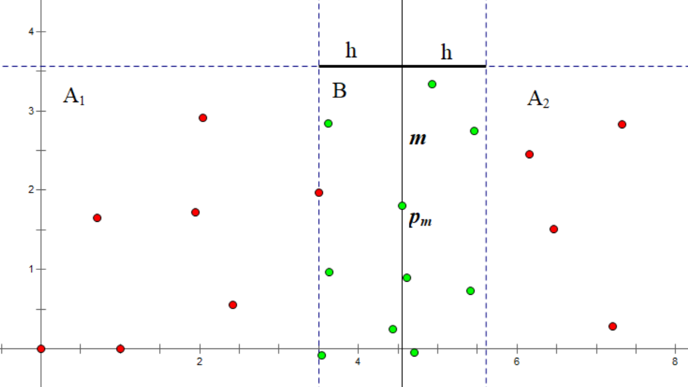
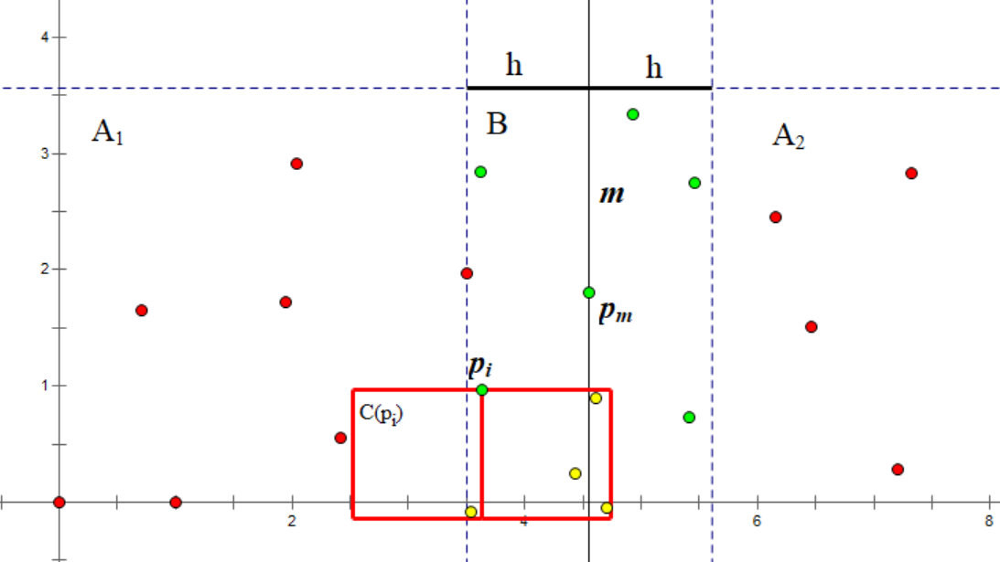
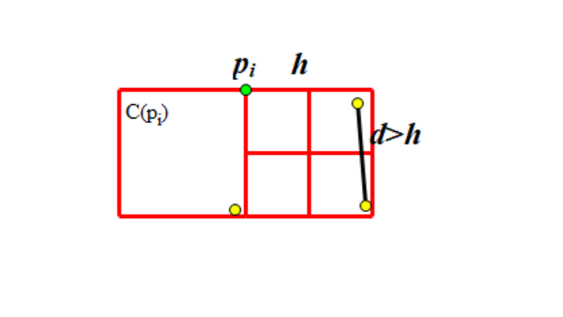

# 平面最近点对 - OI Wiki

- Source: https://oi-wiki.org/geometry/nearest-points/

# 平面最近点对

## 引入

给定 𝑛n 个二维平面上的点，求一组欧几里得距离最近的点对．

下面我们介绍一种时间复杂度为 𝑂(𝑛log⁡𝑛)O(nlog⁡n) 的分治算法来解决这个问题．该算法在 1975 年由 [Franco P. Preparata](https://en.wikipedia.org/wiki/Franco_P._Preparata) 提出，Preparata 和 [Michael Ian Shamos](https://en.wikipedia.org/wiki/Michael_Ian_Shamos) 证明了该算法在决策树模型下是最优的．

## 过程

与常规的分治算法一样，我们将这个有 𝑛n 个点的集合拆分成两个大小相同的集合 𝑆1,𝑆2S1,S2，并不断递归下去．但是我们遇到了一个难题：如何合并？即如何求出一个点在 𝑆1S1 中，另一个点在 𝑆2S2 中的最近点对？这里我们先假设合并操作的时间复杂度为 𝑂(𝑛)O(n)，可知算法总复杂度为 𝑇(𝑛) =2𝑇(𝑛2) +𝑂(𝑛) =𝑂(𝑛log⁡𝑛)T(n)=2T(n2)+O(n)=O(nlog⁡n)．

我们先将所有点按照 𝑥𝑖xi 为第一关键字、𝑦𝑖yi 为第二关键字排序，并以点 𝑝𝑚(𝑚 =⌊𝑛2⌋)pm(m=⌊n2⌋) 为分界点，拆分点集为 𝐴1,𝐴2A1,A2：

𝐴1={𝑝𝑖 ∣ 𝑖=0…𝑚}𝐴2={𝑝𝑖 ∣ 𝑖=𝑚+1…𝑛−1}A1={pi | i=0…m}A2={pi | i=m+1…n−1}

并递归下去，求出两点集各自内部的最近点对，设距离为 ℎ1,ℎ2h1,h2，取较小值设为 ℎh．

现在该合并了！我们试图找到这样的一组点对，其中一个属于 𝐴1A1，另一个属于 𝐴2A2，且二者距离小于 ℎh．因此我们将所有横坐标与 𝑥𝑚xm 的差小于 ℎh 的点放入集合 𝐵B：

𝐵={𝑝𝑖 ∣ |𝑥𝑖−𝑥𝑚|<ℎ}B={pi | |xi−xm|<h}

结合图像，直线 𝑚m 将点分成了两部分．𝑚m 左侧为 𝐴1A1 点集，右侧为为 𝐴2A2 点集．

再根据 𝐵 ={𝑝𝑖 ∣ |𝑥𝑖 −𝑥𝑚| <ℎ}B={pi | |xi−xm|<h} 规则，得到绿色点组成的 𝐵B 点集．

对于 𝐵B 中的每个点 𝑝𝑖pi，我们当前目标是找到一个同样在 𝐵B 中、且到其距离小于 ℎh 的点．为了避免两个点之间互相考虑，我们只考虑那些纵坐标小于 𝑦𝑖yi 的点．显然对于一个合法的点 𝑝𝑗pj，𝑦𝑖 −𝑦𝑗yi−yj 必须小于 ℎh．于是我们获得了一个集合 𝐶(𝑝𝑖)C(pi)：

𝐶(𝑝𝑖)={𝑝𝑗 ∣ 𝑝𝑗∈𝐵, 𝑦𝑖−ℎ<𝑦𝑗≤𝑦𝑖}C(pi)={pj | pj∈B, yi−h<yj≤yi}

在点集 𝐵B 中选一点 𝑝𝑖pi，根据 𝐶(𝑝𝑖) ={𝑝𝑗 ∣ 𝑝𝑗 ∈𝐵, 𝑦𝑖 −ℎ <𝑦𝑗 ≤𝑦𝑖}C(pi)={pj | pj∈B, yi−h<yj≤yi} 的规则，得到了由红色方框内的黄色点组成的 𝐶C 点集．



如果我们将 𝐵B 中的点按照 𝑦𝑖yi 排序，𝐶(𝑝𝑖)C(pi) 将很容易得到，即紧邻 𝑝𝑖pi 的连续几个点．

由此我们得到了合并的步骤：

  1. 构建集合 𝐵B．
  2. 将 𝐵B 中的点按照 𝑦𝑖yi 排序．通常做法是 𝑂(𝑛log⁡𝑛)O(nlog⁡n)，但是我们可以改变策略优化到 𝑂(𝑛)O(n)（下文讲解）．
  3. 对于每个 𝑝𝑖 ∈𝐵pi∈B 考虑 𝑝𝑗 ∈𝐶(𝑝𝑖)pj∈C(pi)，对于每对 (𝑝𝑖,𝑝𝑗)(pi,pj) 计算距离并更新答案（当前所处集合的最近点对）．

注意到我们上文提到了两次排序，因为点坐标全程不变，第一次排序可以只在分治开始前进行一次．我们令每次递归返回当前点集按 𝑦𝑖yi 排序的结果，对于第二次排序，上层直接使用下层的两个分别排序过的点集归并即可．

似乎这个算法仍然不优，|𝐶(𝑝𝑖)||C(pi)| 将处于 𝑂(𝑛)O(n) 数量级，导致总复杂度不对．其实不然，其最大大小为 77，我们给出它的证明：

## 复杂度证明

我们已经了解到，𝐶(𝑝𝑖)C(pi) 中的所有点的纵坐标都在 (𝑦𝑖 −ℎ,𝑦𝑖](yi−h,yi] 范围内；且 𝐶(𝑝𝑖)C(pi) 中的所有点，和 𝑝𝑖pi 本身，横坐标都在 (𝑥𝑚 −ℎ,𝑥𝑚 +ℎ)(xm−h,xm+h) 范围内．这构成了一个 2ℎ ×ℎ2h×h 的矩形．

我们再将这个矩形拆分为两个 ℎ ×ℎh×h 的正方形，不考虑 𝑝𝑖pi，其中一个正方形中的点为 𝐶(𝑝𝑖) ∩𝐴1C(pi)∩A1，另一个为 𝐶(𝑝𝑖) ∩𝐴2C(pi)∩A2，且两个正方形内的任意两点间距离大于 ℎh．（因为它们来自同一下层递归）

我们将一个 ℎ ×ℎh×h 的正方形拆分为四个 ℎ2 ×ℎ2h2×h2 的小正方形．可以发现，每个小正方形中最多有 11 个点：因为该小正方形中任意两点最大距离是对角线的长度，即 ℎ√2h2，该数小于 ℎh．



由此，每个正方形中最多有 44 个点，矩形中最多有 88 个点，去掉 𝑝𝑖pi 本身，max(𝐶(𝑝𝑖)) =7max(C(pi))=7．

参考实现

```text 1 2 3 4 5 6 7 8 9 10 11 12 13 14 15 16 17 18 19 20 21 22 23 24 25 26 27 28 29 30 31 32 33 34 35 36 37 38 39 40 41 42 43 44 45 46 47 48 49 50 51 52 53 54 55 56 57 58 59 60 61 62 63 64 65 66 67 68 69 70 ``` |  ```text #include <algorithm> #include <cstdio> #include <vector> using namespace std ; const int N = 500000 \+ 10 ; struct point { int x , y , id ; }; int n , A , B ; point a [ N ]; // mindist 是最近距离的平方 long long mindist ; // 更新答案 void upd_ans ( const point & a , const point & b ) { long long dist = 1L L * ( a . x \- b . x ) * ( a . x \- b . x ) \+ 1L L * ( a . y \- b . y ) * ( a . y \- b . y ); if ( dist < mindist ) { mindist = dist ; A = a . id ; B = b . id ; } } // 使用 [l, r) 表示当前分治区间 void DC ( int l , int r ) { // 当前区间只有一个点，直接返回 if ( l \+ 1 == r ) return ; int m = ( l \+ r ) >> 1 ; int midx = a [ m ]. x ; DC ( l , m ); DC ( m , r ); // 使用 std::inplace_merge() 进行归并排序 inplace_merge ( a \+ l , a \+ m , a \+ r , [ & ]( point a , point b ) { return a . y < b . y ; }); vector < point > t ; for ( int i = l ; i < r ; i ++ ) // 距离比较时注意平方，并且比较时不取等号 if ( 1L L * ( a [ i ]. x \- midx ) * ( a [ i ]. x \- midx ) < mindist ) t . push_back ( a [ i ]); for ( int i = 0 ; i < t . size (); i ++ ) for ( int j = i \+ 1 ; j < t . size (); j ++ ) { if ( 1L L * ( t [ i ]. y \- t [ j ]. y ) * ( t [ i ]. y \- t [ j ]. y ) >= mindist ) break ; upd_ans ( t [ i ], t [ j ]); } } void Solve () { scanf ( "%d" , & n ); for ( int i = 0 ; i < n ; i ++ ) { scanf ( "%d %d" , & a [ i ]. x , & a [ i ]. y ); a [ i ]. id = i ; } // 调用前先按横坐标排序 sort ( a , a \+ n , [ & ]( point x , point y ) { return x . x < y . x ; }); mindist = 9'000'000'000'000'000'000L L ; DC ( 0 , n ); printf ( "%d %d \n " , A , B ); } int main () { int T ; scanf ( "%d" , & T ); while ( T \-- ) Solve (); return 0 ; } ```   
---|---  
  
## 推广：平面最小周长三角形

上述算法有趣地推广到这个问题：在给定的一组点中，选择三个点，使得它们两两的距离之和最小．

算法大体保持不变，每次尝试找到一个比当前答案周长 𝑑d 更小的三角形，将所有横坐标与 𝑥𝑚xm 的差小于 𝑑2d2 的点放入集合 𝐵B，尝试更新答案．（周长为 𝑑d 的三角形的最长边小于 𝑑2d2）

## 非分治算法

其实，除了上面提到的分治算法，还有另一种时间复杂度同样是 𝑂(𝑛log⁡𝑛)O(nlog⁡n) 的非分治算法．

我们可以考虑一种常见的统计序列的思想：对于每一个元素，将它和它的左边所有元素的贡献加入到答案中．平面最近点对问题同样可以使用这种思想．

具体地，我们把所有点按照 𝑥𝑖xi 为第一关键字、𝑦𝑖yi 为第二关键字排序，并建立一个以 𝑦𝑖yi 为关键字的 multiset．对于每一个位置 𝑖i，我们执行以下操作：

  1. 将所有满足 𝑥𝑖 −𝑥𝑗 ≥𝑑xi−xj≥d 的点从集合中删除．它们不会再对答案有贡献．
  2. 对于集合内满足 |𝑦𝑖 −𝑦𝑗| <𝑑|yi−yj|<d 的所有点，统计它们和 𝑝𝑖pi 的距离．
  3. 将 𝑝𝑖pi 插入到集合中．

由于每个点最多会被插入和删除一次，所以插入和删除点的时间复杂度为 𝑂(𝑛log⁡𝑛)O(nlog⁡n)，而统计答案部分的时间复杂度证明与分治算法的时间复杂度证明方法类似，读者不妨一试．

参考实现

```text 1 2 3 4 5 6 7 8 9 10 11 12 13 14 15 16 17 18 19 20 21 22 23 24 25 26 27 28 29 30 31 32 33 34 35 36 37 38 39 40 41 42 43 44 45 46 47 48 49 50 51 52 53 54 55 56 57 58 59 60 61 62 ``` |  ```text #include <algorithm> #include <cmath> #include <cstdio> #include <set> using namespace std ; constexpr int N = 500000 \+ 10 ; struct point { int x , y , id ; point () {} bool operator < ( const point & a ) const { return x < a . x || ( x == a . x && y < a . y ); } }; int n , A , B ; long long mindist ; point a [ N ]; void upd_ans ( const point & a , const point & b ) { long long dist = 1L L * ( a . x \- b . x ) * ( a . x \- b . x ) \+ 1L L * ( a . y \- b . y ) * ( a . y \- b . y ); if ( dist < mindist ) { mindist = dist ; A = a . id ; B = b . id ; } } void Solve () { scanf ( "%d" , & n ); for ( int i = 0 ; i < n ; i ++ ) { scanf ( "%d %d" , & a [ i ]. x , & a [ i ]. y ); a [ i ]. id = i ; } sort ( a , a \+ n ); multiset < pair < double , point >> s ; mindist = 9'000'000'000'000'000'000L L ; for ( int i = 0 , l = 0 ; i < n ; i ++ ) { for (; l < i && 1L L * ( a [ i ]. x \- a [ l ]. x ) * ( a [ i ]. x \- a [ l ]. x ) >= mindist ; l ++ ) s . erase ( s . find ({ a [ l ]. y , a [ l ]})); // 需要注意浮点数误差 for ( auto it = s . lower_bound ({( double ) a [ i ]. y \- sqrt ( mindist ) \+ 1e-6 , point ()}); it != s . end () && 1L L * ( it -> first \- a [ i ]. y ) * ( it -> first \- a [ i ]. y ) < mindist ; it ++ ) upd_ans ( it -> second , a [ i ]); s . insert ({ a [ i ]. y , a [ i ]}); } printf ( "%d %d \n " , A , B ); } int main () { int T ; scanf ( "%d" , & T ); while ( T \-- ) Solve (); return 0 ; } ```   
---|---  
  
## 期望线性做法

其实，除了上面提到的时间复杂度为 𝑂(𝑛log⁡𝑛)O(nlog⁡n) 的做法，还有一种 **期望** 复杂度为 𝑂(𝑛)O(n) 的算法．

首先将点对 [随机打乱](../../misc/random/#shuffle)，我们将维护前缀点集的答案．考虑从前 𝑖 −1i−1 个点求出第 𝑖i 个点的答案．

记前 𝑖 −1i−1 个点的最近点对距离为 𝑠s，我们将平面以 𝑠s 为边长划分为若干个网格，并存下每个网格内的点（使用 [哈希表](../../ds/hash/)），然后检查第 𝑖i 个点所在网格的周围九个网格中的所有点，并更新答案．注意到需检查的点的个数是 𝑂(1)O(1) 的，因为前 𝑖 −1i−1 个点的最近点对距离为 𝑠s，从而每个网格不超过 44 个点．

如果这一过程中，答案被更新，我们就重构网格图，否则不重构．在前 𝑖i 个点中，最近点对包含 𝑖i 的概率为 𝑂(1𝑖)O(1i)，而重构网格的代价为 𝑂(𝑖)O(i)，从而第 𝑖i 个点的期望代价为 𝑂(1)O(1)．于是对于 𝑛n 个点，该算法期望为 𝑂(𝑛)O(n)．

## 习题

  * [UVa 10245 "The Closest Pair Problem"[难度：低]](https://uva.onlinejudge.org/index.php?option=onlinejudge&page=show_problem&problem=1186)
  * [SPOJ #8725 CLOPPAIR "Closest Point Pair"[难度：低]](https://www.spoj.com/problems/CLOPPAIR/)
  * [CODEFORCES Team Olympiad Saratov - 2011 "Minimum amount"[难度：中]](http://codeforces.com/contest/120/problem/J)
  * [SPOJ #7029 CLOSEST "Closest Triple"[难度：中]](https://www.spoj.com/problems/CLOSEST/)
  * [Google Code Jam 2009 Final "Min Perimeter"[难度：中]](https://github.com/google/coding-competitions-archive/blob/main/codejam/2009/world_finals/min_perimeter/statement.pdf)

## 参考资料与拓展阅读

**本页面中的分治算法部分主要译自博文[Нахождение пары ближайших точек](http://e-maxx.ru/algo/nearest_points) 与其英文翻译版 [Finding the nearest pair of points](https://github.com/e-maxx-eng/e-maxx-eng/blob/master/src/geometry/nearest_points.md)．其中俄文版版权协议为 Public Domain + Leave a Link；英文版版权协议为 CC-BY-SA 4.0．**

[知乎专栏：计算几何 - 最近点对问题](https://zhuanlan.zhihu.com/p/74905629)

* * *

>  __本页面最近更新： 2026/1/7 08:56:54，[更新历史](https://github.com/OI-wiki/OI-wiki/commits/master/docs/geometry/nearest-points.md)  
>  __发现错误？想一起完善？[在 GitHub 上编辑此页！](https://oi-wiki.org/edit-landing/?ref=/geometry/nearest-points.md "edit.link.title")  
>  __本页面贡献者：[Tiphereth-A](https://github.com/Tiphereth-A), [StudyingFather](https://github.com/StudyingFather), [Xeonacid](https://github.com/Xeonacid), [Enter-tainer](https://github.com/Enter-tainer), [HeRaNO](https://github.com/HeRaNO), [Ir1d](https://github.com/Ir1d), [Ancker-0](https://github.com/Ancker-0), [c-forrest](https://github.com/c-forrest), [countercurrent-time](https://github.com/countercurrent-time), [gi-b716](https://github.com/gi-b716), [iamtwz](https://github.com/iamtwz), [ksyx](https://github.com/ksyx), [leixy2004](https://github.com/leixy2004), [Menci](https://github.com/Menci), [ShaoChenHeng](https://github.com/ShaoChenHeng), [sshwy](https://github.com/sshwy)  
>  __本页面的全部内容在**[CC BY-SA 4.0](https://creativecommons.org/licenses/by-sa/4.0/deed.zh) 和 [SATA](https://github.com/zTrix/sata-license)** 协议之条款下提供，附加条款亦可能应用
