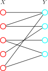
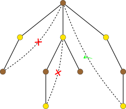

# 二分图 - OI Wiki

- Source: https://oi-wiki.org/graph/bi-graph/

# 二分图

## 引入

二分图，又称二部图，是一类结构特殊的图．它的顶点集可以划分为两个互不相交的子集，使得图中的每条边都连接这两个集合之间的一对点，而不会连接同一集合内部的点．

得益于这种简单的结构，二分图不仅展现出许多优雅的性质，也广泛应用于现实生活中的建模场景，例如任务分配、推荐系统、匹配市场等．许多在一般图上困难的优化问题，在二分图上都可以高效、准确地求解．

## 定义

如果图 𝐺 =(𝑉,𝐸)G=(V,E) 的顶点集 𝑉V 可以分为两个互不相交的子集 𝑋X 和 𝑌Y，使得每条边 𝑒 ∈𝐸e∈E 的两个端点都分别属于 𝑋X 和 𝑌Y，就称图 𝐺G 是一个 **二分图** （bipartite graph）．集合 𝑋X 和 𝑌Y 常称作它的两个 **部分** （part），或者分别称为二分图的左部和右部．当二分图的两个部分 𝑋X 和 𝑌Y 已知时，也可以用三元组 (𝑋,𝑌,𝐸)(X,Y,E) 来表示二分图 𝐺G．

一个典型的二分图如下图所示．



树、偶环、网格图等都是常见的二分图的例子．

## 刻画

二分图也可以由下列性质等价地定义：

  * 图 𝐺G 是可 2‑着色的．也就是说，可以用至多两种颜色给图的所有顶点染色，并且保证相邻顶点颜色不同．
  * 图 𝐺G 中不存在奇数长度的环．

很显然，第一条性质与二分图的定义等价：只需要将二分图的两个部分各染一种颜色就好了．

第二条性质稍微复杂一些．可以考虑用两种颜色尝试给图 𝐺G 染色．因为不同连通分量之间染色互不干扰，只需要逐个考虑连通分量就好了．任选连通分量中的一个顶点 𝑠s，进行 DFS，并记录连通分量中每个顶点 𝑣v 与 𝑠s 的距离．从 𝑠s 开始，在 DFS 生成树上进行归纳可知，如果存在一种可行的染色方法，一定是根据每个顶点 𝑣v 到起点 𝑠s 的距离的奇偶性分别染成两种颜色．



继而考虑那些不在生成树中的边．如果这些非树边的两个端点的颜色都不一样，就说明当前的染色方案可行；否则，就不存在可行的方案．进一步地，两个顶点颜色不同，当且仅当它们到树根 𝑠s 的距离一奇一偶，这又等价于加入该非树边形成的是一个偶环而非奇环．因此，只要没有奇环，这些非树边必然连接颜色不同的点，进而整张图都可以用两种颜色染色，图就一定是二分图．

## 判定

要判定一个图是不是二分图，只需要利用上述等价刻画，尝试给二分图染色即可．为此，可以使用 [DFS](../dfs/) 或者 [BFS](../bfs/) 来遍历这张图．如果发现了奇环，也就是出现无法染色的情况，那么就不是二分图；否则，就是二分图．

具体流程如下：

  * 遍历顶点，如果发现还没有染色的顶点，说明发现新的连通分量．
  * 任选一种颜色给该顶点染色，并以它为起点做 [DFS](../dfs/) 或者 [BFS](../bfs/)，尝试给该连通分量染色．
  * 遍历相邻的顶点时，如果发现已经染色的顶点，检查颜色是否与当前顶点相同．相同，则不是二分图，直接返回；否则，继续遍历．
  * 如果发现尚未染色的顶点，将尚未染色的顶点染上与当前顶点相反的颜色．

参考代码如下：

参考代码

```text 1 2 3 4 5 6 7 8 9 10 11 12 13 14 15 16 17 18 19 20 21 22 23 24 25 26 27 28 29 30 ``` |  ```text int n ; std :: vector < std :: vector < int >> gr ; std :: vector < int > colors , vis ; // Depth-first search to color vertices. bool dfs ( int cr ) { vis [ cr ] = true ; for ( int nt : gr [ cr ]) { if ( vis [ nt ]) { if ( colors [ cr ] == colors [ nt ]) return false ; } else { colors [ nt ] = colors [ cr ] ^ 1 ; if ( ! dfs ( nt )) return false ; } } return true ; } // Check whether the graph GR is bipartite. // If so, the vector COLORS will store a feasible coloring. bool check_bipartite () { for ( int i = 1 ; i <= n ; ++ i ) { // Check connected components one by one. if ( ! vis [ i ]) { colors [ i ] = 0 ; if ( ! dfs ( i )) return false ; } } return true ; } ```   
---|---  
  
时间复杂度为 𝑂(|𝑉| +|𝐸|)O(|V|+|E|)．

## 应用

由于结构简单，很多图论优化问题都可以在二分图上高效解决．详情参考相关主条目．

  * 极大团（平凡）
  * 最小点着色（平凡）
  * [最小边着色](../color/#二分图-vizing-定理的构造性证明)
  * [最大匹配](../graph-matching/bigraph-match/)
  * [最小边覆盖](../graph-matching/graph-match/#最小权边覆盖)
  * [最小点覆盖](../graph-matching/bigraph-match/#二分图最小点覆盖)
  * [最大独立集](../graph-matching/bigraph-match/#二分图最大独立集)
  * [最大权匹配](../graph-matching/bigraph-weight-match/)
  * [二分图博弈](../../math/game-theory/impartial-game/#二分图博弈)

* * *

>  __本页面最近更新： 2026/1/7 08:56:54，[更新历史](https://github.com/OI-wiki/OI-wiki/commits/master/docs/graph/bi-graph.md)  
>  __发现错误？想一起完善？[在 GitHub 上编辑此页！](https://oi-wiki.org/edit-landing/?ref=/graph/bi-graph.md "edit.link.title")  
>  __本页面贡献者：[ZerQAQ](https://github.com/ZerQAQ), [Ir1d](https://github.com/Ir1d), [StudyingFather](https://github.com/StudyingFather), [H-J-Granger](https://github.com/H-J-Granger), [countercurrent-time](https://github.com/countercurrent-time), [NachtgeistW](https://github.com/NachtgeistW), [c-forrest](https://github.com/c-forrest), [CCXXXI](https://github.com/CCXXXI), [Enter-tainer](https://github.com/Enter-tainer), [AngelKitty](https://github.com/AngelKitty), [cjsoft](https://github.com/cjsoft), [diauweb](https://github.com/diauweb), [Early0v0](https://github.com/Early0v0), [ezoixx130](https://github.com/ezoixx130), [GekkaSaori](https://github.com/GekkaSaori), [Konano](https://github.com/Konano), [LovelyBuggies](https://github.com/LovelyBuggies), [Makkiy](https://github.com/Makkiy), [mgt](mailto:i@margatroid.xyz), [minghu6](https://github.com/minghu6), [P-Y-Y](https://github.com/P-Y-Y), [PotassiumWings](https://github.com/PotassiumWings), [SamZhangQingChuan](https://github.com/SamZhangQingChuan), [sshwy](https://github.com/sshwy), [Suyun514](mailto:suyun514@qq.com), [Tiphereth-A](https://github.com/Tiphereth-A), [weiyong1024](https://github.com/weiyong1024), [GavinZhengOI](https://github.com/GavinZhengOI), [Gesrua](https://github.com/Gesrua), [HeRaNO](https://github.com/HeRaNO), [kxccc](https://github.com/kxccc), [lychees](https://github.com/lychees), [mcendu](https://github.com/mcendu), [nirobcsilsol](https://github.com/nirobcsilsol), [ouuan](https://github.com/ouuan), [Peanut-Tang](https://github.com/Peanut-Tang), [SukkaW](https://github.com/SukkaW), [vincent-163](https://github.com/vincent-163), [Xeonacid](https://github.com/Xeonacid)  
>  __本页面的全部内容在**[CC BY-SA 4.0](https://creativecommons.org/licenses/by-sa/4.0/deed.zh) 和 [SATA](https://github.com/zTrix/sata-license)** 协议之条款下提供，附加条款亦可能应用
