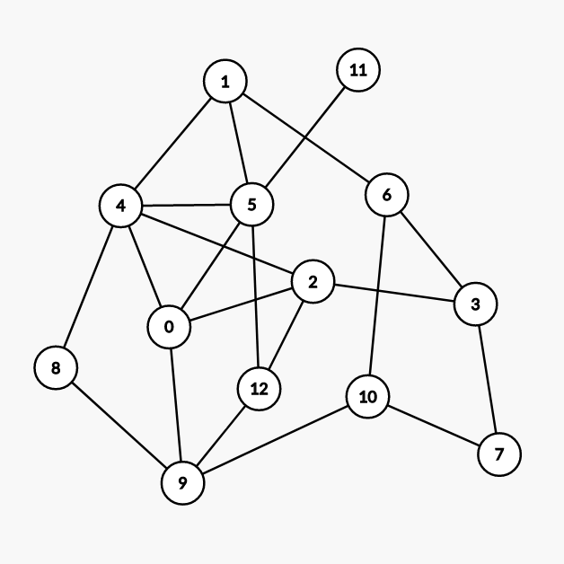
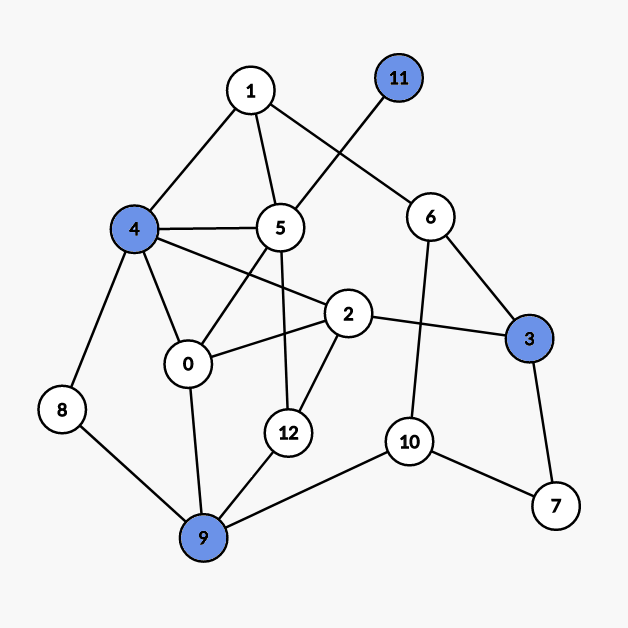
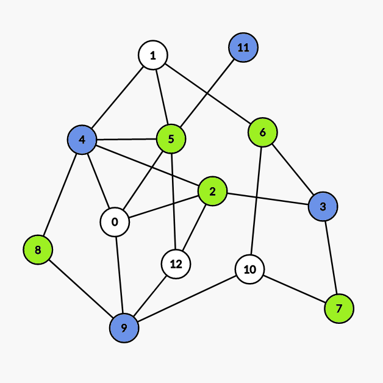
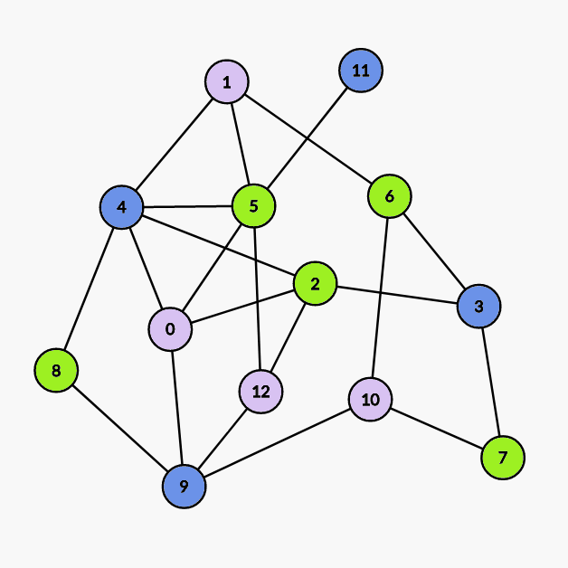

# 图的着色 - OI Wiki

- Source: https://oi-wiki.org/graph/color/

# 图的着色

## 点着色

（讨论的是无自环无向图）

对无向图顶点着色，且相邻顶点不能同色．若 G 是 𝑘k\- 可着色的，但不是 (𝑘 −1)(k−1)\- 可着色的，则称 k 是 G 的色数，记为 𝜒(𝐺)χ(G)．

对任意图 G，有 𝜒(𝐺) ≤Δ(𝐺) +1χ(G)≤Δ(G)+1，其中 Δ(𝐺)Δ(G) 为最大度．

### Brooks 定理

设连通图不是完全图也不是奇圈，则 𝜒(𝐺) ≤Δ(𝐺)χ(G)≤Δ(G)．

#### 证明

证明

设 |𝑉(𝐺)| =𝑛|V(G)|=n，考虑数学归纳法．

首先，𝑛 ≤3n≤3 时，命题显然成立．

接下来，假设对于 𝑛 −1n−1 时的命题成立，下面我们要逐步强化命题．

不妨只考虑 Δ(𝐺)Δ(G)\- 正则图，因为对于非正则图来说，可以看作在正则图里删去一些边构成的，而这一过程并不会影响结论．

对于任意不是完全图也不是奇圈的正则图 G，任取其中一点 v，考虑子图 𝐻 :=𝐺 −𝑣H:=G−v，由归纳假设知 𝜒(𝐻) ≤Δ(𝐻) =Δ(𝐺)χ(H)≤Δ(H)=Δ(G)，接下来我们只需证明在 H 中插入 v 不会影响结论即可．

令 Δ :=Δ(𝐺)Δ:=Δ(G)，设 H 染的 ΔΔ 种颜色分别为 𝑐1,𝑐2,…,𝑐Δc1,c2,…,cΔ，v 的 ΔΔ 个邻接点为 𝑣1,𝑣1,…,𝑣Δv1,v1,…,vΔ．不妨假设 v 的这些邻接点颜色两两不同，否则命题得证．

接下来我们设所有在 H 中染成 𝑐𝑖ci 或 𝑐𝑗cj 的点以及它们之间的所有边构成子图 𝐻𝑖,𝑗Hi,j．不妨假设任意 2 个不同的点 𝑣𝑖vi，𝑣𝑗vj 一定在 𝐻𝑖,𝑗Hi,j 的同一个连通分量中，否则若在两个连通分量中的话，可以交换其中一个连通分量所有点的颜色，从而 𝑣𝑖vi，𝑣𝑗vj 颜色相同．

> 这里的交换颜色指的是若图中只有两种颜色 a，b，那么把图中原来染成颜色 a 的点全部染成颜色 b，把图中原来染成颜色 b 的点全部染成颜色 a．

我们设上述连通分量为 𝐶𝑖,𝑗Ci,j，那么 𝐶𝑖,𝑗Ci,j 一定只能是 𝑣𝑖vi 到 𝑣𝑗vj 的路．因为 𝑣𝑖vi 在 H 中的度为 Δ −1Δ−1，所以 𝑣𝑖vi 在 H 中的邻接点颜色一定两两不同，否则可以给 𝑣𝑖vi 染别的颜色，从而和 v 的其他邻接点颜色重复，所以 𝑣𝑖vi 在 𝐶𝑖,𝑗Ci,j 中邻接点数量为 1，𝑣𝑗vj 同理．然后我们在 𝐶𝑖,𝑗Ci,j 中取一条 𝑣𝑖vi 到 𝑣𝑗vj 的路，令其为 P，若 𝐶𝑖,𝑗 ≠𝑃Ci,j≠P，那么我们沿着 P 顺次给路上的点染色，设遇到的第一个度数大于 2 的点为 u，注意到 u 的邻接点最多只用了 Δ −2Δ−2 种颜色，所以 u 可以重新染色，从而使 𝑣𝑖vi，𝑣𝑗vj 不连通．

然后我们不难发现，对任意 3 个不同的点 𝑣𝑖vi，𝑣𝑗vj，𝑣𝑘vk，𝑉(𝐶𝑖,𝑗) ∩𝑉(𝐶𝑗,𝑘) ={𝑣𝑗}V(Ci,j)∩V(Cj,k)={vj}．

到这里我们对命题的强化工作就已经做完了．

接下来就很简单．首先，如果 v 的邻接点两两相邻，那么命题得证．不妨设 𝑣1v1，𝑣2v2 不相邻，在 𝐶1,2C1,2 中取 𝑣1v1 的邻接点 w，交换 𝐶1,3C1,3 中的颜色．得到的新图中，𝑤 ∈𝑉(𝐶1,2) ∩𝑉(𝐶2,3)w∈V(C1,2)∩V(C2,3)，矛盾．

至此命题证明完毕．

### Welsh–Powell 算法

Welsh–Powell 算法是一种在 **不限制最大着色数** 时寻找着色方案的贪心算法．

对于无自环无向图 G，设 𝑉(𝐺) :={𝑣1,𝑣2,…,𝑣𝑛}V(G):={v1,v2,…,vn} 满足．

deg⁡(𝑣𝑖) ≥deg⁡(𝑣𝑖+1), ∀1 ≤𝑖 ≤𝑛 −1deg⁡(vi)≥deg⁡(vi+1), ∀1≤i≤n−1

按 Welsh–Powell 算法着色后的颜色数至多为 max𝑛𝑖=1min{deg⁡(𝑣𝑖) +1,𝑖}maxi=1nmin{deg⁡(vi)+1,i}, 该算法的时间复杂度为 𝑂(𝑛max𝑛𝑖=1min{deg⁡(𝑣𝑖)+1,𝑖}) =𝑂(𝑛2)O(nmaxi=1nmin{deg⁡(vi)+1,i})=O(n2)．

#### 过程

  1. 将当前未着色的点按度数降序排列．
  2. 将第一个点染成一个未被使用的颜色．
  3. 顺次遍历接下来的点，若当前点和所有与第一个点颜色 **相同** 的点 **不相邻** ，则将该点染成与第一个点相同的颜色．
  4. 若仍有未着色的点，则回到步骤 1, 否则结束．

示例如下：



（由 [Graph Editor](https://csacademy.com/app/graph_editor/) 生成）

我们先对点按度数降序排序，得：

次序| 1| 2| 3| 4| 5| 6| 7| 8| 9| 10| 11| 12| 13  
---|---|---|---|---|---|---|---|---|---|---|---|---|---  
点的编号| 4| 5| 0| 2| 9| 1| 3| 6| 10| 12| 7| 8| 11  
度数| 5| 5| 4| 4| 4| 3| 3| 3| 3| 3| 2| 2| 1  
min{deg⁡(𝑣𝑖) +1,𝑖}min{deg⁡(vi)+1,i}| 1| 2| 3| 4| 5| 4| 4| 4| 4| 4| 3| 3| 2  
  
所以 Welsh–Powell 算法着色后的颜色数最多为 5．

另外因为该图有子图 𝐶3C3, 所以色数一定大于等于 3．

  * 第一次染色：



染 `4 9 3 11` 号点． - 第二次染色：



染 `5 2 6 7 8` 号点． - 第三次染色：



染 `0 1 10 12` 号点．

#### 证明

证明

对于无自环无向图 G，设 𝑉(𝐺) :={𝑣1,𝑣2,…,𝑣𝑛}V(G):={v1,v2,…,vn} 满足

deg⁡(𝑣𝑖) ≥deg⁡(𝑣𝑖+1), ∀1 ≤𝑖 ≤𝑛 −1deg⁡(vi)≥deg⁡(vi+1), ∀1≤i≤n−1

令 𝑉0 =∅V0=∅, 我们取 𝑉(𝐺) ∖⋃𝑚−1𝑖=0𝑉𝑖V(G)∖⋃i=0m−1Vi 中的子集 𝑉𝑚Vm, 其中的元素满足

  1. 𝑣𝑘𝑚 ∈𝑉𝑚vkm∈Vm, 其中 𝑘𝑚 =min{𝑘 :𝑣𝑘 ∉⋃𝑚−1𝑖=0𝑉𝑖}km=min{k:vk∉⋃i=0m−1Vi}
  2. 若

{𝑣𝑖𝑚,1,𝑣𝑖𝑚,2,…,𝑣𝑖𝑚,𝑙𝑚} ⊂𝑉𝑚, 𝑖𝑚,1 <𝑖𝑚,2 <⋯ <𝑖𝑚,𝑙𝑚{vim,1,vim,2,…,vim,lm}⊂Vm, im,1<im,2<⋯<im,lm

则 𝑣𝑗 ∈𝑉𝑚vj∈Vm 当且仅当

     1. 𝑗 >𝑖𝑚,𝑙𝑚j>im,lm
     2. 𝑣𝑗vj 与 𝑣𝑖𝑚,1,𝑣𝑖𝑚,2,…,𝑣𝑖𝑚,𝑙𝑚vim,1,vim,2,…,vim,lm 均不相邻

显然若将 𝑉𝑖Vi 中的点染成第 i 种颜色，则该染色方案即为 Welsh–Powell 算法给出的方案，显然有

  * 𝑉1 ≠∅V1≠∅
  * 𝑉𝑖 ∩𝑉𝑗 =∅ ⟺ 𝑖 ≠𝑗Vi∩Vj=∅⟺i≠j
  * ∃𝛼(𝐺) ∈ℕ∗,∀𝑖 >𝛼(𝐺), 𝑠.𝑡. 𝑉𝑖 =∅∃α(G)∈N∗,∀i>α(G), s.t. Vi=∅

我们只需要证明：

⋃𝛼(𝐺)𝑖=1𝑉𝑖 =𝑉(𝐺)⋃i=1α(G)Vi=V(G)

其中

𝜒(𝐺) ≤𝛼(𝐺) ≤max𝑛𝑖=1min{deg⁡(𝑣𝑖) +1,𝑖}χ(G)≤α(G)≤maxi=1nmin{deg⁡(vi)+1,i}

上式左边的不等号显然成立，我们考虑右边．

首先我们不难得出：

若 𝑣 ∉⋃𝑚𝑖=1𝑉𝑖v∉⋃i=1mVi，则 v 与 𝑉1,𝑉2,…,𝑉𝑚V1,V2,…,Vm 中分别至少有一个点相邻，从而有 deg⁡(𝑣) ≥𝑚deg⁡(v)≥m

进而

𝑣𝑗 ∈⋃deg⁡(𝑣𝑗)+1𝑖=1𝑉𝑖vj∈⋃i=1deg⁡(vj)+1Vi

另一方面，基于序列 {𝑉𝑖}{Vi} 的构造方法，我们不难发现

𝑣𝑗 ∈⋃𝑗𝑖=1𝑉𝑖vj∈⋃i=1jVi

两式结合即得证．

## 边着色

对无向图的边着色，要求相邻的边涂不同种颜色．若 G 是 k- 边可着色的，但不是 (𝑘 −1)(k−1)\- 边可着色的，则称 k 是 G 的边色数，记为 𝜒′(𝐺)χ′(G)．

### Vizing 定理

设 G 是简单图，则 Δ(𝐺) ≤𝜒′(𝐺) ≤Δ(𝐺) +1Δ(G)≤χ′(G)≤Δ(G)+1

若 G 是二部图，则 𝜒′(𝐺) =Δ(𝐺)χ′(G)=Δ(G)

当 𝑛n 为奇数（𝑛 ≠1n≠1）时，𝜒′(𝐾𝑛) =𝑛χ′(Kn)=n; 当 𝑛n 为偶数时，𝜒′(𝐾𝑛) =𝑛 −1χ′(Kn)=n−1

### 二分图 Vizing 定理的构造性证明

证明

按照顺序在二分图中加边．

我们在尝试加入边 (𝑥,𝑦)(x,y) 的时候，我们尝试寻找对于 𝑥x 和 𝑦y 的编号最小的尚未被使用过的颜色，假设分别为 𝑙𝑥lx 和 𝑙𝑦ly．

如果 𝑙𝑥 =𝑙𝑦lx=ly 此时我们可以直接将这条边的颜色设置为 𝑙𝑥lx．

否则假设 𝑙𝑥 <𝑙𝑦lx<ly, 我们可以尝试将节点 𝑦y 连出去的颜色为 𝑙𝑥lx 的边的颜色修改为 𝑙𝑦ly．

修改的过程可以被近似的看成是一条从 𝑦y 出发，依次经过颜色为 𝑙𝑥,𝑙𝑦,⋯lx,ly,⋯ 的边的有限唯一增广路．

因为增广路有限所以我们可以将增广路上所有的边反色，即原来颜色为 𝑙𝑥lx 的修改为 𝑙𝑦ly，原来颜色为 𝑙𝑦ly 的修改为 𝑙𝑥lx．

根据二分图的性质，节点 𝑥x 不可能为增广路节点，否则与最小未使用颜色为 𝑙𝑥lx 矛盾．

所以我们可以在增广之后直接将连接 𝑥x 和 𝑦y 的边的颜色设为 𝑙𝑥lx．

总构造时间复杂度为 𝑂(𝑛𝑚)O(nm)．

示例代码 [UVa10615 Rooks](https://onlinejudge.org/index.php?option=com_onlinejudge&Itemid=8&category=18&page=show_problem&problem=1556)

```text 1 2 3 4 5 6 7 8 9 10 11 12 13 14 15 16 17 18 19 20 21 22 23 24 25 26 27 28 29 30 31 32 33 34 35 36 37 38 39 40 41 42 43 44 45 46 47 48 49 50 51 52 53 54 55 56 57 58 59 60 61 62 63 64 65 66 67 68 69 70 71 72 73 74 75 76 77 78 79 80 81 82 83 84 85 86 87 88 89 90 91 92 93 94 95 96 97 98 99 100 101 102 103 104 105 106 107 108 109 110 111 112 113 114 115 116 117 118 119 120 121 122 123 ``` |  ```text #include <iostream> constexpr int MAXN = 100 ; int t ; int n ; char a [ MAXN \+ 10 ][ MAXN \+ 10 ]; int c [ MAXN \+ 10 ][ MAXN \+ 10 ]; int ans ; namespace graph { struct Vertex { int head ; int deg ; int vis [ MAXN \+ 10 ]; } vertex [ 2 * MAXN \+ 10 ], e ; struct Edge { int head ; int next ; int col ; } edge [ 2 * MAXN * MAXN \+ 10 ]; int ecnt ; void init () { for ( int i = 0 ; i < MAXN \+ 10 ; i ++ ) std :: fill ( c [ i ], c [ i ] \+ MAXN \+ 10 , 0 ); for ( int i = 1 ; i <= 2 * MAXN ; i ++ ) vertex [ i ] = e ; for ( int i = 0 ; i <= 2 * MAXN * MAXN ; i ++ ) edge [ i ]. col = 0 ; ecnt = 1 ; ans = 0 ; return ; } void addEdge ( int tail , int head ) { ecnt ++ ; edge [ ecnt ]. head = head ; edge [ ecnt ]. next = vertex [ tail ]. head ; vertex [ tail ]. head = ecnt ; vertex [ tail ]. deg ++ ; return ; } int get ( int u ) { for ( int i = 1 ; i <= n ; i ++ ) if ( ! vertex [ u ]. vis [ i ]) return i ; exit ( 1 ); } void DFS ( int u , int ori , int upd ) { if ( vertex [ u ]. vis [ ori ] == 0 ) { vertex [ u ]. vis [ upd ] = 0 ; return ; } int e = vertex [ u ]. vis [ ori ]; int v = edge [ e ]. head ; DFS ( v , upd , ori ); edge [ e ]. col = upd ; edge [ e ^ 1 ]. col = upd ; vertex [ u ]. vis [ upd ] = e ; vertex [ v ]. vis [ upd ] = e ^ 1 ; return ; } void AddEdge ( int u , int v ) { addEdge ( u , v ); addEdge ( v , u ); return ; } void solve () { for ( int u = 1 ; u <= n ; u ++ ) { for ( int e = vertex [ u ]. head ; e ; e = edge [ e ]. next ) { int v = edge [ e ]. head ; if ( edge [ e ]. col ) continue ; int lu = get ( u ); int lv = get ( v ); if ( lu < lv ) DFS ( v , lu , lv ); if ( lu > lv ) DFS ( u , lv , lu ); int l = std :: min ( lu , lv ); vertex [ u ]. vis [ l ] = e ; vertex [ v ]. vis [ l ] = e ^ 1 ; edge [ e ]. col = l ; edge [ e ^ 1 ]. col = l ; } } } void generate () { for ( int u = 1 ; u <= n ; u ++ ) { for ( int e = vertex [ u ]. head ; e ; e = edge [ e ]. next ) { int v = edge [ e ]. head ; c [ u ][ v \- n ] = edge [ e ]. col ; } } return ; } } // namespace graph void mian () { graph :: init (); std :: cin >> n ; for ( int i = 1 ; i <= n ; i ++ ) for ( int j = 1 ; j <= n ; j ++ ) std :: cin >> a [ i ][ j ]; for ( int i = 1 ; i <= n ; i ++ ) for ( int j = 1 ; j <= n ; j ++ ) if ( a [ i ][ j ] == '*' ) graph :: AddEdge ( i , j \+ n ); for ( int i = 1 ; i <= n * 2 ; i ++ ) ans = std :: max ( ans , graph :: vertex [ i ]. deg ); graph :: solve (); graph :: generate (); std :: cout << ans << '\n' ; for ( int i = 1 ; i <= n ; i ++ ) { for ( int j = 1 ; j <= n ; j ++ ) std :: cout << c [ i ][ j ] << ' ' ; std :: cout << '\n' ; } return ; } int main () { std :: cin >> t ; while ( t \-- ) mian (); return 0 ; } ```   
---|---  
  
一道很不简单的例题 [uoj 444 二分图](https://uoj.ac/problem/444)

本题为笔者于 2018 年命制的集训队第一轮作业题．

首先我们可以发现答案下界为度数不为 k 倍数的点的个数．

下界的构造方法是对二分图进行拆点．

若 𝑑𝑒𝑔𝑟𝑒𝑒mod𝑘 ≠0degreemodk≠0, 我们将其拆为 𝑑𝑒𝑔𝑟𝑒𝑒/𝑘degree/k 个度数为 k 的节点和一个度数为 𝑑𝑒𝑔𝑟𝑒𝑒mod𝑘degreemodk 的节点．

若 𝑑𝑒𝑔𝑟𝑒𝑒mod𝑘 =0degreemodk=0, 我们将其拆为 𝑑𝑒𝑔𝑟𝑒𝑒/𝑘degree/k 个度数为 k 的节点．

拆出来的点在原图中的意义相同，也就是说，在满足度数限制的情况下，一条边端点可以连接任意一个拆出来的点．

根据 Vizing 定理，我们显然可以构造出该图的一种 k 染色方案．

删边部分由于和 Vizing 定理关系不大这里不再展开．

有兴趣的读者可以自行阅读笔者当时写的题解．

## 色多项式

𝑃(𝐺,𝑘)P(G,k) 表示 G 的不同 k 着色方式的总数．

𝑃(𝐾𝑛,𝑘) =𝑘(𝑘 −1)⋯(𝑘 −𝑛 +1)P(Kn,k)=k(k−1)⋯(k−n+1)

𝑃(𝑁𝑛,𝑘) =𝑘𝑛P(Nn,k)=kn

在无向无环图 G 中，

  1. 𝑒 =(𝑣𝑖,𝑣𝑗) ∉𝐸(𝐺)e=(vi,vj)∉E(G)，则 𝑃(𝐺,𝑘) =𝑃(𝐺 ∪𝑒,𝑘) +𝑃(𝐺 ∖𝑒,𝑘)P(G,k)=P(G∪e,k)+P(G∖e,k)
  2. 𝑒 =(𝑣𝑖,𝑣𝑗) ∈𝐸(𝐺)e=(vi,vj)∈E(G)，则 𝑃(𝐺,𝑘) =𝑃(𝐺 −𝑒,𝑘) −𝑃(𝐺 ∖𝑒,𝑘)P(G,k)=P(G−e,k)−P(G∖e,k)

定理：设 𝑉1V1 是 G 的点割集，且 𝐺[𝑉1]G[V1] 是 G 的 |𝑉1||V1| 阶完全子图，𝐺 −𝑉1G−V1 有 𝑝(𝑝 ≥2)p(p≥2) 个连通分支，则：

𝑃(𝐺,𝑘) =Π𝑝𝑖=1(𝑃(𝐻𝑖,𝑘))𝑃(𝐺[𝑉1],𝑘)𝑝−1P(G,k)=Πi=1p(P(Hi,k))P(G[V1],k)p−1

其中 𝐻𝑖 =𝐺[𝑉1 ∪𝑉(𝐺𝑖)]Hi=G[V1∪V(Gi)]

## 参考资料

  1. [Graph coloring - Wikipedia](https://en.wikipedia.org/wiki/Graph_coloring)
  2. Welsh, D. J. A.; Powell, M. B. (1967), "[An upper bound for the chromatic number of a graph and its application to timetabling problems](https://doi.org/10.1093%2Fcomjnl%2F10.1.85)", The Computer Journal, 10 (1): 85–86

* * *

>  __本页面最近更新： 2026/1/7 08:56:54，[更新历史](https://github.com/OI-wiki/OI-wiki/commits/master/docs/graph/color.md)  
>  __发现错误？想一起完善？[在 GitHub 上编辑此页！](https://oi-wiki.org/edit-landing/?ref=/graph/color.md "edit.link.title")  
>  __本页面贡献者：[Tiphereth-A](https://github.com/Tiphereth-A), [zhouyuyang2002](https://github.com/zhouyuyang2002), [c-forrest](https://github.com/c-forrest), [Chrogeek](https://github.com/Chrogeek), [CoderOJ](https://github.com/CoderOJ), [Enter-tainer](https://github.com/Enter-tainer), [iamtwz](https://github.com/iamtwz), [ImpleLee](https://github.com/ImpleLee), [Ir1d](https://github.com/Ir1d), [lyccrius](https://github.com/lyccrius), [ouuan](https://github.com/ouuan)  
>  __本页面的全部内容在**[CC BY-SA 4.0](https://creativecommons.org/licenses/by-sa/4.0/deed.zh) 和 [SATA](https://github.com/zTrix/sata-license)** 协议之条款下提供，附加条款亦可能应用
