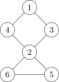
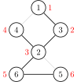
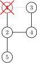
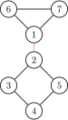

# 割点和桥 - OI Wiki

- Source: https://oi-wiki.org/graph/cut/

# 割点和桥

相关阅读：[双连通分量](../bcc/)

割点和桥更严谨的定义参见 [图论相关概念](../concept/)．

## 割点

> 对于一个无向图，如果把一个点删除后这个图的极大连通分量数增加了，那么这个点就是这个图的割点（又称割顶）．

### 过程

如果我们尝试删除每个点，并且判断这个图的连通性，那么复杂度会特别的高．所以要介绍一个常用的算法：Tarjan．

首先，我们上一个图：



很容易的看出割点是 2，而且这个图仅有这一个割点．

首先，我们按照 DFS 序给他打上时间戳（访问的顺序）．



这些信息被我们保存在一个叫做 `dfn` 的数组中．

还需要另外一个数组 `low`，用它来存储不经过其父亲能到达的最小的时间戳．

例如 `low[2]` 是 1，`low[5]` 和 `low[6]` 是 3．

然后我们开始 DFS，我们判断某个点是否是割点的根据是：对于某个顶点 𝑢u，如果存在至少一个顶点 𝑣v（𝑢u 的儿子），使得 𝑙𝑜𝑤𝑣 ≥𝑑𝑓𝑛𝑢lowv≥dfnu，即不能回到祖先，那么 𝑢u 点为割点．

此根据惟独不适用于搜索的起始点，其需要特殊考虑：若该点不是割点，则其他路径亦能到达全部结点，因此从起始点只「向下搜了一次」，即在搜索树内仅有一个子结点．如果在搜索树内有两个及以上的儿子，那么他一定是割点了（设想上图从 2 开始搜索，搜索树内应有两个子结点：3 或 4 及 5 或 6）．如果只有一个儿子，那么把它删掉，不会有任何的影响．比如下面这个图，此处形成了一个环．



我们在访问 1 的儿子时候，假设先 DFS 到了 2，然后标记用过，然后递归往下，来到了 4，4 又来到了 3，当递归回溯的时候，会发现 3 已经被访问过了，所以不是割点．

更新 `low` 的伪代码如下：

1𝐢𝐟 𝑣 is a son of 𝑢2low𝑢=min(low𝑢,low𝑣)3𝐞𝐥𝐬𝐞4low𝑢=min(low𝑢,dfn𝑣)1if v is a son of u2lowu=min(lowu,lowv)3else4lowu=min(lowu,dfnv)

### 例题

[洛谷 P3388【模板】割点（割顶）](https://www.luogu.com.cn/problem/P3388)

例题代码

```text 1 2 3 4 5 6 7 8 9 10 11 12 13 14 15 16 17 18 19 20 21 22 23 24 25 26 27 28 29 30 31 32 33 34 35 36 37 38 39 40 41 42 43 44 45 46 47 48 49 50 51 52 53 54 55 56 57 58 ``` |  ```text /* 洛谷 P3388 【模板】割点（割顶） */ #include <iostream> #include <vector> using namespace std ; int n , m ; // n：点数 m：边数 int dfn [ 100001 ], low [ 100001 ], idx , res ; // dfn：记录每个点的时间戳 // low：能不经过父亲到达最小的编号，idx：时间戳，res：答案数量 bool vis [ 100001 ], flag [ 100001 ]; // flag: 答案 vis：标记是否重复 vector < int > edge [ 100001 ]; // 存图用的 void Tarjan ( int u , int fa ) { // u 当前点的编号，fa 自己爸爸的编号 vis [ u ] = true ; // 标记 low [ u ] = dfn [ u ] = ++ idx ; // 打上时间戳 int child = 0 ; // 每一个点儿子数量 for ( const auto & v : edge [ u ]) { // 访问这个点的所有邻居 （C++11） if ( ! vis [ v ]) { child ++ ; // 多了一个儿子 Tarjan ( v , u ); // 继续 low [ u ] = min ( low [ u ], low [ v ]); // 更新能到的最小节点编号 if ( fa != u && low [ v ] >= dfn [ u ] && ! flag [ u ]) { // 主要代码 // 如果不是自己，且不通过父亲返回的最小点符合割点的要求，并且没有被标记过 // 要求即为：删了父亲连不上去了，即为最多连到父亲 flag [ u ] = true ; res ++ ; // 记录答案 } } else if ( v != fa ) { // 如果这个点不是自己的父亲，更新能到的最小节点编号 low [ u ] = min ( low [ u ], dfn [ v ]); } } // 主要代码，自己的话需要 2 个儿子才可以 if ( fa == u && child >= 2 && ! flag [ u ]) { flag [ u ] = true ; res ++ ; // 记录答案 } } int main () { cin >> n >> m ; // 读入数据 for ( int i = 1 ; i <= m ; i ++ ) { // 注意点是从 1 开始的 int x , y ; cin >> x >> y ; edge [ x ]. push_back ( y ); edge [ y ]. push_back ( x ); } // 使用 vector 存图 for ( int i = 1 ; i <= n ; i ++ ) // 因为 Tarjan 图不一定连通 if ( ! vis [ i ]) { idx = 0 ; // 时间戳初始为 0 Tarjan ( i , i ); // 从第 i 个点开始，父亲为自己 } cout << res << endl ; for ( int i = 1 ; i <= n ; i ++ ) if ( flag [ i ]) cout << i << " " ; // 输出结果 return 0 ; } ```   
---|---  
  
## 割边（无重边时）

和割点差不多，叫做桥．

> 对于一个无向图，如果删掉一条边后图中的连通分量数增加了，则称这条边为桥或者割边．严谨来说，就是：假设有连通图 𝐺 ={𝑉,𝐸}G={V,E}，𝑒e 是其中一条边（即 𝑒 ∈𝐸e∈E），如果 𝐺 −𝑒G−e 是不连通的，则边 𝑒e 是图 𝐺G 的一条割边（桥）．

比如说，下图中，



红色的边就是割边．

### 过程

和割点差不多，只要改一处：𝑙𝑜𝑤𝑣 >𝑑𝑓𝑛𝑢lowv>dfnu 就可以了，而且不需要考虑根节点的问题．

割边是和是不是根节点没关系的，原来我们求割点的时候是指点 𝑣v 是不可能不经过父节点 𝑢u 为回到祖先节点（包括父节点），所以顶点 𝑢u 是割点．如果 𝑙𝑜𝑤𝑣 =𝑑𝑓𝑛𝑢lowv=dfnu 表示还可以回到父节点，如果顶点 𝑣v 不能回到祖先也没有另外一条回到父亲的路，那么 𝑢 −𝑣u−v 这条边就是割边．

### 实现

下面代码实现了对 **无重边** 的无向图求割边，其中，当 `isbridge[x]` 为真时，`(father[x],x)` 为一条割边．

C++Python

```text 1 2 3 4 5 6 7 8 9 10 11 12 13 14 15 16 17 18 19 20 21 22 ``` |  ```text int low [ MAXN ], dfn [ MAXN ], idx ; bool isbridge [ MAXN ]; vector < int > G [ MAXN ]; int cnt_bridge ; int father [ MAXN ]; void tarjan ( int u , int fa ) { father [ u ] = fa ; low [ u ] = dfn [ u ] = ++ idx ; for ( const auto & v : G [ u ]) { if ( ! dfn [ v ]) { tarjan ( v , u ); low [ u ] = min ( low [ u ], low [ v ]); if ( low [ v ] > dfn [ u ]) { isbridge [ v ] = true ; ++ cnt_bridge ; } } else if ( v != fa ) { low [ u ] = min ( low [ u ], dfn [ v ]); } } } ```   
---|---  
  
```text 1 2 3 4 5 6 7 8 9 10 11 12 13 14 15 16 17 18 19 20 21 22 23 ``` |  ```text low = [ 0 ] * MAXN dfn = [ 0 ] * MAXN idx = 0 isbridge = [ False ] * MAXN G = [[ 0 for i in range ( MAXN )] for j in range ( MAXN )] cnt_bridge = 0 father = [ 0 ] * MAXN def tarjan ( u , fa ): father [ u ] = fa idx = idx \+ 1 low [ u ] = dfn [ u ] = idx for i in range ( 0 , len ( G [ u ])): v = G [ u ][ i ] if dfn [ v ] == False : tarjan ( v , u ) low [ u ] = min ( low [ u ], low [ v ]) if low [ v ] > dfn [ u ]: isbridge [ v ] = True cnt_bridge = cnt_bridge \+ 1 elif v != fa : low [ u ] = min ( low [ u ], dfn [ v ]) ```   
---|---  
  
## 割边（有重边时）

然而，上述无重边时的做法在有重边的无向图上是有问题的．

因为两节点间可能不止有一条边，此时它们都不会是桥．

### 过程

一种思路是将参数 `fa` 改为刚刚走过的边的编号（每条边的编号一致）即可，即将「不用父节点更新」改为「不用来时的边更新」．

另一种更简单的思路是设立一个标记判断是否已有一条边抵达父节点，标记后再访问到父节点时正常更新．

下面代码实现了对可能 **有重边** 的无向图求割边．

C++

```text 1 2 3 4 5 6 7 8 9 10 11 12 13 14 15 16 17 18 19 20 21 22 23 24 25 26 ``` |  ```text int low [ MAXN ], dfn [ MAXN ], idx ; bool isbridge [ MAXN ]; vector < int > G [ MAXN ]; int cnt_bridge ; int father [ MAXN ]; void tarjan ( int u , int fa ) { bool flag = false ; father [ u ] = fa ; low [ u ] = dfn [ u ] = ++ idx ; for ( const auto & v : G [ u ]) { if ( ! dfn [ v ]) { tarjan ( v , u ); low [ u ] = min ( low [ u ], low [ v ]); if ( low [ v ] > dfn [ u ]) { isbridge [ v ] = true ; ++ cnt_bridge ; } } else { if ( v != fa || flag ) low [ u ] = min ( low [ u ], dfn [ v ]); else flag = true ; } } } ```   
---|---  
  
## 练习

  * [P3388【模板】割点（割顶）](https://www.luogu.com.cn/problem/P3388)
  * [POJ2117 Electricity](http://poj.org/problem?id=2117)
  * [HDU4738 Caocao's Bridges](https://acm.hdu.edu.cn/showproblem.php?pid=4738)
  * [HDU2460 Network](https://acm.hdu.edu.cn/showproblem.php?pid=2460)
  * [POJ1523 SPF](http://poj.org/problem?id=1523)

Tarjan 算法还有许多用途，常用的例如求强连通分量，缩点，还有求 2-SAT 的用途等．

* * *

>  __本页面最近更新： 2026/1/7 08:56:54，[更新历史](https://github.com/OI-wiki/OI-wiki/commits/master/docs/graph/cut.md)  
>  __发现错误？想一起完善？[在 GitHub 上编辑此页！](https://oi-wiki.org/edit-landing/?ref=/graph/cut.md "edit.link.title")  
>  __本页面贡献者：[Ir1d](https://github.com/Ir1d), [sshwy](https://github.com/sshwy), [StudyingFather](https://github.com/StudyingFather), [H-J-Granger](https://github.com/H-J-Granger), [countercurrent-time](https://github.com/countercurrent-time), [Enter-tainer](https://github.com/Enter-tainer), [GavinZhengOI](https://github.com/GavinZhengOI), [NachtgeistW](https://github.com/NachtgeistW), [ouuan](https://github.com/ouuan), [Planet6174](https://github.com/Planet6174), [Tiphereth-A](https://github.com/Tiphereth-A), [0xis-cn](https://github.com/0xis-cn), [AngelKitty](https://github.com/AngelKitty), [CCXXXI](https://github.com/CCXXXI), [cjsoft](https://github.com/cjsoft), [diauweb](https://github.com/diauweb), [Early0v0](https://github.com/Early0v0), [ezoixx130](https://github.com/ezoixx130), [GekkaSaori](https://github.com/GekkaSaori), [Henry-ZHR](https://github.com/Henry-ZHR), [iamtwz](https://github.com/iamtwz), [Konano](https://github.com/Konano), [LovelyBuggies](https://github.com/LovelyBuggies), [Makkiy](https://github.com/Makkiy), [Marcythm](https://github.com/Marcythm), [mgt](mailto:i@margatroid.xyz), [minghu6](https://github.com/minghu6), [P-Y-Y](https://github.com/P-Y-Y), [PotassiumWings](https://github.com/PotassiumWings), [SamZhangQingChuan](https://github.com/SamZhangQingChuan), [Suyun514](mailto:suyun514@qq.com), [tder6](https://github.com/tder6), [weiyong1024](https://github.com/weiyong1024), [ylxmf2005](https://github.com/ylxmf2005), [c-forrest](https://github.com/c-forrest), [ChungZH](https://github.com/ChungZH), [CoelacanthusHex](https://github.com/CoelacanthusHex), [Error-Eric](https://github.com/Error-Eric), [Gesrua](https://github.com/Gesrua), [HeRaNO](https://github.com/HeRaNO), [ImpleLee](https://github.com/ImpleLee), [kenlig](https://github.com/kenlig), [ksyx](https://github.com/ksyx), [kxccc](https://github.com/kxccc), [lychees](https://github.com/lychees), [mcendu](https://github.com/mcendu), [Menci](https://github.com/Menci), [Peanut-Tang](https://github.com/Peanut-Tang), [Qiu-Quanzhi](https://github.com/Qiu-Quanzhi), [shawlleyw](https://github.com/shawlleyw), [SukkaW](https://github.com/SukkaW), [t123yh](https://github.com/t123yh), [Xeonacid](https://github.com/Xeonacid), [yiyangit](https://github.com/yiyangit), [yusancky](https://github.com/yusancky)  
>  __本页面的全部内容在**[CC BY-SA 4.0](https://creativecommons.org/licenses/by-sa/4.0/deed.zh) 和 [SATA](https://github.com/zTrix/sata-license)** 协议之条款下提供，附加条款亦可能应用
