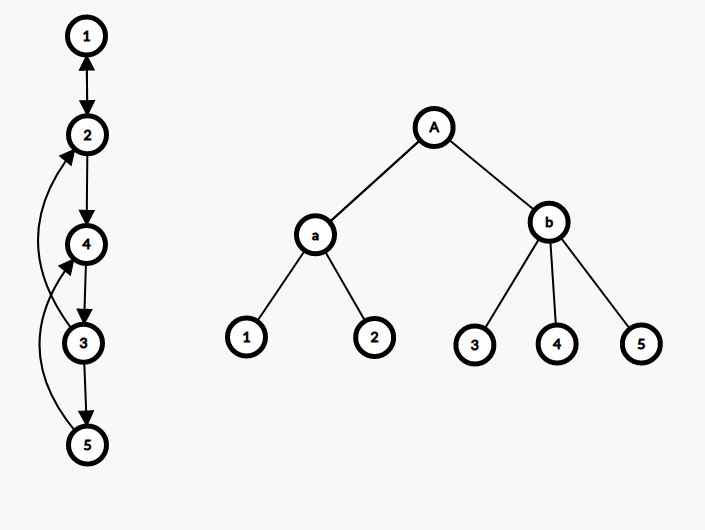

# 最小树形图 - OI Wiki

- Source: https://oi-wiki.org/graph/dmst/

# 最小树形图

## 定义

有向图上的最小生成树（Directed Minimum Spanning Tree）称为最小树形图．

常用的算法是朱刘算法（也称 Edmonds 算法），可以在 𝑂(𝑛𝑚)O(nm) 时间内解决最小树形图问题．

## 过程

  1. 对于每个点，选择指向它的边权最小的那条边．
  2. 如果没有环，算法终止；否则进行缩环并更新其他点到环的距离．

## 实现

```text 1 2 3 4 5 6 7 8 9 10 11 12 13 14 15 16 17 18 19 20 21 22 23 24 25 26 27 28 29 30 31 32 33 34 35 36 37 38 39 40 41 42 43 44 ``` |  ```text bool solve () { ans = 0 ; int u , v , root = 0 ; for (;;) { f ( i , 0 , n ) in [ i ] = 1e100 ; f ( i , 0 , m ) { u = e [ i ]. s ; v = e [ i ]. t ; if ( u != v && e [ i ]. w < in [ v ]) { in [ v ] = e [ i ]. w ; pre [ v ] = u ; } } f ( i , 0 , m ) if ( i != root && in [ i ] > 1e50 ) return 0 ; int tn = 0 ; memset ( id , -1 , sizeof id ); memset ( vis , -1 , sizeof vis ); in [ root ] = 0 ; f ( i , 0 , n ) { ans += in [ i ]; v = i ; while ( vis [ v ] != i && id [ v ] == -1 && v != root ) { vis [ v ] = i ; v = pre [ v ]; } if ( v != root && id [ v ] == -1 ) { for ( int u = pre [ v ]; u != v ; u = pre [ u ]) id [ u ] = tn ; id [ v ] = tn ++ ; } } if ( tn == 0 ) break ; f ( i , 0 , n ) if ( id [ i ] == -1 ) id [ i ] = tn ++ ; f ( i , 0 , m ) { u = e [ i ]. s ; v = e [ i ]. t ; e [ i ]. s = id [ u ]; e [ i ]. t = id [ v ]; if ( e [ i ]. s != e [ i ]. t ) e [ i ]. w -= in [ v ]; } n = tn ; root = id [ root ]; } return ans ; } ```   
---|---  
  
## Tarjan 的 DMST 算法

Tarjan 提出了一种能够在 𝑂(𝑚 +𝑛log⁡𝑛)O(m+nlog⁡n) 时间内解决最小树形图问题的算法．

这里的算法描述以及参考代码基于 Uri Zwick 教授的课堂讲义，更多的细节可以参考原文．

### 过程

Tarjan 的算法分为 **收缩** 与 **伸展** 两个过程．接下来先介绍 **收缩** 的过程．

我们需要假设输入的图是满足强连通的，如果不满足那么就加入 𝑂(𝑛)O(n) 条边使其满足，并且这些边的边权是无穷大的．

我们需要一个堆存储结点的入边编号，入边权值，结点总代价等相关信息，由于后续过程中会有堆的合并操作，这里采用 [左偏树](../../ds/leftist-tree/) 与 [并查集](../../ds/dsu/) 实现．算法的每一步都选择一个任意结点 𝑣v，需要保证 𝑣v 不是根节点，并且在堆中没有它的入边．再将 𝑣v 的最小入边加入到堆中，如果新加入的这条边使堆中的边形成了环，那么将构成环的那些结点收缩，我们不妨将这些已经收缩的结点命名为 **超级结点** ，再继续这个过程，如果所有的顶点都缩成了一个超级结点，那么收缩过程就结束了．整个收缩过程结束后会得到一棵收缩树，之后将对它进行伸展操作．

堆中的边总是会形成一条路径 𝑣0 ←𝑣1 ←⋯ ←𝑣𝑘v0←v1←⋯←vk，由于图是强连通的，这个路径必然存在，并且其中的 𝑣𝑖vi 可能是最初的单一结点，也可能是压缩后的超级结点．

最初有 𝑣𝑜 =𝑎vo=a，其中 𝑎a 是图中任意的一个结点，每一次选择一条最小入边 𝑣𝑘 ←𝑢vk←u，如果 𝑢u 不是 𝑣0,𝑣1,…,𝑣𝑘v0,v1,…,vk 中的一个结点，那么就将结点扩展到 𝑣𝑘+1 =𝑢vk+1=u．如果 𝑢u 是他们其中的一个结点 𝑣𝑖vi，那么就找到了一个关于 𝑣𝑖 ←⋯ ←𝑣𝑘 ←𝑣𝑖vi←⋯←vk←vi 的环，再将他们收缩为一个超级结点 𝑐c．

向队列 𝑃P 中放入所有的结点或超级结点，并初始选择任意一节点 𝑎a，只要队列不为空，就进行以下步骤：

  1. 选择 𝑎a 的最小入边，保证不存在自环，并找到另一头的结点 𝑏b．如果结点 𝑏b 没有被记录过说明未形成环，令 𝑎 ←𝑏a←b，继续当前操作寻找环．

  2. 如果 𝑏b 被记录过了，就说明出现了环．总结点数加一，并将环上的所有结点重新编号，对堆进行合并，以及结点/超级结点的总权值的更新．更新权值操作就是将环上所有结点的入边都收集起来，并减去环上入边的边权．



以图片为例，左边的强连通图在收缩后就形成了右边的一棵收缩树，其中 𝑎a 是结点 1 与结点 2 收缩后的超级结点，𝑏b 是结点 3，结点 4，结点 5 收缩后的超级结点，𝐴A 是两个超级结点 𝑎a 与 𝑏b 收缩后形成的．

伸展过程是相对简单的，以原先要求的根节点 𝑟r 为起始点，对 𝑟r 到收缩树的根上的每一个环进行伸展．再以 𝑟r 的祖先结点 𝑓𝑟fr 为起始点，将其到根的环展开，直到遍历完所有的结点．

### 实现

```text 1 2 3 4 5 6 7 8 9 10 11 12 13 14 15 16 17 18 19 20 21 22 23 24 25 26 27 28 29 30 31 32 33 34 35 36 37 38 39 40 41 42 43 44 45 46 47 48 49 50 51 52 53 54 55 56 57 58 59 60 61 62 63 64 65 66 67 68 69 70 71 72 73 74 75 76 77 78 79 80 81 82 83 84 85 86 87 88 89 90 91 92 93 94 95 96 97 98 99 100 101 102 103 104 105 106 107 108 109 110 111 112 113 114 115 116 117 118 119 120 121 122 123 124 125 126 127 128 129 130 131 132 133 134 135 136 137 138 139 140 141 142 143 144 145 ``` |  ```text #include <cstdio> #include <cstring> #include <queue> #include <vector> using namespace std ; using ll = long long ; constexpr int MAXN = 102 ; constexpr int INF = 0x3f3f3f3f ; struct UnionFind { int fa [ MAXN << 1 ]; UnionFind () { memset ( fa , 0 , sizeof ( fa )); } void clear ( int n ) { memset ( fa \+ 1 , 0 , sizeof ( int ) * n ); } int find ( int x ) { return fa [ x ] ? fa [ x ] = find ( fa [ x ]) : x ; } int operator []( int x ) { return find ( x ); } }; struct Edge { int u , v , w , w0 ; }; struct Heap { Edge * e ; int rk , constant ; Heap * lch , * rch ; Heap ( Edge * _e ) : e ( _e ), rk ( 1 ), constant ( 0 ), lch ( NULL ), rch ( NULL ) {} void push () { if ( lch ) lch -> constant += constant ; if ( rch ) rch -> constant += constant ; e -> w += constant ; constant = 0 ; } }; Heap * merge ( Heap * x , Heap * y ) { if ( ! x ) return y ; if ( ! y ) return x ; if ( x -> e -> w \+ x -> constant > y -> e -> w \+ y -> constant ) swap ( x , y ); x -> push (); x -> rch = merge ( x -> rch , y ); if ( ! x -> lch || x -> lch -> rk < x -> rch -> rk ) swap ( x -> lch , x -> rch ); if ( x -> rch ) x -> rk = x -> rch -> rk \+ 1 ; else x -> rk = 1 ; return x ; } Edge * extract ( Heap *& x ) { Edge * r = x -> e ; x -> push (); x = merge ( x -> lch , x -> rch ); return r ; } vector < Edge > in [ MAXN ]; int n , m , fa [ MAXN << 1 ], nxt [ MAXN << 1 ]; Edge * ed [ MAXN << 1 ]; Heap * Q [ MAXN << 1 ]; UnionFind id ; void contract () { bool mark [ MAXN << 1 ]; // 将图上的每一个结点与其相连的那些结点进行记录． for ( int i = 1 ; i <= n ; i ++ ) { queue < Heap *> q ; for ( int j = 0 ; j < in [ i ]. size (); j ++ ) q . push ( new Heap ( & in [ i ][ j ])); while ( q . size () > 1 ) { Heap * u = q . front (); q . pop (); Heap * v = q . front (); q . pop (); q . push ( merge ( u , v )); } Q [ i ] = q . front (); } mark [ 1 ] = true ; for ( int a = 1 , b = 1 , p ; Q [ a ]; b = a , mark [ b ] = true ) { // 寻找最小入边以及其端点，保证无环． do { ed [ a ] = extract ( Q [ a ]); a = id [ ed [ a ] -> u ]; } while ( a == b && Q [ a ]); if ( a == b ) break ; if ( ! mark [ a ]) continue ; // 对发现的环进行收缩，以及环内的结点重新编号，总权值更新． for ( a = b , n ++ ; a != n ; a = p ) { id . fa [ a ] = fa [ a ] = n ; if ( Q [ a ]) Q [ a ] -> constant -= ed [ a ] -> w ; Q [ n ] = merge ( Q [ n ], Q [ a ]); p = id [ ed [ a ] -> u ]; nxt [ p == n ? b : p ] = a ; } } } ll expand ( int x , int r ); ll expand_iter ( int x ) { ll r = 0 ; for ( int u = nxt [ x ]; u != x ; u = nxt [ u ]) { if ( ed [ u ] -> w0 >= INF ) return INF ; else r += expand ( ed [ u ] -> v , u ) \+ ed [ u ] -> w0 ; } return r ; } ll expand ( int x , int t ) { ll r = 0 ; for (; x != t ; x = fa [ x ]) { r += expand_iter ( x ); if ( r >= INF ) return INF ; } return r ; } void link ( int u , int v , int w ) { in [ v ]. push_back ({ u , v , w , w }); } int main () { int rt ; scanf ( "%d %d %d" , & n , & m , & rt ); for ( int i = 0 ; i < m ; i ++ ) { int u , v , w ; scanf ( "%d %d %d" , & u , & v , & w ); link ( u , v , w ); } // 保证强连通 for ( int i = 1 ; i <= n ; i ++ ) link ( i > 1 ? i \- 1 : n , i , INF ); contract (); ll ans = expand ( rt , n ); if ( ans >= INF ) puts ( "-1" ); else printf ( "%lld \n " , ans ); return 0 ; } ```   
---|---  
  
## 参考文献

Uri Zwick. (2013),[Directed Minimum Spanning Trees](http://www.cs.tau.ac.il/~zwick/grad-algo-13/directed-mst.pdf), Lecture notes on "Analysis of Algorithms"

<https://riteme.site/blog/2018-6-18/mdst.html#_3>

* * *

> __本页面最近更新： 2026/1/7 08:56:54，[更新历史](https://github.com/OI-wiki/OI-wiki/commits/master/docs/graph/dmst.md)  
>  __发现错误？想一起完善？[在 GitHub 上编辑此页！](https://oi-wiki.org/edit-landing/?ref=/graph/dmst.md "edit.link.title")  
>  __本页面贡献者：[Tiphereth-A](https://github.com/Tiphereth-A), [ShaoChenHeng](https://github.com/ShaoChenHeng), [CCXXXI](https://github.com/CCXXXI), [EarthMessenger](https://github.com/EarthMessenger), [Enter-tainer](https://github.com/Enter-tainer), [iamtwz](https://github.com/iamtwz), [Ir1d](https://github.com/Ir1d), [ksyx](https://github.com/ksyx), [Marcythm](https://github.com/Marcythm), [TrisolarisHD](mailto:orzcyand1317@gmail.com)  
>  __本页面的全部内容在**[CC BY-SA 4.0](https://creativecommons.org/licenses/by-sa/4.0/deed.zh) 和 [SATA](https://github.com/zTrix/sata-license)** 协议之条款下提供，附加条款亦可能应用
