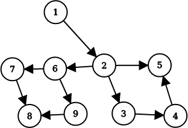

# 支配树 - OI Wiki

- Source: https://oi-wiki.org/graph/dominator-tree/

# 支配树

## 前言

1959 年，「支配」这一概念由 Reese T. Prosser 在 [一篇关于网络流的论文](http://portal.acm.org/ft_gateway.cfm?id=1460314&type=pdf&coll=GUIDE&dl=GUIDE&CFID=79528182&CFTOKEN=33765747) 中提出，但并未提出具体的求解算法；直到 1969 年，Edward S. Lowry 和 C. W. Medlock 才首次提出了 [有效的求解算法](http://portal.acm.org/ft_gateway.cfm?id=362838&type=pdf&coll=GUIDE&dl=GUIDE&CFID=79528182&CFTOKEN=33765747)．而目前使用最为广泛的 Lengauer–Tarjan 算法则由 Lengauer 和 Tarjan 于 1979 年在 [一篇论文](https://www.cs.princeton.edu/courses/archive/fall03/cs528/handouts/a%20fast%20algorithm%20for%20finding.pdf) 中提出．

在 OI 界中，支配树的概念最早在 [ZJOI2012 灾难](https://www.luogu.com.cn/problem/P2597) 中被引入，当时也被称为「灭绝树」；陈孙立也在 2020 年的国家集训队论文中介绍了这一算法．

目前支配树在竞赛界并不流行，其相关习题并不多见；但支配树在工业上，尤其是编译器相关领域，已有广泛运用．

本文将介绍支配树的概念及几种求解方法．

## 支配关系

我们在任意的一个有向图上钦定一个入口结点 𝑠s，对于一个结点 𝑢u，若从 𝑠s 到 𝑢u 的每一条路径都经过某一个结点 𝑣v，那么我们称 𝑣v **支配** 𝑢u，也称 𝑣v 是 𝑢u 的一个 **支配点** ，记作 𝑣 𝑑𝑜𝑚 𝑢v dom u．

对于从 𝑠s 出发无法到达的结点，讨论其支配关系是没有意义的，因此在没有特殊说明的情况下，本文默认 𝑠s 能到达图上任何一个结点．



例如这张有向图中，22 被 11 支配，33 被 1,21,2 支配，4 被 1,2,31,2,3 支配，5 被 1,21,2 支配，etc．

### 引理

在下文的引理中，默认 𝑢,𝑣,𝑤 ≠𝑠u,v,w≠s

**引理 1：** 𝑠s 是其所有结点的支配点；任意一个结点都是其自身的支配点．

**证明：** 显然任何一条从 𝑠s 到 𝑢u 的路径都必须经过 𝑠s 和 𝑢u 这两个结点．

**引理 2：** 仅考虑简单路径得出的支配关系与考虑所有路径得出的关系相同．

**证明：** 对于非简单路径，我们设两次经过某个结点之间经过的所有结点的点集为 𝑆S，若将 𝑆S 中的结点删去，便能将每个非简单路径与一个简单路径对应．

在 𝑆S 中，在非简单路径而不在简单路径上的点一定不可能成为支配点，因为至少有一条 𝑠s 到 𝑢u 的简单路径不包括这个点；同时在简单路径和非简单路径上的点只需在简单路径上讨论即可．

综上，删去非简单路径对支配关系没有影响．

**引理 3：** 如果 𝑢u 𝑑𝑜𝑚dom 𝑣v，𝑣v 𝑑𝑜𝑚dom 𝑤w，则 𝑢u 𝑑𝑜𝑚dom 𝑤w．

**证明：** 经过 𝑤w 的路径必定经过 𝑣v，经过 𝑣v 的路径必定经过 𝑢u，因此经过 𝑤w 的路径必定经过 𝑢u，即 𝑢 𝑑𝑜𝑚 𝑤u dom w．

**引理 4：** 如果 𝑢 𝑑𝑜𝑚 𝑣u dom v，𝑣 𝑑𝑜𝑚 𝑢v dom u，则 𝑢 =𝑣u=v．

**证明：** 假设 𝑢 ≠𝑣u≠v，则任意一个到达 𝑣v 的路径都已经到达过 𝑢u，同时任意一个到达 𝑢u 的路径都已经到达过 𝑣v，矛盾．

**引理 5：** 若 𝑢 ≠𝑣 ≠𝑤u≠v≠w,𝑢 𝑑𝑜𝑚 𝑤u dom w 且 𝑣 𝑑𝑜𝑚 𝑤v dom w，则有 𝑢 𝑑𝑜𝑚 𝑣u dom v 或 𝑣 𝑑𝑜𝑚 𝑢v dom u．

**证明：** 考虑一条 𝑠 →⋯ →𝑢 →⋯ →𝑣 →⋯ →𝑤s→⋯→u→⋯→v→⋯→w 的路径，若 𝑢u,𝑣v 不存在支配关系，则一定存在一条不经过 𝑢u 的从 𝑠s 到 𝑣v 的路径，即存在一条 𝑠 →⋯ →𝑣 →⋯ →𝑤s→⋯→v→⋯→w 的路径，与 𝑢 𝑑𝑜𝑚 𝑤u dom w 矛盾．

### 求解支配关系

#### 结点删除法

一个和定义等价的结论：如果我们删去图中的某一个结点后，有一些结点变得不可到达，那么这个被删去的结点支配这些变得不可到达的结点．

因此我们只要尝试将每一个结点删去后 dfs 即可，代码复杂度为 𝑂(𝑛3)O(n3)．下面给出核心代码．

```text 1 2 3 4 5 6 7 8 9 10 11 12 13 14 15 16 17 18 19 20 21 22 23 24 25 26 ``` |  ```text // 假设图中有 n 个结点, 起始点 s = 1 std :: bitset < N > vis ; std :: vector < int > edge [ N ]; std :: vector < int > dom [ N ]; void dfs ( int u , int del ) { vis [ u ] = true ; for ( int v : edge [ u ]) { if ( v == del or vis [ v ]) { continue ; } dfs ( v , del ); } } void getdom () { for ( int i = 2 ; i <= n ; ++ i ) { vis . reset (); dfs ( 1 , i ); for ( int j = 1 ; j <= n ; ++ j ) { if ( ! vis [ j ]) { dom [ j ]. push_back ( i ); } } } } ```   
---|---  
  
#### 数据流迭代法

数据流迭代法也是 OI 中不常见的一个知识点，这里先做简要介绍．

数据流分析是编译原理中的概念，用于分析数据如何在程序执行路径上的流动；而数据流迭代法是在程序的流程图的结点上列出方程并不断迭代求解，从而求得程序的某些点的数据流值的一种方法．这里我们就是把有向图看成了一个程序流程图．

这个问题中，方程为：

𝑑𝑜𝑚(𝑢)={𝑢}∪⎛⎜ ⎜⎝⋂𝑣∈𝑝𝑟𝑒(𝑢)𝑑𝑜𝑚(𝑣)⎞⎟ ⎟⎠dom(u)={u}∪(⋂v∈pre(u)dom(v))

其中 𝑝𝑟𝑒(𝑢)pre(u) 定义为 𝑢u 的前驱结点组成的点集．这个方程可以通过引理 3 得到．

翻译成人话就是，一个点的支配点的点集为它所有前驱结点的支配点集的交集，再并上它本身．根据这个方程将每个结点上的支配点集不断迭代直至答案不变即可．

为了提高效率，我们希望每轮迭代时，当前迭代的结点的所有前驱结点尽可能都已经执行完了这次迭代，因此我们要利用深度优先排序得出这个图的逆后序，根据这个顺序进行迭代．

下面给出核心代码的参考实现．这里需要预先处理每个点的前驱结点集和图的逆后序，但这不是本文讨论的主要内容，故这里不提供参考实现．

```text 1 2 3 4 5 6 7 8 9 10 11 12 13 14 15 16 17 18 19 20 21 22 23 24 25 26 27 28 29 30 ``` |  ```text std :: vector < int > pre [ N ]; // 每个结点的前驱结点 std :: vector < int > ord ; // 图的逆后序 std :: bitset < N > dom [ N ]; std :: vector < int > Dom [ N ]; void getdom () { dom [ 1 ][ 1 ] = true ; flag = true ; while ( flag ) { flag = false ; for ( int u : ord ) { std :: bitset < N > tmp ; tmp [ u ] = true ; for ( int v : pre [ u ]) { tmp &= dom [ v ]; } if ( tmp != dom [ u ]) { dom [ u ] = tmp ; flag = true ; } } } for ( int i = 2 ; i <= n ; ++ i ) { for ( int j = 1 ; j <= n ; ++ j ) { if ( dom [ i ][ j ]) { Dom [ i ]. push_back ( j ); } } } } ```   
---|---  
  
不难看出上述算法的复杂度为 𝑂(𝑛2)O(n2)．

## 支配树

上一节我们发现，除 𝑠s 外，一个点的支配点至少有两个，𝑠s 和其自身．

我们将任意一个结点 𝑢u 的支配点中，除自身外与自己距离最近的结点 𝑣v 称作 𝑢u 的直接支配点，记作 𝑖𝑑𝑜𝑚(𝑢) =𝑣idom(u)=v．显然除了 𝑠s 没有直接支配点外，每个结点都有唯一一个直接支配点．

我们考虑对于除 𝑠s 外每一个结点 𝑢u 从 𝑖𝑑𝑜𝑚(𝑢)idom(u) 向 𝑢u 连边，便构成了一个有 𝑛n 个结点，𝑛 −1n−1 条边的有向图．根据引理 3 和引理 4，我们知道支配关系一定不会构成循环，也就是这些边一定不构成环，因此我们得到的图事实上是一棵树．我们称这颗树为原图的 **支配树** ．

## 求解支配树

### 根据 dom 求解

不妨考虑某个结点的支配点集 {𝑠1,𝑠2,…,𝑠𝑘}{s1,s2,…,sk}，则一定存在一条路径 𝑠 →⋯ →𝑠1 →⋯ →𝑠2 →⋯ →⋯ →𝑠𝑘 →⋯ →𝑢s→⋯→s1→⋯→s2→⋯→⋯→sk→⋯→u．显然 𝑢u 的直接支配点为 𝑠𝑘sk．因此直接支配点的定义等价于：

对于一个结点 𝑢u 的支配点集 𝑆S，若 𝑣 ∈𝑆v∈S 满足 ∀𝑤 ∈𝑆 ∖{𝑢,𝑣},𝑤 𝑑𝑜𝑚 𝑣∀w∈S∖{u,v},w dom v，则 𝑖𝑑𝑜𝑚(𝑢) =𝑣idom(u)=v．

因此，利用前文所述的算法得到每个结点的支配点集之后，我们根据上述定义便能很轻松地得到每个点的直接支配点，从而构造出支配树．下面给出参考代码．

```text 1 2 3 4 5 6 7 8 9 10 11 12 13 14 15 16 17 18 ``` |  ```text std :: bitset < N > dom [ N ]; std :: vector < int > Dom [ N ]; int idom [ N ]; void getidom () { for ( int u = 2 ; u <= n ; ++ u ) { for ( int v : Dom [ u ]) { std :: bitset < N > tmp = ( dom [ v ] & dom [ u ]) ^ dom [ u ]; if ( tmp . count () == 1 and tmp [ u ]) { idom [ u ] = v ; break ; } } } for ( int u = 2 ; u <= n ; ++ u ) { e [ idom [ u ]]. push_back ( u ); } } ```   
---|---  
  
### 树上的特例

显然树型图的支配树就是它本身．

### DAG 上的特例

我们发现 DAG 有一个很好的性质：根据拓扑序求解，先求得的解不会对后续的解产生影响．我们可以利用这个特点快速求得 DAG 的支配树．

提醒

值得注意的是此处的 DAG 只能有一个起点，如果有多个起点，受起点支配的点在支配树上出现有多个父亲的情况，从而使支配关系不能简单的用支配树来表达．

**引理 6：** 在有向图上，𝑣 𝑑𝑜𝑚 𝑢v dom u 当且仅当 ∀𝑤 ∈𝑝𝑟𝑒(𝑢),𝑣 𝑑𝑜𝑚 𝑤∀w∈pre(u),v dom w．

**证明：** 首先来证明充分性．考虑任意一条从 𝑠s 到 𝑢u 的路径都一定经过一个结点 𝑤 ∈𝑝𝑟𝑒(𝑢)w∈pre(u)，而 𝑣v 支配这个结点，因此任意一条从 𝑠s 到 𝑢u 的路径都一定经过 𝑣v，因此我们得到 𝑣 𝑑𝑜𝑚 𝑢v dom u．

然后是必要性．如果 ∃𝑤 ∈𝑝𝑟𝑒(𝑢)∃w∈pre(u)，𝑣v 不支配 𝑤w，则一定有一条不经过 𝑣v 的路径 𝑠 →⋯ →𝑤 →⋯ →𝑢s→⋯→w→⋯→u，因此 𝑣v 不支配 𝑢u．

我们发现，𝑢u 的支配点一定是其所有前驱结点在支配树上的公共祖先，那么显然 𝑢u 的直接支配点是所有前驱结点在支配树上的 LCA．考虑倍增求解 LCA 可以支持每次添加一个结点，上述算法显然是可行的．

下面给出参考实现：

```text 1 2 3 4 5 6 7 8 9 10 11 12 13 14 15 16 17 18 19 20 21 22 23 24 25 26 27 28 29 30 31 32 33 34 35 36 37 38 39 40 41 42 43 44 45 46 47 48 49 50 51 52 53 54 55 56 57 58 59 60 61 ``` |  ```text std :: stack < int > sta ; std :: vector < int > e [ N ], g [ N ], tree [ N ]; // g 是原图的反图，tree 是支配树 int n , s , in [ N ], tpn [ N ], dep [ N ], idom [ N ]; // n 为总点数，s 为起始点，in 为入度 int fth [ N ][ 17 ]; void topo ( int s ) { sta . push ( s ); while ( ! sta . empty ()) { int u = sta . top (); sta . pop (); tpn [ ++ tot ] = u ; for ( int v : e [ u ]) { \-- in [ v ]; if ( ! in [ v ]) { sta . push ( v ); } } } } int lca ( int u , int v ) { if ( dep [ u ] < dep [ v ]) { std :: swap ( u , v ); } for ( int i = 15 ; i >= 0 ; \-- i ) { if ( dep [ fth [ u ][ i ]] >= dep [ v ]) { u = fth [ u ][ i ]; } } if ( u == v ) { return u ; } for ( int i = 15 ; i >= 0 ; \-- i ) { if ( fth [ u ][ i ] != fth [ v ][ i ]) { u = fth [ u ][ i ]; v = fth [ v ][ i ]; } } return fth [ u ][ 0 ]; } void build () { topo ( s ); for ( int i = 1 ; i <= n ; ++ i ) for ( int j = 0 ; j <= 15 ; ++ j ) fth [ i ][ j ] = s ; for ( int i = 1 ; i <= n ; ++ i ) { int u = tpn [ i ]; if ( g [ u ]. size ()) { int v = g [ u ][ 0 ]; for ( int j = 1 , q = g [ u ]. size (); j < q ; ++ j ) { v = lca ( v , g [ u ][ j ]); } tree [ v ]. push_back ( u ); fth [ u ][ 0 ] = v ; dep [ u ] = dep [ v ] \+ 1 ; for ( int i = 1 ; i <= 15 ; ++ i ) { fth [ u ][ i ] = fth [ fth [ u ][ i \- 1 ]][ i \- 1 ]; } } } } ```   
---|---  
  
### Lengauer–Tarjan 算法

Lengauer–Tarjan 算法是求解支配树最有名的算法之一，可以在 𝑂(𝑛𝛼(𝑛,𝑚))O(nα(n,m)) 的时间复杂度内求出一个有向图的支配树．这一算法引入了 **半支配点** 的概念，并通过半支配点辅助求得直接支配点．

#### 约定

首先，我们从 𝑠s 出发对这个有向图进行 dfs，所经过的点和边形成了一颗树 𝑇T．我们称走过的边为树边，其余的为非树边；令 𝑑𝑓𝑛(𝑢)dfn(u) 表示结点 𝑢u 被第几个遍历到；定义 𝑢 <𝑣u<v 当且仅当 𝑑𝑓𝑛(𝑢) <𝑑𝑓𝑛(𝑣)dfn(u)<dfn(v)．

#### 半支配点

一个结点 𝑢u 的半支配点，是满足从这个结点 𝑣v 出发有一条路径，路径上除了 𝑢,𝑣u,v 之外每个结点都大于 𝑢u 的结点中最小的那一个．形式化的说，𝑢u 的半支配点 𝑠𝑑𝑜𝑚(𝑢)sdom(u) 定义为：

𝑠𝑑𝑜𝑚(𝑢) =min(𝑣|∃𝑣 =𝑣0 →𝑣1 →⋯ →𝑣𝑘 =𝑢,∀1 ≤𝑖 ≤𝑘 −1,𝑣𝑖 >𝑢)sdom(u)=min(v|∃v=v0→v1→⋯→vk=u,∀1≤i≤k−1,vi>u)

我们发现半支配点有一些有用的性质：

**引理 7：** 对于任意结点 𝑢u，𝑠𝑑𝑜𝑚(𝑢) <𝑢sdom(u)<u．

**证明：** 根据定义不难发现，𝑢u 在 𝑇T 上的父亲 𝑓𝑎(𝑢)fa(u) 也满足成为半支配点的条件，且 𝑓𝑎(𝑢) <𝑢fa(u)<u，因此任何大于 𝑢u 的结点都不可能成为其半支配点．

**引理 8：** 对于任意结点 𝑢u，𝑖𝑑𝑜𝑚(𝑢)idom(u) 是其在 𝑇T 上的祖先．

**证明：** 𝑇T 上从 𝑠s 到 𝑢u 的路径对应了原图上的一条路径，则 𝑖𝑑𝑜𝑚(𝑢)idom(u) 必定在这个路径上．

**引理 9：** 对于任意结点 𝑢u，𝑠𝑑𝑜𝑚(𝑢)sdom(u) 是其在 𝑇T 上的祖先．

**证明：** 假设 𝑠𝑑𝑜𝑚(𝑢)sdom(u) 不是 𝑢u 的祖先，那么 𝑠𝑑𝑜𝑚(𝑢)sdom(u) 不可能连向任何 dfsdfs 序大于等于 𝑢u 的结点（否则这个点应在 𝑠𝑑𝑜𝑚(𝑢)sdom(u) 的子树内而非其他子树内），矛盾．

**引理 10：** 对于任意结点 𝑢u，𝑖𝑑𝑜𝑚(𝑢)idom(u) 是 𝑠𝑑𝑜𝑚(𝑢)sdom(u) 的祖先．

**证明：** 考虑可以从 𝑠s 到 𝑠𝑑𝑜𝑚(𝑢)sdom(u) 再从定义中的路径走到 𝑢u．根据定义，𝑠𝑑𝑜𝑚(𝑢)sdom(u) 到 𝑢u 的路径上的点均不支配 𝑢u，故 𝑖𝑑𝑜𝑚(𝑢)idom(u) 一定是 𝑠𝑑𝑜𝑚(𝑢)sdom(u) 的祖先．

**引理 11：** 对于任意结点 𝑢 ≠𝑣u≠v 满足 𝑣v 是 𝑢u 的祖先，则要么有 𝑣v 是 𝑖𝑑𝑜𝑚(𝑢)idom(u) 的祖先，要么 𝑖𝑑𝑜𝑚(𝑢)idom(u) 是 𝑖𝑑𝑜𝑚(𝑣)idom(v) 的祖先．

**证明：** 对于任意在 𝑣v 和 𝑖𝑑𝑜𝑚(𝑣)idom(v) 之间的结点 𝑤w，根据直接支配点的定义，一定存在一条不经过 𝑤w 的，从 𝑠s 到 𝑖𝑑𝑜𝑚(𝑣)idom(v) 再到 𝑣v 的路径．因此这些结点 𝑤w 一定不是 𝑖𝑑𝑜𝑚(𝑢)idom(u)，因此 𝑖𝑑𝑜𝑚(𝑢)idom(u) 要么是 𝑣v 的后代，要么是 𝑖𝑑𝑜𝑚(𝑣)idom(v) 的祖先．

根据以上引理，我们可以得到以下定理：

**定理 1：** 一个点 𝑢u 的半支配点是其前驱与其支配点在 𝑇T 上的，大于 𝑢u 的所有祖先的半支配点中最小的节点．形式化地说，𝑠𝑑𝑜𝑚(𝑢) =min({𝑣|∃𝑣 →𝑢,𝑣 <𝑢} ∪{𝑠𝑑𝑜𝑚(𝑤)|𝑤 >𝑢 𝑎𝑛𝑑 ∃𝑤 →⋯ →𝑣 →𝑢})sdom(u)=min({v|∃v→u,v<u}∪{sdom(w)|w>u and ∃w→⋯→v→u})．

**证明：** 令 𝑥x 等于上式右侧．

我们首先证明 𝑠𝑑𝑜𝑚(𝑢) ≤𝑥sdom(u)≤x．根据引理 7 我们知道这个命题等价于证明上述的两种都满足成为半支配点的条件．𝑥x 是 𝑢u 的前驱时的情况是显然的，对于后半部分，我们考虑将半支配点定义中所述路径 𝑥 =𝑣0 →⋯ →𝑣𝑗 =𝑤x=v0→⋯→vj=w 和 𝑇T 上的一条满足 ∀𝑖 ∈[𝑗,𝑘 −1],𝑣𝑖 ≥𝑤 >𝑢∀i∈[j,k−1],vi≥w>u 的路径 𝑤 =𝑣𝑗 →⋯ →𝑣𝑘 =𝑣w=vj→⋯→vk=v 以及路径 𝑣 →𝑢v→u 拼接，从而我们构造出一条满足半支配点定义的路径．

然后我们证明 𝑠𝑑𝑜𝑚(𝑢) ≥𝑥sdom(u)≥x．考虑 𝑢u 到其半支配点的定义中所述路径 𝑠𝑑𝑜𝑚(𝑢) =𝑣0 →𝑣1 →⋯ →𝑣𝑘 =𝑢sdom(u)=v0→v1→⋯→vk=u．不难看出 𝑘 =1k=1 和 𝑘 >1k>1 分别对应了定义中的两个选取方法．若 𝑘 =1k=1，则存在有向边 𝑠𝑑𝑜𝑚(𝑢) →𝑢sdom(u)→u，根据引理 7 即可得证；若 𝑘 >1k>1，令 𝑗j 是满足 𝑗 ≥1j≥1 且 𝑣𝑗vj 是 𝑣𝑘−1vk−1 在 𝑇T 上祖先的最小数．考虑到 𝑘k 满足上述条件，这样的 𝑗j 一定存在．

考虑证明 𝑣0 →⋯ →𝑣𝑗v0→⋯→vj 是满足成为 𝑣𝑗vj 半支配点条件的一条路径，即证明 ∀𝑖 ∈[1,𝑗),𝑣𝑖 >𝑣𝑗∀i∈[1,j),vi>vj．若不是，则令 𝑖i 为满足 𝑣𝑖 <𝑣𝑗vi<vj 中使 𝑣𝑖vi 最小的数，根据引理 11 我们知道 𝑣𝑖vi 是 𝑣𝑗vj 的祖先，这和 𝑗j 的定义矛盾．于是 𝑠𝑑𝑜𝑚(𝑣𝑗) ≤𝑠𝑑𝑜𝑚(𝑢)sdom(vj)≤sdom(u)．综上 𝑠𝑑𝑜𝑚(𝑢) ≤𝑥sdom(u)≤x，故 𝑥 =𝑠𝑑𝑜𝑚(𝑢)x=sdom(u)．

根据定理 1 我们便可以求出每个点的半支配点了．不难发现计算半支配点的复杂度瓶颈在第二种情况上，我们考虑利用带权并查集优化，每次路径压缩时更新最小值即可．

```text 1 2 3 4 5 6 7 8 9 10 11 12 13 14 15 16 17 18 19 20 21 22 23 24 25 26 27 28 29 30 31 32 33 34 35 36 37 38 39 40 41 42 43 44 45 46 47 ``` |  ```text void dfs ( int u ) { dfn [ u ] = ++ dfc ; pos [ dfc ] = u ; for ( int i = h [ 0 ][ u ]; i ; i = e [ i ]. x ) { int v = e [ i ]. v ; if ( ! dfn [ v ]) { dfs ( v ); fth [ v ] = u ; } } } int find ( int x ) { if ( fa [ x ] == x ) { return x ; } int tmp = fa [ x ]; fa [ x ] = find ( fa [ x ]); if ( dfn [ sdm [ mn [ tmp ]]] < dfn [ sdm [ mn [ x ]]]) { mn [ x ] = mn [ tmp ]; } return fa [ x ]; } void getsdom () { dfs ( 1 ); for ( int i = 1 ; i <= n ; ++ i ) { mn [ i ] = fa [ i ] = sdm [ i ] = i ; } for ( int i = dfc ; i >= 2 ; \-- i ) { int u = pos [ i ], res = INF ; for ( int j = h [ 1 ][ u ]; j ; j = e [ j ]. x ) { int v = e [ j ]. v ; if ( ! dfn [ v ]) { continue ; } find ( v ); if ( dfn [ v ] < dfn [ u ]) { res = std :: min ( res , dfn [ v ]); } else { res = std :: min ( res , dfn [ sdm [ mn [ v ]]]); } } sdm [ u ] = pos [ res ]; fa [ u ] = fth [ u ]; } } ```   
---|---  
  
#### 求解直接支配点

##### 转化为 DAG

可是我还是不知道半支配点有什么用！

我们考虑在 𝑇T 上对每一个 𝑢u 加入 𝑠𝑑𝑜𝑚(𝑢) →𝑢sdom(u)→u 的有向边．根据引理 9，新得到的这张图 𝐺G 一定是有向无环图；又根据引理 10，我们还发现这样加边不会改变支配关系，因此我们把原图转化为了一张 DAG，利用上文的算法求解即可．

##### 通过半支配点求解

建一堆图也太不优雅了！

**定理 2：** 对于任意节点 𝑢u，若 𝑇T 上从 𝑠𝑑𝑜𝑚(𝑢)sdom(u) 到 𝑤w 的路径上的任意节点 𝑣v 都满足 𝑠𝑑𝑜𝑚(𝑣) ≥𝑠𝑑𝑜𝑚(𝑤)sdom(v)≥sdom(w)，则 𝑖𝑑𝑜𝑚(𝑢) =𝑠𝑑𝑜𝑚(𝑢)idom(u)=sdom(u)．

**证明：** 根据引理 10 我们知道 𝑖𝑑𝑜𝑚(𝑢)idom(u) 是 𝑠𝑑𝑜𝑚(𝑢)sdom(u) 或其祖先，因此只需证明 𝑠𝑑𝑜𝑚(𝑢) 𝑑𝑜𝑚 𝑢sdom(u) dom u．

考虑任意一条 𝑠s 到 𝑢u 的路径 𝑃P，我们需要证明 𝑠𝑑𝑜𝑚(𝑢)sdom(u) 一定在 𝑃P 中．令 𝑣v 为 𝑃P 中最后一个满足 𝑣 <𝑠𝑑𝑜𝑚(𝑢)v<sdom(u) 的节点．如果 𝑣v 不存在则必有 𝑠𝑑𝑜𝑚(𝑢) =𝑖𝑑𝑜𝑚(𝑢) =𝑠sdom(u)=idom(u)=s，否则令 𝑤w 是 𝑃P 中 𝑣v 之后在 DFS 树中从 𝑠𝑑𝑜𝑚(𝑢)sdom(u) 到 𝑢u 的路径上的第一个点．

我们接下来证明 𝑠𝑑𝑜𝑚(𝑤) ≤𝑣 <𝑠𝑑𝑜𝑚(𝑣)sdom(w)≤v<sdom(v)．考虑 𝑇T 上 𝑣v 到 𝑤w 的路径 𝑣 =𝑣0 →…𝑣𝑘 =𝑤v=v0→…vk=w，若不成立，则存在 𝑖 ∈[1,𝑘 −1],𝑣𝑖 <𝑤i∈[1,k−1],vi<w．此时一定存在某个 𝑗 ∈[𝑖,𝑘 −1]j∈[i,k−1] 满足 𝑣𝑗vj 是 𝑤w 的祖先．由 𝑣v 的取值可知 𝑠𝑑𝑜𝑚(𝑢) ≤𝑣𝑗sdom(u)≤vj，于是 𝑣𝑗vj 也在 DFS 树中从 𝑠𝑑𝑜𝑚(𝑢)sdom(u) 到 𝑢u 的路径上，与 𝑤w 的定义矛盾，因此 𝑠𝑑𝑜𝑚(𝑤) ≤𝑣 <𝑠𝑑𝑜𝑚(𝑣)sdom(w)≤v<sdom(v)，结合定理的条件有 𝑦 =𝑠𝑑𝑜𝑚(𝑢)y=sdom(u)，即路径 𝑃P 包含 𝑠𝑑𝑜𝑚(𝑢)sdom(u)．

**定理 3：** 对于任意节点 𝑢u，𝑇T 上从 𝑠𝑑𝑜𝑚(𝑢)sdom(u) 到 𝑢u 的路径上的所有节点中半支配点最小的节点 𝑣v 一定满足 𝑠𝑑𝑜𝑚(𝑣) ≤𝑠𝑑𝑜𝑚(𝑢)sdom(v)≤sdom(u) 和 𝑖𝑑𝑜𝑚(𝑣) =𝑖𝑑𝑜𝑚(𝑢)idom(v)=idom(u)．

**证明：** 考虑到 𝑢u 本身也满足 𝑣v 的条件，因此 𝑠𝑑𝑜𝑚(𝑣) ≤𝑠𝑑𝑜𝑚(𝑢)sdom(v)≤sdom(u)．

由于 𝑖𝑑𝑜𝑚(𝑢)idom(u) 是 𝑣v 在 𝑇T 上的祖先，由引理 11 可知 𝑖𝑑𝑜𝑚(𝑢)idom(u) 也是 𝑖𝑑𝑜𝑚(𝑣)idom(v) 的祖先，因此只需证明 𝑖𝑑𝑜𝑚(𝑣)idom(v) 支配 𝑢u．

考虑任意一条 𝑠s 到 𝑢u 的路径 𝑃P，我们需要证明 𝑠𝑑𝑜𝑚(𝑢)sdom(u) 一定在 𝑃P 中．令 𝑥x 为 𝑃P 中最后一个满足 𝑥 <𝑠𝑑𝑜𝑚(𝑢)x<sdom(u) 的节点．如果 𝑥x 不存在则必有 𝑠𝑑𝑜𝑚(𝑢) =𝑖𝑑𝑜𝑚(𝑢) =𝑠sdom(u)=idom(u)=s，否则令 𝑦y 是 𝑃P 中 𝑥x 之后在 DFS 树中从 𝑠𝑑𝑜𝑚(𝑢)sdom(u) 到 𝑢u 的路径上的第一个点．

与定理 2 的证明过程同理，我们可以得到 𝑠𝑑𝑜𝑚(𝑦) ≤𝑥sdom(y)≤x．根据引理 10 有 𝑠𝑑𝑜𝑚(𝑦) ≤𝑥 <𝑖𝑑𝑜𝑚(𝑣) ≤𝑠𝑑𝑜𝑚(𝑣)sdom(y)≤x<idom(v)≤sdom(v)．至此，由 𝑣v 的定义可知 𝑦y 不能是 𝑠𝑑𝑜𝑚(𝑢)sdom(u) 的后代；另一方面，𝑦y 不能既是 𝑖𝑑𝑜𝑚(𝑣)idom(v) 的后代也是 𝑣v 的祖先，否则沿 DFS 树从 𝑠s 到 𝑠𝑑𝑜𝑚(𝑦)sdom(y) 再沿 P 走到 𝑦y，最后沿 DFS 树走到 𝑣v 的这条路径不经过 𝑖𝑑𝑜𝑚(𝑣)idom(v)，与支配点的定义矛盾．因此 𝑦 =𝑖𝑑𝑜𝑚(𝑣)y=idom(v)，即 𝑃P 包含 𝑖𝑑𝑜𝑚(𝑣)idom(v)．

根据以上两个定理我们能够得到 𝑠𝑑𝑜𝑚(𝑢)sdom(u) 与 𝑖𝑑𝑜𝑚(𝑢)idom(u) 之间的关系．

令 𝑣v 是满足 𝑣v 在 𝑠𝑑𝑜𝑚(𝑢)sdom(u) 与 𝑢u 之间的结点的所有节点中，𝑠𝑑𝑜𝑚(𝑣)sdom(v) 最小的一个节点，那么：

𝑖𝑑𝑜𝑚(𝑢)={𝑠𝑑𝑜𝑚(𝑢),if 𝑠𝑑𝑜𝑚(𝑢)=𝑠𝑑𝑜𝑚(𝑣)𝑖𝑑𝑜𝑚(𝑣),otherwiseidom(u)={sdom(u),if sdom(u)=sdom(v)idom(v),otherwise

只要对上面求解半支配点的代码稍作修改即可．

```text 1 2 3 4 5 6 7 8 9 10 11 12 13 14 15 16 17 18 19 20 21 22 23 24 25 26 27 28 29 30 31 32 33 34 35 36 37 38 39 40 41 42 43 44 45 46 47 48 49 50 51 52 53 54 55 56 57 58 59 60 61 62 63 64 65 66 67 68 69 70 71 72 73 74 75 76 77 78 79 80 ``` |  ```text struct E { int v , x ; } e [ MAX * 4 ]; int h [ 3 ][ MAX * 2 ]; int dfc , tot , n , m , u , v ; int fa [ MAX ], fth [ MAX ], pos [ MAX ], mn [ MAX ], idm [ MAX ], sdm [ MAX ], dfn [ MAX ], ans [ MAX ]; void add ( int x , int u , int v ) { e [ ++ tot ] = { v , h [ x ][ u ]}; h [ x ][ u ] = tot ; } void dfs ( int u ) { dfn [ u ] = ++ dfc ; pos [ dfc ] = u ; for ( int i = h [ 0 ][ u ]; i ; i = e [ i ]. x ) { int v = e [ i ]. v ; if ( ! dfn [ v ]) { dfs ( v ); fth [ v ] = u ; } } } int find ( int x ) { if ( fa [ x ] == x ) { return x ; } int tmp = fa [ x ]; fa [ x ] = find ( fa [ x ]); if ( dfn [ sdm [ mn [ tmp ]]] < dfn [ sdm [ mn [ x ]]]) { mn [ x ] = mn [ tmp ]; } return fa [ x ]; } void tar ( int st ) { dfs ( st ); for ( int i = 1 ; i <= n ; ++ i ) { fa [ i ] = sdm [ i ] = mn [ i ] = i ; } for ( int i = dfc ; i >= 2 ; \-- i ) { int u = pos [ i ], res = INF ; for ( int j = h [ 1 ][ u ]; j ; j = e [ j ]. x ) { int v = e [ j ]. v ; if ( ! dfn [ v ]) { continue ; } find ( v ); if ( dfn [ v ] < dfn [ u ]) { res = std :: min ( res , dfn [ v ]); } else { res = std :: min ( res , dfn [ sdm [ mn [ v ]]]); } } sdm [ u ] = pos [ res ]; fa [ u ] = fth [ u ]; add ( 2 , sdm [ u ], u ); u = fth [ u ]; for ( int j = h [ 2 ][ u ]; j ; j = e [ j ]. x ) { int v = e [ j ]. v ; find ( v ); if ( sdm [ mn [ v ]] == u ) { idm [ v ] = u ; } else { idm [ v ] = mn [ v ]; } } h [ 2 ][ u ] = 0 ; } for ( int i = 2 ; i <= dfc ; ++ i ) { int u = pos [ i ]; if ( idm [ u ] != sdm [ u ]) { idm [ u ] = idm [ idm [ u ]]; } } } ```   
---|---  
  
## 例题

### [洛谷 P5180【模板】支配树](https://www.luogu.com.cn/problem/P5180)

可以仅求解支配关系，求解过程中记录各个点支配了多少节点，也可以建出支配树求解每个节点的 size．

这里给出后一种解法的代码．

参考代码

```text 1 2 3 4 5 6 7 8 9 10 11 12 13 14 15 16 17 18 19 20 21 22 23 24 25 26 27 28 29 30 31 32 33 34 35 36 37 38 39 40 41 42 43 44 45 46 47 48 49 50 51 52 53 54 55 56 57 58 59 60 61 62 63 64 65 66 67 68 69 70 71 72 73 74 75 76 77 78 79 80 81 82 83 84 85 86 87 88 89 90 91 92 93 94 95 96 97 98 99 100 101 102 103 ``` |  ```text #include <iostream> using std :: cin ; using std :: cout ; constexpr int MAX = 3e5 \+ 5 ; constexpr int INF = 0x5ffffff ; struct E { int v , x ; } e [ MAX * 4 ]; int n , m , u , v , tot , dfc ; int ans [ MAX ], dfn [ MAX ], pos [ MAX ], sdm [ MAX ], idm [ MAX ], fa [ MAX ], mn [ MAX ], fth [ MAX ]; int h [ 3 ][ MAX * 2 ]; void add ( int x , int u , int v ) { e [ ++ tot ] = { v , h [ x ][ u ]}; h [ x ][ u ] = tot ; } void dfs ( int u ) { dfn [ u ] = ++ dfc ; pos [ dfc ] = u ; for ( int i = h [ 0 ][ u ]; i ; i = e [ i ]. x ) { int v = e [ i ]. v ; if ( ! dfn [ v ]) { dfs ( v ); fth [ v ] = u ; } } } int find ( int x ) { if ( fa [ x ] == x ) { return x ; } int tmp = fa [ x ]; fa [ x ] = find ( fa [ x ]); if ( dfn [ sdm [ mn [ tmp ]]] < dfn [ sdm [ mn [ x ]]]) { mn [ x ] = mn [ tmp ]; } return fa [ x ]; } void tar ( int st ) { dfs ( st ); for ( int i = 1 ; i <= n ; ++ i ) { mn [ i ] = fa [ i ] = sdm [ i ] = i ; } for ( int i = dfc ; i >= 2 ; \-- i ) { int u = pos [ i ], res = INF ; for ( int j = h [ 1 ][ u ]; j ; j = e [ j ]. x ) { int v = e [ j ]. v ; if ( ! dfn [ v ]) { continue ; } find ( v ); if ( dfn [ v ] < dfn [ u ]) { res = std :: min ( res , dfn [ v ]); } else { res = std :: min ( res , dfn [ sdm [ mn [ v ]]]); } } sdm [ u ] = pos [ res ]; fa [ u ] = fth [ u ]; add ( 2 , sdm [ u ], u ); u = fth [ u ]; for ( int j = h [ 2 ][ u ]; j ; j = e [ j ]. x ) { int v = e [ j ]. v ; find ( v ); if ( u == sdm [ mn [ v ]]) { idm [ v ] = u ; } else { idm [ v ] = mn [ v ]; } } h [ 2 ][ u ] = 0 ; } for ( int i = 2 ; i <= dfc ; ++ i ) { int u = pos [ i ]; if ( idm [ u ] != sdm [ u ]) { idm [ u ] = idm [ idm [ u ]]; } } for ( int i = dfc ; i >= 2 ; \-- i ) { ++ ans [ pos [ i ]]; ans [ idm [ pos [ i ]]] += ans [ pos [ i ]]; } ++ ans [ 1 ]; } int main () { cin >> n >> m ; for ( int i = 1 ; i <= m ; ++ i ) { cin >> u >> v ; add ( 0 , u , v ); add ( 1 , v , u ); } tar ( 1 ); for ( int i = 1 ; i <= n ; ++ i ) { cout << ans [ i ] << ' ' ; } } ```   
---|---  
  
### [ZJOI2012 灾难](https://www.luogu.com.cn/problem/P2597)

在 DAG 上求支配树然后求节点 size 即可．

参考代码

```text 1 2 3 4 5 6 7 8 9 10 11 12 13 14 15 16 17 18 19 20 21 22 23 24 25 26 27 28 29 30 31 32 33 34 35 36 37 38 39 40 41 42 43 44 45 46 47 48 49 50 51 52 53 54 55 56 57 58 59 60 61 62 63 64 65 66 67 68 69 70 71 72 73 74 75 76 77 78 79 80 81 82 83 84 85 86 87 88 89 90 91 92 93 94 95 96 97 98 99 100 101 102 ``` |  ```text #include <iostream> #include <stack> #include <vector> using std :: cin ; using std :: cout ; using std :: stack ; using std :: vector ; constexpr int MAX = 65536 ; int n , x , tot ; int d [ MAX ], w [ MAX ], siz [ MAX ], p [ MAX ], f [ MAX ][ 17 ]; vector < int > e [ MAX ], g [ MAX ], h [ MAX ]; stack < int > s ; void topo () { s . push ( 0 ); for ( int i = 1 ; i <= n ; ++ i ) { if ( ! w [ i ]) { e [ 0 ]. push_back ( i ); g [ i ]. push_back ( 0 ); ++ w [ i ]; } } while ( ! s . empty ()) { int x = s . top (); s . pop (); p [ ++ tot ] = x ; for ( int i : e [ x ]) { \-- w [ i ]; if ( ! w [ i ]) { s . push ( i ); } } } } int lca ( int u , int v ) { if ( d [ u ] < d [ v ]) { std :: swap ( u , v ); } for ( int i = 15 ; i >= 0 ; \-- i ) { if ( d [ f [ u ][ i ]] >= d [ v ]) { u = f [ u ][ i ]; } } if ( u == v ) { return u ; } for ( int i = 15 ; i >= 0 ; \-- i ) { if ( f [ u ][ i ] != f [ v ][ i ]) { u = f [ u ][ i ]; v = f [ v ][ i ]; } } return f [ u ][ 0 ]; } void dfs ( int x ) { siz [ x ] = 1 ; for ( int i : h [ x ]) { dfs ( i ); siz [ x ] += siz [ i ]; } } void build () { for ( int i = 2 ; i <= n \+ 1 ; ++ i ) { int x = p [ i ], y = g [ x ][ 0 ]; for ( int j = 1 , q = g [ x ]. size (); j < q ; ++ j ) { y = lca ( y , g [ x ][ j ]); } h [ y ]. push_back ( x ); d [ x ] = d [ y ] \+ 1 ; f [ x ][ 0 ] = y ; for ( int i = 1 ; i <= 15 ; ++ i ) { f [ x ][ i ] = f [ f [ x ][ i \- 1 ]][ i \- 1 ]; } } } int main () { cin >> n ; for ( int i = 1 ; i <= n ; ++ i ) { while ( true ) { cin >> x ; if ( ! x ) { break ; } e [ x ]. push_back ( i ); g [ i ]. push_back ( x ); ++ w [ i ]; } } topo (); build (); dfs ( 0 ); for ( int i = 1 ; i <= n ; ++ i ) { cout << siz [ i ] \- 1 << '\n' ; } return 0 ; } ```   
---|---  
  
* * *

> __本页面最近更新： 2026/1/7 08:56:54，[更新历史](https://github.com/OI-wiki/OI-wiki/commits/master/docs/graph/dominator-tree.md)  
>  __发现错误？想一起完善？[在 GitHub 上编辑此页！](https://oi-wiki.org/edit-landing/?ref=/graph/dominator-tree.md "edit.link.title")  
>  __本页面贡献者：[AtomAlpaca](https://github.com/AtomAlpaca), [Tiphereth-A](https://github.com/Tiphereth-A), [c-forrest](https://github.com/c-forrest), [CharlieVinnie](https://github.com/CharlieVinnie), [ClConstantine](https://github.com/ClConstantine), [cyyself](https://github.com/cyyself), [Lampese](https://github.com/Lampese), [tder6](https://github.com/tder6)  
>  __本页面的全部内容在**[CC BY-SA 4.0](https://creativecommons.org/licenses/by-sa/4.0/deed.zh) 和 [SATA](https://github.com/zTrix/sata-license)** 协议之条款下提供，附加条款亦可能应用
